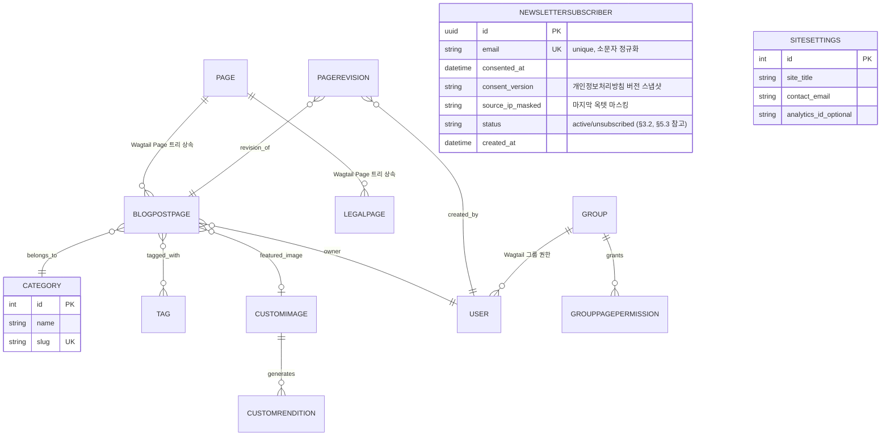

# 03. 시스템 설계서 — 신규 블로그/콘텐츠 사이트 (Python + Wagtail + PostgreSQL(Neon) + Render)

- 작성 에이전트: `03-system-designer`
- 입력: `docs/harness/02-planning.md`(v1.2, PASS), `docs/harness/01-trend-analysis.md`(PASS), `docs/harness/decisions.md`(DEC-001~040), `docs/harness/traceability.md`, `docs/harness/feature-WU-01-integration-test.md`(FAIL, DEF-001 — v1.2 규칙F 재작업 트리거), `docs/harness/09-security-audit.md`(FAIL, DEF-09-01 — v1.3 규칙F 재작업 트리거), `docs/harness/units/unit-09-note.md`, `webapp/config/urls.py`, `webapp/subscribers/admin.py`
- 작성일: 2026-09-16 (최초) / 2026-09-16 (v1.2 규칙F 재작업) / 2026-09-17 (v1.3 규칙F 재작업)
- 버전: v1.3 (규칙F 재작업 — 09단계 보안검증 FAIL(DEF-09-01, High) 근본원인 대응. **§5.1만 보완, 나머지 섹션은 v1.2와 완전히 동일.** §10 변경이력 참고)

---

## 0. 범위 및 전제

- **WU-12(수익화 기능: REQ-022~024)는 이번 3단계 설계 범위에서 명시적으로 제외한다.** DEC-005(2026-09-16, 사용자 응답)에 따라 수익화 모델은 "완전 무료"로 이미 확정되었으므로, 02번 §11 Q1은 해소되었다 — 다만 그 결론이 "결제/광고 기능을 만든다"가 아니라 "만들지 않는다"이므로, 결과적으로 REQ-022~024/WU-12는 답변 대기 상태가 아니라 **명시적으로 설계 대상에서 배제된 상태**로 확정된다. 결제 게이트웨이, 광고 SDK, 구독자 과금 스키마는 이 설계서 어디에도 포함하지 않는다. 향후 수익화 정책이 바뀌면 규칙 F(피드백 루프)에 따라 이 설계서부터 재작업한다.
- 이 설계서는 02번의 Must/Should 범위(REQ-001~017 In-Scope, REQ-018~020 Could)를 커버 대상으로 하며, Could 항목(REQ-018~020)은 아키텍처에 영향이 없도록 확장 가능한 형태로만 자리를 마련해두고 v1 필수 구현으로 다루지 않는다.
- **비가역적 결정(프레임워크/DB/오브젝트 스토리지/인증방식/핵심 스키마)은 모두 이번 단계에서 에이전트 자체 판단으로 확정하고, 근거와 함께 `docs/harness/decisions.md`에 DEC-006~DEC-012로 기록했다** (규칙 G). 판단 근거는 01번 조사 결과에 더해, 이번 단계에서 Render/Neon/Cloudflare R2 공식 문서를 Bash(`curl`)로 직접 조회해 재확인한 최신 수치를 사용했다(아래 §3, §7 각주에 출처 URL과 조회일 명시). 01번은 다수 3rd-party 출처를 인용했는데, 이번 조회 결과 일부 수치가 갱신되어 있어 §2.2에서 정정 사항을 명시했다.
- 이번 단계에서 사용자에게 반드시 확인받아야 할 만큼 두 갈래 이상으로 해석이 갈리고 결과가 실질적으로 달라지는 미해결 쟁점은 발견되지 않았다 (§8에서 재확인). 단, 확인이 안 된 세부 사항은 "확인 필요"로 명시하고 담당 단계를 지정했다(§2.6, §6.4 등).

---

## 1. 아키텍처 개요

### 1.1 컴포넌트 구성

단일 모놀리식 Django(+Wagtail) 애플리케이션을 Render 웹 서비스 1개로 배포하고, 데이터는 Neon PostgreSQL에, 미디어/백업 파일은 Cloudflare R2에 저장한다. 정기 백업은 Render가 아닌 GitHub Actions 스케줄 워크플로로 분리해 "앱이 죽어도 백업 잡은 독립적으로 동작"하는 장애 격리를 확보한다.

**설계 원칙(과설계 방지)**: 이 프로젝트는 1인/소규모 운영(02 가정 A1), 무료·비영리 MVP(DEC-005), 월간 목표 500 UV(02 §5) 규모다. 마이크로서비스 분리, 메시지 큐, 별도 캐시 서버(Redis), 서킷브레이커 라이브러리 등은 "나중에 트래픽이 실제로 문제가 될 때" 도입 대상으로 명시적으로 보류한다(§6.4, §8).

```mermaid
flowchart LR
    U["방문자 브라우저"] -->|HTTPS| RW["Render 웹 서비스 (무료 티어)\nGunicorn+Uvicorn(ASGI)\nDjango 5.2 LTS + Wagtail 7.4 LTS"]
    ED["운영자/에디터\n(Wagtail 어드민)"] -->|HTTPS, 세션 인증| RW
    READER["구독 신청자\n(이메일만, 무인증)"] -->|POST /newsletter/subscribe/| RW
    RW -->|psycopg, TLS| NEON[("Neon PostgreSQL\n(managed, scale-to-zero)")]
    RW -->|S3 API, boto3| R2PUB[("Cloudflare R2\nmedia-public 버킷")]
    RW -->|WhiteNoise| STATIC["정적 CSS/JS\n(Django 프로세스 내 서빙)"]
    RW -.->|500 에러 발생 시 이메일| OPS["운영자 이메일\n(Django AdminEmailHandler)"]
    RENDERPLAT["Render 플랫폼"] -.->|사용량 한도 임박 시 이메일(공식 기능)| OPS
    GHA["GitHub Actions\n(cron 스케줄, 1일 1회)"] -->|pg_dump, TLS| NEON
    GHA -->|S3 API, 업로드| R2BAK[("Cloudflare R2\nbackup-private 버킷\nLifecycle 14일 자동 만료")]
    GHA -.->|워크플로 실패 시 이메일(GitHub 기본기능)| OPS
```

### 1.2 모듈 경계 (Django app 단위)

| App | 책임 | 관련 REQ |
|---|---|---|
| `blog` | 콘텐츠 모델(Page 상속), 카테고리/태그, 공개 목록/상세 뷰, RSS, 사이트맵, JSON-LD 구조화데이터 | REQ-001~005, 014, 017, 018(자리만) |
| `media_storage`(설정 모듈, 별도 앱은 아님) | Wagtail 이미지/문서 모델을 R2에 연결하는 storages 설정 | REQ-006 |
| `subscribers` | 뉴스레터 이메일 수집(REQ-016), 스팸 방지, 동의 기록 | REQ-016 |
| `legal` | 개인정보처리방침/이용약관/쿠키고지 페이지(Wagtail Page 상속) + 콘텐츠 정책(REQ-015) 게시 | REQ-007~009, 015 |
| `core` | 헬스체크, robots.txt, 사이트 전역 설정(SiteSettings), 콜드스타트 안내 뷰 | REQ-011, 012 |
| Wagtail 내장(`wagtail.admin`, `wagtail.users` 등) | 편집 워크플로, 리비전, 어드민 인증/권한 | REQ-001, 010 |

**경계 원칙**: `subscribers`(개인정보 취급)와 `blog`(공개 콘텐츠)를 분리해, 향후 개인정보 관련 요건이 강화되어도(예: GDPR REQ-021 재작업) `blog` 도메인 로직을 건드리지 않고 `subscribers`만 격리해 수정할 수 있게 한다 — 이것이 장애/변경 격리 관점의 핵심 설계 판단이다.

---

## 2. 기술 스택 선정 및 근거

> 아래 스택 확정은 모두 비가역적(High) 결정이며, `docs/harness/decisions.md` DEC-006~DEC-012에 근거와 함께 기록했다(규칙 G).

### 2.1 웹 프레임워크/CMS — **Wagtail (Django 5.2 LTS 위에서 동작, Wagtail 7.4 LTS 계열)** [DEC-006]

01 §3-1 비교표를 근거로 Wagtail과 Django-CMS 두 후보를 재검토했다.

| 판단 기준 | Wagtail | Django-CMS |
|---|---|---|
| PostgreSQL 네이티브 지원 | 지원(프로덕션 권장 DB) | 지원 (Django ORM 공통) |
| Render 배포 용이성 | Render 공식 Django 가이드(render.com/docs/deploy-django, 2026-09-16 직접 조회로 재확인)를 그대로 적용 가능 + Wagtail 전용 실전 가이드 다수(01 §3-1) | Django 앱이므로 이론상 가능하나 특화된 배포 사례가 상대적으로 적음(01 §3-1) |
| 유지보수 활발도 | 공식 릴리스 노트(docs.wagtail.org, 2026-09-16 직접 조회)에서 **Wagtail 8.0(최신)과 7.4(LTS)**가 확인됨 — LTS가 7.0→7.4로 갱신되어 있어 01번 조사 시점(7.0 LTS) 대비 최신 유지보수 사이클이 계속 활발히 돌고 있음을 재확인 | 01번 조사에서 "확인 필요"로 남았고, 이번 조사에서도 별도 재확인 못함(아래 §2.6 확인 필요 항목) |
| 블로그/콘텐츠 사이트 적합성 | 구조화된 콘텐츠 타입 + 편집 워크플로(임시저장/예약발행/리비전)가 Page 모델에 기본 내장 → REQ-001을 프레임워크 차원에서 대부분 충족 | "자유 배치 에이전시형" 철학(플레이스홀더 편집)으로, 정형화된 블로그 포스트보다 랜딩페이지형 사이트에 강점(01 §3-1) |

**결론**: 02 §2(페르소나 1인/소규모 운영, 가정 A1)와 REQ-001(임시저장·예약발행·리비전)이 정확히 Wagtail의 핵심 강점과 일치하고, Django-CMS는 LTS/릴리스 정보가 불확실해 "되돌리기 어려운 결정을 불확실한 근거로 내리지 않는다"는 원칙에 부합하지 않는다. **Wagtail을 최종 채택한다.**

- **버전 고정 방침**: 최신 릴리스인 8.0(비-LTS)이 아니라 **7.4 LTS**를 채택한다. 이유: 1인/소규모 팀(가정 A1)이 잦은 메이저 업그레이드 대응 부담을 지지 않도록, "최신"보다 "보안 패치가 안정적으로 오는 버전"을 우선한다(과설계/유행 추종 금지 원칙). Django 쪽도 대응하는 LTS인 **5.2 LTS**를 고정한다.
- **확인 필요(5단계 착수 시 재확인)**: Wagtail 7.4가 정확히 Django 5.2 LTS만 지원하는지, 혹은 5.2/6.x를 함께 지원하는지는 이번 조사로 릴리스 노트 본문까지 전수 확인하지 못했다. WU-01(프로젝트 초기 설정) 착수 시 `pip install wagtail==7.4.*`를 실행하기 직전에 공식 호환 매트릭스(docs.wagtail.org/en/stable/releases/)를 재확인해야 한다.
- **라이선스**: Wagtail은 BSD-3-Clause(2026-09-16, `github.com/wagtail/wagtail`의 `LICENSE` 파일을 직접 조회해 확인) — 상용/배포 목적과 충돌 없음.

### 2.2 데이터베이스 — **Neon PostgreSQL (Free Plan)** [DEC-004에서 이미 확정, 이번 단계는 세부 스펙만 재확인]

Neon 공식 pricing 문서(neon.com/docs/introduction/plans, 2026-09-16 직접 조회)로 재확인한 최신 Free 플랜 스펙은 다음과 같다.

| 항목 | 01번 조사(3rd-party 출처) | 이번 공식 문서 재확인 결과(2026-09-16) |
|---|---|---|
| 프로젝트 한도 | "프로젝트 1개 한도" | **프로젝트 최대 100개**(Free 플랜에 포함) — **정정**: 01번 인용 3rd-party 출처(getautonoma.com)가 최신 정책을 반영하지 못한 것으로 판단됨 |
| 컴퓨트 | 월 100 컴퓨트시간, 최대 2 CU | **프로젝트당 월 100 CU-hour**, 오토스케일 최대 2 CU(8GB RAM) — 일치 |
| 저장용량 | 0.5GB | **프로젝트당 0.5GB** — 일치 |
| scale-to-zero | 유휴 시 자동 정지 | 유휴 시 컴퓨트 자동 정지(과금 없음) — 일치 |
| PITR(instant restore) | 6시간 | **6시간, 최대 1GB-month 변경이력까지, 무료** — 일치, 세부 상한(1GB) 확인됨 |
| Object Storage(신규 발견) | 언급 없음 | Neon이 베타로 S3 호환 Object Storage를 자체 제공(Free 플랜 프로젝트당 5GB) — §2.3에서 오브젝트 스토리지 후보로 검토 후 기각 |

이 프로젝트는 1개 프로젝트만 사용하므로 "100개 한도" 정정은 실무 영향이 크지 않지만, "1개 한도"라는 잘못된 전제로 향후 스테이징/프로덕션 분리 등을 설계에서 배제하지 않도록 정정해 둔다.

**핵심 스키마 확정 방침**: Wagtail의 Page 트리 모델(계층형 콘텐츠)과 Django ORM 마이그레이션 체계를 그대로 사용한다(§3). 이는 프레임워크 선택에 종속된 비가역적 구조이므로 DEC-007에 별도로 기록했다.

### 2.3 오브젝트 스토리지 — **Cloudflare R2** [DEC-008, REQ-006 대응]

01 §6/§8-3에서 이미 "Render 컨테이너는 파일시스템이 임시적이라 이미지 업로드는 S3 호환 오브젝트 스토리지가 필수"라고 확정했다. 이번 단계에서 벤더를 확정하기 위해 3개 후보를 공식 문서 기준으로 비교했다(전부 2026-09-16 직접 조회).

| 후보 | 무료 티어 | 이그레스(다운로드) 비용 | 성숙도/프로덕션 적합성 | 상업적 이용 |
|---|---|---|---|---|
| **Cloudflare R2** (채택) | 저장 10GB, Class A(쓰기류) 100만 회/월, Class B(읽기류) 1,000만 회/월 (developers.cloudflare.com/r2/pricing) | **무료 (영구, 모든 스토리지 클래스 공통 정책)** | 정식 GA 제품, "프로덕션 비권장" 문구 없음 | 제한 없음 |
| AWS S3 | 프리티어 존재하나 기간 한정(신규 계정 12개월)이라 장기 운영 전제와 불일치 | 유료(트래픽 증가 시 비용이 가장 큰 변수) | 가장 성숙, 업계 표준 | 제한 없음 |
| Neon Object Storage(신규 발견) | 프로젝트당 5GB, 베타 기간 무료 | 베타 종료 후 과금 예정(요율 공개됨) | **베타 단계** — 프로덕션 의존 리스크, DB 벤더와 스토리지 벤더가 한 곳에 묶여 장애 격리가 약해짐 | 베타 이용약관 별도 확인 필요 |

**결론**: 이 사이트는 블로그 이미지가 AI Overviews/소셜 공유 등으로 예측 불가능하게 트래픽이 튈 수 있는 퍼블릭 콘텐츠라, **이그레스 비용이 0으로 고정되는 R2**가 "트래픽이 늘수록 청구서가 무서워지는" 구조를 원천적으로 피한다(무료·비영리 MVP라는 DEC-005 제약과 정확히 부합). Neon Object Storage는 베타 상태라 SLA/API 안정성이 검증되지 않았고, DB·스토리지 장애 지점을 한 벤더에 몰아넣는 것은 장애 격리 원칙에 반해 기각한다.

- **연동 방식**: `django-storages`(BSD-3-Clause, `github.com/jschneier/django-storages`의 `LICENSE` 파일 직접 조회로 확인) + `boto3`(Apache-2.0)의 `S3Boto3Storage`를 R2의 S3 호환 엔드포인트(`AWS_S3_ENDPOINT_URL`)로 지정해 사용한다. Wagtail의 `Image`/`Document` 모델은 Django `Storage` 백엔드를 그대로 따르므로 코드 변경 없이 설정만으로 연동된다.
- **버킷 분리(보안/장애 격리)**: `media-public`(이미지, 공개 읽기 전용 정책) / `backup-private`(pg_dump 백업, 비공개, §5.6·§7.5)로 물리적으로 분리한다. 하나의 버킷에 공개 자산과 백업을 섞으면 버킷 정책 실수 한 번으로 백업이 인터넷에 노출되는 사고가 날 수 있기 때문이다.
- **크롤링/이용약관 확인**: R2는 우리가 소유한 데이터를 저장하는 인프라 서비스이며 외부 콘텐츠를 크롤링하는 대상이 아니므로 "크롤링 허용 여부" ToS 검토는 해당 없음. 상업적 이용 가능 여부는 Cloudflare 공식 가격 문서상 제한 문구가 없어 문제없음으로 판단한다(전체 이용약관 원문의 법적 검토까지는 수행하지 않았음을 명시 — 결제 없이 사용하는 무료 등급 범위 안에서는 리스크 낮음).

### 2.4 배포 — **Render (Web Service, Free → 필요 시 Starter 유료 전환)**

DEC-004로 이미 확정된 사항이며, 이번 단계에서 Render 공식 문서(render.com/docs/free, render.com/docs/deploy-django, 2026-09-16 직접 조회)로 다음을 재확인했다.

- **⚠️ 공식 경고 재확인**: Render 공식 문서 원문에 "Free instances... **Do not use them for production applications**"라는 문구가 명시되어 있다. 이는 01번 조사가 이미 시사했던 무료 티어 리스크(§6, 02 §6)를 축소 평가하지 않기 위해 그대로 인용한다 — v1은 "무료 티어 기반의 공개 베타/저트래픽 MVP"로 명확히 포지셔닝하고, KPI(02 §5: 월 500UV, 가용성 목표) 또는 REQ-012 기준을 넘어서는 순간 유료 Starter 플랜(스핀다운 없음) 전환을 운영 원칙으로 못박는다(§6.3, §8).
- 무료 웹 서비스: 15분 무요청 시 스핀다운, 재기동 약 1분, **재기동 중 Render가 자체적으로 로딩 페이지를 자동 표시**(공식 확인 — REQ-011 요건의 상당 부분을 플랫폼이 기본 제공).
- 월 750 Free 인스턴스시간/워크스페이스, 소진 시 해당 월 전체 서비스 suspend. 매월 초 750시간으로 리셋(이월 없음).
- 컨테이너 파일시스템은 ephemeral(재시작/재배포/스핀다운마다 초기화) — REQ-006(R2 필수 연동) 결론을 재확인.
- **로컬 Free Postgres는 사용하지 않는다**(30일 만료 + 백업 미지원, DEC-004 근거 재확인) — Neon만 사용.
- 배포 파이프라인은 Render 공식 가이드 패턴을 그대로 따른다: `build.sh`(의존성 설치 → `collectstatic` → `migrate`) → `gunicorn mysite.asgi:application -k uvicorn.workers.UvicornWorker` 기동. 별도의 "pre-deploy 훅" 기능이 아니라 빌드 스크립트 안에서 마이그레이션까지 수행하는 것이 Render 공식 권장 패턴임을 확인했다(§3.3 롤백 전략과 연결).
- 롤백: Render는 **최근 2개 배포까지만** 원클릭 롤백을 지원한다(공식 확인, 무료/유료 공통). 이 제약이 §3.3 마이그레이션 원칙(하위호환 마이그레이션)의 직접적 근거다.
- 정적 파일: WhiteNoise가 Django 프로세스 안에서 직접 서빙(별도 CDN/스토리지 불필요, REQ-006과 별개로 CSS/JS는 R2에 두지 않음 — 과설계 방지).
- 환경변수: `RENDER_EXTERNAL_HOSTNAME`(Render가 자동 주입, `ALLOWED_HOSTS`에 사용), `SECRET_KEY`/`DATABASE_URL`/R2 자격증명은 Render 대시보드의 Environment Variables에서만 관리하고 저장소에는 절대 커밋하지 않는다(§5.4).

### 2.5 캐싱 전략 — **Django LocMemCache (v1), Redis/Render Key Value는 범위 밖** [DEC-012]

퍼블릭 목록/상세 뷰에 Django 뷰 캐시(5~15분 TTL, `LocMemCache`)를 적용해 Neon의 월 100 CU-hour 무료 컴퓨트 예산을 동일 쿼리 반복 실행으로 소진하지 않도록 보호한다. Render는 별도로 무료 Key Value(Redis 호환) 인스턴스도 제공하지만, 현재 트래픽 규모(월 500UV 목표)에서는 분산 캐시가 주는 이득 대비 운영 복잡도(추가 서비스, 추가 장애 지점, 750시간 예산에 대한 영향 불명확)가 크다고 판단해 **v1 범위에서 명시적으로 제외**한다. 트래픽이 실제로 늘어 프로세스 재시작마다 캐시가 매번 콜드해지는 것이 체감 성능 문제가 될 때 재검토한다(과설계 방지 원칙).

### 2.6 기타 라이브러리 및 라이선스 확인

| 용도 | 후보 | 라이선스 | 확인 결과 |
|---|---|---|---|
| 태그 | django-taggit | MPL-2.0/BSD 계열로 널리 알려짐 | **확인 필요** — 5단계 착수 시 정확한 SPDX 라이선스를 재확인하고 상용 배포와 충돌 없는지 재확인할 것 (규칙 원칙: 확신 없으면 임의 채택 금지) |
| 정적파일 서빙 | WhiteNoise | MIT (업계 통용) | 상용 이용 문제 없음 |
| 로그인 무차별대입 방어 | django-axes 또는 django-ratelimit | 대체로 MIT/BSD 계열로 알려짐 | **확인 필요** — 5단계에서 실제 패키지 선정 시 라이선스 원문 재확인. (v1.3 갱신) WU-09는 실제로 이 후보들을 채택하지 않고 §5.1이 지시한 대로 기존 `LocMemCache` 카운터 패턴(DEC-029)을 재사용해 이 "확인 필요" 자체를 회피했다 — 아래 §5.1 참고 |
| DB 연결 문자열 파싱 | dj-database-url | BSD | Render 공식 가이드에서 표준으로 사용, 문제 없음 |

이 표의 "확인 필요" 항목은 설계를 막는 수준의 리스크는 아니지만(모두 널리 쓰이는 순수 유틸리티이며 GPL 계열 카피레프트 신호가 없음), 규칙에 따라 임의로 "문제없다"고 단정하지 않고 5단계(구현) 착수 시점에 재확인하도록 명시적으로 남긴다.

---

## 3. 데이터 모델

### 3.1 ERD



### 3.2 엔티티 설명

- **BlogPostPage** (Wagtail `Page` 상속): `title`, `slug`, `intro`, `body`(StreamField — 문단/이미지/인용/FAQ블록 등 콘텐츠 타입), `category`(FK), `tags`(`django-taggit` M2M), `featured_image`(FK, nullable). Wagtail `Page`가 기본 제공하는 `live`, `has_unpublished_changes`, `go_live_at`, `expire_at`, `first_published_at`, `last_published_at`, `owner`, 리비전 이력(`PageRevision`)을 그대로 사용 — **REQ-001(임시저장/예약발행/리비전)은 커스텀 개발 없이 Wagtail 코어 기능으로 충족**된다는 것이 이번 설계의 핵심 절감 포인트다.
- **Category**: 별도 Wagtail Snippet 모델(관리자가 어드민에서 CRUD). REQ-002.
- **Tag**: `django-taggit`의 `TaggedItemBase` 표준 패턴(Wagtail 공식 권장 방식). REQ-002.
- **CustomImage/CustomRendition**: Wagtail 기본 `Image` 모델을 상속해 `django-storages`의 R2 백엔드로 저장 경로를 연결. REQ-006.
- **NewsletterSubscriber**: Wagtail Page가 아닌 순수 Django 모델(공개 콘텐츠 트리와 무관). `email`은 유니크 제약 + 소문자 정규화 후 저장(중복 구독 방지, 대소문자 우회 방지). `consent_version`은 구독 시점의 개인정보처리방침 버전 문자열을 스냅샷으로 저장해, 나중에 방침이 바뀌어도 "그 시점에 무엇에 동의했는지" 추적 가능하게 한다(개인정보 처리 근거 입증 목적). `status`(`active`/`unsubscribed`) 필드는 **v1에서 자동으로는 절대 `unsubscribed`로 전환되지 않는다** — v1은 더블옵트인/발송 인프라가 없어(가정 A9, §5.3) 자동 구독취소 링크를 만들 수 없기 때문이다. 이 필드는 향후 발송 인프라 WU에서 원클릭 구독취소 기능을 추가할 때를 대비한 **선제적(forward-compatible) 스키마**이며, v1의 실제 삭제 경로는 §5.6에 명시한 대로 운영자의 수동 하드 삭제뿐이다 — 이 구분을 코드 주석/운영 문서에 명확히 남길 것을 5단계에 요구한다. REQ-016.
- **LegalPage**: 개인정보처리방침/이용약관/쿠키고지 3종을 각각 별도 `Page` 서브클래스(또는 공통 `RichTextPage` 1개 모델을 재사용)로 관리해 운영자가 Wagtail 어드민에서 직접 수정·이력 관리(Wagtail 리비전 기능을 그대로 활용해 "방침 변경 이력"까지 자동으로 남는다는 부가 이점이 있다). REQ-007~009.
- **SiteSettings**: Wagtail `BaseSiteSetting`. 연락처 이메일, 애널리틱스 ID(선택) 등 전역 설정. REQ-005/007 지원.
- **User/Group/GroupPagePermission**: Django/Wagtail 내장 인증·권한 모델을 그대로 사용(신규 스키마 설계 없음, §5.1). REQ-010.

**의도적으로 만들지 않은 모델**: 결제/구독 플랜/광고 노출 로그(§0, DEC-005), 댓글/회원(REQ-019/026, Out-of-Scope), 백업 이력 테이블(GitHub Actions 실행 로그 + R2 오브젝트 목록으로 충분히 감사 가능 — DB에 별도 로그 테이블을 두는 것은 과설계로 판단).

### 3.3 마이그레이션 전략

- Django/Wagtail 표준 `makemigrations`/`migrate`를 그대로 사용한다. 별도 마이그레이션 도구(Alembic 등)는 도입하지 않는다(Django ORM 생태계 안에서 표준 도구가 충분).
- Render 배포 시 `build.sh`의 마지막 단계에서 `python manage.py migrate --noinput`을 실행한다(§2.4, Render 공식 패턴).
- **하위호환 마이그레이션 원칙(롤백 가능성 확보)**: Render 롤백은 "최근 2개 배포"까지만 코드를 되돌릴 뿐, DB 스키마를 자동으로 되돌리지 않는다(§2.4에서 확인한 공식 제약). 따라서:
  1. 컬럼/테이블 삭제는 반드시 2단계 배포로 나눈다(1차: 코드에서 참조 제거 및 배포 안정화 확인 → 2차: 실제 컬럼/테이블 삭제 마이그레이션).
  2. NOT NULL 제약 추가처럼 기존 데이터와 충돌 가능한 마이그레이션은 배포 전 스테이징 없이 프로덕션에 직접 적용하지 않는다(스테이징 환경 유무는 §8 미해결 사항 참고).
  3. **destructive 마이그레이션(삭제/타입변경) 배포 직전에는 반드시 수동으로 `pg_dump` 스냅샷을 R2 `backup-private` 버킷에 남긴다** — Neon PITR(6시간)만 믿지 않는다(REQ-013).

---

## 4. API/인터페이스 명세

이 서비스는 SPA/모바일 앱(REQ-027, Out-of-Scope)을 갖지 않으므로 **정식 REST/JSON API는 v1 범위에 없다** — 불필요한 API 서버 레이어를 추가하는 것은 과설계로 판단한다. 대신 서버사이드 렌더링(Django 템플릿) 기반 라우트를 아래와 같이 명세한다. 이 표가 5단계 개발자가 추가 질문 없이 구현을 시작할 수 있는 최소 계약이다.

| Method | Path | 설명 | 인증 | 요청 | 성공 응답 | 실패/예외 응답 |
|---|---|---|---|---|---|---|
| GET | `/` | 블로그 홈(발행글 목록, 페이지네이션) | 없음 | 쿼리파라미터 `page` | 200, HTML | 500(서버오류) |
| GET | `/blog/<slug>/` | 게시물 상세 | 없음 | - | 200, HTML(`live=True`이고 `go_live_at` 도달한 글만 공개) | 404(미공개/예약전/존재하지 않음) |
| GET | `/category/<slug>/` | 카테고리별 목록 | 없음 | `page` | 200, HTML | 404(존재하지 않는 카테고리) |
| GET | `/tag/<slug>/` | 태그별 목록 | 없음 | `page` | 200, HTML | 404 |
| GET | `/feed.xml` | RSS 피드(REQ-004) | 없음 | - | 200, `application/rss+xml` | - |
| GET | `/sitemap.xml` | 사이트맵(REQ-005, `wagtail.contrib.sitemaps`) | 없음 | - | 200, `application/xml` | - |
| GET | `/robots.txt` | robots(REQ-005) | 없음 | - | 200, `text/plain` | **주의**: Render가 스핀다운 상태에서는 앱에 도달하기 전에 플랫폼이 "disallow all" 정적 응답을 가로채 반환한다(§2.4 공식 확인 사항). 앱 코드로 해결 불가능한 플랫폼 제약이므로 §6.3·§8에 리스크로 별도 기록 |
| GET | `/privacy-policy/`, `/terms/`, `/cookies/` | 법적 페이지(REQ-007/008/009) | 없음 | - | 200, HTML | - |
| POST | `/newsletter/subscribe/` | 뉴스레터 구독 신청(REQ-016) | 없음(CSRF 토큰 필수) | `email`(필수), `consent`(체크박스, 필수), `hp_field`(허니팟, 숨김필드) | 200/302 — **이미 구독된 이메일이든 신규든 동일한 성공 메시지를 반환**(이메일 열거 공격 방지, §5.3) | 400(형식 오류/동의 누락), 429(레이트리밋 초과), `hp_field`에 값이 있으면 200으로 위장 응답하되 실제 저장은 하지 않음(봇 대응) |
| GET | `/healthz` | 운영용 헬스체크 | 없음(내부용, 필요시 IP 제한 검토) | - | 200, `"ok"` — **DB 접속까지 확인하지 않는 얕은(shallow) 헬스체크**로 설계(Neon 콜드스타트 중 오탐으로 인한 불필요한 재시작/알림을 피하기 위함, 트레이드오프 명시) | - |
| ALL | `/cms-admin/...` | Wagtail 관리자(REQ-001/002/010). 기본 경로 `/admin/`에서 변경(자동화 공격 노이즈 감소) | 세션 쿠키 + Wagtail 그룹 페이지 권한 | - | 200/302 | 401/403(권한 없음), 로그인 실패 다회 시 레이트리밋(§5.2) |

**에러 응답 형식(공통)**: 이 서비스는 HTML 우선이므로 4xx/5xx도 브랜디드 HTML 에러 페이지로 응답한다(JSON 에러 바디는 v1에서 필요 없음). 폼 검증 실패(`/newsletter/subscribe/`)는 같은 페이지에 인라인 에러 메시지로 렌더링한다.

---

## 5. 보안 설계 원칙

### 5.1 인증/인가 모델 [DEC-009, DEC-029, DEC-039, DEC-040 — v1.3 규칙F 재작업]

> **v1.3 재작업 배경**: 09단계 보안검증(`09-security-audit.md`, FAIL)이 **DEF-09-01(High)**을 실측으로 재현했다(`webapp/.harness-tmp/venv_09_sec`, `django.test.Client`로 동일 IP 11회 연속 POST) — WU-09가 `/cms-admin/login/`(Wagtail)에만 `RateLimitedLoginView`(IP 기준 레이트리밋, DEC-029)를 적용했고, 같은 `config/urls.py`가 함께 마운트하는 `/django-admin/login/`(Django 기본 관리자, `django.contrib.admin`)에는 어떤 방어도 없어 11회 연속 로그인 실패에도 200이 반복되고 429가 전혀 발생하지 않았다. 두 경로는 **동일한 `auth_user` 슈퍼유저 계정을 공유**한다(SEC-03). 근본 원인은 이 §5.1의 v1.2 이전 버전이 "관리자 로그인에 무차별대입 방어 필수"라고만 서술했을 뿐, 이 프로젝트에 로그인 폼을 제공하는 관리자 진입점이 실제로 **2개** 존재한다는 사실과 "그 전부에 예외 없이 적용해야 한다"는 것을 명시하지 않았던 데 있다(DEC-039). 아래는 그 누락을 보완한 내용이다 — DEC-009(인증모델 자체)와 DEC-029(IP-only 레이트리밋 설계)의 기존 결정은 그대로 유지하고, **적용 범위만 명확히 한다.**

- **운영자/에디터**: Django 세션 기반 인증(쿠키, `HttpOnly` + `Secure` 속성) + Wagtail 그룹 기반 페이지 권한(Editor/Moderator 등 Wagtail 표준 그룹 활용). OAuth/SSO/JWT는 도입하지 않는다 — 1인/소규모 운영(가정 A1)에서 외부 IdP 연동은 과설계이며, Django 내장 인증으로 충분하다.
- **독자/구독자**: 계정을 만들지 않는다(회원제 Out-of-Scope, REQ-024). 뉴스레터 구독은 이메일만 수집하는 무인증 공개 엔드포인트다.

- **관리자 진입점 인벤토리(v1.3 신규, 필수 확인 사항)**: 이 프로젝트는 `webapp/config/urls.py`에 서로 다른 로그인 폼을 제공하는 관리자 진입점이 **정확히 2개** 등록되어 있으며, 둘 다 동일한 `auth_user` 테이블의 슈퍼유저 계정을 공유한다(DEC-009가 이미 "어드민 계정이 사이트 전체 콘텐츠에 대한 단일 장애점"이라고 인정한 그 계정과 동일).
  1. `/cms-admin/login/` — Wagtail 관리자(콘텐츠/이미지/권한 관리, DEC-006/007에 따른 유일한 **운영** 관리 인터페이스, DEC-009).
  2. `/django-admin/login/` — Django 기본 관리자(`django.contrib.admin`).

  **이 두 번째 진입점을 단순 잔재로 보고 라우트 자체를 제거할 수 있는지를 먼저 코드로 확인했다**(09단계 SEC-04의 발견을 이번 재작업에서 `webapp/subscribers/admin.py`를 직접 재조회해 재확인): `NewsletterSubscriberAdmin`이 §5.6(개인정보 파기절차)이 명시한 "탈퇴 요청 시 운영자가 하드 삭제"의 **유일한 실제 구현 경로**로 이 관리자에만 등록되어 있다(`has_add_permission`/`has_change_permission`이 모두 `False`인 목록·검색·삭제 전용 화면). Wagtail 어드민에는 이 모델이 등록되어 있지 않다. 그 밖에 `auth.Group`(Wagtail이 이미 `/cms-admin/groups/`로 동등한 화면을 제공하므로 중복)이나 `django_celery_beat` 같은 Django 기본 관리자 전용 의존 모델은 이 프로젝트의 `INSTALLED_APPS`(§2)에 존재하지 않는다. 즉 **`/django-admin/`은 실제로 쓰이는 필요 기능이며, 단순 제거 대상이 아니다.**

- **채택 옵션(비가역적 결정, DEC-040)**: 위 인벤토리 확인 결과에 따라, 검토한 두 옵션 중 **옵션 2("두 진입점을 유지하되 둘 다 동등하게 방어")를 채택**하고 옵션 1("`/django-admin/` 라우트 자체 제거")은 **기각**한다.
  - 옵션 1을 적용하려면 §5.6 파기절차의 유일한 구현(`NewsletterSubscriberAdmin`)을 먼저 다른 경로(예: Wagtail `ModelAdmin`/Snippet)로 이관하는 선행 작업이 필요하다 — 이는 이미 검증된 §5.6/WU-06 개인정보 처리 경로 자체를 바꾸는 범위 확장이며, 이번 재작업의 목표(누락된 로그인 방어를 시정하는 것)를 벗어난다. 지금 라우트를 지우면 개인정보 삭제권(파기절차)을 이행할 유일한 수단이 함께 사라지는 더 큰 리스크를 만든다.
  - 옵션 2는 이미 검증되어 동작 중인 패턴(`core/admin_auth.py`의 `is_rate_limited()`)을 재사용하는 것만으로 해소되며, 코드 변경 범위가 작고(신규 뷰 1개 + URL 1줄) 되돌리기 쉽다.
  - **무차별대입 방어는 "로그인 폼을 제공하는 모든 진입점"에 예외 없이 적용되어야 하는 필수(Should 아님) 요구사항이다.** 향후 로그인 폼을 제공하는 진입점이 추가되면(예: 제3의 관리 도구), 신규 진입점 추가 시점에 이 원칙을 반드시 함께 적용해야 한다 — "Wagtail 어드민을 만들 때만 한 번 챙기면 되는 항목"으로 좁게 해석하지 않는다.

- **구현 지침(5단계 WU-09 재작업이 그대로 따를 것, 코드 자체는 이번 설계 재작업 범위 밖)**:
  1. `webapp/core/admin_auth.py`에 Django 기본 관리자 로그인용 뷰(예: `RateLimitedAdminLoginView`, `django.views.View` 상속)를 추가한다. `dispatch()`에서 기존 `is_rate_limited(ip)` 함수를 **새로 만들지 않고 그대로 재사용**하고, POST가 임계값(현재 IP당 15분/10회, DEC-029)을 넘으면 기존과 동일한 429 응답을 반환하며, 넘지 않으면 `django.contrib.admin.site.login(request, *args, **kwargs)`에 위임한다(Wagtail 쪽 `RateLimitedLoginView`가 Wagtail 로그인 뷰에 위임하는 것과 동일한 패턴).
  2. **카운터는 `/cms-admin/login/`과 `/django-admin/login/`이 공유해야 한다** — `is_rate_limited(ip)`는 IP만을 캐시 키로 쓰고 경로를 구분하지 않으므로 별도 조치 없이 자동으로 공유된다. 이는 의도된 설계다: 두 진입점이 동일한 `auth_user` 계정을 공유하는 이상(위 인벤토리), 만약 카운터가 URL별로 분리되어 있다면 공격자가 시도를 두 URL에 절반씩 분산해 실질적인 예산을 2배(IP당 20회)로 늘리는 우회가 가능해진다. 카운터를 공유해 이 우회를 원천 차단한다 — 5단계 구현자는 이 카운터를 URL별 별도 키로 재설계하지 않는다.
  3. `webapp/config/urls.py`에서 `path("django-admin/", admin.site.urls)`보다 **앞에** 아래 패턴을 추가한다(기존 `cms-admin/login/` 오버라이드와 동일한 배치 원칙):
     ```python
     path("django-admin/login/", RateLimitedAdminLoginView.as_view(), name="admin_login"),
     path("django-admin/", admin.site.urls),
     ```
     Django 내부적으로 `reverse("admin:login")`을 호출하는 경로(비로그인 사용자가 보호된 관리자 페이지에 접근했을 때의 리다이렉트 등)는 `admin.site.urls`가 여전히 등록하는 동일한 리터럴 경로(`django-admin/login/`)를 그대로 가리키므로 깨지지 않는다 — 실제 HTTP 요청만 urlpatterns 순서상 앞선 우리 뷰가 먼저 가로챈다. 기존 `wagtailadmin_login` 오버라이드가 이미 이 방식으로 동작 중임을 근거로 삼는다(`config/urls.py` 기존 주석 참고).
  4. 6단계(단위테스트)는 09단계 SEC-02와 동일한 방법(`Client()`로 동일 IP 11회 연속 POST)을 `/django-admin/login/`에도 재실행해 11번째에 429가 나오는지 확인하고, 두 URL에 걸쳐 시도를 분산해도(예: `/cms-admin/login/` 5회 + `/django-admin/login/` 6회, 동일 IP) 11번째 시도에서 429가 나오는지(카운터 공유 검증)를 회귀 테스트로 추가한다.
  5. `webapp/ADMIN_ACCESS_GUIDE.md`(WU-09 산출물)에도 두 로그인 경로 모두 동일한 레이트리밋이 적용됨을 반영한다.

- **관리자 어드민 경로 변경 원칙(v1.3, 범위 명확화)**: `/admin/` → `/cms-admin/`으로 변경해 자동화된 무차별 대입 시도 노출을 줄이는 조치는 Wagtail 어드민에만 적용되며(Django 기본 관리자는 이미 비표준 경로 `/django-admin/`으로 마운트되어 있어 별도 변경이 필요 없다), **"경로 난독화"와 "무차별대입 방어(레이트리밋)"는 서로 다른 통제이며 하나가 다른 하나를 대체하지 않는다.** DEF-09-01의 근본 원인은 이 두 통제를 구분하지 않고, 경로 변경 이력이 있는 진입점만 레이트리밋까지 적용하는 암묵적 가정이 있었던 것이다 — **두 통제(경로 난독화 + 레이트리밋) 모두, 로그인 폼을 제공하는 두 진입점 전부에 예외 없이 적용되어야 한다.**
- **비밀번호 정책**: Django 기본 `AUTH_PASSWORD_VALIDATORS`(최소 길이, 일반 비밀번호 사전 차단 등) 활성화.
- **로그인 무차별대입 방어(v1.3 갱신)**: IP 기준 레이트리밋(DEC-029, `core/admin_auth.py`의 `is_rate_limited()`)을 **`/cms-admin/login/`(Wagtail 관리자)과 `/django-admin/login/`(Django 기본 관리자) 양쪽 모두에 동일하게, 같은 카운터를 공유하며** 적용한다 — 어느 한쪽만 보호하는 것은 두 경로가 동일 계정을 공유하는 이 아키텍처에서 전체 방어를 무력화한다(DEF-09-01, 실측 재현됨). 운영자가 1인/소규모라는 점을 감안해도, 두 어드민 경로가 모두 공개 인터넷에 노출되는 이상 이 방어는 Should가 아니라 **필수**로 취급한다.
- **2FA**: v1 Must는 아니지만, 어드민 계정이 사이트 전체 콘텐츠에 대한 단일 장애점이므로 향후 추가 검토 대상으로 명시해 둔다(과설계 방지를 이유로 완전히 누락시키지는 않음 — 기록만 남기고 v1 구현 범위에서는 제외).

### 5.2 입력 검증 / 출력 처리

- 모든 사용자 입력은 Django Forms/ModelForm 서버사이드 검증을 거친다(클라이언트 검증만 믿지 않음).
- Django 템플릿 엔진의 기본 auto-escaping을 유지하며, `|safe`/`mark_safe` 사용을 원칙적으로 금지하고 예외 시 코드 리뷰에서 별도 근거를 요구한다(XSS 방지).
- Wagtail Rich Text 필드는 Wagtail 자체의 허용 태그 화이트리스트 필터를 통과한 뒤 저장/렌더링된다(에디터가 곧 운영자이므로 신뢰 수준은 높지만, 필터는 그대로 유지해 방어를 이중화한다).
- RSS(`/feed.xml`)·사이트맵(`/sitemap.xml`)·JSON-LD(§4) 등 구조화 출력도 Django 표준 프레임워크(syndication, sitemaps, template auto-escape)를 사용해 자동 이스케이프를 보장한다.
- SQL Injection: Django ORM만 사용하고 raw SQL/문자열 조립 쿼리를 금지한다. 백업(`pg_dump`)은 애플리케이션 코드가 아닌 독립된 CLI 도구이므로 이 원칙의 예외가 아니라 별개 영역이다.
- CSRF: Django CSRF 미들웨어 기본 활성화, `/newsletter/subscribe/` 포함 모든 POST 폼에 CSRF 토큰 필수.

### 5.3 뉴스레터 구독 엔드포인트 보안 및 동작 계약 (REQ-016 관련, 신규 설계 포인트)

- **이메일 열거(enumeration) 공격 방지**: 이미 구독된 이메일로 재요청해도 "이미 구독 중"이라고 알려주지 않고, 신규 구독과 동일한 성공 메시지를 반환한다.
- **중복 제출 시 서버 동작(명시적 계약, 5단계 구현 시 이 규칙을 그대로 따를 것)**:
  1. 요청받은 이메일이 DB에 없으면 → 신규 `NewsletterSubscriber` 레코드 생성(`status=active`).
  2. 이미 존재하고 `status=active`이면 → 새 레코드를 만들지 않고(유니크 제약 위반을 애플리케이션에서 사전 조회로 회피), 필요 시 `consented_at`/`consent_version`만 최신값으로 갱신(멱등 처리).
  3. 이미 존재하고 `status=unsubscribed`이면(§3.2에서 설명한 대로 v1에서는 이 상태로 전환될 자동 경로가 없으므로 이론상 발생하지 않지만, 향후 발송 인프라 WU가 추가된 뒤에는 발생 가능) → `status=active`로 재전환하고 동의 정보를 갱신(재구독 허용).
  4. 세 경우 모두 사용자에게는 **동일한 성공 메시지**를 반환해 이메일 존재 여부를 노출하지 않는다.
- **봇/스팸 방지**: 허니팟 히든 필드(사람은 채우지 않고 봇은 채우는 필드) + IP 기준 레이트리밋. CAPTCHA는 v1에서는 도입하지 않는다(운영 규모 대비 과설계, 허니팟+레이트리밋으로 우선 대응하고 스팸이 실제 문제가 되면 재검토).
- **이메일 검증 수준**: 형식 검증만 수행하고(REQ-016이 "수집까지"만 범위인 02 가정 A9), **더블 옵트인(확인 메일 발송)은 v1에서 구현하지 않는다** — 실제 발송 인프라 자체가 별도 WU로 분리되어 있기 때문(02 가정 A9). 이는 스팸 이메일이 검증 없이 그대로 저장될 수 있다는 트레이드오프를 수반하며, §8에 명시적으로 남긴다.

### 5.4 시크릿/환경변수 관리

- `SECRET_KEY`, `DATABASE_URL`(Neon 연결 문자열), R2 액세스 키/시크릿, GitHub Actions용 별도 DB 자격증명은 전부 코드 저장소에 커밋하지 않는다.
- Render: Environment Variables(대시보드)에서만 값을 입력. `render.yaml`(Infrastructure as Code)을 쓰더라도 시크릿 값은 `sync: false`로 플레이스홀더만 남기고 실제 값은 대시보드에서 채운다(Render 표준 관례).
- GitHub Actions: 리포지토리 Secrets(`Settings > Secrets and variables > Actions`)에 R2/Neon 자격증명을 저장하고, 워크플로 YAML에는 `${{ secrets.* }}`로만 참조한다.
- `.env` 사용 시 `.gitignore`에 반드시 포함.
- 백업용 DB 자격증명은 앱 런타임용 자격증명과 **별도 계정/권한(읽기 전용에 가까운 최소 권한)**으로 분리하는 것을 권장한다 — GitHub Actions라는 별도 신뢰 경계에 프로덕션 전체 쓰기 권한을 그대로 넘기지 않기 위함(최소 권한 원칙).

### 5.5 전송/저장 보안 (v1.2 — 리버스프록시 배포환경 보안설계 보완, 규칙F 재작업)

> **재작업 배경**: 07단계 통합테스터(`feature-WU-01-integration-test.md`, FAIL 판정)가 WU-01을 실제 배포 형태(WSGI+미들웨어+실제 HTTP 요청)로 조립해 검증한 결과, `SECURE_PROXY_SSL_HEADER` 미설정으로 Render 배포 시 **무한 HTTPS 리다이렉트 루프 → 사이트 100% 접근 불가**(DEF-001, Critical)가 대조실험(IT-02/IT-03)으로 실증됐다. 근본 원인은 이 §5.5가 "Render는 로드밸런서에서 TLS를 종료하고 앱에는 평문 HTTP로 전달한다"는 배포 환경 전제 자체를 명시하지 않았던 것이었다(규칙F-1: 근본 원인 발생 단계 소급). 아래는 그 전제와 필수 설정을 보완한 내용이다.

#### 5.5.1 배포 환경 전제 (필수 — 이 전제를 놓치면 아래 설정이 왜 필요한지 이해할 수 없다)

Render 웹 서비스는 자체 로드밸런서(엣지)에서 TLS를 종료하고, **앱 컨테이너에는 평문 HTTP로 요청을 전달**한다. 앱 프로세스(Gunicorn/Uvicorn) 입장에서는 모든 요청이 "TLS 없는 일반 소켓 연결"로 도착하며, 원래 클라이언트가 HTTPS로 접속했는지는 Render 엣지가 붙여주는 `X-Forwarded-Proto: https` 헤더로만 알 수 있다. 이는 Render 고유 현상이 아니라 TLS-종료형 PaaS 리버스 프록시 전반의 표준 아키텍처이며, `feature-WU-01-integration-test.md` IT-03에서 이 헤더 주입을 로컬로 정확히 재현해 실증했다.

이 전제를 놓치면 아래처럼 연쇄적으로 깨진다: ①`SECURE_SSL_REDIRECT=True`(§5.5.2, 기존부터 설정됨)는 매 요청마다 `request.is_secure()`를 확인해 `False`면 HTTPS로 강제 리다이렉트한다 → ②Django는 기본적으로 소켓 레벨 TLS 여부만 보므로, 프록시 뒤에서는 `SECURE_PROXY_SSL_HEADER`를 명시하지 않는 한 `request.is_secure()`가 **항상 `False`**로 판정된다 → ③매 요청이 "HTTP니까 HTTPS로 보내야지"라며 리다이렉트되지만, 그 리다이렉트를 따라간 재요청도 앱에는 똑같이 평문 HTTP로 도착 → ④**무한 리다이렉트 루프**, 사이트 100% 접근 불가. `feature-WU-01-integration-test.md` IT-02(무한루프 재현)/IT-03(설정 유무 대조실험: 없으면 301 반복, 있으면 200)에서 이 인과관계를 실측으로 증명했다.

#### 5.5.2 필수 설정 (production 전용, `config/settings/production.py`)

```python
# Render 엣지가 TLS를 종료하고 앱에는 평문 HTTP로 전달하므로(§5.5.1),
# X-Forwarded-Proto 헤더를 신뢰하도록 명시해야 한다. 이게 없으면
# SECURE_SSL_REDIRECT=True와 결합해 무한 리다이렉트 루프가 발생한다(DEF-001).
SECURE_PROXY_SSL_HEADER = ("HTTP_X_FORWARDED_PROTO", "https")

SECURE_SSL_REDIRECT = True   # 기존 유지
SESSION_COOKIE_SECURE = True # 기존 유지
CSRF_COOKIE_SECURE = True    # 기존 유지
SECURE_HSTS_SECONDS = 60 * 60 * 24 * 7        # 기존 유지 (§5.5 종전 방침)
SECURE_HSTS_INCLUDE_SUBDOMAINS = True          # 기존 유지
```

- **신뢰 경계 주의(스푸핑 조건)**: `SECURE_PROXY_SSL_HEADER`로 `X-Forwarded-Proto` 헤더를 신뢰하는 것은 "앱 컨테이너가 오직 Render 엣지로부터만 트래픽을 받는다(공인 인터넷에서 앱에 직접 도달할 경로가 없다)"는 전제에서만 안전하다. Render 웹 서비스 아키텍처는 기본적으로 이 단일 홉 전제를 만족한다(공식 아키텍처, §2.4). 만약 향후 앱 앞에 추가 프록시가 생기거나 앱에 직접 접근 가능한 경로가 열리면, 클라이언트가 이 헤더를 직접 위조해 `is_secure()`를 속일 수 있으므로 그 시점에 이 설정을 재검토해야 한다(규칙F 재작업 대상).

#### 5.5.3 같은 카테고리(리버스프록시 뒤에서 흔히 빠지는 설정) 전수 점검 (이번 재작업에서 신규 수행)

| 설정 | 점검 결과 | 근거 |
|---|---|---|
| `SECURE_PROXY_SSL_HEADER` | **누락 확인 → §5.5.2에서 신규 추가(Critical, DEF-001 근본 원인)** | 위 5.5.1/5.5.2 |
| `USE_X_FORWARDED_HOST` | **확인 완료, 추가 조치 불필요.** Render는 원본 `Host` 헤더를 변경하지 않고 그대로 앱에 전달하는 단일 홉 투명 프록시다. `feature-WU-01-integration-test.md` IT-04에서 (`X-Forwarded-Host`가 아닌) 원본 `Host` 헤더 기준으로 정상 호스트 2종(200)과 비인가 호스트(400, `DisallowedHost`)가 정확히 동작함을 실측 확인했다. 불필요하게 `True`로 켜면 `X-Forwarded-Host`가 새로운 스푸핑 경로가 될 수 있어(Render가 이 헤더를 덮어쓴다는 공식 보증을 별도로 확인하지 못함), 기본값(`False`) 유지가 더 안전하다. | `feature-WU-01-integration-test.md` §4 IT-04 |
| `CSRF_TRUSTED_ORIGINS` | **확인 완료, 이미 올바르게 구현되어 있었음 — 이번에 정식 요구사항으로 명문화.** `ALLOWED_HOSTS`(Render가 자동 주입하는 `RENDER_EXTERNAL_HOSTNAME` + 운영자가 지정하는 `DJANGO_ALLOWED_HOSTS` 커스텀 도메인)에서 `https://` 스킴을 붙여 파생시키는 방식이 WU-01 구현에 이미 존재했고 IT-04에서 정상 동작이 확인됐다. **정식 요구사항**: `CSRF_TRUSTED_ORIGINS`는 반드시 `ALLOWED_HOSTS`(Render 도메인/커스텀 도메인)에서만 파생되어야 하며, 그 목록 밖의 오리진을 하드코딩으로 추가하지 않는다(임의 오리진이 CSRF 신뢰 목록에 끼어들 여지를 원천 차단). | `webapp/config/settings/production.py`(기존 구현), IT-04 |
| `X-Forwarded-For`(클라이언트 실제 IP) | **누락 확인 → 신규 요구사항 추가(Medium, 이번 재작업에서 새로 식별된 결함).** 아래 5.5.4 참고 | 신규 분석(코드에 해당 처리 없음 직접 확인) |

#### 5.5.4 `X-Forwarded-For` 처리 — 신규 식별된 요구사항 (Medium)

현재 설계·구현 어디에도 클라이언트 실제 IP를 얻기 위한 `X-Forwarded-For` 처리가 없다. Render 엣지가 요청을 중계하는 구조에서 별도 처리 없이는 Django/Gunicorn이 보는 `REMOTE_ADDR`이 클라이언트의 실제 IP가 아니라 **Render 엣지(로드밸런서)의 내부 IP로 고정**될 가능성이 높다(모든 요청이 동일한 값으로 보임). 이는 이 설계서가 이미 §5.1/§5.3에서 요구한 두 기능을 조용히 무력화한다:
- §5.1 로그인 무차별대입 방어의 "IP 기준 레이트리밋" — 모든 요청이 같은 IP로 보이면 IP 기준 분리 자체가 무의미해진다.
- §3.2/§5.3 `NewsletterSubscriber.source_ip_masked`(스팸 판별용 마스킹 IP) — 모든 구독자 레코드의 IP가 동일하게 기록되어 스팸 판별 신호로 기능하지 못한다.

**조치 요구사항(5단계 구현 시 반영 필수)**: 신뢰할 수 있는 단일 홉(Render 엣지)만 존재한다는 전제 하에, `X-Forwarded-For` 헤더에서 **가장 마지막(rightmost) 값**(직전 홉이 추가한 값 — 단일 신뢰 홉 구조에서 스푸핑에 가장 안전한 위치)을 실제 클라이언트 IP로 채택해 `request.META['REMOTE_ADDR']`을 재설정하는 미들웨어를 도입한다(자체 경량 미들웨어 또는 라이선스가 확인된 기존 패키지 중 5단계에서 선택). **확인 필요(5단계 착수 전 재확인)**: Render가 `X-Forwarded-For`를 자체적으로 관리(덮어쓰기/신뢰 보증)하는지는 이번 조사로 공식 문서를 확정하지 못했다 — 확인되면 그 보증 방식에 맞춰 구현하고, 확인되지 않으면 위의 보수적 방식(rightmost 값 채택)을 기본으로 한다. 이 항목은 §6.4(장애 대응)·§8(미해결 사항)에도 교차 기록한다.

### 5.6 개인정보 처리 원칙 (REQ-007/008과 교차 확인, 01 §5 규제 이슈와 연결)

이 서비스가 실제로 수집하는 개인정보는 **뉴스레터 구독 이메일**과 **웹 서버 접속 로그(IP 등, 플랫폼이 자동 생성)** 두 가지뿐이다(회원가입/댓글 없음, REQ-019/026 Out-of-Scope).

- **수집 최소화**: `NewsletterSubscriber`는 이메일, 동의 시각, 동의 시점 방침 버전, 마스킹된 IP(스팸 판별용, 마지막 옥텟 마스킹)만 저장한다. 이름/전화번호 등 불필요한 항목은 수집하지 않는다.
- **동의 근거**: 구독 폼에 "개인정보 수집·이용에 동의합니다" 체크박스를 필수로 두고, 미동의 시 400으로 거부한다(§4). 동의 시점의 `consent_version`을 스냅샷으로 남겨 방침이 바뀌어도 처리 근거를 추적할 수 있게 한다.
- **보관 기간**: 구독 취소(수동 탈퇴 요청) 시까지 보관한다. v1은 자동 구독취소 링크가 없으므로(더블 옵트인/발송 인프라 미구현, §5.3), 개인정보처리방침(REQ-007)에 **"탈퇴/삭제를 원하면 연락처로 요청"** 안내를 반드시 포함해야 한다 — 이는 기술적 자동화가 없는 v1에서 개인정보 보호법상 삭제권을 실질적으로 보장하는 최소한의 수단이다.
- **파기 절차**: 탈퇴 요청 접수 시 운영자가 Wagtail 어드민(또는 Django admin)에서 해당 `NewsletterSubscriber` 레코드를 하드 삭제한다(§3.2에서 명시한 대로 `status` 필드 토글이 아니라 실제 행 삭제). **이 삭제 경로는 실제로는 Django 기본 관리자(`/django-admin/`)에만 존재하며(§5.1 "관리자 진입점 인벤토리" 참고), 그 로그인 화면도 §5.1이 요구하는 무차별대입 방어의 적용 대상이다** — 파기절차의 실행 경로 자체가 보호되지 않는 로그인 뒤에 있다는 점이 v1.2 이전 §5.1의 실질적 리스크였다(09단계 SEC-29 교차 확인). R2 백업(`backup-private`, pg_dump)에는 삭제 시점 이후의 스냅샷부터 반영되며, Lifecycle 정책(14일 자동 만료, §7.5)에 따라 이전 백업도 일정 기간 후 자동 파기된다 — 이 지연(최대 14일)을 방침에 명시할 것을 권고한다.
- **제3자 제공/처리위탁 범위(중요, 반드시 방침에 명시)**: 이 서비스가 사용하는 4개 인프라 벤더(Render/미국 소재, Neon/미국 소재, Cloudflare R2, GitHub Actions)는 실질적으로 개인정보 처리를 위탁받는 사업자에 해당할 수 있다. 개인정보처리방침(REQ-007)에 **위탁받는 자, 위탁 업무 내용(호스팅/DB/백업저장/백업실행), 국외 이전 여부**를 명시해야 한다. **이는 법률 자문이 필요한 영역이며, 이 설계서가 그 자문을 대신하지 않는다** — 01 §5/02 §7-7에서 이미 남긴 "확인 필요"를 그대로 계승하고, 실제 문구는 법률 검토 후 확정할 것을 권고한다.
- **규칙 I 재확인**: 이 서비스는 조언·추천형 콘텐츠를 다루지 않으므로(REQ-015로 정책적 배제) 금융/의료/법률/보험 인허가 규제 대상이 아니다(01/02 판단 유지). REQ-015는 기술적으로는 "허용 카테고리 화이트리스트" 운영 정책(카테고리 Snippet을 운영자만 생성 가능하게 하고, 콘텐츠 게시 가이드라인 문서에 금지 주제를 명시)으로 구현하며, 이는 `legal` 앱의 콘텐츠 정책 페이지(REQ-006 아님, REQ-015)에 게시한다. **막연히 "추후 반영"으로 남기지 않고, WU-06(법적 페이지) 산출물에 이 정책 문서를 포함하도록 명시한다.**

### 5.7 규칙 J 확인

01/02에서 규칙 J(AI/LLM 기능) 비해당으로 확정됨(REQ-025 Out-of-Scope). 이 설계서도 챗봇/RAG/자동생성 기능을 포함하지 않는다. 재확인 완료.

---

## 6. 비기능 요구사항

### 6.1 성능 목표

02 §5 KPI를 그대로 계승한다: 콜드스타트가 발생하지 않은 요청 기준 TTFB 1.5초 이내, 콜드스타트 발생 비율 전체 요청의 5% 미만. §2.5의 뷰 캐시(5~15분)로 Neon 컴퓨트 사용량과 응답 시간을 동시에 관리한다.

### 6.2 확장성

- v1은 Render 웹 서비스 1개(단일 인스턴스)로 설계한다. Render 무료 티어는 애초에 다중 인스턴스 확장을 지원하지 않는다(공식 확인, §2.4). 유료 전환 이후에도 "수평 확장이 필요할 만큼 트래픽이 실제로 늘었는가"를 KPI로 판단한 뒤 도입한다 — 지금 단계에서 로드밸런서/다중 인스턴스 아키텍처를 설계하는 것은 과설계다.
- DB 확장 경로: Neon 무료(최대 2 CU) → Launch 플랜(최대 16 CU)으로 단순 업그레이드. 애플리케이션 코드 변경 불필요(연결 문자열만 교체).

### 6.3 가용성 및 무료 티어 한계 대응 (REQ-011/012 상세 설계) [DEC-011]

- **콜드스타트(REQ-011)**: Render가 스핀업 중 자체 로딩 페이지를 표시하므로(§2.4 공식 확인), 이를 1차 방어선으로 삼는다. 추가로 `/healthz`(얕은 헬스체크, §4)를 운영자가 수동/외부 무료 모니터링 도구로 주기 점검해 장애와 단순 콜드스타트를 구분할 수 있게 한다.
- **킵얼라이브(주기적 핑) 채택 여부 — 명시적으로 "도입 안 함"으로 결정**: 15분 이내 간격으로 외부에서 핑을 보내면 스핀다운을 원천 방지할 수 있지만, 이는 월 750시간 예산을 거의 전량(24시간×30일=720시간) 소진해 향후 추가 무료 서비스(예: 별도 워커)를 위한 여유를 없앤다. v1은 무료·비영리·저트래픽 MVP(DEC-005, 02 §5)이므로 **가끔의 콜드스타트 UX 저하를 비용/예산 관점에서 의도적으로 수용**한다. 이 트레이드오프는 §8에 다시 명시한다.
- **월 750시간 한도 모니터링(REQ-012)**: Render가 사용량 한도 임박/초과 시 이메일로 자동 통지한다(공식 확인) — 이를 1차 알림 채널로 삼고, 운영 Runbook(11단계 산출물 후보)에 "Render 대시보드 Billing 페이지를 주 1회 수동 확인" 절차를 추가한다. 별도의 자체 사용량 추적 배치 잡은 두지 않는다(그 잡 자체가 시간을 소모하고 과설계이기 때문).
- **유료 전환 기준(REQ-012 문서화)**: 아래 중 하나라도 충족 시 Render Starter 유료 플랜(스핀다운 없음)으로 전환한다.
  1. 02 §5 KPI(월 500 UV) 초과 추세가 확인될 때
  2. Render 무료 인스턴스시간이 매월 정기적으로 80% 이상 소진될 때
  3. Neon 무료 컴퓨트(월 100 CU-hour) 또는 저장용량(0.5GB) 사용률이 80%를 넘을 때
  4. Render 공식 경고("프로덕션 비권장", §2.4)에도 불구하고 서비스가 사실상 상시 운영 상태로 전환되었다고 운영자가 판단할 때
- **가용성 목표치**: 무료 티어 운영 구간은 "베스트 에포트"이며 공식 SLA 없음(02 §5와 동일 인식). 유료 전환 이후 목표 업타임 99.5%(02 §5 계승).

### 6.4 장애 대응 (재시도/타임아웃)

이 서비스는 단일 모놀리식 앱이며, 마이크로서비스 간 호출이 없으므로 **서킷브레이커 라이브러리는 도입하지 않는다**(과설계 방지 — 서킷브레이커는 다운스트림 서비스가 여럿이고 연쇄 장애 위험이 있을 때 가치가 있는데, 이 아키텍처는 DB 1개·오브젝트 스토리지 1개뿐이다).

- **DB 연결**: Neon은 scale-to-zero로 유휴 후 첫 연결에 콜드스타트(01 §6: 수백 ms 수준)가 있다. Django `CONN_MAX_AGE`는 장시간 유지 연결이 오히려 Neon 재시작과 충돌할 가능성을 고려해 보수적으로(0 또는 짧은 값) 설정한다. **확인 필요**: Neon이 PgBouncer 기반의 별도 풀링 연결 문자열을 제공하는지는 이번 조사로 공식 문서를 전수 확인하지 못했다 — WU-01(초기 설정) 착수 시 Neon 대시보드에서 "pooled connection string" 제공 여부를 재확인하고, 제공된다면 이를 `DATABASE_URL`로 사용해 콜드스타트/연결 폭주 부담을 낮춘다.
- **오브젝트 스토리지 호출**: R2(S3 API) 업로드/다운로드는 `boto3` 기본 재시도 정책(지수 백오프)을 그대로 사용한다.
- **타임아웃**: Gunicorn 워커 타임아웃 기본값(약 30초) 내에서 이미지 리사이즈 등 동기 처리가 끝나도록, 업로드 파일 크기 상한(§5.5)으로 제어한다. Celery 등 비동기 작업 큐는 v1 범위에서 도입하지 않는다(트래픽 규모 대비 과설계) — 실제로 타임아웃이 반복 발생하면 그때 재검토한다.
- **백업 잡 실패**: GitHub Actions 워크플로가 실패하면 GitHub 기본 기능으로 리포지토리 소유자에게 이메일 알림이 간다(§7.2에서 알림 채널로 재확인).

---

## 7. 운영/관측성

### 7.1 로깅

- Render In-dashboard Logs(Gunicorn/Django 표준출력 기반 구조화 로그)를 1차 로그 소스로 사용한다.
- 무료 플랜의 로그 보존 기간은 짧다(정확한 일수는 확인 필요 — 5단계~10단계 사이 재확인). 장기 보존이 필요해지면 Render의 Log Streams(syslog/HTTPS) 기능으로 외부 무료 로그 수집기로 스트리밍하는 것을 **Could**(v1 필수 아님)로 남긴다.

### 7.2 모니터링 및 에러율/장애 알림 채널 설계 (10단계에서 실제 연결 여부를 검증함)

MCP(Sentry/Datadog 등)는 DEC-001에 따라 미연동이므로, 아래를 **기존 방식(코드 레벨 + 플랫폼 네이티브 기능)으로 대체**한다 — ORCHESTRATOR.md 5장 원칙대로 "대체 수단을 결과서에 명시"한다.

| 알림 대상 | 채널 | 근거 |
|---|---|---|
| 애플리케이션 500 에러 | Django `ADMINS` 설정 + `AdminEmailHandler` → 운영자 이메일 즉시 발송 | Django 표준 내장 기능, 추가 비용/서비스 없이 REQ-012의 "장애 알림" 요건을 충족하는 최소 구성 |
| Render 사용량 한도(750시간/대역폭/빌드분) 임박·초과 | Render 플랫폼 자동 이메일(공식 확인, §2.4) | 별도 구현 불필요, 플랫폼 네이티브 |
| 백업(GitHub Actions) 실패 | GitHub 워크플로 실패 시 기본 이메일 알림 | GitHub 표준 기능 |
| 배포 실패 | Render 대시보드 알림(빌드 실패 시 알림, 세부 채널은 Render 계정 설정에 따름) | Render 표준 기능 |

**10단계(배포테스트)에서 반드시 실측 검증해야 할 항목**: (1) `ADMINS`/`AdminEmailHandler` 설정이 실제로 이메일을 발송하는지 강제로 500 에러를 유발해 확인, (2) Render/GitHub의 자동 알림이 실제 수신자 메일함에 도달하는지 확인, (3) **(v1.2 신규, 규칙F 재작업)** Uvicorn/Gunicorn(`gunicorn config.asgi:application -k uvicorn.workers.UvicornWorker`, §2.4) 레벨에서 별도의 프록시 헤더 처리가 존재해 Django의 `SECURE_PROXY_SSL_HEADER` 판정(§5.5.2)과 충돌하지 않는지 실제 Render 환경에서 확인 — `feature-WU-01-integration-test.md` IT-03/IT-05는 `test.Client()`/모듈 임포트만으로 검증했고 실제 gunicorn+uvicorn 프로세스 기동은 Windows 로컬 제약으로 검증하지 못했으므로(동 문서 §2), 배포 이후 실제 트래픽으로 한 번 더 리다이렉트 무한루프가 재발하지 않는지 재확인 필수. "설정했으니 될 것이다"로 넘기지 않는다.

### 7.3 롤백 전략

- **코드 롤백**: Render 대시보드에서 최근 2개 배포까지 원클릭 롤백(공식 확인, §2.4).
- **스키마 롤백**: 자동 지원 없음 → §3.3의 하위호환 마이그레이션 원칙과 destructive 마이그레이션 전 수동 백업 원칙으로 대응.
- **데이터 복구**: 1차 Neon PITR(6시간 이내), 2차 GitHub Actions 일일 백업(R2 `backup-private`, 최대 14일 보관 후 자동 만료). **RPO(목표 복구 시점) ≈ 최대 24시간(PITR 6시간을 넘는 사고는 전날 백업까지만 복구 가능), RTO(목표 복구 시간)는 수동 restore 기준 1시간 이내를 잠정 목표로 하되 실측 검증 필요(10단계에서 재난복구 리허설 1회 권고)**.

### 7.4 운영 Runbook 후보 항목 (11단계 인계용 메모)

- Render Billing 페이지 주 1회 수동 점검(750시간/대역폭 소진율)
- GitHub Actions 백업 워크플로 성공 여부 주 1회 확인(R2 `backup-private` 버킷에 최신 덤프 파일 존재 확인)
- 뉴스레터 탈퇴 요청 수동 처리 절차(§5.6)
- 콘텐츠 정책(REQ-015) 위반 게시물 신고/삭제 절차

### 7.5 R2 백업 버킷 Lifecycle 정책

`backup-private` 버킷에 R2 Object Lifecycle 규칙(§2.3에서 언급한 R2 기능)을 적용해 업로드 후 14일이 지난 백업 오브젝트를 자동 삭제한다. GitHub Actions가 1일 1회 신규 백업을 쌓으므로, 이 정책 하에서 항상 최근 14일치 백업이 유지된다.

---

## 8. 기획서 대비 트레이드오프 및 미해결 사항

| # | 항목 | 내용 |
|---|---|---|
| 1 | **수익화(WU-12)** | DEC-005로 "완전 무료" 확정. 결제/광고 스키마는 이 설계서에 전혀 포함하지 않았다. 정책이 바뀌면 규칙 F로 이 설계서부터(특히 §3 데이터 모델, §5 보안) 재작업해야 하며 영향 범위가 크다(인증 모델에 결제/구독 상태가 얽히게 됨). |
| 2 | **킵얼라이브 미도입에 따른 콜드스타트 수용** | §6.3에서 명시한 대로, 750시간 예산 보존을 위해 의도적으로 콜드스타트 UX 저하를 수용했다. 실사용자가 늘어 "가끔 1분 느림"이 KPI에 악영향을 준다고 판단되면 유료 전환이 유일한 해결책이다. |
| 3 | **robots.txt 스핀다운 중 가로채기** | Render 플랫폼이 스핀다운 상태에서 `/robots.txt`를 "disallow all"로 자동 응답하는 것은 애플리케이션 코드로 해결할 수 없는 플랫폼 제약이다(§4). 검색엔진 크롤러가 하필 스핀다운 구간에 robots.txt를 요청하면 일시적으로 크롤링이 위축될 이론적 리스크가 있으나, 실제 트래픽이 있는 사이트는 15분 이상 무요청 상태가 드물어 영향은 제한적일 것으로 판단한다(실측은 8/10단계에서 확인 권고). |
| 4 | **더블 옵트인 미구현** | §5.3에서 명시한 대로 뉴스레터 이메일 검증 없이 저장한다. 스팸/오탈자 이메일이 섞일 수 있음(02 가정 A9의 직접적 귀결). 실제 발송 인프라 WU 착수 시 더블 옵트인을 함께 재검토할 것을 권고. |
| 5 | **스테이징 환경 부재** | 이번 기획서/설계서 어디에도 별도 스테이징(프리프로덕션) 환경 요구가 없었다. Neon 무료 플랜이 이제 100개 프로젝트를 허용한다는 것을 확인했으므로(§2.2), 향후 스테이징 프로젝트를 무료로 추가하는 것 자체는 기술적으로 가능하나, 이번 v1 범위에는 포함하지 않는다(요청되지 않은 범위를 임의로 확장하지 않음). |
| 6 | **Neon 풀링 연결 문자열 확인 필요** | §6.4에서 명시. 비가역적 결정은 아니므로(연결 문자열 설정 값 수준) 규칙 A 질문 대상은 아니고, WU-01 착수 시 확인 사항으로 남긴다. |
| 9 | **`X-Forwarded-For` 기반 클라이언트 IP 처리 미구현(v1.2 신규)** | §5.5.4에서 명시. Render가 이 헤더를 자체적으로 신뢰 보증하는지 공식 문서로 확정하지 못해 "확인 필요"로 남기고, 확인 전까지는 보수적 구현(rightmost 값 채택)을 기본값으로 한다. §5.1(로그인 레이트리밋)/§5.3(스팸 IP 마스킹)의 실효성에 직접 영향을 주므로 5단계 구현 시 반드시 함께 반영해야 한다. |
| 7 | **Django-CMS LTS 정보, django-taggit 등 라이선스 확인 필요** | §2.1, §2.6에서 명시. 설계 방향을 바꿀 정도의 리스크는 아니라고 판단했으나, 5단계 착수 전 재확인이 필요하다. |
| 8 | **개인정보처리방침 국외이전/위탁 문구** | §5.6에서 명시한 대로 법률 자문이 필요한 영역이며 이 설계서가 그 자문을 대신하지 않는다. |
| 10 | **(v1.3 신규) `/django-admin/` 레이트리밋 구현은 아직 코드에 반영되지 않음** | §5.1이 이번 재작업으로 요구사항/구현 지침을 확정했으나, 실제 코드 반영은 5단계(WU-09 재작업)의 몫이다. 이 설계서 갱신만으로는 DEF-09-01이 해소되지 않으며, 5→6→7→9단계가 전부 재실행되어야 배포(10~12단계) 재개가 가능하다(DEC-039). |

**규칙 A 재확인**: 위 10개 항목은 모두 (a) 이미 상위 단계에서 답이 정해졌거나(1번), (b) 기술적으로 되돌리기 쉬운 확인 사항이거나(6, 7번), (c) 법률 자문이 필요하지만 "서비스 아키텍처 설계"의 두 갈래 선택 문제는 아닌 것(8번), (d) 이미 이번 재작업에서 옵션 비교·코드 확인을 거쳐 자체판단으로 확정된 것(10번, DEC-040)으로 분류된다. **이번 단계에서 사용자에게 별도로 질문해야 할, 결과가 실질적으로 달라지는 두 갈래 이상의 미해결 쟁점은 없다.**

---

## 9. 규칙 H — REQ-ID 매핑 요약

전체 상세는 `docs/harness/traceability.md`에 반영했다(이 표는 그 요약).

| REQ-ID | 설계 매핑 |
|---|---|
| REQ-001 | §2.1, §3.2 (Wagtail Page 리비전/예약발행 내장 기능) |
| REQ-002 | §3.2 (Category, Tag) |
| REQ-003 | §4 (`/`, `/blog/<slug>/`) |
| REQ-004 | §4 (`/feed.xml`) |
| REQ-005 | §4 (`/sitemap.xml`, `/robots.txt`, JSON-LD 구현 방침), §5.6(REQ-015와 구분), §6.3(robots.txt 리스크) |
| REQ-006 | §2.3, §3.2(CustomImage), §5.5 |
| REQ-007 | §4(`/privacy-policy/`), §5.6 |
| REQ-008 | §4(`/cookies/`), §5.6 |
| REQ-009 | §4(`/terms/`) |
| REQ-010 | §5.1(v1.3: 관리자 진입점 2개 전부에 대한 무차별대입 방어 요구사항으로 확정) |
| REQ-011 | §2.4, §6.3 |
| REQ-012 | §6.3, §7.2, §7.4 |
| REQ-013 | §3.3, §7.3, §7.5, §1.1(GitHub Actions 백업 아키텍처) |
| REQ-014 | §1.2(모듈 경계), 세부는 4단계 UX 산출물 |
| REQ-015 | §5.6(운영정책으로 구현 방식 구체화) |
| REQ-016 | §3.2(NewsletterSubscriber), §4, §5.3, §5.6 |
| REQ-017 | §3.2(StreamField FAQ 블록), §4(JSON-LD/FAQPage 구조화데이터 구현 방침) |
| REQ-018 | §1.2(자리만 마련, v1 미구현) |
| REQ-019 | §1.2(자리만 마련, v1 미구현), 도입 시 §5.6 재검토 필요 |
| REQ-020 | §1.2(자리만 마련, v1 미구현) |
| REQ-021~027 | Out-of-Scope — 이 설계서에서 다루지 않음(§0, 02번과 동일 사유 유지) |

---

## 10. 변경 이력

| 일시 | 버전 | 변경 내용 | 사유 |
|---|---|---|---|
| 2026-09-16 | v1.0(초안) | 최초 작성 | 02단계(PASS) 산출물 기반 최초 설계서 작성, Render/Neon/Cloudflare R2/Wagtail/django-storages 공식 문서를 직접 조회해 근거 보강 |
| 2026-09-16 | v1.0 → v1.0(수정) | §0에 DEC-005(수익화=완전 무료) 반영 문구 정정 (오케스트레이터 알림에 따라 "답변 대기 중"이 아니라 "확정됨"으로 서술 수정), DEC-006~012 번호 확정 | 조정자(오케스트레이터)가 작업 도중 DEC-005 추가 사실을 알려와 decisions.md를 재조회해 최신 상태로 반영 |
| 2026-09-16 | v1.0 → v1.1(최종) | ① §4에 REQ-005(구조화 데이터/JSON-LD) 구현 방침 신규 추가(기존 설계서에 요구사항명만 있고 구현 방식이 정의되지 않았던 결함), ② §5.3에 뉴스레터 중복 구독 시 서버 동작을 4단계 명시적 계약으로 구체화(기존에는 "동일 성공 메시지 반환"만 있고 내부 상태 처리가 불명확했던 결함), ③ §3.2 `NewsletterSubscriber.status` 필드가 v1의 "수동 하드 삭제만 존재" 정책과 모순되지 않도록 "선제적 스키마"임을 명시, ④ §10 변경이력의 모호한 placeholder 항목을 구체적 내용으로 교체 | 내부검증 2차(독립 심사자/최초 열람 개발자 관점)에서 발견 — `verify-log_03-system-design.md` 2차 검증 참고 |
| 2026-09-16 | v1.1 → v1.2(규칙F 재작업) | **§5.5 전송/저장 보안 보완**: ① §5.5.1 신설 — Render가 로드밸런서에서 TLS를 종료하고 앱에는 평문 HTTP로 전달하는 배포 환경 전제를 명시. ② §5.5.2 신설 — `SECURE_PROXY_SSL_HEADER = ("HTTP_X_FORWARDED_PROTO", "https")` 필수 설정으로 정식 추가하고 `SECURE_SSL_REDIRECT`와 결합했을 때의 무한 리다이렉트 루프 인과관계를 명시. ③ §5.5.3 신설 — 같은 카테고리(리버스프록시 설정) 전수 점검: `USE_X_FORWARDED_HOST`(확인완료, 조치불요), `CSRF_TRUSTED_ORIGINS`(기존 구현을 정식 요구사항으로 격상). ④ §5.5.4 신설 — `X-Forwarded-For` 클라이언트 IP 처리 누락을 신규 식별(§5.1/§5.3 실효성에 영향, Medium)하고 조치 요구사항 명시. ⑤ §8 트레이드오프 표에 항목 9(X-Forwarded-For 확인 필요) 추가. ⑥ §7.2에 10단계 실측 검증 항목(3) 추가 — Uvicorn/Gunicorn 레벨 프록시 헤더 처리와 `SECURE_PROXY_SSL_HEADER` 판정의 실제 환경 상호작용 재확인(2차 내부검증에서 식별). ⑦ 문서 헤더 입력/버전 정보 갱신 | **규칙F(피드백 루프) 재작업.** 07단계 통합테스터(`feature-WU-01-integration-test.md`, FAIL)가 실제 배포 형태로 WU-01을 조립 검증한 결과 DEF-001(Critical: production 배포 시 무한 HTTPS 리다이렉트 루프로 사이트 100% 접근 불가)을 실증했고, 근본 원인을 §5.5(당시 Render의 TLS 종료 아키텍처 전제 누락)로 지목해 3단계부터 재작업을 요구함. 내부검증(규칙B) 최소 2회를 이번 재작업 범위에 대해 처음부터 재수행 — `verify-log_03-system-design.md` "재작업 라운드" 참고. DEC-015(decisions.md)로 기록 |
| 2026-09-17 | v1.2 → v1.3(규칙F 재작업) | **§5.1 인증/인가 모델만 보완(다른 섹션은 v1.2와 완전히 동일)**: ① "관리자 진입점 인벤토리" 신설 — 이 프로젝트에 로그인 폼을 제공하는 관리자 진입점이 `/cms-admin/login/`(Wagtail)·`/django-admin/login/`(Django 기본) 2개 존재하며 동일 `auth_user` 슈퍼유저 계정을 공유함을 명시. `/django-admin/`이 §5.6 개인정보 파기절차(`NewsletterSubscriberAdmin`)의 유일한 구현 경로임을 코드(`webapp/subscribers/admin.py`)로 재확인해, 단순 라우트 제거가 불가능함을 근거와 함께 기록. ② 옵션 비교(라우트 제거 vs 양쪽 방어) 후 **"두 진입점 모두 방어"를 채택**하고 근거를 명시(DEC-040). ③ 5단계가 그대로 구현할 수 있는 구체적 지침 신설 — `core/admin_auth.py`에 `RateLimitedAdminLoginView` 추가, 기존 `is_rate_limited()` 카운터를 URL 구분 없이 **공유**(분리 시 시도 분산으로 예산이 2배가 되는 우회 발생), `config/urls.py`에 `django-admin/login/` 오버라이드를 `admin.site.urls`보다 먼저 배치하는 코드 스니펫 제공. ④ "관리자 어드민 경로 변경" 원칙과 "로그인 무차별대입 방어" 원칙이 서로 다른 통제이며 둘 다 두 진입점 전부에 적용되어야 함을 명시. ⑤ §5.6 파기절차 문단에 이 삭제 경로가 §5.1 방어 대상임을 상호 참조로 추가. ⑥ §8 트레이드오프 표에 항목 10(코드 미반영 상태, 5→6→7→9단계 재실행 필요) 추가. ⑦ §9 REQ-010 매핑에 v1.3 갱신 사실 명기. ⑧ 문서 헤더 입력/버전 정보 갱신 | **규칙F(피드백 루프) 재작업.** 09단계 보안검증(`09-security-audit.md`, FAIL)이 DEF-09-01(High: `/django-admin/login/`이 무차별대입 방어 없이 노출되어 11회 연속 로그인 실패에도 무제한 시도 가능함을 `Client()` 기반 실측으로 재현)을 발견했고, 근본 원인을 이 §5.1(당시 "관리자 로그인 방어 필수"라고만 쓰고 진입점이 2개라는 사실과 "전부 보호"라는 명시가 빠져 있었음)로 지목해 3단계부터 재작업을 요구함(DEC-039). 내부검증(규칙B) 최소 2회를 이번 §5.1 변경분에 대해 재수행 — `verify-log_03-system-design.md` "재작업 라운드 2" 참고. DEC-040(decisions.md)으로 옵션 채택 근거를 기록. 이후 5→6→7→9단계 재실행이 필요하며, 이 문서 갱신만으로는 DEF-09-01이 Fixed로 전환되지 않는다(§8 항목 10) |

---

## 11. 부록 — 이번 단계에서 확인한 외부 공식 문서 출처 (2026-09-16 직접 조회)

- Render 무료 티어: https://render.com/docs/free
- Render Django 배포 가이드: https://render.com/docs/deploy-django
- Neon 요금제/스펙: https://neon.com/docs/introduction/plans
- Cloudflare R2 요금제: https://developers.cloudflare.com/r2/pricing/
- Wagtail 릴리스 노트 인덱스: https://docs.wagtail.org/en/stable/releases/index.html
- Wagtail 라이선스: https://github.com/wagtail/wagtail (LICENSE 파일)
