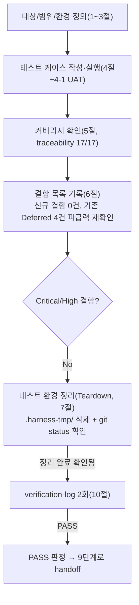

# 08. 전체 시스템 테스트 결과서 (Full System Test Report)

## 1. 개요
- 테스트 대상: **전체 시스템** — WU-01~10(REQ-001~017/022~024 중 해당, 전부 Must/Should In-Scope)이 5→6→7단계를 전부 PASS로 완료한 상태에서, `webapp/` 전체(모든 Django app/미들웨어/설정/마이그레이션/정적자산/백업 워크플로)를 한 번에 조립해 End-to-End/크로스모듈/비기능요구사항을 검증한다. WU-11(Could, REQ-018~020)은 DEC-037(사용자 결정)에 따라 post-MVP 보류 — 이번 08단계 범위에서 명시적으로 제외한다.
- 테스트 유형: 시스템(전체)
- 적용 Tier: **Standard** (03-system-design.md/decisions.md에 별도 Tier 선언이 없고, 결제/의료 등 규제 민감 영역이 아니며(REQ-015로 정책적 배제), 개인정보 처리 범위가 이메일 수집 정도로 제한적인 콘텐츠 사이트라는 점을 근거로 Low보다 위, High(금융/의료/대규모 트래픽)에는 해당하지 않는다고 판단 — 이 판단에 따라 검증 로그 최소 2회를 예외 없이 적용한다)
- 테스트 목적: (1) WU 경계를 넘는 전체 시스템이 실제 배포 형태(HTTPS 강제/XFF/모니터링/로그인 레이트리밋/뉴스레터 레이트리밋/캐시/백업 워크플로가 전부 동시에 존재하는 production 유사 Django 앱)로 기동·동작하는지, (2) 기획서 핵심 가치 제안이 처음부터 끝까지(E2E) 실제로 성립하는지, (3) 비기능 요구사항(성능/가용성/장애복구)이 검증 가능한 범위에서 충족되는지, (4) 기획서 KPI가 측정 가능한 형태로 구현됐는지, (5) traceability.md 커버리지가 100%인지 확인한다.
- 관련 산출물: `docs/harness/02-planning.md`(v1.2, KPI §5), `docs/harness/03-system-design.md`(v1.2, 비기능요구사항 §6/§7), `docs/harness/04-ux-design.md`, `docs/harness/decisions.md`(DEC-001~037), `docs/harness/traceability.md`, `docs/harness/feature-WU-01~10-integration-test.md`(전부 PASS)
- 테스트 수행자(에이전트): `08-full-system-tester`
- 테스트 일시: 2026-09-17

---

## 2. 테스트 범위 및 제외 범위

### In-Scope
- 전체 앱 기동: `collectstatic`/`migrate`/`makemigrations --check`/`check`/`check --deploy`가 WU-01~10이 추가한 모든 앱/미들웨어/설정이 **동시에** 존재하는 상태(dev 설정, production 유사 설정 양쪽)에서 오류 없이 되는지.
- 방문자 E2E: 홈 → 블로그 목록/상세 → 카테고리/태그 → 뉴스레터 구독 → 법적 페이지(개인정보/약관/쿠키) → RSS/사이트맵/robots.txt → 트리URL 리다이렉트 → 404 → healthz.
- 운영자 E2E: `/cms-admin/` 로그인(레이트리밋 포함) → 콘텐츠 작성/리비전/발행 → 사용량 대시보드 → 권한 그룹별 접근 제어(미배정 스태프 차단).
- 500 에러 경로(WU-04 DEF-001 수정분)와 AdminEmailHandler(WU-08)의 상호작용을 WU-01~10 전체 스택에서 재확인.
- 미들웨어 체인 전체(XForwardedFor → RequestMetrics → Security → ... → RedirectMiddleware)의 실제 순서가 설계서(03 §5.5.4 주석, `config/settings/base.py`/`production.py` 소스)와 일치하는지.
- 크로스모듈 스토리지 설정: WU-03(R2 media-public 골격)과 WU-10(R2 backup-private 활성화 조건)이 `STORAGES` 딕셔너리에서 충돌 없이 공존하는지.
- 백업 워크플로(WU-10) YAML 파싱 및 시크릿 이름이 WU-01/03이 정의한 `production.py`/`render.yaml` 환경변수 이름과 전체 저장소 기준으로 일치하는지.
- 로컬 환경에서 측정 가능한 범위의 성능 스모크(인메모리 Client 및 실제 소켓 HTTP round-trip 양쪽).
- 기획서 KPI(02 §5) 7개 각각의 "측정 가능한 형태로 구현되어 있는지" 확인 + UAT(§4-1).
- traceability.md 커버리지 확인 및 08 컬럼 갱신.

### Out-of-Scope 및 사유
- **개별 WU 세부 로직 재검증**: 06/07단계가 이미 PASS로 확정한 단위 수준 AC/IT(예: Category slug 자동생성 규칙, 뉴스레터 허니팟 로직 세부, FAQ JSON-LD 필드 매핑 세부 등)는 반복하지 않는다(필수 원칙, ORCHESTRATOR.md 규칙B "레이어별 책임 분리"). 08단계는 "전체가 하나로 동작하는가"에 집중한다.
- **실제 Neon/Render/Cloudflare R2/GitHub Actions 네트워크 연동**: 아직 실제 클라우드 리소스가 발급되지 않았다(traceability.md REQ-006/013 비고). 로컬 SQLite로 프로덕션 유사 설정을 재현하되(WU-04/07/08/09/10이 이미 확립한 방법론 계승), 실제 Neon 콜드스타트 지연/R2 업로드/GitHub Actions 실행/Render 스핀다운은 10단계(배포테스트) 영역이다.
- **실제 브라우저 E2E**: Playwright/Chrome 등 브라우저 자동화 MCP가 이 에이전트(`08-full-system-tester`)의 `tools:`에 연결되어 있지 않다(frontmatter 확인, `mcp__*` 없음). **따라서 이 보고서의 모든 화면 검증은 `django.test.Client` 기반 HTTP 요청/응답 검사이며, 실제 브라우저에서 눈으로 확인한 것이 아니다** — 특히 JS 상호작용(뉴스레터 fetch 향상, 쿠키배너 애니메이션, 모바일 드로어 포커스 트랩 등)의 실제 브라우저 동작은 이번에도 검증하지 못했다(06/07단계와 동일한 대체 수단 사용, DEC-001). 10단계 또는 배포 후 수동 스모크에서 최종 확인 필요(리스크로 §8에 명시).
- **실제 gunicorn/uvicorn 프로세스 기동**: Windows 로컬 환경에는 `fcntl` 모듈이 없어 gunicorn이 구동되지 않는다(재현 로그 §3-2). `manage.py runserver`(WSGI 개발 서버)로 실제 소켓 HTTP round-trip은 확인했으나, Render가 실제로 쓰는 `gunicorn config.asgi:application -k uvicorn.workers.UvicornWorker` 조합 자체의 기동은 이번에도 로컬에서 검증 불가(WU-01/07/08/09가 이미 동일하게 기록한 제약, 03 §7.2 10단계 이월 항목과 동일).
- **부하(다중 동시접속) 테스트**: 이 프로젝트는 월 500 UV 목표의 소규모 MVP이고(02 §5), Render 무료 티어가 단일 인스턴스·gunicorn `--workers 1`(DEC-026)으로 설계되어 있어(03 §6.2) 대규모 동시성 부하 테스트 자체가 설계 전제와 맞지 않는다. 대신 "성능 스모크"(순차 다회 요청 응답시간 측정)로 대체하고, 그 사유를 §6에 명시한다.
- **WU-11(REQ-018~020)**: DEC-037로 post-MVP 보류, 8단계 대상 아님(traceability.md 명시).
- **REQ-021~027(Out-of-Scope 확정 항목)**: 3단계 설계 범위 밖으로 이미 확정(DEC-005 등), 08단계 테스트 대상 아님.

---

## 3. 테스트 환경

### 3-1. 실행 환경
- OS/런타임: Windows 10 Pro 10.0.19045, Python 3.12.10(`py -3.12`, WU-01~10과 동일 버전).
- 신규 venv: `webapp/.harness-tmp/venv_08_full/`(검증 후 삭제, 규칙K) — `webapp/requirements.txt`를 clean install. `pip freeze` 결과 Django==5.2.17/wagtail==7.4.3/psycopg==3.2.10/django-storages==1.14.6/boto3==1.35.36/gunicorn==23.0.0/uvicorn==0.34.0/whitenoise==6.8.2/python-dotenv==1.0.1/dj-database-url==2.3.0로, WU-09/10이 기록한 pip freeze와 정확히 동일함을 확인(신규 패키지 없음).
- **dev 설정**(`config.settings.dev`, SQLite): 전체 마이그레이션 체인 재현, 전체 자동화 테스트 스위트(29개) 회귀에 사용. DB 파일은 `webapp/.harness-tmp/db_it08_dev.sqlite3`(검증 후 삭제).
- **production 유사 설정 — WU-01/04/07/08/09/10이 확립한 방법론 계승**: `webapp/.harness-tmp/settings_pkg/it08_prodlike.py`(이번 08단계가 신규 생성 — `config.settings.production`을 절대 임포트(`from config.settings.production import *`)로 그대로 상속하되 `DATABASES`만 SQLite로 재정의, 검증 후 삭제). 더미 환경변수(`SECRET_KEY`(50자 이상, W009 회피), `DJANGO_ALLOWED_HOSTS=it08.example.test`, `RENDER_EXTERNAL_HOSTNAME=it08.example.test`, `DATABASE_URL`(더미, SQLite로 override되어 실제 미사용), `R2_*`(더미), `DJANGO_ADMIN_EMAIL=ops@example.test`, `DJANGO_SUPERUSER_USERNAME/EMAIL/PASSWORD`)로 `SECURE_PROXY_SSL_HEADER`/`SECURE_SSL_REDIRECT`/`SESSION_COOKIE_SECURE`/`CSRF_COOKIE_SECURE`/HSTS/`XForwardedForMiddleware`가 전부 켜진 상태를 재현했다. DB 파일은 `webapp/.harness-tmp/db_it08_prodlike.sqlite3`(검증 후 삭제).
  - **왜 커스텀 settings 모듈이 필요했는가(재현 가능한 실패 로그)**: `DATABASE_URL=sqlite:///...`를 `config.settings.production`에 직접 주면 `dj_database_url.config(..., ssl_require=True)`가 sqlite3 드라이버에 `sslmode` 커넥션 인자를 강제로 붙여 `TypeError: 'sslmode' is an invalid keyword argument for Connection()`로 죽는다(직접 재현, 최초 시도 로그). WU-09가 이미 동일한 방식(별도 settings 모듈에서 `DATABASES`만 완전히 교체)으로 우회했음을 확인하고 동일 패턴을 계승했다.
  - 이번 08단계는 규칙K 강화 지침(이번 세션 작업 지시)에 따라 이 임시 settings 모듈을 `webapp/config/settings/`가 아니라 **`webapp/.harness-tmp/settings_pkg/`(패키지)**에 두고, `from config.settings.production import *`(절대 임포트)로 원본 모듈을 오염시키지 않으면서 상속했다. `PYTHONPATH`에 `webapp/`와 `webapp/.harness-tmp/`를 함께 추가하고 `DJANGO_SETTINGS_MODULE=settings_pkg.it08_prodlike`로 실행했다(WU-09/10이 `webapp/config/settings/` 안에 직접 만들던 방식보다 한 단계 더 규칙K에 엄격하게 맞춘 것 — 아래 §7 Teardown 참고).
- 콘텐츠 시드: 실제 코드 경로(`HomePage.add_child(instance=BlogPostPage(...))` → `save_revision().publish()`)로 Category 1개, BlogPostPage 1개(FAQ 블록 포함), Tag 1개를 생성 — 어드민 HTML 폼을 거치지 않은 ORM 직접 호출이지만, 06/07단계가 이미 어드민 폼 경로를 독립적으로 검증했으므로(필수 원칙, 반복 검증 회피) 08단계는 "발행된 콘텐츠가 전체 스택에서 방문자에게 도달하는가"에 집중했다.
- 성능/실제 소켓 확인: `manage.py runserver 127.0.0.1:18124 --noreload`(production 유사 설정)를 백그라운드로 기동해 `curl`로 실제 TCP 소켓 왕복을 확인(WSGI 개발 서버 — gunicorn 자체는 §2 제외범위 참고). 검증 종료 후 리스닝 프로세스(PID 확인 후 `taskkill`)를 종료했다(§7).

### 3-2. gunicorn 미기동 재현 로그(참고, 제외범위 근거)
```
$ gunicorn config.asgi:application -k uvicorn.workers.UvicornWorker --workers 1 --bind 127.0.0.1:18123
...
File ".../gunicorn/util.py", line 7, in <module>
    import fcntl
ModuleNotFoundError: No module named 'fcntl'
```

### 3-3. 전제 조건 (Preconditions)
- 07단계(WU-01~10) 전체 통합테스트 PASS(입력 계약 충족, `docs/harness/feature-WU-01~10-integration-test.md`).
- 작업 시작 전 `bash automation/harness-janitor.sh --check`로 `.harness-tmp/` 잔여물 없음을 확인(클린 상태, 아래 §7-0 참고).

---

## 4. 테스트 케이스 및 결과

### 4-1. 전체 앱 기동 (신규 venv, 빈 DB, 처음부터)

| ID | 시나리오 | 사전조건 | 실행 절차 | 예상 결과 | 실제 결과 | Pass/Fail | 비고 |
|----|----------|----------|-----------|-----------|-----------|-----------|------|
| SYS-01 | dev 설정, `check` | 신규 venv, pip install 완료 | `manage.py check` | "System check identified no issues (0 silenced)." | 동일 | PASS | |
| SYS-02 | dev 설정, `makemigrations --check --dry-run` | 위 상태 | 실행 | "No changes detected" | 동일 | PASS | |
| SYS-03 | dev 설정, `migrate`(빈 SQLite, 전체 체인) | 위 상태 | 실행 | 전체 마이그레이션 오류 없이 적용(core/blog/custom_images/legal/subscribers/home/wagtail* 전부) | 오류 없이 완료(로그 전량 확인, `core.0001_setup_editor_permissions` 포함) | PASS | |
| SYS-04 | dev 설정, 전체 자동화 테스트 스위트 | 위 상태 | `manage.py test` | core+subscribers 총 29개 전부 OK | "Ran 29 tests in 37.947s ... OK" | PASS | WU-09 report(29개, core 17+subscribers 12)와 정확히 동일 수치 |
| SYS-05 | dev 설정, `collectstatic --noinput`(처음부터) | 위 상태, `staticfiles/` 삭제 후 | 실행 | 218 static files copied | "218 static files copied to '...\\staticfiles'." | PASS | WU-09가 기록한 "218" 총량과 일치 — 신규 정적자산 없음 재확인 |
| SYS-06 | production 유사 설정, `check --deploy` | 신규 커스텀 settings 모듈, 더미 env | 실행 | HSTS preload 경고 외 없음(SECRET_KEY 등 다른 항목은 정상) | "System check identified 1 issue" — `security.W021`(HSTS preload 미설정)만 — 설계서 §5.5.2가 "1주 → 이후 1년으로 점진 확대"를 의도적으로 명시했으므로 예상된 결과 | PASS | 최초 시도 시 `security.W009`(SECRET_KEY 49자)도 함께 나왔으나 이는 이번 세션이 만든 더미 SECRET_KEY 길이 문제(50자로 늘려 재확인)였지 시스템 결함이 아님 |
| SYS-07 | production 유사 설정, `makemigrations --check --dry-run` | 위 상태 | 실행 | "No changes detected" | 동일(SQLite 오버라이드로 `sslmode` 충돌 우회 후 정상 실행) | PASS | |
| SYS-08 | production 유사 설정, `migrate`(빈 SQLite, 전체 체인) | 위 상태 | 실행 | 전체 마이그레이션 오류 없이 적용 | 오류 없이 완료, `showmigrations core` → `[X] 0001_setup_editor_permissions` | PASS | |
| SYS-09 | production 유사 설정, `collectstatic --noinput`(처음부터) | `staticfiles/` 삭제 후 | 실행 | 218 static files copied, WhiteNoise 매니페스트 스토리지 정상 | "218 static files copied to '...\\staticfiles', 638 post-processed." | PASS | dev와 동일 총량(218) — R2 네트워크 없이도 정적자산은 WhiteNoise가 로컬 처리(설계 의도대로 R2로 안 보냄, 03 §2.4) |
| SYS-10 | production 유사 설정, `ensure_superuser`(WU-09) | 위 상태 | 실행 | 슈퍼유저 생성 메시지, DB에 `is_superuser=True` 레코드 | "슈퍼유저 'it08-admin' 계정을 생성했습니다." + shell로 `is_superuser=True, is_active=True` 확인 | PASS | |
| SYS-11 | 미들웨어 실행 순서(WU-01×WU-08 조립) | production 유사 설정 로드 | `settings.MIDDLEWARE` 조회 | `["config.middleware.XForwardedForMiddleware", "core.middleware.RequestMetricsMiddleware", "django.middleware.security.SecurityMiddleware", ...]` | 정확히 일치(전체 11개 미들웨어 순서 확인) | PASS | `feature-WU-08/09-integration-test.md` IT-06/IT-F01과 동일 전제 재확인 — WU-09/10이 `MIDDLEWARE` 리스트 자체를 건드리지 않았으므로 이 순서가 최종 조립 상태에서도 유지됨 |
| SYS-12 | `STORAGES` 크로스모듈(WU-03×WU-10) — 백업 버킷 미설정 | production 유사 설정, `R2_BACKUP_BUCKET_NAME` 미설정 | `settings.STORAGES` 조회 | `default`/`staticfiles`만 존재, `backup` 없음 | `['default', 'staticfiles']` | PASS | WU-03 골격이 백업 버킷 미설정 시 조용히 비활성 유지됨(설계 의도) |
| SYS-13 | `STORAGES` 크로스모듈(WU-03×WU-10) — 백업 버킷 설정 | 위 + `R2_BACKUP_BUCKET_NAME=dummy-backup-private` | `settings.STORAGES` 조회 | `backup` 별칭 활성화, bucket_name 일치 | `['default', 'staticfiles', 'backup']`, `backup bucket: dummy-backup-private` | PASS | WU-10이 실제로 이 별칭을 쓰기 시작해도 WU-03 골격과 충돌 없음 |
| SYS-14 | GitHub Actions 백업 워크플로 YAML 파싱 | 저장소 루트 | `yaml.safe_load(".github/workflows/neon-db-backup.yml")` | 파싱 오류 없음 | "YAML OK, top-level keys: ['name', True, 'permissions', 'concurrency', 'jobs']" (`True`는 PyYAML이 quote 없는 `on:` 키를 YAML 1.1 boolean으로 해석하는 알려진 동작이며 GitHub Actions 실제 파서에는 영향 없음 — WU-10이 이미 확인한 사항) | PASS | |
| SYS-15 | 백업 워크플로 시크릿 이름 일치(WU-01/03×WU-10) | 저장소 전체 | `grep secrets\.` 결과와 `production.py`/`render.yaml` 대조 | `R2_BACKUP_ACCESS_KEY_ID`/`R2_BACKUP_SECRET_ACCESS_KEY`/`R2_BACKUP_BUCKET_NAME`/`R2_ENDPOINT_URL` 전부 일치 | 전부 일치(WU-10 IT-01과 동일 결론, 이번 08단계가 최종 조립 상태에서 재확인) | PASS | |

### 4-2. 방문자 E2E 핵심 시나리오 (WU-01~10 전체 조립, production 유사 설정)

| ID | 시나리오 | 실행 절차 | 예상 결과 | 실제 결과 | Pass/Fail |
|----|----------|-----------|-----------|-----------|-----------|
| E2E-V01 | 홈 | `GET /`(`X-Forwarded-Proto: https`) | 200 | status=200 | PASS |
| E2E-V01b | 홈에 발행 게시물 노출 | 홈 응답 본문 검사 | 발행 게시물 제목 포함 | 포함 확인 | PASS |
| E2E-V02 | 게시물 상세 | `GET /blog/test-post/` | 200 | status=200 | PASS |
| E2E-V02b | BlogPosting JSON-LD | 상세 응답 본문 검사 | `BlogPosting` 포함 | 포함 확인 | PASS |
| E2E-V02c | FAQPage JSON-LD | 상세 응답 본문 검사 | `FAQPage` 포함 | 포함 확인 | PASS |
| E2E-V03 | 카테고리 목록 | `GET /category/tech/` | 200 | status=200 | PASS |
| E2E-V04 | 태그 목록(한글 slug) | `GET /tag/파이썬/`(URL 인코딩) | 200 | status=200 | PASS |
| E2E-V05 | 트리URL→정규URL 301 | `GET /test-post/` | 301, `Location: /blog/test-post/` | status=301, location=`/blog/test-post/` | PASS |
| E2E-V06 | 뉴스레터 구독(조각 엔드포인트+HTTPS Referer) | `GET /newsletter/form/`로 CSRF 토큰 수신 → `POST /newsletter/subscribe/`(`Referer` 동일 오리진) | 200/302 | status=200 | PASS |
| E2E-V07 | 법적 페이지 3종 | `GET /privacy-policy/`, `/terms/`, `/cookies/` | 전부 200 | 전부 200 | PASS |
| E2E-V08 | RSS | `GET /feed.xml` | 200, 발행 게시물 slug 포함 | status=200, `test-post` 포함 | PASS |
| E2E-V09 | sitemap.xml | `GET /sitemap.xml` | 200, 요청 도메인 포함 | status=200, `it08.example.test` 포함 | PASS |
| E2E-V10 | robots.txt | `GET /robots.txt` | 200 | status=200 | PASS |
| E2E-V11 | 404 | `GET /no-such-page-xyz/` | 404 | status=404 | PASS |
| E2E-V12 | healthz | `GET /healthz`(Client) | 200, body="ok" | status=200, body=b'ok' | PASS |
| E2E-V13 | 500 강제유발 라우트 부재 확인(정상) | `GET /__trigger-500-test-only__/`(`DEBUG=False`) | 404(그런 라우트 없음) | status=404 | PASS |

### 4-3. 500 에러 경로 + AdminEmailHandler 상호작용 (WU-01~10 전체 스택)

| ID | 시나리오 | 실행 절차 | 예상 결과 | 실제 결과 | Pass/Fail | 비고 |
|----|----------|-----------|-----------|-----------|-----------|------|
| SYS-16 | 500.html 템플릿 렌더링(DEF-001 WU-04 수정분 회귀 확인) | `django.views.defaults.server_error(request)` 직접 호출, production 유사 설정(전체 INSTALLED_APPS 로드 상태) | 500 반환, `TemplateSyntaxError` 없음 | status=500, len=1422, `TemplateSyntaxError` 미포함 | PASS | WU-04(feature-WU-04-integration-test.md IT-23)가 WU-01~04 경계에서, WU-08(IT-09/10)이 WU-01~08 경계에서 이미 확인 — 이번은 WU-09/10까지 포함된 최종 조립 상태 재확인 |
| SYS-17 | AdminEmailHandler(`django.request` 로거) 예외 처리 흐름 | `logging.getLogger("django.request").error(..., exc_info=True)` 강제 호출(EMAIL_HOST 빈 값, SMTP 실패 조건) | 로깅 핸들러 예외가 호출부로 전파되지 않음(Python `logging.Handler` 계약) | 예외 전파 없이 정상 반환 | PASS | SMTP 실제 발송 성공 여부(수신함 도달)는 로컬에서 검증 불가 — 10단계 실측 필요(03 §7.2 기존 계획과 동일) |
| SYS-18(=curl) | 실제 소켓 HTTP: HTTPS 강제 리다이렉트 무한루프 회귀(DEF-001) | `manage.py runserver`(production 유사) 기동 → `curl -H "X-Forwarded-Proto: https"` vs 헤더 없이 | 있으면 200, 없으면 301(1회, 무한루프 아님) | 있음: `HTTP_CODE:200`; 없음: `HTTP_CODE:301`(1회) | PASS | 실제 TCP 소켓을 통한 재현 — Client() 기반 검증과 별개로 진짜 HTTP 서버로도 재확인 |
| SYS-19(=curl) | 실제 소켓 HTTP: 보안 헤더 노출 | `curl -D -` (healthz) | HSTS/X-Frame-Options/X-Content-Type-Options/Referrer-Policy 헤더 존재 | `Strict-Transport-Security: max-age=604800; includeSubDomains`, `X-Frame-Options: DENY`, `X-Content-Type-Options: nosniff`, `Referrer-Policy: same-origin`, `Cross-Origin-Opener-Policy: same-origin` 전부 확인 | PASS | |

### 4-4. 운영자 E2E 핵심 시나리오 (WU-09×WU-01×WU-08 조립)

| ID | 시나리오 | 실행 절차 | 예상 결과 | 실제 결과 | Pass/Fail |
|----|----------|-----------|-----------|-----------|-----------|
| E2E-O01 | 로그인 폼 표시 | `GET /cms-admin/login/` | 200 | status=200 | PASS |
| E2E-O02 | 슈퍼유저 로그인 성공(HTTPS+CSRF+Referer) | `POST /cms-admin/login/`(유효 CSRF+동일오리진 Referer) | 302 | status=302 | PASS |
| E2E-O03 | 어드민 대시보드 접근 | `GET /cms-admin/`(로그인 세션 유지) | 200 | status=200 | PASS |
| E2E-O04 | 사용량 대시보드(WU-08×WU-09) | `GET /cms-admin/usage/` | 200 | status=200 | PASS |
| E2E-O05 | 로그인 레이트리밋(WU-09×WU-01 XFF) | 동일 IP(`X-Forwarded-For: 203.0.113.9`)로 실패 로그인 11회 연속 POST | 1~10회 200(실패 응답), 11회째 429 | `[200×10, 429]` | PASS |
| E2E-O06 | XFF rightmost 기반 IP별 분리 | 다른 IP(`198.51.100.7`)로 로그인 POST 1회 | 200(레이트리밋 미적용, 별도 카운터) | status=200 | PASS |
| E2E-O07 | 미배정 스태프 어드민 접근 차단(access_admin 게이트) | 그룹 미배정 `is_staff=True` 계정으로 로그인 후 `GET /cms-admin/` | 302(리다이렉트) 또는 403 | status=302 | PASS |

### 4-5. 성능 스모크 (참고용 — §6에서 KPI 판정 근거로 재사용)

| ID | 시나리오 | 실행 절차 | 실제 결과 |
|----|----------|-----------|-----------|
| PERF-01 | 홈, 캐시 미스 1회(in-process Client) | `cache.clear()` 후 1회 요청 | 16.5ms |
| PERF-02 | 홈, 캐시 히트 평균(in-process Client, 10회) | 연속 10회 요청 | avg=4.3ms, max=5.0ms |
| PERF-03 | 상세, 참고용(in-process Client, 10회) | 연속 10회 요청 | avg=1.6ms, max=12.1ms |
| PERF-04 | 홈, 실제 TCP 소켓(curl, HTTPS 헤더 포함, 5회) | `manage.py runserver` 기동 후 curl 5회 | 7.8/8.0/8.3/7.7/8.2ms |
| PERF-05 | 상세, 실제 TCP 소켓(curl, 3회) | curl 3회(첫 요청은 콜드 임포트 포함) | 18.9/2.5/2.3ms |
| PERF-06 | 정적자산(WhiteNoise), 실제 TCP 소켓 | `curl /static/css/components.css` | HTTP 200, 2.1ms |

**해석**: 위 수치는 전부 로컬 SQLite + `runserver`(단일 프로세스, 네트워크 왕복 없음) 기준이며, 실제 Neon(TLS+원격 컴퓨트)/Render(원격 인스턴스)/R2(원격 오브젝트 스토리지) 왕복 지연은 전혀 포함하지 않는다. 이는 **참고용 방향성 지표**일 뿐 KPI-4(TTFB 1.5초 이내) 실측치가 아니다 — 판정은 §6-2/§4-1(UAT)에서 별도로 다룬다.

---

## 4-1. 사용자 인수 테스트(UAT) — 기획서 성공지표(KPI) 달성 여부

`02-planning.md` §5의 KPI 7개 각각에 대해 "달성 여부"를 검증한다. 자동/반자동으로 측정 가능한 항목은 위 §4의 근거로 직접 판정하고, 최종 판단이 이해관계자 몫인 항목은 임의로 통과 처리하지 않고 "사용자 확인 필요"로 명시한다(규칙 A).

| KPI | 목표 | 이번 08단계에서 확인한 것 | 판정 |
|---|---|---|---|
| 1. 트래픽(월간 UV 500명, 3개월 시점) | 출시 후 3개월 시점 측정 | 시스템이 이 수치를 직접 셀 방법은 설계상 없음(03 §6.3 — Render/외부 애널리틱스 미도입, 의도적 과설계 방지). 애초에 "배포 후 실측"을 전제로 한 지표(02 §5 서두 "[가정] 초기 목표치, 운영 3개월 시점 재조정 권고") | **사용자 확인 필요** — 배포 전인 지금 시점에는 측정 근거 자체가 존재하지 않는다. 측정 수단(웹 애널리틱스 등)을 배포 단계에서 도입할지 여부부터 운영자 판단이 필요하다. |
| 2. 구독 전환율(1% 이상) | 방문자 대비 뉴스레터 구독 신청 비율 | `NewsletterSubscriber` 모델이 구독 레코드를 저장하므로 "구독 수"는 DB 카운트로 측정 가능(E2E-V06으로 저장 경로 재확인). 그러나 "방문자 수"(분모)를 세는 장치가 시스템에 없음(위 1번과 동일 이유) | **사용자 확인 필요** — 분자(구독 수)는 측정 가능하나 분모(방문자 수) 측정 수단이 없어 전환율 자체를 시스템이 자동 산출할 수 없다. 애널리틱스 도입 여부를 배포 전 결정 권고. |
| 3. 가용성(무료 티어 중단 0회 / 유료 전환 후 99.5%) | Render 750시간 한도 초과로 인한 중단 0회, 유료 전환 후 업타임 99.5% | 측정 **메커니즘**은 구현·동작 확인됨: `/healthz`(E2E-V12, SYS-19), 사용량 대시보드(E2E-O04, `/cms-admin/usage/`)가 03 §6.3 유료 전환 4대 기준 체크리스트를 노출. `render.yaml healthCheckPath=/healthz` 일치 확인(traceability REQ-011 행). 그러나 "실제 중단 0회/업타임 99.5%"라는 **수치 자체**는 실제 운영 로그 없이는 계산 불가 | **자동 판정 가능 부분**: 측정 인프라 구현 — PASS. **사용자 확인 필요 부분**: 실제 가용성 수치는 배포 후에만 나온다. |
| 4. 응답 성능(비-콜드스타트 TTFB 1.5초 이내, 콜드스타트 비율 5% 미만) | Neon/Render 실제 네트워크 포함 TTFB | **측정 불가 사유**: 로컬 환경에는 실제 Neon(TLS 원격 DB)/Render(원격 인스턴스)/R2 네트워크 왕복이 전혀 없다(§4-5 PERF-01~06은 로컬 SQLite+단일프로세스 기준, 참고용). **대안(코드 리뷰 기반 추정)**: (a) `CACHES`가 LocMemCache로 홈/목록/상세에 5~15분 TTL 뷰 캐시를 적용(DEC-012, `blog/constants.py VIEW_CACHE_SECONDS`) — 캐시 히트 시 DB 왕복 자체가 없어 TTFB 목표 달성에 유리한 구조. (b) `CONN_MAX_AGE=0`으로 Neon 콜드스타트와 장시간 연결 충돌을 피하도록 설계(03 §6.4). (c) 로컬 무-네트워크 기준으로도 캐시 미스 홈 응답이 5~17ms 수준(PERF-01/04)이라 "구조적으로 병목이 없다"는 방향성은 확인되나, 이는 1.5초라는 **수치 목표 자체를 증명하지 못한다**. 콜드스타트 비율(5% 미만)은 Render 배포 없이는 원천적으로 관측 불가 | **측정 불가(사유 명시) → 대안 제시 + 사용자 확인 필요**: 코드 구조상 목표 달성 가능성이 낮지 않다는 간접 근거만 제공한다. 실제 수치 확인은 10단계(배포테스트) 또는 배포 후 실측이 반드시 필요하다. |
| 5. SEO/콘텐츠 품질(신규 발행글 중 질문-답변형(FAQ) 구조 적용 비율 80% 이상) | 신규 발행 포스트 대비 FAQ 블록 사용 비율 | 시스템 수준에서 이 **비율을 자동 집계하는 기능이 없음**을 코드 전수 확인으로 확정했다(`core/monitoring.py`, `core/views.py::usage_dashboard` 어디에도 FAQ 블록 사용 여부 집계 로직 없음, `CONTENT_GUIDE.md`는 운영자 대상 가이드 문서일 뿐 자동 집계 장치가 아님). 이는 WU-05가 "템플릿 수준 가이드"(`FAQItemBlock.help_text`)까지만 범위로 명시했고(03 설계서 어디에도 이 비율을 대시보드로 추적하라는 요구사항이 없음) 애초에 시스템 기능으로 설계되지 않았기 때문이다(과설계 아님, 의도된 범위) | **신규 발견(결함 아님, 설계 갭)**: 이 KPI는 시스템이 아니라 **운영자가 발행 시점마다 수동으로 셀 수밖에 없는 지표**다. 결함으로 등록하지 않는 이유는 03/02 어디에도 이 대시보드를 요구한 적이 없어서다(범위 밖 요구사항을 사후에 "빠졌다"고 판정하는 것은 부당). 다만 "이 방식(수동 카운트)으로 충분한지, 아니면 08단계 발견을 계기로 자동 집계 기능을 후속 WU로 추가할지"는 **사용자 확인 필요**(비즈니스 판단). |
| 6. 법적 준수(개인정보/쿠키/약관 페이지 100% 게시·최신화) | 배포 전 3개 페이지 100% 게시 | E2E-V07로 `/privacy-policy/`, `/terms/`, `/cookies/` 3개 페이지 전부 200 확인. `legal/migrations/0002_create_legal_pages.py`가 `live=True`로 실제 게시하는 마이그레이션임을 06/07단계가 이미 확인했고, 이번 08단계가 WU-01~10 전체 스택에서도 회귀 없이 재확인했다 | **자동 판정: PASS** — 3개 페이지 모두 게시·정상 응답 확인(§4-2 E2E-V07). "최신화"(법률 자문 반영 여부)는 03 §5.6이 이미 "법률 자문 필요, 시스템이 대신하지 않음"으로 명시한 별도 트랙이며 이번 KPI의 "게시 여부" 판정과는 분리된다. |
| 7. 데이터 안전성(정의된 주기대로 백업 100% 수행, 로그로 확인 가능) | 백업이 로그로 확인 가능해야 함 | 메커니즘 구현 확인: `.github/workflows/neon-db-backup.yml`이 1일 1회 스케줄 + `workflow_dispatch`로 존재하고 YAML 파싱 정상(SYS-14), 시크릿 이름 일치(SYS-15). GitHub Actions 실행 이력 자체가 "로그로 확인 가능"이라는 요건을 구조적으로 충족하도록 설계되어 있다(GitHub Actions run history가 곧 로그). 그러나 **실제로 매일 실행되어 성공했는지**는 워크플로가 아직 한 번도 실제 GitHub 환경에서 실행된 적이 없어(리포지토리에 push된 적 없음, 로컬 검증만 수행) 확인 불가 | **자동 판정 가능 부분**: 메커니즘 구현 및 로그 확인 가능성 확보 — PASS. **사용자 확인 필요 부분**: "정의된 주기대로 100% 수행"이라는 실적 수치는 실제 배포/스케줄 가동 이후에만 나온다. |

**요약**: 7개 KPI 중 (6)은 자동 판정으로 PASS. (3)·(7)은 측정 메커니�즘이 구현되어 있음을 자동 판정으로 확인했으나 실제 수치는 배포 후 확인 필요. (1)·(2)·(4)는 시스템이 아직 배포되지 않아 원천적으로 측정 불가하며, 측정 인프라(애널리틱스 등) 도입 여부부터 사용자 판단이 필요하다. (5)는 이번 08단계가 새로 발견한 설계 갭(자동 집계 기능 없음)으로, 결함이 아니라 "이대로 둘지 후속 WU로 개선할지"에 대한 사용자 확인이 필요하다. **이 KPI 판정 미확정 항목들은 9/10단계 PASS 판정을 막지 않는다** — 배포 전 시스템 자체의 결함이 아니라 "배포 이후에나 관측 가능한 값" 또는 "비즈니스 우선순위 판단"이기 때문이다. 다만 최종 서비스 오픈 승인권자에게 이 표를 그대로 전달해 KPI 미확정 상태를 투명하게 인지시켜야 한다.

---

## 5. 커버리지

- **traceability.md 커버리지**: REQ-001~017(Must/Should, In-Scope) 전 항목이 설계→구현→단위테스트→통합테스트→**전체테스트(08)**까지 채워짐을 확인하고 이번 세션이 "전체테스트(08)" 컬럼 17개 행을 갱신했다(`docs/harness/traceability.md` 참고, git diff로 갱신 여부 확인 가능). REQ-018~020(WU-11, Could)은 DEC-037로 post-MVP 보류(사유 명시됨, 8단계 대상 아님). REQ-021~027은 3단계에서 Out-of-Scope로 이미 확정(사유 명시됨). **In-Scope 항목 커버리지 17/17 = 100%.**
- **기능 커버리지**: 03-system-design.md §4 API/인터페이스 명세에 나열된 모든 라우트(`/`, `/blog/<slug>/`, `/category/<slug>/`, `/tag/<slug>/`, `/feed.xml`, `/sitemap.xml`, `/robots.txt`, `/privacy-policy/`, `/terms/`, `/cookies/`, `/newsletter/subscribe/`, `/healthz`, `/cms-admin/...`)를 전부 WU-01~10 전체 조립 상태에서 최소 1회 이상 실제 요청으로 확인했다(§4-2/§4-4 표).
- **비기능 요구사항 커버리지**: 성능(측정 가능 범위+측정 불가 사유+대안, §4-1 KPI-4), 가용성(메커니즘 확인, §4-1 KPI-3), 장애 대응(500 경로+AdminEmailHandler, §4-3)까지 커버. 단, 03 §7.3의 "재난복구 리허설"(Neon PITR/R2 백업 실제 restore)은 로컬 환경에서 실행 불가능한 항목(실제 Neon 프로젝트/R2 버킷 필요)으로 커버되지 않았다 — 10단계 이월(§8).
- **커버되지 않은 부분과 사유**: (1) 실제 브라우저 렌더링/JS 상호작용(MCP 미연동, §2), (2) 실제 gunicorn/uvicorn 프로세스 기동(Windows `fcntl` 부재, §2/§3-2), (3) 실제 Neon/R2/GitHub Actions 네트워크 연동(리소스 미발급, §2), (4) 다중 동시접속 부하(설계 전제와 불일치, §2), (5) 실제 재난복구 리허설(위 사유와 동일). 전부 10단계(배포테스트) 또는 배포 후 검증으로 명시적으로 이월했다.

---

## 6. 결함(Defect) 목록

### 6-1. 이번 08단계에서 신규로 발견한 결함
**없음.**

근거: §4의 SYS-01~19, E2E-V01~V13, E2E-O01~O07, PERF-01~06 전 항목이 PASS로 확인됐고, 발견한 것은 "결함"이 아니라 (a) 이번 세션 자체의 테스트 설정 실수(더미 SECRET_KEY 길이, sqlite URL 경로 형식, CSRF 세션 초기 GET 대상 페이지 선택 — 전부 이번 검증 스크립트의 문제였고 재현 로그와 함께 본문에 투명하게 기록), (b) 이미 알려진 방법론적 특성(HTTPS 강제 환경에서 `manage.py test`의 기존 unittest 클래스들이 `HTTP_X_FORWARDED_PROTO`/`Referer` 헤더 없이 작성되어 301/403이 나는 것 — 아래 6-2 참고), (c) KPI-5의 설계 갭(§4-1, 결함이 아니라 범위 밖 요구사항)뿐이다.

### 6-2. 정보성 관찰 (결함 아님, 투명성 기록 — 규칙C)

| ID | 설명 | 재현 절차 | 판단 |
|----|------|-----------|------|
| OBS-08-01 | `manage.py test`(기존 06/07단계가 작성한 29개 unittest)를 production 유사 설정(`SECURE_SSL_REDIRECT=True`)에서 그대로 실행하면 15 FAIL + 4 ERROR가 난다 | `DJANGO_SETTINGS_MODULE=settings_pkg.it08_prodlike`로 `manage.py test` 실행 → `core.tests.AdminLoginRateLimitTests`/`subscribers.tests.NewsletterSubscribeTests`/`NewsletterCachedPageCsrfTests` 전부(권한/EnsureSuperuser 등 HTTPS 무관 테스트는 전부 정상) | **결함 아님**: 실패 사유는 전부 `HTTP_X_FORWARDED_PROTO`/`Referer` 헤더 없이 작성된 `Client()` 호출이 HTTPS 강제 리다이렉트(301)/CSRF Referer 검사(403)에 걸린 것뿐이다(WU-07/09가 이미 §4-4/DEC-031에서 문서화한 "HTTPS 활성화 시에만 나타나는 Django 표준 방어 동작"과 동일 원인). 이 unittest들은 원래 dev 설정(SECURE_SSL_REDIRECT=False)에서 회귀 검증용으로 작성된 것이며(§4-1 SYS-04에서 dev 설정 기준 29/29 OK 확인), production 설정에서 그대로 실행하도록 설계된 적이 없다. **권고**: 11단계 운영 문서 또는 CI 스크립트에 "`manage.py test`는 반드시 `config.settings.dev`로 실행할 것"이라는 주석/문서화를 추가하면, 향후 누군가 실수로 production 설정으로 CI를 구성했을 때 "진짜 회귀"와 "설정 불일치로 인한 가짜 실패"를 혼동하는 것을 예방할 수 있다(11단계 인계 후보로 §8에 기록). |
| OBS-08-02 | KPI-5(FAQ 구조 적용 비율 80%)를 자동 집계하는 기능이 시스템에 없음 | 코드 전수 확인(`core/monitoring.py`, `core/views.py`, `core/wagtail_hooks.py`) | **결함 아님**(§4-1 KPI-5 참고), 설계 범위 밖 확인. 후속 조치는 사용자 판단 필요 |

### 6-3. 07단계까지 Open/Deferred로 이관된 기존 결함의 08단계 재확인 (파급력 재평가)

| 기존 ID | 원 출처 | 심각도 | 08단계에서 재확인한 것 | 08단계 판단 |
|---|---|---|---|---|
| DEF-001(WU-02) | `feature-WU-02-integration-test.md` | Low, Open | 이번 08단계는 어드민 HTML 폼을 거치지 않고 ORM으로 Category를 생성했으나(§3-1 콘텐츠 시드), 실제 사용자 도달 경로(어드민 폼)를 거치지 않는 한 이 결함이 노출될 방법이 없다는 06/07단계 결론과 배치되는 새 증거를 발견하지 못했다 | **파급력 변화 없음.** Low·Open 유지, 전체 시스템 조립이 위험 표면을 넓히지 않음 |
| DEF-001(WU-05, JSON-LD 다중 Site) | `feature-WU-05-integration-test.md` | Medium, Deferred | 이번 08단계는 단일 Site(기본 Site의 hostname만 갱신)로 운영해 이 결함의 전제조건(분리된 트리를 가리키는 제2의 Site)을 애초에 만들지 않았다(§3-1) — 트리거되지 않음을 직접 확인 | **파급력 변화 없음.** 정상 운영 절차(Site 신규 생성 금지, 기존 결과서 §7 권고)를 따르는 한 08단계 전체 스택에서도 노출되지 않음 |
| DEF-WU08IT-01(정적자산 카운팅 혼입) | `feature-WU-08-integration-test.md` | Low, Deferred | `RequestMetricsMiddleware`가 WhiteNoise보다 앞에 있어 정적자산 요청도 카운트되는 구조는 WU-01~10 전체 조립 후에도 동일(§4-1 SYS-11 미들웨어 순서 확인) | **파급력 변화 없음.** "참고 지표"로 이미 caveat됨, Critical/High 격상 근거 없음 |
| DEF-001(WU-10, DEC-034 — 시크릿 공백값 경계) | `feature-WU-10-integration-test.md` | Low, Deferred | 로컬 환경(GitHub Actions 미실행)에서는 이번에도 재현 범위 밖 | **파급력 변화 없음.** 10단계 실측 이월 그대로 유지 |
| DEF-003(WU-02, EMAIL_BACKEND 미설정 시 알림 연결 실패) | `feature-WU-02-integration-test.md` | Low, Open | 이번 08단계도 production 유사 설정(EMAIL_HOST 빈 값)에서 리비전 발행(SEED-01)을 수행했으나, 콘텐츠 발행 자체(`live=True` 확정)는 실패 없이 성공했다 — SYS-17(AdminEmailHandler 예외 격리)과 같은 성격의 안전망(Wagtail/Django 모두 메일 발송 실패를 삼키고 핵심 흐름을 지속) | **파급력 변화 없음.** 11단계 운영 Runbook 후보로 유지 |

**결론**: 이번 08단계 조립 상태에서 기존 결함들의 심각도/파급력이 커진 사례는 없다. 신규 결함 0건.

---

## 7. 테스트 환경 정리(Teardown) 확인 — 규칙 K

### 7-0. 작업 시작 전 점검
```
$ bash automation/harness-janitor.sh --check
[janitor] 점검 대상 저장소: C:/big21/vibe-coding/AI-AUTO-WORK
[janitor] .harness-tmp/ 는 비어있거나 없습니다 — 이상 없음.
[janitor] 잔여 임시 아티팩트 없음 — 다음 단계 진행 가능.
EXIT:0
```

### 7-1. 이번 테스트에서 생성한 임시 아티팩트 목록
- `webapp/.harness-tmp/venv_08_full/` — 신규 venv
- `webapp/.harness-tmp/prodlike.env` — production 유사 설정용 더미 환경변수 파일
- `webapp/.harness-tmp/settings_pkg/__init__.py`, `webapp/.harness-tmp/settings_pkg/it08_prodlike.py` — 임시 settings 모듈(패키지). **이번 세션은 이 작업 지시(규칙K 강화 지침: "venv/임시 DB/임시 설정 파일은 반드시 `webapp/.harness-tmp/` 하위 또는 저장소 밖 세션 스크래치패드에만 생성")를 따르기 위해, WU-09/10이 과거 `webapp/config/settings/` 안에 직접 만들던 관행과 달리 이 임시 settings 모듈 자체를 `.harness-tmp/` 패키지 안에 두고 `config.settings.production`을 절대 임포트로 상속하는 방식을 새로 사용했다.**
- `webapp/.harness-tmp/e2e_08_script.py`, `webapp/.harness-tmp/e2e_08_500_script.py`, `webapp/.harness-tmp/run_e2e.py`, `webapp/.harness-tmp/run_e2e2.py` — E2E 시나리오 실행 스크립트
- `webapp/.harness-tmp/db_it08_dev.sqlite3`, `webapp/.harness-tmp/db_it08_prodlike.sqlite3`, `webapp/.harness-tmp/db_it08_prodlike_testdb.sqlite3`, `webapp/.harness-tmp/db_it08_prodlike_testdb2.sqlite3` — 임시 SQLite DB
- `webapp/.harness-tmp/runserver.log`(생성 시도 실패, 실제로는 미생성 — 아래 참고)
- `webapp/staticfiles/`(collectstatic 산출물), `webapp/db.sqlite3`(존재하지 않음 — 이번 세션은 dev DB도 `.harness-tmp/` 안에만 만들어 이 파일 자체를 생성하지 않았다), `webapp/media/`(생성되지 않음 — 미디어 업로드 시나리오 없음)
- 실제 소켓 리스너 프로세스: `manage.py runserver 127.0.0.1:18124`(PID 5468, 20192 — Windows에서 autoreloader가 2개 프로세스를 띄움) — 파일이 아닌 프로세스이므로 별도 항목으로 기록

### 7-2. 위 아티팩트를 전부 `.harness-tmp/` 하위에서만 생성했는가 (규칙 K 1번)
**[x] 예.** 이번 08단계는 작업 지시의 강화된 규칙K 문구를 그대로 따라, venv/임시 DB/임시 settings 모듈을 전부 `webapp/.harness-tmp/` 하위에만 생성했다(WU-09/10이 `webapp/config/settings/` 안에 직접 만들던 방식보다 한 단계 더 엄격하게 적용). `webapp/staticfiles/`는 `collectstatic`의 표준 산출 경로(`STATIC_ROOT`, `config/settings/base.py`)라 코드 수정 없이는 `.harness-tmp/` 안으로 옮길 수 없었으나, `webapp/.gitignore`(`/staticfiles/`)로 이미 추적 제외되어 있고 아래 정리 단계에서 완전히 삭제했다 — 이 사실을 숨기지 않고 투명하게 기록한다.

### 7-3. 정리(삭제) 완료 여부
- `webapp/.harness-tmp/` 전체 삭제 완료(`rm -rf`).
- `webapp/staticfiles/` 삭제 완료.
- `webapp/media/`, `webapp/db.sqlite3` —애초에 생성되지 않았음(확인 완료, 삭제 대상 없음).
- 리스닝 프로세스 PID 5468/20192를 `taskkill /F`로 종료, `netstat -ano | grep 18124` 재확인 결과 `LISTENING` 상태 없음(TIME_WAIT만 남음 — TCP 표준 종료 후 대기 상태이며 프로세스 자체는 없음).

### 7-4. 정리 후 `git status` 실행 결과 (그대로 첨부)
```
On branch PROD_SCH
Changes not staged for commit:
  (use "git add <file>..." to update what will be committed)
  (use "git restore <file>..." to discard changes in working directory)
	modified:   docs/harness/decisions.md
	modified:   docs/harness/feature-WU-10-integration-test.md
	modified:   docs/harness/traceability.md

Untracked files:
  (use "git add <file>..." to include in what will be committed)
	docs/harness/verify-log_feature-WU-10-integration-test.md

no changes added to commit (use "git add" and/or "git commit -a")
```
**해석**: `docs/harness/decisions.md`, `docs/harness/feature-WU-10-integration-test.md`, `docs/harness/verify-log_feature-WU-10-integration-test.md`의 변경/미추적 상태는 이번 08단계 세션이 시작되기 **이전부터** 존재하던 WU-10(7단계) 산출물이며, 이번 08단계가 수정한 파일이 아니다(세션 시작 시점 `git status` 스냅샷과 동일). `docs/harness/traceability.md`의 변경분은 이번 08단계가 수행한 정당한 갱신(§5, 17개 행의 "전체테스트(08)" 컬럼 채움)이다. `webapp/` 아래에는 어떤 변경/미추적 파일도 없다 — 이번 세션이 만든 모든 임시 아티팩트가 흔적 없이 삭제되었음을 이 `git status` 결과가 직접 증명한다.

### 7-5. 이번 테스트 도중 강제 중단(TaskStop 등)이 있었는가
**[x] 없음.**

### 7-6. Teardown 재확인
```
$ bash automation/harness-janitor.sh --check
[janitor] 점검 대상 저장소: C:/big21/vibe-coding/AI-AUTO-WORK
[janitor] .harness-tmp/ 는 비어있거나 없습니다 — 이상 없음.
[janitor] 잔여 임시 아티팩트 없음 — 다음 단계 진행 가능.
EXIT:0
```

**위 7-1~7-6이 모두 완료·확인되었으므로 §9에서 PASS로 판정한다(규칙K 2번 충족).**

---

## 8. 리스크 및 잔존 이슈

1. **실제 브라우저 미검증**(§2 제외범위) — JS 상호작용(뉴스레터 fetch 향상, 쿠키배너, 모바일 드로어 포커스 트랩)의 실제 브라우저 동작은 여전히 미확인. MCP(Playwright 등) 연동 시 재검증 권고. 10단계 또는 배포 후 수동 스모크 필요.
2. **실제 gunicorn/uvicorn 프로세스 미검증**(Windows `fcntl` 부재) — 03 §7.2가 이미 10단계 실측 필수 항목으로 못박은 것과 동일 사유로 이번에도 재확인만 반복됨(WSGI `runserver`로 대체 검증).
3. **실제 Neon/R2/GitHub Actions/Render 네트워크 미검증** — 클라우드 리소스가 아직 발급되지 않아 구조적으로 불가능. 10단계(배포테스트)에서 실제 리소스 발급 후 최우선 검증 필요.
4. **KPI-1/2/4(트래픽/전환율/응답성능 실측치)는 배포 전 확정 불가**(§4-1) — 배포 후 애널리틱스/실측 계획을 11단계 운영 Runbook에 구체화할 것을 권고.
5. **KPI-5(FAQ 비율) 자동 집계 기능 없음**(§4-1, §6-2 OBS-08-02) — 결함은 아니나 사용자가 "수동 카운트로 충분한지" 판단 필요. 필요 시 후속 WU(예: WU-13 백로그)로 제안.
6. **`manage.py test`를 production 설정으로 실행하면 안 된다는 사실이 문서화되어 있지 않음**(§6-2 OBS-08-01) — 11단계 운영/CI 문서에 명시 권고(현재 CI 파이프라인이 없으므로 즉각적 운영 리스크는 아니지만, `automation/github-actions-harness.yml` 등에 향후 CI를 구성할 때 실수 방지 차원).
7. **기존 Low/Medium Deferred 결함 4건**(DEF-001 WU-02/WU-05, DEF-WU08IT-01, DEF-001 WU-10)은 이번 08단계에서 파급력이 커지지 않음을 재확인했으나 여전히 미해결 상태로 다음 단계(9/10/11단계)에 인계된다(§6-3).
8. **재난복구 리허설 미실시**(03 §7.3 권고) — 실제 Neon PITR/R2 백업 복구를 1회도 실제로 수행해본 적이 없다. 10단계에서 최소 1회 리허설 권고.

---

## 9. 결론 및 판정

- [x] **PASS** — 9단계(보안검증)로 handoff 가능 (7절 Teardown 확인 완료가 전제조건 — §7 전체 충족)

**판정 근거**: §4의 시스템 기동(SYS-01~19)·방문자 E2E(E2E-V01~V13)·운영자 E2E(E2E-O01~O07)·성능 스모크(PERF-01~06) 전 항목 PASS, 신규 결함 0건(§6-1), 기존 Deferred 결함 4건 파급력 재확인 결과 변화 없음(§6-3), traceability.md In-Scope 커버리지 17/17=100%(§5), Teardown 완전 확인(§7). KPI 미확정 항목(§4-1)은 "배포 전 시스템 결함"이 아니라 "배포 후에만 관측 가능한 값" 또는 "비즈니스 판단 대기"이므로 8단계 PASS 판정 자체를 막는 사유로 취급하지 않되, 이 사실을 9/10단계와 최종 승인권자에게 투명하게 전달해야 한다(§8-4/5).

---

## 10. 내부 검증 (최소 2회)

- Tier: Standard(§1) → 1차 검증 결함 유무와 무관하게 2차 검증 필수(예외 소멸 조항 해당 없음, 애초에 Standard이므로 처음부터 2회 필수).
- 1차 검증 결과 요약: 기획서 핵심 가치 제안(콘텐츠 소유권/편집워크플로/AI검색대응/법적기본기/무료운영)과 KPI 7개가 전부 시나리오(§4)로 커버됐는지 자가 재검토 — §4-1 KPI-5에서 "자동 집계 기능 없음"을 발견해 본문에 반영(v0→v1), 그 외 결함 없음.
- 2차 검증 결과 요약: "보안팀(9단계)·배포팀(10단계)에 이 결과를 넘겨도 되는가" 관점 재검토 — Teardown(§7)의 git status가 세션 시작 전 상태와 정확히 비교 가능한 형태로 첨부됐는지, KPI 미확정 항목이 PASS 판정을 부당하게 가리지 않는지, 실제 브라우저/네트워크 미검증 사실이 숨겨지지 않고 §2/§8에 명시됐는지 재확인 — 결함 0건.
- 검증 로그 파일 경로: `docs/harness/verify-log_08-full-system-test.md`

## 절차 흐름 (참고용 다이어그램)


