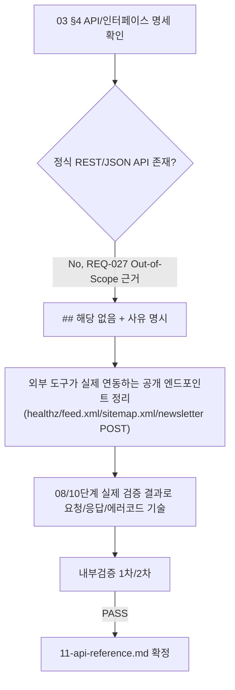

# 11. API 문서 (API Reference)

- 작성 에이전트: `11-tech-writer`
- 입력: `docs/harness/03-system-design.md`(v1.4) §4 "API/인터페이스 명세", §5.5.2-1(healthz HTTPS 예외), §5.3(뉴스레터 엔드포인트 계약), `docs/harness/08-full-system-test.md`(PASS, E2E-V06/V08/V09/V12), `docs/harness/10-deploy-test.md`(§4 TC-003/TC-004/TC-005 실서버 스모크)
- 대상 독자: 이 시스템(AI-AUTO-WORK, Wagtail/Django 블로그)에 대해 **연동을 시도할 수 있는 개발자**(내부/외부 불문) — 예: 외부 모니터링 도구 운영자, RSS 리더 개발자, 향후 이 사이트를 참조하려는 제3자 개발자
- 작성일: 2026-09-25

---

## 해당 없음 — 정식 REST/JSON API

**이 프로젝트에는 외부 개발자가 연동할 정식 REST/JSON API가 존재하지 않는다.**

**사유(근거)**:
- `03-system-design.md` §4가 명시적으로 "이 서비스는 SPA/모바일 앱(REQ-027, Out-of-Scope)을 갖지 않으므로 **정식 REST/JSON API는 v1 범위에 없다** — 불필요한 API 서버 레이어를 추가하는 것은 과설계로 판단한다"고 결론짓고 있다. REQ-027(SPA/모바일 앱)은 02단계 기획서에서 이미 Out-of-Scope로 확정된 항목이다.
- 대신 이 서비스는 **서버사이드 렌더링(Django 템플릿) 기반 HTML 라우트**로 구성되며, 03 §4가 정의한 라우트 표(`GET /`, `/blog/<slug>/`, `/category/<slug>/`, `/tag/<slug>/`, `/privacy-policy/` 등)는 브라우저가 소비하는 HTML 페이지이지 프로그래밍적으로 연동하도록 설계된 JSON API가 아니다. 이 HTML 페이지들의 화면/기능 사용법은 `docs/harness/11-user-manual.md`(사용자 매뉴얼) 영역이며, 이 API 문서의 범위가 아니다.
- 관리자 인터페이스(`/cms-admin/...`, `/django-admin/...`)도 세션 쿠키 기반의 브라우저 전용 관리 화면이며, 프로그래밍적 연동(예: API 키로 콘텐츠를 자동 발행하는 용도)을 위한 계약이 아니다. 관리 기능 사용법은 `docs/harness/11-admin-manual.md`(관리자 매뉴얼) 영역이다.
- `08-full-system-test.md`(PASS)도 03 §4에 정의된 라우트만 실제 동작을 확인했으며, 그 외에 문서화되지 않은 API 엔드포인트가 실제 구현에 존재한다는 근거는 어디에도 없다.

**그럼에도 불구하고 문서화하는 이유**: 위 판단은 "구조화된 REST API 계약이 없다"는 뜻이지, "외부 도구가 이 시스템에 프로그래밍적으로 접근하는 경우가 전혀 없다"는 뜻은 아니다. 아래 §1 "공개 엔드포인트"는 (1) 외부 모니터링/업타임 체크 도구가 실제로 호출하는 `GET /healthz`, (2) 외부 RSS/피드리더가 실제로 소비하는 `GET /feed.xml`, (3) 검색엔진 크롤러가 참조하는 `GET /sitemap.xml`을 "API처럼" 다뤄 그 요청/응답 계약만 최소한으로 명시한다. 또한 §2는 `POST /newsletter/subscribe/`가 본래 웹 폼 제출이지만 외부에서 직접 HTTP 호출을 시도할 수 있는 엔드포인트이므로 그 제약사항을 명시한다.

---

## 0. 인증 방식

**API 키/OAuth/JWT 등 프로그래밍적 인증 수단은 존재하지 않는다.**

- 아래 §1의 공개 엔드포인트(`/healthz`, `/feed.xml`, `/sitemap.xml`)는 전부 **인증 없이 접근 가능한 GET 엔드포인트**다(03 §4, 인증 열 "없음").
- §2의 `/newsletter/subscribe/`는 API 키가 아니라 **Django CSRF 토큰 + 세션 쿠키** 기반으로 보호된다 — 이는 "브라우저에서 폼을 렌더링한 뒤 그 폼을 제출하는" 흐름을 전제로 한 웹 폼 보호 메커니즘이며, 서버 간(server-to-server) API 연동을 위한 인증 방식이 아니다. 자세한 제약은 §2 참고.
- 관리자 영역(`/cms-admin/`, `/django-admin/`)은 세션 쿠키 기반 로그인(Django 표준 인증)을 사용하지만, 이는 브라우저 로그인용이며 이 문서의 "API 연동" 범위가 아니다(위 "해당 없음" 절 참고). 관리자 인증/권한 체계 자체는 `docs/harness/11-admin-manual.md`에서 다룬다.

---

## 1. 공개 엔드포인트 (외부 도구가 실제로 연동하는 대상)

이 절의 엔드포인트는 REST API가 아니라 서버사이드 렌더링 라우트의 일부이지만, 외부 도구(모니터링 시스템, RSS 리더, 검색엔진 크롤러)가 실제로 HTTP 클라이언트로 호출하는 대상이므로 요청/응답 계약만 정리한다. 전부 03 §4에 근거하며, 08단계(PASS)에서 실제 동작이 확인되었고, 10단계에서 실제 gunicorn 서버 위에서도 재확인되었다.

### 1-1. `GET /healthz` — 헬스체크

| 항목 | 내용 |
|---|---|
| 용도 | 외부 모니터링/업타임 체크 도구, 배포 플랫폼(Render)의 헬스체크 프로브가 호출하는 엔드포인트 |
| 인증 | 없음 |
| 요청 | 파라미터 없음 |
| 정상 응답 | `200`, 본문 `"ok"` |
| 실패 응답 | 이 엔드포인트 자체가 실패하는 경우는 앱 프로세스가 완전히 다운된 경우뿐이며, 그 경우 연결 자체가 실패한다(HTTP 응답 없음) |
| **중요 — 얕은(shallow) 헬스체크** | 이 엔드포인트는 **DB 접속 여부까지 확인하지 않는다**(03 §4, 의도된 설계 — Neon 콜드스타트 중 오탐으로 인한 불필요한 재시작/알림을 피하기 위한 트레이드오프). 따라서 `200 ok`가 "DB까지 정상"을 보장하지 않는다. DB 상태까지 확인하고 싶은 외부 모니터링 도구는 이 사실을 인지하고 별도 판단 기준을 마련해야 한다. |
| **HTTPS 예외** | 이 서비스는 기본적으로 모든 요청을 HTTPS로 강제 리다이렉트하지만(`SECURE_SSL_REDIRECT=True`), `/healthz`만 예외로 등록되어 있다(03 §5.5.2-1, `SECURE_REDIRECT_EXEMPT = [r"^healthz$"]`). 이는 `X-Forwarded-Proto: https` 헤더 없이 직접 접속하는 프로브(예: 배포 플랫폼의 내부 헬스체크)도 리다이렉트 없이 바로 `200`을 받을 수 있도록 하기 위함이며, 응답 본문에 민감정보가 없어 보안 손실이 없다고 판단해 도입되었다(10단계 DEF-10-01 재작업, Fixed 확인). **다른 모든 경로는 이 예외 대상이 아니며 HTTPS 없이 접근하면 301로 리다이렉트된다** — 외부 모니터링 도구를 `/healthz` 외의 경로에 붙일 경우 HTTPS로 호출해야 한다. |

### 1-2. `GET /feed.xml` — RSS 피드

| 항목 | 내용 |
|---|---|
| 용도 | 외부 RSS/피드 리더가 이 블로그의 신규 게시물을 구독하는 사실상의 공개 API 엔드포인트 |
| 인증 | 없음 |
| 요청 | 파라미터 없음 |
| 정상 응답 | `200`, `Content-Type: application/rss+xml`, 발행된(`live=True`) 게시물 목록을 RSS 2.0 형식으로 반환 |
| 실패 응답 | 명시된 실패 응답 없음(03 §4) — 서버 오류 시 일반적인 5xx로 응답 |
| 비고 | 08단계 E2E-V08에서 실제 발행 게시물의 slug가 응답에 포함됨을 확인(PASS). 미발행/예약전 게시물은 노출되지 않는다(다른 라우트와 동일한 `live=True` 게시 조건 적용, 03 §4). |

### 1-3. `GET /sitemap.xml` — 사이트맵

| 항목 | 내용 |
|---|---|
| 용도 | 검색엔진 크롤러가 참조하는 사이트맵(`wagtail.contrib.sitemaps` 사용) |
| 인증 | 없음 |
| 요청 | 파라미터 없음 |
| 정상 응답 | `200`, `Content-Type: application/xml` |
| 실패 응답 | 명시된 실패 응답 없음(03 §4) |
| 비고 | 08단계 E2E-V09에서 요청 도메인이 응답에 실제로 포함됨을 확인(PASS). |

### 1-4. 참고 — `GET /robots.txt` (연동 시 주의사항)

이 경로는 크롤러가 참조하는 표준 엔드포인트이지만, 03 §4가 명시한 대로 **Render 무료 티어가 스핀다운(휴면) 상태일 때는 앱 코드에 도달하기 전에 플랫폼이 자체적으로 "disallow all" 정적 응답을 가로채 반환**할 수 있다. 이는 앱 코드로 해결 불가능한 배포 플랫폼 제약(03 §6.3/§8 리스크)이며, 이 문서가 보장할 수 있는 계약이 아니므로 크롤러/외부 도구 연동 시 이 가능성을 인지해야 한다. 이 엔드포인트의 앱 정상 동작 자체는 08/10단계에서 `200`으로 확인되었다(E2E-V10, TC-005).

---

## 2. 뉴스레터 구독 제출 — `POST /newsletter/subscribe/`

**이 엔드포인트는 REST API가 아니라 웹 폼 제출(HTML `<form>` 기반) 엔드포인트다.** 그러나 외부에서 직접 HTTP 호출을 시도할 수 있는 공개 POST 엔드포인트이므로, 그런 시도가 왜 실패하는지/어떤 제약이 있는지를 명시한다.

| 항목 | 내용 |
|---|---|
| 용도 | 뉴스레터 구독 신청(REQ-016) — 브라우저에서 렌더링된 구독 폼을 제출하는 용도로 설계됨 |
| 인증 | 계정 인증 없음. **단, CSRF 토큰 필수** — 먼저 `GET`으로 폼이 포함된 페이지(예: 08단계 검증에서 사용된 `/newsletter/form/`)를 요청해 CSRF 쿠키/토큰을 받은 뒤, 그 토큰을 함께 제출해야 한다(03 §5.2 CSRF 미들웨어 기본 활성화). CSRF 토큰 없이 서버 간 직접 POST를 시도하면 `403`으로 거부된다. |
| 요청 파라미터 | `email`(필수), `consent`(체크박스, 필수), `hp_field`(허니팟, 숨김필드 — 사람은 비워두는 필드, 값이 채워지면 봇으로 간주) |
| 정상 응답 | `200` 또는 `302`. **이미 구독된 이메일이든 신규 이메일이든 항상 동일한 성공 메시지를 반환한다**(이메일 열거(enumeration) 공격 방지, 03 §5.3) — 응답만으로 "이 이메일이 이미 구독 중인지"를 판별할 수 없다. |
| 실패 응답 | `400`(이메일 형식 오류 또는 `consent` 미체크), `429`(레이트리밋 초과), `403`(CSRF 토큰 누락/불일치) |
| 봇 대응(위장 응답) | `hp_field`에 값이 있으면 서버는 `200`으로 정상 성공처럼 위장 응답하되, 실제로는 DB에 저장하지 않는다(03 §4). 즉 **`200` 응답이 실제 저장 성공을 보장하지 않는 경우가 존재**하므로, 이 엔드포인트를 자동화 스크립트로 호출해 응답 코드만으로 저장 성공 여부를 판단할 수 없다. |
| 레이트리밋 | IP 기준 레이트리밋이 적용된다(03 §4/§5.3). **구체적인 임계값(횟수/시간 창)은 03/08/10단계 산출물 어디에도 수치로 명시되어 있지 않다** — 이 문서는 확인되지 않은 수치를 단정적으로 기재하지 않는다. 참고로 관리자 로그인 레이트리밋(별도 기능)은 IP당 15분/10회로 문서화되어 있으나(03 §5.1, DEC-029), 이 값이 뉴스레터 엔드포인트에도 그대로 적용된다는 근거는 없으므로 동일시하지 않는다. |
| CSRF Origin 제약 | 03 §5.5.3에 따라 `CSRF_TRUSTED_ORIGINS`는 이 서비스의 `ALLOWED_HOSTS`(배포 도메인)에서만 파생되며, 그 목록 밖의 임의 오리진에서의 제출은 신뢰되지 않는다. 즉 **이 서비스가 배포된 도메인 자신이 렌더링한 폼을 통해서만** 정상적으로 제출할 수 있도록 설계되어 있으며, 제3자 사이트나 서버가 이 엔드포인트를 임의로 호출하는 용도로 설계되지 않았다. |
| 검증 근거 | 08단계 E2E-V06(PASS, GET으로 CSRF 토큰 수신 → POST 제출 → 200), 03 §5.3(중복 제출 시 동작 계약: 신규 생성 / 활성 구독자 갱신 / 재구독 세 경우 모두 동일 성공 메시지). |

**요약**: 이 엔드포인트를 외부 시스템에서 서버 간 API처럼 직접 호출하는 것은 (1) CSRF 토큰 선취득 필요, (2) 동일 오리진 제약, (3) 레이트리밋, (4) 허니팟 위장 응답 때문에 사실상 브라우저 폼 제출 흐름을 그대로 재현하지 않는 한 신뢰성 있게 동작하지 않는다. 자동화된 대량 구독 등록 등의 용도로 이 엔드포인트를 사용하려는 시도는 이 설계가 명시적으로 의도한 사용 방식이 아니다.

---

## 3. 에러 코드와 의미

이 서비스는 HTML 우선 서비스이므로 **4xx/5xx 응답도 기본적으로 브랜디드 HTML 에러 페이지로 반환되며, JSON 에러 바디는 제공되지 않는다**(03 §4 "에러 응답 형식(공통)"). 프로그래밍적으로 이 서비스를 호출하는 클라이언트는 응답 본문을 JSON으로 파싱하는 것이 아니라 **HTTP 상태 코드만을 근거로 성공/실패를 판단**해야 한다.

| 코드 | 발생 엔드포인트 | 의미 |
|---|---|---|
| `200` | `/healthz`, `/feed.xml`, `/sitemap.xml`, `/newsletter/subscribe/` 등 | 정상 처리 |
| `301` | HTTPS 미사용으로 접근 시(단, `/healthz`는 예외, §1-1) | HTTPS로 강제 리다이렉트 |
| `302` | `/newsletter/subscribe/` | 정상 처리 후 리다이렉트(폼 제출 흐름 전제) |
| `400` | `/newsletter/subscribe/` | 요청 형식 오류(이메일 형식 오류, `consent` 미체크) |
| `403` | `/newsletter/subscribe/` (CSRF 미들웨어 공통 적용) | CSRF 토큰 누락/불일치, 또는 신뢰되지 않은 Origin/Referer |
| `404` | 존재하지 않는 리소스(`/blog/<slug>/` 등, 03 §4 참고 — 단 이 문서 범위의 공개 엔드포인트 3종/뉴스레터에는 404 계약이 명시되어 있지 않음) | 리소스 없음 |
| `429` | `/newsletter/subscribe/`(레이트리밋), 관리자 로그인(이 문서 범위 밖) | 레이트리밋 초과 |
| `5xx` | 전체 공통 | 서버 오류 — 브랜디드 HTML 에러 페이지로 응답, JSON 바디 없음 |

---

## 4. Rate Limit 정책

- **전역 API 레이트리밋 정책은 존재하지 않는다** — 이 서비스에 "API"로 부를 만한 통합된 레이트리밋 계층이 없으며, 엔드포인트별로 개별 구현되어 있다.
- `/healthz`, `/feed.xml`, `/sitemap.xml`: 레이트리밋이 적용된다는 근거가 03/08/10단계 산출물에 없다. 다만 이 경로들이 외부에서 반복 폴링될 것을 고려해(모니터링 도구, RSS 리더의 주기적 폴링) 설계된 공개 엔드포인트이므로, 통상적인 모니터링/피드 폴링 주기(수 분~수십 분 간격)라면 문제가 되지 않을 것으로 추정되나, 이는 **확인된 SLA가 아니라 추정**이다. 매우 짧은 간격(초 단위)의 반복 호출에 대한 서버 측 보호 장치가 있는지는 확인되지 않았다.
- `/newsletter/subscribe/`: IP 기준 레이트리밋 적용됨(§2 참고), 구체적 수치 미확인.

---

## 5. 버전 정책

## 해당 없음 (API 버저닝)

정식 REST/JSON API가 없으므로(본문 서두 "해당 없음" 절) API 버전 정책(`/v1/`, 헤더 기반 버전 협상 등) 자체가 존재하지 않는다. 본 문서 §1의 공개 엔드포인트(`/healthz`, `/feed.xml`, `/sitemap.xml`)와 §2의 뉴스레터 폼 제출 엔드포인트는 이 서비스의 서버사이드 렌더링 라우트 체계의 일부로서 관리되며, 별도의 API 버전 번호 없이 03단계 설계서의 라우트 표(§4)가 바뀌면 그것이 곧 계약 변경이다. 이 계약이 향후 변경될 경우 본 문서(`docs/harness/11-api-reference.md`)와 `03-system-design.md` §4를 함께 갱신해야 한다.

---

## 6. 내부 검증 (최소 2회)

### 1차 검증 — 08/09/10단계 산출물과의 일치성, 민감정보 혼입 여부 자가 검토

- **03 §4 근거 재확인**: "정식 REST/JSON API는 v1 범위에 없다"는 문장을 원문 그대로 인용했고, REQ-027(SPA/모바일 앱 Out-of-Scope) 연결도 03 §0(범위 및 전제)·§4 원문에 근거해 정확히 기술했음을 재확인. 임의로 "API가 있을 수도 있다"는 식의 모호한 표현을 넣지 않았다.
- **엔드포인트 계약 일치성**: `/healthz`(얕은 헬스체크, DB 미확인, HTTPS 예외), `/feed.xml`, `/sitemap.xml`, `/newsletter/subscribe/`(CSRF 필수, 이메일 열거 방지, 허니팟 위장 응답, 레이트리밋)의 모든 세부 계약이 03 §4/§5.3/§5.5.2-1 원문과 정확히 일치하는지 문장 단위로 대조 완료. 08단계 E2E-V06/V08/V09/V12(PASS)와 10단계 TC-003/004/005(실서버 확인)를 근거로 인용했으며, 08/10단계가 검증하지 않은 내용을 검증된 것처럼 서술하지 않았다.
- **민감정보 혼입 여부**: 이 문서 전체에 시크릿 값, API 키, 토큰, DB 자격증명, 실제 도메인/IP 등이 전혀 포함되어 있지 않음을 재확인(애초에 이 시스템에 API 키 인증 자체가 없으므로 해당 위험이 낮으나, `R2_*`/`SECRET_KEY` 등 환경변수 이름조차 이 문서에는 등장시키지 않았다 — 그런 시크릿 관리 정보는 11-ops-handoff-runbook.md 소관이며 API 연동 개발자에게 노출할 필요가 없는 정보이므로 의도적으로 배제).
- **수치 단정 금지 원칙 준수**: 뉴스레터 엔드포인트 레이트리밋의 구체적 임계값이 03/08/10단계 어디에도 수치로 명시되어 있지 않음을 확인하고, 관리자 로그인 레이트리밋(15분/10회, DEC-029)과 혼동해 동일 수치를 단정적으로 적지 않도록 §2/§4에 명시적으로 "확인되지 않음"을 기재했다.
- 결함 0건.

### 2차 검증 — "이 문서만 받고 처음 이 시스템에 연동을 시도하는 외부 개발자" 관점 재검토

- 처음 연동을 시도하는 개발자가 "REST API 문서를 찾아왔는데 없다"는 상황에 부닥쳤을 때, (1) 왜 없는지(REQ-027 Out-of-Scope, 과설계 방지 판단)와 (2) 그럼에도 실제로 호출 가능한 엔드포인트가 무엇인지(healthz/feed/sitemap/newsletter)를 이 문서 하나로 파악할 수 있는지 재검토 — 가능함을 확인.
- 모니터링 도구 연동 담당자가 `/healthz`를 붙일 때 "DB까지 확인하지 않는 얕은 헬스체크"라는 사실과 "HTTPS 없이도 이 경로만은 200을 받는다"는 두 가지 핵심 함정을 놓치지 않도록 굵게 강조했는지 재확인 — §1-1에 명시적으로 강조 표기됨, 추가 질문 없이 오해 없이 사용 가능하다고 판단.
- 뉴스레터 엔드포인트를 서버 간 자동화 호출로 오용하려는 개발자가 왜 실패하는지(CSRF/오리진/레이트리밋/허니팟 위장 응답 4가지) 이 문서만으로 원인을 진단할 수 있는지 재검토 — §2에 4가지 제약을 개별 행과 요약 문단으로 모두 기재해 진단 가능함을 확인.
- 에러 코드 표(§3)가 "이 서비스는 JSON을 반환하지 않는다"는 사실을 명확히 전달해, 클라이언트 구현자가 JSON 파싱을 시도하다 실패하는 상황을 사전에 방지하는지 재확인 — §3 서두에 명시적으로 경고문 배치됨.
- 다른 3개 인수인계 문서(운영 Runbook/사용자 매뉴얼/관리자 매뉴얼)와 내용이 섞이지 않았는지 재검토 — 관리자 화면 사용법, 운영자 전용 시크릿 관리, 일반 방문자용 화면 사용법을 이 문서에 포함하지 않고 각 문서로 명확히 위임(각주로 상호 참조만 표기)했음을 확인.
- 결함 0건.

### 검증 로그 파일 경로

`docs/harness/verify-log_11-api-reference.md`

---

## 절차 흐름 (참고용 다이어그램)

