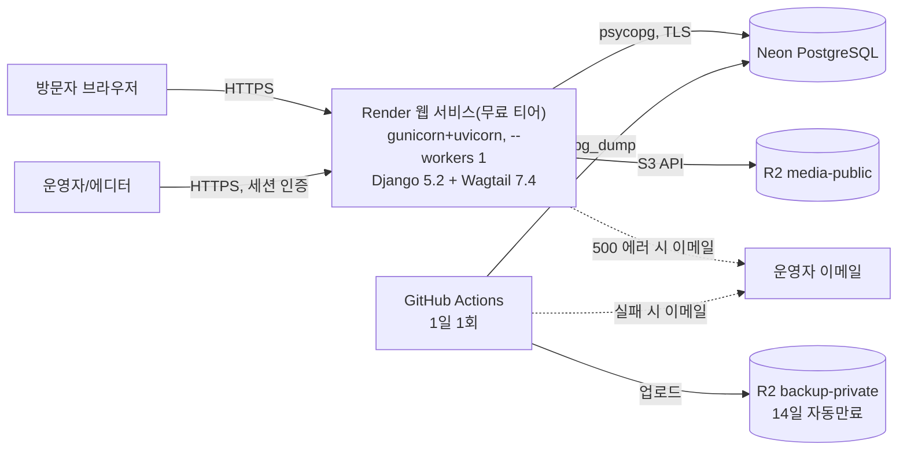

# 11. 운영 인수인계 문서 (Ops Handoff Runbook)

- 작성 에이전트: `11-doc-writer`(운영 인수인계 담당 범위)
- 대상 독자: **처음 이 서비스의 온콜을 서는 운영자**(사전 지식 없이 이 문서 하나만으로 배포 이해·환경변수 설정·모니터링·장애 대응·롤백 판단을 할 수 있어야 한다)
- 입력 문서(전부 PASS 확인, 순서대로 반영): `docs/harness/02-planning.md`(v1.2), `docs/harness/03-system-design.md`(**v1.4**, §5.5.2-1 포함), `docs/harness/04-ux-design.md`, `docs/harness/08-full-system-test.md`(PASS), `docs/harness/09-security-audit.md`(재작업 라운드2 최종 PASS), `docs/harness/10-deploy-test.md`(원본 CONDITIONAL PASS → §9-1/§11 재검증으로 **최종 PASS** 갱신), `docs/harness/decisions.md`(DEC-001~044)
- 작성일: 2026-09-25
- 버전: v1.0

> **이 문서의 성격**: 이 문서는 10단계(`10-deploy-test.md`)가 이미 실측 검증한 배포/롤백/모니터링 절차를 **재검증하지 않고 인용·요약**한다(ORCHESTRATOR.md 규칙, 이번 호출 범위 지시). 실제 배포 절차 자체의 신뢰도(성공/실패 여부)에 대한 근거는 전부 `10-deploy-test.md` §4/§9-1/§11을 원출처로 한다. 이 문서가 새로 하는 일은 "인수인계 가능한 형태로 정리"뿐이다.

---

## 0. 이 문서를 읽기 전에 반드시 알아야 할 사실 3가지

1. **이 프로젝트는 아직 한 번도 실제로 배포된 적이 없다.** 10단계(배포테스트)는 전부 로컬 Docker 재현(Neon 대신 자체 SSL Postgres 컨테이너, Cloudflare R2 대신 MinIO, 실제 GitHub Actions 대신 로컬 셸 재현)으로 수행됐다(`10-deploy-test.md` §2 Out-of-Scope, §3). **실제 Render/Neon/Cloudflare R2/GitHub Actions 계정은 이 시점까지 하나도 발급되지 않았다.** 12단계(실배포)가 이 프로젝트가 실제 벤더 환경을 처음 마주하는 순간이며, 이 Runbook의 "정상 범위 기준값"·"대시보드 위치" 중 상당수는 배포 후 최초 1회 실측·확정이 필요한 잠정치다. 이 문서 곳곳에 "배포 후 확인 필요"로 명시한 항목은 임의로 확정된 사실처럼 읽지 말 것.
2. **이 서비스는 1인 또는 2~3인 소규모 운영을 전제로 설계됐다**(`02-planning.md` §2 가정 A1). 24시간 온콜 로테이션, 별도 SRE 팀, 유료 APM(Sentry/Datadog 등)은 전제되어 있지 않다(DEC-001, MCP 미연동). 아래 "모니터링/알림" 절은 전부 플랫폼 네이티브 기능(이메일 알림 등)으로 대체된 구성이다 — 이는 결함이 아니라 의도된 설계다.
3. **10단계의 최종 판정은 PASS다.** 원본 `10-deploy-test.md`(2026-09-18 작성)는 12단계 착수 전 필수 조건 2건(DEF-10-01 High, DEF-10-03 Medium)이 남아 **CONDITIONAL PASS**였으나, 2026-09-25 규칙F 재작업(DEC-044)으로 두 조건 모두 **Fixed** 확인되어 `10-deploy-test.md` §9-1/§11에서 판정이 **정식 PASS로 갱신**됐다. 이 문서는 그 최신 판정(§9-1/§11)을 기준으로 작성한다 — 원본 §9(CONDITIONAL PASS)만 보고 "조건부"라고 읽으면 안 된다. 단, §9-1 자체가 "PASS가 12단계 이후 어떤 문제도 없다는 보증은 아니다"라고 명시했으므로, 이 Runbook도 잔여 리스크를 숨기지 않는다(아래 §7/§8).

---

## 1. 시스템 개요 및 아키텍처 요약

(원출처: `03-system-design.md` §1, v1.4)

- **서비스 성격**: Python/Django 5.2 LTS + Wagtail 7.4 LTS 기반 블로그/콘텐츠 사이트(1인/소규모 운영, 무료·비영리 MVP, DEC-005). 회원가입·결제·광고 기능 없음(REQ-021~024 Out-of-Scope).
- **컴포넌트 구성**: 단일 모놀리식 Django(+Wagtail) 애플리케이션을 Render 웹 서비스 1개(무료 티어, 단일 인스턴스, gunicorn `--workers 1` 고정, DEC-026)로 배포한다. 데이터는 **Neon PostgreSQL**(managed, scale-to-zero), 미디어/백업 파일은 **Cloudflare R2**(S3 호환)에 저장한다. 정기 백업은 Render 앱 프로세스가 아니라 **GitHub Actions**(cron 스케줄, 1일 1회)가 독립적으로 수행해, 앱이 죽어도 백업 잡은 영향받지 않는 장애 격리를 확보한다.
- **모듈 경계(Django app)**:
  | App | 책임 |
  |---|---|
  | `blog` | 콘텐츠 모델, 카테고리/태그, 공개 목록/상세, RSS, 사이트맵, JSON-LD |
  | `subscribers` | 뉴스레터 이메일 수집, 스팸 방지, 동의 기록(개인정보 취급 — `blog`와 의도적으로 격리) |
  | `legal` | 개인정보처리방침/이용약관/쿠키고지 + 콘텐츠 정책(REQ-015) |
  | `core` | 헬스체크(`/healthz`), robots.txt, 관리자 로그인 레이트리밋(`admin_auth.py`), 사용량 대시보드 |
  | Wagtail 내장 | 편집 워크플로, 리비전, 어드민 인증/권한 |
- **인증 모델**: 운영자/에디터는 Django 세션 인증 + Wagtail 그룹 페이지 권한(OAuth/SSO/JWT 없음, DEC-009). 독자/구독자는 계정 없이 이메일만 수집(무인증).
- **관리자 진입점이 정확히 2개 존재**한다(중요, 아래 §7에서 다시 강조):
  1. `/cms-admin/login/` — Wagtail 관리자(콘텐츠/이미지/권한 관리, 실질적 운영 화면).
  2. `/django-admin/login/` — Django 기본 관리자(뉴스레터 구독자 하드 삭제/개인정보 파기절차의 **유일한** 실행 경로).
  두 경로는 **동일한 `auth_user` 슈퍼유저 계정**을 공유하며, 현재는 둘 다 동일한 IP 기반 레이트리밋(15분/10회 공유 카운터)으로 보호된다(`03-system-design.md` §5.1 v1.3, DEC-040/041, `ADMIN_ACCESS_GUIDE.md` §1/§4).
- **캐싱**: Django `LocMemCache`(프로세스 로컬, 5~15분 TTL). Redis/Render Key Value는 v1에서 의도적으로 도입하지 않았다(과설계 방지, DEC-012). 이 결정은 gunicorn `--workers 1` 고정과 짝을 이룬다 — **워커 수를 늘리면 캐시/레이트리밋/사용량 카운터가 전부 워커별로 갈라져 무의미해진다.** 워커를 늘려야 할 필요가 생기면 그 전에 반드시 공유 저장소(Redis 등)로 먼저 전환해야 한다(`03-system-design.md` §6.2, `ADMIN_ACCESS_GUIDE.md` §4). **[2026-09-25 추가, `final-content-workflow-verification.md` §6]** 이 캐시는 **페이지 단위**(`cache_page`, 블로그/법적 페이지 등 공개 뷰 전반)로도 적용된다 — 운영자가 글을 **수정하거나 삭제**해도, 그 URL이 이미 캐시되어 있었다면 **최대 10분간 이전 버전(또는 삭제된 페이지)이 그대로 보일 수 있다.** 급하게 반영해야 하면(예: 오탈자·민감정보 긴급 수정) Render 대시보드에서 서비스를 재시작하면 즉시 캐시가 비워진다(단일 워커 프로세스가 새로 뜨므로) — 다만 재시작은 짧은 콜드스타트를 유발하므로(§0-2) 급하지 않다면 그냥 기다리는 것을 권장한다.
- **API 성격**: 정식 REST/JSON API 없음(서버사이드 렌더링, 03 §4). 외부/내부 연동을 위한 API 엔드포인트가 존재하지 않으므로 API 연동 문의가 오면 `11-api-reference.md`("해당 없음" 문서)를 참고하도록 안내한다.

---

## 2. 배포 절차 요약 및 검증된 롤백 절차 (10단계 인용/요약 — 재검증 없음)

### 2-1. 배포 파이프라인 개요 (10단계 TC-001~003, TC-011 인용)

1. Render가 `webapp/build.sh`(`buildCommand`)를 실행: `pip install` → `collectstatic` → `migrate --noinput` → `ensure_superuser`(슈퍼유저가 하나도 없을 때만 생성, 멱등).
2. `startCommand`: `gunicorn config.asgi:application -k uvicorn.workers.UvicornWorker --workers 1` (워커 수 1은 우연이 아니라 DEC-026의 의도된 고정값 — §1 캐싱 절 참고).
3. Render는 `healthCheckPath: /healthz`가 200을 반환해야 신규 인스턴스로 트래픽을 전환한다(zero-downtime 배포).
4. 10단계가 이 전체 과정을 실제 Linux 컨테이너(Docker, `python:3.12.9-slim`)에서 처음부터 끝까지 실행해 **오류 없이 완료됨을 실측 확인**했다(`10-deploy-test.md` TC-001/002, PASS). 빌드 재현성(동일 소스 재빌드 시 `pip freeze`/`collectstatic` 산출물 완전 동일)도 TC-012로 확인됐다.

### 2-2. `/healthz` 관련 확정 사항 (DEF-10-01 Fixed — 재검증하지 않고 결과만 인용)

- `production.py`에 `SECURE_REDIRECT_EXEMPT = [r"^healthz$"]`가 반영되어 있어, Render 헬스체크 프로브가 `X-Forwarded-Proto` 헤더 없이 직접 접속해도 `/healthz`가 200을 반환한다(`03-system-design.md` §5.5.2-1, `10-deploy-test.md` §11 DEF-10-01 재검증 항목, 회귀테스트 `HealthzHttpsRedirectExemptTests` 3케이스 PASS). **이 설정이 없으면 최초 배포 자체가 영구히 헬스체크 실패로 막힐 수 있었다**(`10-deploy-test.md` §8) — 최종 판정은 Fixed이지만, 만약 향후 이 설정이 실수로 제거되면 같은 문제가 재발한다는 것을 온콜 운영자는 알아야 한다. **배포 후 최초 1회, 실제 Render 환경에서 신규 배포가 정상적으로 트래픽 전환까지 완료되는지 반드시 확인할 것**(`10-deploy-test.md` §2가 이미 "Render 실제 헬스체크 프로브 헤더 처리 방식은 미확인"이라고 명시한 잔여 리스크).

### 2-3. 백업 워크플로 pg_dump 버전 확정 사항 (DEF-10-03 Fixed — 재검증하지 않고 결과만 인용)

- `.github/workflows/neon-db-backup.yml`의 `postgresql-client` 설치 스텝이 Ubuntu 기본 저장소 대신 **PostgreSQL 공식 APT 저장소(PGDG)**를 사용하도록 수정되어, 항상 Neon 서버 버전 이상의 클라이언트가 설치된다(`10-deploy-test.md` §11 DEF-10-03 재검증, Docker로 "구버전 client + 신버전 server" 조합 실패 재현 후 수정본으로 해소 확인).
- **배포 후 확인 필요(잠정치)**: 실제 Neon 프로젝트 생성 시 표시되는 PostgreSQL 서버 메이저 버전을 최초 배포 시점에 확인해 두고, 이 워크플로가 실제 GitHub Actions 러너에서 최소 1회 성공적으로 실행되는지 확인할 것(`10-deploy-test.md` §2 Out-of-Scope — 실제 GitHub Actions 실행 자체는 10단계 범위 밖).

### 2-4. 롤백 절차 (10단계 TC-017/018/021 실측 결과 인용 — 이 절차 자체를 이 문서가 재검증하지 않음)

- **코드 롤백**: Render 대시보드에서 **최근 2개 배포까지만** 원클릭 롤백 가능(공식 제약, `03-system-design.md` §2.4). 10단계가 직전 커밋(관리자 로그인 보안수정 이전 커밋)으로 실제 재기동을 리허설한 결과, **마이그레이션 충돌 없이 정상 기동됨을 확인**했다(`No migrations to apply.`, `ensure_superuser` 멱등 재확인 — TC-017 PASS). 즉 **코드 롤백은 스키마 관점에서 안전하다.**
- **⚠️ 롤백 실행 전 반드시 확인할 것 (DEF-10-04, 아래 §7-3에서 상세)**: 롤백 대상 커밋이 2026-09-17 라운드2(관리자 로그인 무차별대입 방어, `RateLimitedAdminLoginView`/`core/admin_auth.py`) **이전** 버전이면, 그 방어가 조용히 사라진다(TC-018로 실증: 롤백된 버전에서 `/django-admin/login/`에 동일 IP로 11회 연속 로그인을 시도하면 11회 전부 200 — 429 없음). **스키마는 안전하지만 보안 수준은 안전하지 않을 수 있다.**
- **스키마 롤백**: Render는 DB 스키마를 자동으로 되돌리지 않는다. `03-system-design.md` §3.3의 하위호환 마이그레이션 원칙(컬럼/테이블 삭제는 2단계 배포로 분리)과 destructive 마이그레이션 직전 수동 `pg_dump` 백업 원칙을 따른다.
- **데이터 복구**: 1차 Neon PITR(6시간 이내), 2차 GitHub Actions 일일 백업(R2 `backup-private`, 최대 14일 보관). RPO ≈ 최대 24시간, RTO 잠정 목표 1시간 이내(수동 restore 기준). 10단계가 실제 재난복구 리허설(백업 다운로드 → 신규 DB → `psql -f` 복구 → 데이터 무결성 확인)을 **1회 실제로 수행해 성공을 확인**했다(TC-016 PASS, `wu10-backup-probe`/`probe@example.com` 복구 확인) — 상세 절차는 `webapp/BACKUP_RESTORE_GUIDE.md` §3을 그대로 따른다(이 문서가 그 절차를 재작성하지 않음).

### 2-5. 롤백 판단 체크리스트 (온콜 운영자용, 이 Runbook이 새로 정리한 요약)

1. 장애 발생 → 최근 배포가 원인으로 의심되는가? → Render 대시보드에서 직전 배포로 원클릭 롤백 검토.
2. **롤백 대상 커밋에 `webapp/core/admin_auth.py`의 `RateLimitedAdminLoginView` 클래스와 `webapp/config/urls.py`의 `path("django-admin/login/", RateLimitedAdminLoginView.as_view(), ...)` 오버라이드가 존재하는지 반드시 확인**(`10-deploy-test.md` DEF-10-04 권고 — 2026-09-17 라운드2 커밋 이후에만 존재). 없다면 롤백 후 관리자 로그인 무차별대입 방어가 사라진 상태이므로, 롤백 직후 임시로 어드민 접근을 IP 제한하거나 최단 시간 내 재작업 버전으로 재배포 계획을 세운다.
3. 롤백 직후 최근 마이그레이션이 destructive(컬럼/테이블 삭제)였는지 확인 — destructive였다면 §3.3 원칙(2단계 배포)을 따랐는지 재점검하고, 필요 시 §2-4 데이터 복구 절차로 전환.
4. 롤백 후 `/healthz` 200 확인, `/cms-admin/login/`·`/django-admin/login/` 정상 접근 확인.

---

## 3. 환경변수 / 시크릿 — 이름과 관리 방법만 (실제 값은 어디에도 기록하지 않음)

### 3-1. 관리 원칙 (`03-system-design.md` §5.4)

- **Render**: Environment Variables(대시보드)에서만 값을 입력한다. `render.yaml`은 Infrastructure as Code 골격이며, 시크릿 값은 `sync: false`로 플레이스홀더만 남기고 실제 값은 대시보드에서 채운다.
- **GitHub Actions**: 리포지토리 Secrets(`Settings > Secrets and variables > Actions`)에 저장하고, 워크플로 YAML에는 `${{ secrets.* }}`로만 참조한다.
- **로컬 개발**: `.env` 파일 사용, `.gitignore`에 반드시 포함(현재 포함되어 있음, `09-security-audit.md` SEC-21 확인).
- **최소 권한 원칙**: 백업용 DB 자격증명(GitHub Actions)은 앱 런타임용 자격증명(Render)과 **별도 계정/권한**으로 분리 권장. R2도 `media-public`용 키와 `backup-private`용 키를 분리 발급 권장(`BACKUP_RESTORE_GUIDE.md` §4).
- **이 문서에는 실제 키/토큰/비밀번호를 어떤 형태로도 기록하지 않는다.** 아래는 전부 "변수 이름"과 "어디서 관리하는지"만 나열한다.

### 3-2. Render 환경변수 체크리스트 (`render.yaml` 기준, 25개 전부 — DEF-10-02 반영)

> **DEF-10-02(Medium, Open) 반영**: `.env.example`이 아래 10개(★표시)를 빠뜨리고 있다(10단계 TC-010 실측 발견). 코드가 이 값들의 부재로 기동을 막지는 않지만(silent — 알림/부트스트랩 기능이 조용히 비활성될 뿐), 운영자가 `.env.example`만 보고 Render 대시보드를 채우면 이 10개를 빠뜨리기 쉽다. **아래 체크리스트를 Render Environment 탭 설정의 기준으로 사용할 것** — `.env.example` 자체의 갱신은 별도 후속 조치(코드 저장소 문서화, 비차단)로 남겨둔다.

| 구분 | 변수명 | 값 성격 | 관리 방법 |
|---|---|---|---|
| 고정값(플랫폼) | `DJANGO_SETTINGS_MODULE` | 고정 문자열(`config.settings.production`) | `render.yaml` `value:`로 항상 고정 — 대시보드에서 변경 금지 |
| 고정값(플랫폼) | `PYTHON_VERSION` | 고정 문자열 | `render.yaml` `value:` |
| 필수 시크릿 | `SECRET_KEY` | Django 시크릿 키 | Render 대시보드 Environment(sync:false), 최초 1회 강력한 무작위 값 생성 후 재사용 |
| 필수 시크릿 | `DATABASE_URL` | Neon 연결 문자열 | Render 대시보드. Neon 대시보드에서 "pooled connection string" 제공 여부 배포 시 확인(§6.4) |
| 필수 | `DJANGO_ALLOWED_HOSTS` | 커스텀 도메인 목록 | Render 대시보드 |
| 필수 | `WAGTAILADMIN_BASE_URL` | 관리자 기준 URL | Render 대시보드 |
| R2(미디어) | `R2_ACCESS_KEY_ID` / `R2_SECRET_ACCESS_KEY` / `R2_BUCKET_NAME` / `R2_ENDPOINT_URL` | Cloudflare R2 자격증명 | Render 대시보드(sync:false). `R2_REGION`은 `auto` 고정값 |
| R2(백업) | `R2_BACKUP_BUCKET_NAME` / `R2_BACKUP_ACCESS_KEY_ID` / `R2_BACKUP_SECRET_ACCESS_KEY` | 백업 전용 버킷 자격증명(가능하면 미디어 키와 분리 발급) | Render 대시보드. 비워두면 "backup" 스토리지 별칭이 비활성 상태로만 유지(배포를 막지 않음) |
| ★장애알림 | `DJANGO_ADMIN_EMAIL` | 500 에러 알림 수신 이메일 | Render 대시보드. 쉼표로 다중 주소 가능 |
| ★장애알림 | `EMAIL_HOST` | SMTP 호스트 | Render 대시보드 |
| ★장애알림 | `EMAIL_HOST_USER` | SMTP 계정 | Render 대시보드 |
| ★장애알림 | `EMAIL_HOST_PASSWORD` | SMTP 비밀번호/앱 비밀번호 | Render 대시보드(sync:false) |
| 고정값(장애알림) | `EMAIL_PORT` | 고정값(`587`) | `render.yaml` `value:` |
| 고정값(장애알림) | `EMAIL_USE_TLS` | 고정값(`true`) | `render.yaml` `value:` |
| ★장애알림 | `SERVER_EMAIL` | 발신자 표시 이메일 | Render 대시보드 |
| ★부트스트랩 | `DJANGO_SUPERUSER_USERNAME` | 최초 슈퍼유저 계정명 | Render 대시보드. **계정 생성 확인 후 반드시 삭제**(§5-2 참고) |
| ★부트스트랩 | `DJANGO_SUPERUSER_EMAIL` | 최초 슈퍼유저 이메일 | 위와 동일 |
| ★부트스트랩 | `DJANGO_SUPERUSER_PASSWORD` | 최초 슈퍼유저 비밀번호 | 위와 동일, 평문 비밀번호이므로 특히 신속히 삭제 |

(★ 10개가 DEF-10-02가 지적한 `.env.example` 누락 항목. 이 표 자체가 그 10개를 포함한 25개 전체 체크리스트다.)

### 3-3. GitHub Actions Repository Secrets (`BACKUP_RESTORE_GUIDE.md` §4 인용)

| Secret 이름 | 용도 | 관리 방법 |
|---|---|---|
| `NEON_BACKUP_DATABASE_URL` | 백업 전용 Neon 연결 문자열 | GitHub Repository Secrets. **앱용 `DATABASE_URL`과 별도 값 권장**(최소 권한 원칙, DEC-032) — 이 워크플로는 앱용 값으로 자동 대체하지 않는다 |
| `R2_BACKUP_ACCESS_KEY_ID` / `R2_BACKUP_SECRET_ACCESS_KEY` | `backup-private` 버킷 전용 키 | GitHub Repository Secrets. media-public 키와 별도 발급 권장 |
| `R2_BACKUP_BUCKET_NAME` | 백업 버킷 이름 | GitHub Repository Secrets(Render 값과 이름은 같아도 되나 별도 입력 필요 — 서로 다른 저장소) |
| `R2_ENDPOINT_URL` | R2 S3 호환 엔드포인트 | GitHub Repository Secrets |
| `R2_REGION` | R2 리전(선택, 비우면 `auto`) | GitHub Repository Secrets |

이 6개가 모두 채워져 있지 않으면 워크플로의 "Verify required secrets are present" 스텝이 즉시 실패로 알려준다(조용한 무동작 없음).

---

## 4. 모니터링 / 알림 채널 · 대시보드 위치 · 정상 범위 기준값

(원출처: `03-system-design.md` §6.3/§7.2/§7.4, `08-full-system-test.md` §4-1, `10-deploy-test.md` TC-008)

### 4-1. 알림 채널 목록

| 알림 대상 | 채널 | 실제 검증 상태 |
|---|---|---|
| 애플리케이션 500 에러 | Django `ADMINS`/`AdminEmailHandler` → `DJANGO_ADMIN_EMAIL`로 즉시 이메일 | 10단계가 강제 500 유발 → 실제 SMTP 발송/수신을 **실측 확인**(TC-008 PASS, mailhog 수신 확인). 단, 실제 배포 환경의 SMTP 벤더(EMAIL_HOST 등) 연동 성공 여부는 배포 후 재확인 필요 |
| **[2026-09-25 추가]** 신규 댓글 등록(승인 대기) | `comments/notifications.py` → 동일한 `DJANGO_ADMIN_EMAIL`(ADMINS) 재사용, 500 알림과 별개의 새 SMTP 설정 불필요 | 자동화 테스트(`comments.tests.CommentNotificationTests`)로 발송/미발송(ADMINS 공백 시)/허니팟 시 미발송/발송실패해도 댓글 저장은 성공 전부 확인. 실제 SMTP 벤더 발송 자체는 500 알림과 동일 채널이라 별도 재검증 불필요 |
| Render 사용량 한도(월 750시간/대역폭/빌드분) 임박·초과 | Render 플랫폼 자동 이메일(공식 기능) | 로컬 재현 불가(플랫폼 트리거 알림) — 배포 후 최초 1회 확인 필요(`10-deploy-test.md` §5 커버되지 않은 부분 3) |
| 백업(GitHub Actions) 실패 | GitHub 워크플로 실패 시 기본 이메일 알림 | 동일 사유로 배포 후 확인 필요. 리포지토리 소유자 계정의 Actions 알림 수신 설정이 켜져 있는지 사전 확인 권고(`BACKUP_RESTORE_GUIDE.md` §4 사전조건 3) |
| 배포 실패 | Render 대시보드 알림(빌드 실패 시) | 동일 사유로 배포 후 확인 필요 |

### 4-2. 대시보드 위치

- **사용량 대시보드(자체 구현)**: `/cms-admin/usage/`(세션 인증 필요, `08-full-system-test.md` E2E-O04로 접근 확인됨) — Render 750시간/대역폭 소진 추적을 돕는 내부 화면.
- **Render Billing 페이지**: Render 대시보드 내 해당 서비스의 Billing/Usage 탭 — 인스턴스시간 소진율 확인.
- **GitHub Actions 실행 이력**: 리포지토리 → Actions 탭 → "Neon DB Backup to R2" 워크플로 실행 목록 — 성공/실패가 색상으로 표시되고, 로그에 업로드된 오브젝트 키가 남는다(`BACKUP_RESTORE_GUIDE.md` §5).
- **R2 버킷 콘텐츠**: `aws s3 ls "s3://<R2_BACKUP_BUCKET_NAME>/db-backups/" --endpoint-url "<R2_ENDPOINT_URL>" --region auto`로 실제 백업 파일 존재 여부 직접 확인 가능(값은 §3-3 Secrets 참고, 커맨드에 실제 값을 하드코딩해 기록/커밋하지 말 것).
- **Neon 콘솔**: PITR 복원(Branches → Restore) — 정확한 메뉴 명칭은 `BACKUP_RESTORE_GUIDE.md` §3-1이 이미 "Neon 콘솔 UI 버전에 따라 달라질 수 있어 배포 후 1회 확인 필요"로 명시한 미확정 항목이다.

### 4-3. 정상 범위 기준값(KPI, `02-planning.md` §5 / `03-system-design.md` §6.1/§6.3 기준)

| 지표 | 목표치 | 측정 가능 여부 |
|---|---|---|
| TTFB(비-콜드스타트) | 1.5초 이내 | 로컬 스모크(참고용)만 확인됨(`08-full-system-test.md` PERF-01~06, 4.3~18.9ms 수준이나 이는 로컬 무-네트워크 기준). **실제 Neon/Render 네트워크 왕복 기준 수치는 배포 후 실측 필요** — 배포 전 시스템 결함이 아니라 배포 후에만 관측 가능한 값(DEC-038과 동일 원칙) |
| 콜드스타트 발생 비율 | 전체 요청의 5% 미만 | 배포 후 실측 필요 |
| Render 월 750 인스턴스시간 | 매월 80% 소진 시 유료 전환 검토(`03-system-design.md` §6.3 유료 전환 기준 4가지 중 하나) | 사용량 대시보드/Render Billing 페이지로 주 1회 수동 확인(§5 정기 유지보수) |
| Neon 무료 컴퓨트/저장 | 월 100 CU-hour / 0.5GB, 80% 이상 시 유료 전환 검토 | Neon 대시보드에서 수동 확인(자동 알림 메커니즘 없음 — Render처럼 플랫폼 자동 이메일이 있는지는 확인 필요) |
| 백업 성공률 | 정의된 주기(1일 1회)대로 100% 수행 | GitHub Actions 실행 이력으로 확인(§4-2). 실제 100% 달성 여부는 실배포 이후 누적 확인 필요 |
| 가용성 | 무료 티어 구간 "베스트 에포트"(공식 SLA 없음), 유료 전환 후 목표 99.5% | Render는 공식적으로 "Free instances는 프로덕션 비권장"이라고 명시함(`03-system-design.md` §2.4 인용) — 이 사실을 운영자가 반드시 인지하고 있어야 한다 |

### 4-4. 유료 전환 판단 기준 (`03-system-design.md` §6.3 인용)

아래 중 하나라도 충족하면 Render Starter 유료 플랜(스핀다운 없음) 전환을 검토한다:
1. 월간 UV 500명 초과 추세 확인
2. Render 무료 인스턴스시간이 매월 정기적으로 80% 이상 소진
3. Neon 무료 컴퓨트(월 100 CU-hour) 또는 저장용량(0.5GB) 사용률 80% 초과
4. Render 공식 경고("프로덕션 비권장")에도 불구하고 서비스가 사실상 상시 운영 상태로 전환되었다고 운영자가 판단할 때

---

## 5. 정기 유지보수 절차

### 5-1. 주기별 점검 체크리스트 (`03-system-design.md` §7.4 원출처 그대로 계승)

| 주기 | 항목 | 방법 |
|---|---|---|
| 주 1회 | Render Billing 페이지 수동 점검(750시간/대역폭 소진율) | Render 대시보드 |
| 주 1회 | GitHub Actions 백업 워크플로 성공 여부 확인 | Actions 탭 실행 이력 + R2 `backup-private` 버킷에 최신 덤프 파일 존재 확인(§4-2 커맨드) |
| 요청 발생 시 | 뉴스레터 탈퇴 요청 수동 처리 | `/django-admin/`에서 해당 `NewsletterSubscriber` 레코드 하드 삭제(`03-system-design.md` §5.6, `ADMIN_ACCESS_GUIDE.md` §1) — **이 삭제 경로는 §7-2가 강조하는 레이트리밋 보호 대상 로그인 화면 뒤에 있다** |
| 요청 발생 시 | 콘텐츠 정책(REQ-015) 위반 게시물 신고/삭제 | Wagtail 어드민에서 해당 페이지 미발행 처리 또는 삭제 |
| 배포 직전(destructive 마이그레이션 시) | 수동 백업 트리거 | `gh workflow run neon-db-backup.yml --ref main -f reason="..."` 또는 GitHub 웹 UI Actions 탭에서 수동 실행(`BACKUP_RESTORE_GUIDE.md` §3-3) |
| 10~12단계 직전, 이후 정기(권고) | 의존성 CVE 재스캔 | `09-security-audit.md` §8 리스크 7 권고 — 특히 boto3/psycopg/gunicorn은 릴리스 빈도가 높음 |
| 최초 배포 후 1회, 이후 필요 시 | 슈퍼유저 부트스트랩 환경변수 삭제 | §5-2 참고 |

### 5-2. 최초 슈퍼유저 계정 생성 후 정리 (`ADMIN_ACCESS_GUIDE.md` §2 인용)

Render Free 웹 서비스는 Shell 접속/one-off Job을 지원하지 않아(공식 문서 확인, 2026-09-17 시점) 대화형 `createsuperuser`를 쓸 수 없다. 대신:
1. Render Environment 탭에 `DJANGO_SUPERUSER_USERNAME`/`_EMAIL`/`_PASSWORD` 입력(§3-2 참고).
2. 배포/재배포 → `build.sh`의 `ensure_superuser`가 슈퍼유저가 없을 때만 생성.
3. 빌드 로그에서 "슈퍼유저 '...' 계정을 생성했습니다" 확인.
4. **계정 생성 확인 후 세 환경변수를 대시보드에서 즉시 삭제(강력 권장)** — 멱등 커맨드라 삭제해도 기존 계정에 영향 없음. 평문 비밀번호를 환경변수에 남겨두지 않기 위한 조치.
5. 이후 비밀번호 변경은 환경변수 재사용이 아니라 `/cms-admin/` 로그인 후 프로필 설정에서 수행.

### 5-3. 로그 로테이션

Render In-dashboard Logs를 1차 로그 소스로 사용한다(`03-system-design.md` §7.1). **무료 플랜의 로그 보존 기간은 이 하네스 문서 어디에서도 실측 확정되지 않았다** — "정확한 일수는 확인 필요"로 설계서가 이미 명시했다(§7.1). 장기 보존이 필요해지면 Render의 Log Streams(syslog/HTTPS)로 외부 무료 로그 수집기에 스트리밍하는 것이 v1 이후 검토 후보(Could, 필수 아님)다. **이 항목은 배포 후 실제 보존 기간을 확인해 이 Runbook에 갱신할 것을 권고한다.**

### 5-4. 인증서/키 갱신 주기

- **TLS 인증서**: Render가 엣지(로드밸런서)에서 TLS를 종료하는 구조이며(`03-system-design.md` §5.5.1), 이는 Render의 표준 PaaS 아키텍처로 통상 자동 발급/자동 갱신이 이뤄지는 것으로 알려져 있으나, **이 하네스 어떤 단계도 Render의 인증서 자동 갱신 정책을 공식 문서로 직접 조회·실측 확인한 적이 없다.** 단정적으로 "자동 갱신되므로 신경 쓸 필요 없다"고 기록하지 않는다 — 배포 후 Render 공식 문서 또는 대시보드에서 인증서 발급/갱신 방식을 1회 확인해 이 절을 갱신할 것을 권고한다.
- **`SECRET_KEY`**: 정기 로테이션 절차가 설계·구현 어디에도 없다(현재 무기한 고정 사용 전제). 로테이션 시 모든 기존 세션이 무효화된다는 점을 감안해 재발급 필요성이 생기면(예: 유출 의심) 계획적으로 수행할 것.
- **DB/R2 자격증명**: 로테이션 주기가 이 하네스 문서 어디에도 정의되어 있지 않다 — 미해결 사항으로 남긴다(§8 알려진 제약사항 참고). 최소 권한 원칙(백업용 자격증명을 앱용과 분리)은 §3에 이미 반영했다.

---

## 6. 장애 대응 절차와 에스컬레이션

### 6-1. 장애 유형별 1차 대응

| 증상 | 1차 확인 | 대응 |
|---|---|---|
| 사이트 전체 접근 불가(HTTPS 리다이렉트 루프 의심) | `curl -I <URL>`로 301 반복 여부 확인 | §2-2 `/healthz` 설정 확인. `SECURE_PROXY_SSL_HEADER`/`SECURE_REDIRECT_EXEMPT` 설정이 실수로 제거되지 않았는지 코드 확인(`03-system-design.md` §5.5) |
| 최초 배포가 계속 실패/헬스체크 통과 못 함 | Render 배포 로그에서 `/healthz` 응답 코드 확인 | §2-2 참고. 여전히 실패하면 Render 지원팀에 헬스체크 프로브의 `X-Forwarded-Proto` 헤더 처리 방식 문의(`10-deploy-test.md` §2가 이미 "미확인"으로 남긴 항목) |
| 500 에러 급증 | 운영자 이메일(`DJANGO_ADMIN_EMAIL`) 수신 확인, Render 로그 확인 | 트레이스백으로 원인 파악. 직전 배포가 원인이면 §2-4/2-5 롤백 절차 |
| 관리자 로그인 불가(429) | 15분 후 자동 해제(IP 기준 레이트리밋, `ADMIN_ACCESS_GUIDE.md` §6) | 급한 경우 다른 네트워크(IP 변경)로 접속. 계정 잠금이 아니라 IP 잠금이므로 비밀번호 문제가 아닐 수 있음을 먼저 확인 |
| 백업 실패 이메일 수신 | GitHub Actions 실행 로그 확인 | pg_dump 버전 문제(§2-3), 시크릿 누락(§3-3), R2 접근 문제 순으로 확인. 실패가 누적되면 REQ-013(백업정책)이 실질적으로 무력화되므로 우선순위 높게 처리 |
| Render 월 750시간 임박/초과 경고 | Render 자동 이메일 + Billing 페이지 | §4-4 유료 전환 기준 검토, 필요 시 즉시 Starter 플랜 전환 |
| DB 데이터 유실/손상 의심 | 사고 발생 시점 파악 | 6시간 이내면 Neon PITR(§2-4), 6시간~14일이면 R2 백업 복구(`BACKUP_RESTORE_GUIDE.md` §3-2). **반드시 신규(검증용) DB에 먼저 복구해 검증 후 전환** — 프로덕션에 직접 덮어쓰지 않는다 |

### 6-2. 에스컬레이션 체계

이 서비스는 1인/소규모 운영 전제이므로(§0-2), 별도의 티어별 에스컬레이션 조직(L1/L2/L3)이 정의되어 있지 않다. 이 하네스 문서 어디에도 "누구에게 연락해야 하는지"에 대한 구체적 인명·연락처 정보가 없다 — **이는 이 문서가 실수로 누락한 것이 아니라, 그 정보 자체가 지금까지 어느 산출물에도 존재하지 않았기 때문이다.** 실제 운영 인계 시 서비스 소유자(계정 관리자)가 아래를 확정해 이 절을 갱신해야 한다:
- 1차 대응자(온콜) 연락처
- Render/Neon/Cloudflare/GitHub 계정 관리자(결제 정보 접근 권한 보유자) 연락처
- 개인정보 관련 문의(뉴스레터 탈퇴 요청 등) 창구 — `legal` 앱의 개인정보처리방침에 게시된 연락처와 동일해야 함(`03-system-design.md` §5.6). **[2026-09-25 추가, DEC-045] 이 연락처는 이제 `/cms-admin/settings/core/sitesettings/`(Wagtail 어드민, `SiteSettings.contact_email`)에서 관리한다 — 개인정보처리방침 "문의처" 절에 이 값이 설정되어 있을 때만 mailto 링크로 자동 노출된다(`webapp/legal/templates/legal/legal_page.html`). 현재 기본값은 공백이며, 값이 없으면 페이지는 깨지지 않지만 방문자가 실제 연락 수단을 볼 수 없다 — 12단계(실배포) 전 반드시 이 값을 채워야 한다(§8 항목 16 참고). `LegalPage.serve()`가 10분 페이지 캐시(§1의 캐싱 설명/DEC-012와 동일 정책)를 쓰므로, 값을 바꾼 직후 최대 10분은 반영이 지연될 수 있다.**
- 법률 자문이 필요한 사안(개인정보 국외이전 문구, 저작권 분쟁 등, §7-4 참고) 발생 시 연락할 자문 채널

**이 항목은 배포 전(12단계 착수 전) 확정을 권고한다** — 인명 정보가 확정되기 전까지는 서비스 소유자 본인이 유일한 에스컬레이션 대상이다.

---

## 7. 보안 유의사항 (09단계 보안검증 기준, 운영자가 반드시 인지해야 할 사항)

(원출처: `09-security-audit.md` 원본 §6/§8 + 재작업 라운드2 §R2-5, 최종 판정: **PASS**)

### 7-1. 최종 판정 요약

09단계는 최초 FAIL(DEF-09-01 High) → 규칙F 재작업 체인(3→5→6→7→9단계) 완료 → **재작업 라운드2에서 독립 재현으로 PASS 확정**됐다(`09-security-audit.md` 문서 최상단 배너, R2-9). DEF-09-01(관리자 로그인 무차별대입 방어 완전 우회)은 Fixed로 확인됐고, 새 결함이 만들어지지 않았음을 카운터 우회/XFF 스푸핑/영구 잠금(DoS) 3가지 공격 시나리오로 직접 검증했다(R2-3, R2-4).

### 7-2. 반드시 인지해야 할 사항 — 관리자 진입점 이중 구조

- 관리자 진입점이 `/cms-admin/login/`·`/django-admin/login/` 2개이며, 동일 계정을 공유하고 동일 카운터(15분/10회, IP 기준)를 공유한다(§1, §2-5 롤백 체크리스트와 연동).
- `/django-admin/`은 잔재가 아니라 **뉴스레터 구독자 개인정보 파기절차(REQ-016)의 유일한 실행 경로**다(`09-security-audit.md` SEC-04/SEC-29, R2-7). 이 라우트를 "안 쓰는 것 같으니 지워도 되지 않을까" 판단하지 말 것 — 지우면 개인정보 삭제권 이행 수단 자체가 사라진다.
- 계정(사용자명) 기준 잠금은 **의도적으로** 두지 않았다 — 공격자가 알려진 운영자 계정명으로 고의 실패를 반복해 정당한 운영자를 잠그는 것을 막기 위함(`ADMIN_ACCESS_GUIDE.md` §4). 즉 429는 IP 기준이며, 운영자 본인도 동일 IP에서 반복 실패하면 15분간 잠길 수 있다 — 이는 결함이 아니라 승인된 트레이드오프(DEC-029)다.

### 7-3. 잔여 리스크(Open 상태로 남아있는 것)

| 항목 | 심각도 | 상태 | 운영자가 알아야 할 것 |
|---|---|---|---|
| DEF-09-02: `.venv_wu09_it` 사고(과거 커밋)의 git 이력/원격 잔존 | Low | Deferred | **실제 시크릿 노출은 없음**(더미 테스트 계정 해시만 존재, `09-security-audit.md` SEC-22로 확정). 다만 git 이력 자체와 원격(push된 브랜치)에는 여전히 더미 계정 해시와 13,320개 파일 블로트가 남아있다. 이력 재작성(BFG/`git filter-repo`) 여부는 **사용자 결정 사항**(감사자가 임의 수행하지 않음). `pre-commit` 훅이 설계되어 있으나(DEC-035) `.git/hooks/pre-commit`으로 아직 **설치되어 있지 않다** — 설치 권고: `cp automation/git-hooks/pre-commit.sample .git/hooks/pre-commit && chmod +x .git/hooks/pre-commit` |
| DEF-09-03: `wsgi.py`/`asgi.py`/`manage.py`의 fail-open dev 설정 폴백 | Low | Open | `DJANGO_SETTINGS_MODULE` 환경변수가 설정되지 않으면 `DEBUG=True`+`ALLOWED_HOSTS=["*"]`인 dev 설정으로 조용히 폴백한다. 현재는 `render.yaml`이 이 값을 `sync:false`가 아닌 고정값(`value:`)으로 항상 주입해 실제 트리거되지 않지만, **향후 배포 플랫폼을 바꾸거나 `render.yaml` 없이 수동 기동하는 경로가 생기면 즉시 위험이 현실화된다.** `DJANGO_SETTINGS_MODULE`이 Render Environment에 항상 명시적으로 설정되어 있는지 배포 시 재확인할 것 |
| DEF-09-04: GitHub Actions 시크릿 공백값 오탐 | Low | Deferred | `set -euo pipefail`이 여전히 조용한 성공(공백 시크릿을 "설정됨"으로 오인)을 차단하는 방어선으로 남아있음(재확인됨). 트리밍 보강은 여전히 권고사항 |
| Content-Security-Policy(CSP) 헤더 부재 | 결함 아님(설계서 미요구) | - | `mark_safe` 사용처가 2건 존재(운영자 입력 HTML 앵커, JSON-LD 이스케이프 — 둘 다 근거 검토됨, `09-security-audit.md` SEC-12) — 방문자 제어 입력이 이스케이프 없이 렌더링되는 경로는 없으나, 방어심층 차원에서 향후(post-MVP) CSP 헤더 추가를 검토 권고 |
| 의존성 CVE 스캔은 시점 스냅샷(2026-09-17) | - | - | boto3/psycopg/gunicorn 등 릴리스가 잦은 패키지 위주로 12단계(실배포) 직전 재스캔 권고 |

### 7-4. 개인정보/규제 관련 유의사항

- 개인정보처리방침에 4개 인프라 벤더(Render/Neon/Cloudflare R2/GitHub Actions, 전부 미국 소재)의 위탁 업무·국외이전 사실이 명시되어 있다(`03-system-design.md` §5.6, `09-security-audit.md` SEC-30 확인) — **이 문구는 초안이며 법률 자문을 대신하지 않는다.** 실제 서비스 오픈 전 법률 검토를 권고한다(이 검토는 이 Runbook의 범위가 아니라 서비스 소유자의 별도 결정 사항).
- 콘텐츠 정책(REQ-015, 금융/의료/법률/보험 조언성 콘텐츠 게시 금지)이 실제 이용약관 페이지에 게시되어 있음을 확인함(`09-security-audit.md` SEC-32) — 콘텐츠 정책 위반 게시물 발견 시 처리 절차는 §5-1 표 참고.

---

## 8. 알려진 제약사항 / 기술부채

| # | 항목 | 상세 | 원출처 |
|---|---|---|---|
| 1 | **실제 벤더 계정 전무** | Render/Neon/Cloudflare R2/GitHub Actions 계정이 이 시점까지 하나도 발급되지 않았다. 모든 배포 검증은 로컬 Docker 재현이었다. 12단계가 실제 벤더 환경을 처음 마주하는 시점이다 | `10-deploy-test.md` §2/§8, 본 문서 §0 |
| 2 | DEF-10-02: `.env.example` 환경변수 10개 누락 | **[2026-09-25 Fixed]** `webapp/.env.example`에 10개 항목(DJANGO_ADMIN_EMAIL/DJANGO_SUPERUSER_*/EMAIL_*/SERVER_EMAIL)을 실제로 추가 완료. §3-2 체크리스트와 함께 이중으로 보완됨 | `10-deploy-test.md` §6, `webapp/.env.example` |
| 3 | DEF-10-04: 롤백 시 보안수정 소실 가능성(Low, Open) | §2-4/§2-5에 롤백 체크리스트로 반영 완료. 코드 변경은 필요 없고 "인지" 자체가 조치다 | `10-deploy-test.md` §6 |
| 4 | DEF-10-05: `.gitattributes` 부재 | **[2026-09-25 Fixed]** 저장소 루트에 `.gitattributes`(`*.sh text eol=lf`) 생성 완료, `git check-attr`로 적용 확인. Windows 로컬 재현 문제 해소 | `10-deploy-test.md` §6, 저장소 루트 `.gitattributes` |
| 5 | DEC-038: KPI 측정 인프라(애널리틱스) 미도입 여부 미결정 | 월 UV/구독 전환율/TTFB 체감 등 3개 KPI를 측정할 애널리틱스 도구(Plausible/GA4 등)가 시스템에 없다. 결함이 아니라 **사용자가 직접 결정해야 할 사안**(비용·개인정보 영향 있음)으로 명시적으로 유보됨. **배포(12단계) 승인 전 사용자에게 재확인 필요** | `decisions.md` DEC-038 |
| 6 | DEC-038: FAQ 구조 콘텐츠 비율(KPI-5) 자동 집계 기능 없음 | 신규 발행 포스트 중 FAQ 블록 적용 비율 80% 목표를 자동으로 세는 기능이 시스템에 없다. 운영자가 수동으로 집계해야 하며, 이 방식으로 충분한지 후속 WU로 자동화할지는 사용자 판단 사항 | `decisions.md` DEC-038, `08-full-system-test.md` §4-1 KPI-5 |
| 7 | 09단계 잔여 Low 리스크 3건(§7-3) | `.venv_wu09_it` 사고 git 이력 잔존(이력 재작성은 사용자 결정 사항, pre-commit 훅 미설치), fail-open dev 설정 폴백, GH Actions 공백 시크릿 오탐 방어(현재 유효) | `09-security-audit.md` §8 |
| 8 | 스테이징(프리프로덕션) 환경 부재 | v1 범위에 별도 스테이징 환경이 없다. Neon 무료 플랜이 프로젝트 최대 100개를 허용함을 확인했으므로(`03-system-design.md` §2.2) 기술적으로는 스테이징 추가가 가능하나, 요청되지 않은 범위라 v1에는 포함하지 않았다 | `03-system-design.md` §8 항목5 |
| 9 | 더블 옵트인 미구현(뉴스레터) | 이메일 형식 검증만 수행하고 확인 메일 발송(더블 옵트인)은 없음 — 스팸/오탈자 이메일이 섞일 수 있다. 실제 발송 인프라 WU 착수 시 함께 재검토 권고 | `03-system-design.md` §8 항목4 |
| 10 | 킵얼라이브(주기적 핑) 미도입 | 750시간 예산 보존을 위해 콜드스타트 UX 저하를 의도적으로 수용. 유료 전환이 유일한 해결책 | `03-system-design.md` §8 항목2 |
| 11 | `X-Forwarded-For` rightmost 채택 방식의 전제 의존성 | Render가 이 헤더를 자체적으로 신뢰 보증하는지 공식 문서로 확정하지 못해 보수적 구현(rightmost 채택)을 기본값으로 함 — Render가 단일 신뢰 홉이라는 전제가 깨지면(예: 향후 추가 프록시 도입) 재검토 필요 | `03-system-design.md` §5.5.4, §8 항목9 |
| 12 | Neon 풀링 연결 문자열 미확인 | Neon이 PgBouncer 기반 별도 풀링 연결 문자열을 제공하는지 공식 문서로 전수 확인하지 못함 — 배포 시 Neon 대시보드에서 "pooled connection string" 제공 여부 확인 후 `DATABASE_URL`로 사용 권고 | `03-system-design.md` §6.4 |
| 13 | 로그 보존 기간/인증서 갱신 정책 미확정 | §5-3/§5-4 참고 — 배포 후 실측·확인 필요 항목으로 이 Runbook에 남김 | 본 문서 §5-3/§5-4 |
| 14 | 에스컬레이션 연락처 인명 정보 부재 | §6-2 참고 — 서비스 소유자가 배포 전 확정 필요 | 본 문서 §6-2 |
| 15 | 09단계가 발견한 테스트 커버리지 공백(정보성, 결함 아님) | 신규 라우트(`/django-admin/login/`)에 대한 XFF 회귀 테스트가 기존 스위트에 없었으나, 09단계 재검증(R2-3)이 실제 동작은 직접 확인함. 테스트 스위트 완결성 개선 사항으로 후속 백로그 권고 | `09-security-audit.md` R2-6 |
| 16 | **[2026-09-25 추가] `SiteSettings.contact_email` 미설정** | 개인정보처리방침 "문의처" 절에 실제 연락처를 노출하는 메커니즘(`/cms-admin/settings/core/sitesettings/`)은 이번에 마련됐지만, 값은 기본값(공백) 그대로다 — 이 세션이 실제 운영 이메일을 임의로 지어내지 않았기 때문이다. **12단계(실배포) 전 운영자가 반드시 이 값을 채워야 한다**(비워두면 방문자에게 연락 수단이 보이지 않는 상태로 배포됨 — 기능이 깨지지는 않으나 법적/운영 관점에서 바람직하지 않음) | `decisions.md` DEC-045, §6-2 |
| 17 | **[2026-09-25 추가] 콘텐츠 수정/삭제의 캐시 지연(결함 아님, 운영 특성)** | 글을 수정하거나 삭제해도 해당 URL이 이미 캐시되어 있었다면 최대 10분간 이전 내용이 그대로 보일 수 있다(§1 캐싱 설명 참고). 실서버(Docker+gunicorn) 스모크 테스트에서 실제로 재현·확인됨 | `final-content-workflow-verification.md` §6 TC-023 |
| 18 | **[2026-09-25 Fixed] 댓글(REQ-019) 구현 완료** | 사용자가 명시적으로 요청해 신규 `comments` 앱으로 구현됨(사전승인제, 이메일 미수집, DEC-047). 다만 **8·9·10단계 정식 재실행은 아직 안 됨 — 12단계 착수 전 필수**(DEC-048, 항목19 참고) | `decisions.md` DEC-047/DEC-048, `final-comments-feature-verification.md` |
| 19 | **댓글/전체시스템 8·9·10단계 정식 재실행 필요** | 댓글 기능은 실서버(Docker) 스모크로 핵심 항목(XSS/레이트리밋/권한경계/모더레이션)을 실측했지만, "전체 조립 상태 E2E"와 정식 09 보안 카테고리 전수점검은 아직 수행되지 않았다. **12단계(실배포) 착수 전 필수 선행 작업**으로 명시한다 | `decisions.md` DEC-048 |

---

## 9. 내부 검증 (최소 2회)

### 9-1. 1차 검증 — 08/09/10단계 산출물과의 일치 여부, 민감정보 혼입 여부 자가 검토

- **08단계와의 일치**: §1 시스템 개요/아키텍처가 `08-full-system-test.md`가 실측 확인한 E2E 라우트 목록(§4-2/§4-4)과 모순되지 않는지 재대조 — 일치 확인. KPI 미확정 항목(§4-1)을 §4-3/§8에 정확히 반영했는지 재확인 — DEC-038 인용으로 반영 완료.
- **09단계와의 일치**: §7의 최종 판정을 "원본 FAIL"이 아니라 "재작업 라운드2 최종 PASS"로 정확히 인용했는지 재확인 — `09-security-audit.md` 문서 최상단 배너·R2-9 판정을 그대로 인용, 완료. Open 상태 Low 결함 3건(DEF-09-02/03/04)을 누락 없이 §7-3에 반영했는지 재확인 — 완료.
- **10단계와의 일치**: §2/§0-3이 원본 §9(CONDITIONAL PASS)가 아니라 §9-1/§11(최종 PASS 갱신)을 기준으로 서술되었는지 재확인 — 완료. DEF-10-01/03이 "Fixed"로, DEF-10-02/04/05가 "Open, 비차단"으로 정확히 구분되어 있는지 재확인 — 완료.
- **민감정보 혼입 여부**: 문서 전체를 재검색해 실제 키/토큰/비밀번호/연결 문자열 원문이 단 한 곳도 기록되지 않았는지 확인 — §3의 모든 표가 "변수명 + 관리방법"만 기술하고 있으며, §4-2의 `aws s3 ls` 예시 커맨드도 `<R2_BACKUP_BUCKET_NAME>` 등 플레이스홀더만 사용함을 확인. 위반 없음.
- 결함 0건 확인.

### 9-2. 2차 검증 — "이 문서만 받고 처음 온콜을 서는 운영자" 관점 재검토

- **배포 절차**: §2를 읽고 추가 질문 없이 "무엇을 실행하면 배포되는지, 무엇이 이미 검증됐는지, 무엇이 아직 미확인인지"를 구분할 수 있는가 → §0-1/§0-3에서 "10단계는 로컬 Docker 재현이며 실제 배포는 12단계가 최초"라는 사실을 먼저 명시했고, §2 각 소절에 "배포 후 확인 필요" 항목을 명시적으로 표시했으므로 충족.
- **롤백 판단**: 새벽에 장애가 발생했을 때 이 문서만으로 롤백 여부와 위험을 판단할 수 있는가 → §2-4/§2-5의 체크리스트가 "스키마는 안전, 보안은 확인 필요"를 명확히 분리했고, 구체적 판별 기준(클래스명/코드 위치)까지 제공하므로 충족.
- **환경변수 설정**: 처음 Render 대시보드를 채우는 운영자가 이 문서만으로 25개 전부를 빠짐없이 채울 수 있는가 → §3-2 표가 DEF-10-02가 놓친 10개를 포함해 25개 전부를 나열하고 있으므로 충족. 시크릿 원문이 없어 "어디서 값을 받아야 하는지"까지는 알 수 없으나, 이는 이 문서의 의도된 범위(이름·관리방법만)이며 실제 값은 벤더 콘솔에서 발급받아야 함을 §3-1이 명시.
- **장애 대응**: 증상만 보고 표에서 대응 절차를 찾아갈 수 있는가 → §6-1 표가 증상 기준으로 구성되어 있어 충족. 단, 에스컬레이션 연락처가 실제로 비어 있다는 사실(§6-2)을 숨기지 않고 명시했는지 재확인 → 명시됨, 배포 전 확정 필요로 명확히 남김.
- **보안 리스크 인지**: 09단계 최종 판정이 PASS라는 사실과, 그럼에도 남아있는 Low 리스크를 혼동하지 않고 구분할 수 있는가 → §7-1(최종 판정 요약)과 §7-3(잔여 리스크 표)이 명확히 분리되어 있어 충족.
- 결함 0건 확인. 검증 로그: `docs/harness/verify-log_11-ops-handoff-runbook.md`.

---

## 10. 결론 및 판정

- [x] **작성 완료** — `11-ops-handoff-runbook.md` 확정. 내부검증 2회 PASS(§9).
- 12단계(실배포, 사용자 승인 필요) 착수 전 이 문서가 명시한 미확정 항목(§0-3, §8 #1/#5/#6/#13/#14)은 배포 승인권자에게 투명하게 전달되어야 한다 — 이는 배포를 막는 조건이 아니라(10단계가 이미 PASS로 확정) 승인권자가 "무엇이 아직 실측되지 않았는지"를 인지한 상태에서 승인하도록 하기 위함이다(규칙E와 동일한 원칙).
