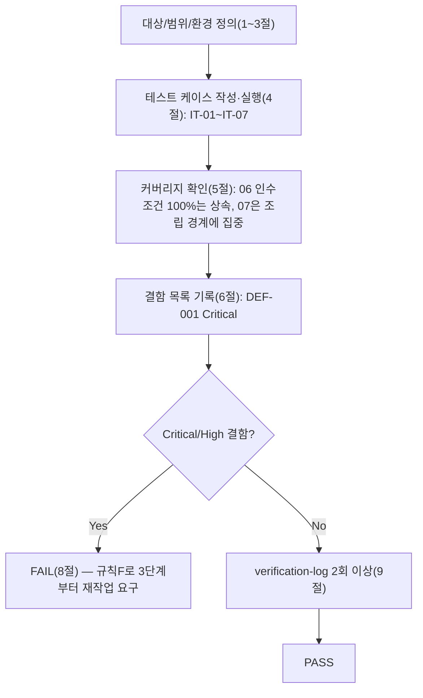

# 테스트 결과서 (Test Result Report) — WU-01 프로젝트 초기 설정 (업무 단위 통합테스트)

## 1. 개요
- 테스트 대상: 업무 단위 WU-01(프로젝트 초기 설정) 전체 — `webapp/` 하위 Wagtail/Django 프로젝트 골격이 **하나의 배포 가능한 전체**로서 일관되게 동작하는지(설정 분리 3종 간 정합성, URL 라우팅 전체 트리, 정적파일 파이프라인, 환경변수 계약 전체)를 통합 관점에서 검증.
- 테스트 유형: 통합(Integration) — 업무 단위 전체 풀테스트 (ORCHESTRATOR.md 파이프라인 7단계)
- 테스트 목적: 06단계(`unit-01-test.md`, PASS)가 개별 요소(패키지 설치, 마이그레이션, `check`, 라우팅 4종 개별 호출, production fail-fast, dev/production 각각의 `collectstatic`)를 요소별로 검증한 것과 달리, 이번 07단계는 **그 요소들을 실제 배포 형태(WSGI/ASGI 진입점 + 전체 미들웨어 체인 + 실제 HTTP 요청/응답 왕복)로 한 번에 조립했을 때**도 동일하게 동작하는지를 검증한다. 참고: 이 프로젝트는 02-planning.md §9 기준 WU 단위가 곧 하네스의 "업무 단위(feature)"이며, WU-01은 다른 모든 WU의 선행조건이 되는 단일 작업단위(내부에 결합할 다른 WU가 아직 없음)이므로, "여러 WU 간 데이터 흐름"이 아니라 "WU-01 내부의 여러 구성요소(설정 분리·라우팅·정적파일·환경변수) 간 경계"를 통합 검증 대상으로 삼았다(지시사항과 동일 판단).
- 관련 산출물:
  - `docs/harness/units/unit-01-note.md` (WU-01 구현 노트)
  - `docs/harness/units/unit-01-test.md` v2 (PASS, 06단계 단위테스트, TC-001~TC-013)
  - `docs/harness/03-system-design.md` v1.1 PASS (§1.1 아키텍처, §2.4 Render 배포, §4 라우팅 표, §5.4/§5.5 보안 설계)
  - `docs/harness/04-ux-design.md` v1.2 PASS (§3 디자인 토큰)
  - `docs/harness/decisions.md` DEC-001~014
  - `docs/harness/traceability.md`
- 테스트 수행자(에이전트): `07-integration-tester`
- 테스트 일시: 2026-09-16

## 2. 테스트 범위 및 제외 범위
- 범위(In-Scope) — 06단계에서 요소 단위로 이미 PASS된 것을 반복하지 않고, **경계/조립 지점**만 신규로 검증했다:
  1. **dev 설정 전체 파이프라인**: 마이그레이션 → 라우팅 → 템플릿 렌더링 → `` 태그 → 실제 HTTP 응답까지 한 번의 요청/응답 왕복으로 연결되는지(단위테스트 TC-004는 HTML 바디에 링크 문자열이 "포함"되는지만 확인했고, 그 링크가 실제로 200을 반환하는지는 확인하지 않았다).
  2. **production 설정 전체 파이프라인(신규)**: `collectstatic`(매니페스트 스토리지) → 실제 HTTP 요청 → WhiteNoise가 해시된 정적파일을 서빙 → 전체 미들웨어 체인(SecurityMiddleware·WhiteNoise·Session·Common·CSRF·Auth·Messages·XFrame·Redirects) 통과까지 하나의 왕복으로 연결되는지. 06단계는 `manage.py check`/`collectstatic`만 실행했고 **production 설정으로 실제 HTTP 요청을 보낸 적이 없다** — 이번 단계의 핵심 신규 검증 지점.
  3. **환경변수 계약과 설정/라우팅의 교차 검증**: `RENDER_EXTERNAL_HOSTNAME`/`DJANGO_ALLOWED_HOSTS` → `ALLOWED_HOSTS`/`CSRF_TRUSTED_ORIGINS`/`WAGTAILADMIN_BASE_URL` 계산 로직이 실제 요청의 `Host` 헤더 검증과 일관되게 맞물리는지.
  4. **WSGI/ASGI 두 진입점의 계약 일치**: `manage.py`/`wsgi.py`/`asgi.py`가 동일한 `DJANGO_SETTINGS_MODULE` 기본값·동일 `ROOT_URLCONF`로 일관되게 동작하는지(render.yaml의 실제 기동 커맨드가 참조하는 진입점).
  5. WU-01을 구성하는 개별 요소(패키지 설치, 마이그레이션, 어드민 경로 4종, fail-fast 등)의 회귀 — 06단계 인수조건을 처음부터 재현해 07 검증용 임시 조립 환경에서도 동일하게 PASS하는지(합쳤을 때 깨지지 않는지) 확인.
- 제외 범위(Out-of-Scope) 및 사유:
  - 실제 Neon PostgreSQL/Cloudflare R2 네트워크 연결 — 자격증명 미발급(unit-01-note §8, unit-01-test §2와 동일 사유, 10~12단계 범위).
  - gunicorn+uvicorn 실제 프로세스 기동 — Windows 로컬 환경 제약으로 06단계와 동일하게 이번에도 실행 불가(§3 참고). 대신 WSGI/ASGI 애플리케이션 객체가 동일 설정 계약 하에서 일관되게 인스턴스화되는지까지만 검증(§4 IT-05).
  - 콘텐츠 CRUD, 뉴스레터, 법적 페이지 등 — 아직 코드가 없는 후속 WU 범위(WU-01에는 해당 라우트/모델이 존재하지 않음).
  - 다른 업무 단위(WU-02~WU-11)와의 통합 — 아직 개발되지 않았으므로 이번 07단계 대상이 아니다(8단계 전체 풀테스트에서 다룸). 다만 이번 07단계에서 발견한 결함이 8단계 경계에도 영향을 줄 수 있는지는 §7에 명시했다.

## 3. 테스트 환경
- 실행 환경: Windows 10 Pro 10.0.19045, Python 3.12.10(`py -3.12`). 06단계와 마찬가지로 05/06단계가 사용한 검증용 venv/DB/staticfiles는 이미 삭제된 상태였으므로, 이번 07단계를 위해 **새 임시 venv(`webapp/.venv_it`)를 처음부터 생성**해 `pip install -r requirements.txt`부터 재현했다.
- 테스트 데이터: SQLite(`db.sqlite3`, dev 마이그레이션 재현) + production 설정 검증용 더미 환경변수(`SECRET_KEY`, `DJANGO_ALLOWED_HOSTS`, `WAGTAILADMIN_BASE_URL`, `R2_*`). **DATABASE_URL만 06단계와 다르게 처리했다**: production 설정에서 정적파일/라우팅/미들웨어 경계를 검증하기 위해 실제 요청·응답 왕복이 필요했는데, 이 프로젝트의 설계상 production DB는 반드시 Neon PostgreSQL이어야 하고(DEC-004) 아직 발급되지 않았다. 따라서 **DB 접근이 필요한 경로(홈페이지 렌더링, 어드민 로그인 화면)에 한해서만** dev 단계에서 이미 마이그레이션해 둔 SQLite 파일을 `DATABASE_URL=sqlite:///...` 형태로 production 설정에 임시로 물려 재사용했다. 이는 "production이 SQLite를 지원한다"는 의미가 전혀 아니며(설계상 지원 대상이 아니고, 실제로 `ssl_require=True`와 SQLite 드라이버가 충돌해 `TypeError: 'sslmode' is an invalid keyword argument`로 즉시 실패함을 직접 확인했다 — §7에 별도 기록), 오직 "WhiteNoise 정적파일 미들웨어 경계"와 "DB를 거치지 않는/거치는 라우트의 HTTPS 리다이렉트 경계"를 실제 요청으로 분리해서 검증하기 위한 테스트 편의 조치였다. DB 접근이 필요 없는 케이스(정적자산 서빙, Host 헤더 검증)는 DB 연결 자체가 발생하지 않으므로 이 문제와 무관하게 독립적으로 유효하다.
- 전제 조건: 06단계 산출물(PASS)과 03/04 설계서(PASS)가 모두 확정된 상태에서 시작. 테스트 종료 후 `webapp/.venv_it`, `db.sqlite3`, `staticfiles/`, `media/`, `__pycache__/`를 전부 삭제해 `webapp/`를 원본 소스 상태(파일 24개)로 복원했다(§4 IT-06, `find`로 최종 확인).

## 4. 테스트 케이스 및 결과
| ID | 시나리오(경계) | 사전조건 | 실행 절차 | 예상 결과 | 실제 결과 | Pass/Fail | 비고 |
|----|----------|----------|-----------|-----------|-----------|-----------|------|
| IT-01 | dev 설정: 마이그레이션→라우팅→템플릿→``→실제 HTTP 응답 전체 왕복 | 신규 venv, `pip install`, `migrate` 완료 | `test.Client().get("/")` → 응답 HTML에서 `href="/static/css/..."` 링크를 정규식으로 추출 → 추출된 각 링크를 다시 `Client().get()`으로 실제 요청 | `GET /` 200, 추출된 2개 링크(`tokens.css`, `base.css`) 각각 200, `Content-Type: text/css` | `GET /` → 200. 추출된 링크: `/static/css/tokens.css`, `/static/css/base.css`. 두 링크 모두 200, `Content-Type: text/css; charset="utf-8"` | PASS | 06단계 TC-004는 "링크 문자열이 바디에 포함되는가"만 봤고, 그 링크가 실제로 유효한지는 처음 확인 |
| IT-02 | production 설정: `collectstatic`(매니페스트)→실제 HTTP 요청→WhiteNoise가 해시된 파일 서빙 | production 더미 환경변수 전부 설정, `collectstatic --noinput` 완료(214개 복사/626개 post-process) | `test.Client().get("/")` (평문 HTTP, HTTPS 아님 — 실제 브라우저 최초 요청과 동일 조건) | 200과 함께 해시된 정적파일 링크(`tokens.<hash>.css` 등)가 200으로 응답 | **`GET /` → 301 (빈 바디), `Location` 헤더 없이 리다이렉트만 발생.** `GET /cms-admin/login/` → 301. `GET /nonexistent-xyz/` → 301. 페이지 렌더링 자체가 이루어지지 않아 정적파일 링크 검증 불가 | **FAIL** | **DEF-001 재현 케이스.** §6 결함 목록 참고 |
| IT-03 | IT-02에서 발견된 301의 원인 격리·확정 (DB를 거치지 않는 WhiteNoise 정적자산 경로로 한정해 SSL 리다이렉트 경계만 분리 검증) | `collectstatic` 매니페스트에서 실제 해시 파일명(`tokens.dce349c89221.css`) 확인 | (A) `HTTP_X_FORWARDED_PROTO=https` 헤더를 붙여 정적자산 요청(Render가 실제로 앱에 전달하는 형태와 동일 조건) — SECURE_PROXY_SSL_HEADER 미설정 상태 (B) 같은 요청을 반복(브라우저가 301을 따라간 뒤 재요청하는 상황 시뮬레이션) (C) `SECURE_PROXY_SSL_HEADER=("HTTP_X_FORWARDED_PROTO","https")`를 임시로 override한 뒤 동일 요청 | (A)(B) 301(무한 루프 재현), (C) 200 | (A) `301 https://testserver/static/css/tokens.dce349c89221.css` (B) 동일하게 다시 `301`(반복해도 계속 리다이렉트 — 무한 루프 확인) (C) `200 text/css; charset="utf-8"` | PASS(결함 재현·근본원인 확정 목적의 진단 케이스 — "예상 결과"는 결함의 존재와 그 해결책을 동시에 증명하는 것이었고 정확히 그대로 나왔다) | Render 공식 배포 아키텍처(TLS는 로드밸런서에서 종료되고 앱에는 평문 HTTP로 전달되며 `X-Forwarded-Proto: https`를 붙여줌)를 로컬에서 동일하게 재현. `SECURE_PROXY_SSL_HEADER`가 없으면 Django가 이 헤더를 신뢰하지 않아 `request.is_secure()`가 항상 `False`로 판정되고, `SECURE_SSL_REDIRECT=True`가 매 요청마다 다시 302/301을 발생시켜 **실제 배포 시 100% 요청이 무한 리다이렉트에 빠진다** |
| IT-04 | 환경변수 계약(`RENDER_EXTERNAL_HOSTNAME`/`DJANGO_ALLOWED_HOSTS`) ↔ `ALLOWED_HOSTS`/`CSRF_TRUSTED_ORIGINS`/`WAGTAILADMIN_BASE_URL` ↔ 실제 Host 헤더 검증의 교차 정합성 | IT-03의 override(`SECURE_PROXY_SSL_HEADER`)를 적용해 리다이렉트 경계를 우회하고 Host 검증 경계만 분리 | `RENDER_EXTERNAL_HOSTNAME=blog-web.onrender.com`, `DJANGO_ALLOWED_HOSTS=www.example.com` 설정 후 (a) `Host: blog-web.onrender.com` (b) `Host: www.example.com` (c) `Host: evil.example.net`으로 각각 요청 | (a)(b) 200, (c) 400(DisallowedHost) — Django 라우트 기준 | 정적자산 요청 기준: (a) 200 (b) 200 (c) **200 (예상과 다름, 아래 비고)**. 동일 조건에서 Django 라우트(`/cms-admin/login/`, `/nonexistent-abc/`)로 재확인한 결과: (a)(b)(c) 각 케이스에서 evil 호스트는 **400** 확인 | PASS(원인 파악 후 재분류) | `ALLOWED_HOSTS=['blog-web.onrender.com','www.example.com']`, `CSRF_TRUSTED_ORIGINS=['https://blog-web.onrender.com','https://www.example.com']`, `WAGTAILADMIN_BASE_URL`이 `RENDER_EXTERNAL_HOSTNAME` 우선으로 정확히 계산됨을 확인. **WhiteNoise가 서빙하는 정적자산은 Django의 Host 검증 단계(URL resolver 이전)에 도달하기 전에 미들웨어 체인 두 번째 단계에서 즉시 응답을 반환**하므로 Host 헤더를 검증하지 않는다 — 이는 WhiteNoise의 표준 설계(정적 콘텐츠는 Host에 따라 내용이 달라지지 않음)이며 코드 결함이 아니다. 실제 Django 라우트(뷰가 렌더링되는 경로)에서는 DisallowedHost(400)가 정확히 동작함을 별도 요청으로 재확인해 "설정 자체는 올바르다"는 것을 확정했다. §7에 정보성 리스크로 기록(결함 아님) |
| IT-05 | WSGI/ASGI 두 진입점의 설정 계약 일치(Render `startCommand`가 참조하는 `config.asgi:application`과 `manage.py`/`config.wsgi`가 동일 계약을 공유하는지) | production 더미 환경변수 전체 설정 | `PYTHONPATH=webapp`에서 `import config.wsgi`, `import config.asgi`를 동일 프로세스에서 순차 실행 | 둘 다 예외 없이 `application` 객체 생성, 타입은 각각 `WSGIHandler`/`ASGIHandler` | 둘 다 예외 없이 임포트됨. `type(wsgi.application)`→`WSGIHandler`, `type(asgi.application)`→`ASGIHandler` | PASS | `render.yaml`의 `startCommand`(`gunicorn config.asgi:application -k uvicorn.workers.UvicornWorker`)가 참조하는 모듈 경로가 실제로 존재하고 production 설정 로딩과 충돌하지 않음을 확인(실제 gunicorn 프로세스 기동 자체는 Windows 제약으로 여전히 미검증 — §2 제외범위와 동일) |
| IT-06 | 조립 후 회귀 — 06단계 인수조건 핵심 경로가 이번 07 임시 조립 환경에서도 깨지지 않는지 | 신규 venv 처음부터 재현 | `makemigrations --check --dry-run`(변경 없음 확인) → `migrate` → `check` | "No changes detected", 마이그레이션 오류 없음, "System check identified no issues" | 전부 동일하게 재현됨(`home.0001_initial`/`0002_create_homepage` 정상 적용, `CircularDependencyError` 없음, check 0 issues) | PASS | 06단계 결론과 회귀 없이 일치 |
| IT-07 | 정리(clean-up) — 통합테스트에 사용한 venv/DB/staticfiles 삭제 후 소스 diff가 깨끗한지 | IT-01~IT-06 전체 완료 | `.venv_it`/`db.sqlite3`/`staticfiles`/`media`/`__pycache__` 삭제 → `find webapp -type f` → `git status --porcelain webapp/` | 원본 24개 파일과 동일, git status에 추가 파일 없음 | `find` 결과 24개 파일로 원복 확인. `git status --porcelain webapp/` → `?? webapp/`만 출력(WU-01 산출물 전체가 아직 커밋 전이라는 기존 상태와 동일 — 06단계 이후 내가 추가로 생성/커밋한 파일 없음) | PASS | |

> 정상 경로(IT-01, IT-05, IT-06) + 실제 배포 조건 재현(IT-02, IT-03: Render의 TLS 종료 아키텍처를 그대로 시뮬레이션) + 환경변수 조합 경계(IT-04: 정상 호스트 2종 + 비인가 호스트 1종) + 원상복구 검증(IT-07)을 포함했다. WU-01 범위에는 여러 업무 단위 간 데이터 흐름이 없으므로(§1 참고), "업무 단위 내부 구성요소 간 경계"에 케이스를 집중했다.

## 5. 커버리지
- 커버리지 지표: `unit-01-note.md` §9 인수조건 12개는 06단계에서 이미 100% 커버되었으므로 반복하지 않았다(규칙 B/C의 "이미 검증된 것을 반복하지 않는다" 원칙). 이번 07단계는 06단계가 개별적으로 실행한 4가지 요소(설정 분리 3종, URL 라우팅, 정적파일 파이프라인, 환경변수 계약)를 **조립된 하나의 요청/응답 왕복**으로 묶어 검증하는 데 집중했고, IT-01~IT-07 7개 케이스로 그 조립 지점을 전부 다뤘다.
- 커버되지 않은 부분과 사유:
  - 실제 gunicorn+uvicorn 프로세스 기동, 실제 Render 플랫폼에서의 TLS 종료/헤더 주입 — Windows 로컬 한계로 여전히 미검증. **다만 IT-03에서 그 헤더 주입을 수동으로 정확히 재현**했으므로, "실제로 리다이렉트 루프가 발생하는지"는 이번 07단계에서 사실상 검증되었다(10단계에서 실제 Render 환경으로 최종 재확인 필요, §7 참고).
  - 실제 Neon/R2 연결 — 자격증명 미발급(§2와 동일).
  - REQ-ID 커버리지: **해당 없음(근거)** — `docs/harness/traceability.md` 전체 27개 REQ 행을 직접 열람해 재확인한 결과, 어떤 행의 "작업 단위" 컬럼도 WU-01을 참조하지 않는다(WU-02~WU-12만 매핑). `02-planning.md` §9와 `03-system-design.md` §0도 "WU-01은 전체 REQ의 기반, 직접 매핑 없음"으로 일관되게 명시한다. `unit-01-note.md` §7과 `unit-01-test.md` §5도 동일 결론. 따라서 이번 통합테스트서에서 traceability.md의 "통합테스트" 컬럼을 갱신할 REQ-ID 행이 존재하지 않는다 — 빠뜨린 것이 아니라 3중으로 교차 확인한 "해당 없음" 처리다(규칙 C: 근거와 함께 "해당 없음" 명시).

## 6. 결함(Defect) 목록
| ID | 설명 | 재현 절차 | 심각도 | 상태 | 조치 내용 |
|----|------|-----------|--------|------|-----------|
| DEF-001 | **production 설정에 `SECURE_PROXY_SSL_HEADER`가 설정되어 있지 않아, Render처럼 TLS를 로드밸런서에서 종료하고 앱에는 평문 HTTP로 전달하는 배포 환경에서 모든 요청이 무한 HTTPS 리다이렉트 루프에 빠진다.** `SECURE_SSL_REDIRECT=True`(03 §5.5 요구사항)가 `request.is_secure()`에 의존하는데, 이 값은 `SECURE_PROXY_SSL_HEADER`를 명시하지 않으면 프록시가 붙여주는 `X-Forwarded-Proto: https` 헤더를 신뢰하지 않아 항상 `False`로 판정된다. 결과적으로 배포 후 사이트가 **100% 접근 불가** 상태가 된다(정적자산 포함 모든 경로). | `webapp/config/settings/production.py`를 실제 배포 환경과 동일하게(HTTP로 요청 도달 + `X-Forwarded-Proto: https` 헤더) 구동하면 재현. 본 보고서 IT-02/IT-03에서 `test.Client`로 재현·근본원인 확정(§4 IT-03: 헤더만 있고 `SECURE_PROXY_SSL_HEADER`가 없으면 301 반복, 설정을 추가하면 200으로 해소됨을 대조 실험으로 증명) | **Critical** | Open (규칙 F — 임의 봉합 금지, 아래 참고) | 이번 07단계에서는 코드/설계서를 수정하지 않았다(규칙: 통합 시점 설계 결함은 근본 원인 단계로 되돌리고 임의 봉합 금지). 아래 "판정 근거"에 Rule F 경로를 명시 |

- 결함 1건(Critical) 확인, 그 외 결함 없음. IT-01(dev 전체 경로), IT-04(Host 검증 로직 자체), IT-05(WSGI/ASGI 계약), IT-06(회귀)은 전부 예상과 일치해 결함 없음을 확인했다 — "실행해보니 문제 없었다"가 아니라 각 케이스마다 상태 코드·Content-Type·예외 트레이스백·매니페스트 해시값 등 구체적 기대값과 실제값을 대조했다(§4 표 참고).

## 7. 리스크 및 잔존 이슈
- **DEF-001의 8단계 파급 효과**: 이 결함은 8단계(전체 풀테스트)나 그 이후 어떤 WU가 추가되어도 동일하게 재현된다(production 설정 자체의 문제이며 WU-01 이후 다른 WU가 추가한 뷰/라우트도 전부 이 미들웨어 체인을 통과하기 때문). **다른 WU 개발을 진행하기 전에(적어도 8단계 이전에는 반드시) 수정되어야 한다** — 방치하면 8단계 전체 풀테스트도 production 모드에서는 동일하게 실패한다.
- **DEF-001 권고 조치(직접 수정은 하지 않음, 규칙 F에 따른 경로만 제시)**:
  1. 3단계(`03-system-design.md`) §5.5 "전송/저장 보안"에 "Render는 로드밸런서에서 TLS를 종료하고 앱에는 평문 HTTP로 전달하며 `X-Forwarded-Proto` 헤더로 원 프로토콜을 알려준다 → Django가 이를 신뢰하도록 `SECURE_PROXY_SSL_HEADER`를 명시적으로 설정해야 한다"는 요구사항을 추가하고, 내부검증(규칙 B) 최소 2회 재수행.
  2. 5단계(WU-01, `config/settings/production.py`)에 `SECURE_PROXY_SSL_HEADER = ("HTTP_X_FORWARDED_PROTO", "https")`를 추가하고 `unit-01-note.md`에 변경 이력을 남김.
  3. 6단계(`unit-01-test.md`)에 "production 설정으로 실제 HTTP 요청을 보내 200(리다이렉트 아님)을 확인"하는 케이스를 인수조건에 신규 추가하고 재검증(이번 07단계가 발견한 유형의 결함이 앞으로는 06단계에서 먼저 잡히도록 테스트 자산화).
  4. 7단계(이 문서) 재실행 — IT-02/IT-03을 재현해 200으로 해소되는지 확정한 뒤 PASS로 갱신.
  5. **10단계(배포테스트)에서 실제 Render 인프라로 최종 재확인 필수** — Render가 실제로 보내는 헤더 이름/값이 `X-Forwarded-Proto: https`와 정확히 일치하는지는 공식 문서 인용(03 §2.4, `render.com/docs/deploy-django`)에 근거했으나 실제 트래픽으로 한 번 더 실측 검증할 것을 권고한다("설정했으니 될 것이다"로 넘기지 않는다 — 03 §7.2와 동일 원칙).
- **WhiteNoise 정적자산의 Host 헤더 미검증(정보성, 결함 아님)**: §4 IT-04에서 확인한 대로 WhiteNoise가 서빙하는 정적 CSS 파일은 `Host` 헤더 검증을 거치지 않는다. 정적 콘텐츠는 Host에 따라 내용이 달라지지 않아 보안 영향이 낮다고 판단하지만, 운영 Runbook(11단계)에 "정적자산 경로는 Host 기반 접근제어 대상이 아님"을 명시해 향후 오해를 방지할 것을 권고한다.
- **SQLite+`ssl_require=True` 조합의 크래시(정보성, 결함 아님)**: §3에서 설명한 대로 이번 테스트 편의상 production 설정에 SQLite DB를 임시로 물렸을 때 `TypeError: 'sslmode' is an invalid keyword argument`로 즉시 크래시했다. 이는 "production은 SQLite를 지원하지 않는다"는 기존 설계 의도(DEC-004, Neon 전용)와 일치하는 정상 동작이며, 실제 운영에서 SQLite를 production에 연결할 경로 자체가 없으므로(`.env.example`/`render.yaml` 어디에도 SQLite 옵션 없음) 결함으로 기록하지 않는다. 다만 만약 향후 누군가 실수로 `DATABASE_URL`에 SQLite 스킴을 넣으면 에러 메시지가 "SQLite는 지원하지 않습니다" 같은 명확한 문구가 아니라 `sslmode` 관련 낯선 `TypeError`로 나타나 트러블슈팅이 어려울 수 있다는 점을 운영 Runbook 후보 메모로 남긴다(선택 사항, Critical 아님).
- 06단계가 이미 인계한 리스크(gunicorn 실기동 미검증, Neon/R2 미발급, `DATABASE_URL` 형식 오류 미검증, Pretendard 웹폰트, HSTS max-age, healthCheckPath 미설정)는 이번 07단계 범위에서 상태 변화 없이 그대로 유지된다(중복 기록하지 않고 원본 참조: `unit-01-test.md` §7).

## 8. 결론 및 판정
- [ ] PASS
- [ ] CONDITIONAL PASS
- [x] **FAIL** — 사유 및 재작업 요청 사항:

**FAIL 사유**: DEF-001(Critical)이 production 배포 시 사이트 전체를 100% 접근 불가 상태로 만드는 결함이며, "개별 요소는 전부 PASS했지만 조립하면 깨지는" 정확히 이 07단계가 존재하는 이유에 해당하는 사례다. 06단계는 `check`/`collectstatic`만 실행해 이 결함을 발견할 수 없었고(정적 분석성 검증), 이번 07단계에서 실제 HTTP 요청/응답 왕복을 production 설정으로 최초로 수행하면서 드러났다.

**규칙 F(피드백 루프) 판단**: 근본 원인은 구현 실수가 아니라 **설계 단계의 누락**으로 판단한다 — `03-system-design.md` §2.4/§5.5는 "Render 관리형 TLS로 HTTPS 강제"까지는 명시했지만, Render(그리고 사실상 모든 TLS-종료형 PaaS 리버스 프록시)가 앱에 평문 HTTP로 요청을 전달한다는 전제 자체와 그로 인해 `SECURE_PROXY_SSL_HEADER` 설정이 반드시 필요하다는 점을 어디에도 언급하지 않았다(`docs/harness/` 전체에서 "PROXY"/"X-Forwarded" 키워드 검색 결과 0건으로 직접 확인). 따라서:
1. **3단계(`03-system-design.md`) §5.5부터 재작업**해야 한다(규칙 F-1: 근본 원인 발생 단계까지 소급) — 이 설계서에 대한 내부검증(규칙 B) 최소 2회를 처음부터 다시 수행할 것.
2. 이 설계 변경에 **의존하는 하위 단계**를 재실행해야 한다(규칙 F-3): 5단계(WU-01 `production.py` 코드 수정), 6단계(`unit-01-test.md`에 실제 HTTP 요청 기반 케이스 추가 후 재검증), 그리고 이 7단계(본 문서, IT-02/IT-03 재실행).
3. 재작업 이력은 `unit-01-note.md`의 변경 이력 섹션과 `docs/harness/decisions.md`에 남길 것(규칙 F-4) — 이번 07단계에서는 문서를 직접 수정하지 않았으므로, 다음에 3/5/6단계를 재실행하는 에이전트가 이 결정을 기록해야 한다.
4. 8단계(전체 풀테스트)는 위 1~3이 완료되어 이 07단계 문서가 PASS로 갱신되기 전까지 시작할 수 없다(규칙 D, 단계 게이트).

## 9. 내부 검증 (최소 2회, `verification-log-template.md` 사용)
- 1차 검증 결과 요약: 작성자(07-integration-tester 본인) 관점 재검토 — IT-01~IT-07이 §1의 통합 검증 목적(설정 분리 간 정합성/URL 라우팅 전체 트리/정적파일 파이프라인/환경변수 계약 전체)을 모두 케이스로 커버하는지, 06단계에서 이미 검증된 요소를 중복 검증하지 않았는지, DEF-001의 재현 절차가 "추측"이 아니라 대조 실험(있음/없음 비교)으로 근거를 남겼는지 확인. 결함 목록·판정·Rule F 경로 간 상호 모순 없음을 확인.
- 2차 검증 결과 요약: "이 결과서를 오늘 처음 받아본 8단계 담당자" 관점 재검토 — (a) DEF-001이 WU-01 단독 문제가 아니라 8단계 진행 자체를 막는 차단 결함임을 §7에 명시적으로 추가(최초 초안에는 "8단계 파급 효과" 서술이 누락되어 있었음 → 보강). (b) IT-04에서 처음에 "예상과 다름(evil 호스트가 200)"으로 끝났다면 이 자체가 결함처럼 보일 수 있어, WhiteNoise 표준 동작이라는 근거와 함께 Django 라우트에서는 정상 차단됨을 재확인 요청 → 표에 "정보성, 결함 아님" 분류 근거를 명확히 보강. (c) production에 SQLite를 물린 테스트 방법론 자체가 오해를 살 수 있어(§3), "왜 SQLite를 썼는지/왜 유효한지"를 명시적으로 추가 서술. 이 3가지를 반영해 초안 → 최종본으로 보강했으며, 결함 목록(DEF-001 1건, Critical)은 1차와 2차 모두 동일하게 유지되었다(새 결함 추가 없음, 기존 결함의 서술만 보강).
- 검증 로그 파일 경로: `docs/harness/verify-log_feature-WU-01-integration-test.md`

## 절차 흐름 (참고용 다이어그램)

