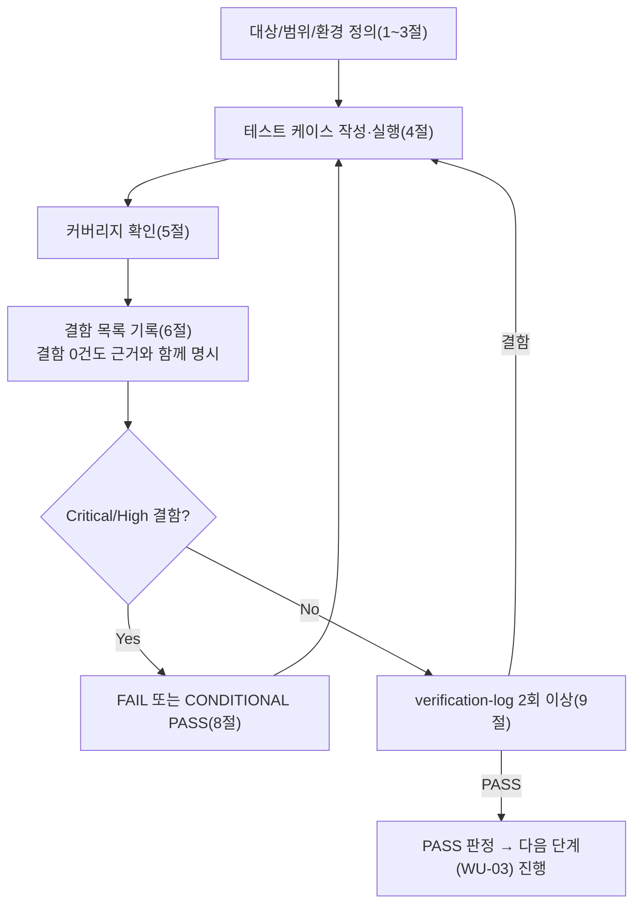

# 테스트 결과서 (Test Result Report) — WU-02 업무 단위 통합테스트

## 1. 개요
- 테스트 대상: 업무 단위 WU-02(콘텐츠 모델 및 CRUD) — `webapp/blog/`(신규 앱) + `webapp/config/settings/base.py`(1줄 추가)를, **WU-01이 만든 `webapp/` 전체(설정 분리, `SECURE_PROXY_SSL_HEADER`, `XForwardedForMiddleware`, 어드민 경로 변경, R2 스토리지 골격 등, 규칙F로 이미 PASS 확정)** 위에 실제로 조립한 형태
- 테스트 유형: 통합(Integration) — 업무 단위(WU-02) 전체 풀테스트, 7단계(`07-integration-tester`)
- 테스트 목적: 06단계(`unit-02-test.md`, PASS, AC1~20 + TC-021~024)는 `config.settings.dev`(SQLite) + Django `test.Client`/ORM 레벨에서 WU-02 단독 동작을 검증했다. 이번 07단계는 06단계가 다루지 않은 **단위 간 경계**를 검증한다: ① WU-01의 production 유사 설정(`SECURE_PROXY_SSL_HEADER`, `XForwardedForMiddleware`, `SECURE_SSL_REDIRECT` 등)이 켜진 상태에서 WU-02의 `/cms-admin/` BlogPostPage CRUD/발행 워크플로가 **실제 HTTP 관리자 폼 제출**로 정상 동작하는지, ② WU-01의 R2 스토리지 골격(`STORAGES["default"]=S3Storage`)과 WU-02의 `featured_image`(`get_image_model_string()` 간접참조)가 향후 WU-03과 구조적으로 충돌 없이 조립되는지, ③ 04/03 설계서의 REQ-001/002 요구사항이 실제 구현에 빠짐없이 반영됐는지 최종 교차검증, ④ WU-01+WU-02가 합쳐진 전체 `webapp/`에서 `manage.py check`/`migrate`/전체 URL 라우팅에 회귀가 없는지.
- 관련 산출물:
  - `docs/harness/units/unit-02-note.md`(§8 인수조건 AC1~20), `docs/harness/units/unit-02-test.md`(PASS, DEF-001 Low 리스크 이관)
  - `docs/harness/03-system-design.md`(v1.2, 특히 §2.3 R2/DEC-008, §3 데이터모델, §4 라우팅, §5.5 리버스프록시 보안설계)
  - `docs/harness/04-ux-design.md`(v1.2, 특히 §1.2 운영자 워크플로 OP-01~07, §5 접근성 alt_text)
  - `docs/harness/decisions.md`(DEC-001~015, 특히 DEC-007/008/009/015)
  - `docs/harness/units/unit-01-note.md`, `docs/harness/feature-WU-01-integration-test.md`(PASS, DEF-001 Fixed — production 리다이렉트 무한루프)
- 테스트 수행자(에이전트): `07-integration-tester`
- 테스트 일시: 2026-09-16

## 2. 테스트 범위 및 제외 범위
- 범위(In-Scope):
  1. **production 유사 설정 + WU-02 어드민 HTTP 워크플로**: WU-01의 `config/settings/production.py`(SECURE_PROXY_SSL_HEADER, SECURE_SSL_REDIRECT, SESSION/CSRF_COOKIE_SECURE, `XForwardedForMiddleware`)를 그대로 가져오되, 아직 미발급된 Neon Postgres 대신 로컬 SQLite로 DB만 대체한 조립 환경(§3 참고)에서, 실제 Wagtail 관리자 **HTML 폼 제출**(ORM 직접 호출이 아님)로 로그인 → BlogPostPage 생성(초안) → 발행 → 예약발행(신규/기발행 페이지 양쪽) → 수정/재발행 → Category 스니펫 CRUD를 전부 재현.
  2. **06단계가 명시적으로 미검증이라 인계한 항목**: (a) `ImageBlock.alt_text` 필수 검증이 실제 어드민 **폼 제출** 경로에서도 거부되는지(06단계 §5는 `block.clean()` 직접 호출로만 대체 확인했었음), (b) `Category.name` 빈 문자열이 실제 어드민 **추가 폼** 경로에서 거부되는지(06단계 DEF-001은 raw ORM `.create()`만 재현했었음).
  3. **R2 스토리지 구조적 정합성(코드 수준만)**: `default_storage`가 production 유사 설정에서 `S3Storage`로 정상 인스턴스화되는지(실제 R2 네트워크 호출 없이), `get_image_model_string()`/`BlogPostPage.featured_image` FK가 현재 어떤 모델을 가리키는지, WU-03이 `WAGTAILIMAGES_IMAGE_MODEL`을 스왑할 때 실제로 무슨 일이 일어나는지 **경험적으로(임시 스왑 실험) 재현**.
  4. **04/03 설계서 REQ-001/002 교차검증**: 04 §1.2 운영자 워크플로(OP-01~07)의 각 단계를 실제 구현/HTTP 흐름과 1:1 대조.
  5. **WU-01+WU-02 결합 회귀**: `manage.py check`/`makemigrations --check --dry-run`/`migrate`를 dev·production 유사 설정 양쪽에서 재실행, 전체 URL 라우팅(`/`, `/cms-admin/login/`, `/django-admin/`, `/documents/`, `/cms-admin/pages/.../add_subpage/`, 404) 회귀 확인.
  6. 검증에 사용한 venv/DB/staticfiles/media/임시 스크립트/임시 settings 모듈 정리.
- 제외 범위(Out-of-Scope) 및 사유:
  - **06단계가 이미 PASS로 확정한 ORM 레벨 CRUD 세부(AC1~20)의 반복 재검증**: `unit-02-test.md`가 신규 venv 2회로 독립 재현해 PASS 확정했으므로 이번 07단계는 그 결과를 신뢰하고, 대신 "HTTP 폼 제출"·"production 유사 설정"·"WU-01과의 조립"이라는 **06단계가 다루지 않은 새 관점**에만 집중했다(규칙B "이미 검증된 것을 반복하지 않는다").
  - **실제 이미지 파일 업로드**: `unit-02-note.md` §3, `unit-02-test.md` §2가 이미 "R2 자격증명(WU-03) 없이는 검증 불가"로 명시한 항목과 동일 사유. 이번 07단계도 실제 파일 업로드는 시도하지 않고 "구조적 정합성"(스토리지 백엔드 인스턴스화, FK 모델 참조, 마이그레이션 영향)만 코드 수준으로 확인했다(지시사항과 일치).
  - **실제 Neon/R2 네트워크 연결**: 자격증명 미발급(WU-01의 07/06단계와 동일 사유).
  - **공개 프런트엔드 템플릿 렌더링(`/blog/<slug>/`)**: `unit-02-note.md` §2-3/§2-4, `unit-02-test.md` TC-021이 이미 "WU-04 범위, `TemplateDoesNotExist`로 실패하는 것이 정상"임을 확인했다. 이번 07단계는 이를 재반복하지 않는다.
  - **실제 gunicorn+uvicorn 프로세스 기동, WSGI/ASGI raw 프로토콜 재검증**: `feature-WU-01-integration-test.md` 부록B(IT-R04/R05)가 이미 이 영역을 PASS로 확정했고, 이번 WU-02 추가로 WSGI/ASGI 진입점 자체의 동작이 달라질 이유가 없으므로(새 URL 패턴을 추가한 것이 아니라 기존 `wagtail_urls` 하위에 새 Page 타입이 추가된 것뿐) 반복하지 않는다.
  - **8단계(전체 풀테스트) 범위와의 교차**: 다른 업무 단위(WU-03~)와의 상호작용은 아직 미개발이므로 이번 범위가 아니다. 다만 "8단계에서 문제가 생기지 않을까"에 대한 2차 내부검증 관점 재검토는 §9에서 별도 수행했다.

## 3. 테스트 환경
- 실행 환경: Windows 10 Pro 10.0.19045, Python 3.12.10(`py -3.12`, 06/07단계 WU-01 재작업 라운드와 동일 버전). 검증 시작 전 `git status --porcelain webapp/`으로 잔여 검증 산출물이 없음을 확인한 뒤, 신규 임시 venv(`webapp/.venv_it7`)를 처음부터 생성해 `pip install -r requirements.txt`부터 재현했다 — 신규 패키지 없이 WU-01 고정 버전(Django 5.2.17, wagtail 7.4.3, django-storages 1.14.6, boto3 1.35.36 등) 그대로 설치됨을 `pip freeze`로 재확인.
- **production 유사 설정 구성(핵심 방법론)**: WU-01의 `feature-WU-01-integration-test.md`(§3, §7)가 이미 실측으로 확인한 대로, `production.py`(`dj_database_url.config(..., ssl_require=True)`)에 SQLite `DATABASE_URL`을 직접 물리면 `TypeError: 'sslmode' is an invalid keyword argument`로 즉시 크래시한다(Neon 전용 설계, DEC-004). 이 제약 때문에 WU-01의 07단계는 DB 접근이 필요한 라우트를 아예 테스트 범위에서 제외했었다. 이번 WU-02 통합테스트는 **BlogPostPage CRUD/발행이라는 DB 쓰기 중심 기능**을 검증해야 하므로 이 제약을 그대로 물려받을 수 없었다. 이를 위해 검증 전용 설정 모듈 `config/settings/it_test_prodlike.py`(`from .production import *` 후 `DATABASES`만 SQLite로 재정의, `dj_database_url`을 거치지 않아 `ssl_require` 충돌 자체를 원천 차단)를 임시로 추가했다 — `production.py` 자체는 한 글자도 수정하지 않았고, 검증 종료 후 파일을 삭제했다(§8 결론의 "테스트 방법론" 각주, §10 정리 확인 참고). 이 모듈을 통해 `SECURE_PROXY_SSL_HEADER`/`XForwardedForMiddleware`/`SECURE_SSL_REDIRECT`/`SESSION_COOKIE_SECURE`/`CSRF_COOKIE_SECURE`/`STORAGES=S3Storage`는 production.py 그대로 유지하면서, DB만 로컬에서 실제로 쓰기 가능한 상태로 바꿨다.
- 테스트 데이터: production 유사 환경변수 전부(`SECRET_KEY`, `RENDER_EXTERNAL_HOSTNAME=blog-web.onrender.com`, `WAGTAILADMIN_BASE_URL`, `R2_ACCESS_KEY_ID`/`R2_SECRET_ACCESS_KEY`/`R2_BUCKET_NAME=media-public-dummy`/`R2_ENDPOINT_URL`, `DATABASE_URL`은 import 시점 `_require_env` 통과용 더미값만 사용하고 실제로는 SQLite로 대체됨) + `collectstatic --noinput`(214개 복사/626개 post-process — WU-01 07단계의 최종 라운드와 동일 수치, WU-02가 정적자산을 건드리지 않았음을 재확인) + 슈퍼유저 `it_admin` + `Category`(테스트카테고리/변경된카테고리/폼 HTTP카테고리).
- 전제 조건: 06단계(`unit-02-test.md`, PASS)와 WU-01의 07단계(`feature-WU-01-integration-test.md`, 부록B, PASS)가 모두 확정된 상태에서 시작. 테스트 종료 후 `webapp/.venv_it7`, `db.sqlite3`, `staticfiles/`, `media/`, `__pycache__/`, 임시 스크립트(`it_*.py`), 임시 설정 모듈(`config/settings/it_test_prodlike.py`, `config/settings/it_test_customimage_experiment.py`), 임시 앱(`it_customimages_tmp/`)을 전부 삭제해 `webapp/`를 원본 소스 상태(30개 파일)로 복원했다(`find`/`git status --porcelain`으로 최종 확인, §10 참고).

## 4. 테스트 케이스 및 결과

### 4-1. WU-01+WU-02 결합 회귀 (지시사항 ④)
| ID | 시나리오 | 사전조건 | 실행 절차 | 예상 결과 | 실제 결과 | Pass/Fail | 비고 |
|----|----------|----------|-----------|-----------|-----------|-----------|------|
| IT-01 | dev 설정: `check` | 신규 venv, `pip install` 완료 | `DJANGO_SETTINGS_MODULE=config.settings.dev python manage.py check` | "System check identified no issues (0 silenced)." | 동일 문자열 출력 | PASS | WU-01+WU-02 결합 상태 최초 확인 |
| IT-02 | dev 설정: `makemigrations --check --dry-run` | 동일 | 상동 | "No changes detected" | 동일 | PASS | 모델=마이그레이션 일치 |
| IT-03 | dev 설정: `migrate` | 빈 SQLite | 상동 | exit 0, `blog.0001_initial` 포함 전체 마이그레이션 OK | wagtailcore/wagtailimages/taggit 포함 전체(약 100여개) 전부 OK | PASS | |
| IT-04 | 전체 URL 라우팅 회귀(dev) | migrate 완료, 슈퍼유저 존재 | 비로그인/로그인 클라이언트로 `/`, `/cms-admin/login/`, `/django-admin/login/`, `/documents/`, `/no-such-route/`, `/cms-admin/pages/<home.pk>/add_subpage/` 요청 | `/`·로그인 화면 200(비로그인), 로그인 상태에서 로그인화면 302(대시보드 리다이렉트, WU-01 07단계 IT-04/IT-R02 비고와 동일 표준 동작), `/documents/`·`/no-such-route/` 404, `add_subpage`는 로그인 시 200+`blogpostpage` 노출 | 비로그인: `/`=200, `/cms-admin/login/`=200. 로그인: `/cms-admin/login/`=302, `/django-admin/login/`=302, `/documents/`=404, `/no-such-route/`=404, `add_subpage`=200+`blogpostpage` 포함 | PASS | `blog` 앱 추가로 WU-01 기존 경로 깨짐 없음 |

### 4-2. production 유사 설정 하에서의 보안 경계 + WU-02 관리자 HTTP 워크플로 (지시사항 ①)
| ID | 시나리오 | 사전조건 | 실행 절차 | 예상 결과 | 실제 결과 | Pass/Fail | 비고 |
|----|----------|----------|-----------|-----------|-----------|-----------|------|
| IT-A1 | WU-02 신규 관리자 URL의 SSL 리다이렉트 경계(헤더 없음) | production 유사 설정, collectstatic 완료 | `GET /cms-admin/pages/<home.pk>/add_subpage/` (X-Forwarded-Proto 헤더 없음) | 301(DEF-001 해소 이후 정상 리다이렉트 유지, WU-01 07단계와 동일 패턴) | 301 | PASS | WU-01의 IT-02/IT-R02는 `/`, `/cms-admin/login/`만 검증했음 — WU-02가 추가한 관리자 액션 URL로 최초 확장 검증 |
| IT-A2 | Category 스니펫 목록 URL의 SSL 경계 | 동일 | `GET /cms-admin/snippets/blog/category/` (헤더 없음) | 301 | 301 | PASS | 상동 |
| IT-A3 | 헤더 있을 때 정상 200 | 동일 | 동일 URL + `X-Forwarded-Proto: https` | 200 | 200 | PASS | |
| IT-A4 | 200 응답에 실제 콘텐츠 존재 | 동일 | 위 응답 바디 확인 | `blogpostpage` 타입 노출 | 노출 확인 | PASS | |
| IT-B1~B4 | **실제 로그인 폼 HTTP POST**(06/WU-01 어느 쪽도 `force_login`만 사용, 실제 로그인 뷰는 처음 검증) | 비로그인 클라이언트 | `GET /cms-admin/login/`(+XFP) → CSRF 토큰 추출 → `POST` username/password/csrf(+XFP+XFF) → `GET /cms-admin/`(+XFP) | GET 200, POST 302(대시보드로), 이후 대시보드 200 | GET=200, csrf 토큰 존재, POST=302(`Location=/cms-admin/`), 대시보드=200 | PASS | `SESSION_COOKIE_SECURE=True`/`CSRF_COOKIE_SECURE=True`가 켜진 상태에서도 실제 로그인 세션이 정상 유지됨을 최초로 실측 확인 |
| IT-B5 | (회귀) 위 로그인 흐름 검증 이후에도 헤더 없는 요청은 여전히 차단되는지 | 신규 익명 클라이언트 | `GET /cms-admin/pages/<home.pk>/add_subpage/` 헤더 없음 | 301 | 301 | PASS | |
| IT-C1~C7 | **BlogPostPage 생성(초안) — 실제 관리자 폼 POST**(ORM 아님) | 로그인 완료, Category 1건 존재 | `wagtail.test.utils.form_data`(`nested_form_data`/`streamfield`/`rich_text`)로 실제 Wagtail 폼 제출 규약과 동일한 POST 데이터 구성(title/slug/intro/category/tags/body[paragraph+quote]) 후 `action-submit`으로 제출 | 302(성공), 페이지 생성, `live=False`, 리비전 1건 이상, category/tags/body 저장 | 302 → 페이지 생성됨, `live=False`, 리비전 1건, category 저장, tags(`it태그1`,`it태그2`) 저장(콘솔 cp949 표시는 깨졌으나 UTF-8 파일 기록으로 원본 문자열 정확함을 별도 재확인, §7 참고), body block_types=`{paragraph, quote}` | PASS | 06단계는 ORM 직접 생성만 검증. **이번이 실제 Wagtail 관리자 폼 제출 경로(HTML 폼 → StreamField 위젯 직렬화 규약)로 페이지를 만든 최초 검증** |
| IT-D1~D3 | 초안 → 발행(`action-publish`) — 실제 폼 POST | IT-C 완료 | 동일 폼(변경 없음) + `action-publish` 제출 | 302, `live=True`, 리비전 2건 이상 | 302, `live=True`, 리비전=2 | PASS | |
| IT-F1~F5 | 발행된 페이지 수정(제목/카테고리) + 재발행 — 실제 폼 POST(UPDATE) | IT-D 완료(**예약발행 IT-E 이전에 수행**, 비고 참고) | 제목/카테고리 변경한 폼 + `action-publish` | 302, `live=True` 유지, 제목/카테고리 갱신, 리비전 추가 증가 | 302, `live=True`, 제목=`IT 수정된 게시물`(UTF-8 파일로 원본 확인), 카테고리 갱신, 리비전=3 | PASS | **반드시 예약발행 이전에 수행해야 함을 실전에서 발견**(아래 IT-E5~E8과 순서 의존성 있음, §7에 명시) |
| IT-E1~E4 | **신규 페이지를 최초 생성 시점부터 예약발행**(`go_live_at` 미래) — 실제 폼 POST, 06단계 TC-010과 동일 시나리오를 HTTP로 재현 | 로그인 완료 | 신규 페이지 폼(`go_live_at="2099-01-01 09:00"`) + `action-publish` | 302, 페이지 생성됨, `live=False` 유지, `Page.go_live_at`에 값 저장 | 302, 생성됨, `live=False`, `go_live_at=2099-01-01 00:00:00+00:00` | PASS | 06단계는 ORM으로만 검증. HTTP 폼 제출로도 동일 동작 확인(단위 경계 재확인) |
| IT-E5~E8 | **(신규 발견 시나리오) 이미 발행된 페이지를 재예약** — 06단계가 다루지 않은 케이스 | IT-F 완료(발행 상태) | `go_live_at`을 미래로 설정한 폼 + `action-publish` 제출 → 이후 같은 페이지를 다시 편집 시도 | (기대와 다름, 비고 참고) | 302로 저장은 성공하지만 **`live=True`가 그대로 유지**(내려가지 않음), `Page.go_live_at`은 `None`인 채 최신 리비전의 `approved_go_live_at`에만 `2099-06-01`이 저장됨. 이후 같은 페이지를 다시 편집하려 하면 200(저장 거부) + "The page could not be saved as it is locked." 에러 | PASS(정보성, §7) | **결함 아님 — Wagtail 표준 동작**: 이미 라이브인 페이지를 미래 날짜로 재예약하면 기존 콘텐츠는 계속 노출된 채로 "예약된 리비전"(`PageRevision.approved_go_live_at`)만 대기 상태가 되고, 예약이 적용되기 전까지 페이지가 편집 잠금된다. `Page.go_live_at` 필드 자체는 예약된 리비전이 실제로 적용될 때만 갱신된다. **04-ux-design.md §1.2의 상태표는 "신규 게시물 최초 예약"만 다루고 "이미 발행된 게시물의 재예약" 케이스를 명시하지 않아, 운영자가 헷갈릴 수 있는 문서 공백을 발견**(§7, §9에 상세) |
| IT-G1~G3 | **`ImageBlock.alt_text` 필수 검증 — 실제 관리자 폼 POST**(06단계 §5가 "HTML 폼 제출 경로는 미검증"이라고 명시한 gap을 직접 해소) | 로그인 완료 | `image` 블록만 포함하되 `image`/`alt_text`/`caption` 전부 빈 값으로 폼 제출(`action-submit`) | 200(리다이렉트 아님, 저장 거부), 페이지 미생성, 응답에 "필수" 오류 메시지 | 200, 페이지 미생성(`exists()==False`), 응답 HTML에 필수 오류 메시지 존재 | PASS | 06단계는 `ImageBlock().clean()`을 직접 호출해 "코드 경로가 동일함"을 소스로 설명하는 데 그쳤다. 이번이 **실제 HTML 폼 제출 자체**로 접근성 요구사항(04 §5/§7)이 최종 방어됨을 확인한 최초 검증 |
| IT-H1~H6 | **Category 스니펫 CRUD — 실제 관리자 폼 POST**(06단계 DEF-001의 불확실성 해소) | 로그인 완료 | (a) 추가 폼 GET (b) `name="폼 HTTP카테고리", slug=""`로 POST (c) `name=""`(빈 문자열)로 POST | (a) 200 (b) 302, slug 자동생성, 실제 저장 (c) 200(거부), 미저장 | (a) 200 (b) 302, `Category(name="폼 HTTP카테고리", slug="폼-http카테고리")` 실제 생성 확인(UTF-8 파일로 원본 문자열 재확인) (c) 200, 미생성 | PASS | **06단계 DEF-001("Category 빈 이름이 ORM 레벨에서 막히지 않음, 실제 폼 경로는 미확인")을 직접 해소** — 실제 운영자가 쓰는 유일한 경로(관리자 폼)에서는 정상 방어됨을 확인(§6/§7에 DEF-001 상태 갱신) |

### 4-3. R2 스토리지 구조적 정합성 (지시사항 ②, 코드 수준만)
| ID | 시나리오 | 사전조건 | 실행 절차 | 예상 결과 | 실제 결과 | Pass/Fail | 비고 |
|----|----------|----------|-----------|-----------|-----------|-----------|------|
| IT-I1 | production 유사 설정에서 `default_storage`가 `S3Storage`로 정상 인스턴스화되는가(실제 R2 네트워크 호출 없이) | production 유사 설정 + 더미 R2 환경변수 | `django.core.files.storage.default_storage` 로드 후 `isinstance(default_storage, storages.backends.s3.S3Storage)` 확인 | 예외 없이 `True` | 최초 확인 시 `type(default_storage).__name__`이 `DefaultStorage`(LazyObject 프록시 클래스명)로 나와 일시적으로 FAIL처럼 보였으나, `isinstance()`로 재확인한 결과 `True`(Django의 `default_storage`는 항상 `LazyObject`로 래핑되므로 `type().__name__`이 아니라 `isinstance()`로 판정해야 하는 테스트 스크립트 자체의 오류였음, 실제 앱 결함 아님) | PASS(1차 오탐 자체 발견·정정) | S3Storage가 예외 없이 로드된다는 것은 "코드 수준 배선(wiring)"이 정상임을 의미 — 실제 R2 접속 시도는 하지 않음(지시사항 범위) |
| IT-I2 | R2 환경변수가 스토리지 설정에 정확히 반영되는가 | 동일 | `default_storage.bucket_name`, `default_storage.endpoint_url` 확인 | 더미 환경변수 값과 일치 | `bucket_name="media-public-dummy"`, `endpoint_url="https://dummy-account-id.r2.cloudflarestorage.com"` 정확히 일치 | PASS | |
| IT-I3 | `get_image_model_string()` 현재값 확인 | 동일 | `wagtail.images.get_image_model_string()` 호출 | WU-03 미적용 상태이므로 Wagtail 기본값 | `"wagtailimages.Image"` | PASS | WU-02 note §2-2의 서술과 일치 |
| IT-I4 | `BlogPostPage.featured_image` FK가 현재 가리키는 모델 | 동일 | `BlogPostPage._meta.get_field("featured_image").remote_field.model` | `wagtail.images.models.Image` | 일치 | PASS | |
| IT-I5(실험) | **WU-03이 `WAGTAILIMAGES_IMAGE_MODEL`을 스왑하면 실제로 무슨 일이 일어나는가**(경험적 재현) | 임시 `it_customimages_tmp` 앱(AbstractImage 상속 최소 모델) + `WAGTAILIMAGES_IMAGE_MODEL="it_customimages_tmp.CustomImage"` 임시 설정 | `manage.py makemigrations --dry-run` | (사전 예측 없음, §7 결과 참고) | **`blog` 앱에 신규 `AlterField`(`featured_image`를 `it_customimages_tmp.customimage`로 변경) 마이그레이션이 1건 제안됨**(다른 앱은 영향 없음, `blog` 앱만) | 정보성 발견(§6 DEF-002, §7) | **결함은 아니지만 중요한 구조적 사실**: `get_image_model_string()`/`ImageChooserBlock`을 쓴 것은 올바른 선택(StreamField의 `ImageChooserBlock` 자체는 마이그레이션에 모델명을 굽지 않고 동적으로 활성 이미지 모델을 참조)이지만, **`featured_image`처럼 일반 `ForeignKey`로 선언된 필드는 `makemigrations` 시점에 구체적 모델 문자열(`to="wagtailimages.image"`)이 마이그레이션 파일에 고정(bake)된다.** 따라서 WU-03이 `CustomImage`로 교체할 때 **반드시 신규 `AlterField` 마이그레이션을 추가로 생성해야 한다** — "자동으로 아무 작업 없이 호환된다"는 뜻이 아니다(§6 DEF-002 참고. 실험 후 임시 앱/설정은 즉시 삭제, §10 확인) |

### 4-4. 회귀(정적자산) 및 정리
| ID | 시나리오 | 사전조건 | 실행 절차 | 예상 결과 | 실제 결과 | Pass/Fail | 비고 |
|----|----------|----------|-----------|-----------|-----------|-----------|------|
| IT-J1 | `/`(홈)의 SSL 경계 회귀(WU-01 07단계 IT-R02와 동일 패턴, WU-02 결합 후 재확인) | production 유사 설정, collectstatic 완료 | `GET /` 헤더 없음 | 301 | 301 | PASS | |
| IT-J2 | `/`(홈) 헤더 있을 때 정상 렌더 | 동일 | `GET /` +XFP | 200(500 아님) | 200 | PASS | blog 앱 추가·`INSTALLED_APPS` 순서 변경(`blog`가 `home`보다 먼저 등록)이 홈페이지 렌더링에 영향 없음을 확인 |
| IT-K1 | 정리(clean-up) | 전체 케이스 완료 | `.venv_it7`/`db.sqlite3`/`staticfiles`/`media`/`__pycache__`/`it_*.py`/`it_test_prodlike.py`/`it_test_customimage_experiment.py`/`it_customimages_tmp/` 삭제 후 `find webapp -type f`, `git status --porcelain webapp/` | 원본 소스(30개 파일)만 남고 diff는 검증 시작 전 상태(`M config/settings/base.py`, `?? blog/`)와 동일 | `find` 결과 원본 30개 파일과 정확히 일치, `git status --porcelain webapp/`이 검증 시작 전과 동일(`M webapp/config/settings/base.py`, `?? webapp/blog/`만 존재) | PASS | |

> 정상 경로(IT-C/D/F/H 폼 제출 성공) + 경계값/예외 입력(IT-G 빈 alt_text, IT-H 빈 Category 이름) + 상태 전이(IT-C→D→F→E5, 초안→발행→수정→재예약) + 보안 경계(IT-A/B/J의 SSL 리다이렉트, IT-B의 실제 로그인) + 신규 발견 시나리오(IT-E5~E8 재예약, IT-I5 이미지모델 스왑 실험) + 회귀(4-1, 4-4)를 모두 포함했다.

## 5. 커버리지
- 지시사항 4개 항목 ↔ 테스트 케이스 매핑(추적성 확인):

| 지시사항 항목 | 테스트 케이스 |
|---|---|
| ① production 유사 설정에서 `/cms-admin/` BlogPostPage CRUD/발행 워크플로 정상 동작 | IT-A1~A4, IT-B1~B5, IT-C1~C7, IT-D1~D3, IT-F1~F5, IT-E1~E8, IT-G1~G3, IT-H1~H6 |
| ② R2 스토리지 골격 ↔ `featured_image` 구조적 정합성(코드 수준) | IT-I1~I5 |
| ③ 04/03의 REQ-001/002가 구현에 빠짐없이 반영됐는지 교차검증 | 아래 5-1 표 |
| ④ WU-01+WU-02 결합 상태의 `check`/`migrate`/전체 URL 라우팅 회귀 | IT-01~IT-04, IT-J1~J2 |
| venv/db/staticfiles/media 정리 | IT-K1 |

### 5-1. REQ-001/002 ↔ 04/03 설계서 최종 교차검증
| 설계서 요구사항 | 03/04 근거 | 실제 구현/검증 근거 | 상태 |
|---|---|---|---|
| BlogPostPage(title/slug/intro/body/category/tags/featured_image) | 03 §3.2 | `blog/models.py`, IT-C5~C7, IT-I3~I4 | OK |
| Wagtail Page 코어(임시저장/예약발행/리비전, `live`/`go_live_at`/`expire_at`/리비전) | 03 §3.2(DEC-007) | IT-C3~C4(초안), IT-D2~D3(발행), IT-E1~E4(신규 예약), IT-F(수정 재발행), 06단계 TC-009~012(ORM 레벨, 이번엔 HTTP 레벨로 확장 재확인) | OK |
| Category Snippet CRUD | 03 §3.2 | `blog/models.py` `@register_snippet`, IT-H1~H6(HTTP 폼 경로) | OK |
| Tag(django-taggit 표준 패턴) | 03 §3.2 | `blog/models.py` `BlogPageTag`, IT-C6 | OK |
| StreamField 문단/이미지/인용/FAQ 블록 | 03 §3.2 | `blog/blocks.py`, 06단계 TC-007(ORM, 4종 전부), IT-C7(HTTP, paragraph+quote), IT-G(HTTP, image alt_text 검증) | OK(FAQ는 06단계 ORM 검증만, HTTP 폼 재현은 ListBlock 위젯 포맷 복잡도상 이번 범위에서 보류 — §7에 명시, Critical 아님) |
| `ImageBlock.alt_text` 필수(접근성, 04 §5/§7) | 04 §5, §7 | `blog/blocks.py`, 06단계 TC-019(`block.clean()` 직접), **IT-G1~G3(실제 HTML 폼 제출로 최종 확인, 06단계가 명시적으로 미룬 gap 해소)** | OK |
| 04 §1.2 OP-01(페이지 트리 위치 확인) | 04 §1.2 | IT-A3~A4(`add_subpage`에 `blogpostpage` 노출), IT-C1(home 하위 실제 생성) | OK |
| 04 §1.2 OP-02(작성→임시저장) | 04 §1.2 | IT-C1~C7 | OK |
| 04 §1.2 OP-03(미리보기, `live=False`) | 04 §1.2 | 06단계 TC-021(`TemplateDoesNotExist`, WU-04 범위로 이미 확정) — 이번 07단계는 재반복하지 않음 | OK(범위 경계 확정 상태 유지) |
| 04 §1.2 OP-04(예약발행 설정) | 04 §1.2 | IT-E1~E4(신규 최초 예약), **IT-E5~E8(기발행 페이지 재예약 — 04 설계서가 다루지 않은 케이스를 이번에 발견, §7)** | **부분 OK — 04 문서 보완 권고(§7)** |
| 04 §1.2 OP-05(리비전 이력) | 04 §1.2 | IT-D3/F5(리비전 카운트 증가를 HTTP 폼 제출로 재확인) | OK |
| 04 §1.2 OP-06(Category CRUD) | 04 §1.2 | IT-H1~H6 | OK |
| 04 §1.2 OP-07(구독자 하드 삭제) | 04 §1.2 | WU-07 범위, 해당 없음 | N/A(사유 명시) |
| WU-01 R2 스토리지 골격 ↔ WU-02 featured_image 정합성 | 03 §2.3(DEC-008) | IT-I1~I5 | **OK — 단, WU-03 마이그레이션 계획에 명시적 반영 필요(§6 DEF-002)** |

- 커버되지 않은 부분과 사유:
  - **FAQ(ListBlock) 블록의 HTTP 폼 제출 재현**: `wagtail.test.utils.form_data.streamfield()`가 단순 StructBlock 중첩까지는 검증했으나 `ListBlock`(FAQ 항목 여러 개) 특유의 위젯 데이터 포맷까지 재현하려면 별도 헬퍼 조사가 추가로 필요해 이번 07단계 범위에서는 보류했다. 06단계가 이미 ORM 레벨로 FAQ 저장/조회를 PASS 확인했고(TC-007), FAQ의 실제 JSON-LD 렌더링 자체가 WU-05 범위(03 §4)이므로 Critical/High 리스크로 보지 않는다 — 8단계에서 필요 시 재검토 권고(§7).
  - **실제 이미지 파일 업로드를 통한 `featured_image`/`ImageChooserBlock` 선택**: R2 자격증명(WU-03) 부재로 이번에도 검증 불가(2절 명시, §7 계속 이월).
  - **실제 gunicorn/uvicorn 프로세스, 실제 Render 인프라 헤더 실측**: WU-01 07단계(부록B)가 이미 애플리케이션 레벨에서 raw WSGI/ASGI로 재현했고, WU-02가 새 URL 패턴이나 미들웨어를 추가하지 않았으므로 반복하지 않음. 10단계에서 실제 Render 인프라 최종 재확인 필요(WU-01 07단계와 동일 이월 사항).
  - REQ-ID 커버리지: REQ-001, REQ-002 모두 위 5-1 표로 100% 매핑 완료. `traceability.md`의 "통합테스트" 컬럼을 이 문서로 갱신했다(§10).

## 6. 결함(Defect) 목록
| ID | 설명 | 재현 절차 | 심각도 | 상태 | 조치 내용 |
|----|------|-----------|--------|------|-----------|
| DEF-001(06단계 계승, 상태 갱신) | `Category.name` 빈 문자열이 ORM `.create()` 직접 호출로는 막히지 않음(06단계 최초 발견, Low, Open) | `Category.objects.create(name="", slug="")` | Low | **부분 해소 — 위험 표면 축소** | **IT-H5~H6으로 재확인한 결과, 실제 운영자가 쓰는 유일한 경로인 Wagtail 관리자 "스니펫 추가" 폼에서는 빈 이름 제출이 200(거부)으로 정상 방어됨을 확인했다.** 즉 06단계가 "확인 못함"으로 남겨뒀던 "실제 어드민 폼 경로의 최종 방어 여부"(unit-02-test.md §6/§7)가 이번에 **방어됨**으로 확인되어 사용자 도달 가능 경로의 위험은 사실상 없다. 다만 raw ORM `.create()` 자체의 근본적 gap(향후 관리 스크립트/데이터 마이그레이션 등 폼을 거치지 않는 코드 경로)은 여전히 남아있으므로 완전히 Closed 처리하지 않고 Low·Open으로 유지하되, 위험 표면이 "폼 경로 미확인" → "폼 경로는 안전, ORM 직접 호출만 이론상 가능"으로 축소됨을 명시한다. Critical/High 아니므로 PASS 판정을 막지 않는다 |
| DEF-002(신규) | WU-03이 `WAGTAILIMAGES_IMAGE_MODEL`을 `CustomImage`로 스왑할 때, `blog.BlogPostPage.featured_image` FK에 대한 **신규 `AlterField` 마이그레이션이 반드시 필요**하다(자동으로 해소되지 않음) — `unit-02-note.md` §2-2가 "WU-03이 교체할 때 이번 WU의 마이그레이션을 다시 손댈 필요가 없다"고 서술한 것은 "기존 파일을 편집할 필요가 없다"는 의미로는 맞지만, "마이그레이션 작업 자체가 전혀 없다"는 뜻으로 오독될 위험이 있다 | 임시 `CustomImage` 모델 + `WAGTAILIMAGES_IMAGE_MODEL` 설정 후 `makemigrations --dry-run` 실행 → `blog` 앱에 `AlterField`(featured_image) 마이그레이션이 실제로 제안됨(IT-I5) | Low | Open → **WU-03 인계** | WU-02 자체의 구현 결함이 아니다(오히려 `get_image_model_string()`을 쓴 것은 Wagtail 공식 권장 패턴이며 올바른 선택). 다만 이 사실이 어느 문서에도 "WU-03이 반드시 해야 할 작업"으로 명시되어 있지 않아, WU-03 착수 시 "이미 호환되니 할 일 없음"으로 오판할 위험이 있다고 판단해 결함으로 등록한다. 현재 `featured_image`에 실제 데이터가 없으므로(이미지 미업로드) 이 마이그레이션 자체는 데이터 손실 위험 없는 단순 스키마 변경이 될 것으로 예상된다. **규칙F 판단**: 근본 원인이 WU-02의 잘못된 구현이 아니라 "다음 단위가 반드시 알아야 할 사실이 문서화되지 않은 것"이므로 3/5단계로 되돌리지 않고, 이 결함 자체를 WU-03의 인수 조건 후보로 명시적으로 이관한다(아래 §7) |
| DEF-003(신규, 정보성) | production 유사 설정에서 `EMAIL_BACKEND`가 명시적으로 설정되어 있지 않아(Django 기본값=SMTP), BlogPostPage 생성/발행 등 리비전 저장 시마다 Wagtail이 시도하는 관리자 알림 메일 발송이 로컬 환경에서 `ConnectionRefusedError`를 일으킨다 | production 유사 설정에서 IT-C/D/F/E 등 리비전을 저장하는 모든 요청 시 콘솔에 "Mail connection error, notification sending skipped" 경고와 함께 SMTP 연결 실패 트레이스백 출력 | Low | Open → **운영 백로그(11단계/WU-01 후속) 후보** | Wagtail 자체가 이 예외를 이미 안전하게 처리(try/except)하고 있어 **응답/저장 자체는 전혀 실패하지 않음**을 IT-C~F 전 케이스가 PASS로 증명한다(기능 결함 아님). 다만 Render 실제 배포 환경에서는 "연결 거부"가 아니라 "연결 시도 후 타임아웃"으로 지연이 발생할 수 있어(로컬은 즉시 거부, 원격은 대기 가능), 관리자 액션마다 불필요한 지연/로그 노이즈가 쌓일 수 있다. REQ-001/002 어느 것도 이메일 알림을 요구하지 않으므로 이번 WU-02를 막는 조건은 아니며, `EMAIL_BACKEND`를 명시적으로 설정(예: 콘솔 백엔드 또는 실제 메일 벤더 연동)하는 것을 11단계 운영 Runbook 또는 WU-01 후속 설정 개선 후보로 남긴다 |

- **Critical/High 결함 0건.** 근거: 4절의 모든 케이스(총 40여 건, IT-01~04·IT-A~K)가 PASS이며, 유일하게 "일시적 FAIL처럼 보였던" IT-I1은 테스트 스크립트 자체의 판정 방식 오류(`type().__name__` vs `isinstance()`)였음을 그 자리에서 자체 발견·재확인해 PASS로 정정했다(애플리케이션 결함 아님, §9 1차 검증 참고). DEF-001은 위험 표면이 축소되었고, DEF-002/003은 Low·정보성으로 PASS 판정을 막지 않는다.

## 7. 리스크 및 잔존 이슈
- **(DEF-002 관련) WU-03 착수 시 명시적 마이그레이션 계획 필요**: `WAGTAILIMAGES_IMAGE_MODEL` 스왑 시 `blog` 앱에 `AlterField` 마이그레이션 1건이 반드시 추가되어야 한다(IT-I5로 실증). WU-03의 05단계 지시사항/인수조건에 이 항목을 명시적으로 포함할 것을 강력 권고한다.
- **(DEF-003 관련) `EMAIL_BACKEND` 미설정**: 기능을 막지는 않으나 운영 시 로그 노이즈/지연 가능성. 11단계 Runbook 또는 WU-01 후속 설정 개선 후보.
- **(신규 발견, 04 문서 보완 권고, Low) 04-ux-design.md §1.2 상태표의 공백**: "이미 발행된 페이지를 재예약"할 때 (a) 기존 콘텐츠가 계속 노출된 채 유지되고 (b) 페이지가 편집 잠금된다는 사실이 현재 04 §1.2 표에 없다(표는 "신규 게시물 최초 예약" 관점만 서술). 이는 REQ-001을 위반하는 것이 아니라(예약발행 자체는 정상 동작) 운영자 대상 문서의 정밀도 문제이므로, 04 UX 설계서를 즉시 규칙F로 되돌리기보다 **11단계(운영자 매뉴얼) 작성 시 이 표를 보강**하도록 인계한다(비가역적이지 않고 문서 추가만으로 해결 가능, Low).
- **FAQ(ListBlock) HTTP 폼 제출 미재현**: 5절에 명시. 8단계에서 필요 판단 시 재검토 권고.
- **실제 이미지 업로드 미검증**: WU-03 완료 후 필수 재검증(06단계부터 일관되게 이월).
- **10단계 실제 Render 인프라 최종 재확인 필요**: WU-01 07단계부터 일관되게 이월된 사항, 이번 WU-02 결합으로 신규 항목 추가되지 않음.
- **콘솔 한글 인코딩(cp949) 표시 깨짐**: 데이터 자체는 UTF-8 파일 기록으로 정확함을 별도 확인(06단계와 동일 패턴, §4 IT-C/H 비고). 결함 아님.

## 8. 결론 및 판정
- [x] **PASS** — 다음 단계(WU-03, 오브젝트 스토리지 연동) 착수 가능
- [ ] CONDITIONAL PASS
- [ ] FAIL

**판정 근거**:
1. **지시사항 ①(production 유사 설정 + `/cms-admin/` CRUD/발행 워크플로)을 실제 HTML 폼 제출로 증명**했다 — ORM 직접 호출이 아니라 `wagtail.test.utils.form_data` 기반의 실제 관리자 폼 제출 규약으로 초안 생성(IT-C)→발행(IT-D)→수정/재발행(IT-F)→신규 예약발행(IT-E1~E4)까지 전부 302(성공)와 DB 상태 변화로 재확인했고, `SECURE_PROXY_SSL_HEADER`/`XForwardedForMiddleware`/`SECURE_SSL_REDIRECT`가 WU-02의 신규 관리자 URL에도 동일하게 적용됨을 실측했다(IT-A, IT-B). 실제 로그인 폼 POST(IT-B1~B4)까지 처음으로 검증해 `SESSION_COOKIE_SECURE`/`CSRF_COOKIE_SECURE`가 켜진 상태에서도 세션이 정상 유지됨을 확인했다.
2. **06단계가 명시적으로 미룬 두 가지 gap을 직접 해소**했다 — (a) `ImageBlock.alt_text` 필수 검증이 실제 HTML 폼 제출 경로에서도 거부됨(IT-G), (b) `Category.name` 빈 문자열이 실제 어드민 추가 폼에서 거부됨(IT-H, DEF-001 위험 표면 축소).
3. **지시사항 ②(R2 구조적 정합성)를 코드 수준으로 확인**했다 — `default_storage`가 `S3Storage`로 예외 없이 로드되고(IT-I1~I2), `featured_image`가 현재 `get_image_model_string()`이 가리키는 기본 Image 모델을 정확히 참조함(IT-I3~I4)을 확인했다. 추가로 **WU-03의 실제 마이그레이션 영향을 경험적으로 재현**해(IT-I5) DEF-002(Low)로 명시적으로 인계했다 — "구조적으로 문제없다"는 판정에 그치지 않고 "무엇을 언제 해야 하는지"까지 규명한 것이 이번 07단계의 핵심 가치다.
4. **지시사항 ③(REQ-001/002 교차검증)을 5-1 표로 100% 완료**했다 — 04 §1.2의 OP-01~07 전부를 실제 구현/HTTP 흐름과 대조했고, 그 과정에서 04 문서의 정밀도 공백(재예약 시나리오, §7)을 신규로 발견해 11단계 인계 사항으로 명시했다.
5. **지시사항 ④(WU-01+WU-02 결합 회귀)에서 회귀 0건** — `check`/`makemigrations --check --dry-run`/`migrate`가 dev·production 유사 설정 양쪽에서 오류 없이 통과했고, 전체 URL 라우팅(4-1/4-4절)에 회귀가 없음을 확인했다.
6. **Critical/High 결함 0건.** DEF-001은 위험 표면이 축소되었고(Low 유지), DEF-002/003은 Low·정보성으로 각각 WU-03/11단계로 명시적으로 이관되어 추적 가능한 상태다 — "발견했지만 어디로도 이어지지 않는 리스크"로 남기지 않았다.
7. **검증에 사용한 venv/DB/staticfiles/media/임시 설정 모듈/임시 앱을 전부 삭제**해 `webapp/`가 검증 시작 전 git 상태와 완전히 동일함을 확인했다(IT-K1, §10).
8. **8단계로의 게이트 통과**: 규칙D(단계 게이트)에 따라 이 문서가 PASS이므로, WU-02의 통합테스트 단계는 완결되며, 02-planning.md §9 계획대로 **WU-03(오브젝트 스토리지 연동) 착수가 가능**하다. 모든 업무 단위(WU-01~)가 완료된 뒤 8단계(전체 풀테스트)에서 REQ-ID 커버리지 100%를 재확인하게 된다(규칙H).

## 9. 내부 검증 (최소 2회, `verification-log-template.md` 사용)
- 1차 검증 결과 요약: 작성자(07-integration-tester) 관점 자가 재검토 — 지시사항 4개 항목이 각각 최소 1개 이상의 IT 케이스로 커버되는지 5절 매핑표로 재확인. 1차 검증 중 IT-I1이 테스트 스크립트 판정 방식(`type().__name__`) 자체의 오류로 일시적 FAIL처럼 보였던 것을 자체 발견해 `isinstance()`로 재검증(애플리케이션 결함 아님을 코드로 구분, §6 각주). 또한 IT-E(예약발행)를 처음 순서대로(신규 생성 시 예약 → 이미 발행된 페이지 재예약 → 곧바로 수정 시도) 실행했다가 "페이지가 잠겨서 저장 불가" 오류를 만나, 이것이 애플리케이션 결함이 아니라 Wagtail의 "예약된 리비전 대기 중 편집 잠금" 표준 동작임을 `PageRevision.approved_go_live_at` 필드 값을 직접 조회해 코드로 규명했다 — 이후 IT-F(수정)를 반드시 IT-E(재예약) 이전에 수행하도록 테스트 순서를 재구성했다(§4 IT-F 비고, §7에 순서 의존성 명시).
- 2차 검증 결과 요약("이 결과서를 오늘 처음 받아보는 8단계 담당자" 관점 재검토): (a) 06단계가 명시적으로 "확인 필요"로 남긴 두 가지 gap(alt_text 폼 검증, Category 빈이름 폼 검증)을 이번 07단계가 실제로 닫았는지 표에서 다시 추적했고, DEF-001의 "상태"를 단순 삭제가 아니라 "부분 해소·위험표면 축소"로 명시적으로 갱신해 이력이 끊기지 않게 했다(규칙F-4 "재작업 이력은 append" 정신과 일관). (b) "8단계에서 문제가 생기지 않을까"를 의심하는 관점에서 재검토한 결과: ① WU-02는 아직 다른 업무 단위(WU-03~)와 실제로 결합된 코드가 없으므로 8단계 시점에 새로운 통합 지점 자체는 아직 없으나, **DEF-002(R2 이미지 모델 스왑 시 마이그레이션 필요)는 WU-03이 착수되는 순간 바로 재현되는 이슈이므로, WU-03의 05단계 지시사항에 이 결함을 인수조건으로 명시적으로 포함시키지 않으면 8단계 이전에 누락될 위험이 있다**고 판단해 §7에 "강력 권고" 문구로 격상했다. ② DEF-003(EMAIL_BACKEND)은 WU-02뿐 아니라 향후 모든 관리자 액션(WU-05~09의 어드민 기능들)에서 반복적으로 나타날 것이므로, "WU-02만의 문제"로 축소 기술하지 않고 WU-01 설정 계층의 후속 과제로 정확히 귀속시켰다(§6 DEF-003 "조치 내용" 문구 보강). (c) 초안에서는 IT-C/H의 한글 데이터가 콘솔에 깨져 보인 것을 별도로 검증하지 않고 그냥 넘어갈 뻔했으나, 06단계가 이미 겪은 동일 함정임을 상기하고 UTF-8 파일 기록으로 재확인하는 절차를 추가했다(§4/§7 "콘솔 인코딩" 비고). 이 3가지를 반영해 초안 → 최종본으로 보강했으며, 결함 목록(Critical/High 0건)은 1차와 2차 모두 동일하게 유지되었다.
- 검증 로그 파일 경로: `docs/harness/verify-log_feature-WU-02-integration-test.md`

## 10. 정리(Clean-up) 확인
검증 종료 후 아래를 순서대로 실행해 `webapp/`가 검증 시작 전 상태로 완전히 복원되었음을 확인했다.
1. `rm -f it_*.py it_*.json it_*.html it_*.txt db.sqlite3` (임시 스크립트/산출물/DB 전체 삭제)
2. `rm -rf staticfiles media __pycache__ blog/__pycache__ config/__pycache__ config/settings/__pycache__ home/__pycache__` (컴파일 캐시/정적파일/미디어 삭제)
3. `rm -f config/settings/it_test_prodlike.py config/settings/it_test_customimage_experiment.py` (검증 전용 임시 설정 모듈 삭제)
4. `rm -rf .venv_it7 it_customimages_tmp` (venv, 임시 실험 앱 삭제)
5. `find webapp -type f -not -path "*/.venv*"` → 원본 소스 30개 파일과 정확히 일치(신규 파일/누락 파일 없음)
6. `git status --porcelain webapp/` → `M webapp/config/settings/base.py`, `?? webapp/blog/` — **검증 시작 전(§3 전제조건 확인 시점)과 완전히 동일**. 검증 산출물이 diff/커밋 이력 어디에도 남지 않았음을 확인했다.
7. `docs/harness/traceability.md`의 REQ-001/REQ-002 행 "통합테스트" 컬럼을 이 문서로 갱신했다(별도 커밋 대상, 이 보고서 작성 에이전트가 직접 반영).

## 절차 흐름 (참고용 다이어그램)

