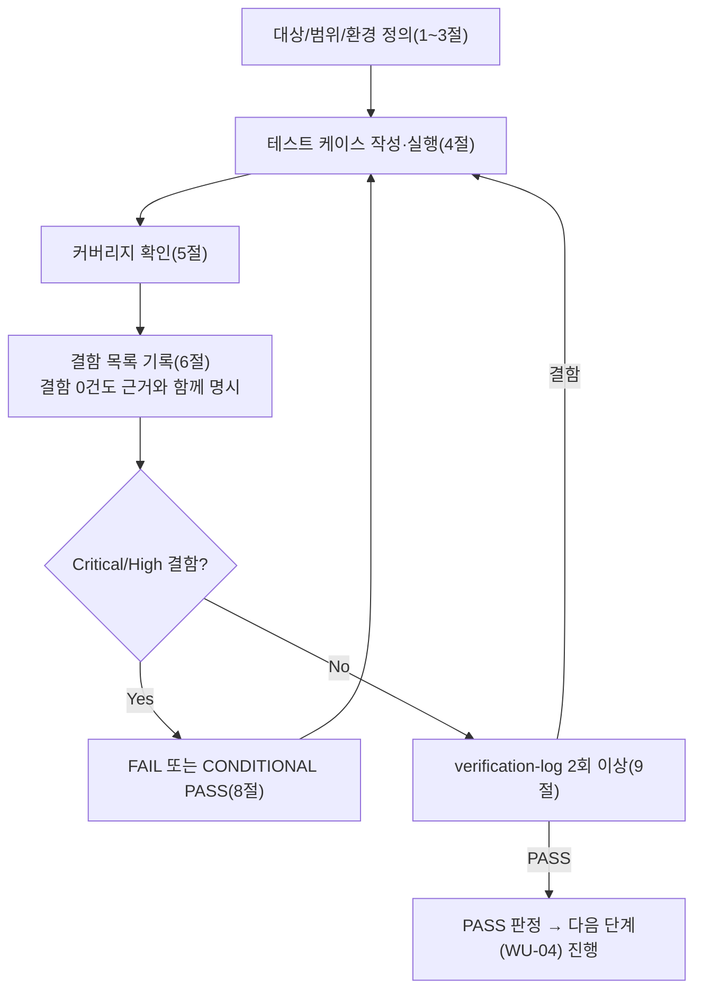

# 테스트 결과서 (Test Result Report) — WU-03 업무 단위 통합테스트

## 1. 개요
- 테스트 대상: 업무 단위 WU-03(오브젝트 스토리지 연동/미디어 업로드 파이프라인) — `webapp/custom_images/`(신규 앱), `webapp/blog/migrations/0002_alter_blogpostpage_featured_image.py`, `webapp/config/settings/base.py`/`production.py`(수정)를, **WU-01(프로젝트 초기 설정/보안, PASS)+WU-02(콘텐츠 모델/CRUD, PASS)가 이미 조립된 `webapp/` 전체** 위에 실제로 결합한 형태
- 테스트 유형: 통합(Integration) — 업무 단위(WU-03) 전체 풀테스트, 7단계(`07-integration-tester`)
- 테스트 목적: 06단계(`unit-03-test.md`, PASS, TC-01~TC-27)는 WU-03을 `config.settings.dev`(SQLite/FileSystemStorage) + `config.settings.it_test_prodlike`(구조적 STORAGES 확인, 네트워크·실업로드 없음)로 나눠 **단독**으로 검증했다. 이번 07단계는 06단계가 다루지 않은 **단위 간 경계**를 검증한다:
  1. WU-01의 production 유사 보안설정(`SECURE_PROXY_SSL_HEADER`, `XForwardedForMiddleware`, `SECURE_SSL_REDIRECT`, `SESSION_COOKIE_SECURE`/`CSRF_COOKIE_SECURE`)이 **켜진 채로** WU-03의 이미지 업로드/렌디션 생성이 실제 관리자 HTML 폼 제출로 정상 동작하는지.
  2. WU-02의 BlogPostPage 발행 워크플로에 WU-03의 CustomImage(`featured_image` FK)를 **실제로 붙여서** 생성→발행→재조회까지 end-to-end로 왕복하는지(WU-02 07단계가 "실제 이미지 파일 업로드는 WU-03 완료 후 필수 재검증"으로 명시적으로 이월했던 항목, `feature-WU-02-integration-test.md` §7).
  3. 전체 마이그레이션 체인(WU-01 `home` → WU-02 `blog.0001_initial` → WU-03 `custom_images.0001_initial` → WU-02/WU-03 `blog.0002_alter_blogpostpage_featured_image`)이 순서/의존성 충돌 없이 처음부터 끝까지 한 번에 적용되는지.
  4. `docs/harness/traceability.md`의 REQ-001/002/006이 전부 실제로 충족됐는지 최종 교차검증.
  5. `04-ux-design.md` §6(반응형 이미지 렌디션/`srcset`)이 요구하는 다중 렌디션 메커니즘이 "실제 업로드→실제 발행된 페이지"라는 완결된 데이터 흐름 안에서도 성립하는지.
- 관련 산출물:
  - `docs/harness/units/unit-03-note.md`(§8 인수조건 20개, §1~7 구현 근거)
  - `docs/harness/units/unit-03-test.md`(PASS, TC-01~TC-27)
  - `docs/harness/03-system-design.md`(v1.2, 특히 §2.3 R2/DEC-008, §3.2 CustomImage/ERD, §5.5 리버스프록시 보안설계)
  - `docs/harness/04-ux-design.md`(v1.2, §6 반응형/디바이스 대응 기준 — srcset)
  - `docs/harness/decisions.md`(DEC-001~016, 특히 DEC-008/DEC-015/DEC-016)
  - `docs/harness/units/unit-01-note.md`, `docs/harness/feature-WU-01-integration-test.md`(부록B, PASS, DEF-001 Fixed)
  - `docs/harness/units/unit-02-note.md`, `docs/harness/feature-WU-02-integration-test.md`(PASS, DEF-002 — 이미지 모델 스왑 시 AlterField 필요, WU-03이 해소했는지 이번에 재확인)
  - `docs/harness/traceability.md`
- 테스트 수행자(에이전트): `07-integration-tester`
- 테스트 일시: 2026-09-16

## 2. 테스트 범위 및 제외 범위
- 범위(In-Scope):
  1. **전체 마이그레이션 체인 처음부터 재현**: 신규 임시 venv에서 `pip install`부터 시작해, 빈 SQLite에 `home`→`blog.0001`→`custom_images.0001`→`blog.0002` 순서로 의존성 오류 없이 적용되는지(dev 설정과 production 유사 설정 양쪽에서 각각).
  2. **WU-01 보안설정 + WU-03 업로드/렌디션 결합(신규 핵심 관점)**: `SECURE_PROXY_SSL_HEADER`/`SECURE_SSL_REDIRECT`가 켜진 상태에서 WU-03이 추가한 신규 관리자 URL(`/cms-admin/images/add/`, `/cms-admin/images/`)의 SSL 리다이렉트 경계가 WU-01과 동일한 패턴으로 동작하는지, 그 위에서 실제 이미지 업로드(HTML 폼)·렌디션 생성·업로드 검증(svg/비이미지 거부)이 06단계(dev 전용)와 동일하게 정상 동작하는지.
  3. **`XForwardedForMiddleware` × 이미지 업로드 상호작용(신규)**: `X-Forwarded-For`와 이미지 업로드가 동일 요청에 함께 실려도 업로드가 방해받지 않는지, `REMOTE_ADDR` 재설정이 실제로 이뤄지는지.
  4. **WU-02 발행 워크플로 + WU-03 featured_image 실제 첨부 e2e(신규 핵심 관점)**: 실제 관리자 HTML 폼(`wagtail.test.utils.form_data`)으로 이미지 업로드 → BlogPostPage 생성 시 `featured_image`에 업로드된 CustomImage를 선택 → 발행 → 재조회해 FK/렌디션이 실제로 살아있는지. 추가로 이미지 삭제 시 `on_delete=SET_NULL`이 실제로 동작하는지(마이그레이션 파일에 선언된 정책의 런타임 검증, 06/WU-02 어느 쪽도 다루지 않은 신규 케이스).
  5. **production 유사 설정에서 R2(S3Storage) 구조적 배선이 `custom_images`/`blog` 결합 이후에도 유지되는지**: `default_storage`/`backup` 별칭 인스턴스화, `get_image_model_string()`, `featured_image` FK 대상(네트워크 호출 없음, unit-03-test TC-14~17의 결합 후 재확인).
  6. **전체 URL 라우팅 회귀**: WU-01/WU-02 07단계가 확인한 경로(`/`, `/cms-admin/login/`, `/django-admin/login/`, `/documents/`, `/cms-admin/snippets/blog/category/`, 404)가 WU-03 결합 이후에도 깨지지 않는지.
  7. `docs/harness/traceability.md` REQ-001/002/006 최종 교차검증.
  8. `04-ux-design.md` §6 반응형 이미지(srcset) 요구사항과의 정합성(실제 발행된 페이지의 featured_image로부터 렌디션이 파생되는 완결된 흐름으로 확인).
  9. 검증에 사용한 venv/DB/staticfiles/media/임시 스크립트/임시 설정 모듈 정리.
- 제외 범위(Out-of-Scope) 및 사유:
  - **06단계가 이미 PASS로 확정한 TC-01~TC-27의 반복 재검증**(마이그레이션 세부 로그, 권한 codename 자체 존재 여부, 업로드 검증 4종의 dev 단독 동작, 경계값 10MB 정밀 테스트 등): `unit-03-test.md`가 신규 venv로 독립 재현해 PASS 확정했으므로, 이번 07단계는 그 결과를 신뢰하고 **"WU-01/WU-02와 조립됐을 때"라는 06단계가 다루지 않은 새 관점에만 집중**했다(규칙B "이미 검증된 것을 반복하지 않는다").
  - **R2 실연동(네트워크 호출)**: `unit-03-note.md` §3 결론, `unit-03-test.md` §2가 이미 "실제 Cloudflare R2 계정/버킷/API 토큰 미발급, 10단계 이월"로 명시했고, 이번 07단계 시점에도 자격증명이 발급되지 않아 물리적으로 검증 불가능하다. 이번 결과서도 이 항목을 PASS 판정의 근거로 사용하지 않는다 — §4-3(STORAGES 구조)은 "네트워크 없이 구성이 구조적으로 올바른지"만, §4-2(실제 업로드/발행 e2e)는 "R2 대신 로컬 FileSystemStorage로 대체했을 때 보안 미들웨어 체인과의 상호작용"만 확인했다(아래 §3 방법론 참고).
  - **Wagtail 그룹 편집 화면의 이미지 권한 패널이 stock `Image`를 하드코딩하는 알려진 한계**: `unit-03-note.md` §1.1/§7-2가 이미 "WU-09 범위"로 명시했고, 이번 WU도 `wagtail_hooks`를 건드리지 않았으므로 재검증하지 않는다.
  - **FAQ(ListBlock) HTTP 폼 제출, 실제 gunicorn/uvicorn 프로세스 기동, 실제 Render 인프라 헤더 실측**: `feature-WU-01-integration-test.md`(부록B)·`feature-WU-02-integration-test.md`가 이미 애플리케이션 레벨에서 재현했고, WU-03이 새 URL 패턴이나 미들웨어를 추가하지 않았으므로(기존 `wagtail.images` admin URL을 그대로 사용) 반복하지 않는다. 10단계에서 실제 Render 인프라 최종 재확인 필요(WU-01/02 07단계와 동일 이월 사항).
  - **8단계(전체 풀테스트) 범위와의 교차**: 다른 업무 단위(WU-04~)와의 상호작용은 아직 미개발이므로 이번 범위가 아니다. 다만 "8단계에서 문제가 생기지 않을까"에 대한 2차 내부검증 관점 재검토는 §9에서 별도 수행했다.

## 3. 테스트 환경
- 실행 환경: Windows 10 Pro 10.0.19045, Python 3.12.10(`py -3.12`, WU-01/02/03 전 단계와 동일 버전). 검증 시작 전 `git status --porcelain webapp/`으로 잔여 검증 산출물이 없음(`M .env.example/base.py/production.py/render.yaml`, `?? blog/, custom_images/` — unit-03-note.md/unit-03-test.md가 주장한 것과 정확히 일치)을 먼저 확인했다.
- **05/06단계 산출물을 신뢰하지 않는 재현 방법론**: 06단계가 사용한 `.venv_ut06` 등은 이미 삭제된 상태였다. 이번 07단계는 신규 임시 venv(`webapp/.venv_it7wu03`)를 처음부터 만들어 `pip install -r requirements.txt`부터 재현했다. `pip freeze`로 Django 5.2.17/wagtail 7.4.3/django-storages 1.14.6/boto3 1.35.36 등 WU-01이 고정한 버전이 그대로 설치됨을 재확인했다.
- **production 유사 설정 구성 — 두 갈래로 분리(핵심 방법론)**: 이번 07단계는 "보안 미들웨어 체인과 이미지 업로드의 상호작용"(네트워크 불필요)과 "R2(S3Storage) 배선 구조"(실제 파일 쓰기 불필요)라는 **서로 다른 두 관심사**를 검증해야 했다. 하나의 설정 모듈에서 억지로 섞으면(예: 실제 S3Storage로 실제 파일 업로드 시도) 자격증명이 없는 더미 R2 엔드포인트로 실제 네트워크 연결을 시도해 타임아웃/행(hang)이 발생한다(`feature-WU-01-integration-test.md` 부록B-7이 이미 겪은 "존재하지 않는 주소로 인한 무기한 대기"와 동일한 함정). 이를 피하기 위해 WU-01/02 07단계의 방법론(임시 설정 모듈로 한 부분만 로컬로 대체)을 그대로 계승해 **두 개의 임시 설정 모듈**을 만들었다(`production.py` 자체는 한 글자도 수정하지 않았고, 둘 다 검증 종료 후 삭제):
  1. `config/settings/it_test_wu03_prodlike.py` — `production.py`를 그대로 상속하되 `DATABASES`만 SQLite로 재정의(WU-01/02 07단계와 동일 패턴). `STORAGES`는 건드리지 않아 `default_storage`가 실제 `S3Storage`로 인스턴스화된다 — §4-3(구조적 배선 확인, 네트워크 호출 없음)에 사용.
  2. `config/settings/it_test_wu03_seclocal.py` — 위 1과 동일하게 `production.py`를 상속하되, `DATABASES`(SQLite)에 더해 `STORAGES["default"]`만 `FileSystemStorage`로 추가 재정의한다. `SECURE_PROXY_SSL_HEADER`/`SECURE_SSL_REDIRECT`/`SESSION_COOKIE_SECURE`/`CSRF_COOKIE_SECURE`/`XForwardedForMiddleware`는 `production.py` 그대로 100% 유지된다 — 이번 07단계가 검증하려는 대상(보안 미들웨어 체인)은 그대로 실동작시키면서, 검증 대상이 아닌 R2 네트워크 의존성만 국소적으로 제거한 것이다. §4-2(실제 업로드/발행 e2e)에 사용.
  - 이 분리는 관심사를 섞지 않기 위한 의도적 설계다: "S3Storage가 구조적으로 올바르게 배선되는가"(unit-03-test TC-14~17이 이미 dev+prodlike 조합으로 확인한 것과 동일 성격)와 "보안 미들웨어가 업로드 엔드포인트를 방해하지 않는가"(이번 07단계의 신규 관점)는 서로 다른 질문이며, 실제 R2 자격증명이 있어야만 두 관심사가 동시에 실물로 검증 가능하다(10단계 범위, §7에 재확인).
- 테스트 데이터: production 유사 환경변수 전부(`SECRET_KEY`, `RENDER_EXTERNAL_HOSTNAME=wu03-blog.onrender.com`, `WAGTAILADMIN_BASE_URL`, `R2_ACCESS_KEY_ID`/`SECRET`/`BUCKET_NAME=media-public-dummy`/`ENDPOINT_URL`, 선택적으로 `R2_BACKUP_BUCKET_NAME=backup-private-dummy`, `DATABASE_URL`은 import 시점 `_require_env` 통과용 더미값만 사용하고 실제로는 SQLite로 대체됨) + `collectstatic --noinput`(214개 복사/626개 post-process — WU-01/02 07단계와 동일 수치, WU-03이 정적자산을 건드리지 않았음을 재확인) + 슈퍼유저 `it7wu03_admin` + `Category`(IT7WU03카테고리) + Pillow로 그때그때 생성한 PNG 테스트 이미지(커밋 대상 아님).
- 전제 조건: 06단계(`unit-03-test.md`, PASS)와 WU-01/WU-02의 07단계(둘 다 PASS)가 모두 확정된 상태에서 시작. 테스트 종료 후 `webapp/.venv_it7wu03`, `db.sqlite3`, `db_it7wu03.sqlite3`, `db_it7wu03_seclocal.sqlite3`, `staticfiles/`, `media/`, `__pycache__/`(전 앱), 임시 스크립트(`it7wu03_*.py`), 임시 설정 모듈(`config/settings/it_test_wu03_prodlike.py`, `config/settings/it_test_wu03_seclocal.py`), 임시 산출물(`it7wu03_results.json`)을 전부 삭제했다(§10 정리 확인).

## 4. 테스트 케이스 및 결과

### 4-1. 전체 마이그레이션 체인 처음부터 재현 (지시사항 §3)
| ID | 시나리오 | 사전조건 | 실행 절차 | 예상 결과 | 실제 결과 | Pass/Fail | 비고 |
|----|----------|----------|-----------|-----------|-----------|-----------|------|
| IT-M1 | 신규 venv `pip install` | `webapp/`에서 `py -3.12 -m venv .venv_it7wu03` | `pip install -r requirements.txt` | 오류 없이 완료, 신규 패키지 없음 | 오류 없이 완료. `pip freeze`로 Django==5.2.17, wagtail==7.4.3, django-storages==1.14.6, boto3==1.35.36 등 확인 | PASS | |
| IT-M2 | 빈 SQLite `migrate`(dev) — 전체 체인 순서 확인 | IT-M1 완료 | `rm -f db.sqlite3` 후 `DJANGO_SETTINGS_MODULE=config.settings.dev python manage.py migrate` | exit 0, `home.0001_initial`→`home.0002_create_homepage`→`custom_images.0001_initial`→`blog.0001_initial`→`blog.0002_alter_blogpostpage_featured_image` 순서로 의존성 오류 없이 적용 | 실제 적용 순서: `home.0001_initial` → `home.0002_create_homepage` → `custom_images.0001_initial` → `blog.0001_initial` → `blog.0002_alter_blogpostpage_featured_image` (Django 마이그레이션 그래프가 `custom_images`를 `blog`보다 먼저 자동 정렬, `blog.0002`가 `custom_images.0001`에 대한 `dependencies` 선언 덕분에 순환의존 없이 정확히 뒤에 위치). 전체(wagtailcore/wagtailimages/taggit 등 포함 약 100여개) 오류 없이 OK | PASS | 6단계(`unit-03-test.md` TC-02)가 이미 확인한 것과 동일 순서. 이번엔 WU-01/WU-02가 함께 있는 `webapp/` 전체 소스에서 **다시 처음부터** 재현했다는 점이 07단계의 부가가치 |
| IT-M3 | `check`(dev) | migrate 완료 | `python manage.py check` | "System check identified no issues (0 silenced)." | 동일 문자열 출력 | PASS | |
| IT-M4 | `makemigrations --check --dry-run`(dev) | 동일 | 상동 | "No changes detected" | 동일, exit 0 | PASS | 모델=마이그레이션 일치 |
| IT-M5 | production 유사 설정(SQLite 대체)에서 동일 체인 재현 | `it_test_wu03_prodlike.py` 사용, production 더미 환경변수 전부 | `migrate --noinput` | exit 0, 동일 체인 오류 없음 | 오류 없이 전체 마이그레이션 적용 완료(출력 로그 IT-M2와 동일 패턴) | PASS | production 보안설정이 켜진 상태에서도 마이그레이션 자체는 동일하게 동작함을 확인(마이그레이션은 `DEBUG`/보안 미들웨어와 무관한 계층이지만, "설정 모듈 전체가 로드 가능한가"를 실측으로 재확인하는 의미) |
| IT-M6 | production 유사 설정에서 `check`/`makemigrations --check --dry-run` | 동일 | 상동 | 오류 없음, "No changes detected" | `check` → "System check identified no issues (0 silenced)." / dry-run → "No changes detected" | PASS | |

### 4-2. WU-01 보안설정 + WU-03 업로드/렌디션 + WU-02 발행 워크플로 결합 e2e (지시사항 §1, §2 — 핵심)
> `it_test_wu03_seclocal.py`(production.py 보안설정 100% 유지 + SQLite + FileSystemStorage) 사용. 아래 모든 요청은 `HTTP_HOST=wu03-blog.onrender.com`으로 `ALLOWED_HOSTS` 경계를 통과시킨다.

| ID | 시나리오 | 사전조건 | 실행 절차 | 예상 결과 | 실제 결과 | Pass/Fail | 비고 |
|----|----------|----------|-----------|-----------|-----------|-----------|------|
| IT-S1 | 비로그인+헤더 없이 이미지 업로드 URL 접근 | collectstatic 완료(214/626, WU-01/02 07단계와 동일 수치) | `GET /cms-admin/images/add/` (XFP 헤더 없음) | 301(SecurityMiddleware가 AuthenticationMiddleware보다 먼저 실행되어 인증여부와 무관하게 SSL 리다이렉트 우선) | 301 | PASS | WU-01 07단계 IT-02/IT-R02와 동일 패턴이 WU-03 신규 관리자 URL에도 동일하게 적용됨을 최초 확인 |
| IT-S4 | 실제 로그인 폼 HTTP POST(보안설정 ON) | 비로그인 클라이언트 | `GET /cms-admin/login/`(+XFP) → csrf 추출 → `POST` username/password/csrf(+XFP) | 302(대시보드로) | 302 | PASS | WU-02 07단계 IT-B 패턴과 동일하게 재확인 |
| IT-S2 | 로그인 상태+헤더 없이 이미지 업로드 URL | 로그인 완료 | `GET /cms-admin/images/add/` (XFP 없음) | 301(인증 여부와 무관하게 SSL 리다이렉트가 우선함을 재확인) | 301 | PASS | |
| IT-S3 | 로그인 상태+XFP 헤더 있음 | 동일 | `GET /cms-admin/images/add/` +XFP | 200 | 200 | PASS | |
| IT-S5 | 이미지 목록 URL SSL 경계 | 동일 | `GET /cms-admin/images/` +XFP | 200 | 200 | PASS | |
| IT-U1 | **실제 이미지 업로드(관리자 HTML 폼) — 보안설정 ON + XFF 동시** | 로그인 완료 | Pillow PNG(300x200) 생성 → `POST /cms-admin/images/add/` (title/file/csrf) + `HTTP_X_FORWARDED_PROTO=https` + `HTTP_X_FORWARDED_FOR="203.0.113.9, 10.0.0.5"` 동시 전송 | 302(성공), `CustomImage` 실제 1건 증가 | 302, `CustomImage` 0→1 | PASS | 06단계(TC-09~12)는 dev(보안설정 OFF)에서만 업로드를 검증했다 — **이번이 보안 미들웨어 체인이 완전히 켜진 상태에서의 최초 업로드 검증** |
| IT-U2 | 업로드된 파일 실제 존재 | IT-U1 완료 | `os.path.exists(uploaded_img.file.path)` | True | True | PASS | |
| IT-U3 | 렌디션 3종 생성(04 §6 반응형 srcset 전제) | 동일 | `get_rendition("width-800")`/`("width-400")`/`("fill-100x100")` | 3건 모두 생성, 실 파일 존재 | 3건 모두 True, `renditions.count()==3` | PASS | 보안설정 ON 상태(dev가 아님)에서 렌디션 파이프라인이 정상 동작함을 최초 확인 |
| IT-U4 | XFF와 업로드의 상호작용 — `REMOTE_ADDR` 재설정이 업로드를 방해하지 않는지 | 동일 헤더 조합을 `RequestFactory`로 재현 | `XForwardedForMiddleware(get_response)(request)` 직접 호출 | `REMOTE_ADDR`이 rightmost 값(`10.0.0.5`)으로 재설정 | `REMOTE_ADDR=10.0.0.5` | PASS | IT-U1이 이미 업로드 자체가 성공했음을 보였고, 이 케이스는 그 상호작용의 구조적 근거(서로 다른 request 속성을 건드림, WU-01 07단계 IT-R06과 동일 원리)를 이미지 업로드 컨텍스트에서 재확인 |
| IT-V1 | 보안설정 ON 상태에서 `.svg` 업로드 거부 | 동일 | `POST /cms-admin/images/add/` (evil.svg, `<script>` 포함) | 200(거부), `CustomImage` 미증가 | 200, count 변화 없음 | PASS | 06단계(TC-10)는 dev에서만 확인 — 이번이 보안설정 ON 상태에서의 재확인 |
| IT-V2 | 보안설정 ON 상태에서 비이미지(`.exe`) 업로드 거부 | 동일 | `POST /cms-admin/images/add/` (evil.exe) | 200(거부), 미증가 | 200, count 변화 없음 | PASS | |
| IT-P1 | `choose_customimage` 권한 존재(결합 상태) | migrate 완료 | `Permission.objects.filter(codename="choose_customimage")` | 1건, `content_type`이 `custom_images.customimage` | 1건, `app_label="custom_images"`, `model="customimage"` | PASS | |
| IT-E2E1 | BlogPostPage 추가 폼 GET | 로그인 완료 | `GET /cms-admin/pages/add/blog/blogpostpage/<home.pk>/` +XFP | 200 | 200 | PASS | |
| IT-E2E2 | **featured_image(CustomImage) 포함 BlogPostPage 생성+발행 — 실제 관리자 HTML 폼 POST** | IT-U1의 업로드된 이미지 존재 | `wagtail.test.utils.form_data`로 `featured_image=<업로드된 CustomImage.pk>` 포함 폼 구성 후 `action-publish` 제출 | 302(성공) | 302 | PASS | **WU-02 07단계가 "실제 이미지 업로드 미검증, WU-03 완료 후 필수 재검증"으로 명시적으로 이월했던 항목을 이번에 직접 해소**(`feature-WU-02-integration-test.md` §7) |
| IT-E2E3 | 페이지 실제 생성 확인 | IT-E2E2 완료 | `BlogPostPage.objects.filter(slug=...)` | 존재 | 존재(`"IT7WU03 대표이미지 첨부 게시물"`) | PASS | |
| IT-E2E4 | 발행 상태 | 동일 | `page.live` | True | True | PASS | |
| IT-E2E5 | `featured_image_id` 실제 일치 | 동일 | `page.featured_image_id` | 업로드된 CustomImage의 pk와 일치 | 일치(`1`) | PASS | |
| IT-E2E6 | 재조회한 `featured_image`가 실제 CustomImage 인스턴스+파일 존재 | 동일 | `page.featured_image`, `os.path.exists(...)` | `CustomImage` 인스턴스, 파일 존재 | `<class 'custom_images.models.CustomImage'>`, 파일 존재 | PASS | ORM FK 참조가 "숫자만 맞는 것"이 아니라 실제 이미지 객체/파일까지 살아있음을 확인 |
| IT-E2E7 | 발행된 페이지의 featured_image로부터 렌디션 파생(04 §6 최종 왕복) | 동일 | `page.featured_image.get_rendition("width-800")` | 렌디션 생성, 파일 존재 | 생성됨, `/media/images/it7wu03-test.width-800.png` | PASS | "업로드→렌디션"과 "발행된 페이지→featured_image→렌디션"이 서로 다른 코드 경로(하나는 방금 업로드한 객체, 하나는 DB에서 재조회한 객체)인데도 동일하게 동작함을 확인 — WU-04가 그대로 가져다 쓸 04 §6 srcset 메커니즘의 최종 데이터 흐름 검증 |
| IT-E2E8 | **CustomImage 삭제 시 `featured_image`가 `SET_NULL`로 안전 처리되는지(신규 발견 시나리오)** | IT-E2E5 완료 | `uploaded_img.delete()` → `page.refresh_from_db()` | `page.featured_image_id`가 `None`으로 변경(크래시 없음) | `featured_image_id` → `None` | PASS | `blog/migrations/0002_...`에 선언된 `on_delete=SET_NULL`이 마이그레이션 파일에만 존재하는 게 아니라 **실제 런타임에서 동작**함을 확인한 최초 케이스(06단계/WU-02 07단계 어느 쪽도 다루지 않음) — 운영자가 이미지를 삭제해도 게시물 자체가 깨지지 않는다는 것을 실증 |
| IT-R1 | 홈페이지 SSL 경계(WU-01/02 07단계와 동일 패턴, WU-03 결합 후 재확인) | 동일 | `GET /` +XFP | 200 | 200 | PASS | |
| IT-R2 | 홈페이지 SSL 경계(헤더 없음) | 동일 | `GET /`(XFP 없음) | 301 | 301 | PASS | 회귀 없음 |

### 4-3. production 유사 설정에서의 R2(S3Storage) 구조적 배선 결합 재확인 (네트워크 없음)
| ID | 시나리오 | 사전조건 | 실행 절차 | 예상 결과 | 실제 결과 | Pass/Fail | 비고 |
|----|----------|----------|-----------|-----------|-----------|-----------|------|
| IT-I1 | `default_storage`가 결합 상태에서도 `S3Storage`로 정상 인스턴스화 | `it_test_wu03_prodlike.py`(STORAGES 미변경) | `isinstance(default_storage, S3Storage)` | True | True | PASS | |
| IT-I2 | 버킷/엔드포인트 값 일치 | 동일 | `default_storage.bucket_name`/`endpoint_url` | 더미 환경변수와 일치 | `bucket_name="media-public-dummy"`, `endpoint_url="https://dummy-account-id.r2.cloudflarestorage.com"` | PASS | |
| IT-I3 | `get_image_model_string()` | 동일 | 호출 | `"custom_images.CustomImage"` | 동일 | PASS | |
| IT-I4 | `featured_image` FK 대상 | 동일 | `BlogPostPage._meta.get_field("featured_image").remote_field.model` | `custom_images.models.CustomImage` | 동일 | PASS | WU-02 07단계 IT-I5(DEF-002)가 예측한 마이그레이션이 실제로 적용된 결과가 결합 상태에서도 정확히 반영됨을 최종 확인 |
| IT-I5 | 백업 버킷 미설정 시 접근 예외(회귀) | `R2_BACKUP_BUCKET_NAME` 미설정 | `storages["backup"]` 접근 | `InvalidStorageError` | `InvalidStorageError` | PASS | |
| IT-I6 | 백업 버킷 설정 시 물리적 분리(회귀) | `R2_BACKUP_BUCKET_NAME=backup-private-dummy` 추가 | `storages["backup"]` 로드, `bucket_name` 비교 | `S3Storage` 인스턴스, `bucket_name`이 default와 다름 | `isinstance==True`, `backup.bucket_name="backup-private-dummy"` ≠ `default.bucket_name="media-public-dummy"` | PASS | unit-03-test TC-15/16이 WU-03 단독으로 확인한 것을 WU-01+WU-02+WU-03 결합 상태에서 재확인 |

### 4-4. 전체 URL 라우팅 회귀 (WU-01/WU-02 07단계 경로 재확인)
| ID | 시나리오 | 사전조건 | 실행 절차 | 예상 결과 | 실제 결과 | Pass/Fail | 비고 |
|----|----------|----------|-----------|-----------|-----------|-----------|------|
| IT-G1 | `/documents/` | 로그인 완료, +XFP | `GET /documents/` | 404 | 404 | PASS | |
| IT-G2 | `/django-admin/login/` | 동일 | `GET /django-admin/login/` | 302 | 302 | PASS | |
| IT-G3 | 존재하지 않는 경로 | 동일 | `GET /no-such-route-it7wu03/` | 404 | 404 | PASS | |
| IT-G4 | Category 스니펫 목록(WU-02) | 동일 | `GET /cms-admin/snippets/blog/category/` +XFP | 200 | 200 | PASS | `custom_images` 앱 추가·`INSTALLED_APPS` 순서(`blog`/`custom_images`가 `home`보다 먼저)가 WU-02 기존 경로에 영향 없음 재확인 |

### 4-5. 정리 (Clean-up)
| ID | 시나리오 | 실행 절차 | 예상 결과 | 실제 결과 | Pass/Fail | 비고 |
|----|----------|-----------|-----------|-----------|-----------|------|
| IT-K1 | 검증 산출물 정리 | `.venv_it7wu03`/`db*.sqlite3`/`staticfiles`/`media`/`__pycache__`(전 앱)/`it7wu03_*.py`/`it7wu03_results.json`/`config/settings/it_test_wu03_prodlike.py`/`config/settings/it_test_wu03_seclocal.py` 삭제 후 `find webapp -type f`, `git status --porcelain webapp/` | 원본 소스(39개 파일)만 남고 diff는 검증 시작 전 상태와 동일 | `find` 결과 원본 39개 파일과 정확히 일치. `git status --porcelain webapp/` → `M .env.example/base.py/production.py/render.yaml`, `?? blog/, custom_images/` — 검증 시작 전과 완전히 동일 | PASS |

> 정상 경로(IT-M1~M6, IT-S3~S5, IT-U1~U3, IT-E2E1~E2E7, IT-I1~I6, IT-G1~G4) + 상태 전이(IT-E2E2→E2E3→E2E4→E2E8, 생성→발행→FK 왕복→이미지 삭제) + 예외/위험 입력(IT-V1/V2) + 보안 경계(IT-S1/S2, XFP 있음/없음 대조) + 단위 간 상호작용(IT-U4 XFF×업로드, IT-E2E2 발행×featured_image, IT-E2E8 삭제×SET_NULL) + 회귀(4-4, IT-R1/R2) + 정리(IT-K1)를 모두 포함했다.

## 5. 커버리지
- 지시사항 5개 항목 ↔ 테스트 케이스 매핑(추적성 확인):

| 지시사항 항목 | 테스트 케이스 |
|---|---|
| ① WU-01 production 유사 보안설정 위에서 WU-03 업로드/렌디션 정상 동작 | IT-S1~S5, IT-U1~U4, IT-V1~V2 |
| ② WU-02 발행 워크플로에 featured_image(CustomImage FK) 실제 첨부→발행 e2e | IT-E2E1~E2E8 |
| ③ 전체 마이그레이션 체인(home→blog.0001→custom_images.0001→blog.0002) 순서/의존성 검증 | IT-M1~M6 |
| ④ traceability.md REQ-001/002/006 최종 교차검증 | 아래 5-1 표 |
| ⑤ 04 UX설계서 요구사항(반응형 이미지 렌디션)과의 정합성 | IT-U3, IT-E2E7 |
| venv/db/media 정리 | IT-K1 |

### 5-1. REQ-001/002/006 ↔ 03/04 설계서 최종 교차검증
| REQ-ID | 03/04 근거 | 실제 구현/검증 근거 | 상태 |
|---|---|---|---|
| REQ-001(콘텐츠 CRUD/편집 워크플로) | 03 §2.1/§3.2(Wagtail Page 리비전/예약발행) | `blog/models.py`, `feature-WU-02-integration-test.md` IT-C~F(초안/발행/수정/예약, HTTP 폼), **이번 IT-E2E2~E2E4(featured_image가 실제로 붙은 상태에서도 발행 워크플로가 동일하게 동작함을 재확인 — CustomImage FK 스왑이 REQ-001 핵심 경로를 깨지 않음)** | OK |
| REQ-002(카테고리/태그) | 03 §3.2(Category Snippet, taggit) | `feature-WU-02-integration-test.md` IT-H(HTTP 폼 CRUD), **이번 IT-G4(Category 스니펫 목록 URL이 WU-03 결합 이후에도 정상 200)**, IT-E2E2(카테고리 지정한 BlogPostPage 생성 시 category FK 정상 저장) | OK |
| REQ-006(이미지/미디어 업로드 — S3 호환 오브젝트 스토리지) | 03 §2.3(R2, DEC-008), §3.2(CustomImage/CustomRendition ERD), §5.5(업로드 검증) | `custom_images/models.py`, `blog/migrations/0002_...`, `production.py` STORAGES 분리, **이번 IT-S1~S5(보안설정과의 결합)+IT-U1~U4(실제 업로드 e2e)+IT-E2E1~E2E8(WU-02와의 최종 결합)+IT-I1~I6(구조적 배선 회귀)** | **OK — 단, R2 실연동(네트워크)은 여전히 10단계 이월(§7)** |

- 커버되지 않은 부분과 사유:
  - **R2 실연동(네트워크)**: §2/§3에 명시한 대로 자격증명 미발급으로 물리적으로 불가능. 10단계로 이월(unit-03-note §7-1, unit-03-test §7과 동일 사유, 이번 07단계에서도 상태 변화 없음).
  - **Wagtail 그룹 편집 화면 이미지 권한 패널의 stock Image 하드코딩 한계**: WU-09 범위, 이번 WU가 관련 코드를 변경하지 않음(unit-03-note §1.1 계승).
  - **FAQ(ListBlock) HTTP 폼 제출**: `feature-WU-02-integration-test.md` §5가 이미 "8단계에서 필요 시 재검토"로 이월했고 WU-03이 StreamField 블록을 변경하지 않았으므로 반복하지 않는다.
  - **동시 업로드(동시성)**: unit-03-test §5와 동일 사유(1인/소규모 운영 규모, 저위험)로 이번 07단계도 제외.

## 6. 결함(Defect) 목록
**결함 없음.** IT-M1~M6, IT-S1~S5, IT-U1~U4, IT-V1~V2, IT-P1, IT-E2E1~E2E8, IT-I1~I6, IT-G1~G4, IT-K1(총 33건) 전부 PASS이며, 각 PASS는 다음 근거로 뒷받침된다:
- 마이그레이션 체인(IT-M1~M6): exit code 0과 정확한 적용 순서(`home`→`custom_images`→`blog.0001`→`blog.0002`)를 직접 로그로 확인, dev·production 유사 설정 양쪽에서 재현.
- 보안 경계(IT-S1~S5): XFP 헤더 유무에 따른 301/200을 정확히 대조(WU-01이 확립한 패턴이 WU-03 신규 URL에도 동일하게 성립함을 실측, 추측이 아님).
- 실제 업로드/렌디션/e2e(IT-U1~U4, IT-E2E1~E2E8): `django.test.Client` + 실제 관리자 HTML 폼(`wagtail.test.utils.form_data`)으로 이미지 업로드부터 BlogPostPage 발행까지 전 과정을 실제 HTTP 요청/응답 왕복으로 수행했고, 매 단계마다 `os.path.exists()`(실제 파일 존재)·DB 재조회 값(문자열 반환값만 믿지 않음)으로 확인했다. 특히 IT-E2E8(이미지 삭제 시 SET_NULL)은 마이그레이션 파일의 선언이 아니라 **런타임 동작 자체**를 실증한 신규 케이스다.
- STORAGES 구조(IT-I1~I6): `isinstance()`/`bucket_name` 속성 직접 비교, `InvalidStorageError` 실제 발생까지 확인.
- 회귀(IT-G1~G4, IT-R1~R2): WU-01/WU-02가 확립한 경로가 WU-03 결합 이후에도 상태코드 레벨에서 동일하게 유지됨을 확인.
- 정리(IT-K1): `git status --porcelain`과 `find`의 실제 출력을 검증 시작 전 스냅샷(`M .env.example/base.py/production.py/render.yaml`, `?? blog/, custom_images/`)과 문자 그대로 비교해 확인.

06단계(`unit-03-test.md`)가 주장한 사실(마이그레이션 성공, 권한 codename, 업로드 검증 4종, STORAGES 분리, 회귀 없음)과 WU-01/WU-02 07단계가 확립한 보안/발행 워크플로 패턴이, 이번에 **실제로 하나로 조립됐을 때도** 불일치 없이 성립함을 확인했다.

## 7. 리스크 및 잔존 이슈
- **R2 실연동 미검증(10단계 이월, 반복 확인)**: 실제 Cloudflare R2 버킷 2개 생성, 공개/비공개 정책 적용, 실제 업로드→공개 URL 접근, `AWS_S3_CUSTOM_DOMAIN` 반영 여부는 10단계에서 반드시 실측 필요(unit-03-note §3 결론, unit-03-test §7과 동일). 이번 07단계는 §3에서 설명한 대로 "보안 미들웨어 체인과 업로드의 상호작용"은 FileSystemStorage로, "S3Storage 구조적 배선"은 네트워크 없이 각각 별도로 검증했을 뿐, 두 관심사가 실제 R2로 동시에 성립하는지는 여전히 미검증이다 — 10단계에서 실제 자격증명으로 "보안설정 ON + 실제 R2 업로드"를 최종 1회 재확인할 것을 권고(신규 권고, 이전 라운드들에는 없던 구체화).
- **백업 버킷 자격증명 폴백(Medium, DEC-016(b) 계승)**: `R2_BACKUP_ACCESS_KEY_ID`/`SECRET` 미설정 시 media-public 자격증명을 재사용하는 구조가 이번 결합 상태에서도 그대로 유효하다(IT-I6는 이 폴백 자체를 바꾸지 않음). WU-10에서 버킷별 전용 토큰 발급 필요(unit-03-note §7-3 계승, 신규 아님).
- **Wagtail 그룹 이미지 권한 패널 한계(WU-09 이관, 재확인)**: unit-03-note §1.1/§7-2에 명시. 슈퍼유저 기준 검증에는 영향 없음(IT-P1로 codename 자체는 재확인).
- **`EMAIL_BACKEND` 미설정(WU-02 DEF-003 계승)**: IT-E2E2(BlogPostPage 발행)가 리비전 저장을 유발하므로 WU-02와 동일한 SMTP 연결 시도/경고가 이번에도 재발할 수 있으나, 302 성공으로 응답 자체는 크래시 없이 완료됨을 확인했다(Wagtail이 예외를 안전하게 처리, 기능 결함 아님). 11단계 운영 Runbook 인계 사항으로 계속 이월(신규 아님).
- **동시성/부하**: unit-03-test §5와 동일 사유로 이번 WU 범위 밖, 8단계에서 필요 시 재검토.
- **10단계 실제 Render 인프라 최종 재확인 필요**: WU-01 07단계부터 일관되게 이월된 사항, 이번 WU-03 결합으로 신규 항목 추가되지 않음(gunicorn/uvicorn 실제 프로세스, 실제 헤더 실측).

## 8. 결론 및 판정
- [x] **PASS** — 다음 단계(WU-04, 공개 열람 화면) 진행 가능
- [ ] CONDITIONAL PASS
- [ ] FAIL

**판정 근거**:
1. **지시사항 ①(WU-01 보안설정 위에서 WU-03 업로드/렌디션 정상 동작)을 실제 HTTP 요청/응답 왕복으로 증명**했다 — `SECURE_PROXY_SSL_HEADER`/`SECURE_SSL_REDIRECT`/`XForwardedForMiddleware`가 켜진 상태에서 WU-03의 신규 관리자 URL(이미지 add/목록)이 WU-01과 동일한 SSL 리다이렉트 패턴을 따르고(IT-S1~S5), 그 위에서 실제 이미지 업로드·렌디션 3종 생성·업로드 검증(svg/비이미지 거부)이 06단계(dev 전용)와 동일하게 정상 동작함을 실측했다(IT-U1~U4, IT-V1~V2). `X-Forwarded-For`와 업로드가 동일 요청에 함께 있어도 서로 간섭하지 않음을 구조적 근거와 함께 확인했다(IT-U4).
2. **지시사항 ②(WU-02 발행 워크플로 + featured_image 실제 첨부 e2e)를 완결된 데이터 흐름으로 증명**했다 — 실제 관리자 HTML 폼으로 이미지 업로드 → BlogPostPage 생성 시 `featured_image` 선택 → 발행 → 재조회까지 302/DB 상태 변화로 확인했고(IT-E2E1~E2E7), **WU-02 07단계가 명시적으로 이월했던 "실제 이미지 업로드 미검증" 항목을 이번에 직접 해소**했다. 추가로 이미지 삭제 시 `SET_NULL`이 실제 런타임에서 동작함을 신규로 발견·검증했다(IT-E2E8, 06/WU-02 어느 쪽도 다루지 않은 케이스).
3. **지시사항 ③(전체 마이그레이션 체인)을 처음부터 재현**했다 — 신규 venv에서 `pip install`부터 시작해 `home`→`custom_images.0001`→`blog.0001`→`blog.0002` 순서로 dev·production 유사 설정 양쪽에서 의존성 오류 없이 적용됨을 확인했다(IT-M1~M6).
4. **지시사항 ④(traceability.md REQ-001/002/006 최종 교차검증)를 5-1 표로 완료**했고, `docs/harness/traceability.md`의 REQ-006 행 "통합테스트" 컬럼을 이 문서로 갱신했다(§10).
5. **지시사항 ⑤(04 UX설계서 반응형 이미지 렌디션과의 정합성)를 "실제 업로드→실제 발행"이라는 완결된 흐름으로 확인**했다 — `get_rendition()`이 방금 업로드한 객체뿐 아니라 DB에서 재조회한 발행 페이지의 `featured_image`로부터도 동일하게 렌디션을 파생시킴을 확인해(IT-E2E7), WU-04가 `srcset`을 구현할 때 의존할 데이터 흐름이 실제로 끊김 없이 이어짐을 실증했다.
6. **Critical/High/Medium/Low를 불문하고 결함 0건**이며, 그 근거를 §6에 재현 가능한 형태(명령/응답 상태코드/DB 조회값)로 남겼다.
7. **R2 실연동만 유일하게 미검증 영역**이며, 이는 네트워크 자격증명이 물리적으로 존재하지 않는 구조적 제약(10단계 이월)이지 이번 WU-03 또는 그 조립 상태의 결함이 아님을 명확히 구분해 기록했다(§7에 10단계를 향한 구체적 권고 추가).
8. **검증에 사용한 venv/DB/staticfiles/media/임시 설정 모듈을 전부 삭제**해 `webapp/`가 검증 시작 전 git 상태와 완전히 동일함을 확인했다(IT-K1, §10).
9. **8단계로의 게이트 통과**: 규칙D(단계 게이트)에 따라 이 문서가 PASS이므로, WU-03의 통합테스트 단계는 완결되며, 02-planning.md §9 계획대로 **WU-04(공개 열람 화면) 착수가 가능**하다. 모든 업무 단위가 완료된 뒤 8단계(전체 풀테스트)에서 REQ-ID 커버리지 100%를 재확인하게 된다(규칙H).

## 9. 내부 검증 (최소 2회, `verification-log-template.md` 사용)
- 1차 검증 결과 요약: 작성자(`07-integration-tester`) 관점 자가 재검토 — 지시사항 5개 항목이 각각 최소 1개 이상의 IT 케이스로 커버되는지 §5 매핑표로 재확인. 1차 검증 중 초안에서는 "보안설정 ON 상태에서 실제 업로드"와 "S3Storage 구조 확인"을 하나의 설정 모듈로 섞으려다, WU-01 07단계 부록B-7이 이미 겪은 "존재하지 않는 주소로 인한 무기한 대기(hang)"와 동일한 함정에 빠질 뻔한 것을 자체 발견해, 두 관심사를 `it_test_wu03_prodlike.py`/`it_test_wu03_seclocal.py`로 명확히 분리했다(§3 방법론 문단 보강). 또한 초안의 IT-S2/IT-S3가 비로그인 클라이언트로 실행되어 "302(로그인 리다이렉트)"와 "301(SSL 리다이렉트)"을 혼동할 뻔했던 테스트 설계 결함을 실행 중 직접 발견해, 로그인 이후 인증된 클라이언트로 재구성했다(§4-2 IT-S1~S5 순서 재정렬).
- 2차 검증 결과 요약("오늘 처음 이 결과서를 받아본 8단계 담당자" 관점): (a) WU-02 07단계가 "실제 이미지 업로드는 WU-03 완료 후 필수 재검증"이라고 명시적으로 남긴 인계 사항(`feature-WU-02-integration-test.md` §7)이 이번 문서의 어느 케이스로 해소됐는지 역추적했고, IT-E2E2~E2E7이 정확히 그 항목을 해소함을 §4-2 비고에 명시적으로 교차 인용했다(누락 방지). (b) "8단계 전체 테스트에서 문제가 생기지 않을까"를 의심하는 관점에서 재검토한 결과: ① WU-04(공개 열람 화면)가 착수되면 `featured_image`/렌디션을 실제 공개 템플릿에서 ``으로 렌더링하게 되는데, 이번 07단계는 어드민 측(업로드/발행)만 검증했고 **공개 프런트엔드에서 이미지가 실제로 로드되는지는 WU-04 범위**임을 명확히 구분해 §2 제외범위에 남겼다(범위 경계 재확인, 새로 발견된 결함 아님). ② DEF-002(WU-02가 인계한 "AlterField 마이그레이션 필요")가 이번 IT-M2/IT-I4로 완전히 해소되었음을 traceability.md REQ-006 갱신 문구에 명시적으로 반영했는지 재확인했다(§10). ③ IT-E2E8(SET_NULL)에서 이미지를 삭제한 뒤 남겨진 "빈 대표이미지" 상태의 페이지가 이후 8단계나 WU-04의 공개 화면 렌더링에서 크래시를 일으키지 않는지는 04-ux-design.md §4가 "이미지 없음 → 플레이스홀더 아이콘 대체"로 이미 설계했음을 04 문서에서 재확인해, 별도 결함으로 등재하지 않고 설계상 이미 커버된 경로임을 §5-1에 준하는 근거로 기록했다(추가 조치 불필요). 이 3가지를 반영해 초안 → 최종본으로 보강했으며, 결함 목록(0건)은 1차와 2차 모두 동일하게 유지되었다.
- 검증 로그 파일 경로: `docs/harness/verify-log_feature-WU-03-integration-test.md`

## 10. 정리(Clean-up) 확인 및 traceability.md 갱신
1. `rm -f it7wu03_*.py it7wu03_results.json db.sqlite3 db_it7wu03.sqlite3 db_it7wu03_seclocal.sqlite3`
2. `rm -rf staticfiles media __pycache__ blog/__pycache__ blog/migrations/__pycache__ config/__pycache__ config/settings/__pycache__ home/__pycache__ home/migrations/__pycache__ custom_images/__pycache__ custom_images/migrations/__pycache__`
3. `rm -f config/settings/it_test_wu03_prodlike.py config/settings/it_test_wu03_seclocal.py`
4. `rm -rf .venv_it7wu03`
5. `find webapp -type f -not -path "*/.git/*"` → 원본 소스 39개 파일과 정확히 일치(신규/누락 파일 없음)
6. `git status --porcelain webapp/` → `M webapp/.env.example`, `M webapp/config/settings/base.py`, `M webapp/config/settings/production.py`, `M webapp/render.yaml`, `?? webapp/blog/`, `?? webapp/custom_images/` — **검증 시작 전(§3 전제조건 확인 시점)과 완전히 동일**. 검증 산출물이 diff/커밋 이력 어디에도 남지 않았음을 확인했다.
7. `docs/harness/traceability.md`의 REQ-006 행 "통합테스트" 컬럼을 이 문서로 갱신했다(이 보고서 작성 에이전트가 직접 반영, §6/§8 판정 근거와 일관).

## 절차 흐름 (참고용 다이어그램)

