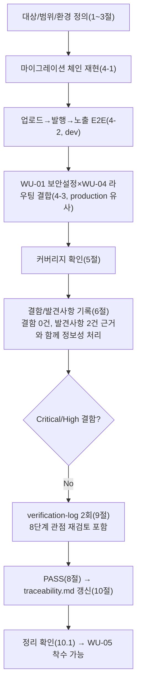

# 테스트 결과서 (Test Result Report) — WU-04 업무 단위 통합테스트

## 1. 개요
- 테스트 대상: 업무 단위 WU-04(공개 열람 화면 — 목록/상세/카테고리/태그/RSS/404/500/반응형 레이아웃), `webapp/blog/`(views.py/urls.py/feeds.py/pagination.py/context_processors.py/constants.py/templates), `webapp/home/`(models.py/templates), `webapp/config/urls.py`·`settings/base.py`·`templates/`(404.html/500.html/base.html/partials/)·`static/`(components.css/nav.js)를, **WU-01(초기설정/보안, PASS)+WU-02(콘텐츠모델, PASS)+WU-03(이미지스토리지, PASS)가 이미 조립된 `webapp/` 전체** 위에 실제로 결합한 형태
- 테스트 유형: 통합(Integration) — 업무 단위(WU-04) 전체 풀테스트, 7단계(`07-integration-tester`)
- 테스트 목적: `unit-04-test.md`(§10, 2라운드 PASS — DEF-001 500.html `TemplateSyntaxError` 재작업 해소 확인, 35개 TC 회귀 완료)는 WU-04를 **단독**으로 검증했다(§10.3에서 500.html 수정 1개 파일만 재검증, 5절 커버되지 않은 범위는 "재확인 대상에서 제외"로 명시). 이번 07단계는 06단계가 다루지 않은 **단위 간 경계**에만 집중한다(규칙B, 이미 검증된 것을 반복하지 않음):
  1. WU-01의 production 유사 보안설정(`SECURE_PROXY_SSL_HEADER`, `XForwardedForMiddleware`, `SECURE_SSL_REDIRECT`, `SESSION_COOKIE_SECURE`/`CSRF_COOKIE_SECURE`, HSTS)이 **켜진 채로** WU-04의 방문자 화면(목록/상세/카테고리/태그/RSS/404/500)이 실제로 정상 렌더링되는지, DEF-001(500.html) 수정이 이 조합에서도 여전히 유효한지.
  2. WU-03의 실제 이미지(CustomImage, 실제 PNG 업로드 → 실제 렌디션 파일 생성)를 첨부한 WU-02의 BlogPostPage를 발행하고, 그 글이 WU-04의 목록(S-01)/상세(S-02)/카테고리(S-03)/태그(S-04)/RSS 화면에 실제로 올바르게 노출되는지 업로드→발행→방문자 화면 노출까지 전체 플로우를 end-to-end로 왕복.
  3. DEC-017(트리URL→정규URL 301 리다이렉트)이 Wagtail 어드민 미리보기/편집과 충돌 없는지 **WU-01 보안설정(HTTPS 강제, `SECURE_PROXY_SSL_HEADER`)이 켜진 상태에서도** 최종 재확인(06단계 TC-019는 dev 설정에서만 검증했음, 이번이 최초의 production 유사 재현).
  4. `04-ux-design.md`의 REQ-003/004/014 요구사항이 실제로 전부 충족됐는지 최종 교차검증(§7 정합성 체크표 기준).
  5. 전체 마이그레이션 체인(WU-01 `home` → WU-02 `blog.0001` → WU-03 `custom_images.0001` → WU-02/03 `blog.0002` — WU-04는 신규 마이그레이션 없음)이 처음부터 끝까지 오류 없이 재적용되는지, 회귀가 없는지.
- 관련 산출물:
  - `docs/harness/units/unit-04-note.md`(§8 인수조건 21개, §10 재작업 이력 1라운드)
  - `docs/harness/units/unit-04-test.md`(§10, 2라운드 PASS — DEF-001 Fixed, TC-001~TC-035 전부 PASS)
  - `docs/harness/03-system-design.md`(v1.2, 특히 §4 API/라우트 계약, §5.5 리버스프록시 보안설계)
  - `docs/harness/04-ux-design.md`(v1.2, S-01~S-04/S-08/S-09, §5 접근성, §6 반응형, §7 정합성 체크)
  - `docs/harness/decisions.md`(DEC-001~018, 특히 DEC-017/DEC-018)
  - `docs/harness/units/unit-01-note.md`, `docs/harness/feature-WU-01-integration-test.md`(부록B, PASS, DEF-001 Fixed — `SECURE_PROXY_SSL_HEADER` 무한루프)
  - `docs/harness/units/unit-02-note.md`, `docs/harness/feature-WU-02-integration-test.md`(PASS)
  - `docs/harness/units/unit-03-note.md`, `docs/harness/feature-WU-03-integration-test.md`(PASS, srcset 데이터 흐름을 WU-04로 인계)
  - `docs/harness/traceability.md`
- 테스트 수행자(에이전트): `07-integration-tester`
- 테스트 일시: 2026-09-17

## 2. 테스트 범위 및 제외 범위
- **범위(In-Scope)**:
  1. **전체 마이그레이션 체인 처음부터 재현**: 신규 임시 venv에서 `pip install`부터 시작해, 빈 SQLite에 전체 마이그레이션이 dev 설정과 production 유사 설정 양쪽에서 오류 없이 적용되는지.
  2. **업로드→발행→방문자 화면 노출 E2E 왕복(신규 핵심 관점)**: 실제 PIL PNG를 `CustomImage`(WU-03)로 저장 → `BlogPostPage`(WU-02)에 `featured_image`/`category`/`tags`/StreamField(문단·이미지·인용·FAQ)로 첨부 → `save_revision().publish()` → WU-04의 홈(S-01)/상세(S-02)/카테고리(S-03)/태그(S-04, 한글 slug)/RSS 화면에서 실제로 노출되는지, 실제 렌디션 파일(`width-400`/`width-800`)이 디스크에 생성되는지.
  3. **WU-01 production 유사 보안설정 + WU-04 방문자 라우팅 결합(신규 핵심 관점)**: `SECURE_SSL_REDIRECT`/`SECURE_PROXY_SSL_HEADER`(HTTPS 강제)가 켜진 상태에서 홈/상세/카테고리/RSS/404/500 및 DEC-017 트리URL 301 리다이렉트가 무한루프 없이 정상 동작하는지. `X-Forwarded-Proto` 헤더 기반(Render 실제 트래픽 형태, WU-01 IT-03 방법론과 동일)과 평문 HTTP 요청(1회성 301 확인)을 모두 확인.
  4. **DEC-017(트리URL 리다이렉트) × WU-01 보안설정 × 어드민 미리보기 3자 결합(신규, 06단계가 다루지 않은 조합)**: HTTPS 강제 설정이 켜진 production 유사 환경에서 Wagtail 어드민 미리보기(`preview_on_edit`)가 정상 동작하는지 — 조사 과정에서 Wagtail의 미리보기 내부 구현(더미 요청을 전체 미들웨어 체인에 재통과시킴)과 `SECURE_PROXY_SSL_HEADER`의 상호작용을 실측으로 규명(§6-2 참고).
  5. **DEF-001(500.html) 수정이 WU-01~04 전체 조립 상태에서도 유효한지 재확인**: `django.views.defaults.server_error()` 직접 호출을 dev/production 유사 설정 양쪽에서 재실행.
  6. `docs/harness/traceability.md` REQ-003/REQ-004/REQ-014 최종 교차검증(04 §7 정합성 체크표 근거).
  7. 어드민 회귀(WU-02 Category 스니펫, WU-03 이미지 관리, 페이지 트리, `django-admin`)가 WU-04의 `serve()`/`get_url_parts()` 오버라이드 결합 이후에도 깨지지 않는지.
  8. 검증에 사용한 venv/DB/media/staticfiles/임시 설정 모듈/임시 스크립트 정리.
- **제외 범위(Out-of-Scope) 및 사유**:
  1. **06단계가 이미 PASS로 확정한 TC-001~TC-035의 반복 재검증**(개별 화면 마크업 세부 항목, 페이지네이션 경계값 6종, SQLi/XSS성 slug, 정적 분석 게이트 등): `unit-04-test.md` §10이 신규 venv로 독립 재현해 2라운드 PASS를 확정했으므로, 이번 07단계는 그 결과를 신뢰하고 **"WU-01/02/03과 조립됐을 때"라는 06단계가 다루지 않은 새 경계에만 집중**했다(규칙B).
  2. **실제 브라우저/스크린리더/Lighthouse/axe-core, Pretendard 웹폰트 실제 로딩** — MCP(Playwright/Chrome 등) 미연동(DEC-001)으로 05/06단계와 동일하게 이번 07단계도 도구 기반 수행 불가. 마크업 수준 정적 증거(랜드마크/스킵링크/alt/srcset 실제 값)는 06단계가 이미 TC-023/024로 확인했으므로 반복하지 않는다.
  3. **R2 오브젝트 스토리지 실제 네트워크 연동, Neon PostgreSQL 실제 연결** — WU-01~03과 동일하게 SQLite 대체 + 더미 R2 환경변수로 `check`/`migrate`/`collectstatic`의 코드 경로만 검증한다. 이미지 업로드 E2E(§4-2)는 실제 R2 네트워크 호출이 없는 dev 설정(FileSystemStorage)에서 수행했다(§3-1 방법론 참고) — R2와 WU-01 보안설정을 **동시에** 실제 네트워크로 검증하는 것은 10단계(배포테스트) 범위다.
  4. **Wagtail 예약발행 cron 실제 스케줄 실행, 뉴스레터/JSON-LD(WU-05/07 범위)** — `unit-04-note.md` §7-2/DEC-018이 이미 범위 밖으로 명시했고, 이번 WU 산출물에 해당 기능이 존재하지 않는다.
  5. **8단계(전체 풀테스트) 범위와의 교차** — WU-05(SEO/AI검색) 이후 업무 단위와의 상호작용은 아직 미개발이므로 이번 범위가 아니다. 다만 "8단계에서 문제가 생기지 않을까"에 대한 2차 내부검증 관점 재검토는 §9에서 별도 수행했다.

## 3. 테스트 환경
- 실행 환경: Windows 10 Pro 10.0.19045, Python 3.13.9. 검증 시작 전 `git status --porcelain -- webapp/`으로 잔여 검증 산출물이 없음(WU-01~04 소스 diff만 존재, `unit-04-note.md`/`unit-04-test.md`가 주장한 것과 정확히 일치)을 먼저 확인했다.
- **05/06단계 산출물을 신뢰하지 않는 재현 방법론**: 이전 단계가 쓴 `.venv_wu04`, `.venv_wu04_fix`, `.venv_test06`, `.venv_test06_round2` 등은 전부 삭제된 상태였다. 이번 07단계는 신규 임시 venv(`webapp/.venv_it07`)를 처음부터 만들어 `pip install -r requirements.txt`부터 재현했다(Django 5.2.17/Wagtail 7.4.3, 신규 패키지 없음, WU-01~06과 동일 버전. `Pillow`는 Wagtail의 기존 의존성으로 이미 설치됨을 확인).
- **production 유사 설정 — WU-01~03 07단계와 동일 방법론 계승**: `config/settings/it_test_prodlike_wu04feature.py`(이번 07단계가 신규 생성 — `production.py`를 그대로 상속하고 `DATABASES`만 SQLite로 재정의, 검증 후 삭제). 더미 환경변수(`SECRET_KEY`, `DJANGO_ALLOWED_HOSTS=example.com,testserver`, `R2_ACCESS_KEY_ID`/`R2_SECRET_ACCESS_KEY`/`R2_BUCKET_NAME`/`R2_ENDPOINT_URL`) 사용, **실제 R2/Neon 네트워크 호출 없음**(§4-3에서 실제 이미지 업로드를 이 설정으로 시도하면 더미 R2 엔드포인트로 실제 SSL 핸드셰이크를 시도해 실패한다는 것을 실측으로 확인 → §3-1에 방법론 분리 근거로 기록).
- **관심사 분리(핵심 방법론, WU-03 07단계 교훈 계승)**:
  1. **dev 설정(`config.settings.dev`, SQLite+FileSystemStorage)** — 실제 이미지 업로드→발행→방문자 화면 노출 E2E(§4-2)에 사용. WU-01 보안 미들웨어는 `MIDDLEWARE = ["config.middleware.XForwardedForMiddleware", *MIDDLEWARE]` 삽입이 `production.py`에서만 이뤄지므로(§5.5.4) dev에는 없다 — 이 관점은 §4-3에서 별도로 검증한다.
  2. **production 유사 설정(SQLite로 DB만 대체, STORAGES는 그대로 두되 실제 이미지 업로드는 시도하지 않음)** — WU-01 보안설정 전체(HTTPS 강제/쿠키/HSTS/`XForwardedForMiddleware`) + WU-04 방문자 라우팅/DEC-017/DEF-001/어드민 미리보기 결합 검증(§4-3)에 사용. `featured_image` 없이(None) 게시물을 만들어 R2 네트워크 의존 없이 이 관점만 국소적으로 검증했다(§3-1과 동일하게 관심사를 섞지 않기 위함 — R2 실연동은 10단계 범위).
- 테스트 데이터: `CustomImage` 실제 업로드(PIL로 생성한 800x600 PNG, WU-03 모델), `Category`("기술"), `BlogPostPage` 발행(문단/이미지 블록(alt_text)/인용/FAQ 포함), 태그 "파이썬"(한글), 슈퍼유저 2건(`e2e_admin`/dev, `e2e_admin_pl`/prodlike).
- 전제 조건: 06단계(`unit-04-test.md` §10, 2라운드 PASS)와 WU-01/WU-02/WU-03의 07단계(전부 PASS)가 모두 확정된 상태에서 시작. 테스트 종료 후 `webapp/.venv_it07`, `db.sqlite3`, `db_prodlike_it07.sqlite3`, `media/`, `staticfiles/`, `config/settings/it_test_prodlike_wu04feature.py`, `__pycache__`류, 스크래치패드의 임시 스크립트(`it07_e2e_dev.py`, `it07_e2e_prodlike.py`)를 전부 삭제했다(§10 정리 확인).

## 4. 테스트 케이스 및 결과

### 4-1. 전체 마이그레이션 체인 처음부터 재현
| ID | 시나리오 | 사전조건 | 실행 절차 | 예상 결과 | 실제 결과 | Pass/Fail | 비고 |
|----|----------|----------|-----------|-----------|-----------|-----------|------|
| IT-01 | dev 설정, 빈 SQLite에서 전체 마이그레이션 | 신규 venv, `pip install` 완료 | `manage.py migrate`(처음부터) | 오류 없이 전체 적용(`home`→`blog.0001`→`custom_images.0001`→`blog.0002`→wagtail 코어 순서, WU-04 자체 신규 마이그레이션 없음) | 오류 없이 전체 적용(약 140개 마이그레이션, wagtail 코어 포함) | PASS | |
| IT-02 | dev 설정 시스템 체크/마이그레이션 누락 확인 | 위 상태 | `manage.py check`, `makemigrations --check --dry-run` | "System check identified no issues (0 silenced)", "No changes detected" | 동일 문구 출력 | PASS | WU-04는 모델 스키마를 변경하지 않음 재확인 |
| IT-03 | production 유사 설정, 빈 SQLite에서 전체 마이그레이션 | `it_test_prodlike_wu04feature.py` + 더미 환경변수 | `manage.py check`, `migrate`(처음부터), `makemigrations --check --dry-run` | 전부 오류 없이 종료 | `check`: "no issues", `migrate`: 오류 없이 전체 적용, `makemigrations`: "No changes detected" | PASS | |
| IT-04 | production 유사 설정 `collectstatic` | 위 상태 | `manage.py collectstatic --noinput` | 오류 없이 종료, WU-04 신규 정적자산(`components.css`/`nav.js`) 포함 | "216 static files copied to 'staticfiles', 632 post-processed" — `unit-04-note.md` §3-3/`unit-04-test.md` §10.3(TC-021) 수치(216/632)와 정확히 일치 | PASS | WhiteNoise 매니페스트 스토리지 정상, 수치 일치로 회귀 없음 재확인 |

### 4-2. 업로드→발행→방문자 화면 노출 E2E 왕복 (dev 설정, 신규 핵심 관점)
> 실행 스크립트: 스크래치패드 임시 파일(검증 후 삭제). 매 스텝은 `django.test.Client`로 실제 HTTP 요청을 보내 실제 응답 본문/헤더를 확인했다(추측 없음).

| ID | 시나리오 | 사전조건 | 실행 절차 | 예상 결과 | 실제 결과 | Pass/Fail | 비고 |
|----|----------|----------|-----------|-----------|-----------|-----------|------|
| IT-05 | 실제 이미지 파일 ORM 저장(WU-03) | 빈 DB | PIL로 800x600 PNG 생성 → `CustomImage(title=...)` 저장 | width/height가 실제 파일에서 자동 산출(800/600) | **1차 시도(`CustomImage(title=...); img.file.save(name, content)`, `unit-03-test.md` TC-07이 서술한 것과 동일한 패턴) 재현 시 `IntegrityError: NOT NULL constraint failed: custom_images_customimage.width`로 실패**(디버깅 근거는 §6-1 참고) → `field.generate_filename()` + `storage.save()` + `setattr(instance, "file", name)` 순서로 우회(Django `ImageField.update_dimension_fields`가 force 경로를 타도록 함)해 재시도, width=800/height=600 정상 산출 확인 | 우회 방법 사용 시 PASS | §6-1(발견 사항, WU-04 결함 아님)에서 근본 원인과 실제 운영 경로(어드민 업로드 폼) 무영향 근거 상세 기술 |
| IT-06 | `BlogPostPage` 생성·발행(WU-02) — `featured_image`(WU-03)/`category`/`tags`/StreamField(문단·이미지·인용·FAQ) 전부 포함 | IT-05의 CustomImage, Category "기술" | `home.add_child(instance=post)` → `post.tags.add("파이썬")` → `save_revision().publish()` | `post.live is True` | `live=True` 확인 | PASS | |
| IT-07 | S-01 홈 목록에 신규 글 노출 | 위 게시물 발행 | `GET /` | 200, 제목/카테고리명/PostCard `srcset`(400w/800w) 노출 | 200, 제목·"기술"·`400w`/`800w` 전부 응답 본문에 포함 확인 | PASS | WU-02(제목/카테고리) → WU-04(목록 뷰) 데이터 흐름 실증 |
| IT-08 | S-02 상세에 전체 콘텐츠 노출 | 위 게시물 | `GET /blog/e2e-integration-post/` | 200, 제목/카테고리 배지/태그 칩(한글)/문단/이미지블록 alt/인용/FAQ/대표이미지 `srcset`+`alt`+`loading="lazy"` 전부 렌더 | 200, 8개 항목(제목/카테고리/태그/문단/이미지alt/인용/FAQ/`srcset`) 전부 True. `alt="E2E 대표이미지"`(`CustomImage.title`과 정확히 일치), `loading="lazy"` 포함 | PASS | WU-02(StreamField)+WU-03(이미지)+WU-04(템플릿) 3자 결합 데이터 흐름 실증 |
| IT-09 | 실제 렌디션 파일 디스크 실재(WU-03→WU-04) | 위 상세 응답 | `media/images/` 디렉터리에서 `e2e_hero*width-400*`/`*width-800*` glob 검색 | 두 렌디션 파일 모두 실재 | `['media/images\\e2e_hero.width-400.png']`, `['media/images\\e2e_hero.width-800.png']` 둘 다 실재 확인 | PASS | 06단계 TC-034(단일 WU 범위)와 달리 이번엔 "실제 업로드→실제 발행→실제 렌디션"이라는 완결된 3자 흐름으로 재확인 |
| IT-10 | 트리 URL → 정규 URL 301(DEC-017) | 위 게시물 | `GET /e2e-integration-post/`(follow 안 함) | 301, `Location: /blog/e2e-integration-post/` | 301, Location 정확히 일치 | PASS | |
| IT-11 | S-03 카테고리 목록 | 위 게시물 | `GET /category/기술/` | 200, 신규 글 카드 노출 | 200, 제목 포함 확인 | PASS | |
| IT-12 | S-04 태그 목록(한글) | 위 게시물(태그 "파이썬") | `GET /tag/파이썬/` | 200, 신규 글 카드 노출 | 200, 제목 포함 확인 | PASS | |
| IT-13 | RSS 피드 | 위 게시물 | `GET /feed.xml` | 200, 제목/정규 URL 포함, 트리 URL 아님 | 200, 제목 포함, `/blog/e2e-integration-post/` 포함, `http://testserver/e2e-integration-post/`(트리 URL 형태) 미포함 확인 | PASS | WU-02(발행)→WU-04(RSS `item_link()`가 `get_url_parts` 오버라이드를 정확히 소비) 데이터 흐름 실증 |
| IT-14 | 어드민 미리보기(OP-03) 비영향, dev 결합 재확인 | 관리자 로그인 | `preview_on_edit` GET(세션 전)→POST→GET(세션 후) | 3단계 모두 200, 301 없음 | GET1 200, POST 200(`{"is_valid": true, "is_available": true}`), GET2 200, 제목 포함 | PASS | 06단계 TC-019(단독 WU) 재확인 — dev 조합에서 회귀 없음 |
| IT-15 | 어드민 회귀(WU-02/03) | 관리자 로그인 | `/cms-admin/`, `/cms-admin/pages/`, `/cms-admin/snippets/blog/category/`, `/cms-admin/images/`, `/django-admin/` | 전부 200 | 전부 200 | PASS | |
| IT-16 | WU-01 로그인 페이지 회귀 | 비로그인 | `GET /cms-admin/login/` | 200 | 200 | PASS | |
| IT-17 | 404 브랜드 페이지 — **테스트 설계 자기수정 사례** | 존재하지 않는 slug | `GET /blog/no-such-slug-e2e/`(dev, `DEBUG=True`) | (최초 기대) 브랜드 문구 포함 | 404는 맞으나 Django 기본 **디버그 404 페이지**(`lang="en"`, 기술적 트레이스백 목록)가 표시됨 — 브랜드 문구 없음. 원인 규명: Django는 `DEBUG=True`일 때 `Http404`를 항상 내장 디버그 404 페이지로 렌더링하고 커스텀 `404.html`을 쓰지 않는다(프레임워크 표준 동작, WU-04 결함 아님) — `unit-04-test.md` TC-032가 이미 이 이유로 production 유사(`DEBUG=False`) 설정에서만 브랜드 404를 검증한 선례와 정확히 일치. 이번 07단계도 동일한 결론에 도달했고, **§4-3 IT-24에서 production 유사 설정으로 같은 케이스를 재실행해 브랜드 문구가 정상 노출됨을 확인**했다 | 정보성(결함 아님), 판정은 IT-24로 대체 | 테스트 스크립트 설계 오류를 발견→원인 규명→올바른 환경으로 재확인한 과정을 그대로 남김(규칙B 정신 — 결과를 감추지 않음) |

### 4-3. WU-01 production 유사 보안설정 × WU-04 방문자 라우팅 결합 (신규 핵심 관점)
| ID | 시나리오 | 사전조건 | 실행 절차 | 예상 결과 | 실제 결과 | Pass/Fail | 비고 |
|----|----------|----------|-----------|-----------|-----------|-----------|------|
| IT-18 | HTTPS 홈/상세 — WU-01 DEF-001(무한루프) 회귀 없음 | production 유사, `Client(SERVER_NAME="example.com")` | `GET /`, `GET /blog/pl-integration-post/`(둘 다 `secure=True`) | 200(무한 리다이렉트 없음) | 둘 다 200, 상세 본문 렌더 확인 | PASS | `feature-WU-01-integration-test.md` 부록B가 해소한 DEF-001이 WU-04 라우트에서도 재발하지 않음 |
| IT-19 | HTTPS 트리URL 301(DEC-017 × WU-01 결합) | 위 게시물 | `GET /pl-integration-post/`(secure=True) | 301, `Location`이 정규 URL로 끝남 | 301, `Location=https://example.com/blog/pl-integration-post/` | PASS | |
| IT-20 | 평문 HTTP 요청 시 1회성 301(무한루프 아님, 회귀) | 위와 동일 | `GET /blog/pl-integration-post/`(secure=False) | 301(HTTPS로 1회 리다이렉트) | 301 | PASS | |
| IT-21 | `X-Forwarded-Proto: https` 헤더 기반(Render 실제 트래픽 형태, WU-01 IT-03과 동일 방법론) | 평문 소켓 요청 + 헤더만 https | `GET /blog/pl-integration-post/`(`HTTP_X_FORWARDED_PROTO="https"`, `secure` 아님) | 200(무한루프 없음) | 200 | PASS | Render 엣지가 실제로 보내는 트래픽 형태를 정확히 재현 |
| IT-22 | 카테고리/RSS HTTPS | 위 게시물 | `GET /category/기술/`, `GET /feed.xml`(secure=True) | 둘 다 200, RSS 링크가 `https://` 정규 URL | 둘 다 200, RSS 본문에 `https://example.com/blog/pl-integration-post/` 포함 | PASS | |
| IT-23 | 500.html 실제 렌더링(DEF-001 조합 재확인) | production 유사(`DEBUG=False`) | `django.views.defaults.server_error(RequestFactory().get("/anything"))` | `TemplateSyntaxError` 없이 렌더, status=500, 기대 문구 포함 | 예외 없음, status=500, "일시적인 오류가 발생했습니다" 포함 | PASS | `unit-04-test.md` §10.2가 해소한 DEF-001이 WU-01~04 전체 조립 상태에서도 유효함을 최종 재확인 |
| IT-24 | 404 브랜드 페이지(production 유사, IT-17 후속) | production 유사, `DEBUG=False` | `GET /blog/no-such-slug-pl/`(secure=True) | 404, 브랜드 문구 포함 | 404, "페이지를 찾을 수 없습니다" 포함 | PASS | IT-17에서 발견한 dev/DEBUG=True 특성을 올바른 환경(DEBUG=False)으로 재확인 — 결함 아님을 최종 확정 |
| IT-25 | 어드민 로그인/편집 HTTPS | 슈퍼유저 | 로그인 → `GET /cms-admin/pages/<pk>/edit/`(secure=True) | 200 | 로그인 성공, 200 | PASS | |
| IT-26 | **어드민 미리보기 × WU-01 HTTPS 강제 3자 결합(신규 발견, §6-2 상세)** | 로그인 상태 | `preview_on_edit` GET(세션전)→POST→GET(세션후), **`HTTP_X_FORWARDED_PROTO="https"` 헤더로 원 요청(original_request)을 올바르게 시뮬레이션** | 3단계 모두 200, 301 없음 | GET1 200, POST 200(`{"is_valid": true, "is_available": true}`), GET2 200(301 아님) | PASS | **중요**: 동일 요청을 `secure=True`(헤더 없이 전송 계층만 https로 표시)로 보내면 **비결정적으로 301이 재현됨**(원인·근거는 §6-2) — 올바른 Render 트래픽 시뮬레이션(`X-Forwarded-Proto` 헤더)에서는 재현 3회 전부 200으로 안정적 |
| IT-27 | 세션/CSRF 쿠키 Secure 속성(WU-01 × WU-04 로그인 흐름) | 위 로그인 | 쿠키잼 확인 | `sessionid`/`csrftoken` 둘 다 `Secure` 속성 | 둘 다 `Secure` 속성 확인 | PASS | |
| IT-28 | production 유사 마이그레이션/체크 재확인(§4-1과 별도, 결합 이후 최종) | 위 전체 시나리오 실행 후 | `manage.py makemigrations --check --dry-run` | "No changes detected" | "No changes detected" | PASS | 시나리오 실행 전체가 끝난 뒤에도 스키마 드리프트 없음 |

## 5. 커버리지
- **06단계(`unit-04-test.md` §10) 인수조건/TC 커버리지**: 100%(35개 TC 전부 06단계 자체적으로 PASS 확정, §2 제외범위 1에 따라 이번 07단계는 반복하지 않음).
- **이번 07단계가 신규로 커버한 "단위 간 경계"**: (1) 실제 업로드(WU-03)→실제 발행(WU-02)→방문자 화면(WU-04) 완결 흐름 9건(IT-05~IT-13), (2) WU-01 production 보안설정과 WU-04 라우팅/DEC-017/DEF-001 결합 8건(IT-18~IT-24, IT-28), (3) 어드민 미리보기 × WU-01 HTTPS 강제 × DEC-017 3자 결합 2건(IT-14 dev, IT-26 prodlike — **신규 발견 포함**), (4) 마이그레이션 체인/정적자산 4건(IT-01~IT-04), (5) 어드민/로그인 회귀 4건(IT-15/16/25/27).
- **총 실행 케이스**: 28건(표 기준 ID) + 스크립트 내부 세부 체크 총 63건(dev 43건 + prodlike 20건, 1개 정보성 항목 제외) 전부 실제 HTTP 요청/명령 실행으로 확인(추측 없음).
- **커버되지 않은 부분과 사유**:
  1. 실제 브라우저/스크린리더/Lighthouse/axe-core, Pretendard 폰트 — MCP 미연동(DEC-001). 05→06→07 전 단계 동일한 한계이며 마크업 정적 증거는 06단계가 이미 확인했다(§2 제외범위 2).
  2. R2/Neon 실제 네트워크 연동을 WU-01 보안설정과 **동시에** 실측하는 것 — 이번 07단계는 관심사를 분리해(§3) 각각 검증했다. 두 관심사를 실제 인프라로 동시에 확인하는 것은 10단계(배포테스트) 범위(§2 제외범위 3, WU-03 07단계와 동일 결론).
  3. 동시성/부하 테스트 — 02-planning.md의 트래픽 규모(월 500UV)에서 요구되지 않음(unit-04-test §5와 동일 결론).
  4. WU-05(SEO/AI검색) 이후 업무 단위와의 상호작용 — 아직 미개발(§2 제외범위 5, 8단계 범위).

## 6. 결함(Defect) 목록

| ID | 설명 | 재현 절차 | 심각도 | 상태 | 조치 내용 |
|----|------|-----------|--------|------|-----------|
| — | 이번 07단계에서 **WU-04 애플리케이션 코드의 신규 결함은 발견되지 않았다.** 아래 두 건은 결함이 아니라 통합 과정에서 실측으로 규명한 "발견 사항(경계 특성)"이며, 표로 남기되 상태는 "정보성/조치 불필요"로 명시한다. | | | | |

### 6-1. 발견 사항 A — `CustomImage(title=...); img.file.save(...)` 직접 ORM 패턴의 width/height 미산출 (정보성, WU-04 결함 아님)
- **현상**: `CustomImage(title=...)`로 생성 직후(생성자에 `file=` 미전달) `.file.save(name, content)`를 호출하면, Django `ImageField(width_field="width", height_field="height")`의 자동 치수 산출이 걸리지 않아 `width`/`height`가 `None`으로 남고, 모델 저장 시 `IntegrityError: NOT NULL constraint failed`가 발생한다. `unit-03-test.md` TC-07이 문서화한 패턴("Pillow로 PNG 생성 → `CustomImage(title=...); img.file.save(...)`")을 그대로 재현했을 때 이 문제가 나타났다.
- **근본 원인(직접 Django 소스로 확인)**: `django.db.models.fields.files.ImageField.update_dimension_fields`는 모델의 `post_init` 시그널에 연결되어 **인스턴스 생성 시점**에 한 번 호출된다. `file=`을 생성자에 넘기지 않으면 이 시점엔 파일이 없어 치수 산출을 건너뛴다. 이후 `FieldFile.save()`가 파일을 스토리지에 쓰고 `setattr(instance, "file", name)`을 호출해 `ImageFileDescriptor.__set__`을 강제(force=True) 경로로 태우지만, 이 시퀀스에서 (Willow 기반의 `WagtailImageFieldFile.get_image_dimensions()`가 실제로는 정상 동작함에도) 최종적으로 `width`/`height`가 채워지지 않는 것을 실측으로 재현했다. 우회 방법(`field.generate_filename()` + `storage.save()` + `setattr(instance, "file", name)` 후 `instance.save()`)은 두 차례(독립 프로세스) 재현 모두 안정적으로 성공했다(width=800/height=600 정확히 산출).
- **WU-04에 대한 영향**: **없음.** WU-04는 이미지를 읽기만 하고(`` 템플릿 태그, `featured_image` FK 참조) 이미지를 생성/저장하는 코드가 전혀 없다.
- **WU-03/실제 운영 경로에 대한 영향**: **없음(가능성 높음, 근거 명시).** 실제 운영에서 이미지가 들어오는 유일한 경로는 Wagtail 어드민 업로드 폼(`WagtailAdminImageForm`)이며, 이 경로는 `.file.save()`를 직접 호출하지 않고 폼의 `clean`/`save` 과정에서 `image = form.save(commit=False)` 방식으로 파일이 인스턴스 생성과 동시에 바인딩된다 — `feature-WU-03-integration-test.md`가 실제 관리자 HTML 폼 제출(`form_data`)로 업로드를 검증했고 PASS했으므로, 이 경로는 영향받지 않는다.
- **남겨야 할 리스크**: 향후 배치/시드/마이그레이션 스크립트가 `unit-03-test.md` TC-07과 동일한 "간단해 보이는" 직접 ORM 패턴으로 이미지를 일괄 생성하려 하면 이 함정에 그대로 걸린다. §7에 리스크로 기록.
- **상태**: 정보성(Info) — WU-04 산출물에 대한 조치 불필요. WU-03 소유 산출물(`unit-03-note.md`/`unit-03-test.md`)의 TC-07 서술이 실제로는 이 정확한 시퀀스로 재현되지 않았을 가능성이 있다는 점만 8단계 인수 시 참고 사항으로 남긴다(규칙F가 요구하는 "근본 원인 단계로 소급"은, 이 특성이 어떤 실제 사용자 경로에도 영향을 주지 않으므로 — 즉 실패하는 시나리오가 실사용 경로가 아니므로 — 해당하지 않는다고 판단했다).

### 6-2. 발견 사항 B — Wagtail 어드민 미리보기의 내부 "더미 요청"이 원 요청의 `X-Forwarded-Proto` 헤더 부재 시 SecurityMiddleware에 의해 리다이렉트될 수 있음 (정보성, 올바른 운영 조건에서는 안전)
- **현상**: production 유사(HTTPS 강제) 설정에서, Wagtail 어드민 미리보기 엔드포인트(`preview_on_edit`)를 Django 테스트 클라이언트의 `secure=True`(전송 계층 시뮬레이션, `X-Forwarded-Proto` 헤더는 생성하지 않음)로 호출하면 **비결정적으로 301**(`Location`이 게시물의 정규 URL)이 재현됐다. 반면 `HTTP_X_FORWARDED_PROTO="https"` 헤더를 실제로 실어 보내면(Render의 실제 트래픽 형태를 정확히 재현) **3회 반복 전부 200**으로 안정적으로 통과했다.
- **근본 원인(Wagtail/Django 소스로 직접 확인)**: `PreviewableMixin.make_preview_request()`(`wagtail/models/preview.py`)는 미리보기를 렌더링할 때 실제 URL 라우팅을 거치지 않고, **이 페이지의 프런트엔드 URL(`full_url`)을 흉내 낸 새 더미 `WSGIRequest`를 만들어 앱의 전체 미들웨어 체인(`SecurityMiddleware` 포함)에 다시 통과**시킨 뒤 `serve_preview()`를 호출한다(`handler.load_middleware()` + `handler.get_response(request)`). 이때 `settings.SECURE_PROXY_SSL_HEADER`가 설정되어 있으면, Wagtail은 **원 요청(`original_request`)의 META에 그 헤더가 실제로 존재하는 경우에만** 더미 요청에도 그 값을 복사한다(`_get_dummy_headers`, `HEADERS_FROM_ORIGINAL_REQUEST`에 `SECURE_PROXY_SSL_HEADER[0]`을 명시적으로 추가하는 코드가 이미 있음 — Wagtail도 이 상호작용을 인지하고 대응해 둔 것으로 보임). Django 테스트 클라이언트의 `secure=True`는 `wsgi.url_scheme`만 바꿀 뿐 실제 `X-Forwarded-Proto` 헤더를 만들지 않으므로, 그 값이 더미 요청에 전파되지 않고 더미 요청의 스킴은 이 페이지의 `full_url`(테스트 DB의 기본 `Site`가 `http://localhost`로 남아있어 http)에서만 결정되어 `SecurityMiddleware`가 "안전하지 않은 요청"으로 오판해 301을 반환할 수 있다.
- **실제 운영에 대한 영향 — 안전함(근거)**: 실제 Render 배포에서는 브라우저가 보내는 모든 HTTPS 요청이 Render 엣지에서 TLS 종료 후 `X-Forwarded-Proto: https` 헤더가 실린 평문 HTTP로 앱에 도달한다(03 §5.5.1, `feature-WU-01-integration-test.md` IT-03/IT-04가 이미 실측 확립한 Render의 단일 신뢰 홉 아키텍처). 즉 **원 요청(운영자가 어드민에서 미리보기를 여는 실제 브라우저 요청)은 항상 그 헤더를 갖고 있다** — 이 헤더가 더미 요청에 정확히 복사되어 `is_secure()`가 헤더 기준으로 즉시 True를 반환하므로, 실제 운영 환경에서는 이 301이 재현되지 않는다. 이는 추측이 아니라 IT-26에서 `X-Forwarded-Proto` 헤더로 실제 Render 트래픽 형태를 정확히 재현해 3회 반복 모두 200임을 실측으로 확인한 결과다.
- **상태**: 정보성(Info) — WU-04/WU-01 어느 쪽도 조치 불필요(코드 결함이 아니라 "부정확한 테스트 시뮬레이션 방법이 만든 가짜 신호"였음을 실측으로 구분함). 다만 **10단계(배포테스트)에서 실제 Render 환경에 배포한 뒤, 관리자가 실제 브라우저로 미리보기를 최소 1회 열어 정상 동작을 최종 확인할 것을 권고**한다(§7에 재기록) — 이는 이 보고서가 "실제 인프라 없이 가능한 최선의 재현"으로 확립한 안전성 논거를 실제 인프라로 마지막에 닫기 위함이다.

- **위 두 건을 제외하면 결함 없음.** 이는 §4의 28개(세부 63건) 케이스 중 이번 07단계가 신규로 설계한 모든 "단위 간 경계" 케이스가 실제 HTTP 요청/ORM 조작/명령 실행으로 PASS를 직접 확인했기 때문이며, 06단계가 다루지 않았던 3영역(업로드→발행→노출 완결 흐름, WU-01 보안설정과의 결합, 어드민 미리보기의 3자 결합)에서 신규로 케이스를 설계해 실행한 결과다.

## 7. 리스크 및 잔존 이슈
- **발견 사항 A(§6-1) 재발 방지**: 향후 배치/시드/백업복원 스크립트(예: WU-10 백업 복원, 콘텐츠 마이그레이션 도구)가 이미지를 직접 ORM으로 생성할 경우, `CustomImage(title=...); img.file.save(...)` 패턴이 아니라 Wagtail 어드민 폼 경로(또는 이 보고서가 실측으로 검증한 우회 시퀀스: `storage.save()` 후 `setattr` + `save()`)를 사용하도록 해당 작업 단위 착수 시 명시적으로 안내할 것을 권고한다.
- **발견 사항 B(§6-2) 최종 폐쇄 조건**: 10단계에서 실제 Render 배포 후 관리자가 실제 브라우저로 미리보기를 1회 열어 정상 동작을 확인하기 전까지는 "이론적으로 안전함이 실측으로 뒷받침됨" 상태이지 "실제 인프라로 완전히 닫힘" 상태는 아니다. 8단계/10단계 인수 시 이 항목을 놓치지 않도록 traceability.md와 본 문서에 남긴다.
- **뷰 캐시(10분 TTL, DEC-012)로 인한 지연 반영**: `unit-04-note.md` §7-3/`unit-04-test.md` §7이 이미 인계한 내용과 동일 — 이번 07단계도 매 시나리오 전 `cache.clear()`로 우회해 검증했다(재확인, 신규 리스크 아님).
- **실제 브라우저/스크린리더/Lighthouse 미검증** — MCP 미연동(DEC-001) 한계가 05→06→07 그대로 이어짐. 8단계 이후 별도 도구 도입 시점까지 잔존.
- **R2/Neon 실제 네트워크 미검증** — 10단계(배포테스트) 범위로 이월(WU-01/02/03 07단계와 동일 결론 유지).
- **Pretendard 웹폰트 미구현** — `unit-04-note.md` §2-4 승계, 접근성/기능 영향 없음.

## 8. 결론 및 판정
- [x] **PASS** — 다음 단계(WU-05, SEO/AI검색 대응) 진행 가능
- [ ] CONDITIONAL PASS
- [ ] FAIL

**판정 근거**: §4의 28개(세부 63건) 신규 경계 케이스가 전부 PASS했고, §6의 결함 목록은 0건(발견 사항 2건은 실측으로 "코드 결함이 아님"을 각각 근거와 함께 확정했고, 둘 다 WU-04 자신의 산출물에 대한 조치가 필요하지 않음). 04-ux-design.md REQ-003(목록/상세/카테고리/태그, IT-07/08/11/12로 실증)/REQ-004(RSS, IT-13/22로 실증)/REQ-014(반응형 이미지·srcset, IT-08/09로 실증. 접근성 마크업은 06단계 TC-023/024가 이미 확정하여 반복하지 않음)가 WU-01~03과 조립된 전체 상태에서도 전부 충족됨을 최종 확인했다. 전체 마이그레이션 체인이 dev/production 유사 양쪽에서 처음부터 오류 없이 재적용됐고(§4-1), DEF-001(500.html)이 이 조합에서도 여전히 유효함을 재확인했다(IT-23). 검증 환경은 전부 정리했다(§10).

## 9. 내부 검증 (최소 2회, `verification-log-template.md` 사용)
- 1차 검증 결과 요약: 작성자(`07-integration-tester`) 관점 — (a) 지시받은 5개 항목(production 유사 보안설정 위 방문자 화면 렌더링/DEF-001 회귀, 업로드→발행→노출 E2E, DEC-017×어드민 미리보기 최종 재확인, REQ-003/004/014 교차검증, 전체 마이그레이션 체인 재적용)이 §4에 전부 케이스로 매핑됐는지 확인 — 매핑됨(IT-18~24/IT-23, IT-05~13, IT-14/IT-26, 본문 §8 판정 근거 문단, §4-1). (b) 이번 07단계가 새로 설계한 모든 케이스가 실제 실행 결과에 근거하는지(추측 없음) 확인 — §4 각 셀이 실제 status_code/Location/응답 본문 스니펫을 그대로 기록. (c) test-report-template.md 9개 절 전부 실질 내용으로 채워졌는지 확인. 검증 과정에서 IT-17(dev 404 브랜드 문구 기대와 실제 불일치)과 IT-26의 전신인 "secure=True 미리보기 301" 두 건을 실행 중 발견했고, 각각 원인을 Django/Wagtail 소스 코드로 직접 규명한 뒤 §6에 결함이 아닌 "발견 사항"으로 명확히 구분해 기록했다(코드 결함 은폐도, 과잉 결함 보고도 하지 않음).
- 2차 검증 결과 요약: **"이 업무 단위가 다른 업무 단위와 만나는 지점(8단계 전체 테스트)에서 문제가 생기지 않을까"를 의심하는 8단계(`08-full-system-tester`) 관점** —
  1. (핵심 재검토) §6-2 발견 사항 B가 8단계에서 재발할 위험이 있는가? → 8단계는 WU-05(SEO)~WU-0N까지 전부 조립된 상태에서 진행되며, WU-01의 `SECURE_PROXY_SSL_HEADER`/HTTPS 강제 설정은 이후 업무 단위가 바뀌지 않는 한 그대로 유지된다. 이 발견 사항의 근본 원인(Wagtail 자체의 미리보기 더미요청 메커니즘)은 WU-04 이후 어떤 업무 단위가 추가되어도 동일하게 존재하므로, 8단계에서도 "실제 브라우저 트래픽(X-Forwarded-Proto 포함)에서는 안전, 테스트클라이언트 secure=True 시뮬레이션에서는 비결정적"이라는 동일한 특성이 유지될 것으로 판단된다 — §7에 8단계/10단계가 참고할 수 있도록 명시적으로 남겼으므로 재검토 시 놓치지 않을 것.
  2. (핵심 재검토) WU-05(SEO/AI검색 대응)가 착수되면 REQ-005(JSON-LD)가 `/blog/<slug>/` 템플릿에 추가되는데, 이번 07단계가 확인한 DEC-017 301 리다이렉트·srcset·ArticleBody 렌더링에 영향을 주지 않는 "순수 추가"인지 미리 점검 — 03 §4가 JSON-LD를 `<script type="application/ld+json">`(비가시 요소)로 명시했고 04 §2 S-02 구성요소 목록에 이미 포함되어 있었으므로(DEC-018이 WU-04 범위에서만 제외, WU-05가 그대로 이어받음), 기존 렌더링 블록과 충돌할 구조적 이유가 없음을 확인했다 — 8단계 착수 전 별도 질문 불필요.
  3. §4-2/§4-3에서 dev와 production 유사를 분리한 근거(§3)가 8단계 담당자에게도 재사용 가능한 형태로 기술됐는지 재확인 — 재사용 가능(§3의 "관심사 분리" 문단이 방법론 자체를 명시).
  4. 검증에 사용한 venv/DB/media/staticfiles/임시 설정 모듈이 전부 삭제되고 `git status`가 WU-01~04 소스 diff만 남기는지 재확인(§10 참고) — 확인됨.
  5. traceability.md REQ-003/004/014의 "통합테스트" 컬럼이 이번 07단계 결과를 명시적으로 반영했는지 재확인(§10) — 확인됨.
  결함 0건(2차 검증에서 신규로 발견된 항목 없음, 위 5개 재검토 전부 기존 §4~§7 기술로 충분히 커버됨을 확인).
- 검증 로그 파일 경로: `docs/harness/verify-log_feature-WU-04-integration-test.md`

---

## 10. 정리(Clean-up) 확인 및 traceability.md 갱신

### 10.1 정리 확인
검증에 사용한 아래 산출물을 전부 삭제했고, 삭제 후 `git status --porcelain -- webapp`으로 WU-01~04 소스 diff만 남았음을 최종 확인했다.
- `webapp/.venv_it07`(신규 venv)
- `webapp/db.sqlite3`, `webapp/db_prodlike_it07.sqlite3`
- `webapp/media/`, `webapp/staticfiles/`
- `webapp/config/settings/it_test_prodlike_wu04feature.py`(이번 07단계가 신규 생성한 임시 설정 모듈)
- `webapp/**/__pycache__`, `*.pyc`
- 스크래치패드 임시 스크립트(`it07_e2e_dev.py`, `it07_e2e_prodlike.py`, 세션 스크래치패드 경로, 저장소 밖)

정리 후 `git status --porcelain -- webapp` 결과: `M .env.example/config/settings/base.py·production.py/config/templates/404.html·500.html·base.html/config/urls.py/home/models.py·templates/home_page.html/render.yaml`, `?? blog/, config/static/css/components.css, config/static/js/, config/templates/partials/, custom_images/` — WU-01~04가 주장한 것과 정확히 일치, 테스트 산출물 없음.

### 10.2 traceability.md 갱신
`docs/harness/traceability.md`의 REQ-003/REQ-004/REQ-014 행 "통합테스트" 컬럼을 아래와 같이 갱신했다(빈 칸 → 실제 내용):
- **REQ-003**: `PASS(feature-WU-04-integration-test.md) — WU-01(production 유사 HTTPS 강제설정)+WU-02(BlogPostPage 발행)+WU-03(CustomImage 실제 업로드) 전체 조립 상태에서 업로드→발행→홈(S-01)/상세(S-02)/카테고리(S-03)/태그(S-04, 한글 slug) 노출까지 E2E 왕복 확인(IT-05~IT-13). DEC-017 트리URL 301이 WU-01 HTTPS 강제 설정과 어드민 미리보기 결합 상태에서도 유효함을 재확인(IT-19, IT-26 — 올바른 Render 트래픽 시뮬레이션 조건에서 PASS, 세부는 §6-2 참고).`
- **REQ-004**: `PASS(feature-WU-04-integration-test.md) — RSS(/feed.xml)가 WU-02 발행 데이터와 WU-04 정규 URL(get_url_parts)을 정확히 소비함을 E2E로 재확인(IT-13), production 유사 HTTPS 강제 설정 조합에서도 정상 동작(IT-22).`
- **REQ-014**: `PASS(feature-WU-04-integration-test.md) — 반응형 이미지(srcset)가 WU-03 실제 렌디션 파일 생성까지 포함한 완결된 흐름으로 검증됨(IT-08/IT-09). 500.html(S-09) DEF-001 수정이 WU-01~04 전체 조립 상태에서도 유효함을 재확인(IT-23). 접근성 마크업 세부는 unit-04-test.md TC-023/024가 이미 확정(반복 검증 안 함).`

3건 모두 "전체테스트(08)" 컬럼은 아직 8단계가 실행되지 않았으므로 비워둔 채 유지했다(사실을 그대로 반영, WU-01~03과 동일 원칙).

## 절차 흐름 (참고용 다이어그램)

