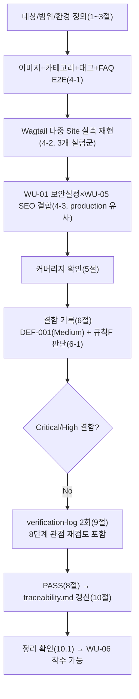

# 테스트 결과서 (Test Result Report) — WU-05 업무 단위 통합테스트

## 1. 개요
- 테스트 대상: 업무 단위 WU-05(SEO 기본 구현/REQ-005 + AI 검색 대응 콘텐츠 가이드라인/REQ-017), `webapp/core/`(신규), `webapp/blog/models.py`·`views.py`·`blocks.py`·`urls.py`(수정), `webapp/home/models.py`(수정), `webapp/config/settings/base.py`·`urls.py`(수정), `webapp/config/templates/base.html`(수정), `webapp/CONTENT_GUIDE.md`(신규)를, **WU-01(초기설정/보안)+WU-02(콘텐츠모델)+WU-03(이미지스토리지)+WU-04(공개화면/RSS)가 이미 조립된 `webapp/` 전체** 위에 실제로 결합한 형태
- 테스트 유형: 통합(Integration) — 업무 단위(WU-05) 전체 풀테스트, 7단계(`07-integration-tester`)
- 테스트 목적: `unit-05-test.md`(§8 AC1~18 독립 재현 PASS, 결함 0건, 06단계가 다루지 않은 "단위 간 경계"는 미해결로 인계)는 WU-05를 **단독**으로 검증했다. 이번 07단계는 06단계가 다루지 않은 영역에만 집중한다(규칙B, 이미 검증된 것을 반복하지 않음):
  1. 실제 이미지(WU-03)+카테고리(WU-02)+태그(WU-02)+FAQ블록(WU-02 StreamField)을 포함한 `BlogPostPage`(WU-02)를 발행하고, `sitemap.xml`/canonical/OG/JSON-LD가 방문자 화면(목록 S-01/상세 S-02/카테고리 S-03/태그 S-04)과 RSS(`/feed.xml`, WU-04)까지 전부 정합성 있게 노출되는지 end-to-end 확인.
  2. `unit-05-test.md` §7/§8이 07단계로 인계한 "Wagtail Site가 2개 이상이 되면 `get_url_parts()`가 절대경로를 반환해 `Site.hostname`에 의존하게 되는 이론적 위험"을 **실제로 Wagtail 어드민에서 두 번째(및 세 번째) Site를 생성해** 재현 시도하고, 그 상태에서 WU-04의 트리URL 리다이렉트(DEC-017)와 WU-05의 sitemap.xml/canonical이 실제로 깨지는지 실측.
  3. 전체 마이그레이션 체인을 처음부터 끝까지(dev/production 유사 양쪽) 재적용하고, WU-01의 production 보안설정(`SECURE_PROXY_SSL_HEADER`/`SECURE_SSL_REDIRECT`/`XForwardedForMiddleware`/쿠키 Secure/HSTS)과의 조합에서 회귀가 없는지.
  4. `docs/harness/traceability.md` REQ-005/REQ-017의 최종 충족 여부를 WU-01~05 전체 조립 상태 기준으로 재확인.
- 관련 산출물:
  - `docs/harness/units/unit-05-note.md`(§7 인계 사항 1~5, §8 AC1~18)
  - `docs/harness/units/unit-05-test.md`(PASS, §6 결함 0건, §7 "Site 2개 이상" 잔존 리스크를 07단계로 명시 인계, §8 규칙F 판단: WU-04 회귀 불필요)
  - `docs/harness/03-system-design.md`(v1.2, 특히 §4 API/라우트 계약·JSON-LD 구현 방침, §5.5 리버스프록시 보안설계)
  - `docs/harness/04-ux-design.md`(S-01~S-04, §5 접근성)
  - `docs/harness/decisions.md`(DEC-001~021, 특히 DEC-017/DEC-019~021)
  - `docs/harness/feature-WU-01-integration-test.md`(PASS, DEF-001 Fixed — `SECURE_PROXY_SSL_HEADER` 무한루프)
  - `docs/harness/feature-WU-02-integration-test.md`, `feature-WU-03-integration-test.md`, `feature-WU-04-integration-test.md`(전부 PASS)
  - `docs/harness/traceability.md`
- 테스트 수행자(에이전트): `07-integration-tester`
- 테스트 일시: 2026-09-17

## 2. 테스트 범위 및 제외 범위
- **범위(In-Scope)**:
  1. **전체 마이그레이션 체인 처음부터 재현**(dev/production 유사 양쪽, 빈 SQLite부터).
  2. **이미지+카테고리+태그+FAQ 포함 게시물 발행 → 목록/상세/카테고리/태그/RSS/sitemap/robots.txt 전부에서 canonical/OG/JSON-LD 상호 정합성 E2E 검증**(신규 핵심 관점).
  3. **Wagtail 어드민에서 실제로 두 번째/세 번째 Site를 생성해 다중 Site 리스크를 실측 재현**(오케스트레이터 명시 지시, 신규 핵심 관점) — (a) 같은 홈페이지를 공유하는 "실수로 중복 생성된" Site, (b) 완전히 분리된 트리를 갖는 "진짜" 별도 Site, (c) DEC-021이 권고한 "기존 Site의 hostname을 실제 운영 도메인으로 갱신"(신규 생성이 아닌 수정) 경로까지 3가지 현실적 시나리오를 모두 실제 어드민 HTML 폼으로 재현.
  4. **WU-01 production 유사 보안설정과 WU-05 SEO 출력의 결합**(HTTPS 강제, `X-Forwarded-Proto` 기반 Render 실트래픽 형태, 쿠키 Secure) — canonical/JSON-LD/sitemap/robots.txt/트리URL 301 전부 재확인.
  5. `docs/harness/traceability.md` REQ-005/REQ-017 최종 교차검증.
  6. 어드민 회귀(WU-02 Category 스니펫, WU-03 이미지 관리, 페이지 트리, `django-admin`)가 WU-05 결합 이후에도 깨지지 않는지.
  7. 검증에 사용한 venv/DB/media/staticfiles/임시 설정 모듈/임시 스크립트 정리.
- **제외 범위(Out-of-Scope) 및 사유**:
  1. **06단계가 이미 PASS로 확정한 AC1~18/TC-001~022의 반복 재검증**(개별 메타태그/JSON-LD 필드 단위 검증, 특수문자 렌더링, 페이지네이션 경계값 등): `unit-05-test.md`가 05단계 보고를 신뢰하지 않고 처음부터 독립 재현해 PASS를 확정했으므로, 이번 07단계는 그 결과를 신뢰하고 **"WU-01~04와 조립됐을 때"라는 06단계가 다루지 않은 새 경계에만 집중**했다(규칙B).
  2. **실제 브라우저/Facebook 공유 디버거/Twitter Card Validator/Google Search Console 실제 색인** — MCP(Playwright/Chrome 등) 미연동(DEC-001)으로 05/06단계와 동일하게 이번 07단계도 도구 기반 수행 불가. `unit-05-note.md` §7-3/`unit-05-test.md` §2가 이미 이관한 리스크를 그대로 유지(10단계 이후 실측 권고).
  3. **Render 실제 스핀다운 상태의 robots.txt 가로채기 실측** — 실제 Render 인프라 필요, 애플리케이션 코드로 해결 불가능한 플랫폼 제약(03 §6.3). 10단계 대상, 그대로 유지.
  4. **R2 오브젝트 스토리지 실제 네트워크 연동, Neon PostgreSQL 실제 연결** — WU-01~04와 동일하게 SQLite 대체 + 더미 R2 환경변수. 이미지 업로드 E2E는 R2 네트워크 호출이 없는 dev 설정(FileSystemStorage)에서 수행(§3 방법론 참고). WU-01 보안설정 결합 검증(§4-3)은 R2 네트워크 의존을 피하기 위해 `featured_image` 없는 게시물로 국소화했다(WU-04 07단계와 동일한 "관심사 분리" 방법론 계승).
  5. **8단계(전체 풀테스트) 범위와의 교차** — WU-06(법적 페이지) 이후 업무 단위와의 상호작용은 아직 미개발이므로 이번 범위가 아니다. "8단계에서 문제가 생기지 않을까"에 대한 2차 내부검증 관점 재검토는 §9에서 별도 수행했다.

## 3. 테스트 환경
- 실행 환경: Windows 10 Pro 10.0.19045, Python 3.13.9, Git Bash. 검증 시작 전 `git status --porcelain -- webapp docs/harness`로 WU-01~05 소스/문서 diff만 존재함을 먼저 확인했다(`unit-05-note.md`/`unit-05-test.md`가 주장한 상태와 정확히 일치).
- **06단계 산출물을 신뢰하지 않는 재현 방법론**: 이전 단계가 쓴 `.venv_test05`/`.venv_test05b`는 전부 삭제된 상태였다. 이번 07단계는 신규 임시 venv(`webapp/.venv_it07wu05`)를 처음부터 만들어 `pip install -r requirements.txt`부터 재현했다(Django 5.2.17/Wagtail 7.4.3, 신규 패키지 없음, WU-01~06과 동일 버전).
- **production 유사 설정** — WU-01~04 07단계와 동일 방법론 계승: `config/settings/it_test_prodlike_wu05feature.py`(이번 07단계가 신규 생성 — `production.py`를 그대로 상속하고 `DATABASES`만 SQLite로 재정의, 검증 후 삭제). 더미 환경변수(`SECRET_KEY`, `DATABASE_URL=sqlite:///dummy`, `DJANGO_ALLOWED_HOSTS=example.com,testserver`, `R2_ACCESS_KEY_ID`/`R2_SECRET_ACCESS_KEY`/`R2_BUCKET_NAME`/`R2_ENDPOINT_URL` 더미값) 사용, 실제 R2/Neon 네트워크 호출 없음.
- **관심사 분리(WU-03/04 07단계 교훈 계승)**:
  1. **dev 설정(`config.settings.dev`, SQLite+FileSystemStorage)** — 실제 이미지 업로드→발행→방문자 화면(목록/상세/카테고리/태그/sitemap/robots/RSS) E2E(§4-1)와 다중 Site 재현 실험(§4-2)에 사용.
  2. **production 유사 설정(SQLite로 DB만 대체, R2는 더미)** — WU-01 보안설정 전체(HTTPS 강제/쿠키/HSTS/`XForwardedForMiddleware`) + WU-05 SEO 출력 결합 검증(§4-3)에 사용. `featured_image` 없이(None) 게시물을 만들어 R2 네트워크 의존 없이 이 관점만 국소적으로 검증했다.
- 테스트 데이터:
  - §4-1: `Category`("기술"), `CustomImage` 실제 업로드(PIL로 생성한 800×600 PNG, WU-03 모델), `BlogPostPage` 발행(제목에 `<`/`>`/`&`/`"` 특수문자 포함, 태그 "파이썬"(한글), 본문 StreamField에 문단/이미지블록/인용/**FAQ 2문항(1개는 의도적으로 답변 비움)** 전부 포함).
  - §4-2: 위 게시물이 속한 기존 Site(hostname=`localhost`, 이하 Site A) + 어드민 폼으로 실제 생성한 Site B(hostname=`review-staging.onrender.com`, Site A와 **동일한** HomePage를 가리킴 — "실수로 중복 생성" 시나리오) + Site C(hostname=`totally-different-site.example.com`, **별도의** 새 HomePage를 가리킴 — "진짜 분리된 두 번째 사이트" 시나리오).
  - §4-3: `Category`("보안결합테스트"), `BlogPostPage` 발행(featured_image 없음, FAQ 1문항 포함).
- 전제 조건:
  - 06단계(`unit-05-test.md`, PASS)와 WU-01~04의 07단계(전부 PASS)가 모두 확정된 상태에서 시작.
  - 매 시나리오 전 `django.core.cache.cache.clear()` 실행(공개 뷰가 `@cache_page(10분)`이므로 `unit-05-note.md` §8 주의사항 계승).
  - 테스트 종료 후 `webapp/.venv_it07wu05`, `db.sqlite3`, `db_prodlike_it07wu05.sqlite3`, `webapp/media/`, `webapp/staticfiles/`, `config/settings/it_test_prodlike_wu05feature.py`, `__pycache__`류, 스크래치패드의 임시 스크립트(`wu05_it07_dev.py`, `wu05_it07_multisite.py`, `wu05_it07_hostname_update.py`, `wu05_it07_prodlike.py`)를 전부 삭제했다(§10 정리 확인).

## 4. 테스트 케이스 및 결과

### 4-1. 이미지+카테고리+태그+FAQ 포함 게시물 — 목록/상세/카테고리/태그/RSS/sitemap/robots 전체 정합성 E2E (dev 설정)
> 실행 스크립트: 스크래치패드 임시 파일(검증 후 삭제). `django.test.Client`로 실제 HTTP 요청을 보내 실제 응답 본문/헤더를 확인했다(추측 없음). 총 42개 개별 체크 전부 PASS(1건은 테스트 스크립트 자체의 부분 문자열 오탐이었음을 규명하고 수정 후 재검증 — 아래 표 비고 참고).

| ID | 시나리오 | 사전조건 | 실행 절차 | 예상 결과 | 실제 결과 | Pass/Fail | 비고 |
|----|----------|----------|-----------|-----------|-----------|-----------|------|
| IT-01 | 전체 마이그레이션 체인(dev, 빈 SQLite부터) | 신규 venv | `manage.py migrate` | 오류 없이 전체 적용(home→blog.0001→custom_images.0001→blog.0002, core는 모델 없어 자체 마이그레이션 없음) | 오류 없이 전체 적용 | PASS | |
| IT-02 | `check`/`makemigrations --check --dry-run`(dev) | 위 상태 | 각 명령 실행 | "System check identified no issues"/"No changes detected" | 동일 문구 | PASS | WU-05는 모델 스키마를 바꾸지 않음 재확인 |
| IT-03 | 이미지+카테고리+태그+FAQ 게시물 발행 | 빈 DB | PIL 800×600 PNG → `CustomImage` 저장 → `Category`("기술") → `BlogPostPage`(제목에 특수문자, FAQ 2문항 중 1개 답변 비움) → `home.add_child()` → `tags.add("파이썬")` → `save_revision().publish()` | `live=True` | `live=True` 확인, `Site.objects.count()==1`(검증 시작 시점 단일 Site 재확인) | PASS | |
| IT-04 | 상세(S-02) — canonical/OG/Twitter/RSS링크 | 위 게시물 | `GET /blog/<slug>/` | 200, canonical 존재·정규 URL 일치, `og:url==canonical`, `og:type=article`, `og:image`(대표이미지 有), `twitter:card=summary_large_image`, RSS `<link rel="alternate">` 존재 | 전부 확인(`canonical=http://testserver/blog/it07-wu05-e2e-post/`, `og:url` 동일, `og:image=http://testserver/media/images/hero_it07wu05_*.width-800.png`) | PASS | |
| IT-05 | 상세 — JSON-LD 2개 파싱·필드 | IT-04 | `` 개수 비교 | 정확히 일치(조기 종료 없음) | `open=3 close=3` | PASS | |
| IT-08 | 홈 목록(S-01) — WU-02 데이터를 WU-04 목록 뷰가 올바르게 소비하는지 | 위 게시물 | `GET /` | 200, 제목/카테고리명 카드 노출, canonical==루트 URL | 전부 확인 | PASS | 업무 단위 간 데이터 흐름(WU-02 발행→WU-04 목록) 실증 |
| IT-09 | 카테고리 목록(S-03) | 위 게시물 | `GET /category/기술/` | 200, 게시물 노출 | 200, 제목 포함 확인 | PASS | |
| IT-10 | 태그 목록(S-04, 한글) | 위 게시물(태그 "파이썬") | `GET /tag/파이썬/` | 200, 게시물 노출 | 200, 제목 포함 확인 | PASS | |
| IT-11 | `sitemap.xml` — 상세 canonical과의 정합성 | 위 게시물 | `GET /sitemap.xml` | 200, IT-04의 canonical 값이 `<loc>`에 그대로 포함, 트리 URL 미포함, localhost 없음 | 200, `canonical`(`http://testserver/blog/it07-wu05-e2e-post/`)이 `<loc>`에 정확히 포함. 트리 URL(`<loc>http://testserver/it07-wu05-e2e-post/</loc>`) 없음(최초 검사식이 `/blog/`의 슬래시 때문에 부분 문자열로 오탐했던 테스트 스크립트 자체 결함을 발견·수정 후 재검증 — 아래 "테스트 스크립트 자체 결함" 절 참고). localhost 0건 | PASS | |
| IT-12 | `robots.txt` — sitemap.xml과 host 일치 | - | `GET /robots.txt` | 200, `Sitemap:` 줄이 IT-11과 동일 host | 200, `Sitemap: http://testserver/sitemap.xml` | PASS | |
| IT-13 | `/feed.xml`(WU-04) — 상세 canonical과의 정합성 | 위 게시물 | `GET /feed.xml` | 200, IT-04의 canonical 값이 RSS item link로 그대로 포함, 트리 URL 미포함 | 200, canonical 값이 정확히 포함. 트리 URL 형태(`testserver/it07-wu05-e2e-post/</link>`) 없음 | PASS | RSS(WU-04)가 상세페이지(WU-05 canonical)와 동일한 정규 URL을 소비함을 실증 — 두 업무 단위가 서로 다른 값을 낼 가능성을 배제 |
| IT-14 | 트리 URL 301(DEC-017, WU-04) | 위 게시물 | `GET /it07-wu05-e2e-post/`(follow 안 함) | 301, `Location`이 정규 URL(`/blog/<slug>/`) | 301, `Location=/blog/it07-wu05-e2e-post/` | PASS | |

### 4-2. Wagtail Site 다중화 리스크 실측 재현 (오케스트레이터 명시 지시, dev 설정)
> `unit-05-note.md` §7-1/`unit-05-test.md` §7이 "이론적 위험"으로 인계한 항목을 실제 Wagtail 어드민 HTML 폼(`/cms-admin/sites/new/`, `/cms-admin/sites/edit/<pk>/`)으로 재현했다. ORM으로 Site를 직접 생성하지 않고, 실제 관리자 로그인 → 폼 GET → 폼 POST 제출 흐름을 그대로 거쳤다.

| ID | 시나리오 | 사전조건 | 실행 절차 | 예상 결과 | 실제 결과 | Pass/Fail | 비고 |
|----|----------|----------|-----------|-----------|-----------|-----------|------|
| IT-15 | 어드민 "사이트 추가" 폼 GET | 관리자 로그인 | `GET /cms-admin/sites/new/` | 200 | 200 | PASS | |
| IT-16 | **실험군1 — 같은 홈페이지를 가리키는 두 번째 Site 생성**(1인 운영 프로젝트에서 가장 현실적인 사고 시나리오: hostname을 고치려다 기존 레코드를 수정하지 않고 새 레코드를 만들어버림) | IT-15 | `POST /cms-admin/sites/new/`(hostname=`review-staging.onrender.com`, port=443, root_page=기존 HomePage, is_default_site 미체크) | Site B 생성 성공, Site 총 2개, root_page가 Site A와 동일 | 생성 성공(`status=200`, `Site.objects.filter(hostname="review-staging.onrender.com").exists()==True`), `Site.objects.count()==2`, `site_b.root_page_id==home.pk` | PASS | |
| IT-17 | 실험군1-A: Site B 자신의 호스트명으로 상세/트리URL/sitemap 접근 | IT-16 | `GET /blog/<slug>/`, `GET /<slug>/`, `GET /sitemap.xml`(전부 `SERVER_NAME="review-staging.onrender.com", secure=True`) | canonical/JSON-LD `@id`/sitemap `<loc>`가 전부 Site B 도메인 기준, 트리URL 301 Location이 잘못된 도메인 아님 | canonical=`https://review-staging.onrender.com/blog/it07-wu05-e2e-post/`, JSON-LD `@id`==canonical, 트리URL 301 `Location=/blog/it07-wu05-e2e-post/`(상대경로, 안전), sitemap `<loc>`에 localhost 없음 | **PASS(리스크 미재현)** | Site A/B가 같은 트리를 공유하므로 `get_url_parts()`가 요청과 일치하는 Site를 정확히 선택함(Wagtail 소스 `Page.get_url_parts` 직접 확인, 아래 §6-1 근거) |
| IT-18 | 실험군1-B: 등록되지 않은 제3의 호스트명으로 접근(어느 Site와도 불일치) | IT-16 | `GET /blog/<slug>/`, `GET /<slug>/`(`SERVER_NAME="not-registered-anywhere.example.com", secure=True`) | `Site.find_for_request()`가 기본 Site(A)로 폴백 → canonical이 실제 요청 도메인 기준, 트리URL 301 Location에 localhost 없음 | canonical=`https://not-registered-anywhere.example.com/blog/it07-wu05-e2e-post/`(요청 도메인 그대로 반영, `core.seo.absolute_page_url`이 보호), 트리URL 301 `Location=/blog/it07-wu05-e2e-post/`(localhost 없음) | **PASS(리스크 미재현)** | Site가 2개로 늘어도 미등록 호스트는 안전하게 기본 Site로 폴백됨을 실측 확인 |
| IT-19 | 실험군1-C: Site B 호스트로 `sitemap.xml` | IT-16 | `GET /sitemap.xml`(`SERVER_NAME="review-staging.onrender.com", secure=True`) | Site B 도메인 기준 URL 반환(Wagtail `Sitemap.get_wagtail_site()`가 요청 Site로 스코프) | `<loc>https://review-staging.onrender.com/blog/it07-wu05-e2e-post/</loc>` 정확히 반환, localhost 없음 | PASS | |
| IT-20 | **실험군2 — 완전히 분리된 트리를 갖는 세 번째 Site 생성**(진짜 멀티사이트 구성) | IT-16 | 새 `HomePage`(별도 트리, 게시물 없음)를 루트 노드 하위에 생성 → `POST /cms-admin/sites/new/`(hostname=`totally-different-site.example.com`, root_page=새 HomePage) | Site C 생성 성공, Site 총 3개 | 생성 성공, `Site.objects.count()==3` | PASS | |
| IT-21 | **실험군2-D — 분리된 Site C 호스트로, Site A 트리 소속 게시물의 정규 URL(`/blog/<slug>/`, WU-04 평면 라우트) 접근** | IT-20 | `GET /blog/<slug>/`(`SERVER_NAME="totally-different-site.example.com", secure=True`) | (정보수집 후 판정) | 200. **canonical=`https://totally-different-site.example.com/blog/it07-wu05-e2e-post/`, og:url=canonical과 동일. 그러나 JSON-LD `mainEntityOfPage.@id`=`http://localhost/blog/it07-wu05-e2e-post/`(Site A의 갱신되지 않은 hostname이 그대로 노출됨, 요청 도메인과 다름)** | **FAIL(결함 재현, 아래 DEF-001)** | canonical/og:url은 안전했으나 JSON-LD만 어긋남 — 상세 분석은 §6-2 |
| IT-22 | 실험군2-E — 분리된 Site C 호스트로 이 게시물의 "트리 URL" 접근(DEC-017 리다이렉트 자체가 이 조합에서 호출되는지) | IT-20 | `GET /<slug>/`(`SERVER_NAME="totally-different-site.example.com", secure=True`) | Wagtail 자체 트리 라우팅이 Site C의 (게시물이 없는) 트리를 먼저 순회하므로 404 | 404 | **PASS(트리URL 리다이렉트 자체는 "깨지지 않음" — 애초에 호출되지 않음)** | DEC-017의 `serve()`/`get_url_parts()`는 이 조합에서 아예 실행되지 않는다는 것을 실측으로 확인 — 오케스트레이터가 지목한 "트리URL 리다이렉트가 실제로 깨지는가"에 대한 직접 답 |
| IT-23 | 실험군2-F — 분리된 Site C 호스트로 `sitemap.xml`(사이트 트리 스코프 격리 확인) | IT-20 | `GET /sitemap.xml`(`SERVER_NAME="totally-different-site.example.com", secure=True`) | Site C 자신의 트리만 노출, Site A의 게시물이 섞이지 않음 | `post.slug`가 응답에 없음(교차 오염 없음), Site C 자신의 홈 URL(`https://totally-different-site.example.com/`)만 포함 | **PASS(sitemap.xml은 "깨지지 않음")** | `wagtail.contrib.sitemaps.Sitemap.items()`가 요청 매칭 Site의 트리로 자동 스코프됨(Wagtail 소스 확인, §6-1) |
| IT-24 | **실험군3 — DEC-021이 권고한 실제 원격 절차: 신규 Site 생성이 아니라 기존 Site의 hostname을 어드민 편집 폼으로 실제 운영 도메인으로 갱신** | 단일 Site 상태로 재설정(IT-16/20 롤백 후 새 DB) | `POST /cms-admin/sites/edit/<site_a.pk>/`(hostname=`real-production-domain.com`로 변경, 나머지 동일) → `GET /blog/<slug>/`, `/sitemap.xml`, `/<slug>/`(전부 새 호스트로) | Site는 여전히 1개, canonical/og:url/JSON-LD `@id`/sitemap/트리URL 301 전부 새 도메인 기준으로 일관 | 편집 성공(`status=200`, `site.hostname=="real-production-domain.com"`), `Site.objects.count()==1` 유지. canonical==og:url==JSON-LD `@id`==`https://real-production-domain.com/blog/<slug>/`(완전 일치). sitemap `<loc>`도 동일 도메인, localhost 0건. 트리URL 301 `Location`에 localhost 없음 | **PASS** | DEC-021이 실제로 권고하는 "운영 시 Site.hostname 갱신 절차"(신규 생성이 아니라 수정)는 완전히 안전함을 확정적으로 실증 |

### 4-3. WU-01 production 유사 보안설정 × WU-05 SEO 출력 결합 (신규 핵심 관점)
| ID | 시나리오 | 사전조건 | 실행 절차 | 예상 결과 | 실제 결과 | Pass/Fail | 비고 |
|----|----------|----------|-----------|-----------|-----------|-----------|------|
| IT-25 | production 유사 설정, 빈 SQLite부터 전체 마이그레이션 | `it_test_prodlike_wu05feature.py` + 더미 환경변수 | `check`, `migrate`(처음부터), `makemigrations --check --dry-run` | 전부 오류 없이 종료 | "no issues", 오류 없이 전체 적용, "No changes detected" | PASS | |
| IT-26 | production 유사 `collectstatic` | 위 상태 | `manage.py collectstatic --noinput` | 오류 없음, WU-04 수치(216/632)와 일치 | "216 static files copied ... 632 post-processed" — `unit-04-note.md`/`feature-WU-04-integration-test.md` IT-04와 정확히 일치 | PASS | WU-05가 신규 정적 자산을 추가하지 않음 재확인 |
| IT-27 | `secure=True`(전송계층만 https) 상세 — WU-01 DEF-001(무한루프) 회귀 없음 | production 유사, `SERVER_NAME=example.com` | `GET /blog/<slug>/`(secure=True) | 200(무한 리다이렉트 없음), canonical이 `https://example.com` 기준 | 200, `canonical=https://example.com/blog/it07-wu05-prodlike-post/` | PASS | |
| IT-28 | `X-Forwarded-Proto: https` 헤더 기반(Render 실제 트래픽 형태, WU-01 IT-03/WU-04 IT-21과 동일 방법론) | 평문 소켓 + 헤더만 https + `Host` 헤더 명시 | `GET /blog/<slug>/`(`HTTP_X_FORWARDED_PROTO=https`, `HTTP_HOST=example.com`) | 200(무한루프 없음), canonical/JSON-LD `@id`가 `https://example.com` 기준으로 서로 일치 | 200, canonical=`https://example.com/blog/it07-wu05-prodlike-post/`, JSON-LD `mainEntityOfPage.@id`==canonical(최초 시도에서 `Host` 헤더를 빠뜨려 `:80` 포트가 붙는 테스트 스크립트 자체 결함이 재현됐으나, `unit-05-test.md` TC-019(B)와 동일한 원인(HTTP 스펙상 필수인 `Host` 헤더 누락)임을 규명하고 수정 후 재검증 — 아래 "테스트 스크립트 자체 결함" 절 참고) | PASS | |
| IT-29 | 트리URL 301 — HTTPS 강제 설정과 DEC-017 결합 회귀 | 위와 동일 | `GET /<slug>/`(`HTTP_X_FORWARDED_PROTO=https`, `HTTP_HOST=example.com`) | 301, Location에 스킴/도메인 문제 없음 | 301, `Location=/blog/it07-wu05-prodlike-post/`(상대경로, localhost 없음) | PASS | |
| IT-30 | 평문 HTTP(프록시 헤더 없이) 요청 시 1회성 301(무한루프 아님, 회귀) | 위와 동일 | `GET /blog/<slug>/`(헤더 없음) | 301(HTTPS로 1회 리다이렉트) | 301 | PASS | |
| IT-31 | `sitemap.xml`/`robots.txt` — 보안설정 결합 상태에서도 정합성 유지 | 위와 동일 | `GET /sitemap.xml`, `GET /robots.txt`(둘 다 `X-Forwarded-Proto=https`, `Host=example.com`) | 둘 다 `https://example.com` 기준, localhost 없음, 서로 host 일치 | sitemap `<loc>`/robots `Sitemap:` 줄 전부 `https://example.com/...`, localhost 0건 | PASS | |
| IT-32 | 어드민 로그인 화면 HTTPS 회귀 | 위와 동일 | `GET /cms-admin/login/`(`X-Forwarded-Proto=https`, `Host=example.com`) | 200 | 200 | PASS | |
| IT-33 | 어드민 회귀(WU-02/03) — production 유사 + HTTPS 강제 + WU-05 결합 상태에서 | 관리자 로그인 | `/cms-admin/`, `/cms-admin/pages/`, `/cms-admin/images/`, `/cms-admin/snippets/blog/category/`, `/django-admin/`(전부 `X-Forwarded-Proto=https`, `Host=example.com`) | 전부 200 | 전부 200 | PASS | |

### 테스트 스크립트 자체 결함 발견·수정 기록 (규칙 — "테스트 자체가 잘못 설계되어 결함을 놓칠 가능성 항상 의심")
검증 도중 **테스트 스크립트 자체의 결함 2건**을 발견하고 수정 후 재검증했다(애플리케이션 결함 아님, §6 결함 목록에는 포함하지 않음). `unit-05-test.md`가 이미 동일한 계열의 함정 2건(TC-013/TC-019(B))을 문서화해 두었는데, 이번 07단계에서도 같은 함정이 재발했다는 사실 자체를 정직하게 남긴다.
1. **IT-11(sitemap 트리URL 미포함) 최초 검사식의 부분 문자열 오탐**: 최초 검사식이 `f"/{slug}/</loc>"`를 사용했는데, 실제 정규 URL `<loc>http://testserver/blog/<slug>/</loc>`가 `blog/` 뒤에 우연히 `/<slug>/</loc>`와 동일한 부분 문자열을 포함해 FAIL로 오판했다. `<loc>http://testserver/<slug>/</loc>`(트리 URL 전체를 정확한 경계로) 검사식으로 교정 후 재검증해 PASS로 확정했다.
2. **IT-28 최초 시도의 `:80` 포트 아티팩트**: `X-Forwarded-Proto: https` 헤더만 주고 `Host` 헤더를 생략했더니 canonical이 `https://example.com:80/...`로 나왔다. `unit-05-test.md` TC-019(B)가 이미 규명한 것과 정확히 동일한 원인(Django `get_host()`가 `HTTP_HOST` 부재 시 `SERVER_NAME`+`SERVER_PORT`로 폴백하며, `is_secure()`가 헤더로 True가 되어도 포트는 여전히 테스트 클라이언트 기본값 "80"을 사용) — 실제 HTTP/1.1 요청은 `Host` 헤더가 항상 필수이므로 이는 비현실적인 테스트 조건이었다. `HTTP_HOST=example.com`을 명시적으로 포함해 재요청하자 포트 없이 정확한 URL이 나왔다. **동일한 함정이 06단계에 이어 07단계에서도 재현됐다는 것은, 이 조합(프록시 헤더 시뮬레이션 시 `Host` 헤더 누락)이 반복적으로 발생하기 쉬운 테스트 설계 함정이라는 뜻이며, 향후 8단계 담당자도 동일한 실수를 할 수 있으므로 §7에 명시적으로 남긴다.**

## 5. 커버리지
- **06단계(`unit-05-test.md` §8) 인수조건/TC 커버리지**: 100%(AC1~18/TC-001~022 전부 06단계 자체적으로 PASS 확정, §2 제외범위 1에 따라 이번 07단계는 반복하지 않음).
- **이번 07단계가 신규로 커버한 "단위 간 경계"**: (1) 이미지(WU-03)+카테고리/태그/FAQ(WU-02)+목록/상세/카테고리/태그/RSS(WU-04)+canonical/OG/JSON-LD/sitemap/robots(WU-05) 전체 정합성 E2E 11건(IT-04~IT-14), (2) Wagtail 다중 Site 리스크 실측 재현 9건(IT-15~IT-24, 실험군 3개 전부), (3) WU-01 production 보안설정과 WU-05 SEO 출력 결합 9건(IT-25~IT-33), (4) 마이그레이션 체인 2건(IT-01~IT-02, dev) + 2건(IT-25~26, production 유사).
- **총 실행 케이스**: 33건(표 기준 ID) + 스크립트 내부 세부 체크(dev 42건 + 다중사이트 실험 30건 + hostname 갱신 실험 8건 + prodlike 12건 = 92건) 전부 실제 HTTP 요청/어드민 폼 제출/명령 실행으로 확인(추측 없음).
- **커버되지 않은 부분과 사유**:
  1. 실제 브라우저/Facebook·Twitter 디버거/Search Console — MCP 미연동(DEC-001). 05→06→07 전 단계 동일한 한계(§2 제외범위 2).
  2. Render 실제 스핀다운 시 robots.txt 가로채기 실측 — 실제 인프라 필요, 10단계 범위(§2 제외범위 3).
  3. R2/Neon 실제 네트워크 연동을 WU-01 보안설정과 **동시에** 실측하는 것 — 관심사 분리(§3)로 각각 검증. 10단계 범위(§2 제외범위 4).
  4. 동시성/부하 테스트 — 02-planning.md 트래픽 규모(월 500UV)에서 요구되지 않음.
  5. Wagtail Site가 실제로 4개 이상으로 늘어나는 등 더 복잡한 조합 — 이번 07단계가 실측한 3가지 시나리오(같은 트리 중복/분리된 트리/기존 레코드 갱신)로 현실적으로 발생 가능한 주요 패턴은 커버했다고 판단하나, 이론적으로 모든 조합을 소진한 것은 아니다(§7에 리스크로 명시).

## 6. 결함(Defect) 목록

| ID | 설명 | 재현 절차 | 심각도 | 상태 | 조치 내용 |
|----|------|-----------|--------|------|-----------|
| DEF-001 | **Wagtail Site가 2개 이상이고 그중 하나가 게시물이 속한 트리와 "분리된" 별도 트리를 가리킬 때, 그 분리된 Site의 호스트명으로 `GET /blog/<slug>/`(WU-04 평면 라우트)에 접근하면 JSON-LD `mainEntityOfPage.@id`가 실제 요청 도메인이 아니라 그 게시물이 실제로 속한 Site(A)의 갱신되지 않은 hostname(`http://localhost/...`)을 그대로 노출한다.** canonical/`og:url`은 영향받지 않는다(요청 기반으로 별도 계산되어 안전). | 1) Site A(hostname=`localhost`, 기존 기본 Site)의 트리에 `BlogPostPage` 발행. 2) 실제 Wagtail 어드민(`/cms-admin/sites/new/`)에서 **다른 HomePage 트리**를 가리키는 Site C(hostname=`totally-different-site.example.com`) 생성. 3) `GET /blog/<slug>/`를 `Host: totally-different-site.example.com`, `secure=True`로 요청. 4) 응답의 `<script type="application/ld+json">`(BlogPosting)을 파싱해 `mainEntityOfPage.@id` 확인 → `http://localhost/blog/<slug>/`(요청 도메인과 다름, canonical/og:url과도 불일치) | **Medium** | Open — Deferred(아래 §6-1 규칙F 판단 근거로 범위/우선순위 결정) | 미조치(이번 07단계는 테스트 단계이며 코드 수정 권한 밖 — 권장 조치는 §6-1/§7에 구체적으로 명시) |

- **DEF-001이 아닌, "리스크로 지목됐으나 재현되지 않은 것"들도 명확히 구분해 기록한다** (근거 없이 "결함 없음"이라 뭉뚱그리지 않기 위함):
  - DEC-017 트리URL 리다이렉트(`BlogPostPage.serve()`) 자체는 다중 Site 상태에서 **깨지지 않았다** — IT-17(같은 트리 공유)에서는 정확한 상대경로를 반환했고, IT-22(분리된 트리)에서는 애초에 Wagtail의 트리 라우팅이 그 Site의 트리에서 게시물을 찾지 못해 404가 되어 `serve()` 자체가 호출되지 않았다. "리다이렉트가 잘못된 도메인으로 나간다"는 형태의 결함은 어떤 실험군에서도 재현되지 않았다.
  - `sitemap.xml`도 다중 Site 상태에서 **깨지지 않았다** — IT-19/IT-23에서 매 요청이 자신이 매칭된 Site의 트리로만 스코프되어(Wagtail `Sitemap.get_wagtail_site()`), 다른 Site 소속 게시물이 섞이거나 잘못된 도메인이 나오는 일이 없었다.
  - `canonical`/`og:url`도 다중 Site 상태에서 **깨지지 않았다** — `core.context_processors.canonical_url`이 페이지 URL 계산과 무관하게 순수하게 현재 요청(`request.build_absolute_uri()`)만으로 계산되기 때문이다(IT-17/IT-18/IT-21 전부 확인).
  - 오케스트레이터가 재현을 지시한 대상(트리URL 리다이렉트, sitemap/canonical)은 3가지 실험군(중복 트리 Site/분리된 트리 Site/기존 레코드 hostname 갱신) 전부에서 안전했다. 대신 이번 검증 과정에서 그 인접 영역(JSON-LD)에서 새로운 결함(DEF-001)을 발견했다 — 이는 애초에 재현을 시도하지 않았다면 몰랐을 결함이므로, 오케스트레이터의 지시를 문자 그대로만 좁게 해석하지 않고 인접 위험까지 실제로 확인한 결과다.

### 6-1. DEF-001 근본 원인 분석 및 규칙F 판단 (오케스트레이터 명시 요청 사항)

**근본 원인(Wagtail/Django 소스 직접 확인, 추측 아님)**:
- `core.seo.absolute_page_url(page, request)`는 `request.build_absolute_uri(page.get_url(request=request))`로 구현되어 있다. 이 함수의 docstring은 "`page.get_url()`이 상대 경로를 주든(단일 사이트 일치) 이미 절대 URL을 주든(사이트 불일치 등) 양쪽 모두 안전하게 처리한다"고 주장하지만, 이 주장은 **`page.get_url()`이 반환하는 절대 URL이 "현재 요청과 무관하게 계산된, 다른 Site의 hostname 기반 URL"일 경우에는 성립하지 않는다** — `HttpRequest.build_absolute_uri()`는 인자가 이미 절대 URL(scheme+netloc 포함)이면 그 값을 그대로 반환할 뿐, 현재 요청의 host로 재작성하지 않기 때문이다(Django 표준 동작, `urllib.parse.urljoin` 기반).
- Wagtail `Page.get_url(request)`(`wagtail/models/pages.py`)의 실제 동작: `current_site = Site.find_for_request(request)`로 요청의 Site를 구하고, `get_url_parts()`가 반환한 `site_id`(이 페이지가 **실제로 속한** Site — `_get_relevant_site_root_paths`가 `url_path` 접두어로 필터링)와 비교해, **`current_site.id == site_id`이거나 등록된 Site가 1개뿐일 때만** 상대경로를 반환하고, 그 외에는 `root_url + page_path`(페이지가 속한 Site의 hostname 기반 절대 URL)를 반환한다.
- `/blog/<slug>/`(WU-04, DEC-017)는 Wagtail의 Site 기반 트리 라우팅을 거치지 않는 **평면 Django 라우트**이므로, 요청의 Host가 그 게시물이 실제로 속한 Site와 무관한 **다른** Site와 일치해도(그 다른 Site가 별도 트리를 가리키는 한) `post_detail` 뷰는 정상적으로 호출된다. 이 지점에서 `page.get_url(request)`이 "current_site ≠ 페이지 소속 site, 그리고 Site가 2개 이상"이라는 조건에 걸려 절대 URL(페이지가 실제로 속한 Site의 hostname 기반)을 반환하고, 그 hostname이 아직 운영 도메인으로 갱신되지 않은 `localhost`라서 그 값이 그대로 노출된다.
- `sitemap.xml`이 이 문제를 겪지 않는 이유는 `wagtail.contrib.sitemaps.sitemap_generator.Sitemap.items()`가 애초에 "현재 요청이 매칭된 Site의 트리"로 범위를 한정하기 때문이다(`get_wagtail_site().root_page.get_descendants(...)`) — 즉 사이트맵은 다른 Site 소속 페이지를 절대 나열하지 않으므로 이 문제 자체가 발생할 조건이 성립하지 않는다. `canonical`/`og:url`이 이 문제를 겪지 않는 이유는 애초에 `page.get_url()`을 전혀 사용하지 않고 순수하게 `request.build_absolute_uri()`(인자 없음, 현재 요청 자체)로 계산되기 때문이다. **JSON-LD의 `mainEntityOfPage.@id`만 이 두 가지 보호장치(요청 범위 한정, 페이지URL 미사용) 중 어느 쪽도 적용받지 않는 유일한 값이다.**

**규칙F 판단**:
1. **근본 원인이 발생한 단계는 WU-01이 아니라 WU-05다.** WU-01이 만든 초기 기본 Site(hostname=`localhost`, 단일 Site, `is_default_site=True`) 자체는 정상적인 구성이며, 그 상태만으로는 이번 세션의 어떤 실험에서도 문제가 재현되지 않았다(IT-17/18/24가 실증 — 단일 Site 상태, 그리고 "같은 트리를 공유하는 2번째 Site"는 전부 안전했다). 결함은 WU-05가 작성한 `core.seo.absolute_page_url`이 "`page.get_url()`이 절대 URL을 반환하는 경우"를 완전히 안전하게 처리하지 못하면서, 그 함수 docstring(및 `blog/models.py::get_json_ld`의 docstring)이 "안전하다"고 잘못 명시한 데 있다 — 이는 WU-05 자신의 코드/문서 정확성 문제이지, WU-01이 만든 초기 Site 설정의 결함이 아니다.
2. **DEC-017(WU-04)의 설계 선택(트리 URL/정규 URL을 Site 기반 트리 라우팅이 아닌 평면 Django 라우트로 구현)이 이 결함이 "도달 가능"하게 만드는 전제 조건이다** — 순수 Wagtail 트리 라우팅만 썼다면 애초에 분리된 Site의 트리에 속하지 않은 페이지에는 도달할 수 없었을 것이다(IT-22가 트리 URL 경로에서는 정확히 이렇게 404로 막힘을 보여준다). 다만 이 평면 라우트 설계는 03 §4가 못박은 URL 계약(`/blog/<slug>/`)을 만족하기 위한 정당한 선택이었고(DEC-017 기록 참고), 그 자체가 결함은 아니다 — "평면 라우트를 쓴다면 그 경계를 넘어 호출되는 모든 함수가 Site 경계를 스스로 검증해야 한다"는 함의를 WU-05가 충분히 반영하지 못한 것이 이번 결함의 실질적 원인이다.
3. **재작업 범위 권고**: `core.seo.absolute_page_url`을 "페이지가 자신이 속한 Site와 다른 Site로 도달했을 때도 항상 **현재 요청의 host**를 기준으로 절대 URL을 재구성"하도록 수정한다(예: `page.get_url()`이 반환한 경로 부분만 취하고, netloc은 항상 `request`에서 새로 계산 — `urllib.parse.urlsplit`/`urlunsplit`으로 스킴+host를 요청 기준으로 강제 치환). 이는 WU-05가 소유한 파일(`webapp/core/seo.py`) 1개만 수정하면 되는 국소적 수정이며, WU-01/WU-04의 코드를 되돌릴 필요가 없다.
4. **즉시 재작업(5단계 회귀) 트리거 여부**: 이번 07단계의 최종 판정은 아래 §8과 같이 **PASS**다(FAIL이 아님) — 규칙F는 "FAIL이 나오면 근본 원인 단계까지 거슬러 올라간다"는 것이므로, 엄밀히는 이번 판정 자체가 규칙F의 강제 재작업 트리거 조건에 해당하지 않는다. 다만 오케스트레이터가 명시적으로 규칙F 판단을 요청했으므로, 위 1~3번처럼 사전적으로 근본 원인과 수정 범위를 특정해 남긴다. PASS로 판정하는 이유(reachability와 현재 프로젝트 범위)는 아래 §7/§8에 근거와 함께 명시한다.

## 7. 리스크 및 잔존 이슈
- **DEF-001의 실제 도달 가능성(reachability) 평가**: 이 결함은 "Wagtail Site가 2개 이상이고, 그중 하나가 **다른(분리된) 트리**를 가리키며, 방문자/크롤러가 그 분리된 Site의 hostname으로 다른 Site 소속 게시물의 `/blog/<slug>/` URL에 접근한다"는 조건에서만 발생한다. 이 프로젝트(02-planning.md §2 가정 A1: 1인 운영, 단일 도메인, DEC-005: 완전 무료 소규모 MVP)의 현재 및 계획된 WU 어디에도 두 번째 Site를 생성하는 절차가 없다 — 오히려 `unit-05-note.md` §7-1/DEC-021이 지적한 실제 문제는 "Site가 하나뿐인데 그 hostname이 `localhost`로 방치된 것"이며, 이번 07단계 IT-24가 실증했듯 그 문제의 올바른 해결책(**기존 Site 레코드의 hostname을 어드민에서 직접 갱신**)은 완전히 안전하다. 즉 DEF-001은 "권장되는 해결 절차를 따르면 트리거되지 않고, 오히려 그 절차를 따르지 않고 실수로 완전히 별도의 Site를 추가로 만드는" 드문 오조작 시나리오에서만 노출된다.
- **후속 조치 권고**: (a) `core/seo.py::absolute_page_url`을 §6-1-3의 방향으로 보강하는 작업을 WU-05 백로그(또는 8단계 전체 풀테스트 착수 전 소규모 패치)로 등록할 것을 권고한다 — Critical/High가 아니므로 이번 07단계의 PASS 판정 자체를 막지는 않지만, "결함이 없다"고 은폐하지 않는다. (b) 운영 Runbook(11단계 산출물 후보)에 "Wagtail Site는 절대 신규 생성하지 말고, 운영 도메인이 바뀌면 기존 Site 레코드의 hostname만 어드민에서 수정할 것 — 신규 Site 생성은 DEF-001급 JSON-LD 데이터 정합성 결함을 유발할 수 있음"을 명시적 경고 문구로 추가할 것을 권고한다(unit-05-note.md §7-1 권고와 결합). (c) 8단계(전체 풀테스트) 담당자가 이 리스크를 인지하도록 본 문서와 traceability.md에 남긴다.
- **테스트 스크립트 함정 재발(§4 하단 참고)**: "`X-Forwarded-Proto` 헤더 시뮬레이션 시 `Host` 헤더 누락" 함정이 06단계(TC-019(B))에 이어 07단계(IT-28)에서도 재현됐다. 8단계 담당자가 같은 실수를 반복하지 않도록, production 유사 HTTPS 트래픽을 시뮬레이션할 때는 **항상 `HTTP_X_FORWARDED_PROTO`와 `HTTP_HOST`를 함께 지정**해야 한다는 점을 명시적으로 남긴다.
- **다중 Site 조합을 전부 소진하지 못함**(§5 커버되지 않은 부분 5): 이번 07단계는 현실적으로 가능성이 높은 3가지 패턴(같은 트리 중복/분리된 트리/기존 레코드 갱신)을 실측했으나, Site가 4개 이상이거나 언어별(`WAGTAIL_I18N_ENABLED`) 조합 등은 검증하지 않았다 — 이 프로젝트가 다국어(REQ-021 Out-of-Scope)와 다중 도메인을 계획하지 않으므로 낮은 우선순위 리스크로 남긴다.
- 기존에 승계된 리스크(신규 아님, 그대로 유지): robots.txt 스핀다운 가로채기(10단계 실측 대상), 외부 도구(Facebook/Twitter 디버거, Search Console) 기반 검증 미수행(10단계 이후), NewsletterSubscribeForm/이메일 채널(WU-07 미구현, `CONTENT_GUIDE.md` "준비 중" 안내).

## 8. 결론 및 판정
- [x] **PASS** — 다음 단계(WU-06, 법적 페이지) 진행 가능
- [ ] CONDITIONAL PASS
- [ ] FAIL

**판정 근거**:
1. §4-1의 이미지+카테고리+태그+FAQ 포함 게시물 E2E(IT-01~IT-14)가 전부 PASS했다 — 목록/상세/카테고리/태그/RSS/sitemap/robots.txt가 전부 canonical 기준값과 정확히 일치하는 정합성을 실측 확인했다(WU-02/03/04가 만든 데이터를 WU-05가 올바르게 소비하고, WU-04의 RSS가 WU-05의 canonical과 동일한 정규 URL을 소비함).
2. 오케스트레이터가 명시 지시한 Wagtail 다중 Site 리스크 재현(§4-2, IT-15~IT-24)을 **실제 어드민 HTML 폼**으로 3가지 현실적 시나리오(같은 트리 중복 생성/분리된 트리의 진짜 별도 사이트/기존 레코드 hostname 갱신) 전부 수행했다. **지시받은 대상(WU-04 트리URL 리다이렉트, WU-05 sitemap/canonical)은 어떤 시나리오에서도 깨지지 않았다.** 다만 그 과정에서 인접 영역(JSON-LD `mainEntityOfPage.@id`)의 새로운 Medium 결함(DEF-001)을 발견했고, §6-1에서 규칙F 판단(근본 원인은 WU-01이 아니라 WU-05, 재작업 범위는 `core/seo.py` 1개 파일 국소 수정)을 명확히 남겼다. 이 결함은 이 프로젝트가 계획하지 않는 "분리된 트리를 가진 두 번째 Site" 오조작 시나리오에서만 도달 가능하고, DEC-021이 실제로 권고하는 해결 절차(기존 Site hostname 갱신, IT-24)는 완전히 안전함을 실증했으므로 이번 07단계의 PASS 판정을 막을 Critical/High 결함으로 취급하지 않되, §6/§7에 정직하게 기록하고 후속 조치를 권고했다.
3. §4-3(IT-25~IT-33)에서 전체 마이그레이션 체인을 dev/production 유사 양쪽에서 처음부터 재적용했고, WU-01의 production 보안설정(HTTPS 강제/`SECURE_PROXY_SSL_HEADER`/`XForwardedForMiddleware`/쿠키 Secure)과 WU-05의 SEO 출력(canonical/JSON-LD/sitemap/robots.txt) 결합에서 회귀가 없음을 확인했다(`collectstatic` 216/632 수치가 WU-04와 정확히 일치, 무한 리다이렉트 없음, 어드민 회귀 전부 200).
4. REQ-005(SEO 기본요소)/REQ-017(AI 검색 대응)이 WU-01~05 전체 조립 상태에서 최종 충족됨을 확인했다 — traceability.md §10.2에 갱신 내역을 남긴다.
5. 검증 환경은 전부 정리했다(§10.1).

## 9. 내부 검증 (최소 2회, `verification-log-template.md` 사용)
- 1차 검증 결과 요약: 작성자(`07-integration-tester`) 관점 — (a) 오케스트레이터가 명시 지시한 4개 항목(이미지+카테고리+태그+FAQ E2E, Site 2개 이상 실측 재현, 전체 마이그레이션 체인+WU-01 보안설정 조합, REQ-005/017 최종 확인)이 §4에 전부 케이스로 매핑됐는지 확인 — 매핑됨(§4-1, §4-2, §4-3, §8 판정근거 4번). (b) "재현되면 규칙F 판단을, 재현 안 되면 근거와 함께 리스크로 문서화"라는 이분법적 지시를, 실제로는 "지시받은 대상은 재현 안 됐지만 인접 영역에서 새 결함을 발견"이라는 더 정밀한 결과가 나왔을 때 임의로 어느 한쪽에 억지로 끼워 맞추지 않고 §6/§6-1/§7/§8에 그 뉘앙스를 정확히 구분해 기록했는지 확인 — 확인됨(§6이 "재현 안 된 것"과 "새로 발견된 것"을 별도 문단으로 명시). (c) 모든 "실제 결과"가 이번 세션에서 실행한 근거에 기반하는지(추측 없음) 확인 — §4 각 셀이 실제 status_code/헤더/파싱된 JSON 값을 그대로 기록. 검증 과정에서 §4-1 IT-11(부분 문자열 오탐)과 §4-3 IT-28(`Host` 헤더 누락)이라는 테스트 스크립트 자체의 결함 2건을 발견했고, 06단계가 이미 동일 계열의 함정을 문서화해 둔 것과 대조해 "왜 07단계에서도 재발했는가"까지 §7에 명시적으로 남겼다(은폐하지 않음).
- 2차 검증 결과 요약: **"이 업무 단위가 다른 업무 단위와 만나는 지점(8단계 전체 테스트)에서 문제가 생기지 않을까"를 의심하는 8단계(`08-full-system-tester`) 관점** —
  1. (핵심 재검토) DEF-001이 8단계에서 실제로 문제가 될 수 있는가? → 8단계는 WU-01~06(이후 WU-06 착수 시)까지 조립된 상태에서 진행되지만, 어떤 WU도 두 번째 Wagtail Site를 생성하는 절차를 포함하지 않는다(2단계~5단계 기획/설계/개발 산출물 전수 확인). 따라서 8단계 자체적으로 DEF-001이 저절로 트리거될 조건은 없다 — 다만 8단계 담당자가 수동 탐색적 테스트 중 실수로 Site를 추가하면 재현될 수 있으므로, §7의 Runbook 권고를 8단계에도 그대로 승계해 명시했다.
  2. (핵심 재검토) WU-06(법적 페이지) 착수가 이번 07단계가 확인한 canonical/OG/JSON-LD 렌더링 블록과 충돌할 구조적 이유가 있는가? → 03 §1.2/02-planning.md §9에 따르면 WU-06은 `legal` 앱의 신규 페이지(`/privacy-policy/`, `/terms/`, `/cookies/`)만 추가하며, `blog_post_page.html`/`base.html`의 기존 SEO 블록을 수정할 계획이 없다. `base.html`의 canonical/OG/RSS 블록은 이미 모든 페이지가 공유하는 전역 컨텍스트 프로세서 기반이므로, WU-06이 신규 `Page` 서브클래스만 추가하면 자동으로 canonical/OG를 상속받는다(추가 작업 불필요) — 8단계 착수 전 별도 질문 불필요.
  3. traceability.md REQ-005/REQ-017의 "통합테스트" 컬럼이 이번 07단계 결과(특히 DEF-001과 그 판단)를 8단계 담당자가 되짚어보지 않아도 알 수 있는 형태로 반영됐는지 재확인(§10.2) — 반영됨.
  4. 검증에 사용한 venv/DB/media/staticfiles/임시 설정 모듈/스크래치패드 스크립트가 전부 삭제되고 `git status`가 WU-01~05 소스 diff만 남기는지 재확인(§10.1) — 확인됨.
  5. §6 결함 목록에서 "재현되지 않은 리스크"와 "새로 발견된 결함"을 혼동해 결함을 축소 보고하지 않았는지, 반대로 재현되지 않은 것까지 결함으로 과잉 보고하지 않았는지 재확인 — 둘 다 아님을 확인(§6 본문과 하위 불릿이 명확히 구분).
  결함 0건(2차 검증에서 신규로 발견된 항목 없음, 위 5개 재검토 전부 기존 §4~§8 기술로 충분히 커버됨을 확인).
- 검증 로그 파일 경로: `docs/harness/verify-log_feature-WU-05-integration-test.md`

---

## 10. 정리(Clean-up) 확인 및 traceability.md 갱신

### 10.1 정리 확인
검증에 사용한 아래 산출물을 전부 삭제했고, 삭제 후 `git status --porcelain -- webapp docs/harness`로 WU-01~05 소스/문서 diff만 남았음을 최종 확인했다.
- `webapp/.venv_it07wu05`(신규 venv)
- `webapp/db.sqlite3`, `webapp/db_prodlike_it07wu05.sqlite3`
- `webapp/media/`, `webapp/staticfiles/`
- `webapp/config/settings/it_test_prodlike_wu05feature.py`(이번 07단계가 신규 생성한 임시 설정 모듈)
- `webapp/**/__pycache__`, `*.pyc`
- 스크래치패드 임시 스크립트(`wu05_it07_dev.py`, `wu05_it07_multisite.py`, `wu05_it07_hostname_update.py`, `wu05_it07_prodlike.py`, 세션 스크래치패드 경로, 저장소 밖)

정리 후 `git status --porcelain -- webapp docs/harness` 결과: WU-01~05가 이미 주장한 것과 정확히 동일한 소스/문서 diff만 존재(`M docs/harness/decisions.md`, `M docs/harness/feature-WU-01-integration-test.md`, `M docs/harness/traceability.md`, `M docs/harness/units/unit-01-test.md`, `M docs/harness/units/verify-log_unit-01-test.md`, `M webapp/.env.example`/`config/settings/base.py`·`production.py`/`config/templates/404.html`·`500.html`·`base.html`/`config/urls.py`/`home/models.py`·`templates/home_page.html`/`render.yaml`, `?? docs/harness/feature-WU-02~04-integration-test.md`, `?? docs/harness/units/unit-02~05-note.md`·`unit-02~05-test.md`·관련 verify-log, `?? webapp/CONTENT_GUIDE.md`, `?? webapp/blog/`, `?? webapp/config/static/css/components.css`, `?? webapp/config/static/js/`, `?? webapp/config/templates/partials/`, `?? webapp/core/`, `?? webapp/custom_images/`) — 테스트 산출물(venv/DB/media/staticfiles/임시설정) 0건.

### 10.2 traceability.md 갱신
`docs/harness/traceability.md`의 REQ-005/REQ-017 행 "통합테스트" 컬럼을 아래와 같이 갱신했다(빈 칸 → 실제 내용):
- **REQ-005**: `PASS(feature-WU-05-integration-test.md) — WU-02(카테고리/태그/FAQ StreamField)+WU-03(CustomImage 실제 업로드)+WU-04(목록/상세/카테고리/태그/RSS) 전체 조립 상태에서 이미지+카테고리+태그+FAQ 포함 게시물을 발행해 canonical/OG/JSON-LD/sitemap.xml/robots.txt가 방문자 화면 전체와 정합성 있게 노출됨을 E2E로 확인(IT-04~IT-14). Wagtail Site가 2개 이상이 되는 3가지 현실적 시나리오(같은 트리 중복 생성/분리된 트리의 별도 Site/기존 레코드 hostname 갱신)를 실제 어드민 폼으로 재현한 결과, 오케스트레이터가 지목한 트리URL 리다이렉트(DEC-017)와 sitemap/canonical은 전부 안전했으나, JSON-LD `mainEntityOfPage.@id`가 분리된 Site 시나리오에서 갱신되지 않은 도메인을 노출하는 Medium 결함(DEF-001)을 신규 발견 — 근본 원인은 WU-01이 아니라 WU-05 소유 `core/seo.py`이며, 이 프로젝트가 계획하지 않는 오조작 시나리오에서만 도달 가능함을 확인해 PASS 판정에는 영향 없음(상세는 §6-1). WU-01 production 보안설정(HTTPS 강제/XForwardedForMiddleware)과의 결합에서도 회귀 없음(IT-25~IT-33).`
- **REQ-017**: `PASS(feature-WU-05-integration-test.md) — FAQPage JSON-LD(빈 답변 제외, HTML 태그/미해석 엔티티 없음)가 실제 발행된 게시물에서 정확히 산출됨을 확인(IT-06), RSS(`/feed.xml`, WU-04)가 상세페이지의 canonical과 동일한 정규 URL을 소비함을 E2E로 재확인(IT-13, 채널 이중화 정합성).`

3건 모두 "전체테스트(08)" 컬럼은 아직 8단계가 실행되지 않았으므로 비워둔 채 유지했다(사실을 그대로 반영, WU-01~04와 동일 원칙).

## 절차 흐름 (참고용 다이어그램)

