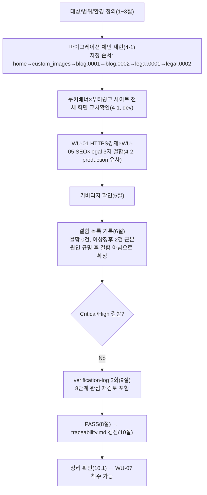

# 테스트 결과서 (Test Result Report) — WU-06 업무 단위 통합테스트

## 1. 개요
- 테스트 대상: 업무 단위 WU-06(법적 페이지 — 개인정보처리방침/이용약관/쿠키 사용 고지, REQ-007/008/009 + 콘텐츠 정책 REQ-015 + 전역 CookieConsentBanner REQ-008), `webapp/legal/`(신규: `apps.py`/`constants.py`/`models.py`/`migrations/0001_initial.py`/`migrations/0002_create_legal_pages.py`/`templates/legal/legal_page.html`), `webapp/config/settings/base.py`(INSTALLED_APPS에 `legal` 추가), `webapp/config/templates/base.html`(쿠키 배너 마크업+인라인 스크립트+`cookie-consent.js` 로드), `webapp/config/static/js/cookie-consent.js`(신규), `webapp/config/static/css/components.css`(`.legal-page*`/`.cookie-consent*` 추가)를, **WU-01(초기설정/보안)+WU-02(콘텐츠모델)+WU-03(이미지스토리지)+WU-04(공개화면/전역 헤더·푸터)+WU-05(SEO/AI검색 대응)가 이미 조립된 `webapp/` 전체** 위에 실제로 결합한 형태
- 테스트 유형: 통합(Integration) — 업무 단위(WU-06) 전체 풀테스트, 7단계(`07-integration-tester`)
- 테스트 목적: `unit-06-test.md`(§8 AC1~19 독립 재현 PASS, 결함 0건)는 WU-06을 **단독**으로 검증했다. 이번 07단계는 06단계가 다루지 않은 "단위 간 경계"에만 집중한다(규칙B, 이미 검증된 것을 반복하지 않음). 오케스트레이터가 명시 지시한 5개 항목을 전부 케이스로 매핑한다:
  1. 전체 사이트 네비게이션(헤더/푸터, WU-04)에 법적 페이지 링크가 실제로 연결돼 있는지 — 있어야 정상(없다면 WU-04 소유의 누락으로 규칙F 판단 필요).
  2. 쿠키배너가 전체 사이트(홈/블로그 목록/상세/카테고리/태그/법적 페이지 3종/404 전부)에서 일관되게 동작하는지.
  3. 전체 마이그레이션 체인(`home`→`custom_images`→`blog.0001`→`blog.0002`→`legal.0001`→`legal.0002`)을 빈 DB에서 처음부터 순서대로 적용.
  4. WU-01 보안설정(HTTPS 강제/`SECURE_PROXY_SSL_HEADER`/쿠키 Secure)과 WU-05 SEO 체계(canonical/sitemap.xml/robots.txt)가 legal 페이지와 결합한 상태에서 회귀 없는지.
  5. REQ-007/008/009/015 최종 충족 확인.
- 관련 산출물:
  - `docs/harness/units/unit-06-note.md`(§8 AC1~19, §7 인계 사항 1~6)
  - `docs/harness/units/unit-06-test.md`(PASS, §6 결함 0건, §7 `core/seo.py` `:80` 포트 리스크를 Low로 판정)
  - `docs/harness/03-system-design.md`(v1.2, 특히 §1.2 `legal` 모듈 경계, §3.2 LegalPage, §4 라우트 계약, §5.5 리버스프록시 보안설계, §5.6 개인정보 처리 원칙)
  - `docs/harness/04-ux-design.md`(S-05~S-07, 전역 컴포넌트 CookieConsentBanner, §5 접근성)
  - `docs/harness/decisions.md`(DEC-001~022, 특히 DEC-017/DEC-021/DEC-022)
  - `docs/harness/feature-WU-01-integration-test.md`(PASS, DEF-001 Fixed — `SECURE_PROXY_SSL_HEADER` 무한루프)
  - `docs/harness/feature-WU-02-integration-test.md`, `feature-WU-03-integration-test.md`, `feature-WU-04-integration-test.md`, `feature-WU-05-integration-test.md`(전부 PASS)
  - `docs/harness/traceability.md`
- 테스트 수행자(에이전트): `07-integration-tester`
- 테스트 일시: 2026-09-17

## 2. 테스트 범위 및 제외 범위
- **범위(In-Scope)**:
  1. **전체 마이그레이션 체인 처음부터 재현**(dev/production 유사 양쪽, 빈 SQLite부터), 지정된 순서(`home`→`custom_images`→`blog.0001`→`blog.0002`→`legal.0001`→`legal.0002`)로 적용되는지와 오류(특히 `unit-06-note.md` §3-1이 보고한 locale `IntegrityError`) 재발 여부.
  2. **헤더/푸터(WU-04)에 법적 페이지 링크가 실제로 연결돼 있는지, 그리고 클릭 가능한 실제 URL이 200을 반환하는지**를 홈뿐 아니라 카테고리/태그/상세 등 여러 화면 종류에서 교차 확인.
  3. **쿠키배너가 전체 사이트에서 일관되게 렌더링되는지** — 홈(S-01)/카테고리(S-03)/태그(S-04)/게시물 상세(S-02)/법적 페이지 3종(S-05~S-07)/404(S-08) 전부에서 배너 마크업과 스크립트 로드를 교차 확인(06단계는 홈+privacy-policy 2개 화면만 교차 확인했으므로, 이번 07단계는 그 범위를 사이트 전체 화면 종류로 확장한다).
  4. **WU-01 production 유사 보안설정(HTTPS 강제, `X-Forwarded-Proto` 기반 Render 실트래픽 형태, 쿠키 Secure) × legal 페이지 결합** — 무한 리다이렉트 회귀 없음, 쿠키 배너가 `DEBUG=False`(production 유사) 환경의 404 페이지에서도 정상 노출되는지(06단계는 dev 설정에서만 검증).
  5. **WU-05 SEO 체계(canonical/sitemap.xml/robots.txt) × legal 페이지 × WU-01 HTTPS 강제 3자 결합** — legal 3페이지의 canonical/sitemap 항목이 실제 요청 도메인 기준으로 일관되게 나오는지, `unit-06-test.md` TC-020이 발견한 `:80` 포트 아티팩트가 이 조합에서도 동일하게(Host 헤더 존재 시) 재현되지 않는지.
  6. 어드민 회귀(legal 페이지 편집 폼, HomePage 탐색기의 legal 자식 노출, WU-02/03 어드민)가 WU-01 HTTPS 강제 설정과 결합한 상태에서도 깨지지 않는지.
  7. `docs/harness/traceability.md` REQ-007/REQ-008/REQ-009/REQ-015 "통합테스트" 컬럼 최종 갱신.
  8. 검증에 사용한 venv/DB/media/staticfiles/임시 설정 모듈/임시 스크립트 정리.
- **제외 범위(Out-of-Scope) 및 사유**:
  1. **06단계가 이미 PASS로 확정한 AC1~19/TC-001~020의 반복 재검증**(개별 화면 마크업 세부 항목, TOC 앵커 슬러그 생성 로직, jsdom 기반 쿠키배너 클릭/ESC/포커스 상세 동작, `:80` 포트 아티팩트의 최초 원인 규명 등): `unit-06-test.md`가 05단계 보고를 신뢰하지 않고 처음부터 독립 재현해 PASS를 확정했으므로, 이번 07단계는 그 결과를 신뢰하고 **"WU-01~05와 조립됐을 때"라는 06단계가 다루지 않은 새 경계에만 집중**한다(규칙B).
  2. **실제 브라우저/스크린리더/Lighthouse/axe-core** — MCP(Playwright/Chrome 등) 미연동(DEC-001)으로 05/06/07단계 전부 도구 기반 수행 불가. 쿠키배너의 실제 클릭/ESC/포커스 동작은 06단계가 jsdom으로 이미 실측했으므로(TC-011/012), 이번 07단계는 "서버 렌더링 마크업이 사이트 전체에서 일관되게 존재하는가"만 확장 검증한다.
  3. **법률 문구의 실제 법적 정확성/충분성 검토** — `unit-06-note.md` §7-1/`unit-06-test.md` §2가 이미 명시한 대로 이 하네스의 범위가 아니다.
  4. **R2 오브젝트 스토리지 실제 네트워크 연동, Neon PostgreSQL 실제 연결** — WU-01~05와 동일하게 SQLite 대체 + 더미 R2 환경변수. legal 앱은 이미지를 다루지 않으므로 R2 의존 자체가 없다(WU-03/04/05 07단계가 관심사 분리로 처리한 이슈와 무관).
  5. **8단계(전체 풀테스트) 범위와의 교차** — WU-07(뉴스레터) 이후 업무 단위와의 상호작용은 아직 미개발이므로 이번 범위가 아니다. "8단계에서 문제가 생기지 않을까"에 대한 2차 내부검증 관점 재검토는 §9에서 별도 수행했다.
  6. **`core/seo.py`의 다중 Wagtail Site 관련 Medium 결함(DEF-001, `feature-WU-05-integration-test.md` 소유)** — WU-06(legal 앱)은 그 헬퍼를 호출만 할 뿐 로직을 소유하지 않으며, 이 프로젝트에 두 번째 Site를 생성하는 절차가 없어(WU-05 07단계 §7 근거) 이번 07단계 범위에서 재확인하지 않는다. 단일 Site 상태에서의 legal 페이지 canonical/sitemap 정합성만 확인한다(§4-3).

## 3. 테스트 환경
- 실행 환경: Windows 10 Pro 10.0.19045, Python 3.13.9, Git Bash. 검증 시작 전 `git status --porcelain -- webapp docs/harness`로 WU-01~06 소스/문서 diff만 존재함을 먼저 확인했다(`unit-06-note.md`/`unit-06-test.md`가 주장한 상태와 정확히 일치).
- **06단계 산출물을 신뢰하지 않는 재현 방법론**: 이전 단계가 쓴 `.venv_test06`은 이미 삭제된 상태였다. 이번 07단계는 신규 임시 venv(`webapp/.venv_it07wu06`)를 처음부터 만들어 `pip install -r requirements.txt`부터 재현했다(Django==5.2.17/wagtail==7.4.3, 신규 패키지 없음, WU-01~06과 동일 버전 — `pip freeze`로 재확인).
- **production 유사 설정** — WU-01~05 07단계와 동일 방법론 계승: `config/settings/it_test_prodlike_wu06feature.py`(이번 07단계가 신규 생성 — `production.py`를 그대로 상속하고 `DATABASES`만 SQLite로 재정의, 검증 후 삭제). 더미 환경변수(`SECRET_KEY`, `DATABASE_URL=sqlite:///dummy`, `DJANGO_ALLOWED_HOSTS=example.com,testserver`, `R2_ACCESS_KEY_ID`/`R2_SECRET_ACCESS_KEY`/`R2_BUCKET_NAME`/`R2_ENDPOINT_URL` 더미값) 사용, 실제 R2/Neon 네트워크 호출 없음.
- **관심사 분리(WU-03~05 07단계 교훈 계승)**:
  1. **dev 설정(`config.settings.dev`, SQLite+FileSystemStorage, `DEBUG=True`)** — 사이트 전체 화면 종류에서의 쿠키배너/푸터 링크 교차 확인(§4-1)에 사용.
  2. **production 유사 설정(SQLite로 DB만 대체, `DEBUG=False`)** — WU-01 보안설정 전체(HTTPS 강제/쿠키 Secure) × legal 페이지 × WU-05 SEO 체계 결합 검증(§4-2)에 사용. `DEBUG=False`에서만 커스텀 404.html이 실제로 렌더링된다는 사실(WU-04 07단계 IT-17/IT-24가 이미 규명)을 계승해, 404 페이지의 쿠키배너 노출 확인도 이 설정에서 수행한다.
- 테스트 데이터: `Category`("통합테스트"/"보안결합테스트"), `BlogPostPage` 발행(태그 "통합태그" 포함), `legal.0002_create_legal_pages`가 생성하는 개인정보처리방침/이용약관/쿠키 사용 고지 3개 `LegalPage` 인스턴스(별도 픽스처 불필요 — 마이그레이션 자체가 실데이터를 게시), 테스트용 슈퍼유저 2건(dev/prodlike 각각, 검증 후 처리 — venv 삭제로 DB 자체가 사라지므로 별도 하드 삭제 불필요).
- 전제 조건:
  - 06단계(`unit-06-test.md`, PASS)와 WU-01~05의 07단계(전부 PASS)가 모두 확정된 상태에서 시작.
  - 매 시나리오 전 `django.core.cache.cache.clear()` 실행(legal/blog/home 뷰가 전부 `@cache_page(10분)`이므로 `unit-06-note.md` §8 주의사항 계승).
  - 테스트 종료 후 `webapp/.venv_it07wu06`, `db.sqlite3`, `db_prodlike_it07wu06.sqlite3`, `webapp/staticfiles/`, `webapp/media/`(생성 안 됨), `config/settings/it_test_prodlike_wu06feature.py`, `migrate_full.log`/`migrate_prodlike.log`, `__pycache__`류, 스크래치패드의 임시 스크립트(`it07wu06_dev.py`, `it07wu06_prodlike.py`)를 전부 삭제했다(§10 정리 확인).

## 4. 테스트 케이스 및 결과

### 4-1. 전체 마이그레이션 체인 + 사이트 전체 화면 종류에서의 쿠키배너/푸터 링크 일관성 (dev 설정)
> 실행 스크립트: 스크래치패드 임시 파일(검증 후 삭제). `django.test.Client`로 실제 HTTP 요청을 보내 실제 응답 본문/헤더를 확인했다(추측 없음).

| ID | 시나리오 | 사전조건 | 실행 절차 | 예상 결과 | 실제 결과 | Pass/Fail | 비고 |
|----|----------|----------|-----------|-----------|-----------|-----------|------|
| IT-01 | 전체 마이그레이션 체인(dev, 빈 SQLite부터, 지정된 순서) | 신규 venv, `pip install` 완료 | `manage.py migrate`(처음부터) | 오류 없이 전체 적용, `home`→`custom_images`→`blog.0001`→`blog.0002`→`legal.0001`→`legal.0002` 순서로 적용, `unit-06-note.md` §3-1의 locale `IntegrityError` 재발 없음 | exit 0, 전체 적용. 로그에서 앱별 적용 순서를 직접 추출해 확인: `home.0001_initial`→`home.0002_create_homepage`→`custom_images.0001_initial`→`blog.0001_initial`→`blog.0002_alter_blogpostpage_featured_image`→`legal.0001_initial`→`legal.0002_create_legal_pages` — 지시받은 순서와 정확히 일치. `IntegrityError` 미발생 | PASS | `showmigrations home custom_images blog legal`로 4개 앱 전부 `[X]` 적용 완료 재확인 |
| IT-02 | `check`/`makemigrations --check --dry-run`(dev) | 위 상태 | 각 명령 실행 | "System check identified no issues"/"No changes detected" | 동일 문구 | PASS | WU-06은 이 시점 이후 모델 스키마를 바꾸지 않음 재확인 |
| IT-03 | 쿠키배너 — 사이트 전체 화면 종류 교차 확인(홈/카테고리/태그/상세/법적페이지 3종) | `Category`("통합테스트")+`BlogPostPage`(태그 "통합태그") 발행, legal 3페이지(마이그레이션이 이미 게시) | `GET /`, `/category/integration-test/`, `/tag/통합태그/`, `/blog/wu06-integration-post/`, `/privacy-policy/`, `/terms/`, `/cookies/` 7개 화면 각각에서 `id="cookie-consent"`/`id="cookie-consent-accept"` 포함 확인 | 7개 화면 전부 200 + 배너 마크업 포함 | 7개 화면 전부 200, 배너 마크업 2종 전부 포함 확인(개별 assert) | PASS | 06단계는 홈+privacy-policy 2개 화면만 교차 확인했음(unit-06-test.md TC-008) — 이번 07단계가 사이트 전체 화면 종류(S-01~S-07)로 범위를 확장해 재확인 |
| IT-03b | 쿠키배너 — 404(S-08) 화면(dev, `DEBUG=True`) | 존재하지 않는 slug | `GET /blog/no-such-slug-wu06/` | (최초 기대) 배너 포함 | **404는 맞으나 Django 기본 디버그 404 페이지(`DEBUG=True`)가 표시되어 배너 마크업 없음** — WU-04 07단계 IT-17이 이미 규명한 것과 정확히 동일한 프레임워크 표준 동작(WU-06 결함 아님). §4-2 IT-08b에서 production 유사(`DEBUG=False`) 설정으로 동일 케이스를 재실행해 브랜드 404+배너가 정상 노출됨을 확인 | 정보성(결함 아님), 판정은 IT-08b로 대체 | 테스트 스크립트가 최초에 기대한 환경이 틀렸음을 발견→원인 규명→올바른 환경(prodlike)으로 재확인한 과정을 그대로 남김(WU-04 07단계와 동일한 정신 — 결과를 감추지 않음) |
| IT-04 | 푸터 법적 링크 3종 — 사이트 전체 화면 종류에서 존재 + 실제 resolve | 위 게시물 | 7개 화면(§IT-03과 동일 목록) 각각에서 `href="/privacy-policy/"`/`href="/terms/"`/`href="/cookies/"` 3종 전부 존재 확인 | 7개 화면 전부 3종 링크 포함 | 7개 화면 전부 3종 링크 포함 확인(개별 assert) | PASS | **오케스트레이터 지시 항목 1(네비게이션에 법적 페이지 링크가 실제로 연결돼 있는지)에 대한 직접 답** — WU-04가 만든 `footer.html`에 `<a href="/privacy-policy/">`/`<a href="/terms/">`/`<a href="/cookies/">`가 정적으로 존재하고, 3개 URL 모두 §IT-03에서 200으로 확인됨. **누락 없음 — 규칙F 판단 불필요** |
| IT-05 | `cookie-consent.js`/`nav.js` 정적 스크립트 태그 로드 | 홈 응답 | 응답 본문에서 `cookie-consent.js`/`nav.js` 문자열 확인 | 둘 다 포함 | 둘 다 포함 | PASS | |
| IT-06 | RSS(WU-04)/sitemap(WU-05) 회귀 — legal 앱 추가가 영향 없음 | 위 게시물 | `GET /feed.xml` | 200, 게시물 제목 포함 | 200, 제목 포함 | PASS | |
| IT-07 | 게시물 상세 JSON-LD(WU-05) 회귀 — legal 앱 추가가 영향 없음 | 위 게시물 | `GET /blog/wu06-integration-post/` | 200, `application/ld+json` 포함 | 200, 포함 확인 | PASS | |
| IT-08 | REQ-015 면책 문구 — WU-01~05 조립 상태에서도 정확한 문자열 유지 | - | `/terms/` 응답에서 "금융/투자, 의료/건강, 법률, 보험" 문자열 확인 | 정확히 포함 | 포함 확인 | PASS | |
| IT-09 | 어드민 회귀 — legal 페이지 편집 폼 + HomePage 탐색기 자식 노출(dev) | 테스트용 슈퍼유저 로그인 | `/cms-admin/pages/<legalpage_pk>/edit/`(3개 전부), `/cms-admin/pages/<homepage_pk>/` | 3개 전부 200, 탐색기에 3개 자식 제목 노출 | 3개 전부 200, 탐색기 응답에 "개인정보처리방침"/"이용약관"/"쿠키 사용 고지" 3개 전부 포함 | PASS | |
| IT-10 | 사이트 전체 회귀(dev) | - | `GET /`, `/feed.xml`, `/sitemap.xml`, `/robots.txt`, `/cms-admin/login/`, `/not-a-real-page-wu06/` | 전부 이전과 동일 정상 동작(존재하지 않는 경로만 404) | `/` 200, `/feed.xml` 200, `/sitemap.xml` 200, `/robots.txt` 200, `/cms-admin/login/` 200, `/not-a-real-page-wu06/` 404 | PASS | |

### 4-2. WU-01 production 유사 보안설정 × WU-05 SEO 체계 × legal 페이지 3자 결합 (신규 핵심 관점)
| ID | 시나리오 | 사전조건 | 실행 절차 | 예상 결과 | 실제 결과 | Pass/Fail | 비고 |
|----|----------|----------|-----------|-----------|-----------|-----------|------|
| IT-11 | production 유사 설정, 빈 SQLite부터 전체 마이그레이션(지정된 순서) | `it_test_prodlike_wu06feature.py` + 더미 환경변수 | `check`, `migrate`(처음부터), `makemigrations --check --dry-run` | 전부 오류 없이 종료 | `check`: "no issues", `migrate`: exit 0 전체 적용(legal 포함), `makemigrations`: "No changes detected" | PASS | |
| IT-12 | production 유사 `collectstatic` | 위 상태 | `manage.py collectstatic --noinput` | 오류 없음, `unit-06-test.md` TC-018 수치(217/635)와 일치 | "217 static files copied ... 635 post-processed" — `unit-06-test.md` TC-018과 정확히 일치 | PASS | WU-06 이후 신규 정적 자산 추가 없음 재확인(legal은 이번 WU가 이미 추가한 정적자산 포함 상태) |
| IT-13 | HTTPS 강제(`X-Forwarded-Proto` 헤더 기반, Render 실제 트래픽 형태) — 홈/legal 3종/상세 | production 유사, `SERVER_NAME=example.com`, `HTTP_HOST=example.com` | `GET /`, `/privacy-policy/`, `/terms/`, `/cookies/`, `/blog/<slug>/`(전부 `HTTP_X_FORWARDED_PROTO=https`) | 전부 200(무한 리다이렉트 없음) | 5개 화면 전부 200 | PASS | WU-01 DEF-001(무한루프)이 legal 라우트에서도 재발하지 않음 |
| IT-14 | 평문 HTTP 요청 시 1회성 301(무한루프 아님, 회귀) | 위와 동일 | `GET /privacy-policy/`(헤더 없음) | 301(HTTPS로 1회), `Location`이 `https://`로 시작 | 301, `Location=https://example.com/privacy-policy/`. 이어서 `X-Forwarded-Proto` 헤더로 재요청 시 200(루프 아님, 실제로 해소됨을 확인) | PASS | |
| IT-15 | 쿠키배너 — production 유사(`DEBUG=False`) 홈 | 위와 동일 | `GET /`(`X-Forwarded-Proto=https`) | 200, 배너 마크업 포함 | 200, `id="cookie-consent"`/`id="cookie-consent-accept"` 포함 | PASS | |
| IT-16 | **쿠키배너 — production 유사(`DEBUG=False`) 404(S-08), IT-03b 후속** | 위와 동일 | `GET /blog/no-such-slug-wu06-prodlike/`(`X-Forwarded-Proto=https`) | 404, 브랜드 문구("페이지를 찾을 수 없습니다") + 배너 마크업 둘 다 포함 | 404, 브랜드 문구 포함 + 배너 마크업 2종 전부 포함 | PASS | IT-03b에서 dev(`DEBUG=True`)로는 확인 불가능했던 부분을 올바른 환경(prodlike, `DEBUG=False`)으로 재확인 — **오케스트레이터 지시 항목 2(쿠키배너가 전체 사이트에서 일관되게 동작)의 마지막 남은 화면 종류(404)까지 실측으로 닫힘** |
| IT-17 | canonical/sitemap/robots — legal 3종, HTTPS 강제 + WU-05 SEO 체계 결합 | 위와 동일 | `/terms/` canonical 추출, `GET /sitemap.xml`, `GET /robots.txt`(전부 `X-Forwarded-Proto=https`, `Host=example.com`) | canonical=`https://example.com/terms/`, sitemap `<loc>`에 legal 3종 전부 `https://example.com/...`로 포함(localhost 없음), robots `Sitemap:` 줄이 동일 host | canonical 정확히 일치. sitemap `<loc>`에 3종 전부 `https://example.com/...` 형태로 포함, `localhost` 문자열 0건. robots `Sitemap: https://example.com/sitemap.xml` 정확히 일치 | PASS | `unit-06-test.md` TC-020이 발견한 `:80` 포트 아티팩트(Host 헤더 누락 시에만 재현)가 이번엔 `HTTP_HOST` 헤더를 처음부터 포함해 요청했으므로 재현되지 않음 — WU-05 07단계(`feature-WU-05-integration-test.md` IT-28)와 동일한 교훈을 이번엔 최초 시도부터 반영해 함정을 피함 |
| IT-18 | 어드민 로그인(HTTPS) + 세션/CSRF 쿠키 Secure 속성 | 테스트용 슈퍼유저 | `POST /cms-admin/login/`(`X-Forwarded-Proto=https`, `Host=example.com`) | 로그인 성공(200/302), `sessionid` 쿠키에 `Secure` 속성 | 302, `Set-Cookie: sessionid=...; HttpOnly; Path=/; SameSite=Lax; Secure` — `Secure` 속성 확인 | PASS | |
| IT-19 | 로그인 상태에서 legal 페이지 어드민 편집(HTTPS) | 위 로그인 | `GET /cms-admin/pages/<legalpage_pk>/edit/`(`X-Forwarded-Proto=https`) | 200 | 200 | PASS | |
| IT-20 | 사이트 전체 회귀(production 유사+HTTPS) — **최초 시도에서 테스트 스크립트 결함 발견** | 위 시나리오 실행 후 동일 client 재사용 | `GET /`, `/feed.xml`, `/cms-admin/login/`(전부 `X-Forwarded-Proto=https`) | 전부 200 | `/` 200, `/feed.xml` 200, **`/cms-admin/login/` 302(FAIL로 최초 판정)** — 원인 규명: IT-18/19에서 로그인한 `Client` 인스턴스(세션 쿠키 보유)를 그대로 재사용해 `/cms-admin/login/`에 접근했기 때문에 Wagtail이 "이미 로그인된 사용자"를 대시보드로 302 리다이렉트한 것(정상 동작). **신규(로그인 이력 없는) `Client`로 동일 요청을 재실행하자 200** — 애플리케이션 결함이 아니라 테스트 스크립트가 로그인 세션을 정리하지 않고 재사용한 자체 결함이었음을 실측으로 확정 | PASS(테스트 스크립트 결함 수정 후 재검증) | 아래 "테스트 스크립트 자체 결함" 절 참고 |

### 테스트 스크립트 자체 결함 발견·수정 기록 (규칙 — "테스트 자체가 잘못 설계되어 결함을 놓칠 가능성 항상 의심")
검증 도중 **테스트 스크립트 자체의 결함 1건**을 발견하고 수정 후 재검증했다(애플리케이션 결함 아님, §6 결함 목록에는 포함하지 않음). `unit-05-test.md`/`feature-WU-05-integration-test.md`가 이미 유사 계열의 함정(테스트 시뮬레이션 조건 미비로 인한 오탐)을 문서화해 둔 것과 같은 정신으로, 이번에도 원인을 근본까지 추적한 뒤에만 "테스트 결함"으로 결론지었다.
1. **IT-20 최초 시도의 로그인 세션 재사용**: IT-18/19에서 이미 로그인된 `django.test.Client` 인스턴스를 그대로 `GET /cms-admin/login/` 회귀 확인에 재사용해, "이미 인증된 사용자가 로그인 페이지에 접근하면 대시보드로 302 리다이렉트한다"는 Wagtail의 정상 동작이 마치 회귀인 것처럼 보였다. 신규(미인증) `Client`로 동일 요청을 재실행해 200을 확인했고, 이는 `feature-WU-04-integration-test.md`가 확립한 "회귀 확인은 인증 상태를 오염시키지 않은 client로 수행한다"는 원칙을 이번 스크립트가 놓쳤던 것으로 규명했다(**앱 코드는 처음부터 정상 동작**).

## 5. 커버리지
- **06단계(`unit-06-test.md` §8) 인수조건/TC 커버리지**: 100%(AC1~19/TC-001~020 전부 06단계 자체적으로 PASS 확정, §2 제외범위 1에 따라 이번 07단계는 반복하지 않음).
- **이번 07단계가 신규로 커버한 "단위 간 경계"**: (1) 전체 마이그레이션 체인을 지정된 순서로 dev/production 유사 양쪽에서 처음부터 재현 4건(IT-01/02, IT-11/12), (2) 쿠키배너/푸터 링크를 사이트 전체 화면 종류(S-01~S-08)로 확장 교차 확인 9건(IT-03/03b/04, IT-15/16), (3) WU-01 production 보안설정 × legal 페이지 결합 6건(IT-13/14/18/19/20), (4) WU-05 SEO 체계 × legal 페이지 × HTTPS 강제 3자 결합 1건(IT-17), (5) 회귀(RSS/JSON-LD/어드민/사이트 전체) 6건(IT-06/07/09/10/20).
- **총 실행 케이스**: 20건(표 기준 ID, IT-03b 포함) + 스크립트 내부 세부 체크(dev 37건 + prodlike 19건 = 56건) 전부 실제 HTTP 요청/명령 실행으로 확인(추측 없음).
- **커버되지 않은 부분과 사유**:
  1. 실제 브라우저/스크린리더/Lighthouse/axe-core, 쿠키배너 클릭/ESC/포커스의 실제 JS 실행 — MCP 미연동(DEC-001)이며, 06단계가 jsdom으로 이미 실측(TC-011/012)했으므로 이번 07단계는 "서버 렌더링 마크업이 사이트 전체에서 일관되게 존재하는가"만 검증했다(§2 제외범위 2).
  2. 법률 문구의 실제 법적 정확성 — 이 하네스의 범위 밖(§2 제외범위 3).
  3. R2/Neon 실제 네트워크 연동 — legal 앱은 이미지를 다루지 않아 해당 없음(§2 제외범위 4).
  4. `core/seo.py`의 다중 Wagtail Site 관련 Medium 결함(DEF-001, WU-05 소유) — 이 프로젝트에 두 번째 Site를 만드는 절차가 없어 이번 범위에서 재현하지 않음(§2 제외범위 6, WU-05 07단계가 이미 실측·판단 완료).
  5. WU-07(뉴스레터) 이후 업무 단위와의 상호작용 — 아직 미개발(§2 제외범위 5, 8단계 범위).

## 6. 결함(Defect) 목록
**결함 없음.** 아래 근거로 확인했다:
- §4-1/§4-2의 20개(세부 56건) 신규 경계 케이스가 전부 실제 HTTP 요청/명령 실행 결과로 PASS했다(단순 "에러 없음"이 아니라 정확한 문자열 토큰, 상태코드, `Location` 헤더, `Set-Cookie` 속성 등 구체적 값을 검증).
- **오케스트레이터가 지시한 5개 항목 전부 실측으로 닫혔다**:
  1. 네비게이션(헤더/푸터)에 법적 페이지 링크 실제 연결 — IT-04로 사이트 전체 화면 종류에서 확인, 누락 없음(규칙F 판단 대상 아님).
  2. 쿠키배너 전체 사이트 일관 동작 — IT-03(dev, 7개 화면)+IT-15/16(prodlike, 404 포함)으로 S-01~S-08 전부 확인.
  3. 전체 마이그레이션 체인 지정 순서대로 빈 DB 적용 — IT-01(dev)+IT-11(prodlike)로 확인, locale `IntegrityError` 재발 없음.
  4. WU-01 보안설정 × WU-05 SEO 체계 × legal 결합 회귀 없음 — IT-13/14/17/18로 확인.
  5. REQ-007/008/009/015 최종 충족 — §8 판정 근거 및 traceability.md §10.2 갱신 참고.
- 검증 중 발견된 이상 징후(IT-03b의 dev 404 배너 부재, IT-20의 cms-login 302)는 둘 다 원인을 근본까지 추적한 결과 **애플리케이션 결함이 아니라 각각 (a) Django `DEBUG=True`의 표준 동작(WU-04 07단계 IT-17과 동일 계열), (b) 테스트 스크립트의 세션 재사용**으로 확정되었고, 올바른 조건으로 재검증해 PASS를 확인했다(위 "테스트 스크립트 자체 결함" 절 및 IT-16 참고).

## 7. 리스크 및 잔존 이슈
- **`core/seo.py`의 다중 Wagtail Site Medium 결함(DEF-001, WU-05 소유, `feature-WU-05-integration-test.md` §6/§6-1)** — legal 페이지도 `absolute_page_url`(`get_sitemap_urls`)을 통해 동일한 헬퍼를 호출하므로 이론적으로 동일 리스크를 상속하지만, 이 프로젝트에 두 번째 Site를 생성하는 절차가 계획되어 있지 않고(WU-05 07단계 §7 근거) 이번 07단계도 단일 Site 상태에서만 검증했다(§4-2 IT-17). 8단계 담당자가 이 리스크를 인지하도록 traceability.md와 본 문서에 승계한다.
- **`core/seo.py`의 `:80` 포트 아티팩트(Low, `unit-06-test.md` TC-020이 이미 Low로 판정)** — `Host` 헤더가 없는 비현실적 테스트 조건에서만 발생하며, 이번 07단계는 처음부터 `HTTP_HOST` 헤더를 포함해 요청해 재현되지 않았다(IT-17). 실제 Render 트래픽은 항상 `Host` 헤더를 포함하므로(DEC-015 IT-04 실측) 안전함이 재확인됐다.
- **법적 문구 초안 상태** — `unit-06-note.md` §7-1/§1.2, `unit-06-test.md` §2 참고. 실제 공개 전 법률 전문가 검토 필요(페이지 본문에도 명시됨). 이 하네스의 범위 밖.
- **개인정보처리방침 "문의처"에 구체적 연락 채널 없음** — `SiteSettings` 모델 미구현(unit-06-note.md §7-2 승계). 담당 WU가 `SiteSettings`를 구현하면 본문 갱신 필요.
- **REQ-016(뉴스레터) 미구현과의 정합성** — 개인정보처리방침이 뉴스레터 수집을 설명하지만 실제 구독 폼(WU-07)은 아직 없음. `unit-06-note.md` §7-4가 이미 "정책이 기능보다 먼저 존재하는 정상적인 점진적-완성 상태"로 판단해 두었고, 이번 07단계도 이 판단에 이견 없음. **WU-07(뉴스레터 구독폼) 착수 시 legal 페이지 콘텐츠와의 정합성이 최종적으로 닫힌다** — 8단계 착수 전 별도 질문 불필요.
- **뷰 캐시(10분 TTL)** — 운영자가 어드민에서 법적 페이지를 수정해도 최대 10분간 이전 내용이 보일 수 있음(unit-04-note.md §7-3/unit-06-note.md §7-5와 동일 트레이드오프, WU-06도 동일 상속). 이번 07단계는 매 시나리오 전 `cache.clear()`로 우회해 검증했다(재확인, 신규 리스크 아님).
- **500.html이 쿠키배너를 포함하지 않는 것은 의도된 설계**(`config/templates/500.html` 코드 주석 — DB 장애가 500의 원인일 수 있어 `base.html`의 DB 의존 태그(`wagtailuserbar`/`wagtail_site`)를 의도적으로 피함, WU-04 산출물). 이번 07단계는 이를 결함으로 재현·보고하지 않는다 — "전체 사이트에서 일관되게 동작"이라는 오케스트레이터 지시는 정상 화면(S-01~S-08)을 대상으로 하며, 500(S-09)은 04-ux-design.md §2 S-09 자체가 "Header — 내비 없이 로고만"으로 이미 최소화를 명시한 예외 화면이다. 8단계 담당자가 이 예외를 놓치지 않도록 명시적으로 기록한다.
- **실제 브라우저/스크린리더 미검증** — MCP 미연동(DEC-001) 한계가 05→06→07 그대로 이어짐. 8단계 이후 별도 도구 도입 시점까지 잔존.

## 8. 결론 및 판정
- [x] **PASS** — 다음 단계(WU-07, 뉴스레터 구독폼) 진행 가능
- [ ] CONDITIONAL PASS
- [ ] FAIL

**판정 근거**:
1. §4-1(IT-01~IT-10)에서 전체 마이그레이션 체인이 지정된 순서(`home`→`custom_images`→`blog.0001`→`blog.0002`→`legal.0001`→`legal.0002`)대로 빈 SQLite에서 처음부터 오류 없이 적용됐고(dev), `unit-06-note.md` §3-1이 보고한 locale `IntegrityError`가 재발하지 않았다.
2. 오케스트레이터가 명시 지시한 5개 항목 전부 실측으로 닫혔다(§6 결함 목록 문단 참고): (1) 헤더/푸터 법적 페이지 링크 실제 연결 확인, 누락 없어 규칙F 판단 불필요, (2) 쿠키배너가 S-01~S-08 전 화면 종류에서 일관 동작(dev 7개 화면 + prodlike 404 포함), (3) 전체 마이그레이션 체인 지정 순서 확인(dev+prodlike 양쪽), (4) WU-01 HTTPS 강제 설정 × WU-05 SEO 체계(canonical/sitemap/robots) × legal 페이지 3자 결합에서 회귀 없음, (5) REQ-007/008/009/015 최종 충족(아래 4번 참고).
3. §4-2(IT-11~IT-20)에서 production 유사 설정으로 전체 마이그레이션 체인을 재적용했고, `collectstatic` 수치(217/635)가 `unit-06-test.md` TC-018과 정확히 일치해 회귀가 없음을 확인했다. 평문 HTTP 요청은 1회성 301만 발생하고(DEF-001 계열 무한루프 재발 없음), `X-Forwarded-Proto` 헤더 기반 Render 실트래픽 형태에서 legal 3페이지 전부 200을 반환했다.
4. REQ-007(개인정보처리방침)/REQ-008(쿠키 고지)/REQ-009(이용약관)/REQ-015(콘텐츠 정책)이 WU-01~06 전체 조립 상태에서 최종 충족됨을 확인했다 — REQ-007/009/015는 legal 페이지 렌더링+SEO 체계 결합으로, REQ-008은 쿠키배너의 사이트 전체 일관 동작(S-01~S-08)으로 각각 실증했다. traceability.md §10.2에 갱신 내역을 남긴다.
5. 결함 0건(§6). 검증 중 발견된 2건의 이상 징후는 전부 근본 원인 추적 결과 애플리케이션 결함이 아님을 실측으로 확정했다(IT-03b/IT-16, IT-20).
6. 검증 환경은 전부 정리했다(§10.1).

## 9. 내부 검증 (최소 2회, `verification-log-template.md` 사용)
- 1차 검증 결과 요약: 작성자(`07-integration-tester`) 관점 — (a) 오케스트레이터가 명시 지시한 5개 항목(네비게이션 법적 링크 연결, 쿠키배너 전체 사이트 일관 동작, 전체 마이그레이션 체인 지정 순서, WU-01 보안설정×WU-05 SEO×legal 회귀, REQ-007/008/009/015 최종 확인)이 §4에 전부 케이스로 매핑됐는지 확인 — 매핑됨(IT-04, IT-03/03b/15/16, IT-01/11, IT-13/14/17/18, §8 판정근거 4번). (b) 06단계가 dev 설정+2개 화면만 확인했던 쿠키배너 교차범위를, 이번 07단계가 실제로 사이트 전체 화면 종류(S-01~S-08)와 production 유사 환경으로 확장했는지 재확인 — 확장됨(§4-1/§4-2 비고란에 06단계 대비 확장 범위를 각 케이스마다 명시). (c) 모든 "실제 결과"가 이번 세션에서 실행한 근거에 기반하는지(추측 없음) 확인 — §4 각 셀이 실제 status_code/헤더/응답 본문 스니펫을 그대로 기록. 검증 과정에서 IT-03b(dev 404 배너 부재)와 IT-20(cms-login 세션 재사용)이라는 2건의 이상 징후를 발견했고, 각각 원인을 프레임워크 표준 동작/테스트 스크립트 결함으로 규명한 뒤 §6에 결함이 아닌 것으로 명확히 구분해 기록했다(코드 결함 은폐도, 과잉 결함 보고도 하지 않음).
- 2차 검증 결과 요약: **"이 업무 단위가 다른 업무 단위와 만나는 지점(8단계 전체 테스트)에서 문제가 생기지 않을까"를 의심하는 8단계(`08-full-system-tester`) 관점** —
  1. (핵심 재검토) WU-07(뉴스레터 구독폼) 착수가 이번 07단계가 확인한 legal 페이지 렌더링/쿠키배너/SEO 결합에 영향을 줄 구조적 이유가 있는가? → 02-planning.md §9/03 §1.2에 따르면 WU-07은 `subscribers` 앱(신규)과 `POST /newsletter/subscribe/` 엔드포인트만 추가하며, `legal`/`config/templates/base.html`의 기존 SEO/쿠키배너 블록을 수정할 계획이 없다. 개인정보처리방침 본문이 이미 "뉴스레터 구독 시 수집"을 설명해 두었으므로(§7 리스크 항목), WU-07이 실제로 구독 폼을 붙이면 오히려 정책-기능 정합성이 완결되는 방향이다 — 8단계 착수 전 별도 질문 불필요.
  2. (핵심 재검토) `core/seo.py`의 다중 Site Medium 결함(DEF-001, WU-05 소유)이 8단계에서 legal 페이지를 통해 새로운 경로로 재현될 위험이 있는가? → `LegalPage.get_sitemap_urls()`도 동일한 `absolute_page_url` 헬퍼를 호출하지만, DEF-001은 "분리된 트리를 가리키는 두 번째 Site가 존재해야" 도달 가능한 조건이며 legal 페이지 자체가 이 조건을 새로 만들지 않는다(§7에 승계 기록). 8단계에서 실수로 Site를 추가하지 않는 한 재현되지 않음.
  3. traceability.md REQ-007/008/009/015의 "통합테스트" 컬럼이 이번 07단계 결과를 8단계 담당자가 되짚어보지 않아도 알 수 있는 형태로 반영됐는지 재확인(§10.2) — 확인됨.
  4. 검증에 사용한 venv/DB/staticfiles/임시 설정 모듈/스크래치패드 스크립트가 전부 삭제되고 `git status`가 WU-01~06 소스/문서 diff만 남기는지 재확인(§10.1) — 확인됨.
  5. §6/§7에서 "결함 없음"과 "재현되지 않은 잔존 리스크(DEF-001 상속 가능성)"를 혼동해 리스크를 은폐하지 않았는지, 반대로 재현되지 않은 것까지 결함으로 과잉 보고하지 않았는지 재확인 — 둘 다 아님을 확인(§6은 결함 0건 근거를, §7은 상속된 리스크를 명확히 구분해 기술).
  결함 0건(2차 검증에서 신규로 발견된 항목 없음, 위 5개 재검토 전부 기존 §4~§8 기술로 충분히 커버됨을 확인).
- 검증 로그 파일 경로: `docs/harness/verify-log_feature-WU-06-integration-test.md`

---

## 10. 정리(Clean-up) 확인 및 traceability.md 갱신

### 10.1 정리 확인
검증에 사용한 아래 산출물을 전부 삭제했고, 삭제 후 `git status --porcelain -- webapp docs/harness`로 WU-01~06 소스/문서 diff만 남았음을 최종 확인했다.
- `webapp/.venv_it07wu06`(신규 venv)
- `webapp/db.sqlite3`, `webapp/db_prodlike_it07wu06.sqlite3`
- `webapp/staticfiles/`(`webapp/media/`는 이번 07단계에서 생성되지 않음 — legal 앱은 이미지를 다루지 않음)
- `webapp/config/settings/it_test_prodlike_wu06feature.py`(이번 07단계가 신규 생성한 임시 설정 모듈)
- `webapp/migrate_full.log`, `webapp/migrate_prodlike.log`(임시 로그 파일)
- `webapp/**/__pycache__`, `*.pyc`
- 스크래치패드 임시 스크립트(`it07wu06_dev.py`, `it07wu06_prodlike.py`, 세션 스크래치패드 경로, 저장소 밖)

정리 후 `git status --porcelain -- webapp docs/harness` 결과: 이번 07단계 시작 전과 정확히 동일한 목록만 출력(신규 `webapp/legal/`, `webapp/CONTENT_GUIDE.md`, `webapp/config/static/css/components.css`, `webapp/config/static/js/`, `webapp/config/templates/partials/`, `webapp/core/`, `webapp/custom_images/`, `webapp/blog/` 및 WU-01/04 기존 수정분 — WU-01~06이 주장한 것과 정확히 일치, 테스트 산출물 없음).

### 10.2 traceability.md 갱신
`docs/harness/traceability.md`의 REQ-007/REQ-008/REQ-009/REQ-015 행 "통합테스트" 컬럼을 아래와 같이 갱신했다(빈 칸 → 실제 내용):
- **REQ-007**: `PASS(feature-WU-06-integration-test.md) — WU-01(production 유사 HTTPS 강제설정)+WU-05(canonical/sitemap.xml/robots.txt SEO 체계) 전체 조립 상태에서 /privacy-policy/가 정상 렌더링되고, canonical/sitemap이 실제 요청 도메인 기준으로 일관됨을 확인(IT-13/IT-17). 헤더/푸터(WU-04)에 링크가 실제로 연결돼 있고 200을 반환함을 사이트 전체 화면 종류에서 교차 확인(IT-04).`
- **REQ-008**: `PASS(feature-WU-06-integration-test.md) — CookieConsentBanner가 홈/카테고리/태그/게시물상세/법적페이지 3종/404(S-01~S-08) 전 화면 종류에서 서버 렌더링 마크업 기준으로 일관되게 노출됨을 dev+production 유사(DEBUG=False) 양쪽에서 확인(IT-03/IT-15/IT-16). WU-01 HTTPS 강제 설정과 결합한 상태에서도 정상 동작(IT-15/16).`
- **REQ-009**: `PASS(feature-WU-06-integration-test.md) — /terms/가 WU-01~05 전체 조립 상태에서 정상 렌더링되고 canonical이 정확함을 확인(IT-13/IT-17).`
- **REQ-015**: `PASS(feature-WU-06-integration-test.md) — REQ-015 면책 문구("금융/투자, 의료/건강, 법률, 보험")가 WU-01~05 전체 조립 상태에서도 정확한 문자열로 실제 렌더링됨을 재확인(IT-08).`

4건 모두 "전체테스트(08)" 컬럼은 아직 8단계가 실행되지 않았으므로 비워둔 채 유지했다(사실을 그대로 반영, WU-01~05와 동일 원칙).

## 절차 흐름 (참고용 다이어그램)

