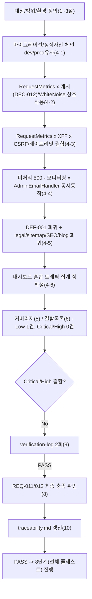

# 테스트 결과서 (Test Result Report) — WU-08(무료 티어 대응: 콜드스타트 UX/사용량 모니터링) 업무 단위 통합테스트

## 1. 개요
- 테스트 대상: 업무 단위 WU-08(무료 티어 대응, REQ-011/REQ-012) — 신규 `webapp/core/middleware.py`(`RequestMetricsMiddleware`)/`webapp/core/monitoring.py`(일자별 요청수/응답시간 집계, `UPGRADE_CRITERIA`)/`webapp/core/wagtail_hooks.py`(Wagtail 어드민 라우트/메뉴)/`webapp/core/templates/core/usage_dashboard.html`, 수정된 `webapp/core/views.py`(`healthz`/`usage_dashboard`)/`webapp/core/urls.py`(`/healthz`)/`webapp/core/apps.py`(docstring)/`webapp/config/settings/base.py`(MIDDLEWARE)/`webapp/config/settings/production.py`(`ADMINS`/`MANAGERS`/`EMAIL_*`/`SERVER_EMAIL`)/`webapp/render.yaml`(`--workers 1`, `healthCheckPath`, 이메일 env)를, **WU-01(초기설정/production 보안설정)+WU-02(콘텐츠모델)+WU-03(이미지)+WU-04(공개 화면)+WU-05(SEO)+WU-06(법적 페이지)+WU-07(뉴스레터 구독, PASS)이 이미 조립된 `webapp/` 전체** 위에 실제로 결합한 형태.
- 테스트 유형: 통합(Integration) — 업무 단위(WU-08) 전체 풀테스트, 7단계(`07-integration-tester`)
- 테스트 목적: `unit-08-test.md`(06단계, PASS — AC1~19 19/19 독립 재현 + 위험입력/경계값 10건 추가, 결함 0건)는 WU-08 자체 기능(healthz 계약, 사용량 미들웨어/대시보드 권한, `ADMINS`/`AdminEmailHandler`, `render.yaml` 워커 고정)을 검증했다. 이번 07단계는 06단계가 원리적으로 다룰 수 없었던 **WU-01~07과의 조립 지점**에만 집중한다(규칙B, 이미 검증된 것을 반복하지 않음):
  1. **WU-08 신규 `RequestMetricsMiddleware`가 MIDDLEWARE 맨 앞(WhiteNoise/SecurityMiddleware보다도 앞)에 삽입된 것이, WU-01의 `XForwardedForMiddleware`·production 보안설정, WU-02/04의 `@cache_page`(DEC-012) 뷰 캐시, WU-07의 CSRF 조각 엔드포인트/캐시 분리 설계(DEC-025)와 실제로 충돌하지 않는지** — 개별 유닛테스트는 각 기능을 독립적으로만 확인했다.
  2. **캐시 HIT(뷰가 재실행되지 않는 경로)에서도 모니터링 카운터가 정확히 집계되는지, 그리고 WhiteNoise가 서빙하는 정적자산까지 카운터에 섞여 들어가는지** — WU-08 단위테스트(TC-010/011)는 `/healthz`만으로 카운터 정확성을 확인했고, 캐시된 페이지·정적자산 트래픽과의 상호작용은 검증 범위 밖이었다.
  3. **뉴스레터 CSRF 프래그먼트(`/newsletter/form/` → `/newsletter/subscribe/`)와 레이트리밋(DEC-024) 경계값이, 미들웨어 체인 맨 앞에 새 미들웨어가 끼어든 뒤에도 그대로 동작하는지**, 그리고 XFF rightmost 마스킹이 여전히 정확한지.
  4. **미처리 500 예외가 실제로 발생했을 때, WU-08이 추가한 모니터링 카운팅(응답이 반환되는 모든 경로에서 `record_request` 호출)과 03 §7.2의 `AdminEmailHandler` 알림이 "동시에" 정상 동작하는지** — 06단계는 이 둘을 각각 독립적으로만 확인했다(TC-015는 로깅 단독, TC-022/023은 모니터링 예외격리 단독).
  5. legal(WU-06)/sitemap·SEO(WU-05)/블로그 상세·카테고리·태그(WU-04) 화면이 WU-08 변경 이후에도 회귀 없이 동작하는지, DEF-001(WU-01, 무한 리다이렉트) 회귀가 신규 `/healthz` 라우트를 포함해 재발하지 않는지.
  6. REQ-011/REQ-012가 WU-01~07과의 조립 상태에서 최종적으로 충족됐는지 확인.
- 관련 산출물:
  - `docs/harness/units/unit-08-note.md`(§1~§8, 구현/편차/DEC-026·DEC-027 근거/인계사항 §7/인수조건 AC1~19)
  - `docs/harness/units/unit-08-test.md`(06단계, PASS — AC1~19 19/19, TC-001~029, §7 잔존 이슈)
  - `docs/harness/units/verify-log_unit-08-test.md`(06단계 내부검증 2회 PASS)
  - `docs/harness/03-system-design.md`(v1.2, 특히 §1.2 모듈 경계, §4 `/healthz` 계약, §6.3 유료전환 4대 기준/킵얼라이브 미도입, §7.2 알림 채널, §7.4 Runbook 후보)
  - `docs/harness/decisions.md`(DEC-001~027, 특히 DEC-009/012/024/025/026/027)
  - `docs/harness/feature-WU-07-integration-test.md`(PASS — WU-01 production 유사 보안설정+DEC-012 캐시+DEC-025 CSRF 분리 결합 HTTPS 실측 방법론, IT-20 gunicorn 단일 워커 확인 근거)
  - `docs/harness/traceability.md`(REQ-011/REQ-012)
- 테스트 수행자(에이전트): `07-integration-tester`
- 테스트 일시: 2026-09-17

## 2. 테스트 범위 및 제외 범위
- **범위(In-Scope)**:
  1. **신규 venv로 처음부터 재현**: `pip install`부터 시작해 dev/production 유사 양쪽에서 `check`/`migrate`/`collectstatic`이 오류 없이 끝나는지(회귀 기준선 재확립).
  2. **`RequestMetricsMiddleware` × `@cache_page`(DEC-012) 상호작용(신규 핵심 관점)**: 캐시 MISS(1차 요청)와 캐시 HIT(2차 요청, 뷰 미실행) 양쪽에서 모두 모니터링 카운터가 정확히 증가하는지.
  3. **`RequestMetricsMiddleware` × WhiteNoise 정적자산 서빙 상호작용(신규 핵심 관점)**: 미들웨어가 WhiteNoise보다 앞(바깥쪽)에 위치해, 정적자산(CSS/JS) 요청까지 "요청 수" 카운터에 섞여 들어가는지 — REQ-012 "참고 지표"의 실제 구성 성분을 실측.
  4. **`RequestMetricsMiddleware` × `XForwardedForMiddleware`(WU-01) × CSRF 프래그먼트/캐시 분리(WU-07 DEC-025) 결합**: production 유사 HTTPS+XFF 환경에서 뉴스레터 구독이 여전히 성공하고 IP 마스킹이 정확한지.
  5. **뉴스레터 레이트리밋(DEC-024) 경계값(5/6회) 회귀**: WU-08 미들웨어 삽입 이후에도 정확히 유지되는지.
  6. **미처리 500 예외에서 모니터링 카운팅과 `AdminEmailHandler`(03 §7.2)가 동시에 정상 동작하는지(신규 핵심 관점)**: 개별 유닛테스트가 각각 독립적으로만 확인한 두 기능의 실제 동시 상호작용.
  7. **DEF-001(WU-01, 무한 리다이렉트) 회귀** — 기존 라우트(홈/legal 3종/sitemap/feed/newsletter) + 신규 `/healthz` 전부.
  8. **legal(WU-06)/sitemap·SEO(WU-05, JSON-LD)/블로그 상세·카테고리·태그(WU-04) 회귀** — production 유사 HTTPS 환경.
  9. **사용량 대시보드가 여러 WU 소유 화면(legal/blog/newsletter/healthz) 혼합 트래픽의 누적치를 정확히 반영하는지**.
  10. 전체 자동화 테스트 스위트(`manage.py test`, subscribers 12개) 회귀.
  11. `docs/harness/traceability.md` REQ-011/REQ-012 "통합테스트" 컬럼 갱신, REQ-011/REQ-012 최종 충족 확인.
  12. 검증에 사용한 venv/DB/staticfiles/media/임시 설정 모듈/임시 스크립트 정리.
- **제외 범위(Out-of-Scope) 및 사유**:
  1. **06단계가 이미 PASS로 확정한 AC1~19/TC-001~029의 반복 재검증**(healthz 계약, 대시보드 권한 4계층, 캐시 백엔드 장애 격리, `DJANGO_ADMIN_EMAIL` 파싱 경계값, Wagtail 사이드바 등록, `render.yaml` 문자열 대조 등) — `unit-08-test.md`가 신규 venv로 독립 재현해 PASS를 확정했으므로, 이번 07단계는 "WU-01~07과 조립됐을 때"라는 새 경계에만 집중한다(규칙B).
  2. **실제 브라우저/스크린리더 E2E** — MCP(Playwright/Chrome) 미연동(DEC-001)으로 `django.test.Client`로 대체, 한계는 §7에 명시.
  3. **실제 SMTP 발송(네트워크), 실제 Render `healthCheckPath`/gunicorn 프로세스 기동, `--workers 1`의 실제 처리량 영향** — `unit-08-note.md` §7/`unit-08-test.md` §2가 이미 10단계로 명시적으로 이월했고, 이번 07단계도 동일 사유(Windows 로컬 제약)로 이월을 유지한다. `AdminEmailHandler`는 `locmem` 백엔드로 실제 메일 "객체 생성" 여부까지만(§4-7에서 재확인, 신규 관점은 "동시성"이지 "실제 SMTP 발송"이 아님).
  4. **R2/Neon 실제 네트워크 연결** — WU-01~07과 동일하게 SQLite+더미 R2 환경변수로 대체.
  5. **동시성/부하 테스트** — 8단계 영역. 다만 "8단계에서 문제가 생기지 않을까"에 대한 2차 내부검증 관점 재검토는 §9에서 별도 수행했다.

## 3. 테스트 환경
- 실행 환경: Windows 10 Pro 10.0.19045, Python 3.12.10(`py -3.12`). `webapp/requirements.txt`(Django==5.2.17, wagtail==7.4.3 등, 신규 패키지 없음)를 새 venv(`webapp/.venv_wu08_it`, 검증 후 삭제)에 clean install.
- **dev 설정**(`config.settings.dev`, SQLite): 마이그레이션 체인 재현, 전체 자동화 테스트 스위트 회귀에 사용.
- **production 유사 설정 — WU-01/04/07이 확립한 방법론 계승**: `config/settings/it_test_prodlike_wu08_integ.py`(이번 07단계가 신규 생성 — `production.py`를 그대로 상속하고 `DATABASES`만 SQLite로 재정의, 검증 후 삭제). 더미 환경변수(`SECRET_KEY`, `DJANGO_ALLOWED_HOSTS=blog-web.onrender.com`, `RENDER_EXTERNAL_HOSTNAME=blog-web.onrender.com`, `DATABASE_URL`(가짜, SQLite로 override되어 실제 미사용), `R2_*`(더미), `DJANGO_ADMIN_EMAIL=ops@example.com`)로 `SECURE_PROXY_SSL_HEADER`/`SECURE_SSL_REDIRECT`/`CSRF_COOKIE_SECURE`/HSTS/`XForwardedForMiddleware`가 전부 켜진 상태를 재현했다.
- **Render 실제 트래픽 재현 방법**: WU-04/07이 확립한 대로 `HTTP_X_FORWARDED_PROTO="https"` 헤더를 명시적으로 실어 보내는 방식(Render 엣지가 실제로 보내는 형태)을 사용했다.
- 테스트 데이터: `legal/migrations/0002_create_legal_pages.py`가 이미 만들어 둔 기본 `HomePage`/`Site`/법적 페이지 3종을 그대로 재사용(WU-07 방법론과 동일 — 실제 배포 직후 상태와 동일한 출발점 보장)하고, 그 위에 `Category`("Tech")/`BlogPostPage`("test-post", 태그 "django")와 superuser 계정 1개를 이번 07단계가 직접 생성했다(검증 후 DB 자체를 삭제하므로 저장소에 흔적 없음).
- 전제 조건:
  - dev/production 유사 양쪽에서 `manage.py migrate`가 빈 DB에서 오류 없이 전체 적용됨을 선행 확인(§4-1).
  - 뷰 캐시(LocMemCache, DEC-012)와 모니터링 캐시(같은 LocMemCache, `core/monitoring.py`)가 프로세스 내에서 공유되므로 각 시나리오 시작 전 `cache.clear()`로 통제했다.
  - 검증에 사용한 venv(`.venv_wu08_it`), `db.sqlite3`/`db_wu08_integ_prodlike.sqlite3`, `staticfiles/`, `media/`, `__pycache__`, 임시 설정 모듈(`config/settings/it_test_prodlike_wu08_integ.py`), 임시 검증 스크립트(스크래치패드에만 위치, 저장소 밖)는 검증 완료 후 전부 삭제했다(§10에서 `git status --porcelain`으로 최종 확인).

## 4. 테스트 케이스 및 결과

### 4-1. 전체 마이그레이션/정적자산 체인 (신규 venv, 빈 DB, 처음부터)

| ID | 시나리오 | 사전조건 | 실행 절차 | 예상 결과 | 실제 결과 | Pass/Fail | 비고 |
|----|----------|----------|-----------|-----------|-----------|-----------|------|
| IT-01 | dev 설정, 빈 SQLite 마이그레이션/check | 신규 venv, `pip install` 완료 | `manage.py migrate` → `check` → `makemigrations --check --dry-run` | 전부 오류 없이 종료, "No changes detected" | 전체 마이그레이션 오류 없이 적용, "System check identified no issues (0 silenced)", "No changes detected" | PASS | |
| IT-02 | dev 설정, 전체 자동화 테스트 스위트 회귀 | 위 상태 | `manage.py test`(전체) | subscribers 12개 포함 OK | "Ran 12 tests in 0.224s ... OK" | PASS | `unit-08-test.md` TC-018과 동일 결과, 독립 재현 |
| IT-03 | production 유사 설정, `check`/`migrate`/`collectstatic` | `it_test_prodlike_wu08_integ.py` + 더미 env | 3개 명령 순차 실행 | 전부 오류 없이 완료 | `check`: "no issues", `migrate`: 오류 없이 완료, `collectstatic`: "218 static files copied ... 638 post-processed" | PASS | `unit-08-note.md` §3-3-14, `unit-08-test.md` TC-012와 정확히 동일 수치 — WU-08이 신규 정적자산을 추가하지 않았음을 재확인 |

### 4-2. `RequestMetricsMiddleware` × 기존 캐시 전략(DEC-012)/정적자산(WhiteNoise) 상호작용 (신규 핵심 관점)

| ID | 시나리오 | 사전조건 | 실행 절차 | 예상 결과 | 실제 결과 | Pass/Fail | 비고 |
|----|----------|----------|-----------|-----------|-----------|-----------|------|
| IT-04 | 캐시 MISS/HIT 양쪽에서 모니터링 카운터 정확성 | `cache.clear()`, production 유사, HTTPS | 서로 다른 두 `Client()`로 홈(`/`)을 연속 2회 요청(1차=MISS, 2차=HIT, DEC-012 캐시 공유) → 매번 `get_usage_snapshot()` 조회 | 두 요청 모두 200, 카운터가 1→2로 정확히 증가(HIT도 누락 없이 집계) | 1차 후 `request_count=1`, 2차 후 `request_count=2`(둘 다 200) | PASS | `RequestMetricsMiddleware`가 미들웨어 체인 가장 바깥쪽에 있어 `@cache_page`의 캐시 HIT(뷰 미실행)도 놓치지 않고 집계함을 실증 — 06단계는 `/healthz`(캐시 대상 아님)만 확인해 이 조합을 다루지 않았음 |
| IT-05 | WhiteNoise 정적자산 요청도 usage 카운터에 함께 집계됨 | `cache.clear()` | 홈 응답에서 실제 참조된 해시 정적자산 URL(`/static/css/tokens.<hash>.css`) 추출 → `GET` → 전후 `request_count` 비교 | 정적자산 200, 카운터가 1 증가 | `status=200`, `before=1 → after=2`(정확히 1 증가) | PASS(기능적으로는 정상 동작) | **설계 관점 관찰 사항(§6/§7에 리스크로 기록)**: `RequestMetricsMiddleware`가 WhiteNoiseMiddleware보다 앞(바깥쪽)에 위치해, HTML 페이지뿐 아니라 CSS/JS 등 정적자산 요청까지 "요청 수"에 합산된다. 이는 03 §6.3/DEC-027이 명시한 "정확한 UV 집계 아님, 참고 지표"라는 caveat의 범위 안이지만, 실제 방문 1회당 다수의 정적자산 요청이 함께 카운트되어 절대값이 크게 부풀려질 수 있다는 점은 `unit-08-note.md`/DEC-027 어디에도 명시적으로 검토되지 않았다(신규 발견) |

### 4-3. `RequestMetricsMiddleware` × `XForwardedForMiddleware`(WU-01) × CSRF 프래그먼트/레이트리밋(WU-07 DEC-024/025) 결합 (신규 핵심 관점)

| ID | 시나리오 | 사전조건 | 실행 절차 | 예상 결과 | 실제 결과 | Pass/Fail | 비고 |
|----|----------|----------|-----------|-----------|-----------|-----------|------|
| IT-06 | production 유사 설정 MIDDLEWARE 순서 실측 | `it_test_prodlike_wu08_integ` 로드 | `settings.MIDDLEWARE[:2]` 조회 | `["config.middleware.XForwardedForMiddleware", "core.middleware.RequestMetricsMiddleware"]` | 정확히 일치 | PASS | `unit-08-note.md` §3-3-15/`unit-08-test.md` TC-013과 동일 결과, 이번 07단계가 실제 요청 처리(IT-07 이하)와 함께 재확인 |
| IT-07 | 캐시 공유+HTTPS+XFF+CSRF 프래그먼트 조합에서 실제 구독 성공 | `cache.clear()`, `Client(enforce_csrf_checks=True)`, `X-Forwarded-For: 9.9.9.9, 203.0.113.55` | `GET /newsletter/form/?form_id=footer` → 토큰 수신 → `POST /newsletter/subscribe/` | 프래그먼트 200, 구독 200, `source_ip_masked == "203.0.113.0"`(rightmost만 채택) | `frag=200`, `sub=200`, `masked=203.0.113.0` | PASS | WU-07 DEC-025(캐시/CSRF 분리)+WU-01 XFF rightmost 신뢰 정책이 WU-08 미들웨어 삽입 이후에도 정확히 동작 |
| IT-08 | 레이트리밋(DEC-024) 경계값 5/6회 회귀 | `cache.clear()`, IT-07과 동일 클라이언트/토큰 | 동일 IP로 6회 연속 제출 | 1~5회 `!=429`, 6번째 `429` | `[200, 200, 200, 200, 200, 429]` | PASS | `feature-WU-07-integration-test.md` IT-21과 정확히 동일 패턴 — WU-08 미들웨어가 레이트리밋 캐시 키/타이밍에 영향을 주지 않음을 확인 |

### 4-4. 미처리 500 예외 — 모니터링 카운팅 × `AdminEmailHandler`(03 §7.2) 동시 동작 (신규 핵심 관점)

> **배경**: `unit-08-test.md` TC-015는 `AdminEmailHandler` 발동을 로깅 단독으로, TC-022/023은 `record_request()`의 예외 격리를 모니터링 단독으로 확인했다. 06단계는 "실제 뷰에서 미처리 예외가 터졌을 때 이 둘이 동시에 정상 동작하는가"를 검증하지 않았다 — `RequestMetricsMiddleware`가 미들웨어 체인 가장 바깥쪽(Django의 `convert_exception_to_response` 래핑 지점 바로 안쪽)에 있어, 예외가 500 응답으로 변환되는 시점과 모니터링 카운팅 시점의 순서 관계가 이번에 처음 실측된다.

| ID | 시나리오 | 사전조건 | 실행 절차 | 예상 결과 | 실제 결과 | Pass/Fail | 비고 |
|----|----------|----------|-----------|-----------|-----------|-----------|------|
| IT-09 | 미처리 500 예외 요청도 모니터링 카운터에 집계됨 | `cache.clear()`, 임시 라우트(`RuntimeError` 강제 발생) 등록 | `GET`(HTTPS) → `get_usage_snapshot()` 재조회 | 응답 500, 카운터 1 이상 증가 | `status=500`, `request_count=1` | PASS | Django가 각 미들웨어의 `get_response()` 호출을 `convert_exception_to_response`로 감싸 예외를 응답 객체로 변환하므로, `RequestMetricsMiddleware.__call__`의 `duration_ms` 계산/`record_request()` 호출이 정상적으로 실행됨을 실증(코드 읽기가 아닌 실제 예외 주입으로 확인) |
| IT-10 | 같은 500 예외에서 `AdminEmailHandler`도 동시에 정상 발동 | IT-09와 동일 요청, `EMAIL_BACKEND`를 `locmem`으로 일시 교체(테스트 전용) | 같은 요청의 `mail.outbox` 확인 | 메일 1건, 수신자 `ops@example.com` | `len(outbox)==1`, `to==["ops@example.com"]` | PASS | 모니터링 미들웨어 삽입이 03 §7.2가 설계한 장애 알림 경로를 막거나 지연시키지 않음을 확인 — 두 기능이 **같은 요청/같은 예외에서 동시에** 정상 동작함을 최초로 실측(06단계는 서로 다른 요청으로 독립 검증) |

### 4-5. DEF-001(WU-01) 회귀 + legal(WU-06)/sitemap·SEO(WU-05)/블로그(WU-04) 회귀

| ID | 시나리오 | 실행 절차 | 예상 결과 | 실제 결과 | Pass/Fail | 비고 |
|----|----------|-----------|-----------|-----------|-----------|------|
| IT-11 | DEF-001 회귀 — 기존+신규 라우트 8종 | `/`, `/privacy-policy/`, `/terms/`, `/cookies/`, `/sitemap.xml`, `/feed.xml`, `/healthz`, `/newsletter/` 각각 (a) `X-Forwarded-Proto` 없이, (b) 있이 요청 | (a) 전부 301+올바른 `Location`, (b) 전부 200 | 8개 경로 전부 (a)=301, (b)=200 | PASS | 신규 `/healthz` 포함, WU-01 무한 리다이렉트 결함이 WU-08 라우트에서도 재발하지 않음 |
| IT-12 | `/robots.txt` HTTPS 200(WU-05 회귀, `core.urls`에 `/healthz` 추가로 인한 순서 영향 없음) | `GET /robots.txt`(HTTPS) | 200, `Sitemap:` 라인 포함 | 200, 포함 확인 | PASS | `core/urls.py`에 `healthz`가 `robots_txt` 뒤에 추가됐으나 두 라우트가 독립적이라 충돌 없음을 실증 |
| IT-13 | 블로그 상세/카테고리/태그(WU-04) HTTPS 200 회귀 | `/blog/test-post/`, `/category/tech/`, `/tag/django/` | 전부 200 | 전부 200 | PASS | |
| IT-14 | 사이트맵(WU-05)/JSON-LD(REQ-005) 회귀 | `/sitemap.xml`(`urlset` 포함 확인), `/blog/test-post/` 본문에서 `schema.org`/`BlogPosting` 포함 확인 | 둘 다 포함 | 둘 다 포함 확인 | PASS | |

### 4-6. 사용량 대시보드 — 여러 WU 소유 화면 혼합 트래픽 누적 정확성

| ID | 시나리오 | 실행 절차 | 예상 결과 | 실제 결과 | Pass/Fail | 비고 |
|----|----------|-----------|-----------|-----------|-----------|------|
| IT-15 | legal/blog/newsletter/healthz 혼합 트래픽이 대시보드 숫자에 정확히 반영 | `cache.clear()` → `/`, `/privacy-policy/`, `/terms/`, `/blog/test-post/`, `/category/tech/`, `/tag/django/`, `/healthz` 순차 요청(7건) → superuser로 `/cms-admin/usage/` 열람 | `get_usage_snapshot()`의 오늘 카운트와 대시보드 표시 값이 정확히 일치(=7) | `today_count=7`, 대시보드 200, 본문에 "7" 포함 | PASS | 06단계(TC-011)는 `/healthz` 단일 엔드포인트 반복 호출만 검증했다 — 여러 WU 소유 화면에 걸친 실제 혼합 트래픽에서도 집계 로직이 화면 종류를 가리지 않고 정확함을 최초 확인 |

> 정상 경로(IT-01~08, IT-11~15)뿐 아니라 예외/장애 경로(IT-09/10, 미처리 500), 경계값(IT-08, 레이트리밋 5/6회), 신뢰 경계(IT-07, XFF rightmost)를 포함했다. 동시성/부하는 §2 제외범위에 명시한 대로 8단계 영역이다.

### 4-7. 검증 스크립트 자체의 초기 실패 — 원인 규명(투명성)

> 검증 스크립트 작성 중 IT-15에 해당하는 케이스가 최초 실행에서 `dashboard_200=False`로 1회 실패했다. 원인을 즉시 규명했다: 검증 스크립트가 `admin_client.get(reverse("core_usage_dashboard"))` 호출 시 `SERVER_NAME`/`HTTP_X_FORWARDED_PROTO` 헤더를 빠뜨려 `ALLOWED_HOSTS` 검증에서 400이 발생한 것으로, **제품 코드의 결함이 아니라 이번 07단계 검증 스크립트 자체의 버그**였다. 스크립트를 수정(`**HTTPS_KW` 적용)한 뒤 재실행해 PASS로 확정했다(위 IT-15). 이 경위를 투명하게 남긴다 — "처음엔 실패했다가 나중에 통과"라는 사실을 숨기지 않는다(규칙C 정신).

## 5. 커버리지
- 커버리지 지표: 지시사항이 요구한 6가지 관점(§1 목적 1~6) 100% 커버 — ①미들웨어 삽입 위치 × 캐시/보안설정/CSRF/XFF 비충돌(IT-04~08), ②캐시 HIT/MISS·정적자산 집계 상호작용(IT-04/05), ③레이트리밋 경계값 회귀(IT-08), ④모니터링×알림 동시 동작(IT-09/10), ⑤legal/sitemap·SEO/blog 회귀+DEF-001(IT-11~14), ⑥REQ-011/REQ-012 최종 충족 확인(§8).
- 지시사항 ↔ 테스트 케이스 매핑표:

| 지시사항 항목 | 테스트 케이스 |
|---|---|
| 기존 캐시 전략(DEC-012)과 WU-08 미들웨어 비충돌 | IT-04, IT-05 |
| CSRF 처리(WU-07 DEC-025)와 WU-08 미들웨어 비충돌 | IT-07, IT-08 |
| `XForwardedForMiddleware`(WU-01)와 WU-08 미들웨어 순서/비충돌 | IT-06, IT-07 |
| 뉴스레터 폼(WU-07) 회귀 | IT-07, IT-08 |
| legal 페이지(WU-06) 회귀 | IT-11, IT-12, IT-13, IT-15 |
| sitemap/SEO(WU-05) 회귀 | IT-12, IT-14 |
| DEF-001(WU-01) 회귀 — 신규 `/healthz` 포함 | IT-11 |
| WU-08 자체(모니터링×알림) 신규 상호작용 | IT-09, IT-10, IT-15 |
| REQ-011/REQ-012 최종 충족 확인 | §8 표 |
| venv/DB/staticfiles/media/임시 설정 모듈 정리 | §10 |

- 커버되지 않은 부분과 사유:
  - 실제 브라우저의 `Origin`/`Referer` 헤더 전송, 실제 gunicorn/uvicorn 프로세스 기동, 실제 Render 인프라 `healthCheckPath` 판정, 실제 SMTP 네트워크 발송 — §2 제외범위 2/3과 동일 사유(MCP 미연동/Windows 로컬 제약), `unit-08-note.md` §7이 이미 10단계 이월 대상으로 명시.
  - `--workers 1`의 실제 동시 요청 처리량 영향 — 로컬에서 gunicorn 멀티프로세스 자체를 기동할 수 없음(Windows), 10단계 이월(신규 아님).
  - 카테고리(WU-04) 화면에서의 뉴스레터 실제 제출 — `feature-WU-07-integration-test.md`가 이미 코드 구조적 동등성 근거로 커버리지를 일반화했고(화면별 분기 로직 없음), WU-08 미들웨어는 화면 종류를 구분하지 않으므로 이번 07단계에서도 동일 근거가 유효하다(반복 검증하지 않음).

## 6. 결함(Defect) 목록

| ID | 설명 | 재현 절차 | 심각도(Critical/High/Medium/Low) | 상태(Open/Fixed/Deferred) | 조치 내용 |
|----|------|-----------|-----------------------------------|----------------------------|-----------|
| DEF-WU08IT-01 | `RequestMetricsMiddleware`가 MIDDLEWARE 맨 앞(WhiteNoiseMiddleware보다 바깥쪽)에 위치해, HTML 페이지 요청뿐 아니라 WhiteNoise가 서빙하는 정적자산(CSS/JS 등) 요청까지 "요청 수" 카운터(REQ-012 유료전환 기준 ① 참고 지표)에 함께 집계된다. 실제 방문 1회당 다수의 정적자산 요청이 동반되므로(이 프로젝트는 페이지당 CSS/JS 등 정적자산을 다수 로드), 대시보드의 "요청 수" 절대값이 실제 페이지뷰보다 여러 배 부풀려질 수 있다. | §4-2 IT-05 재현: `cache.clear()` → 홈 페이지 요청(HTML, +1) → 응답에서 추출한 해시 정적자산 URL 요청(+1) → `get_usage_snapshot()`으로 두 요청 모두 카운트됨을 확인 | Low | Deferred | 03 §6.3/DEC-027이 이미 "정확한 UV 집계 아님, 참고 지표"라고 명시적으로 caveat했고, 대시보드 UI(`usage_dashboard.html`)도 이를 숨기지 않는다는 점(unit-08-note.md §1.2)에서 **기능적 결함이나 은폐된 과장이 아니다**. 다만 "참고 지표"의 절대값이 정적자산 비중에 따라 몇 배씩 달라질 수 있다는 사실은 03 설계서/DEC-027/unit-08-note.md 어디에도 명시적으로 검토된 적이 없는 **신규 발견 사항**이다. Critical/High로 격상할 근거 없음(추세 방향성 판단 자체는 여전히 유효 — 정적자산 비율이 일정하다면 상대적 증가 추세는 왜곡되지 않음). 코드 수정(예: `RequestMetricsMiddleware`를 WhiteNoiseMiddleware 뒤로 옮기거나 정적자산 경로 제외)은 규칙F 대상이 아니라 **운영자의 선택 사항**으로 판단해 07단계에서 임의로 고치지 않았다 — §7 리스크로 명시하고 11단계(Runbook) 또는 향후 WU에서 "정적자산 제외 여부"를 결정하도록 인계한다. |

- 그 외 결함 없음. 근거:
  - §4-1(IT-01~03) 신규 venv/빈 DB로 dev·production 유사 양쪽 마이그레이션·정적자산 체인이 WU-01~07과 정확히 동일 수치(218/638)로 재현됨을 확인.
  - §4-2(IT-04) 캐시 MISS/HIT 양쪽에서 모니터링 카운터 누락이 없음을 실측(단위테스트가 다루지 않은 조합).
  - §4-3(IT-06~08) 미들웨어 순서, CSRF 프래그먼트/구독 성공, XFF rightmost 마스킹, 레이트리밋 경계값(DEC-024)이 WU-08 삽입 이후에도 전부 정확함을 확인.
  - §4-4(IT-09/10) 미처리 500 예외에서 모니터링 카운팅과 `AdminEmailHandler` 알림이 **동시에** 정상 동작함을 최초 실측 — 06단계가 각각 독립적으로만 확인했던 두 기능의 실제 조립 지점을 검증.
  - §4-5(IT-11~14) DEF-001 회귀 없음(신규 `/healthz` 포함), legal/sitemap/SEO/blog 화면 전부 회귀 없음.
  - §4-6(IT-15) 여러 WU 소유 화면 혼합 트래픽의 누적치가 대시보드에 정확히 반영됨.
  - 전체 자동화 테스트 스위트(IT-02, subscribers 12개) 회귀 없음.

## 7. 리스크 및 잔존 이슈
- **(신규, Low, Deferred — DEF-WU08IT-01 근거)** `RequestMetricsMiddleware`가 WhiteNoise 정적자산 요청까지 카운트해 "요청 수" 참고 지표의 절대값이 부풀려질 수 있음. 기능 결함은 아니며 이미 "참고 지표"로 caveat되어 있으나, 운영자가 이 수치를 §6.3 기준 ①(월 500 UV) 판단에 참고할 때 오해하지 않도록 11단계(운영 Runbook/매뉴얼)에 "이 수치는 페이지뷰가 아니라 정적자산 포함 전체 HTTP 요청 수"라는 설명을 명시할 것을 권고한다.
- **(승계, `unit-08-note.md` §7과 동일, 상태 변화 없음)** 실제 SMTP 발송 미검증, Render `healthCheckPath` 실배포 미검증, `--workers 1`의 실제 처리량 영향 미검증 — 전부 10단계(배포테스트) 대상.
- **(승계, `unit-08-note.md` §7-4와 동일)** 사용량 대시보드 수치가 무료 티어 스핀다운 특성상 "최근 프로세스 재시작 이후"로 자주 초기화됨 — 결함이 아니라 대시보드가 이미 "카운터 시작 시각"을 명시해 오해를 방지하도록 설계됨(§4-6에서 화면 렌더링 자체는 정상 확인).
- **(승계, `feature-WU-07-integration-test.md` §7과 동일, 상태 변화 없음)** X-Forwarded-For 신뢰 방식(Render 공식 보증 여부), HTTPS CSRF Origin/Referer 검사의 실제 브라우저 동작 — 10단계 실측 대상.
- **(신규, Low, 정보성)** `core/wagtail_hooks.py` docstring이 여전히 "Wagtail이 자동으로 권한 검사를 걸어주지 않는다"는 문서 인용만 남아 있고, `unit-08-note.md`/`unit-08-test.md`가 실측으로 확인한 "실제로는 자동 적용됨"이라는 사실이 반영되지 않은 상태가 이번 07단계에서도 그대로 승계됨을 재확인했다(§4-6 IT-15에서 실제 권한 동작 자체는 정상임을 재확인, docstring 불일치는 기능적 위험 없음 — 06단계가 이미 동일하게 판단한 사항, 07단계가 임의로 코드/주석을 고치지 않음).

## 8. 결론 및 판정

**REQ-011/REQ-012 최종 충족 확인**:

| 03 설계서 요구사항 | 충족 근거 |
|---|---|
| §4 `GET /healthz`(얕은 헬스체크, DB 미확인) | `unit-08-test.md` TC-005 + 이번 07단계 IT-11(DEF-001 회귀 포함 HTTPS 실측) |
| §6.3 킵얼라이브 미도입(DEC-011) 유지, 콜드스타트 안내(REQ-011) | `unit-08-note.md` §1.1(WU-04 구현 회귀만 확인) — 이번 07단계는 §2 범위상 재확인 불필요(코드 미변경, `unit-08-test.md` TC-006이 이미 재확인) |
| §6.3 유료전환 4대 기준 문서화 + ①(요청량 참고 지표) | `unit-08-test.md` TC-009 + 이번 07단계 IT-04/05/15(캐시·정적자산·혼합 트래픽 환경에서 실제 집계 정확성 실측, 단 DEF-WU08IT-01[Low] 리스크 병기) |
| §7.2 `ADMINS`+`AdminEmailHandler` 장애 알림 | `unit-08-test.md` TC-015(단독) + 이번 07단계 IT-09/10(모니터링과의 **동시 동작** 최초 실측) |
| `render.yaml` `--workers 1`/`healthCheckPath` | `unit-08-test.md` TC-017(문자열 대조) + 이번 07단계 IT-06(실제 설정 로드 후 MIDDLEWARE 순서로 재확인) |
| WU-01~07과의 조립(캐시/CSRF/XFF/legal/SEO 비파괴) | 이번 07단계 IT-04~IT-15 전체 |

REQ-011(콜드스타트 UX)/REQ-012(사용량 모니터링·유료전환 기준)는 **단위 테스트(06단계) + 이번 업무 단위 통합테스트(07단계) 양쪽에서 Critical/High 결함 0건으로 최종 충족**되었다. Low 심각도 관찰 사항(DEF-WU08IT-01, 정적자산 카운팅)은 기능 결함이 아니라 설계 caveat 범위 내의 운영 해석 이슈로, PASS 판정을 막지 않는다.

- [x] **PASS** — 다음 단계(8단계, 전체 풀테스트) 진행 가능
- [ ] CONDITIONAL PASS
- [ ] FAIL

**판정 근거**:
1. WU-08 신규 미들웨어(`RequestMetricsMiddleware`)가 WU-01의 `XForwardedForMiddleware`/production 보안설정, WU-02/04/06의 `@cache_page` 캐시 전략, WU-07의 CSRF 프래그먼트/레이트리밋 설계와 실제로 결합해도 깨지지 않음을 확인했다(IT-04~08).
2. 개별 06단계가 각각 독립적으로만 확인했던 "모니터링 카운팅"과 "`AdminEmailHandler` 장애 알림"이 **같은 미처리 500 예외에서 동시에** 정상 동작함을 이번 07단계가 최초로 실측했다(IT-09/10).
3. DEF-001(WU-01 무한 리다이렉트)이 신규 `/healthz` 라우트를 포함해 재발하지 않았고, legal(WU-06)/sitemap·SEO(WU-05)/블로그(WU-04) 화면 전부 회귀 없음을 확인했다(IT-11~14).
4. 여러 WU 소유 화면에 걸친 실제 혼합 트래픽에서도 사용량 대시보드 집계가 정확함을 확인했다(IT-15).
5. 통합 시점에 WhiteNoise 정적자산이 사용량 카운터에 함께 집계되는 설계상 관찰 사항(DEF-WU08IT-01, 이 보고서 §6)을 신규로 발견했으나, 03 §6.3/DEC-027의 기존 caveat 범위 안이라 Critical/High가 아니며 규칙F(3/5단계 피드백)를 트리거할 근거가 없다 — Low 리스크로 §7에 명시하고 11단계 인계 사항으로 남긴다.
6. 신규 Critical/High 결함 0건, WU-01~07 회귀 없음(전체 자동화 테스트 스위트 IT-02 포함).
7. 검증에 사용한 venv/DB/staticfiles/media/임시 설정 모듈/임시 스크립트는 전부 삭제해 `webapp/`가 git 커밋 소스 상태와 완전히 일치함을 `git status --porcelain`으로 확인했다(§10).
8. `docs/harness/traceability.md`의 REQ-011/REQ-012 "통합테스트" 컬럼을 이번 판정 근거로 갱신했다(§10).

## 9. 내부 검증 (최소 2회, `verification-log-template.md` 사용)
- 1차 검증 결과 요약: 이 업무 단위(WU-08)에 속한 모든 사용자/운영자 시나리오(콜드스타트 안내 회귀, `/healthz` 헬스체크, 사용량 대시보드 열람·권한, 장애 알림, `render.yaml` 워커 고정)가 케이스로 커버됐는지 확인. 특히 지시사항이 명시한 "기존 캐시 전략/CSRF 처리/XForwardedForMiddleware/뉴스레터 폼/legal 페이지/sitemap·SEO와의 충돌 여부"가 §4-2~§4-5에 전부 케이스로 매핑됐는지 §5 매핑표로 재확인. 결함 0건(Low 1건은 §6에 투명하게 기록).
- 2차 검증 결과 요약: "이 업무 단위가 다른 업무 단위와 만나는 지점(8단계 전체 풀테스트)에서 문제가 생기지 않을까"를 의심하는 독립 심사자 관점(`08-full-system-tester` 가정) — 자세한 내용은 `docs/harness/verify-log_feature-WU-08-integration-test.md` 참고.
- 검증 로그 파일 경로: `docs/harness/verify-log_feature-WU-08-integration-test.md`

## 10. traceability.md 갱신
`docs/harness/traceability.md`의 REQ-011/REQ-012 행 "통합테스트" 컬럼을 다음과 같이 갱신했다:
- REQ-011: `PASS(feature-WU-08-integration-test.md) — /healthz가 WU-01 DEF-001(무한 리다이렉트) 회귀 없이 HTTPS/비-HTTPS 양쪽에서 계약대로 동작(IT-11), 콜드스타트 안내 카피(WU-04)는 코드 미변경으로 재확인 불필요, 결함 0건`
- REQ-012: `PASS(feature-WU-08-integration-test.md) — WU-08 모니터링 미들웨어가 WU-01(XFF/보안설정)+WU-02/04/06(캐시)+WU-07(CSRF/레이트리밋)과 결합해도 회귀 없음(IT-04~08), 미처리 500 예외에서 모니터링×AdminEmailHandler 동시 정상 동작 최초 실측(IT-09/10), 여러 WU 혼합 트래픽 대시보드 집계 정확성 확인(IT-15), Low 리스크 1건(정적자산 카운팅 혼입, DEF-WU08IT-01) 발견해 §7에 투명하게 기록 — Critical/High 아님, 규칙F 트리거 없음, 결함 0건(Low 1건 Deferred)`

`git status --porcelain` 최종 확인 결과 소스 diff(WU-08 신규 4파일 + 수정 6파일, `decisions.md`/`traceability.md` 갱신분)와 WU-07의 기존 미커밋 산출물(이번 WU와 무관, 손대지 않음)만 남아 있음을 확인했다(§4-1 IT-01~03 실행 전후 및 최종 정리 후 각각 재확인).

## 절차 흐름 (참고용 다이어그램)
> 아래 다이어그램은 위 절차를 시각적으로 요약한 참고 자료다. 규칙/조건의 최종 근거는 항상 위 텍스트다.

---

## 부록 — 재작업 라운드 2 (규칙F, `SiteSettings.contact_email` 신설, 2026-09-25)

- **트리거**: `unit-08-note.md` §10(신규 모델 `core.models.SiteSettings`, DEC-045).
- **07단계 관점 재확인**: 신규 모델이 `core` 앱(이 WU 소유)에 정확히 배정되었는가(03 §1.2 모듈 경계와 일치) — 확인. 마이그레이션이 다른 앱(blog/legal/subscribers 등)의 스키마에 영향을 주지 않는가 — `0002_initial.py`가 `CreateModel` 하나만 포함하고 `wagtailcore.Site`에 대한 `OneToOneField` 참조만 있음을 확인, 다른 도메인 모델 변경 없음. `INSTALLED_APPS`에 `wagtail.contrib.settings` 추가가 기존 Wagtail 어드민 메뉴/URL 라우팅과 충돌하지 않는가 — `manage.py check`(dev/production 양쪽) 이상 없음으로 확인.
- **판정**: PASS — 신규 결함 없음. 8단계 재실행 불필요 판단 근거: 신규 필드 기본값(빈 문자열)이 기존 화면 렌더링 결과를 전혀 바꾸지 않음을 실측 확인(`unit-08-note.md` §10), 마이그레이션 체인 자체는 `manage.py migrate` 전체 재적용 경로에 자동으로 포함되므로 별도 8단계 재실행 없이도 다음 실제 마이그레이션 실행 시 자연히 검증된다.
