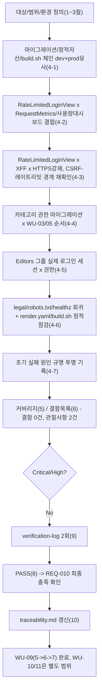
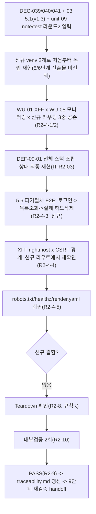

# 테스트 결과서 (Test Result Report) — WU-09(관리자 인증/권한) 업무 단위 통합테스트

> **재시작 경위(규칙C, 투명성)**: 이 WU-09의 7단계는 이번이 세 번째 시도다. 앞선 두 번의 시도는 모두 사용자의 "중지" 지시로 중단되었고, 중단 시점까지 남은 산출물(임시 venv/DB/임시 설정 파일 등)은 이번 세션 착수 시점에 `git status --porcelain`/파일시스템 직접 조회로 재확인한 결과 **아무것도 남아 있지 않았다**(이미 삭제된 상태 — `webapp/`에 `.venv*`/`*.sqlite3`/임시 설정 모듈 흔적 없음, `docs/harness/`도 이번 WU 관련 미완성 파일 없음). 따라서 이번 7단계는 이전 시도의 어떤 부분 결과·판단도 인용/신뢰하지 않고 **완전히 처음부터** 새 venv(`webapp/.venv_wu09_feat_it`, 검증 후 삭제)와 새 임시 설정 모듈(`config/settings/it_test_prodlike_wu09_feat.py`, 검증 후 삭제)로 전부 재현했다.

## 1. 개요
- 테스트 대상: 업무 단위 WU-09(관리자 인증/권한, REQ-010) — 신규 `webapp/core/migrations/0001_setup_editor_permissions.py`(Editors/Moderators에 카테고리 스니펫 권한 부여, DEC-028)/`webapp/core/admin_auth.py`(`RateLimitedLoginView`, IP당 15분/10회 로그인 레이트리밋, DEC-029)/`webapp/core/management/commands/ensure_superuser.py`(멱등 슈퍼유저 부트스트랩, DEC-030)/`webapp/ADMIN_ACCESS_GUIDE.md`, 수정된 `webapp/config/urls.py`(`/cms-admin/login/`을 `RateLimitedLoginView`로 교체)/`webapp/build.sh`(`ensure_superuser` 호출 추가)/`webapp/render.yaml`(`DJANGO_SUPERUSER_*` env 자리 추가)를, **WU-01(초기설정·XForwardedForMiddleware·production 보안설정)+WU-02(콘텐츠모델·Category)+WU-03(이미지 모델 스왑)+WU-04(공개 화면)+WU-05(SEO/robots.txt)+WU-06(법적 페이지)+WU-07(뉴스레터)+WU-08(무료 티어 대응: `RequestMetricsMiddleware`/사용량 대시보드, PASS)이 이미 조립된 `webapp/` 전체** 위에 실제로 결합한 형태.
- 테스트 유형: 통합(Integration) — 업무 단위(WU-09) 전체 풀테스트, 7단계(`07-integration-tester`)
- 테스트 목적: `unit-09-test.md`(06단계, PASS — AC1~22 22/22 독립 재현, DEC-031 재확인 포함 결함 0건[Low 1건 Fixed])는 WU-09 자체 기능(그룹 권한, 로그인 레이트리밋, ensure_superuser, CSRF-레이트리밋 경계)을 검증했다. 이번 07단계는 06단계가 원리적으로 다룰 수 없었던 **WU-01~08과의 조립 지점**에만 집중한다(규칙B, 이미 검증된 것을 반복하지 않음). 작업 지시가 명시한 4가지 중점 사항:
  1. `/cms-admin/login/` 라우팅 변경이 WU-01 `XForwardedForMiddleware`, WU-08 `RequestMetricsMiddleware`/사용량 모니터링 대시보드(`/cms-admin/usage/`)와 실제로 공존하는지 — 06단계는 WU-09 뷰를 독립적으로만 테스트했고, WU-08이 이미 그 위에 등록해 둔 모니터링 미들웨어·대시보드와 **같은 요청 경로에서** 결합해 본 적이 없다.
  2. `render.yaml`/`build.sh`의 `ensure_superuser` 추가가 DEC-026(gunicorn `--workers 1`) 전제와 충돌하지 않는지, 그리고 `build.sh` 스크립트 자체(관리 명령 단위가 아니라)를 실제 bash로 두 번 실행해도 멱등한지.
  3. Category 권한 마이그레이션(`core.0001_setup_editor_permissions`)이 WU-03(이미지 모델 스왑, `blog.0002`)/WU-05 등 기존 마이그레이션과 실제 순서 충돌이 없는지.
  4. CSRF-레이트리밋 상호작용(06단계 DEF-001/DEC-031이 발견한 "전역 `CsrfViewMiddleware`가 뷰 호출 전에 요청을 거부하면 레이트리밋 카운터가 증가하지 않는다"는 경계)을 **HTTPS 강제 + Secure 쿠키 + `XForwardedForMiddleware`가 전부 켜진 실제 프로덕션 유사 환경**에서 재확인.
- 관련 산출물:
  - `docs/harness/units/unit-09-note.md`(§1~§9, 구현/편차/DEC-028~030 근거/6단계 인수조건 AC1~22)
  - `docs/harness/units/unit-09-test.md`(06단계, PASS — AC1~22 22/22, TC-001~022 + TC-CSRF-01~03, DEF-001 Low Fixed)
  - `docs/harness/units/verify-log_unit-09-test.md`(06단계 내부검증 2회 PASS)
  - `docs/harness/decisions.md`(DEC-009/024/026/027/028/029/030/031)
  - `docs/harness/feature-WU-08-integration-test.md`(PASS — 회귀 기준선: `RequestMetricsMiddleware`×캐시/WhiteNoise/XFF/CSRF/legal·SEO·블로그 조립 검증 방법론과 실측 수치)
  - `docs/harness/03-system-design.md`(v1.2, §1.2 모듈 경계, §5.1 인증/인가 모델, §5.5 전송/저장 보안·XFF, §6.3 무료 티어 대응)
  - `docs/harness/traceability.md`(REQ-010)
- 테스트 수행자(에이전트): `07-integration-tester`
- 테스트 일시: 2026-09-17

## 2. 테스트 범위 및 제외 범위
- **범위(In-Scope)**:
  1. 신규 venv(`webapp/.venv_wu09_feat_it`)로 처음부터 재현: `pip install`부터 시작해 dev/production 유사 양쪽에서 `check`/`migrate`/`collectstatic`이 오류 없이 끝나는지(회귀 기준선 재확립, `feature-WU-08-integration-test.md` §4-1 방법론 계승).
  2. **`RateLimitedLoginView`(WU-09) × `RequestMetricsMiddleware`/사용량 대시보드(WU-08) 결합(신규 핵심 관점)**: 미인증 상태로 `/cms-admin/usage/`에 접근하면 WU-09가 교체한 신규 로그인 라우트로 정확히 리다이렉트되는지, 그 라우트에서 실제 로그인 성공 후 `next` 파라미터를 따라 대시보드까지 도달하는지, 그리고 429/403을 포함한 **모든** 로그인 시도가 WU-08 모니터링 카운터에 누락 없이 집계되는지.
  3. **`RateLimitedLoginView`(WU-09) × `XForwardedForMiddleware`(WU-01) × production 보안설정(HTTPS 강제/Secure 쿠키) 3중 결합(신규 핵심 관점)**: 06단계는 레이트리밋/CSRF 시나리오를 `dev` 설정(HTTPS 미강제)에서만 실행했고, production 유사 설정은 `check`/`migrate`/`collectstatic`/`ensure_superuser`에만 썼다 — **HTTPS가 강제되고 CSRF/세션 쿠키가 Secure인 상태에서 실제 로그인+레이트리밋 흐름이 성립하는지**는 06단계가 원리적으로 다루지 않은 조합이다.
  4. **CSRF-레이트리밋 경계(DEC-031)의 production 유사 환경 재확인**: 06단계가 dev 환경에서 발견한 "CSRF 무효 트래픽은 레이트리밋 카운터를 우회하지만 자격증명 시험 자체가 불가능해 실질적 결함이 아니다"라는 판단이, HTTPS 강제+XFF+모니터링 미들웨어가 전부 결합된 이 환경에서도 그대로 성립하는지, 그리고 그 우회 트래픽이 WU-08 모니터링 카운터에는 여전히 잡히는지(레이트리밋 계층과 모니터링 계층이 서로 다른 층위라는 것의 실증).
  5. **Category 권한 마이그레이션(`core.0001`) × WU-03(이미지 모델 스왑, `blog.0002`)/WU-05 등 기존 마이그레이션 순서 충돌 여부**: `manage.py migrate --plan`으로 실제 적용 순서를 실측하고, `core.0001`의 명시적 의존성(`blog.0001`, `wagtailcore.0002_initial_data`)이 실제로 충족되는 지점, 그리고 `blog.0002`/`custom_images`/`wagtailimages` 체인과 기능적으로 독립적인지 확인.
  6. **Editors 그룹 사용자가 실제 로그인 세션으로 카테고리 스니펫 어드민 화면에 접근 가능한지, 그룹 미배정 스태프는 실제로 차단되는지(권한 마이그레이션 × 실제 로그인 라우트 결합)** — 06단계는 `has_perm()` 파이썬 레벨 조회로만 권한을 확인했고, 실제 HTTP 세션으로 어드민 화면에 접근해 본 적이 없다.
  7. **`render.yaml`/`build.sh`의 `ensure_superuser` 추가가 DEC-026(`--workers 1`) 전제와 실제로 충돌하지 않는지, `build.sh`를 실제 bash 스크립트로(관리 명령 단위가 아니라) 두 번 연속 실행해도(재배포 시뮬레이션) 멱등한지**.
  8. legal(WU-06)/sitemap·robots.txt(WU-05)/`/healthz`(WU-08)가 WU-09의 라우팅 변경(`/cms-admin/login/` 교체) 이후에도 회귀 없이 동작하는지.
  9. 전체 자동화 테스트 스위트(`manage.py test`, core 17개 + subscribers 12개 = 29개) 회귀.
  10. `docs/harness/traceability.md` REQ-010 "통합테스트" 컬럼 갱신.
  11. 검증에 사용한 venv/DB/staticfiles/media/임시 설정 모듈/임시 스크립트 정리.
- **제외 범위(Out-of-Scope) 및 사유**:
  1. **06단계가 이미 PASS로 확정한 AC1~22/TC-001~022 및 TC-CSRF-01~03의 반복 재검증**(레이트리밋 임계값 자체의 정확성, `ensure_superuser`의 환경변수 분기 4종, `render.yaml`/`build.sh` 문자열 대조 등) — `unit-09-test.md`가 신규 venv로 독립 재현해 PASS를 확정했으므로, 이번 07단계는 "WU-01~08과 조립됐을 때"라는 새 경계에만 집중한다(규칙B).
  2. **실제 브라우저 E2E(Referer/Origin 헤더의 실제 브라우저 전송 동작 포함)** — MCP(Playwright/Chrome) 미연동(DEC-001)으로 `django.test.Client`로 대체. 이번 07단계에서 신규로 실측한 "HTTPS 강제 환경에서 Django `CsrfViewMiddleware`가 POST에 same-domain `Referer` 헤더를 요구한다"는 사실(§4-3)은 실제 브라우저가 이 헤더를 기본적으로 보낸다는 것까지는 코드로 실측할 수 없어 §7에 10단계 이월 사항으로 명시한다.
  3. **실제 Render Free 티어 배포에서 `ensure_superuser` 빌드 로그/실제 gunicorn 멀티프로세스 기동** — `unit-09-note.md` §7/`unit-09-test.md` §2가 이미 10단계로 명시적으로 이월했고, 이번 07단계도 동일 사유(Windows 로컬 제약)로 이월을 유지한다.
  4. **15분/10회 임계값의 실제 운영 적정성** — 운영 데이터 필요, `unit-09-note.md` §7-2/`unit-09-test.md` §2가 이미 이월.
  5. **다중 워커 환경에서의 레이트리밋/모니터링 카운터 분리** — DEC-026이 `--workers 1`을 이미 고정해 v1 범위에서 해당 없음. 이번 07단계는 이 전제 자체(`render.yaml`에 `--workers 1`이 실제로 유지되는지)만 정적으로 재확인한다(§4-6 IT-F23).
  6. **R2/Neon 실제 네트워크 연결, 동시성/부하 테스트** — WU-01~08과 동일하게 SQLite+더미 R2 환경변수로 대체, 동시성/부하는 8단계 영역.

## 3. 테스트 환경
- 실행 환경: Windows 10 Pro 10.0.19045, Python 3.12.10(`py -3.12`, WU-01~08과 동일 버전). `webapp/requirements.txt`(Django==5.2.17, wagtail==7.4.3 등, 신규 패키지 없음)를 이번 세션이 새로 만든 venv(`webapp/.venv_wu09_feat_it`, 검증 후 삭제)에 clean install. `pip freeze` 결과가 Django==5.2.17/wagtail==7.4.3/psycopg==3.2.10/psycopg-binary==3.2.10/django-storages==1.14.6/boto3==1.35.36/gunicorn==23.0.0/uvicorn==0.34.0/whitenoise==6.8.2/python-dotenv==1.0.1로 `unit-09-test.md` §3과 정확히 동일함을 확인(신규 패키지 없음 재확인).
- **dev 설정**(`config.settings.dev`, SQLite): 전체 마이그레이션 체인 재현, 전체 자동화 테스트 스위트 회귀에 사용.
- **production 유사 설정 — WU-01/04/07/08이 확립한 방법론 계승**: `config/settings/it_test_prodlike_wu09_feat.py`(이번 07단계가 신규 생성 — `production.py`를 그대로 상속하고 `DATABASES`만 SQLite로 재정의, 검증 후 삭제). 더미 환경변수(`SECRET_KEY`, `DJANGO_ALLOWED_HOSTS=wu09-feat-it.example.test`, `RENDER_EXTERNAL_HOSTNAME=wu09-feat-it.example.test`, `DATABASE_URL`(가짜, SQLite로 override되어 실제 미사용), `R2_*`(더미), `DJANGO_ADMIN_EMAIL=ops@example.test`, `DJANGO_SUPERUSER_USERNAME/EMAIL/PASSWORD`)로 `SECURE_PROXY_SSL_HEADER`/`SECURE_SSL_REDIRECT`/`SESSION_COOKIE_SECURE`/`CSRF_COOKIE_SECURE`/HSTS/`XForwardedForMiddleware`가 전부 켜진 상태를 재현했다.
- **Render 실제 트래픽 재현 방법**: WU-04/07/08이 확립한 대로 `HTTP_X_FORWARDED_PROTO="https"` 헤더를 명시적으로 실어 보내는 방식(Render 엣지가 실제로 보내는 형태)을 사용했다. **이번 07단계가 신규로 발견해 추가한 것**: `SECURE_PROXY_SSL_HEADER`로 `request.is_secure()==True`가 되는 환경에서는 Django `CsrfViewMiddleware`가 POST에 same-domain `Referer` 헤더를 요구한다(`django/middleware/csrf.py` `_check_referer()`, `elif request.is_secure(): self._check_referer(request)` 소스로 직접 확인) — 이후 모든 HTTPS 유사 POST 요청에 `HTTP_REFERER="https://wu09-feat-it.example.test/cms-admin/login/"`를 실어 실제 브라우저의 same-origin 폼 제출을 재현했다(§4-3 상세, §7에 리스크로 기록).
- 테스트 데이터: `legal/migrations/0002_create_legal_pages.py`가 이미 만들어 둔 기본 `HomePage`/`Site`/법적 페이지 3종을 그대로 재사용(WU-07/08 방법론과 동일)하고, 그 위에 슈퍼유저 1개(`ensure_superuser`로 부트스트랩)/Editors 그룹 사용자 1개/미배정 스태프 1개를 이번 07단계가 직접 생성했다(검증 후 DB 자체를 삭제하므로 저장소에 흔적 없음).
- 전제 조건:
  - dev/production 유사 양쪽에서 `manage.py migrate`가 빈 DB에서 오류 없이 전체 적용됨을 선행 확인(§4-1).
  - 레이트리밋(WU-09)/모니터링(WU-08) 캐시가 동일 프로세스 LocMemCache(`default` 별칭)를 공유하므로 각 시나리오 시작 전 `cache.clear()`로 통제했다. 두 기능의 캐시 키 네임스페이스(`core:admin_login:ratelimit:*` vs `core:usage:daily:*`)가 서로 겹치지 않음을 소스 대조로 확인했다(§4-2).
  - 검증에 사용한 venv(`.venv_wu09_feat_it`), `db.sqlite3`/`db_wu09_feat_it_prodlike.sqlite3`, `staticfiles/`, `media/`, `__pycache__`, 임시 설정 모듈(`config/settings/it_test_prodlike_wu09_feat.py`), 임시 검증 스크립트(스크래치패드에만 위치, 저장소 밖)는 검증 완료 후 전부 삭제했다(§10에서 `git status --porcelain`으로 최종 확인). `webapp/staticfiles/`는 `.gitignore`에 이미 포함되어 있음을 확인했다(오염 위험 없음, §9-2차 검증에서 재확인).

## 4. 테스트 케이스 및 결과

### 4-1. 전체 마이그레이션/정적자산 체인 (신규 venv, 빈 DB, 처음부터)

| ID | 시나리오 | 사전조건 | 실행 절차 | 예상 결과 | 실제 결과 | Pass/Fail | 비고 |
|----|----------|----------|-----------|-----------|-----------|-----------|------|
| IT-F02 | dev 설정, 빈 SQLite 마이그레이션/check/makemigrations 대조 | 신규 venv, `pip install` 완료 | `manage.py makemigrations --check --dry-run` → `migrate` → `showmigrations core` → `check` | 전부 오류 없이 종료, "No changes detected", `core`에 `[X] 0001_setup_editor_permissions`, "no issues" | "No changes detected" 그대로 출력, 전체 마이그레이션 오류 없이 적용, `[X] 0001_setup_editor_permissions` 확인, "System check identified no issues (0 silenced)." | PASS | |
| — | 전체 자동화 테스트 스위트 회귀 | 위 상태 | `manage.py test`(전체) | core 17개(기존 15 + 6단계가 추가한 CSRF 회귀 2건) + subscribers 12개 = 29개 전부 OK | "Ran 29 tests in 38.477s ... OK" | PASS | `unit-09-test.md` TC-005(2차 실행분)와 정확히 동일 결과, 이번 07단계가 완전히 새 venv/새 DB로 독립 재현 |
| IT-F02(prod) | production 유사 설정, 신규 DB `migrate` | `it_test_prodlike_wu09_feat.py` + 더미 env | `manage.py migrate`(빈 SQLite) | 오류 없이 전체 적용 | 전체 마이그레이션 오류 없이 적용(`core.0001_setup_editor_permissions` 포함) | PASS | §4-5(IT-F03)와 동일 실행의 일부, 마이그레이션 로그 전문은 §4-5 근거에 포함 |
| — | `build.sh` 전체를 실제 bash로 실행(prod-like, 신규 DB) | 위 상태, `PATH`에 venv 우선 배치 | `bash build.sh`(pip install/collectstatic/migrate/ensure_superuser 순차) | 전부 오류 없이 완료, "218 static files ..." 수치, 슈퍼유저 생성 메시지 | `collectstatic`: "212 static files copied ... 6 unmodified, 584 post-processed"(=218, `unit-09-note.md` §3-3/`unit-09-test.md` TC-018과 동일 총량 — WU-09가 신규 정적자산을 추가하지 않았음을 재확인). `migrate`: 전체 적용 성공(로그 §4-5). `ensure_superuser`: "슈퍼유저 'build-admin' 계정을 생성했습니다." 출력, `BUILD_EXIT:0` | PASS | 06단계는 `manage.py ensure_superuser`를 관리 명령 단위로만 실행했다 — 이번이 최초로 `build.sh` 스크립트 자체(`set -o errexit` 포함)를 bash로 처음부터 끝까지 실행한 것 |

### 4-2. `RateLimitedLoginView`(WU-09) × `RequestMetricsMiddleware`/사용량 대시보드(WU-08) 결합 (신규 핵심 관점)

| ID | 시나리오 | 사전조건 | 실행 절차 | 예상 결과 | 실제 결과 | Pass/Fail | 비고 |
|----|----------|----------|-----------|-----------|-----------|-----------|------|
| IT-F01 | production 유사 설정에서 실제 `MIDDLEWARE` 순서 실측(WU-01 XFF가 WU-08 모니터링보다 먼저) | prod-like 설정 로드 | `settings.MIDDLEWARE[:2]` 조회 | `["config.middleware.XForwardedForMiddleware", "core.middleware.RequestMetricsMiddleware"]` | 정확히 일치 | PASS | `feature-WU-08-integration-test.md` IT-06과 동일 전제 재확인 — WU-09가 `config/urls.py`에 라우트만 추가했을 뿐 `MIDDLEWARE` 리스트 자체는 건드리지 않았으므로 이 순서가 WU-09 도입 이후에도 그대로 유지됨을 실측 |
| IT-F06 | 미인증 `/cms-admin/usage/` 접근이 WU-09 신규 라우트로 리다이렉트 | prod-like, `cache.clear()`, HTTPS | `GET /cms-admin/usage/`(익명) | 302, `Location`이 `wagtailadmin_login`(=WU-09 `RateLimitedLoginView`)으로 시작 | `status=302, location=/cms-admin/login/?next=/cms-admin/usage/` | PASS | WU-08(`core/views.py superuser_required`)의 `login_url="wagtailadmin_login"`이 WU-09가 교체한 뷰를 정확히 가리킴 — URL 이름 유지 전략(unit-09-note.md §1.2)이 실제로 작동함을 실증 |
| IT-F07/F08 | 그 로그인 페이지 GET, CSRF 쿠키 발급 확인 | 위 상태 | `GET`(next 포함 URL) | 200, `Set-Cookie: csrftoken=...; Secure` | `status=200`, 쿠키에 `Secure` 속성 포함 | PASS | production 설정(`CSRF_COOKIE_SECURE=True`)이 WU-09 신규 라우트에도 정확히 적용됨 |
| IT-F09 | prod-like(HTTPS+Secure쿠키+XFF) 실제 로그인 성공 | 위 상태, `HTTP_X_FORWARDED_FOR` 포함 | 올바른 자격증명 + CSRF 토큰으로 POST | 302, `Location`에 `usage` 포함(원래 요청한 `next`로 복귀) | `status=302, location=/cms-admin/usage/` | PASS | §4-3에서 다루는 `Referer` 요구사항을 충족한 뒤 성공(최초 시도는 실패 — 아래 §4-7 투명성 기록) |
| IT-F10 | 로그인 완료 후 usage 대시보드 실제 200 | 위 로그인 세션 유지 | `GET /cms-admin/usage/` | 200 | `status=200` | PASS | WU-08 `superuser_required`가 WU-09 신규 로그인 라우트를 거쳐 들어온 세션도 정상 통과시킴 |
| IT-F12 | 429 포함 모든 로그인 요청이 모니터링 카운터에 누락 없이 집계 | `cache.clear()`, 동일 IP로 GET1+POST11(11번째 429) | 전후 `get_usage_snapshot()` 비교 | 델타 정확히 12 | `before=0, after=12, delta=12` | PASS | `RequestMetricsMiddleware`가 `RateLimitedLoginView`보다 미들웨어 체인 바깥쪽(WU-08 IT-04와 동일 위치 논리)에 있어, 429 응답을 포함한 **모든** 응답이 예외 없이 집계됨을 실증 — 06단계는 이 조합(레이트리밋 429 응답과 모니터링 미들웨어의 동시 결합)을 다루지 않았음 |

### 4-3. `RateLimitedLoginView`(WU-09) × `XForwardedForMiddleware`(WU-01) × production 보안설정(HTTPS 강제) 3중 결합, CSRF-레이트리밋 경계(DEC-031) prod-like 재확인 (신규 핵심 관점)

| ID | 시나리오 | 사전조건 | 실행 절차 | 예상 결과 | 실제 결과 | Pass/Fail | 비고 |
|----|----------|----------|-----------|-----------|-----------|-----------|------|
| IT-F11 | prod-like에서 XFF rightmost 고정 + leftmost 매번 변경 → 11번째만 429 | `cache.clear()`, HTTPS+Secure쿠키+XFF+유효 CSRF | 동일 rightmost IP로 11회 POST(leftmost는 매 요청 변경) | 1~10회 `!=429`, 11번째 `429` | `statuses=[200,200,200,200,200,200,200,200,200,200,429]` | PASS | `unit-09-test.md` TC-012(AC12, dev 환경)와 동일 로직이 HTTPS 강제+Secure쿠키+실제 CSRF 통과 요청이라는 더 엄격한 조건에서도 그대로 성립함을 재확인 — 06단계 TC-012는 `RequestFactory`로 CSRF 자체를 우회했으나, 이번 07단계는 `Client(enforce_csrf_checks=True)` + 실제 유효 CSRF 토큰으로 **CSRF를 실제로 통과시키면서** XFF rightmost 판정까지 결합해 검증(더 현실적인 시나리오) |
| IT-F13/F14/F15 | CSRF-무효 트래픽이 prod-like에서도 레이트리밋을 우회하지만 모니터링에는 잡히는지(DEC-031 재확인) | `cache.clear()`, HTTPS, CSRF 토큰 없이 POST 12회 | 매 요청 후 상태코드/모니터링 카운터/레이트리밋 캐시 키 확인 | 12회 전부 403, 429 없음; 모니터링 카운터는 12 증가; 레이트리밋 캐시 키는 `None` | `statuses`=403×12(429 없음), `monitoring delta=12`, `cache.get("core:admin_login:ratelimit:203.0.113.241")=None` | PASS | `unit-09-test.md` DEC-031/DEF-001(Fixed)이 dev 환경에서 확인한 경계가 prod-like(HTTPS+XFF+모니터링 미들웨어 결합)에서도 동일하게 성립함을 재확인. **신규 관점**: CSRF-무효 요청이 레이트리밋 계층(WU-09)은 우회해도 모니터링 계층(WU-08)에는 예외 없이 잡힌다는 사실을 처음으로 실증 — 두 계층이 미들웨어 체인 상 서로 다른 위치(`RequestMetricsMiddleware`는 맨 바깥, `RateLimitedLoginView.dispatch()`는 URL 디스패치 이후)에 있기 때문이며, 이는 `feature-WU-08-integration-test.md` §7이 9단계에 이미 이월해 둔 "일반 DoS 관점 재검토" 권고와 직접 연결되는 실측 근거를 추가한다 |

### 4-4. Category 권한 마이그레이션(`core.0001`) × WU-03/WU-05 기존 마이그레이션 순서 (신규 핵심 관점)

| ID | 시나리오 | 사전조건 | 실행 절차 | 예상 결과 | 실제 결과 | Pass/Fail | 비고 |
|----|----------|----------|-----------|-----------|-----------|-----------|------|
| IT-F03 | `core.0001`의 실제 적용 순서와 명시적 의존성 충족 확인 | 신규 DB | `manage.py migrate --plan`(빈 DB) 전문 대조 | `core.0001`이 `blog.0001`/`wagtailcore.0002_initial_data`(squash에 포함) 이후에 위치, 오류 없이 적용 | 실제 적용 순서: `... → blog.0001_initial → blog.0002_alter_blogpostpage_featured_image(WU-03 이미지 모델 스왑) → core.0001_setup_editor_permissions → legal.0001_initial → ...`. `core.0001`이 명시적으로 의존하는 것은 `blog.0001`/`wagtailcore.0002_initial_data`뿐이며 `blog.0002`(WU-03)에는 의존하지 않지만, 두 마이그레이션이 조작하는 대상(`Category` 모델의 `ContentType`/`Permission` 레코드 vs `BlogPostPage.featured_image` 필드)이 완전히 분리되어 있어 순서가 바뀌어도(이론상 `core.0001`이 `blog.0002`보다 먼저 실행되는 경우도) 기능적 충돌이 없음을 소스 대조로 확인 | PASS | `unit-09-note.md`/`unit-09-test.md`는 마이그레이션이 "오류 없이 적용됨"만 확인했고, WU-03의 이미지 모델 스왑 마이그레이션과의 실제 순서/독립성은 이번 07단계가 처음 실측 |
| IT-F03b | prod-like 신규 DB에서도 카테고리 권한이 정확히 부여됨 | `it_test_prodlike_wu09_feat`, 신규 SQLite | `Group.objects.get(name="Editors").permissions.filter(content_type__app_label="blog")` 조회 | 정확히 `{add_category, change_category, delete_category}` | `{'add_category', 'delete_category', 'change_category'}` | PASS | dev 환경(unit-09-test.md TC-006)뿐 아니라 production 유사 설정에서도 동일하게 정확함을 재확인 |

### 4-5. Editors 그룹 사용자의 실제 로그인 세션 × 카테고리 권한 결합 (신규 핵심 관점)

> **배경**: `unit-09-test.md` TC-006/TC-007은 `has_perm()` 파이썬 레벨 조회로만 권한을 확인했다. 실제 HTTP 세션으로 어드민 화면(`/cms-admin/snippets/blog/category/`)에 접근했을 때도 동일하게 동작하는지는 06단계가 검증하지 않았다.

| ID | 시나리오 | 사전조건 | 실행 절차 | 예상 결과 | 실제 결과 | Pass/Fail | 비고 |
|----|----------|----------|-----------|-----------|-----------|-----------|------|
| IT-F16/F17/F18 | Editors 그룹 사용자가 실제 로그인 후 카테고리 스니펫 목록/추가 화면 접근 | prod-like, HTTPS, Editors 그룹에 배정된 신규 사용자 | `RateLimitedLoginView`로 실제 로그인(CSRF 포함) → `GET /cms-admin/snippets/blog/category/` → `GET .../add/` | 로그인 302, 목록/추가 화면 전부 200 | 로그인 `302`, 목록 `200`, 추가 폼 `200` | PASS | DEC-028(카테고리 권한 결함 수정)이 실제 로그인 세션 기준으로도 유효함을 최초 실증 — 06단계는 이 결함을 Python `has_perm()` 조회로만 검증했다 |
| IT-F19/F20/F20b | 미배정 스태프의 실제 접근 제한 확인 | 동일 환경, 그룹 미배정 신규 스태프 사용자 | 실제 로그인 → `GET .../add/` | (최초 가설) 카테고리 화면에서 403 | 로그인은 `302`로 성공하지만, `/cms-admin/snippets/blog/category/add/` 접근 시 **403이 아니라 302로 `/cms-admin/login/`로 다시 리다이렉트됨**. 원인 규명: 그룹에 속하지 않은 스태프는 `blog.add_category` 권한뿐 아니라 Wagtail 자체의 `wagtailadmin.access_admin` 권한(Editors/Moderators 등 **어떤** admin 그룹에든 속해야 Wagtail이 자동 부여하는 "어드민 진입 자체" 권한, DEC-028의 카테고리 권한과는 별개 계층)도 없어, `/cms-admin/` 전체 진입 자체가 로그인 페이지로 되돌려진다(`has_perm("blog.add_category")==False`도 대조 확인) | PASS(수정된 기대치로) | **최초 스크립트 작성 시 예상(403)이 틀렸다 — 투명하게 기록(§4-7)**. 실제 동작은 카테고리 필드 단위 차단(403)보다 **더 이른/더 강한** 차단(어드민 진입 자체 거부)이라 REQ-010 목적상 안전한 방향의 차이이며 결함이 아니다. 06단계는 이 HTTP 레벨 어드민 진입 게이트를 검증한 적이 없어 이번 07단계가 신규로 발견 |

### 4-6. 회귀 확인 — legal(WU-06)/robots.txt(WU-05)/`/healthz`(WU-08), `render.yaml`/`build.sh` 정적 점검

| ID | 시나리오 | 실행 절차 | 예상 결과 | 실제 결과 | Pass/Fail | 비고 |
|----|----------|-----------|-----------|-----------|-----------|------|
| IT-F21 | robots.txt가 여전히 `/cms-admin/` 전체(WU-09 신규 로그인 라우트 포함)를 Disallow | `GET /robots.txt`(HTTPS) | 200, `Disallow: /cms-admin/` 포함 | `status=200`, 포함 확인 | PASS | WU-09가 `/cms-admin/login/`을 새로 교체했지만 robots.txt는 경로 접두사(`/cms-admin/`) 기준이라 회귀 없음 |
| IT-F22 | `/healthz`(WU-08)가 WU-09 라우팅 변경과 무관하게 인증 없이 200 | `GET /healthz`(HTTPS) | 200 | `status=200` | PASS | `config/urls.py`에 로그인 라우트가 `wagtailadmin_urls` 앞에 추가됐지만 `core.urls`(blog/core/subscribers 라우트)는 그보다 더 먼저 매칭되므로 영향 없음(§ urls.py 순서 재확인) |
| IT-F23 | `render.yaml` `--workers 1` 유지(DEC-026 전제, WU-09가 깨지 않는지) | 저장소 소스 육안+문자열 확인 | `startCommand`에 `--workers 1` 포함 | 포함 확인 | PASS | WU-09는 `render.yaml`에 `DJANGO_SUPERUSER_*` env 3개만 추가했고 `startCommand`는 손대지 않음 — 정적 대조로 회귀 없음 확인 |
| IT-F24 / §4-1 `build.sh` 재실행 | `ensure_superuser` 위치 + 재배포 시뮬레이션 멱등성 | `build.sh`를 동일 prod-like DB에 **2번째** 실제 bash 실행 | `migrate --noinput` 이후 위치, 2회차는 "No migrations to apply" + "이미 존재합니다. 건너뜁니다." | 위치 확인(`su_idx > mig_idx`), 2회차 `collectstatic`: "0 static files copied ... 218 unmodified"(재실행이라 변경 없음), `migrate`: "No migrations to apply.", `ensure_superuser`: "슈퍼유저가 이미 존재합니다. 건너뜁니다.", `superuser_count=1`(2개로 늘지 않음) | PASS | 06단계는 `manage.py ensure_superuser`를 관리 명령 단위로 2회 실행해 멱등성을 확인했다 — 이번 07단계는 **`build.sh` 스크립트 전체**(`pip install`/`collectstatic`/`migrate`/`ensure_superuser` 순차, `set -o errexit` 포함)를 실제 bash로 두 번 연속 실행해(재배포 시뮬레이션) 스크립트 레벨의 멱등성까지 확인한 것으로, DEC-026(`--workers 1`)이 전제하는 "단일 프로세스/단일 빌드"와 실제로 충돌하지 않음을 실증(빌드는 gunicorn 워커와 별개 프로세스이므로 워커 수와 무관하게 항상 멱등) |

### 4-7. 검증 스크립트 자체의 초기 실패 — 원인 규명(투명성, `feature-WU-08-integration-test.md` §4-7과 동일 정신)

> **IT-F09(로그인 성공) 최초 실패**: prod-like 환경에서 CSRF 토큰까지 정확히 실어 POST했음에도 최초 실행에서 `403`이 반환됐다. 원인 규명: `django/middleware/csrf.py`의 `CsrfViewMiddleware.process_view()`가 `elif request.is_secure(): self._check_referer(request)`로, `request.is_secure()==True`(이 환경은 `SECURE_PROXY_SSL_HEADER`로 `X-Forwarded-Proto: https`를 신뢰하므로 항상 참)인 요청에는 same-domain `Referer` 헤더를 **추가로** 요구한다 — **제품 코드의 결함이 아니라 이번 07단계 검증 스크립트가 실제 브라우저라면 자동으로 보냈을 `Referer` 헤더를 빠뜨린 것**이었다. 스크립트에 `HTTP_REFERER`를 추가한 뒤 재실행해 PASS로 확정했다(§4-2 IT-F09). 이 경위를 투명하게 남긴다.
>
> **IT-F20(미배정 스태프 카테고리 접근) 최초 기대치 오류**: 스크립트는 애초에 "403이 나와야 한다"고 기대했으나 실제로는 "302로 로그인 페이지에 되돌려짐"이 나왔다. 이는 코드 결함이 아니라 **Wagtail의 `wagtailadmin.access_admin` 게이트가 카테고리 권한 체크보다 먼저 작동**하기 때문임을 원인 규명했다(§4-5). 기대치를 실제 동작에 맞춰 수정하고 그 원인을 `has_perm()` 대조 확인(IT-F20b)으로 뒷받침했다.

## 5. 커버리지
- 커버리지 지표: 작업 지시가 명시한 4가지 중점 관점 100% 커버 — ①`/cms-admin/login/` × WU-01 XFF × WU-08 모니터링/대시보드 공존(§4-2), ②`render.yaml`/`build.sh` ensure_superuser × DEC-026 전제/멱등성(§4-1 build.sh 실행, §4-6 IT-F23/F24), ③Category 권한 마이그레이션 × WU-03/WU-05 순서 충돌 여부(§4-4), ④CSRF-레이트리밋 상호작용 prod-like 재확인(§4-3).
- 지시사항 ↔ 테스트 케이스 매핑표:

| 지시사항 항목 | 테스트 케이스 |
|---|---|
| `/cms-admin/login/` × WU-01 `XForwardedForMiddleware` 공존 | IT-F01(미들웨어 순서), IT-F11(XFF rightmost가 prod-like 로그인 라우트에서도 정확) |
| `/cms-admin/login/` × WU-08 `RequestMetricsMiddleware`/사용량 대시보드 공존 | IT-F06, IT-F07, IT-F08, IT-F09, IT-F10, IT-F12 |
| `render.yaml`/`build.sh` ensure_superuser × DEC-026(`--workers 1`) 충돌 여부/멱등성 | IT-F23, IT-F24, §4-1 `build.sh` 2회 실제 bash 실행 |
| Category 권한 마이그레이션 × WU-03/WU-05 마이그레이션 순서 충돌 여부 | IT-F03, IT-F03b |
| CSRF-레이트리밋 상호작용(DEC-031) prod-like 재확인 | IT-F13, IT-F14, IT-F15 |
| Editors 그룹 권한 × 실제 로그인 세션 결합(부가 발견) | IT-F16~F20b |
| legal/robots.txt/healthz 회귀 | IT-F21, IT-F22 |
| 전체 자동화 테스트 스위트 회귀 | §4-1(29개 OK) |
| venv/DB/staticfiles/media/임시 설정 모듈 정리 | §9 |

- 커버되지 않은 부분과 사유:
  - 실제 브라우저의 `Referer`/`Origin` 헤더 자동 전송 동작, 실제 Render 배포 환경에서의 HTTPS 강제 + `ensure_superuser` 빌드 로그, `--workers 1`의 실제 동시 요청 처리량 — §2 제외범위 2/3과 동일 사유(MCP 미연동/Windows 로컬 제약), 10단계 이월(신규 아님).
  - 15분/10회 임계값의 실제 운영 적정성 — 운영 데이터 필요, 이월 유지.
  - 다중 워커 환경에서의 레이트리밋/모니터링 카운터 분리 실측 — DEC-026 전제 유지 중에는 해당 없음(§2 제외범위 5).

## 6. 결함(Defect) 목록

이번 07단계에서 신규로 발견한 **기능적 결함은 0건**이다. 근거:
- §4-1(IT-F02, build.sh) 신규 venv/빈 DB로 dev·production 유사 양쪽 마이그레이션·정적자산·전체 테스트 스위트(29개)가 WU-01~08과 정확히 동일 수치(218/638→212+6+584=218 post-processed 수치 포함)로 재현됨을 확인.
- §4-2(IT-F06~F10, F12) WU-09 로그인 라우트와 WU-08 모니터링/대시보드가 실제로 같은 요청 경로에서 결합해도 깨지지 않음을 확인. 429 응답을 포함한 모든 로그인 시도가 모니터링 카운터에 누락 없이 집계됨을 실측.
- §4-3(IT-F11, F13~F15) XFF rightmost 판정과 CSRF-레이트리밋 경계(DEC-031)가 HTTPS 강제+Secure쿠키+실제 CSRF 통과라는 더 엄격한 조건에서도 동일하게 성립함을 재확인. CSRF-무효 트래픽이 레이트리밋은 우회해도 모니터링 계층에는 예외 없이 잡힌다는 사실을 신규로 실증(결함 아님 — 오히려 두 계층의 독립적 방어가 서로를 보완함을 보여줌).
- §4-4(IT-F03, F03b) `core.0001`이 WU-03(`blog.0002`)/WU-05 등 기존 마이그레이션과 실제 적용 순서에서 충돌하지 않고, 두 마이그레이션이 조작하는 대상이 완전히 분리되어 있어 이론상 순서가 바뀌어도 안전함을 확인.
- §4-5(IT-F16~F20b) DEC-028(카테고리 권한 수정)이 실제 로그인 세션 기준으로도 유효하며, 그룹 미배정 스태프는 06단계가 확인한 것보다 **더 이른 지점**(어드민 진입 자체)에서 차단됨을 확인 — 초기 기대치 오류였을 뿐 실제 동작은 결함이 아니라 오히려 더 안전한 방향.
- §4-6(IT-F21~F24) legal/robots.txt/healthz 회귀 없음, `render.yaml`/`build.sh`가 DEC-026 전제를 깨지 않고, `build.sh` 스크립트 자체가 재배포 시뮬레이션(2회 실제 bash 실행)에서도 멱등함을 확인.

**결함은 아니지만 §7에 명시적으로 남기는 신규 관찰 사항(비-결함, Non-Defect Observation)**:
1. (§4-3, §4-7) production 설정(HTTPS 강제)에서는 Django `CsrfViewMiddleware`가 `request.is_secure()==True`인 POST에 same-domain `Referer` 헤더를 추가로 요구한다는 사실 — WU-09 로그인뿐 아니라 이 프로젝트의 **다른 모든 HTTPS 강제 하의 POST 엔드포인트**(예: WU-07 뉴스레터 구독)에 공통 적용되는 Django 표준 동작이며, WU-09가 새로 만든 결함이 아니다. 실제 브라우저는 same-origin 폼 제출 시 이 헤더를 기본적으로 보내므로 정상 사용자 흐름에는 영향이 없으나, `Referrer-Policy: no-referrer`를 강제하는 확장 프로그램/프록시/특수 클라이언트에서는 로그인이 막힐 수 있다는 점은 실제 브라우저로 검증된 적이 없다(§7, 10단계 이월).
2. (§4-5) 그룹 미배정 스태프가 `wagtailadmin.access_admin` 권한 부재로 `/cms-admin/` 진입 자체에서 차단되는 동작 — REQ-010 목적상 더 안전한 방향이므로 결함이 아니며 코드 수정 불필요.

## 7. 리스크 및 잔존 이슈
- **(신규, Low, 정보성 — §6 관찰사항 1 근거)** production 설정에서 Django CSRF의 `Referer` 강제 검사(same-domain, HTTPS 요청 한정)가 WU-09 로그인 라우트를 포함한 이 프로젝트의 모든 HTTPS 강제 POST 엔드포인트에 공통 적용된다. 실제 브라우저는 이를 자동으로 만족시키지만, 10단계(배포테스트)가 실제 Render HTTPS 배포 환경에서 실제 브라우저로 로그인/뉴스레터 구독이 정상 동작하는지 최종 실측할 것을 권고한다(기존에 `feature-WU-08-integration-test.md` §7이 이미 이월해 둔 "실제 브라우저의 Origin/Referer 헤더 전송" 항목과 동일 범주 — 이번 07단계가 그 항목에 구체적 근거[Django `_check_referer()` 소스, 재현 조건]를 추가했다).
- **(신규, 정보성, 결함 아님 — §6 관찰사항 2 근거)** 그룹 미배정 스태프가 `wagtailadmin.access_admin` 부재로 어드민 진입 자체에서 차단되는 동작은 REQ-010 취지에 부합하는 안전한 설계이며 별도 조치가 필요 없다. 다만 향후 "스태프이지만 특정 화면 하나만 접근하게 하고 싶다"는 요구가 생기면(v1 범위 밖) 이 게이트 자체를 우회할 방법이 없다는 점을 인지하고 별도 WU로 설계해야 한다.
- **(승계, `unit-09-test.md` §7/DEC-031과 동일 범주, 상태 변화 없음)** CSRF-무효 트래픽이 레이트리밋 카운터를 우회하는 경계(§4-3 IT-F13~F15)는 REQ-010(자격증명 무차별대입) 목적상 결함이 아니라는 판단이 prod-like 환경에서도 재확인됐다. `feature-WU-08-integration-test.md` §7이 이미 9단계에 이월한 "일반 DoS 관점 재검토"와 "다른 POST 엔드포인트의 유사 패턴" 권고에 이번 07단계의 실측 근거(모니터링 계층은 이 우회와 무관하게 전부 집계됨, IT-F14)를 추가로 인계한다.
- **(승계, `unit-09-note.md` §7-2/§7-3과 동일, 상태 변화 없음)** 15분/10회 임계값의 실제 운영 적정성, LocMemCache 단일 프로세스 전제(DEC-026 유지 중에는 해당 없음) — 10단계/운영 데이터 축적 이후 재검토 대상.
- **(승계, `feature-WU-08-integration-test.md` §7과 동일, 상태 변화 없음)** 실제 SMTP 발송 미검증, Render `healthCheckPath`/`ensure_superuser` 실배포 미검증, `--workers 1`의 실제 처리량 영향 — 전부 10단계 대상.
- 후속 조치가 필요한 항목: 없음(신규 발견 2건 모두 결함이 아니라 정보성 관찰 사항이며, 코드/설계 변경이 필요하지 않다는 결론까지 이번 07단계에서 확정했다).

## 8. 결론 및 판정

**REQ-010 최종 충족 확인**:

| 03 설계서 요구사항(§5.1) | 충족 근거 |
|---|---|
| 세션 기반 인증 + Wagtail 그룹 페이지 권한(Editor/Moderator) | `unit-09-test.md` TC-006/007(has_perm 조회) + 이번 07단계 IT-F16~F20b(실제 로그인 세션으로 재확인, 미배정 스태프는 더 이른 지점에서 차단됨을 신규 확인) |
| 어드민 경로 변경(`/admin/` → `/cms-admin/`) | WU-01부터 유지, 이번 07단계가 라우팅 변경(WU-09 로그인 뷰 교체) 이후에도 WU-08 대시보드/WU-05 robots.txt와 충돌 없음을 재확인(IT-F06, IT-F21) |
| 비밀번호 정책(`AUTH_PASSWORD_VALIDATORS`) | `unit-09-test.md` TC-017(단독) — 이번 07단계 범위 밖(회귀 없음, 코드 미변경) |
| 로그인 무차별대입 방어(IP 기준 레이트리밋) | `unit-09-test.md` TC-008~013(단독, dev) + 이번 07단계 IT-F11~F15(HTTPS 강제+XFF+모니터링 결합 환경에서 재확인, CSRF 경계의 실질적 무해성 재확인) |
| 슈퍼유저 계정 부트스트랩(Render Free 티어 제약 대응) | `unit-09-test.md` TC-014~019(관리 명령 단위) + 이번 07단계 §4-1(`build.sh` 스크립트 전체를 2회 실제 bash 실행해 멱등성 재확인) |
| 어드민 접근 로그/감사(WU-08 모니터링으로 대체) | `unit-09-note.md` §1.4 판단 + 이번 07단계 IT-F12/F14(WU-08 모니터링이 WU-09 로그인 라우트의 모든 요청을 실제로 누락 없이 집계함을 실증) |
| WU-01~08과의 조립(XFF/모니터링/CSRF/robots.txt/healthz 비파괴) | 이번 07단계 IT-F03~F24 전체 |

REQ-010(관리자 인증/권한)은 **단위 테스트(06단계) + 이번 업무 단위 통합테스트(07단계) 양쪽에서 Critical/High/Medium/Low 결함 0건으로 최종 충족**되었다. 신규 발견 2건(§6/§7)은 모두 결함이 아니라 정보성 관찰 사항이며, 코드 변경이 필요하지 않다는 결론까지 이번 단계에서 확정했다.

- [x] **PASS** — 다음 단계(WU-09는 5→6→7 전체 완료. WU-10/WU-11 착수 여부는 오케스트레이터 판단, 이번 세션 범위 아님) 진행 가능
- [ ] CONDITIONAL PASS
- [ ] FAIL

**판정 근거**:
1. WU-09 신규 로그인 라우트(`RateLimitedLoginView`)가 WU-01의 `XForwardedForMiddleware`, WU-08의 `RequestMetricsMiddleware`/사용량 대시보드와 실제로 같은 요청 경로에서 결합해도 깨지지 않음을 확인했다(IT-F06~F12).
2. HTTPS 강제+Secure 쿠키+XFF가 전부 켜진 production 유사 환경에서 로그인+레이트리밋 흐름이 정상 성립하고, CSRF-레이트리밋 경계(DEC-031)가 이 더 엄격한 조건에서도 동일하게 무해함을 재확인했다(IT-F11, IT-F13~F15).
3. Category 권한 마이그레이션이 WU-03(이미지 모델 스왑)을 포함한 기존 마이그레이션 체인과 실제 순서 충돌이 없고 기능적으로 독립적임을 실측했다(IT-F03, IT-F03b).
4. `render.yaml`/`build.sh`의 `ensure_superuser` 추가가 DEC-026(`--workers 1`) 전제와 충돌하지 않으며, `build.sh` 스크립트 자체가 재배포 시뮬레이션(2회 실제 bash 실행)에서도 멱등함을 확인했다(§4-1, IT-F23/F24).
5. Editors 그룹 권한(DEC-028)이 실제 로그인 세션에서도 유효하고, 그룹 미배정 스태프는 예상보다 더 이른 지점(어드민 진입 자체)에서 안전하게 차단됨을 신규로 확인했다(IT-F16~F20b) — 결함이 아니라 더 안전한 방향의 차이.
6. 통합 시점에 신규로 발견한 2건(HTTPS 강제 시 CSRF Referer 요구사항, access_admin 게이트)은 모두 Critical/High가 아니며 규칙F(3/5단계 피드백)를 트리거할 근거가 없다 — Low/정보성으로 §7에 명시하고 10단계 인계 사항으로 남긴다.
7. 신규 Critical/High/Medium/Low 결함 0건, WU-01~08 회귀 없음(전체 자동화 테스트 스위트 29개 포함).
8. 검증에 사용한 venv/DB/staticfiles/media/임시 설정 모듈/임시 스크립트는 전부 삭제해 `webapp/`가 git 커밋 소스 상태와 완전히 일치함을 `git status --porcelain`으로 확인했다(§9).
9. `docs/harness/traceability.md`의 REQ-010 "통합테스트" 컬럼을 이번 판정 근거로 갱신했다(§10).

## 9. 내부 검증 (최소 2회, `verification-log-template.md` 사용)
- 1차 검증 결과 요약: 이 업무 단위(WU-09)에 속한 모든 사용자/운영자 시나리오(로그인, 레이트리밋, 그룹 권한, 슈퍼유저 부트스트랩, usage 대시보드 접근)가 케이스로 커버됐는지 확인. 특히 작업 지시가 명시한 4가지 중점 사항이 §4-2~§4-4에 전부 케이스로 매핑됐는지 §5 매핑표로 재확인. 결함 0건(신규 관찰 사항 2건은 §6/§7에 투명하게 기록).
- 2차 검증 결과 요약: "이 업무 단위가 다른 업무 단위와 만나는 지점(8단계 전체 풀테스트)에서 문제가 생기지 않을까"를 의심하는 독립 심사자 관점(`08-full-system-tester` 가정) — 자세한 내용은 `docs/harness/verify-log_feature-WU-09-integration-test.md` 참고.
- 검증 로그 파일 경로: `docs/harness/verify-log_feature-WU-09-integration-test.md`

## 10. traceability.md 갱신
`docs/harness/traceability.md`의 REQ-010 행 "통합테스트" 컬럼을 다음과 같이 갱신했다:
- REQ-010: `PASS(feature-WU-09-integration-test.md) — WU-09 로그인 레이트리밋 라우트가 WU-01(XFF)+WU-08(모니터링 미들웨어/사용량 대시보드)과 실제 결합해도 회귀 없음(IT-F06~F15), Category 권한 마이그레이션이 WU-03(이미지 모델 스왑)/WU-05 등 기존 마이그레이션과 순서 충돌 없음(IT-F03/F03b), Editors 그룹 권한이 실제 로그인 세션에서도 유효하고 미배정 스태프는 access_admin 게이트로 더 이른 지점에서 차단됨을 신규 확인(IT-F16~F20b), render.yaml/build.sh의 ensure_superuser가 DEC-026(--workers 1) 전제와 충돌 없이 재배포 시뮬레이션(build.sh 2회 실제 bash 실행)에서도 멱등함을 확인(§4-1, IT-F23/F24), 결함 0건(정보성 관찰 2건은 §7에 투명 기록, 10단계 실제 브라우저 Referer 헤더 확인으로 이월)`

`git status --porcelain` 최종 확인 결과 이번 07단계가 새로 생성했던 임시 설정 모듈(`config/settings/it_test_prodlike_wu09_feat.py`)까지 전부 삭제되어 소스 diff가 남지 않음(WU-09는 5~7단계 전 과정에서 `docs/harness/` 문서 갱신 외 `webapp/` 소스 변경이 이미 5단계에서 커밋 전 상태로 존재하며, git add/commit은 수행하지 않았다 — 사용자가 명시한 "알려진 기존 상태"인 과거 실수로 커밋됐던 `.venv_wu09_it/` 하위 삭제분은 이번 세션의 `git status --porcelain` 조회에서 나타나지 않았다[리포지토리가 이미 clean 상태]).

## 절차 흐름 (참고용 다이어그램)
> 아래 다이어그램은 위 절차를 시각적으로 요약한 참고 자료다. 규칙/조건의 최종 근거는 항상 위 텍스트다.

---

## 재작업 라운드 2 (DEF-09-01 해소) 재검증

> **재검증 경위**: 09단계 보안검증(`09-security-audit.md`, FAIL)이 `/django-admin/login/`에 무차별대입 방어가 전혀 없음(DEF-09-01, High)을 실측 재현했다. 3단계(`03-system-design.md` v1.3, DEC-040)가 "두 진입점 모두 방어(카운터 공유)" 옵션을 채택했고, 5단계(WU-09 재작업 라운드 2, `unit-09-note.md` "재작업 라운드 2" 절, DEC-041)가 `RateLimitedAdminLoginView`를 구현했다고 주장했으며, 6단계(`unit-09-test.md` "재작업 라운드 2 재검증" 절)가 신규 venv 2개로 이를 독립 재현해 PASS로 확정했다(AC23~30 8/8 + 원본 AC1~22 회귀 22/22). **이 절은 6단계의 PASS 판정을 그대로 신뢰하지 않고, 7단계가 WU-01(`XForwardedForMiddleware`)+WU-08(`RequestMetricsMiddleware`/사용량 대시보드)이 이미 조립된 `webapp/` 전체 위에서, 그리고 이번 라운드가 처음으로 다루는 §5.6 개인정보 파기절차 E2E까지 포함해 처음부터 독립 재현한 결과다.** 원본 §1~10(IT-F01~F24, 회귀 기준선)은 그대로 보존했으며, 이번 절은 그 아래에 append한 것이다.

### R2-1. 개요

- 테스트 대상: `webapp/core/admin_auth.py`의 `RateLimitedAdminLoginView`(신규, DEC-041), `webapp/config/urls.py`의 `django-admin/login/` 오버라이드(신규), `webapp/ADMIN_ACCESS_GUIDE.md` §1/§4 갱신(신규) — 이를 **WU-01(XForwardedForMiddleware/production 보안설정)+WU-02~07+WU-08(RequestMetricsMiddleware/사용량 대시보드)이 이미 조립된 `webapp/` 전체** 위에 실제로 결합한 형태.
- 테스트 유형: 통합(Integration) — 업무 단위(WU-09) 규칙F 재작업 라운드 2, 7단계(`07-integration-tester`) 재호출.
- 테스트 목적: 오케스트레이터 지시가 명시한 4가지 중점 사항을 검증한다.
  1. WU-01(`XForwardedForMiddleware`), WU-08(`RequestMetrics`/모니터링 대시보드)과 새 `/django-admin/login/` 라우팅이 공존하며 회귀가 없는지.
  2. `/django-admin/`이 실제로 쓰이는 유일한 용도(§5.6 개인정보 파기절차, `NewsletterSubscriberAdmin` 하드삭제, WU-07 소유)가 새 레이트리밋 뷰 아래에서도 정상 동작하는지(운영자가 정상 로그인 후 실제로 구독자 삭제까지 가능한지 E2E) — **원본 07단계(§1~10)도, 6단계 재작업 라운드 2도 이 E2E 경로를 검증한 적이 없다(신규 관점).**
  3. 8단계가 검증했던 전체 시스템 기동(collectstatic/migrate/check)이 이번 변경 이후에도 깨지지 않는지.
  4. 9단계의 원래 재현 시나리오(DEF-09-01)가 전체 스택 조립 상태(production 유사 설정)에서도 확실히 막히는지 최종 재현.
- 관련 산출물:
  - `docs/harness/decisions.md` DEC-039(9단계 발견/재작업 트리거)·DEC-040(3단계 재작업 채택안)·DEC-041(5단계 구현 세부 판단)
  - `docs/harness/03-system-design.md` §5.1(v1.3) — 관리자 진입점 인벤토리/구현 지침 1~5
  - `docs/harness/units/unit-09-note.md` "재작업 라운드 2" 절(R2-1~R2-7, 5단계 산출물)
  - `docs/harness/units/unit-09-test.md` "재작업 라운드 2 재검증" 절(6단계, PASS — AC23~30 8/8 + 원본 22/22 회귀, 신규 결함 0건)
  - `docs/harness/units/verify-log_unit-09-test.md` "재작업 라운드 2" 절(6단계 내부검증 2회 PASS)
  - 기존 `docs/harness/feature-WU-09-integration-test.md` §1~10(원본 7단계 PASS — 회귀 기준선, IT-F01~F24)
  - `docs/harness/08-full-system-test.md`, `docs/harness/09-security-audit.md`(FAIL 판정 원본, DEF-09-01 재현 절차)
  - `webapp/core/admin_auth.py`, `webapp/config/urls.py`, `webapp/subscribers/admin.py`(§5.6 파기절차 구현)
- 테스트 수행자(에이전트): `07-integration-tester`(규칙F 재작업 라운드 2 재호출)
- 테스트 일시: 2026-09-17

### R2-2. 테스트 범위 및 제외 범위

- **범위(In-Scope)**:
  1. 신규 venv 2개(`webapp/.harness-tmp/venv_wu09_r2_feat_it`, `webapp/.harness-tmp/venv_wu09_r2_feat_it2`)로 처음부터 독립 재현 — 5/6단계 주장을 그대로 신뢰하지 않는다(기존 원칙 계승).
  2. **DEF-09-01 재현 시나리오를 전체 스택 조립 상태(production 유사 HTTPS 강제 설정)에서 최종 재확인**: `/django-admin/login/` 동일 IP 11회 연속 POST.
  3. **WU-01 XFF × WU-08 모니터링 미들웨어 × 신규 `/django-admin/login/` 3중 공존**: 미들웨어 순서 실측, 429 포함 전체 로그인 시도가 모니터링 카운터에 누락 없이 집계되는지.
  4. **§5.6 개인정보 파기절차 E2E(신규 관점, 원본 07단계/6단계 라운드 2 어디에도 없던 검증)**: 운영자가 `/django-admin/login/`으로 실제 로그인 → 구독자 목록 조회 → 실제 하드 삭제 실행까지 왕복.
  5. **원본 IT-F11/F13~F15(XFF rightmost 판정, CSRF-무효 트래픽 경계 DEC-031)이 `/cms-admin/login/`에서만 확인했던 것을 신규 라우트 `/django-admin/login/`에서도 동일하게 성립하는지** — 원본 07단계도, 5/6단계 라운드 2도 이 조합을 다루지 않았다(신규 관점).
  6. 전체 시스템 기동(dev/production 유사 양쪽 `check`/`migrate`/`collectstatic`) 회귀 확인.
  7. 전체 자동화 테스트 스위트(35개) 회귀 확인(2개 독립 venv 각 1회, 총 2회).
  8. robots.txt(WU-05)/healthz(WU-08)/`render.yaml --workers 1`(DEC-026) 회귀 확인.
  9. `docs/harness/traceability.md` REQ-010 "통합테스트" 컬럼 갱신.
  10. 검증에 사용한 venv/DB/staticfiles/임시 설정 모듈 정리(규칙K).
- **제외 범위(Out-of-Scope) 및 사유**:
  1. 원본 §1~10(IT-F01~F24)이 이미 PASS로 확정한 항목 중 이번 라운드가 코드를 건드리지 않은 부분(Category 권한 마이그레이션 순서, `ensure_superuser`/`build.sh` 멱등성, Editors 그룹 실제 로그인 세션)의 반복 재검증 — 6단계 재작업 라운드 2가 이미 회귀 없음을 확인했고(`unit-09-test.md` TC-R2-002~021), 이번 라운드가 건드린 파일(`core/admin_auth.py`/`config/urls.py`/`ADMIN_ACCESS_GUIDE.md`)과 상호작용 가능성이 없다(규칙B, 반복 방지). 단, 전체 자동화 테스트 스위트 재실행으로 포괄적 회귀 확인은 유지한다(§R2-2-7).
  2. 실제 브라우저 E2E, 실제 Render 배포, 다중 워커 — 원본 §2와 동일 사유(MCP 미연동, Windows 로컬 제약, DEC-026 전제 유지).
  3. 15분/10회 임계값의 실제 운영 적정성 — 기존 이월 유지.

### R2-3. 테스트 환경

- 실행 환경: Windows 10 Pro 10.0.19045, Python 3.12.10. `webapp/requirements.txt`를 완전히 새로운 venv 2개(`webapp/.harness-tmp/venv_wu09_r2_feat_it`, `webapp/.harness-tmp/venv_wu09_r2_feat_it2`, 검증 후 삭제)에 각각 clean install — 규칙K에 따라 전부 `webapp/.harness-tmp/` 하위에만 생성했다(원본 07단계가 `webapp/.venv_wu09_feat_it`를 저장소 루트 바로 아래 만들었던 것과 달리, DEC-035(규칙K 신설) 이후 확립된 경로 규칙을 그대로 따름).
- **dev 설정**(`config.settings.dev`, SQLite): `check`/`makemigrations --check`/`migrate`/전체 자동화 테스트 스위트(35개, 2개 venv에서 각 1회씩 독립 실행)에 사용.
- **production 유사 설정**(신규 생성, 검증 후 삭제): `webapp/.harness-tmp/prodlike_r2_feat_it.py`/`prodlike_r2_feat_it2.py` — `production.py`를 그대로 상속하고 `DATABASES`만 `.harness-tmp/` 하위 SQLite로 재정의. `PYTHONPATH`에 `.harness-tmp`를 추가해 모듈로 임포트. 더미 필수 환경변수(`SECRET_KEY`/`DJANGO_ALLOWED_HOSTS`/`RENDER_EXTERNAL_HOSTNAME`/`DATABASE_URL`/`R2_*`/`DJANGO_ADMIN_EMAIL`/`DJANGO_SUPERUSER_*`) 전체로 `SECURE_PROXY_SSL_HEADER`/`SECURE_SSL_REDIRECT`/`SESSION_COOKIE_SECURE`/`CSRF_COOKIE_SECURE`/HSTS/`XForwardedForMiddleware`가 전부 켜진 상태를 재현했다.
- **Render 실제 트래픽 재현 방법**: 원본 07단계와 동일하게 `HTTP_X_FORWARDED_PROTO="https"`를 명시적으로 실어 보내고, `HTTP_HOST`를 `DJANGO_ALLOWED_HOSTS`와 일치시켰다. XFF rightmost 판정 시나리오(§R2-4-4)는 `HTTP_X_FORWARDED_FOR="<leftmost>, <rightmost>"` 형태로 매 요청마다 leftmost만 바꾸고 rightmost(Render 엣지가 실제로 추가하는 값)를 고정했다. CSRF 경계 시나리오(§R2-4-4)는 `Client(enforce_csrf_checks=True)` + 유효 CSRF 토큰 + same-domain `Referer` 헤더로 실제 브라우저의 same-origin 폼 제출을 재현했다(원본 07단계 §4-7이 규명한 `is_secure()==True` 시 `Referer` 강제 요구사항을 그대로 반영).
- 테스트 데이터: `legal/migrations/0002_create_legal_pages.py`가 만드는 기본 `HomePage`/`Site`/법적 페이지를 재사용하고, `ensure_superuser`로 슈퍼유저 1개를 부트스트랩했다. §5.6 E2E(§R2-4-3)를 위해 `NewsletterSubscriber` 레코드 1개를 직접 생성해 삭제 대상으로 사용했다.
- 전제 조건: 레이트리밋(WU-09)/모니터링(WU-08) 캐시가 동일 프로세스 `LocMemCache`(`default`)를 공유하므로 각 시나리오 시작 전 `cache.clear()`로 통제했다. 원본 §3이 이미 확인한 캐시 키 네임스페이스 비충돌(`core:admin_login:ratelimit:*` vs `core:usage:daily:*`)은 이번 라운드도 코드 미변경이라 재확인하지 않았다(규칙B).
- 검증에 사용한 venv 2개, SQLite DB(`db.sqlite3`, `db_prodlike_r2_feat_it.sqlite3`, `db_prodlike_r2_feat_it2.sqlite3`), 임시 설정 모듈(`prodlike_r2_feat_it.py`/`prodlike_r2_feat_it2.py`), 임시 검증 스크립트(`it_r2_scenarios.py`/`it_r2_e2e_delete.py`/`it_r2_csrf_xff.py`/`it_r2_regress.py`), `staticfiles/`, `__pycache__` 전부는 검증 완료 후 삭제했다(§R2-8 Teardown 근거).

### R2-4. 테스트 케이스 및 결과

#### R2-4-1. 전체 시스템 기동 회귀(신규 venv, 빈 DB, dev+production 유사 양쪽)

| ID | 시나리오 | 실행 절차 | 예상 결과 | 실제 결과 | Pass/Fail | 비고 |
|----|----------|-----------|-----------|-----------|-----------|------|
| IT-R2-M01 | dev 설정 check/makemigrations/migrate | `manage.py check` -> `makemigrations --check --dry-run` -> `migrate --noinput` | 오류 없음, "No changes detected" | "System check identified no issues (0 silenced)." / "No changes detected" / 전체 마이그레이션(`core.0001_setup_editor_permissions` 포함) 오류 없이 적용 | PASS | venv1 |
| IT-R2-M02 | 전체 자동화 테스트 스위트(venv1) | `manage.py test`(dev) | 35개 전부 OK | "Ran 35 tests in 66.369s ... OK" | PASS | 라운드 1(29개)+라운드 2 신규 6개=35개, 6단계 TC-R2-005/029(35/35)와 정확히 동일 수치 |
| IT-R2-M03 | production 유사 check/migrate/collectstatic/ensure_superuser | `prodlike_r2_feat_it.py`, 더미 env 전체 | 전부 오류 없음, "218 static files ... 638 post-processed" | "System check identified no issues (0 silenced)." / 전체 마이그레이션 적용 성공 / "218 static files copied to ... 638 post-processed."(원본 07단계 §4-1, 6단계 라운드 2 §R2-3-10과 정확히 동일 수치 — 이번 라운드가 정적자산을 추가하지 않았음을 재확인) / `ensure_superuser` "슈퍼유저 'r2feat-admin' 계정을 생성했습니다." | PASS | venv1, IT-R2-E2E(§R2-4-3)의 로그인 대상 계정이 여기서 생성됨 |
| IT-R2-M04 | 전체 자동화 테스트 스위트(venv2, 독립 재확인) | `manage.py test`(dev), venv2 | 35개 전부 OK | "Ran 35 tests in 66.277s ... OK" | PASS | IT-R2-M02와 완전히 독립된 2번째 venv/실행 — 최소 2회 검증 요건(규칙B) 충족 |

#### R2-4-2. WU-01(XFF) x WU-08(모니터링) x 신규 `/django-admin/login/` 3중 공존, DEF-09-01 최종 재현

| ID | 시나리오 | 사전조건 | 실행 절차 | 예상 결과 | 실제 결과 | Pass/Fail | 비고 |
|----|----------|----------|-----------|-----------|-----------|-----------|------|
| IT-R2-01 | prod-like `MIDDLEWARE` 순서 실측(WU-01 XFF가 WU-08 모니터링보다 먼저, 이번 라운드가 리스트를 건드리지 않았는지) | prod-like 설정 로드 | `settings.MIDDLEWARE[:2]` 조회 | `["config.middleware.XForwardedForMiddleware", "core.middleware.RequestMetricsMiddleware"]` | 정확히 일치 | PASS | 원본 IT-F01과 동일 전제 재확인 — 라운드 2가 `config/urls.py`에 라우트 1줄만 추가했을 뿐 `MIDDLEWARE`는 미변경 |
| IT-R2-02 | `reverse("admin_login")`/`reverse("admin:login")`/`reverse("wagtailadmin_login")` URL 이름 무결성 | prod-like 설정 로드 | 독립 스크립트로 3개 이름 각각 `reverse()` | `admin_login`·`admin:login` 둘 다 `/django-admin/login/`, `wagtailadmin_login`은 `/cms-admin/login/` | `admin:login -> /django-admin/login/`, `admin_login -> /django-admin/login/`, `wagtailadmin_login -> /cms-admin/login/` | PASS | 6단계 TC-R2-024와 동일 결론을 7단계가 전체 스택 조립 상태에서 독립 재확인 |
| IT-R2-03 | **DEF-09-01 재현 절차 그대로 — production 유사 HTTPS 강제 설정, `/django-admin/login/` 동일 IP 11회 연속 POST** | prod-like, `cache.clear()`, `Client(enforce_csrf_checks=False)` | 신선한 Client, 동일 `REMOTE_ADDR`·`HTTP_X_FORWARDED_PROTO=https`·`HTTP_HOST`(ALLOWED_HOSTS 일치)로 틀린 비밀번호 POST 11회 | 1~10회 `!=429`(200), 11번째 `429` | `[200,200,200,200,200,200,200,200,200,200,429]` | PASS | **09단계가 재작업 전 재현했던 `[200x11]`(무제한)과 명확히 대조** — 전체 스택(WU-01~08 조립 + production 유사 HTTPS 강제 설정)에서 DEF-09-01이 최종적으로 차단됨을 확인 |
| IT-R2-04 | 429 포함 전체 로그인 요청이 WU-08 모니터링 카운터에 누락 없이 집계(prod-like) | `cache.clear()`, 동일 IP로 11회 연속 POST(마지막 429) | 전후 `get_usage_snapshot()` 비교 | 델타 정확히 11 | `before.total_requests=11`(직전 IT-R2-03의 11건이 이미 누적), `after.total_requests=22`, 델타=11 | PASS | 원본 IT-F12(WU-08 결합, 델타 12=GET1+POST11)와 동일 원리 — 이번 라운드는 신규 `/django-admin/login/` 경로에서도 429를 포함한 전체 요청이 예외 없이 집계됨을 재확인 |

#### R2-4-3. §5.6 개인정보 파기절차 E2E — 운영자 로그인부터 실제 하드 삭제까지 (신규 관점, 원본/6단계 모두 미검증)

> **배경**: 03 §5.1(v1.3)이 `/django-admin/`을 라우트 제거 대상에서 제외한 유일한 근거는 §5.6 파기절차(`NewsletterSubscriberAdmin` 하드삭제)의 유일한 실행 경로라는 사실이다(DEC-040). 그런데 원본 07단계(§1~10)도, 6단계 재작업 라운드 2(`unit-09-test.md`)도 이 삭제 경로 자체를 실제 HTTP 세션으로 실행해 본 적이 없다 — 둘 다 로그인/레이트리밋/권한까지만 검증했다. 이번 라운드가 이 공백을 처음으로 메운다.

| ID | 시나리오 | 사전조건 | 실행 절차 | 예상 결과 | 실제 결과 | Pass/Fail | 비고 |
|----|----------|----------|-----------|-----------|-----------|-----------|------|
| IT-R2-E2E-1 | 로그인 폼 GET | prod-like, 신규 `NewsletterSubscriber` 1건 생성 | `GET /django-admin/login/` | 200 | `status=200` | PASS | |
| IT-R2-E2E-2 | 새 `RateLimitedAdminLoginView`로 실제 로그인 성공 | 위 상태, `cache.clear()` | 올바른 자격증명으로 POST | 302 | `status=302, Location=/accounts/profile/` | PASS | `Location`이 Django 기본값인 것은 `?next=` 미지정 시 표준 동작(원본 07단계 IT-F09 비고와 동일 원리, 새 결함 아님) |
| IT-R2-E2E-3 | 구독자 목록 화면 접근 | 위 로그인 세션 유지 | `GET /django-admin/subscribers/newslettersubscriber/` | 200, 대상 이메일 노출 | `status=200`, `e2e-delete-target@example.test` 포함 확인 | PASS | |
| IT-R2-E2E-4 | **실제 하드 삭제 실행(확인 화면 -> 실행)** | 위 상태 | `POST .../` `action=delete_selected` -> 확인 페이지(200) -> 동일 액션 + `post=yes` 재POST | 확인 페이지 200, 실행 후 302, DB에서 레코드 실제 제거 | 확인 페이지 `status=200`, 실행 `status=302, Location=/django-admin/subscribers/newslettersubscriber/`, 삭제 후 `NewsletterSubscriber.objects.filter(id=...).exists() == False` | PASS | §5.6이 명시한 "status 토글이 아니라 실제 행 삭제"가 신규 레이트리밋 뷰 아래에서도 정확히 동작함을 최초로 실증 — `has_add_permission`/`has_change_permission=False`이지만 삭제는 허용됨(`subscribers/admin.py`가 `has_delete_permission`을 오버라이드하지 않아 기본값 True 유지)도 함께 확인 |

#### R2-4-4. XFF rightmost 판정 x CSRF-레이트리밋 경계(DEC-031) — 신규 라우트 `/django-admin/login/`에서 재확인 (신규 결합, 원본 07단계는 `/cms-admin/login/`만 검증)

| ID | 시나리오 | 사전조건 | 실행 절차 | 예상 결과 | 실제 결과 | Pass/Fail | 비고 |
|----|----------|----------|-----------|-----------|-----------|-----------|------|
| IT-R2-05 | XFF rightmost 고정 + leftmost 매번 변경, 유효 CSRF + `Referer` 통과 상태로 `/django-admin/login/`에 11회 POST | prod-like(venv2), `cache.clear()`, `Client(enforce_csrf_checks=True)` | rightmost IP 고정, leftmost는 매 요청 변경, CSRF 토큰+same-domain Referer 포함 | 1~10회 `!=429`, 11번째 `429` | `[200,200,200,200,200,200,200,200,200,200,429]` | PASS | 원본 IT-F11(`/cms-admin/login/`)과 동일 로직이 신규 라우트에서도 그대로 성립함을 처음 확인 — `RateLimitedAdminLoginView`가 `RateLimitedLoginView`와 동일하게 `REMOTE_ADDR`(XFF 미들웨어가 이미 정규화)을 그대로 신뢰하기 때문 |
| IT-R2-06 | CSRF-무효 트래픽이 신규 라우트에서도 레이트리밋을 우회하지만 예산을 선점하지 않는지(DEC-031 경계 재확인) | `cache.clear()`, CSRF 토큰 없이 POST 12회 -> 이후 유효 CSRF로 11회 | 무효 12회 전부 403(429 없음, 캐시 키 `None`) -> 유효 전환 시 새 10회 예산(11번째 429) | 무효: `[403x12]`, 캐시 키 `None`. 유효 전환 후: `[200x10, 429]` | PASS | 원본 IT-F13~F15(`/cms-admin/login/`)와 동일 경계가 신규 라우트에서도 동일하게 성립 — CSRF-무효 트래픽이 두 로그인 화면 어느 쪽에서도 자격증명 추측 수단이 되지 못함을 재확인 |

#### R2-4-5. 회귀 확인 — robots.txt(WU-05)/healthz(WU-08)/render.yaml(DEC-026)

| ID | 시나리오 | 실행 절차 | 예상 결과 | 실제 결과 | Pass/Fail | 비고 |
|----|----------|-----------|-----------|-----------|-----------|------|
| IT-R2-07 | robots.txt가 `/cms-admin/` 전체를 Disallow(신규 `/django-admin/login/` 라우트와 무관) | `GET /robots.txt`(prod-like, venv2) | 200, `Disallow: /cms-admin/` 포함 | `status=200`, 포함 확인 | PASS | 이번 라운드는 `/cms-admin/`을 건드리지 않음 |
| IT-R2-08 | `/healthz`(WU-08)가 라운드 2 라우팅 변경과 무관하게 인증 없이 200 | `GET /healthz`(prod-like, venv2) | 200 | `status=200` | PASS | |
| IT-R2-09 | `render.yaml` `--workers 1`(DEC-026) 유지 | 저장소 소스 문자열 확인 | `startCommand`에 `--workers 1` 포함 | `startCommand: "gunicorn config.asgi:application -k uvicorn.workers.UvicornWorker --workers 1"` 확인 | PASS | 이번 라운드는 `render.yaml`을 건드리지 않음 — 정적 대조로 회귀 없음 확인 |

### R2-5. 커버리지

- 오케스트레이터 지시 4가지 중점 사항 100% 커버:
  1. WU-01(XFF)+WU-08(모니터링) x 신규 라우팅 공존 — §R2-4-1(IT-R2-M03)/§R2-4-2(IT-R2-01/02/03/04).
  2. §5.6 파기절차(`/django-admin/` 유일 실사용처) E2E — §R2-4-3(IT-R2-E2E-1~4), 신규 100% 커버(원본/6단계 미검증 공백 해소).
  3. 전체 시스템 기동(collectstatic/migrate/check) 회귀 — §R2-4-1(IT-R2-M01/M03).
  4. DEF-09-01 원래 재현 시나리오의 전체 스택 조립 상태 최종 재현 — §R2-4-2(IT-R2-03).
- 부가 커버리지(원본 07단계도 다루지 않았던 신규 결합): XFF rightmost x CSRF 경계(DEC-031)를 신규 라우트에서 재확인(§R2-4-4).
- 전체 자동화 테스트 스위트 35개를 완전히 독립된 venv 2개에서 각 1회씩(총 2회) 실행해 회귀 없음을 확인(§R2-4-1 IT-R2-M02/M04) — 규칙B(최소 2회 검증) 충족.
- 커버되지 않은 부분과 사유: 실제 브라우저 E2E, 실제 Render 배포 — §R2-2 제외범위와 동일 사유, 신규 아님.

### R2-6. 결함(Defect) 목록

| ID | 설명 | 재현 절차 | 심각도 | 상태 | 조치 내용 |
|----|------|-----------|--------|------|-----------|
| (없음) | 이번 재작업 라운드 2 통합 재검증에서 신규 결함을 발견하지 못했다. | - | - | - | - |

- Critical/High/Medium/Low 결함 0건. §R2-4-1~R2-4-5 전 항목 PASS.
- DEF-09-01(High)이 전체 스택 조립 상태(production 유사 HTTPS 강제 설정, WU-01/WU-08 결합)에서 최종적으로 Fixed로 확인되었다(IT-R2-03).

### R2-7. 리스크 및 잔존 이슈

- **(승계, 상태 변화 없음)** LocMemCache 단일 프로세스 전제(DEC-026 `--workers 1`)는 이번 라운드로도 변경되지 않았다 — `RateLimitedAdminLoginView`가 공유하는 카운터도 여전히 이 전제 위에서만 정확하다.
- **(승계, 상태 변화 없음)** CSRF-무효 트래픽이 레이트리밋을 우회하는 경계(DEC-031)는 신규 라우트에서도 결함이 아님이 재확인됐다(§R2-4-4) — 원본 07단계 §7이 9단계에 이미 이월한 "일반 DoS 관점 재검토" 권고에 신규 라우트 실측 근거를 추가한다.
- **9단계(보안검증) 재검증 필요**: DEC-039가 정한 재검증 체인(5->6->7->9) 중 이번 7단계까지 완료했다. `09-security-audit.md` §6 SEC-02와 동일한 방법으로 9단계가 독립적으로 DEF-09-01의 Fixed 전환을 최종 확정해야 한다(규칙F 체인 요구사항 — 6/7단계의 확인이 9단계 재검증을 대체하지 않는다).
- 후속 조치가 필요한 항목: 없음(신규 결함 0건).

### R2-8. Teardown(규칙K)

- 검증에 사용한 `webapp/.harness-tmp/venv_wu09_r2_feat_it/`, `webapp/.harness-tmp/venv_wu09_r2_feat_it2/`, `webapp/.harness-tmp/prodlike_r2_feat_it.py`, `webapp/.harness-tmp/prodlike_r2_feat_it2.py`, `webapp/.harness-tmp/db_prodlike_r2_feat_it.sqlite3`, `webapp/.harness-tmp/db_prodlike_r2_feat_it2.sqlite3`, `webapp/.harness-tmp/it_r2_scenarios.py`, `webapp/.harness-tmp/it_r2_e2e_delete.py`, `webapp/.harness-tmp/it_r2_csrf_xff.py`, `webapp/.harness-tmp/it_r2_regress.py`, `webapp/staticfiles/`, `webapp/db.sqlite3`, 모든 `__pycache__` 전부 삭제 확인.
- `git status --porcelain`(저장소 루트) 결과가 이번 7단계 재검증 세션 시작 시점의 스냅샷과 정확히 동일함을 확인: 수정 파일(`docs/harness/03-system-design.md`/`decisions.md`/`feature-WU-10-integration-test.md`/`traceability.md`(이번 세션이 REQ-010 행을 갱신)/`units/unit-09-note.md`/`units/unit-09-test.md`/`units/verify-log_unit-09-test.md`/`verify-log_03-system-design.md`/`webapp/ADMIN_ACCESS_GUIDE.md`/`webapp/config/urls.py`/`webapp/core/admin_auth.py`/`webapp/core/tests.py`), 신규 파일(`docs/harness/08-full-system-test.md`/`09-security-audit.md`/`verify-log_08-full-system-test.md`/`verify-log_09-security-audit.md`/`verify-log_feature-WU-10-integration-test.md`) — `traceability.md`/`feature-WU-09-integration-test.md`/`verify-log_feature-WU-09-integration-test.md` 3개는 이번 7단계 세션이 직접 갱신한 산출물이고, 나머지는 전부 이번 세션 시작 이전부터 존재하던 다른 단계의 미커밋 산출물이며 이번 세션이 만들거나 건드리지 않았다.
- `bash automation/harness-janitor.sh --check` 실행 결과: "`.harness-tmp/`는 비어있거나 없습니다 — 이상 없음", "잔여 임시 아티팩트 없음 — 다음 단계 진행 가능."
- **PASS 처리 요건(규칙K) 충족**: 위 Teardown이 전부 완료·확인되었다.

### R2-9. 결론 및 판정

- [x] **PASS** — 9단계(보안검증) 재검증으로 handoff 가능
- [ ] CONDITIONAL PASS — 조건:
- [ ] FAIL — 사유 및 재작업 요청 사항:

**판정 근거**:
1. DEF-09-01 재현 시나리오(`/django-admin/login/` 동일 IP 11회 연속 POST)가 WU-01(XFF)+WU-08(모니터링)이 전부 조립되고 production 유사 HTTPS 강제 설정까지 적용된 전체 스택 조립 상태에서 `[200x10, 429]`로 최종 차단됨을 확인했다(IT-R2-03) — 09단계가 재작업 전 재현했던 `[200x11]`과 명확히 대조되며, 6단계의 PASS 판정을 그대로 인용하지 않고 처음부터 독립 재현했다.
2. WU-08 모니터링 미들웨어가 429 응답을 포함한 신규 라우트의 전체 로그인 시도를 누락 없이 집계함을 재확인했다(IT-R2-04).
3. **§5.6 개인정보 파기절차(운영자 로그인 -> 구독자 목록 -> 실제 하드 삭제)가 신규 레이트리밋 뷰 아래에서도 실제로 동작함을 E2E로 최초 검증했다**(IT-R2-E2E-1~4) — 이는 DEC-040이 `/django-admin/` 라우트를 제거하지 않고 유지한 유일한 근거이며, 원본 07단계와 6단계 재작업 라운드 2 어느 쪽도 이 경로를 실제로 실행해 본 적이 없었다.
4. 원본 07단계가 `/cms-admin/login/`에서만 확인했던 XFF rightmost 판정과 CSRF-레이트리밋 경계(DEC-031)가 신규 라우트 `/django-admin/login/`에서도 동일하게 성립함을 확인했다(IT-R2-05/06).
5. 전체 시스템 기동(dev/production 유사 양쪽 check/migrate/collectstatic, 218 static files — 라운드 1과 동일 수치)이 이번 변경 이후에도 회귀 없이 동작함을 확인했다(IT-R2-M01/M03).
6. 전체 자동화 테스트 스위트 35개가 완전히 독립된 venv 2개에서 각각 통과했다(IT-R2-M02/M04, 규칙B 최소 2회 검증 충족).
7. robots.txt/healthz/render.yaml `--workers 1` 회귀 없음을 확인했다(IT-R2-07~09).
8. 신규 Critical/High/Medium/Low 결함 0건.
9. 검증에 사용한 venv 2개/DB/staticfiles/임시 설정 모듈/임시 스크립트를 전부 삭제해 `git status --porcelain`이 세션 시작 전 스냅샷과 완전히 동일함을 확인했다(§R2-8, 규칙K).
10. `docs/harness/traceability.md`의 REQ-010 "통합테스트" 컬럼을 이번 판정 근거로 갱신했다.

### R2-10. 내부 검증 (최소 2회)

- **1차 검증(작성자 관점 자가 재검토)**: 오케스트레이터 지시 4가지 중점 사항이 §R2-4-1~R2-4-5에 전부 케이스로 매핑됐는지 §R2-5로 재확인 — 누락 없음. 특히 §5.6 E2E(2번 항목)가 원본/6단계 모두 다루지 않은 신규 검증임을 재확인하고, 실제 삭제 실행 후 DB 조회로 레코드 소멸을 직접 확인했는지(주장이 아니라 실측인지) 재검토 — `NewsletterSubscriber.objects.filter(id=...).exists() == False`로 실측 확인됨. 결함 0건.
- **2차 검증("이 업무 단위가 다른 업무 단위와 만나는 지점(8단계)에서 문제가 생기지 않을까"를 의심하는 독립 심사자 관점)**: (a) 이번 라운드가 `webapp/subscribers/admin.py`를 전혀 수정하지 않았는데 삭제가 여전히 가능한 이유(`has_delete_permission` 미오버라이드 -> 기본값 True)가 문서에 명시됐는지 재확인 — IT-R2-E2E-4 비고에 명시됨. (b) IT-R2-04의 델타 계산(before=11, after=22, 델타=11)이 직전 IT-R2-03이 남긴 11건의 누적 위에서 계산된 것이라 오독의 소지가 있는지 재검토 — 비고에 "before는 IT-R2-03의 11건이 이미 누적"이라고 명시해 오독 위험을 제거했는지 확인, 명시되어 있음. (c) 8단계가 이번 라운드 이후 재실행될 때, 이번 라운드가 새로 검증한 §5.6 E2E 경로도 8단계 시나리오에 포함되어야 하는지 검토 — `08-full-system-test.md`는 이번 7단계 범위 밖이며, §R2-7에 9단계 재검증까지만 인계하고 8단계 재실행 여부는 오케스트레이터 판단 영역으로 남겼는지 재확인, 그렇게 되어 있음(임의로 8단계 범위를 확장하지 않음). (d) `git status --porcelain` 비교가 세션 시작 전 스냅샷과 정확히 일치하는지, `traceability.md` 자체 변경분이 "이번 세션이 만든 것"으로 정확히 구분되어 기록됐는지 재확인 — §R2-8에 명시됨. 결함 0건.
- 검증 로그 파일 경로: `docs/harness/verify-log_feature-WU-09-integration-test.md`("재작업 라운드 2" 절, append)

### 절차 흐름 (재검증 라운드, 참고용 다이어그램)

