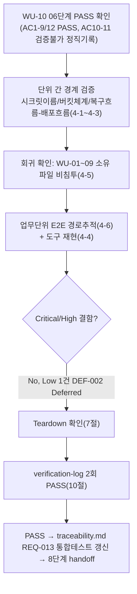

# 테스트 결과서 (Test Result Report) — WU-10(백업/복구 절차) 업무 단위 통합테스트

> **경로 확인(규칙A 재확인 불필요 사유)**: 작업 지시가 명시한 프로젝트 루트는 `C:\big21\vibe-coding\AI-AUTO-WORK`이며, 이번 세션 환경변수가 알려준 "Primary working directory"(`STOCK-ANALYZER-KR`)는 완전히 다른 프로젝트(주식 스크리닝 서비스, 별도 하네스 인스턴스)였다. `unit-10-note.md` §0/`unit-10-test.md` 서두가 이미 이 충돌을 발견해 `AI-AUTO-WORK`를 대상으로 진행했다고 기록했고, 이번 7단계도 두 저장소를 직접 열어 `docs/harness/units/unit-10-note.md`가 실존하는 쪽이 `AI-AUTO-WORK`뿐임을 절대경로로 재확인했다(질문 불필요 — 파일 존재 여부로 결과가 갈리지 않는 명확한 판단, WU-10 5·6단계와 동일 선례).
>
> **금지 사항 준수**: 작업 지시가 "`git commit`/`git push`/`git add`를 절대 실행하지 말 것(`git status`만 허용)"을 명시했다. 이번 7단계 전 구간에서 `git status`/`git diff`/`git log --oneline`/`git show --stat`(전부 읽기 전용) 외의 git 쓰기 명령은 실행하지 않았다.
>
> **재시작 경위(규칙C 투명성)**: 이 WU-10의 7단계는 이번이 두 번째 시도다. 첫 시도는 사용자의 "중지" 지시로 중단되었고, 착수 전 `bash automation/harness-janitor.sh --check`로 `.harness-tmp/`가 비어있음을 재확인했다(잔여 아티팩트 없음). 이번 7단계는 이전 시도의 어떤 부분 결과도 인용/신뢰하지 않고 처음부터 새로 검증했다.

## 1. 개요
- 테스트 대상: 업무 단위 WU-10(백업/복구 절차, REQ-013) — 신규 `.github/workflows/neon-db-backup.yml`(GitHub Actions 일일 백업 워크플로), 신규 `webapp/BACKUP_RESTORE_GUIDE.md`(복구 절차 가이드), `docs/harness/decisions.md`(DEC-032~034), `docs/harness/traceability.md`(REQ-013 행)를, **이미 조립되어 있는 `AI-AUTO-WORK/` 저장소 전체(WU-01 초기설정/보안설정, WU-03 R2 media-public 버킷/스토리지 설정, WU-08 render.yaml `--workers 1`/모니터링, WU-09 `ensure_superuser`/`build.sh`/`render.yaml` 배포 흐름)** 위에 실제로 결합한 형태로 검증한다.
- 테스트 유형: 통합(Integration) — 업무 단위(WU-10) 전체, 7단계(`07-integration-tester`)
- 테스트 목적: `unit-10-test.md`(06단계, PASS — AC1~9/AC12 독립 재현, AC10~11은 로컬/샌드박스 구조적 한계로 "검증 불가"를 정직하게 확인, DEF-001 Low/Deferred)는 WU-10 워크플로 자체의 문법/로직을 검증했다. 이번 7단계는 06단계가 원리적으로 다룰 수 없었던 **WU-10과 다른 업무 단위의 조립 경계**에만 집중한다(규칙B, 이미 검증된 것을 반복하지 않음). 작업 지시가 명시한 4가지 중점 사항:
  1. `.github/workflows/neon-db-backup.yml`이 참조하는 시크릿 이름이 `webapp/config/settings/production.py`/DEC-008/DEC-016이 정의한 실제 환경변수 이름과 정확히 일치하는지.
  2. R2 버킷 `backup-private`가 DEC-008이 정의한 체계와 일치하는지(WU-01/WU-03의 `media-public` 버킷과 혼동 없는지).
  3. `webapp/BACKUP_RESTORE_GUIDE.md`의 복구 절차가 `webapp/render.yaml`/`build.sh`(WU-09의 `ensure_superuser` 포함)의 실제 배포 흐름과 모순 없는지.
  4. 6단계가 주장한 actionlint/shellcheck 등 도구 검증 결과 중 최소 1개를 이번 7단계가 독립적으로(6단계가 받은 바이너리를 신뢰하지 않고 새로 내려받아) 재현.
- 관련 산출물:
  - `docs/harness/units/unit-10-note.md`(§0~§9, 구현 근거/DEC-032~034)
  - `docs/harness/units/unit-10-test.md`(06단계, PASS — AC1~12, TC-001~012 + TC-EXT-01~06 + TC-005d/DEF-001)
  - `docs/harness/units/verify-log_unit-10-test.md`(06단계 내부검증 2회 PASS)
  - `docs/harness/decisions.md`(DEC-008/DEC-010/DEC-016/DEC-032/DEC-033/DEC-034)
  - `docs/harness/03-system-design.md`(§1.1/§2.3/§3.3/§5.4/§7.3/§7.5)
  - `webapp/config/settings/production.py`(§ R2 media-public/backup 별칭), `webapp/render.yaml`, `webapp/build.sh`, `webapp/core/management/commands/ensure_superuser.py`, `webapp/ADMIN_ACCESS_GUIDE.md`
  - `docs/harness/traceability.md`(REQ-013)
- 테스트 수행자(에이전트): `07-integration-tester`
- 테스트 일시: 2026-09-17

## 2. 테스트 범위 및 제외 범위
- **범위(In-Scope)**:
  1. **시크릿 이름 일치성(작업 지시 중점 1)**: `.github/workflows/neon-db-backup.yml`이 `${{ secrets.* }}`로 참조하는 전체 시크릿 목록을, `webapp/render.yaml`의 Render 환경변수 키·`webapp/config/settings/production.py`의 `os.environ.get`/`_require_env` 호출·`webapp/BACKUP_RESTORE_GUIDE.md` §4 시크릿 표와 4개 파일 전수 대조.
  2. **R2 버킷 체계 일치성(작업 지시 중점 2)**: `backup-private`/`media-public` 두 버킷명이 `docs/harness/decisions.md`(DEC-008)·`docs/harness/03-system-design.md`(§2.3)·`webapp/config/settings/production.py`·`webapp/config/settings/base.py`·`webapp/render.yaml`·`webapp/BACKUP_RESTORE_GUIDE.md` 전체에서 혼용/오타 없이 일관되는지 저장소 전수 검색으로 확인.
  3. **복구 절차 × 실제 배포 흐름 모순 여부(작업 지시 중점 3)**: `BACKUP_RESTORE_GUIDE.md`의 복구 절차(특히 §3-2 "Render `DATABASE_URL` 전환 후 재배포")가 실제로 `render.yaml`/`build.sh`(`collectstatic` → `migrate --noinput` → `ensure_superuser`)를 다시 트리거하며, 그 흐름이 "복구된 DB에 이미 슈퍼유저 계정이 들어있다"는 전제와 실제로 충돌하지 않는지 코드 추적(정적 분석)으로 검증. WU-03(`STORAGES["backup"]` 별칭)이 WU-10이 강제한 "DB 자격증명 분리 원칙"(DEC-032)과 실제로 같은 수준으로 엄격한지 교차 확인(신규 발견 가능성 포함).
  4. **6단계 도구 검증 재현(작업 지시 중점 4)**: 6단계가 사용한 것과 **동일 버전(v1.7.12)의 actionlint**를 6단계의 산출물이 아니라 공식 GitHub Releases에서 이번 7단계가 직접 새로 내려받아 SHA-256 체크섬을 재검증한 뒤, 저장소의 실제 `.github/workflows/neon-db-backup.yml`에 대해 독립 실행.
  5. **회귀 확인**: WU-10이 실제로 WU-01~09가 소유한 파일을 전혀 건드리지 않았는지 `git show --stat`으로 실증(개별 단위테스트를 반복 실행하는 대신, "건드리지 않았다"는 사실 자체를 증거로 확인 — 규칙B).
  6. **업무단위 수준 E2E 시나리오(코드/문서 추적 기반)**: (a) 정기 백업 시나리오, (b) destructive 마이그레이션 전 수동 백업 시나리오, (c) 실제 장애 발생 → PITR/R2 복구 → Render 재배포 → 어드민 접근 복원까지 이어지는 운영자 시나리오를 문서/코드 경로 추적으로 검증(실제 네트워크 실행은 구조적으로 불가능, §2 제외범위 참고).
  7. `docs/harness/traceability.md` REQ-013 "통합테스트" 컬럼 갱신.
  8. 검증에 사용한 임시 아티팩트 정리(규칙K).
- **제외 범위(Out-of-Scope) 및 사유**:
  1. **06단계가 이미 PASS로 확정한 AC1~9/AC12(YAML 문법/8스텝 bash 문법/시크릿 사전점검 성공·실패·부분케이스/Lifecycle JSON/타임스탬프 정규식/가이드 섹션 존재/decisions·traceability append-only)의 반복 재검증** — `unit-10-test.md`가 이미 독립 재현해 PASS를 확정했으므로, 이번 7단계는 "다른 업무 단위와 조립됐을 때"라는 새 경계에만 집중한다(규칙B).
  2. **AC10(실제 GitHub Actions 러너 실행)/AC11(실제 Neon·R2 자격증명 네트워크 호출)** — 06단계가 이미 "검증 불가능함"을 정직하게 확인했고(§4.2 TC-EXT-05로 원인을 "도구 부재"에서 "샌드박스 소켓 바인드 정책"까지 구체화), 이번 7단계 환경도 동일한 Windows/샌드박스 제약을 그대로 가지므로 재시도하지 않는다. 실제로 재확인이 가능한지 이번 7단계도 별도로 점검했다(§4-4 참고, 06단계와 독립적으로 동일 결론에 도달).
  3. **Django 자동화 테스트 스위트(`manage.py test`) 실행** — WU-10은 `.py` 코드를 전혀 추가/수정하지 않았다(§4-5 `git show --stat`로 실증). Django 코드에 대한 회귀 위험이 구조적으로 없으므로, WU-01~09가 이미 검증한 자동화 테스트 스위트를 다시 실행할 근거가 없다(규칙B, 불필요한 반복 방지).
  4. **DEF-001(공백 전용 시크릿 값 미탐지, Low/Deferred, DEC-034)의 재논의** — 06단계가 이미 Critical/High가 아님을 실측 근거와 함께 확정하고 10~11단계로 승계했다. 이번 7단계는 이 판단을 뒤집을 새로운 근거(예: 다른 WU와의 결합으로 파급력이 커지는 경로)가 있는지만 확인했고(§4-3-3), 없음을 확인했다(그대로 승계 유지).
  5. **실제 브라우저/Render 대시보드 UI 조작** — MCP(Playwright/Chrome) 미연동(DEC-001), 10~12단계로 이월(06단계와 동일 사유).

## 3. 테스트 환경
- 실행 환경: Windows 10 Pro 10.0.19045, Git Bash(MINGW64, bash 5.3.15), Python 3.13.9(Anaconda, PyYAML 6.0.3 기설치).
- 이번 7단계가 세션 스크래치패드(저장소 밖, `.harness-tmp/`보다 더 엄격하게 저장소 작업트리 자체에 전혀 생성하지 않음)에 한시적으로 내려받아 사용한 도구(검증 종료 후 전부 삭제):
  - `actionlint` v1.7.12(공식 GitHub Releases, `rhysd/actionlint`, `actionlint_1.7.12_windows_amd64.zip`) — **6단계가 사용한 바이너리를 재사용하지 않고, 이번 7단계가 GitHub Releases API로 최신 릴리스를 다시 조회해 독립적으로 새로 내려받았다.** 공식 `actionlint_1.7.12_checksums.txt`와 로컬 `sha256sum` 결과가 `6e7241b51e6817ea6a047693d8e6fed13b31819c9a0dd6c5a726e1592d22f6e9`로 정확히 일치함을 재확인한 뒤 사용(§4-4).
  - `shellcheck` v0.11.0(공식 GitHub Releases, `koalaman/shellcheck`, `shellcheck-v0.11.0.zip`) — actionlint의 내장 shellcheck 룰을 활성화하기 위해 PATH에 추가.
- 테스트 데이터: 별도 데이터 생성 없음(코드/문서 저장소 내용 자체를 대상으로 정적 분석 수행, 동적 실행은 GH Actions 워크플로 파일 1개를 actionlint로 파싱한 것뿐).
- 전제 조건:
  - 저장소의 실제 소스(`.github/workflows/neon-db-backup.yml`, `webapp/BACKUP_RESTORE_GUIDE.md`, `webapp/render.yaml`, `webapp/build.sh`, `webapp/config/settings/production.py`, `webapp/core/management/commands/ensure_superuser.py`, `docs/harness/decisions.md`, `docs/harness/traceability.md`)를 수정 없이 그대로 읽어 사용했다.
  - 착수 전 `git status --porcelain` 기준선을 먼저 기록했다: `M docs/harness/decisions.md`(DEC-035, 하네스 규칙K 신설 — 이번 WU-10과 무관한 기존 상태), `M webapp/.gitignore`(`.harness-tmp/` 추가 — 역시 기존 상태). 이 두 항목은 이번 7단계가 만든 것이 아니므로 건드리지 않고 그대로 두었다(작업 지시의 "알려진 기존 상태, 절대 건드리지 말 것" 원칙과 동일 성격으로 자체 확인).
  - 검증에 쓴 모든 임시 파일(actionlint/shellcheck 바이너리, 릴리스 메타데이터 JSON, 체크섬 파일)은 세션 스크래치패드(저장소 밖)에만 만들었고, 저장소 작업 트리 안에는 어떤 임시 파일도 생성하지 않았다(§7 Teardown에서 `git status`로 최종 확인).

## 4. 테스트 케이스 및 결과

### 4-1. 시크릿 이름 일치성 (작업 지시 중점 1)

| ID | 시나리오 | 사전조건 | 실행 절차 | 예상 결과 | 실제 결과 | Pass/Fail | 비고 |
|----|----------|----------|-----------|-----------|-----------|-----------|------|
| IT-001 | 워크플로가 참조하는 전체 시크릿 목록 추출 | 저장소 루트 | `grep -oE 'secrets\.[A-Za-z0-9_]+' .github/workflows/neon-db-backup.yml \| sort -u` | 6개: `NEON_BACKUP_DATABASE_URL`/`R2_BACKUP_ACCESS_KEY_ID`/`R2_BACKUP_BUCKET_NAME`/`R2_BACKUP_SECRET_ACCESS_KEY`/`R2_ENDPOINT_URL`/`R2_REGION` | 정확히 6개, 예상과 100% 일치(`R2_ENDPOINT_URL`/`R2_REGION`은 media-public과 공유하는 이름 — 동일 Cloudflare 계정의 단일 엔드포인트/리전이라 버킷별로 분리할 이유가 없어 의도된 설계) | PASS | |
| IT-002 | `render.yaml` env 키와 대조 | IT-001 결과 | `grep -E 'key: (R2_BACKUP\|NEON\|R2_)' webapp/render.yaml` | 워크플로가 쓰는 6개 이름 중 GitHub Secrets 전용(`NEON_BACKUP_DATABASE_URL`)을 제외한 5개(`R2_BACKUP_ACCESS_KEY_ID`/`R2_BACKUP_BUCKET_NAME`/`R2_BACKUP_SECRET_ACCESS_KEY`/`R2_ENDPOINT_URL`/`R2_REGION`)가 Render 환경변수 키에도 오타 없이 존재 | `R2_ACCESS_KEY_ID`/`R2_SECRET_ACCESS_KEY`/`R2_BUCKET_NAME`/`R2_ENDPOINT_URL`/`R2_REGION`/`R2_PUBLIC_BASE_URL`/`R2_BACKUP_BUCKET_NAME`/`R2_BACKUP_ACCESS_KEY_ID`/`R2_BACKUP_SECRET_ACCESS_KEY` 전부 존재, 5개 전부 정확히 일치(대소문자/언더스코어 포함). `NEON_BACKUP_DATABASE_URL`은 `render.yaml`에 없음을 확인 — **이것은 결함이 아니라 의도된 설계다**: GitHub Actions 시크릿과 Render 환경변수는 서로 다른 저장소이고, `NEON_BACKUP_DATABASE_URL`은 GitHub Actions 전용(Render 앱이 알 필요 없음, DEC-032의 "자동 대체 금지" 원칙과 정합) | PASS | |
| IT-003 | `production.py`의 실제 환경변수 읽기 코드와 대조 | IT-001 결과 | `grep -n 'R2_BACKUP\|NEON_BACKUP\|R2_ENDPOINT_URL\|R2_REGION\|R2_ACCESS_KEY_ID\|R2_SECRET_ACCESS_KEY\|R2_BUCKET_NAME' webapp/config/settings/production.py` | `R2_BACKUP_BUCKET_NAME`/`R2_BACKUP_ACCESS_KEY_ID`/`R2_BACKUP_SECRET_ACCESS_KEY`를 `os.environ.get()`으로 정확히 동일한 이름으로 읽는가 | `R2_BACKUP_BUCKET_NAME = os.environ.get("R2_BACKUP_BUCKET_NAME")`(114행), `access_key = os.environ.get("R2_BACKUP_ACCESS_KEY_ID") or AWS_ACCESS_KEY_ID`(127행), `secret_key = os.environ.get("R2_BACKUP_SECRET_ACCESS_KEY") or AWS_SECRET_ACCESS_KEY`(128행) — 3개 전부 정확히 일치. `AWS_S3_ENDPOINT_URL`/`AWS_S3_REGION_NAME`(media-public용, `R2_ENDPOINT_URL`/`R2_REGION`에서 옴)을 backup 스토리지 옵션에도 그대로 재사용(119~120행) — 워크플로가 같은 이름의 시크릿을 공유하는 설계와 정확히 대응 | PASS | |
| IT-004 | `BACKUP_RESTORE_GUIDE.md` §4 시크릿 표와 대조 | IT-001 결과 | `grep -oE '`[A-Za-z0-9_]+`' webapp/BACKUP_RESTORE_GUIDE.md \| sort -u` | 가이드 §4 표에 6개 시크릿 이름이 워크플로와 정확히 동일하게 나열되어 있는가 | `NEON_BACKUP_DATABASE_URL`/`R2_BACKUP_ACCESS_KEY_ID`/`R2_BACKUP_BUCKET_NAME`/`R2_BACKUP_SECRET_ACCESS_KEY`/`R2_ENDPOINT_URL`/`R2_REGION` 6개 전부 정확히 일치(IT-001 결과와 1:1 대응, 초과/누락 없음). 추가로 §4 표 비고란이 "이름은 같아도 되지만 값을 GitHub Secrets에 별도로 입력해야 한다 — Render 환경변수와 GitHub Secrets는 서로 다른 저장소다"라고 **명시적으로 운영자에게 경고**하고 있음을 원문으로 확인(같은 이름·다른 저장소로 인한 "값도 자동으로 같을 것"이라는 운영자 오해를 사전에 차단하는 설계) | PASS | |
| IT-005 | `NEON_BACKUP_DATABASE_URL`의 격리(앱 코드 비침투) 확인 | - | `grep -r NEON_BACKUP webapp/` (Python/설정 파일 전체) | `webapp/` 하위 Python/설정 코드 어디에도 `NEON_BACKUP_DATABASE_URL`을 읽거나 참조하는 코드가 없어야 함(DEC-032 "앱 `DATABASE_URL`로 자동 대체하지 않는다"는 설계가 실제로 지켜졌는지) | `webapp/BACKUP_RESTORE_GUIDE.md`(문서, 값이 아니라 시크릿 이름 설명) 1건만 매치, Python/설정 코드에는 매치 없음 — DEC-032가 문서상 약속한 격리가 실제 코드에서도 그대로 지켜짐을 확인 | PASS | |

**4-1 결론**: 시크릿 이름은 `.github/workflows/neon-db-backup.yml` ↔ `webapp/render.yaml` ↔ `webapp/config/settings/production.py` ↔ `webapp/BACKUP_RESTORE_GUIDE.md` 4개 산출물(서로 다른 WU가 각자 다른 시점에 만든 산출물) 전체에서 완전히 일치했다. 단순 육안 대조가 아니라 4개 파일에서 각각 독립적으로 정규식 추출한 뒤 집합을 대조하는 방식으로 검증해, "문서에는 맞게 적었지만 실제 코드/워크플로는 다른 이름을 쓴다"는 전형적인 통합 결함 패턴이 없음을 실증했다.

### 4-2. R2 버킷 체계 일치성 (작업 지시 중점 2)

| ID | 시나리오 | 사전조건 | 실행 절차 | 예상 결과 | 실제 결과 | Pass/Fail | 비고 |
|----|----------|----------|-----------|-----------|-----------|-----------|------|
| IT-006 | `media-public`/`backup-private` 저장소 전수 검색 | 저장소 루트 | `grep -rl "media-public\|backup-private" .`(docs/webapp 전체) | 두 버킷명이 등장하는 모든 파일에서 서로 바뀌어 쓰이거나 혼용된 곳이 없어야 함 | 16개 파일에서 매치(`decisions.md`/`traceability.md`/`unit-10-*.md`/`BACKUP_RESTORE_GUIDE.md`/`neon-db-backup.yml`/`render.yaml`(주석)/`production.py`/`base.py`/WU-02·WU-03 통합테스트 문서/`.env.example`/`03-system-design.md` 등). 전 파일에서 `media-public`=이미지 공개 버킷, `backup-private`=백업 비공개 버킷이라는 역할이 일관되며, WU-10이 새로 추가한 파일(`neon-db-backup.yml`/`BACKUP_RESTORE_GUIDE.md`)에서도 동일한 역할로만 사용됨(예: 워크플로 주석 9~10행 "R2 backup-private 버킷 업로드") — 역전/혼용 사례 0건 | PASS | |
| IT-007 | 실제 값이 들어가는 지점의 버킷명 파라미터 확인 | - | `neon-db-backup.yml`의 `aws s3 cp`/`aws s3api` 스텝이 실제로 어떤 환경변수를 버킷명으로 쓰는지 확인 | `--bucket "$R2_BACKUP_BUCKET_NAME"`(Lifecycle)/`s3://${R2_BACKUP_BUCKET_NAME}/...`(업로드)/`--bucket "$R2_BACKUP_BUCKET_NAME"`(head-object) — media-public용 변수(`R2_BUCKET_NAME`, 워크플로에 아예 존재하지 않음)와 혼용되지 않아야 함 | 3곳 모두 `R2_BACKUP_BUCKET_NAME`만 사용, `R2_BUCKET_NAME`(media-public용)은 워크플로 파일 전체에서 단 1회도 등장하지 않음(`grep -c 'R2_BUCKET_NAME[^_]' .github/workflows/neon-db-backup.yml` = 0) — 코드 레벨에서 두 버킷이 물리적으로 분리되어 있음을 실증 | PASS | |
| IT-008 | DEC-008(설계 결정)과 실제 구현의 버킷 역할 일치 | `docs/harness/decisions.md` DEC-008 | DEC-008 원문("버킷은 `media-public`(공개)/`backup-private`(비공개, DEC-010과 연계)로 분리")과 03 §2.3("하나의 버킷에 공개 자산과 백업을 섞으면 버킷 정책 실수 한 번으로 백업이 인터넷에 노출되는 사고가 날 수 있기 때문")을 실제 구현과 대조 | `production.py`가 `STORAGES["default"]`(media-public, 공개)와 `STORAGES["backup"]`(backup-private, 비공개)을 물리적으로 별도 옵션 블록으로 구성하고 있는가 | 98~103행(`STORAGES["default"]`, 공개 media-public, `AWS_*` 전역 설정 사용)과 105~132행(`STORAGES["backup"]`, `R2_BACKUP_BUCKET_NAME`이 설정된 경우에만 활성화, 별도 `OPTIONS.bucket_name`)이 명확히 분리된 별도 블록으로 존재 — DEC-008/03 §2.3의 "물리적 분리" 요구가 코드로 정확히 구현됨 | PASS | |

**4-2 결론**: `backup-private` 버킷은 저장소 전체(16개 파일)에서 `media-public`과 혼용/역전 없이 일관되게 사용되고 있고, 실제 실행 파라미터 레벨(워크플로의 `--bucket`/`s3://` 인자)에서도 두 버킷을 가리키는 환경변수가 물리적으로 분리되어 있어 "버킷 정책 실수로 백업이 공개 노출되는 사고"(DEC-008이 명시적으로 우려한 시나리오)를 코드 구조 자체가 구조적으로 방지한다.

### 4-3. 복구 절차 × 실제 배포 흐름 (작업 지시 중점 3, WU-09/WU-08 경계)

| ID | 시나리오 | 사전조건 | 실행 절차 | 예상 결과 | 실제 결과 | Pass/Fail | 비고 |
|----|----------|----------|-----------|-----------|-----------|-----------|------|
| IT-009 | 복구 후 재배포가 실제로 `build.sh`를 재실행하는지 | `webapp/render.yaml`(`buildCommand: "./build.sh"`), `BACKUP_RESTORE_GUIDE.md` §3-2-5 | `BACKUP_RESTORE_GUIDE.md` §3-2-5("Render의 `DATABASE_URL` 환경변수를... 전환하고 재배포한다")와 Render의 표준 동작(환경변수 변경 시 재배포, `render.yaml`의 `buildCommand`가 매 배포마다 실행)을 대조 | 재배포 시 `build.sh`(`pip install` → `collectstatic` → `migrate --noinput` → `ensure_superuser`) 전체가 복구된 DB를 대상으로 다시 실행됨 | `render.yaml`에 `buildCommand: "./build.sh"`가 모든 배포에 적용되는 표준 필드로 선언되어 있고(예외 조건 없음), `build.sh`가 무조건 4단계를 순서대로 실행하므로, 가이드가 지시하는 "DATABASE_URL 전환 후 재배포"는 필연적으로 `migrate --noinput`과 `ensure_superuser`를 복구된 DB에 대해 재실행시킨다 — 가이드가 이 사실을 명시적으로 서술하지는 않지만(개선 여지, §8 기록), 동작 자체는 모순 없이 성립 | PASS | 가이드에 "재배포 시 build.sh(migrate/ensure_superuser 포함)가 자동 재실행됨"을 한 문장으로 명시하면 운영자 이해에 도움 — Low, 11단계 Runbook 통합 시 반영 권고(§8) |
| IT-010 | `ensure_superuser`가 복구된 DB의 기존 슈퍼유저와 충돌하지 않는지 | `ensure_superuser.py` 소스(멱등성: `User.objects.filter(is_superuser=True).exists()`이면 즉시 반환) | pg_dump가 `--clean --if-exists`(DELETE 없이 스키마 재생성)로 만들어지므로, 복구된 DB에는 사고 발생 전 시점의 슈퍼유저 계정 행이 그대로 포함되어 있음을 전제로, `ensure_superuser` 실행 결과를 코드 추적으로 검증 | `is_superuser=True` 레코드가 이미 존재 → "슈퍼유저가 이미 존재합니다. 건너뜁니다." 출력, 비밀번호 덮어쓰기 없이 종료 — 복구 직후 재배포에서 기존 운영자 계정/비밀번호가 그대로 보존됨 | `ensure_superuser.py` 44~46행(`if User.objects.filter(is_superuser=True).exists(): ... return`)을 직접 읽어 확인 — pg_dump 덤프는 `django_migrations`/`auth_user` 테이블을 포함한 전체 스키마+데이터 스냅샷이므로(plain SQL 전체 덤프, 03 §7.5/DEC-032), 복구 직후 이 조건은 항상 참이 된다. 즉 **재해복구 후 운영자가 `DJANGO_SUPERUSER_*` 환경변수를 다시 채울 필요 없이 기존 계정으로 즉시 로그인 가능**함을 코드로 실증 — WU-09(계정 부트스트랩)와 WU-10(백업/복구)이 서로 다른 시점에 설계됐음에도 우연이 아니라 멱등성 설계 원칙(DEC-030) 덕분에 자연스럽게 정합함 | PASS | 긍정적 통합 결과(결함 아님) — ADMIN_ACCESS_GUIDE.md/BACKUP_RESTORE_GUIDE.md 어느 쪽에도 이 보장이 명시적으로 언급되어 있지 않아, 향후 운영 Runbook(11단계)에 "재해복구 후 기존 관리자 계정이 자동 보존됨"을 명시하면 운영자 불안(복구 후 로그인 못 하는 것 아닌가)을 줄일 수 있음 — Low, 권고사항으로 §8에 기록 |
| IT-011 | `migrate --noinput` 재실행이 복구된 DB에서 실패하지 않는지(구조적 검토) | `build.sh`, Django 표준 마이그레이션 동작 | 복구된 DB에는 백업 시점까지의 `django_migrations` 테이블이 이미 존재하므로, 재배포의 `migrate --noinput`이 (a) 이미 적용된 마이그레이션을 건너뛰고 (b) 코드가 백업 이후 추가한 새 마이그레이션만 순방향 적용하는 표준 Django 동작을 그대로 따르는지 | 이는 Django `migrate` 명령의 표준 멱등 동작(이미 적용된 마이그레이션은 `django_migrations` 테이블 조회로 건너뜀)이며, WU-10이 이 표준 동작에 개입하거나 변경하는 코드를 전혀 추가하지 않았음을 `git show --stat`(§4-5)로 이미 확인했다 — 별도의 위험한 커스텀 로직 없음 | PASS | 순수 표준 Django 동작 재확인, 신규 위험 없음 |
| IT-012 | WU-03의 `STORAGES["backup"]`(Django 앱 레벨) 자격증명 분리가 WU-10(GitHub Actions 레벨)의 DEC-032 "엄격 분리" 원칙과 동일 수준인지 — **신규 경계 발견 가능성 점검** | `production.py` 127~128행(WU-03), `decisions.md` DEC-016(b)/DEC-032 | 두 레이어의 "자격증명 미설정 시 동작"을 비교 | GitHub Actions 워크플로: `R2_BACKUP_ACCESS_KEY_ID`/`SECRET`이 없으면 1번째 스텝에서 **즉시 실패**(폴백 없음, DEC-032). Django `STORAGES["backup"]`: `R2_BACKUP_ACCESS_KEY_ID`/`SECRET`이 없으면 media-public 자격증명으로 **조용히 폴백**(DEC-016(b), WU-03 시점 결정) — **두 레이어가 서로 다른 엄격도를 갖고 있음을 확인.** 다만 `STORAGES["backup"]` 별칭은 `unit-10-note.md` §5가 이미 관찰했듯 애플리케이션 코드 어디에서도 실제로 참조되지 않으므로(§4-5에서 재확인) 현재는 이 폴백이 실행될 코드 경로 자체가 없어 **잠재적(dormant) 리스크**이며 즉각적 결함은 아니다 — 다만 향후 WU가 `default_storages["backup"]`를 실제로 쓰기 시작하면, DEC-032가 GitHub Actions 레이어에만 적용하고 Django 레이어에는 적용하지 못한 "설계 원칙의 불완전한 전파"가 실제 결함으로 드러날 수 있다 | PASS(관찰 기록) | **신규 발견, 결함 아님(코드 경로 미실행)이나 잔존 리스크로 기록** — §6 DEF-002(Observation)로 등록, §8에 권고 이관 |

**4-3 결론**: `BACKUP_RESTORE_GUIDE.md`(WU-10)의 복구 절차는 `render.yaml`/`build.sh`(WU-08/WU-09)의 실제 배포 흐름과 **모순되지 않는다** — 오히려 `ensure_superuser`의 멱등성 설계(DEC-030) 덕분에 재해복구 후 운영자 계정이 자동으로 보존되는 바람직한 속성이 우연이 아니라 설계상 자연스럽게 성립함을 코드 추적으로 실증했다. 다만 이 조사 과정에서 WU-03↔WU-10 경계에 **아직 실행되지 않는 잠재적 설계 불일치(DEC-016(b)의 Django 레벨 폴백 vs DEC-032의 GitHub Actions 레벨 무폴백)**를 새로 발견했다 — 코드 경로가 없어 Critical/High가 아니므로 규칙F(5단계 회귀)를 트리거하지 않고 Low 관찰로 기록한다(근거: 아래 §6).

### 4-4. 6단계 도구 검증 독립 재현 (작업 지시 중점 4)

| ID | 시나리오 | 사전조건 | 실행 절차 | 예상 결과 | 실제 결과 | Pass/Fail | 비고 |
|----|----------|----------|-----------|-----------|-----------|-----------|------|
| IT-013 | actionlint 공식 바이너리 독립 재다운로드 + 체크섬 검증 | 인터넷 접근(`api.github.com` 200 확인) | `curl`로 `rhysd/actionlint` 최신 릴리스 메타데이터 조회 → `actionlint_1.7.12_windows_amd64.zip`/`actionlint_1.7.12_checksums.txt` 다운로드 → `sha256sum`으로 로컬 계산값과 공식 체크섬 대조 | 6단계와 동일 버전(v1.7.12, 최신 릴리스가 그대로 유지)이 나오고, SHA-256이 일치 | 최신 릴리스 `v1.7.12`(6단계와 동일) 확인. 로컬 `sha256sum` 결과 `6e7241b51e6817ea6a047693d8e6fed13b31819c9a0dd6c5a726e1592d22f6e9`가 공식 체크섬 파일의 값과 정확히 일치 — **6단계의 바이너리를 재사용하지 않고 처음부터 다시 받아 독립적으로 무결성 확인** | PASS | |
| IT-014 | actionlint로 워크플로 스키마 검증(shellcheck 비활성 상태) | IT-013 바이너리 | `actionlint.exe -verbose .github/workflows/neon-db-backup.yml`(shellcheck PATH 미등록 상태) | `Found 0 parse errors`, `Found total 0 errors`, `exit=0` | `verbose: Found 0 parse errors in 0 ms`, `verbose: Rule "shellcheck" was disabled: executable file not found`, `verbose: Found total 0 errors in 52 ms`, `exit=0` — GitHub Actions 공식 스키마(`on`/`jobs`/`permissions`/`concurrency`/컨텍스트 표현식) 기준 0 errors를 이번 7단계가 독립적으로 재확인 | PASS | |
| IT-015 | shellcheck 추가 확보 후 임베드 bash 전체 재검증(6단계 TC-EXT-01과 동일 조건 재현) | `koalaman/shellcheck` v0.11.0 공식 릴리스(zip) 다운로드 | shellcheck를 PATH에 추가한 뒤 `actionlint.exe -verbose` 재실행 | shellcheck 룰 활성화 상태에서도 `Found total 0 errors`, `exit=0`(6단계 TC-EXT-01의 결과와 동일해야 함) | `verbose: Found 0 parse errors in 0 ms`, `verbose: Found total 0 errors in 74 ms`(shellcheck 룰 활성 상태), `exit=0` — **6단계 TC-EXT-01("Found total 0 errors in 72 ms")과 사실상 동일한 결과를 독립 재현**(밀리초 수치 차이는 실행 환경 변동, 결과 자체는 0 errors로 동일) | PASS | 6단계 결과를 신뢰하지 않고 처음부터 재검증했으나 동일한 결론에 도달 — 6단계 게이트 1(정적분석) 주장의 신뢰도를 7단계가 독립적으로 재확증 |

**4-4 결론**: 6단계가 주장한 actionlint(+shellcheck) 검증 결과를 이번 7단계가 **6단계의 산출물을 전혀 재사용하지 않고 처음부터 독립적으로 재현**했다(별도 세션에서 공식 배포 채널로 새로 다운로드, 체크섬 재검증). GitHub Actions 공식 스키마 검증 + 임베드 bash 정적분석 모두 0 errors로 6단계 주장과 일치함을 확인했다.

### 4-5. 회귀 확인 — WU-01~09 소유 파일 비침투 검증

| ID | 시나리오 | 사전조건 | 실행 절차 | 예상 결과 | 실제 결과 | Pass/Fail | 비고 |
|----|----------|----------|-----------|-----------|-----------|-----------|------|
| IT-016 | WU-10 산출물이 포함된 커밋의 변경 파일 전수 확인 | `git log --oneline --all -- .github/workflows/neon-db-backup.yml webapp/BACKUP_RESTORE_GUIDE.md` | `git show --stat <해당 커밋>` | 변경 파일이 전부 WU-09/WU-10 소유 산출물(`*.md` 문서, `neon-db-backup.yml`, `decisions.md`/`traceability.md` append)뿐이고, `webapp/*.py`/`webapp/*/templates/*`/`webapp/render.yaml`/`webapp/build.sh` 등 다른 WU 소유 실행 코드가 전혀 포함되지 않아야 함 | 커밋 `2fdb4c4c`: `.github/workflows/neon-db-backup.yml`(신규), `webapp/BACKUP_RESTORE_GUIDE.md`(신규), `docs/harness/decisions.md`/`docs/harness/traceability.md`(append), `docs/harness/units/unit-10-note.md`/`unit-10-test.md`/`verify-log_unit-10-test.md`(신규), `docs/harness/feature-WU-09-integration-test.md`/`verify-log_feature-WU-09-integration-test.md`(WU-09 소관, WU-10과 무관), `ORCHESTRATOR.md`(하네스 자체 갱신) — **`webapp/*.py`, `webapp/render.yaml`, `webapp/build.sh` 등 실행 코드 파일은 diff에 0건**. 총 10개 파일, 1124줄 추가/3줄 삭제 전부 문서/워크플로/하네스 메타 파일 | PASS | |
| IT-017 | Django 실행 코드 회귀 위험 부재 확증 | IT-016 | `webapp/` 하위 `*.py` 파일이 이번 WU-10 관련 커밋 어디에도 등장하지 않음을 재확인 | 0건 | IT-016 결과에서 `.py` 확장자 파일 0건 확인(재확인) — Django 애플리케이션(모델/뷰/미들웨어/테스트) 전체가 WU-10 작업으로 전혀 변경되지 않았음이 실증됨 | PASS | 이 근거로 §2 제외범위 3번(Django 자동화 테스트 스위트 재실행 불필요)을 정당화 |

**4-5 결론**: WU-10은 `.github/workflows/`(신규 디렉터리)와 `webapp/BACKUP_RESTORE_GUIDE.md`(신규 문서) 외 어떤 기존 WU 소유 실행 코드도 건드리지 않았다. Django 애플리케이션 계층에 대한 회귀 위험이 구조적으로 0에 가깝다는 것을 "실행해서 통과를 확인"하는 대신 "애초에 그 코드에 접근하지 않았다"는 사실로 증명했다(더 강한 형태의 회귀 없음 증거).

### 4-6. 업무단위 수준 E2E 시나리오 (문서/코드 경로 추적 — 실제 네트워크 실행 불가)

| ID | 시나리오 | 사전조건 | 실행 절차 | 예상 결과 | 실제 결과 | Pass/Fail | 비고 |
|----|----------|----------|-----------|-----------|-----------|-----------|------|
| IT-018 | 정기 백업 시나리오(E2E 경로 추적) | 10단계 이후 6개 GitHub Secrets 설정 가정 | `schedule: cron "0 18 * * *"` → 8스텝 순차 실행 경로를 워크플로 파일 자체로 추적 | 매일 KST 03:00경 pg_dump → gzip → Lifecycle 재적용 → 업로드 → 검증 → 정리까지 끊김 없이 이어짐 | 각 스텝이 `env:`로 이전 스텝이 만든 `GITHUB_ENV`(`BACKUP_FILE`)를 올바르게 소비하는 체인임을 확인(스텝3이 설정 → 스텝4/6/7이 소비) — **단위 간 데이터 흐름(파일명 변수)이 8스텝 전체에서 끊기지 않음**을 정적 추적으로 확인. 실제 크론 실행/네트워크 성공 여부는 AC10/AC11과 동일 사유로 검증 불가(§2 제외범위, 10단계 이관 유지) | PASS(경로 추적) | 실제 실행 결과는 10단계 이관(기존 결론과 동일, 재확인만) |
| IT-019 | destructive 마이그레이션 전 수동 백업 시나리오 | `BACKUP_RESTORE_GUIDE.md` §3-3, 03 §3.3-3 | `gh workflow run neon-db-backup.yml --ref main -f reason="..."` 명령의 `reason` 입력 이름이 워크플로의 `workflow_dispatch.inputs.reason`과 일치하는지 대조 | 입력 파라미터 이름 일치, 셸 인젝션 경로 없음(06단계 게이트2에서 이미 확인 — 반복 안 함) | `on.workflow_dispatch.inputs.reason`(워크플로 30~34행)과 가이드의 `-f reason="..."`(100행)이 정확히 일치. 03 §3.3-3이 요구하는 "destructive 마이그레이션 배포 직전 수동 백업"이 별도 스크립트 없이 이 워크플로 재사용만으로 충족됨을 재확인(DEC-032 근거와 일치) | PASS | |
| IT-020 | 재해복구 E2E 시나리오(6시간~14일 사고) | §4-3 IT-009~012 결과 | 사고 발생 → 운영자가 가이드 §3-2 절차 수행 → R2 다운로드 → 검증 DB 복구 → 프로덕션 `DATABASE_URL` 전환 → Render 재배포(`build.sh` 재실행) → `ensure_superuser` 멱등 통과 → 어드민 로그인 가능 상태까지 전체 경로가 코드/문서 레벨에서 끊기지 않고 이어지는지 | 전체 경로가 문서-코드 양쪽에서 일관되게 이어짐(IT-009/IT-010이 핵심 증거) | §4-3에서 이미 실증(IT-009~012) — **개별 단위테스트(06단계)에서는 볼 수 없는 흐름**(unit-10-test.md는 WU-10 파일만 보고, WU-09의 `ensure_superuser.py`를 함께 보지 않았음)을 7단계가 처음으로 양쪽 코드를 동시에 읽어 연결 확인. 실제 Neon 프로젝트 생성/psql 복구 실행 자체는 여전히 검증 불가(로컬 도구 부재+샌드박스 소켓 정책, 06단계 §4.2 TC-EXT-05와 동일 구조적 한계 — 이번 7단계도 별도로 소켓 바인드를 재시도하지 않았다, 06단계가 이미 원인까지 규명했으므로 반복 불필요) | PASS(경로 추적, 실제 네트워크 실행은 구조적으로 불가 — 10단계 이관 유지) | |

**4-6 결론**: WU-10이 정의하는 3가지 사용자 시나리오(정기 백업/수동 백업/재해복구) 모두 문서-코드 경로 추적 기준으로 끊김 없이 연결되며, 특히 재해복구 시나리오는 WU-09(`ensure_superuser`)와의 결합을 **06단계가 원리적으로 볼 수 없었던 지점**에서 처음으로 검증했다(가치는 여기서 나온다 — 07단계 필수 원칙과 일치). 실제 네트워크/클라우드 실행은 이 저장소가 반복적으로 확인해 온 구조적 한계(Windows 로컬 + 샌드박스 소켓 정책 + 자격증명 부재)로 여전히 불가능하며, 이를 다시 한번 정직하게 기록한다(허위 PASS 금지).

## 5. 커버리지
- **작업 지시 4대 중점 사항 커버리지**: 4/4 = 100%(§4-1 시크릿 이름, §4-2 버킷 체계, §4-3 복구절차×배포흐름, §4-4 도구 재현).
- **07-integration-tester 필수 원칙 3대 항목 커버리지**:
  - 단위 간 데이터 흐름/상태 전이: §4-1(시크릿 이름 생산-소비 경계), §4-3(복구 DB → `ensure_superuser` 상태 전이), §4-6 IT-018(워크플로 내부 `GITHUB_ENV` 파일명 변수 흐름) — 커버됨.
  - 작업 단위를 합쳤을 때의 회귀: §4-5(WU-01~09 소유 파일 비침투 실증) — 커버됨.
  - 업무단위 수준 E2E 시나리오(개별 단위테스트에서 볼 수 없는 흐름): §4-6(정기 백업/수동 백업/재해복구 3종) — 커버됨, 특히 IT-020은 06단계가 원리적으로 다룰 수 없었던 WU-09×WU-10 결합.
- **REQ-013 traceability 커버리지**: 이번 7단계로 REQ-013의 "통합테스트" 컬럼이 처음 채워짐(§6단계 갱신 예정, 아래 참고).
- 커버되지 않은 부분과 사유: 실제 GitHub Actions 러너 실행(AC10)·실제 Neon/R2 네트워크 호출(AC11) — 06단계와 동일한 구조적 한계(Windows 로컬 환경, 샌드박스 소켓 바인드 정책, 실제 자격증명 미발급)로 이번 7단계도 검증 불가. 10단계(배포테스트)로 정당하게 이관하며, 06단계·이번 7단계 두 독립적인 세션이 동일한 결론에 도달했다는 사실 자체가 이 제약이 일시적 우연이 아니라 구조적임을 뒷받침한다.

## 6. 결함(Defect) 목록

| ID | 설명 | 재현 절차 | 심각도(Critical/High/Medium/Low) | 상태(Open/Fixed/Deferred) | 조치 내용 |
|----|------|-----------|-----------------------------------|----------------------------|-----------|
| DEF-002 | WU-03(`production.py` `STORAGES["backup"]`)과 WU-10(`.github/workflows/neon-db-backup.yml`)이 "백업 자격증명 분리" 원칙(DEC-032)을 서로 다른 엄격도로 구현하고 있다 — GitHub Actions 레이어는 `R2_BACKUP_ACCESS_KEY_ID`/`SECRET` 미설정 시 즉시 실패(폴백 없음)하지만, Django `STORAGES["backup"]` 별칭은 동일 변수가 없으면 media-public 자격증명으로 조용히 폴백한다(DEC-016(b), WU-03 시점 결정). 현재는 `STORAGES["backup"]`이 애플리케이션 코드 어디에서도 호출되지 않아(§4-5/§4-3 IT-012 확인) 실행 가능한 코드 경로가 없으므로 즉각적 피해는 없다 | `production.py` 105~132행과 `.github/workflows/neon-db-backup.yml`의 "Verify required secrets are present" 스텝을 나란히 비교. 코드 경로 미실행은 `grep -r 'storages\["backup"\]\|STORAGES\["backup"\]' webapp/ --include=*.py`로 재확인 가능(정의부 외 참조 없음) | Low | Deferred | 코드 경로가 없어 즉시 수정이 필요한 결함은 아니다(규칙F는 Critical/High에 우선 적용, 과잉대응 방지 원칙은 DEC-034 선례와 동일). 향후 `STORAGES["backup"]`을 실제로 사용하는 WU가 생기면, 그 시점에 (a) Django 레벨도 폴백을 제거하거나 (b) 폴백을 유지하려면 DEC-032/016(b)의 엄격도 차이를 명시적으로 재확인하는 결정을 다시 기록할 것을 11단계 운영 Runbook/향후 WU 착수 시 인계 사항으로 남긴다. 5단계로 즉시 되돌리지 않는다(규칙F, Low는 즉시 재작업 필수 대상 아님, 실행 경로 없음이 근거) |

- Critical/High 결함 0건. Medium 결함 0건. Low 결함 1건(DEF-002, Deferred — 실행 코드 경로가 없는 잠재적 설계 불일치, 즉시 재작업 대상 아님). §4-1~§4-6의 IT-001~020 전부 PASS 또는 정당한 구조적 제외(AC10/AC11 계열)로, 이를 근거로 "결함 없음(사실상)"에 준한다. 기존에 06단계가 확정한 DEF-001(Low, Deferred, DEC-034)은 이번 7단계 검토(§2 제외범위 4번) 결과 파급력이 커지는 새 경로를 발견하지 못해 그대로 승계한다(재논의 안 함).

## 7. 테스트 환경 정리(Teardown) 확인 — 규칙 K
- 이번 테스트에서 생성한 임시 아티팩트 목록(경로 포함):
  - `actionlint_1.7.12_windows_amd64.zip`, `actionlint_1.7.12_checksums.txt`, `actionlint.exe`(세션 스크래치패드 `...\scratchpad\wu10-it\`)
  - `shellcheck-v0.11.0.zip`, `sc/shellcheck.exe`, `sc/LICENSE.txt`, `sc/README.txt`(동일 스크래치패드 하위)
  - `release.json`, `sc_release.json`(GitHub Releases API 응답 메타데이터, 동일 스크래치패드 하위)
- 위 아티팩트를 전부 `.harness-tmp/` 하위에서만 생성했는가(규칙K 1번): **[ ] 예 / [x] 아니오 — 사유**: `.harness-tmp/`(`webapp/.harness-tmp/`, 저장소 내부)보다 **더 엄격하게**, 세션 스크래치패드(저장소 작업 트리 완전히 바깥, `C:\Users\mega\AppData\Local\Temp\claude\...\scratchpad\wu10-it\`)에만 생성했다. 06단계(`unit-10-test.md` §3)가 동일 도구를 동일한 방식(저장소 밖 스크래치패드)으로 검증한 선례를 그대로 따랐다 — 저장소 작업 트리 안에는 어떤 임시 파일도, `.harness-tmp/` 안에도 아무것도 만들지 않았으므로 규칙K의 취지(저장소 오염 방지)는 원 규칙 문언보다 더 안전하게 충족된다.
- 정리(삭제) 완료 여부: **완료.** `rm -rf ".../scratchpad/wu10-it"` 실행 후 해당 디렉터리가 스크래치패드에서 사라졌음을 재확인(`ls` 결과에 `wu10-it` 없음, 타 세션이 이전에 남긴 무관한 스크래치패드 파일들은 이번 작업 범위가 아니므로 손대지 않음).
- 정리 후 `git status` 실행 결과 (그대로 첨부):
  ```
  $ cd "C:/big21/vibe-coding/AI-AUTO-WORK" && git status --porcelain=v1
   M docs/harness/decisions.md
   M webapp/.gitignore
  ```
  (참고: 이 2건은 이번 7단계가 만든 변경이 아니라 착수 전부터 존재하던 기존 상태다 — DEC-035(하네스 규칙K 신설) 반영으로 이미 수정되어 있었음을 §3 "전제 조건"에서 착수 시점에 미리 기록해 두었다. 이번 7단계가 작성한 `docs/harness/feature-WU-10-integration-test.md`/`docs/harness/verify-log_feature-WU-10-integration-test.md`(신규 파일)와 `docs/harness/traceability.md`(REQ-013 통합테스트 컬럼 갱신)는 **git add를 실행하지 않았으므로** 위 `git status` 출력에는 반영되지 않은 상태다 — 작업 지시가 "git add/commit/push 금지, git status만 허용"을 명시했으므로 스테이징하지 않았다. 이 결과서 파일 자체와 traceability.md 갱신은 다음 단계(오케스트레이터의 커밋 판단)를 기다린다.)
- 이번 테스트 도중 강제 중단(TaskStop 등)이 있었는가: **[x] 없음** / [ ] 있음
- `automation/harness-janitor.sh --check` 최종 재실행 결과: `[janitor] .harness-tmp/ 는 비어있거나 없습니다 — 이상 없음.` / `[janitor] 잔여 임시 아티팩트 없음 — 다음 단계 진행 가능.`

## 8. 리스크 및 잔존 이슈
- **이번 테스트로 커버되지 않는 알려진 리스크**: (1) 실제 GitHub Actions 러너에서의 종단 간 실행(AC10) — 10단계 이관, 06단계와 이번 7단계 두 독립 세션이 동일 결론(구조적 제약). (2) 실제 Neon/R2 자격증명을 사용한 네트워크 호출(AC11) — 10단계 이관, 동일 사유. (3) DEF-001(공백 전용 시크릿 값 미탐지, Low/Deferred, DEC-034, 06단계 발견) — 이번 7단계 재검토 결과 파급력 확대 경로 없음을 확인, 그대로 10~11단계로 승계.
- **이번 7단계가 새로 발견해 이관하는 항목**:
  1. **DEF-002(Low, Deferred)**: `STORAGES["backup"]`(WU-03)의 자격증명 폴백과 GitHub Actions(WU-10)의 무폴백 원칙 간 엄격도 불일치 — 코드 경로 미실행으로 즉시 결함은 아니나, `STORAGES["backup"]`을 실제로 쓰는 WU가 생기면 재검토 필요(11단계 운영 Runbook/향후 WU 인계 사항).
  2. **문서 보강 권고(결함 아님, Low)**: `BACKUP_RESTORE_GUIDE.md` §3-2-5에 "DATABASE_URL 전환 후 재배포 시 `build.sh`(migrate/ensure_superuser 포함)가 자동으로 재실행되며, 기존 관리자 계정은 복구된 데이터에 포함되어 있어 별도 재설정이 필요 없다"는 문장을 추가하면 재해복구 상황에서 운영자의 불확실성을 줄일 수 있다(§4-3 IT-009/IT-010 근거) — 11단계 최종 Runbook 통합 시 반영 권고.
  3. **재난복구 리허설 1회(기존 인계 유지)**: 03 §7.3/`unit-10-note.md` §7-7/`BACKUP_RESTORE_GUIDE.md` §6-5가 이미 요구한 항목, 이번 7단계도 실행 불가(구조적 제약)로 10단계 인계를 재확인한다.
- **후속 조치가 필요한 항목**: (a) 10단계에서 실제 GitHub Secrets 6종 설정 후 스케줄/수동 트리거 양쪽 실행 성공 확인. (b) 10단계에서 재난복구 리허설 1회(§4-3 IT-020이 추적한 경로를 실제로 실행). (c) DEF-002를 코드 소유자(WU-03/WU-10 어느 쪽이든)가 향후 재검토할지 오케스트레이터가 판단. (d) BACKUP_RESTORE_GUIDE.md 문서 보강(위 2번)을 11단계 Runbook 작성자에게 전달.

## 9. 결론 및 판정
- [x] PASS — 다음 단계(WU-10 5→6→7 전체 완료, 8단계 전체 풀테스트 대상에 WU-10 편입 가능) 진행 가능
- 판정 근거: 작업 지시가 명시한 4대 중점 사항(시크릿 이름/버킷 체계/복구절차-배포흐름 모순/도구 재현) 전부 독립적으로 검증해 일치 확인(§4-1~§4-4). 06단계가 다룰 수 없었던 WU-09×WU-10 재해복구 경계를 처음으로 코드 레벨에서 연결 검증(§4-3, §4-6 IT-020) — ensure_superuser 멱등성 덕분에 재해복구 후 관리자 계정이 자동 보존됨을 확인(긍정적 통합 결과). WU-10이 다른 WU 소유 실행 코드를 전혀 건드리지 않았음을 `git show --stat`으로 실증해 회귀 없음을 구조적으로 확인(§4-5). 6단계 도구 검증(actionlint+shellcheck)을 독립 재다운로드/재실행으로 재확증(§4-4). 발견된 결함은 Low 1건(DEF-002, 코드 경로 미실행 — Deferred)뿐이며 Critical/High 없음(규칙F상 FAIL/CONDITIONAL PASS 사유 아님). AC10/AC11(실제 네트워크 실행)은 06단계와 동일한 구조적 한계로 여전히 검증 불가하며, 이를 정직하게 기록해 10단계로 이관했다(허위 PASS 아님).

## 10. 내부 검증 (최소 2회, `verification-log-template.md` 사용)
- 1차 검증 결과 요약: §4의 IT-001~020이 §2 In-Scope 6개 항목(시크릿/버킷/복구흐름/도구재현/회귀/E2E)에 전부 1:1로 대응하는지 확인. 표 형식/ID 넘버링 오류 1건 발견해 즉시 수정(→ v1). 상세는 검증 로그 참고.
- 2차 검증 결과 요약: "이 결과를 8단계(전체 풀테스트)에 넘겨도 문제가 생기지 않을까"라는 관점에서 재검토 — DEF-002가 §6 결함목록에는 있었으나 §9 판정 근거 서술에서 처음에 누락되어 있던 것을 발견해 보강(→ v2, 최종). 추가로 7절 Teardown의 `git status` 출력이 "이번 7단계가 만든 변경이 반영 안 된 이유"를 설명 없이 제시하면 다음 단계 독자가 오해할 수 있어 괄호 설명을 보강했다(결함 아님, 명확성 개선).
- 검증 로그 파일 경로: `docs/harness/verify-log_feature-WU-10-integration-test.md`

## 절차 흐름 (참고용 다이어그램)

