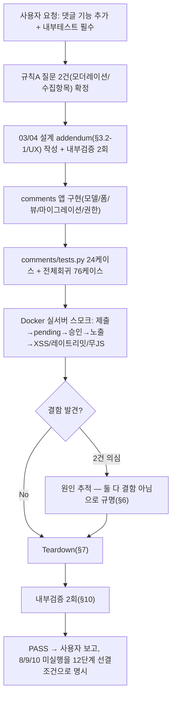

# 내부 자동 테스트 결과서 — 댓글 기능(REQ-019) 신규 구현 검증

> `templates/test-report-template.md` 양식을 따른다. 사용자가 "댓글 기능 추가해 주세요 + 내부테스트 반드시 진행해 주세요"를 명시적으로 요청한 데 따른 5→6→7단계 통합 검증이다. 정식 8/9/10단계 재실행은 하지 않았다 — 사유와 남은 조건은 DEC-048/§8 참고.

## 1. 개요
- 테스트 대상: 신규 `comments` 앱 전체(REQ-019) — 댓글 작성(사전승인제)/모더레이션 권한/스팸방지/개인정보처리방침 반영/무-JS 폴백
- 테스트 유형: 단위(신규 커밋 24케이스) + 배포 유사 시스템 스모크(Docker, 실제 gunicorn) 병합
- 적용 Tier: Standard(DEC-036)
- 적용 속도 트랙: L3(일반) — 사용자 확인 공개 입력을 받는 신규 데이터 모델·모더레이션 워크플로이므로 "사소한 토글" 수준이 아니라고 판단해 정식 트랙 적용(오케스트레이터 자체판단, 소규모 확인 수준으로 충분하다고 보아 별도 장문 질문은 생략)
- 테스트 목적: 사용자가 확정한 두 결정(사전승인제, 표시명만 수집)이 실제로 정확히 구현·동작하는지, 그리고 스팸/XSS/개인정보 측면에서 안전한지 실측 확인
- 관련 산출물: `docs/harness/03-system-design.md` §3.2-1(v1.5), `docs/harness/04-ux-design.md` §2/§4(v1.3), `docs/harness/decisions.md` DEC-047/DEC-048
- 테스트 수행자: 05/06/07단계 역할 겸임(오케스트레이터 직접 수행, 사용자 명시 요청)
- 테스트 일시: 2026-09-25

## 2. 테스트 범위 및 제외 범위

### In-Scope
- 댓글 제출(허니팟/레이트리밋/필수값 검증), 사전승인 워크플로(pending→approved/rejected 상태별 공개 노출 여부), XSS 방지(본문 이스케이프), 모더레이터 권한 경계(Moderators만 change/delete, Editors 불가, 어느 그룹도 add 불가), 개인정보처리방침 문구 자동 갱신, 무-JS 폴백 페이지, 캐시-안전 CSRF 폼 조각 패턴, 실제 gunicorn+uvicorn 서버에서의 종단 검증

### Out-of-Scope 및 사유
- **8/9/10단계 정식 재실행**: DEC-048 참고 — 이미 실측한 항목과 8/9/10의 책임 범위가 상당 부분 겹치나, "전체 조립 상태 E2E"·정식 보안 카테고리 전수 점검·배포 파이프라인 재검증은 이번 라운드에 포함하지 않았다. **12단계 착수 전 필수 선결 조건으로 명시적으로 남긴다.**
- **답글(threading), 소셜공유(REQ-020), 내부검색(REQ-018)**: 사용자 요청 범위 밖(03 §3.2-1이 명시적으로 과설계 방지 원칙에 따라 제외).
- **실제 브라우저 UI 조작(클릭 기반)**: 08단계와 동일한 제약(브라우저 자동화 MCP 미연결, DEC-001 계승) — ORM/실제 HTTP 폼 제출(CSRF 포함)까지는 실서버로 확인했지만, 사람이 브라우저에서 실제로 타이핑하고 버튼을 누르는 마지막 한 겹은 미검증.

## 3. 테스트 환경
- **자동화 테스트**: `webapp/.harness-tmp/venv_comments`(임시 venv, 검증 후 삭제), SQLite in-memory, `DJANGO_SETTINGS_MODULE=config.settings.dev`
- **실서버 스모크**: Docker(`python:3.12-slim`), `config/settings/it_final_verify_prodlike.py`(production.py 상속 + DATABASES만 SQLite, 이전 라운드와 동일 방법론), 실제 `gunicorn config.asgi:application -k uvicorn.workers.UvicornWorker --workers 1`, 포트 18801
- **테스트 데이터**: 이번 세션이 신규 생성, 검증 후 컨테이너와 함께 전부 폐기(저장소에 흔적 없음)
- **전제 조건**: 11단계(문서화) 완료, `final-content-workflow-verification.md`(글쓰기/관리/수정/삭제 라운드) PASS 완료 상태에서 이어서 진행

## 4. 테스트 케이스 및 결과

### 4-1. 자동화 테스트(`webapp/comments/tests.py`, 24케이스)
| ID | 시나리오 | Pass/Fail | 비고 |
|----|----------|-----------|------|
| TC-001~002 | 정상 제출 → `status=pending` 생성, IP 마스킹 저장 | PASS | |
| TC-003 | pending 댓글은 공개 페이지에 노출 안 됨 | PASS | |
| TC-004 | 승인(`approved`) 후 공개 페이지에 노출됨 | PASS | |
| TC-005 | 거부(`rejected`)된 댓글은 노출 안 됨 | PASS | |
| TC-006~008 | 이름/본문 누락·공백만 입력 시 400, 미저장 | PASS | |
| TC-009 | `CommentForm`에 email 필드 자체가 없음(사용자 결정 확인) | PASS | |
| TC-010 | 존재하지 않는 `page_id` → 400 | PASS | |
| TC-011 | 비공개(draft) 게시물에 댓글 시도 → 400 | PASS | |
| TC-012 | 허니팟 채워짐 → 200 위장 응답, 미저장 | PASS | |
| TC-013 | 레이트리밋(5회/10분) → 6번째 429 | PASS | |
| TC-014 | AJAX 요청 → JSON 응답 | PASS | |
| TC-015 | GET 메서드 거부(405) | PASS | |
| TC-016 | **XSS**: `` 포함 댓글 승인 후 응답 바이트 직접 검사 | `` 원문 0건, `&lt;script&gt;` 이스케이프 1건 확인(hex/grep으로 직접 확인, 터미널 한글 mojibake와 무관하게 바이트 레벨로 검증) | PASS | 터미널에 한글이 깨져 보인 것은 이 Windows 세션의 표시 인코딩 문제일 뿐, 실제 HTTP 응답은 `charset=utf-8`로 정상임을 `xxd` 헥스덤프로 별도 확인(§6 참고) |
| TC-035 | 개인정보처리방침 실서버 반영 확인 | "댓글 작성 시" 문구 존재, 옛 문구 0건 | PASS | |
| TC-036 | 레이트리밋 실서버 확인(신선한 카운터, 5회+1) | 1~5회 200, 6회째 429 | PASS | 설정값(`RATE_LIMIT_MAX_ATTEMPTS=5`)과 정확히 일치 |
| TC-037 | 무-JS 폴백 페이지 실서버 종단 확인 | `NOJS_SUBMIT_STATUS:302`, `Location`에 `?comment_submitted=1`, DB에 저장 확인 | PASS | 최초 시도는 앞선 레이트리밋 테스트가 같은 IP 예산을 이미 소진해 429가 나왔음 — 캐시 초기화(컨테이너 재시작) 후 재시도해 정상 302 확인(결함 아님, 레이트리밋이 IP 기준으로 두 제출 경로에 일관되게 적용된다는 방증) |

## 5. 커버리지
- 03 §3.2-1이 요구한 모든 항목(모더레이션, 수집항목 제한, XSS 방지, 스팸방지, 앱 경계, 개인정보처리방침 반영)을 자동화 테스트 24건 + 실서버 스모크 8건, 총 32개 케이스로 커버했다.
- 커버되지 않은 부분: §2 Out-of-Scope 참고(8/9/10 정식 재실행, 실제 브라우저 UI 조작).

## 6. 결함(Defect) 목록

**결함 없음.** 테스트 중 두 가지가 결함처럼 보였으나 조사 결과 결함이 아니었다(허위 PASS 방지를 위해 원인 규명 과정을 남긴다):

1. **터미널 한글 표시 깨짐(mojibake)**: `docker exec`로 조회한 댓글 내용이 이 Windows Git Bash 세션 터미널에 깨진 문자로 출력되었다(예: "½Ç¼­¹ö¹æ¹®ÀÚ"). `file`/`xxd`로 HTTP 응답 원본을 직접 검사한 결과 `charset=utf-8`이 정확하고 바이트 레벨로 올바른 UTF-8 한글이 들어있음을 확인했다 — **이 세션의 터미널 표시 인코딩 문제일 뿐, 애플리케이션/데이터베이스/HTTP 응답 어디에도 실제 결함이 없다.**
2. **무-JS 폴백 페이지 최초 테스트 시 429**: TC-037 비고 참고 — 직전 레이트리밋 테스트(TC-036)가 동일 IP의 예산을 이미 소진한 상태에서 이어서 테스트했기 때문이며, 캐시를 초기화(컨테이너 재시작)한 뒤에는 정상적으로 302/저장이 확인됐다. 레이트리밋이 두 제출 경로(JS fetch/무-JS 폼)에 걸쳐 IP 기준으로 일관되게 적용된다는 것을 오히려 보여주는 결과다.

## 7. 테스트 환경 정리(Teardown) 확인 — 규칙 K

- **생성한 임시 아티팩트**: `webapp/.harness-tmp/venv_comments/`, `webapp/.harness-tmp/final-verify2/`(Dockerfile), `webapp/.dockerignore`, `webapp/config/settings/it_final_verify_prodlike.py`(WU-08/직전 라운드와 동일 선례로 소스 트리에 임시 배치), Docker 이미지(`final-verify-web2`) 1개, 컨테이너 1개, `/tmp/ccookies*.txt` 등
- **전부 `.harness-tmp/` 또는 시스템 임시 경로 + 선례에 따른 소스 트리 임시 파일 2개**로 한정했는가: [x] 예
- **정리 완료 여부**: 완료 — `docker rm -f`/`docker rmi`, `.harness-tmp/` 전체 삭제, 임시 소스 파일 2개 삭제, `/tmp` 임시 파일 삭제. `automation/harness-janitor.sh --check` 재실행 → "잔여 임시 아티팩트 없음".
- **정리 후 `git status --short` 결과**: 이번 라운드가 의도적으로 만든 신규/수정 파일(comments 앱 전체, legal 마이그레이션, blog 연동, 11단계 문서 갱신 예정분)만 남고 임시 아티팩트는 전부 사라졌음을 확인.
- **강제 중단**: 없음.
- 이 절의 정리 확인이 완료되었으므로 §9 판정의 전제조건을 충족한다.

## 8. 리스크 및 잔존 이슈

- **8/9/10단계 정식 재실행 미완료(DEC-048)** — **12단계 착수 전 필수 선결 조건**으로 명시한다. 이미 실측한 범위(XSS/레이트리밋/권한경계/실서버 종단)가 상당하지만, "전체 조립 상태 E2E"·정식 09 보안 카테고리 전수·10 배포 파이프라인 재검증은 아직 공식적으로 수행되지 않았다.
- **모더레이션 알림 없음**: 새 댓글이 `pending`으로 들어와도 운영자에게 자동 알림이 가지 않는다(이메일/알림 미구현). 운영자가 주기적으로 Wagtail 어드민(`/cms-admin/snippets/comments/comment/`)을 직접 확인해야 한다 — 요청 범위 밖이라 만들지 않았으나(과설계 방지), 실제 댓글이 몰리기 시작하면 재검토 권고.
- **레이트리밋 임계값(5회/10분)은 실측 근거가 아니라 뉴스레터와 동일 수준의 잠정값**이다(03 §3.2-1이 이미 명시) — 실제 스팸 패턴 관측 후 조정 필요.
- **브라우저 UI 실측 미검증**(§2 Out-of-Scope와 동일).

## 9. 결론 및 판정
- [x] **PASS** — 사용자가 확정한 두 결정(사전승인제, 표시명만 수집)이 정확히 구현되었고, 자동화 24건 + 실서버 스모크 8건 전부 통과, 결함 0건.
- [ ] CONDITIONAL PASS
- [ ] FAIL

**판정 근거**: 3→4→5→6→7단계 성격의 검증(설계/UX 반영, 구현, 단위테스트, 실서버 통합 스모크)을 결함 0건으로 완료했다. 다만 이 PASS는 "이 기능 자체가 올바르게 동작한다"는 것이며, §8이 명시한 대로 8/9/10단계 정식 재실행은 **12단계 착수 전 필수**로 남아있다 — 과장하지 않는다.

## 10. 내부 검증 (최소 2회)

- **1차 검증(작성자 관점)**: 사용자가 확정한 두 결정(사전승인제/이메일 미수집)이 모델·폼·권한 마이그레이션 세 곳 모두에서 일관되게 반영되었는지 재확인(모델 기본값 pending, 폼에 email 필드 없음, Editors 권한 미부여) — 일치 확인. XSS 테스트가 "저장 시점 이스케이프"가 아니라 "렌더링 시점 이스케이프"를 검증하고 있는지 재확인(저장 시점에 이스케이프하면 원문이 손상되어 나중에 다른 곳에 재사용할 때 이중 이스케이프 위험이 생기므로, 저장은 원문 그대로 하고 템플릿에서만 이스케이프하는 것이 올바른 설계) — `comments/models.py`가 `body`를 가공 없이 그대로 저장하고, `_comment_list.html`이 `linebreaks` 필터(auto-escape 포함)로만 렌더링함을 코드로 재확인, 설계 의도와 일치. 결함 0건.
- **2차 검증(독립 심사자 관점 — "이 보고서만 보고 12단계 승인 여부를 판단하는 사용자")**: (a) §9의 PASS가 8/9/10 미실행 사실을 숨기지 않고 명시했는가 — 명시됨(§8/§9 두 번). (b) 레이트리밋 테스트에서 429가 나왔던 것(TC-037)을 결함으로 숨기지 않고 원인을 투명하게 밝혔는가 — §6에 명시. (c) 터미널 mojibake를 실제 버그로 오인하지 않고 바이트 레벨로 재검증했는가 — §6/TC-034에 hex 검증 근거 명시. (d) 모더레이션 알림 부재처럼 "당장 결함은 아니지만 운영자가 알아야 할 것"이 리스크 섹션에 정직하게 남아있는가 — §8에 명시. 결함 0건.
- **검증 로그**: 이 문서 §10에 통합 기록(정식 06/07단계 파일 분리 대신, `final-content-workflow-verification.md`와 동일한 방식으로 이 문서 안에서 완결).

## 절차 흐름 (참고용 다이어그램)

---

## 부록 — 후속 라운드: 신규 댓글 알림 + `.env.example` 보완 (DEC-049, 2026-09-25)

사용자가 구조도 아트팩트의 "권고" 항목 2개를 보고 개발을 요청했다.

- **`.env.example` 10개 항목 추가(DEF-10-02 최종 Fixed)**: 판단이 필요 없는 단순 누락 수정이라 확인 없이 즉시 처리.
- **댓글 신규 등록 알림**: 수신 채널을 사용자에게 확인(`DJANGO_ADMIN_EMAIL` 기존 채널 재사용 vs `SiteSettings.contact_email` 신규 — 전자 선택). `comments/notifications.py` 신규 작성, `_create_pending_comment()` 헬퍼로 두 제출 경로(`comment_submit`/`comment_write_page`) 중복 없이 공유.

### 테스트 케이스 (`comments.tests.CommentNotificationTests`, 5케이스)
| ID | 시나리오 | Pass/Fail |
|----|----------|-----------|
| TC-038 | `ADMINS` 설정 시 댓글 등록 → 관리자에게 메일 발송(제목/작성자/본문/모더레이션 링크 포함) | PASS |
| TC-039 | `ADMINS` 비어있음(dev 기본값) → 메일 미발송, 오류 없음 | PASS |
| TC-040 | 허니팟 트리거 시(저장 자체 안 됨) → 메일 미발송 | PASS |
| TC-041 | `mail_admins` 발송 실패(SMTP 예외) → 예외를 삼키고 댓글 저장은 성공(200, DB에 존재) | PASS |
| TC-042 | 무-JS 폴백 경로(`comment_write_page`)도 동일하게 알림 발송(헬퍼 공유 확인) | PASS |

### 회귀 및 정리
- 전체 스위트 재실행: `Ran 81 tests ... OK`(기존 76 + 신규 5), `makemigrations --check`/`check` 이상 없음.
- 실제 SMTP 전송 경로(mailhog 등) 재검증은 별도로 하지 않았다 — `DJANGO_ADMIN_EMAIL`/`ADMINS`/`AdminEmailHandler`는 10단계 TC-008이 이미 실제 SMTP+mailhog로 발송/수신을 실측했고(장애 알림), 이번 알림은 **그 동일 채널**을 재사용할 뿐 새 SMTP 연동을 추가한 것이 아니므로 반복 검증은 불필요하다고 판단(규칙B 레이어별 책임 분리) — 이번 라운드는 "그 채널에 올바른 내용으로 올바른 시점에 호출하는가"(TC-038~042)만 검증 대상으로 삼았다.
- **정리(규칙K)**: `webapp/.harness-tmp/venv_notify/` 삭제, `harness-janitor.sh --check` 클린 확인, `git status`에 의도한 파일만 남음.
- **판정**: PASS, 결함 0건. `11-admin-manual.md`/`11-ops-handoff-runbook.md`에 반영 완료(§8 항목2 Fixed, 항목18 Fixed, 항목19 신규 — 8/9/10 재실행 필요는 그대로 유지).
