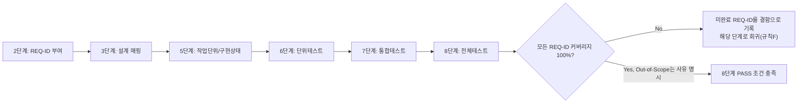

# 요구사항 추적 매트릭스 (Requirements Traceability Matrix)

> 2단계(기획서 작성)에서 생성. 이후 모든 단계가 갱신한다. 8단계(전체 풀테스트) 완료 조건은 이 매트릭스의 모든 행이 "구현"과 "테스트" 컬럼까지 채워져 있는 것이다(제외 항목은 사유 명시).
> 출처 기획서: `docs/harness/02-planning.md` (v1, 2026-09-16)

| REQ-ID | 요구사항/기능 (기획서 §) | 설계 매핑 (설계서 §) | 작업 단위 (unit-n) | 구현 상태 | 단위테스트 (unit-n-test) | 통합테스트 (feature-x) | 전체테스트(08) | 비고 |
|--------|--------------------------|------------------------|----------------------|------------|----------------------------|---------------------------|------------------|------|
| REQ-001 | 콘텐츠 CRUD/편집 워크플로(작성·임시저장·예약발행·리비전) (§4 Must) | | WU-02 | Not Started | | | | |
| REQ-002 | 카테고리/태그 분류체계 (§4 Must) | | WU-02 | Not Started | | | | |
| REQ-003 | 콘텐츠 공개 목록/상세 뷰 (§4 Must) | | WU-04 | Not Started | | | | |
| REQ-004 | RSS 피드 제공 (§4 Must) | | WU-04 | Not Started | | | | 검색 외 채널(01 §8-5) |
| REQ-005 | SEO 기본요소(메타태그/사이트맵/robots.txt/구조화 데이터) (§4 Must) | | WU-05 | Not Started | | | | |
| REQ-006 | 이미지/미디어 업로드 — S3 호환 오브젝트 스토리지 연동 (§4 Must, 필수 지정) | | WU-03 | Not Started | | | | 로컬 파일시스템 저장 불가(01 §6) |
| REQ-007 | 개인정보처리방침 페이지 게시 (§4 Must, 필수 지정) | | WU-06 | Not Started | | | | 한국 개인정보 보호법(01 §5). 회원가입/댓글 등 개인정보 수집 기능 설계 시 법제처/개인정보보호위원회 공식자료 재확인 필요 |
| REQ-008 | 쿠키 사용 고지 (§4 Must, 필수 지정) | | WU-06 | Not Started | | | | 한국 기준(01 §5). 해외 GDPR 강화는 REQ-021 |
| REQ-009 | 이용약관 페이지(저작권/콘텐츠 이용범위) (§4 Must) | | WU-06 | Not Started | | | | |
| REQ-010 | 관리자 인증(Django 기반 어드민 권한관리) (§4 Must) | | WU-09 | Not Started | | | | |
| REQ-011 | Render 무료 티어 콜드스타트 UX 대응 (§4 Must, 필수 지정) | | WU-08 | Not Started | | | | 무료 티어 한계 대응(01 §6) |
| REQ-012 | Render 월 750 인스턴스시간 한도 모니터링 및 유료 전환 기준 문서화 (§4 Must, 필수 지정) | | WU-08 | Not Started | | | | 무료 티어 한계 대응(01 §6) |
| REQ-013 | Neon PITR 6시간 한계 보완 백업 정책 (§4 Must) | | WU-10 | Not Started | | | | |
| REQ-014 | 반응형 기본 레이아웃(접근성 포함) (§4 Must) | | WU-04 | Not Started | | | | 세부는 4단계 UX 산출물 |
| REQ-015 | 콘텐츠 정책 — 금융/의료/법률/보험 등 인허가 규제 대상 조언성 콘텐츠 게시 금지 가이드라인 (§4 Must, 규칙 I 대응) | | WU-06 | Not Started | | | | 규칙 I 비해당 상태 유지 목적(§2 가정 A2) |
| REQ-016 | 이메일 뉴스레터 구독 폼(수집) (§4 Should) | | WU-07 | Not Started | | | | 발송 인프라는 별도 WU(가정 A9) |
| REQ-017 | AI 검색 대응 콘텐츠/트래픽 전략(질문-답변형 가이드라인 + RSS/이메일 채널 이중화) (§4 Should, 필수 지정) | | WU-05 | Not Started | | | | 01 §2-3, §4, §8-5 |
| REQ-018 | 사이트 내부 검색 기능 (§4 Could) | | WU-11 | Not Started | | | | |
| REQ-019 | 댓글 기능 (§4 Could) | | WU-11 | Not Started | | | | 도입 시 REQ-007 범위 재검토 필요 |
| REQ-020 | 소셜 공유 버튼 (§4 Could) | | WU-11 | Not Started | | | | |
| REQ-021 | 다국어/GDPR 쿠키배너 강화 대응 (§4 Won't) | - | - | Out-of-Scope(해외 방문자 비중 미확정, v1은 국내 우선 가정 A3) | - | - | - | 해외 트래픽 유의미해지면 규칙F로 재작업 |
| REQ-022 | 유료 구독/결제 기능 (§4 Won't) | - | WU-12(보류) | Out-of-Scope(수익화 모델 미정 — 02-planning.md §11 Q1 미해결) | - | - | - | Q1 응답 후 규칙F로 재작업, WU-12 착수 |
| REQ-023 | 광고 SDK 연동(애드센스 등) (§4 Won't) | - | WU-12(보류) | Out-of-Scope(동일 사유 — Q1 미해결) | - | - | - | Q1 응답 후 규칙F로 재작업 |
| REQ-024 | 회원제 멤버십/전용 콘텐츠 (§4 Won't) | - | WU-12(보류) | Out-of-Scope(수익화 모델(Q1)에 종속) | - | - | - | Q1 응답 후 규칙F로 재작업 |
| REQ-025 | LLM/AI 생성 콘텐츠 기능(챗봇/자동생성/추천 등) (§4 Won't) | - | - | Out-of-Scope(규칙 J 비해당 — 01 §8 부록, 사용자 명시 확인) | - | - | - | |
| REQ-026 | 다중 저자 대규모 편집 워크플로/세분화 권한체계 (§4 Won't) | - | - | Out-of-Scope(타깃을 1인/소규모로 가정 — §2 가정 A1) | - | - | - | |
| REQ-027 | 모바일 네이티브 앱 (§4 Won't) | - | - | Out-of-Scope(반응형 웹(REQ-014)으로 충분) | - | - | - | |

## 작성 규칙
- REQ-ID는 2단계에서 기획서의 기능 범위(In-Scope) 항목마다 하나씩 부여한다. 이후 단계에서 새 ID를 임의로 추가하지 않고, 새 요구사항이 필요하면 규칙 A에 따라 질문하거나 규칙 F(피드백 루프)로 상위 단계를 수정한다.
- Out-of-Scope로 명시된 항목은 매트릭스에 포함하되 상태를 "Out-of-Scope(사유)"로 표기해, 나중에 "빠뜨린 것"과 "의도적으로 뺀 것"을 구분할 수 있게 한다.
- 8단계에서 이 매트릭스를 검토해 커버리지 100%를 확인하지 못하면 PASS 판정할 수 없다.
- REQ-022~024(수익화 관련)는 `02-planning.md` §11 Q1이 미해결 상태이므로, Q1 응답 전까지 3단계 설계 범위에 포함하지 않는다(규칙 A-③ 준수).

## REQ-ID 생애주기 (참고용 다이어그램)
> 아래 다이어그램은 하나의 REQ-ID가 단계를 거치며 채워지는 흐름을 시각적으로 요약한 참고 자료다. 최종 근거는 항상 위 표와 작성 규칙이다.

