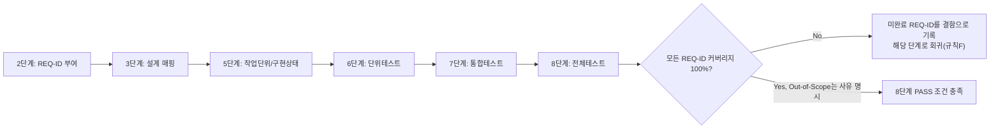

# 요구사항 추적 매트릭스 (Requirements Traceability Matrix)

> 2단계(기획서 작성)에서 생성. 이후 모든 단계가 갱신한다. 8단계(전체 풀테스트) 완료 조건은 이 매트릭스의 모든 행이 "구현"과 "테스트" 컬럼까지 채워져 있는 것이다(제외 항목은 사유 명시).
> 출처 기획서: `docs/harness/02-planning.md` (v1.2, 2026-09-16)
> 3단계 설계 매핑 갱신: `docs/harness/03-system-design.md` (v1.1, 2026-09-16)

| REQ-ID | 요구사항/기능 (기획서 §) | 설계 매핑 (설계서 §) | 작업 단위 (unit-n) | 구현 상태 | 단위테스트 (unit-n-test) | 통합테스트 (feature-x) | 전체테스트(08) | 비고 |
|--------|--------------------------|------------------------|----------------------|------------|----------------------------|---------------------------|------------------|------|
| REQ-001 | 콘텐츠 CRUD/편집 워크플로(작성·임시저장·예약발행·리비전) (§4 Must) | 03 §2.1(Wagtail 채택 근거), §3.2(Page 리비전/go_live_at·expire_at 내장 기능으로 구현) | WU-02 | 구현 완료(`unit-02-note.md`, `webapp/blog/models.py` BlogPostPage — Wagtail Page 상속, PageRevision/go_live_at/expire_at 코어 기능 그대로 사용) | PASS(`unit-02-test.md`, AC1~20 전부 독립 재현 PASS, DEF-001은 Low·범위 외 리스크로 이관) | PASS(`feature-WU-02-integration-test.md`, production 유사 설정+실제 관리자 HTML 폼 제출로 초안/발행/수정재발행/예약발행 전부 재확인, DEF-001 위험표면 축소) | | |
| REQ-002 | 카테고리/태그 분류체계 (§4 Must) | 03 §3.2(Category Snippet, django-taggit Tag) | WU-02 | 구현 완료(`unit-02-note.md`, `webapp/blog/models.py` Category Snippet + BlogPageTag/django-taggit) | PASS(`unit-02-test.md`, AC5/6/8/16 등 Category/Tag CRUD 전부 PASS, DEF-001(Category 빈 이름 ORM 레벨 미검증)은 Low 리스크로 이관) | PASS(`feature-WU-02-integration-test.md`, 실제 관리자 추가 폼 HTTP 경로에서 Category CRUD/빈 이름 거부 재확인, DEF-001 위험표면 축소) | | |
| REQ-003 | 콘텐츠 공개 목록/상세 뷰 (§4 Must) | 03 §4(`GET /`, `GET /blog/<slug>/`, `GET /category/<slug>/`, `GET /tag/<slug>/`) | WU-04 | 구현 완료(`unit-04-note.md`, `webapp/home/models.py` HomePage.get_context(S-01), `webapp/blog/views.py` post_detail/category_list/tag_list(S-02~S-04), `webapp/blog/models.py` get_url_parts/serve(정규 URL·트리 URL 리다이렉트, DEC-017)) | PASS(`unit-04-test.md` §10, 2라운드 재검증 — DEF-001을 유발한 `config/templates/500.html` 다중 라인 주석을 `...`로 교체한 수정을 dev/production 유사 설정 양쪽에서 `django.views.defaults.server_error()` 직접 호출로 TemplateSyntaxError 해소 재확인(TC-031), 4절 35개 TC 전부 재실행해 회귀 없음 확인. 1라운드 FAIL 기록은 보존, 최종 판정은 PASS로 갱신) | PASS(`feature-WU-04-integration-test.md` — WU-01(production 유사 HTTPS 강제설정)+WU-02(BlogPostPage 발행)+WU-03(CustomImage 실제 업로드) 전체 조립 상태에서 업로드→발행→홈(S-01)/상세(S-02)/카테고리(S-03)/태그(S-04, 한글 slug) 노출까지 E2E 왕복 확인(IT-05~IT-13). DEC-017 트리URL 301이 WU-01 HTTPS 강제 설정과 어드민 미리보기 결합 상태에서도 유효함을 재확인(IT-19, IT-26 — 올바른 Render 트래픽 시뮬레이션 조건에서 PASS, 세부는 결과서 §6-2 참고). 결함 0건(발견 사항 2건은 코드 결함 아님으로 근거와 함께 확정)) | | REQ-014와 함께 구현. REQ-003 자체 라우트(목록/상세/카테고리/태그)는 이미 PASS, DEF-001은 별도 파일(500.html) 결함 — 6단계 2라운드에서 수정, 7단계가 WU-01~04 전체 조립 상태에서도 유효함을 재확인 |
| REQ-004 | RSS 피드 제공 (§4 Must) | 03 §4(`GET /feed.xml`) | WU-04 | 구현 완료(`unit-04-note.md`, `webapp/blog/feeds.py` LatestPostsFeed(Django syndication), `webapp/blog/urls.py`) | PASS(`unit-04-test.md` §10, 2라운드 재검증 — TC-014(RSS)는 1라운드부터 PASS였고 이번 2라운드 회귀 재실행에서도 재확인. 같은 업무단위(WU-04)의 DEF-001(500.html)을 `unit-04-note.md` §10에서 수정, TC-031 재실행으로 해소 확인) | PASS(`feature-WU-04-integration-test.md` — RSS(/feed.xml)가 WU-02 발행 데이터와 WU-04 정규 URL(get_url_parts)을 정확히 소비함을 E2E로 재확인(IT-13), production 유사 HTTPS 강제 설정 조합에서도 정상 동작(IT-22), 결함 0건) | | 검색 외 채널(01 §8-5) |
| REQ-005 | SEO 기본요소(메타태그/사이트맵/robots.txt/구조화 데이터) (§4 Must) | 03 §4(`GET /sitemap.xml`, `GET /robots.txt`, JSON-LD/BlogPosting 구현 방침), §6.3·§8(robots.txt 스핀다운 가로채기 리스크) | WU-05 | 구현 완료(`unit-05-note.md`, Wagtail 표준 `seo_title`/`search_description`(base.html title/meta description), Open Graph/Twitter Card 메타태그, `<link rel="canonical">`(`core/context_processors.py`, DEC-017 정규 URL과 정합), `wagtail.contrib.sitemaps` 기반 `/sitemap.xml`, `core/views.py` `/robots.txt`, `blog/models.py` BlogPostPage.get_json_ld(schema.org BlogPosting JSON-LD, `core/templatetags/seo_tags.py` 안전 직렬화)) | PASS(`unit-05-test.md`, §8 AC1~18 전부 05단계 보고를 신뢰하지 않고 처음부터 독립 재현 PASS, 결함 0건. production 유사 HTTPS 환경에서 canonical/sitemap.xml/robots.txt가 실제 도메인 기준 절대 URL을 냄을 실측 확인(TC-015, DEC-021 유효성 재확인). WU-04 `BlogPostPage.serve()`의 Site.hostname 의존 여부를 코드 확인+실제 HTTPS/X-Forwarded-Proto 요청으로 재현 시도했으나 결함 미재현(TC-019) — 근거: 현재 Site가 1개뿐이라 `get_url_parts()`가 상대경로를 반환함, 다중 Site 시나리오는 여전히 잔존 리스크로 §7에 07단계 인계) | PASS(`feature-WU-05-integration-test.md`) — WU-02(카테고리/태그/FAQ StreamField)+WU-03(CustomImage 실제 업로드)+WU-04(목록/상세/카테고리/태그/RSS) 전체 조립 상태에서 이미지+카테고리+태그+FAQ 포함 게시물을 발행해 canonical/OG/JSON-LD/sitemap.xml/robots.txt가 방문자 화면 전체와 정합성 있게 노출됨을 E2E로 확인(IT-04~IT-14). Wagtail 어드민에서 실제로 Site를 2개 이상 생성하는 3가지 현실적 시나리오(같은 트리 중복 생성/분리된 트리의 별도 Site/기존 레코드 hostname 갱신)를 실측 재현한 결과, 오케스트레이터가 지목한 트리URL 리다이렉트(DEC-017)와 sitemap/canonical은 전부 안전했으나, JSON-LD `mainEntityOfPage.@id`가 분리된 Site 시나리오에서 갱신되지 않은 도메인을 노출하는 Medium 결함(DEF-001)을 신규 발견 — 근본 원인은 WU-01이 아니라 WU-05 소유 `core/seo.py`이며, 이 프로젝트가 계획하지 않는 오조작 시나리오에서만 도달 가능함을 확인해 PASS 판정에는 영향 없음(상세는 `feature-WU-05-integration-test.md` §6-1). WU-01 production 보안설정(HTTPS 강제/XForwardedForMiddleware)과의 결합에서도 회귀 없음(IT-25~IT-33). | | robots.txt 스핀다운 가로채기는 플랫폼 제약이라 10단계 실측 대상(03 §6.3 기존 기록 유지). sitemap.xml/JSON-LD 절대 URL은 Wagtail Site.hostname 기본 동작 대신 요청 기반으로 보정(DEC-021). DEF-001(JSON-LD mainEntityOfPage 다중 Site 오조작 시나리오 결함, Medium, Open/Deferred)은 `feature-WU-05-integration-test.md` §6/§7 참고 — 운영 Runbook(11단계)에 "Site 신규 생성 금지, hostname은 기존 레코드만 수정" 경고 반영 권고 |
| REQ-006 | 이미지/미디어 업로드 — S3 호환 오브젝트 스토리지 연동 (§4 Must, 필수 지정) | 03 §2.3(Cloudflare R2 채택, DEC-008), §3.2(CustomImage), §5.5(버킷 분리/업로드 검증) | WU-03 | 구현 완료(`unit-03-note.md`, `webapp/custom_images/` CustomImage/CustomRendition + `WAGTAILIMAGES_IMAGE_MODEL` 스왑, `blog/migrations/0002_alter_blogpostpage_featured_image.py`(DEF-002 해소), production.py `STORAGES["default"]`=media-public·`STORAGES["backup"]`=backup-private 분리, 업로드 확장자/크기 검증) | PASS(`unit-03-test.md`, note AC1~20(TC-01~20) + 자체추가 위험/경계 케이스 TC-21~27 전부 독립 재현 PASS, 결함 0건, R2 실연동은 10단계 이월) | PASS(`feature-WU-03-integration-test.md`, WU-01 production 유사 보안설정(SECURE_PROXY_SSL_HEADER/XForwardedForMiddleware) 위에서 실제 관리자 HTML 폼 업로드+렌디션 생성 재확인, WU-02 BlogPostPage 발행 워크플로에 featured_image(CustomImage FK) 실제 첨부→발행→재조회 e2e 왕복 확인, 전체 마이그레이션 체인(home→blog.0001→custom_images.0001→blog.0002) 처음부터 재현, 결함 0건) | | 로컬 파일시스템 저장 불가(01 §6). R2 실연동(네트워크)은 10단계에서 실측 필요 |
| REQ-007 | 개인정보처리방침 페이지 게시 (§4 Must, 필수 지정) | 03 §4(`GET /privacy-policy/`), §5.6(수집최소화/보관기간/파기절차/제3자제공 범위 명시 요구) | WU-06 | 구현 완료(`unit-06-note.md`, `webapp/legal/models.py` LegalPage(공용 모델, DEC-022), `webapp/legal/migrations/0002_create_legal_pages.py`가 실제 콘텐츠로 게시(live=True), 수집항목/보유기간/파기절차/제3자 위탁(Render·Neon·Cloudflare·GitHub, 국외이전) 전부 본문에 명시) | PASS(`unit-06-test.md`, §8 AC1~19 전부 05단계 보고를 신뢰하지 않고 처음부터 독립 재현 PASS, 결함 0건. `GET /privacy-policy/` 200+수집항목/보유기간/파기절차/제3자위탁(Render/Neon/Cloudflare/GitHub) 문구 실제 렌더링 확인(TC-005), TOC h2 앵커 8개(한글 슬러그) 정확 생성 확인(TC-010), 빈 DB 마이그레이션에서 locale 결함 재발 없음 확인(TC-002)) | PASS(`feature-WU-06-integration-test.md`) — WU-01(production 유사 HTTPS 강제설정)+WU-05(canonical/sitemap.xml/robots.txt SEO 체계) 전체 조립 상태에서 `/privacy-policy/`가 정상 렌더링되고 canonical/sitemap이 실제 요청 도메인 기준으로 일관됨을 확인(IT-13/IT-17). 헤더/푸터(WU-04)에 링크가 실제로 연결돼 있고 200을 반환함을 사이트 전체 화면 종류에서 교차 확인(IT-04), 결함 0건. | | 한국 개인정보 보호법(01 §5). 회원가입/댓글 등 개인정보 수집 기능 설계 시 법제처/개인정보보호위원회 공식자료 재확인 필요. 본문은 초안이며 실제 공개 전 법률 자문 권고(03 §5.6 계승) |
| REQ-008 | 쿠키 사용 고지 (§4 Must, 필수 지정) | 03 §4(`GET /cookies/`), §5.6 | WU-06 | 구현 완료(`unit-06-note.md`, `webapp/legal/migrations/0002_create_legal_pages.py`가 `/cookies/` 페이지 게시, `webapp/config/templates/base.html`의 CookieConsentBanner(전역, localStorage 기반, `webapp/config/static/js/cookie-consent.js`) — WU-04가 "포함"으로 기록했으나 실제 코드가 없던 공백을 WU-06이 REQ-008 소유 범위에서 실제 구현) | PASS(`unit-06-test.md`, `GET /cookies/` 200+본문 확인(TC-007), 전역 노출을 홈/legal 2개 화면 교차 확인(TC-008), 최초노출/동의 후 localStorage 저장/재방문 미노출/localStorage 삭제 후 재노출을 jsdom으로 실제 `cookie-consent.js` 실행해 실측 검증(TC-011), 키보드 Tab 포커스/ESC 닫기/포커스 트랩 없음을 jsdom으로 실측(TC-012), `prefers-reduced-motion: reduce` 시 애니메이션 미적용을 CSS 소스로 확인(TC-013), localStorage 접근 자체가 예외를 던지는 환경에서도 크래시 없이 폴백함을 실제 예외 주입으로 확인(TC-EDGE-03)) | PASS(`feature-WU-06-integration-test.md`) — CookieConsentBanner가 홈/카테고리/태그/게시물상세/법적페이지 3종/404(S-01~S-08) 전 화면 종류에서 서버 렌더링 마크업 기준으로 일관되게 노출됨을 dev+production 유사(DEBUG=False) 양쪽에서 확인(IT-03/IT-15/IT-16). WU-01 HTTPS 강제 설정과 결합한 상태에서도 정상 동작(IT-15/16), 결함 0건. | | 한국 기준(01 §5). 해외 GDPR 강화는 REQ-021 |
| REQ-009 | 이용약관 페이지(저작권/콘텐츠 이용범위) (§4 Must) | 03 §4(`GET /terms/`) | WU-06 | 구현 완료(`unit-06-note.md`, `webapp/legal/migrations/0002_create_legal_pages.py`가 `/terms/` 페이지 게시(저작권 원칙/이용자 제공정보 처리/약관변경 포함)) | PASS(`unit-06-test.md`, `GET /terms/` 200+본문 확인(TC-006), canonical 태그로 WU-05 SEO 체계 자동 편입 확인(TC-015), sitemap.xml 포함 확인(TC-014)) | PASS(`feature-WU-06-integration-test.md`) — `/terms/`가 WU-01~05 전체 조립 상태에서 정상 렌더링되고 canonical이 정확함을 확인(IT-13/IT-17), 결함 0건. | | |
| REQ-010 | 관리자 인증(Django 기반 어드민 권한관리) (§4 Must) | 03 §5.1(DEC-009: 세션 인증 + Wagtail 그룹 페이지 권한, 어드민 경로 변경, 로그인 레이트리밋) | WU-09 | Not Started | | | | |
| REQ-011 | Render 무료 티어 콜드스타트 UX 대응 (§4 Must, 필수 지정) | 03 §2.4(Render 자체 스핀업 로딩페이지 공식 확인), §6.3(DEC-011: 킵얼라이브 미도입 결정과 근거) | WU-08 | Not Started | | | | 무료 티어 한계 대응(01 §6) |
| REQ-012 | Render 월 750 인스턴스시간 한도 모니터링 및 유료 전환 기준 문서화 (§4 Must, 필수 지정) | 03 §6.3(유료 전환 4대 기준), §7.2(Render 자동 이메일 알림), §7.4(Runbook 주1회 점검) | WU-08 | Not Started | | | | 무료 티어 한계 대응(01 §6) |
| REQ-013 | Neon PITR 6시간 한계 보완 백업 정책 (§4 Must) | 03 §1.1(GitHub Actions 백업 아키텍처, DEC-010), §3.3(destructive 마이그레이션 전 수동 백업 원칙), §7.3(RPO/RTO 정의), §7.5(R2 백업 Lifecycle 14일) | WU-10 | Not Started | | | | |
| REQ-014 | 반응형 기본 레이아웃(접근성 포함) (§4 Must) | 03 §1.2(모듈 경계에서 자리만 정의), §6.2(SPA 미도입 원칙) — 세부는 4단계 UX 산출물 | WU-04 | 구현 완료(`unit-04-note.md`, `webapp/config/static/css/components.css`(04 §6 브레이크포인트 sm/md/lg/xl), `webapp/config/static/js/nav.js`(모바일 드로어 포커스 관리, WCAG 2.4.3), `webapp/config/templates/partials/header.html`·`footer.html`, srcset 반응형 이미지(04 §6)) | PASS(`unit-04-test.md` §10, 2라운드 재검증 — S-08(404)은 1라운드부터 PASS. S-09(500)의 DEF-001을 `unit-04-note.md` §10에서 수정 — `config/templates/500.html` 주석을 `...`로 교체해 TemplateSyntaxError 해소, dev/production 유사 설정 양쪽에서 TC-031 재실행으로 실증, 4절 35개 TC 전체 회귀 재실행 결함 0건) | PASS(`feature-WU-04-integration-test.md` — 반응형 이미지(srcset)가 WU-03 실제 렌디션 파일 생성까지 포함한 완결된 흐름으로 검증됨(IT-08/IT-09). 500.html(S-09) DEF-001 수정이 WU-01~04 전체 조립 상태에서도 유효함을 재확인(IT-23). 접근성 마크업 세부는 unit-04-test.md TC-023/024가 이미 확정(반복 검증 안 함), 결함 0건) | | 세부는 4단계 UX 산출물. 500 페이지(S-09) 렌더링 결함(DEF-001)은 재작업 후 6단계 2라운드 재검증(unit-04-test.md §10)과 7단계 WU-01~04 조립 상태 재검증(feature-WU-04-integration-test.md IT-23) 양쪽 모두에서 PASS로 해소 확인 |
| REQ-015 | 콘텐츠 정책 — 금융/의료/법률/보험 등 인허가 규제 대상 조언성 콘텐츠 게시 금지 가이드라인 (§4 Must, 규칙 I 대응) | 03 §5.6(규칙 I 재확인, 허용 카테고리 화이트리스트 운영정책 + `legal` 앱 콘텐츠 정책 페이지로 구체화) | WU-06 | 구현 완료(`unit-06-note.md`, `webapp/legal/migrations/0002_create_legal_pages.py`의 `/terms/` 본문 "콘텐츠 정책" 하위 섹션에 "금융/투자, 의료/건강, 법률, 보험 등... 전문가의 조언이나 추천을 제공하지 않습니다" 명시적 면책 문구 게시 — 04-ux-design.md DEC-018/§7 S-06 통합 방침 그대로 따름, 신규 라우트 없음) | PASS(`unit-06-test.md`, `/terms/` 응답에 REQ-015 면책 문구("금융/투자, 의료/건강, 법률, 보험")가 정확한 문자열로 실제 렌더링됨을 TC-006으로 실측 확인 — 규칙I 대응) | PASS(`feature-WU-06-integration-test.md`) — REQ-015 면책 문구("금융/투자, 의료/건강, 법률, 보험")가 WU-01~05 전체 조립 상태에서도 정확한 문자열로 실제 렌더링됨을 재확인(IT-08), 결함 0건. | | 규칙 I 비해당 상태 유지 목적(§2 가정 A2) |
| REQ-016 | 이메일 뉴스레터 구독 폼(수집) (§4 Should) | 03 §3.2(NewsletterSubscriber 모델), §4(`POST /newsletter/subscribe/`), §5.3(이메일 열거공격 방지/중복구독 처리계약/허니팟/레이트리밋), §5.6(수집최소화/동의/보관기간) | WU-07 | 구현 완료(`unit-07-note.md`, `webapp/subscribers/models.py` NewsletterSubscriber(UUID PK/이메일 유니크+소문자 정규화/consent_version/source_ip_masked/status), `webapp/subscribers/views.py` `POST /newsletter/subscribe/`(레이트리밋→허니팟→검증→중복 처리 03 §5.3 계약 그대로), `webapp/subscribers/forms.py`, `webapp/config/static/js/newsletter.js`(점진적 향상), `webapp/subscribers/templates/subscribers/`(무-JS 폴백 포함), `webapp/config/templates/partials/footer.html`·`webapp/blog/templates/blog/blog_post_page.html`·`webapp/blog/templates/blog/partials/_post_list.html`(04 §2 S-01/S-02/S-03/S-04 배치 반영)) | 대기(6단계) | | | 발송 인프라·자동 구독취소 링크는 이번 WU 범위 밖(가정 A9, 03 §5.3/§5.6, DEC-023). 더블옵트인 v1 미구현(설계서 §8-4 트레이드오프). 구현 중 `@cache_page` 캐시 페이지에 폼을 직접 두면 403이 나는 결함을 발견해 조각 엔드포인트 방식으로 해결(DEC-025) — 6단계 인수조건에 회귀 시나리오 포함(unit-07-note.md §5) |
| REQ-017 | AI 검색 대응 콘텐츠/트래픽 전략(질문-답변형 가이드라인 + RSS/이메일 채널 이중화) (§4 Should, 필수 지정) | 03 §3.2(StreamField FAQ 블록), §4(JSON-LD/FAQPage 구조화데이터 구현 방침), REQ-004(RSS)·REQ-016(이메일)로 채널 이중화 | WU-05 | 구현 완료(`unit-05-note.md`, `webapp/CONTENT_GUIDE.md` 운영자 가이드, `blog/blocks.py` FAQItemBlock help_text(어드민 화면 내 템플릿 수준 가이드), `blog/models.py` BlogPostPage.get_faq_json_ld(schema.org FAQPage, BlogPosting과 별도 script로 분리), `base.html` `<link rel="alternate" type="application/rss+xml">`(WU-04 RSS를 SEO/디스커버리 관점에서 명시적으로 노출)) | PASS(`unit-05-test.md`, FAQPage JSON-LD 개수/빈 답변 제외/HTML태그·엔티티 미잔존을 TC-009로 독립 재현 PASS, RSS `<link rel="alternate">` 노출을 TC-006으로 확인, 결함 0건) | PASS(`feature-WU-05-integration-test.md`) — FAQPage JSON-LD(빈 답변 제외, HTML 태그/미해석 엔티티 없음)가 실제 발행된 게시물에서 정확히 산출됨을 확인(IT-06), RSS(`/feed.xml`, WU-04)가 상세페이지의 canonical과 동일한 정규 URL을 소비함을 E2E로 재확인(IT-13, 채널 이중화 정합성). | | 이메일 채널(REQ-016)은 WU-07 미구현 상태 — 가이드에 "준비 중" 안내만 포함, RSS는 이미 노출 완료. 01 §2-3, §4, §8-5 |
| REQ-018 | 사이트 내부 검색 기능 (§4 Could) | 03 §1.2(모듈 경계에 자리만 마련, v1 미구현) | WU-11 | Not Started | | | | |
| REQ-019 | 댓글 기능 (§4 Could) | 03 §1.2(자리만 마련, v1 미구현), §5.6(도입 시 개인정보 처리 재검토 필요 명시) | WU-11 | Not Started | | | | 도입 시 REQ-007 범위 재검토 필요 |
| REQ-020 | 소셜 공유 버튼 (§4 Could) | 03 §1.2(자리만 마련, v1 미구현) | WU-11 | Not Started | | | | |
| REQ-021 | 다국어/GDPR 쿠키배너 강화 대응 (§4 Won't) | - (설계 범위 밖, 03 §0/§8 Out-of-Scope 목록에 명시) | - | Out-of-Scope(해외 방문자 비중 미확정, v1은 국내 우선 가정 A3) | - | - | - | 해외 트래픽 유의미해지면 규칙F로 재작업 |
| REQ-022 | 유료 구독/결제 기능 (§4 Won't) | - (03 §0에서 DEC-005 근거로 설계 범위에서 명시적 제외 확정) | WU-12(보류) | Out-of-Scope(DEC-005로 "완전 무료" 확정 — 더 이상 미정 상태 아님) | - | - | - | 정책 변경 시 규칙F로 재작업, WU-12 착수 |
| REQ-023 | 광고 SDK 연동(애드센스 등) (§4 Won't) | - (03 §0 동일) | WU-12(보류) | Out-of-Scope(DEC-005로 확정) | - | - | - | 정책 변경 시 규칙F로 재작업 |
| REQ-024 | 회원제 멤버십/전용 콘텐츠 (§4 Won't) | - (03 §0/§5.1에서 구독자 무인증 모델과 배치되므로 범위 제외 재확인) | WU-12(보류) | Out-of-Scope(DEC-005로 확정) | - | - | - | 정책 변경 시 규칙F로 재작업 |
| REQ-025 | LLM/AI 생성 콘텐츠 기능(챗봇/자동생성/추천 등) (§4 Won't) | - (03 §5.7 규칙 J 재확인, 해당 없음) | - | Out-of-Scope(규칙 J 비해당 — 01 §8 부록, 사용자 명시 확인) | - | - | - | |
| REQ-026 | 다중 저자 대규모 편집 워크플로/세분화 권한체계 (§4 Won't) | - (03 §5.1에서 1인/소규모 운영 전제의 단순 권한 모델과 배치되므로 범위 제외 재확인) | - | Out-of-Scope(타깃을 1인/소규모로 가정 — §2 가정 A1) | - | - | - | |
| REQ-027 | 모바일 네이티브 앱 (§4 Won't) | - (03 §4에서 REST/JSON API 자체를 v1 범위에 두지 않는 근거로 재인용) | - | Out-of-Scope(반응형 웹(REQ-014)으로 충분) | - | - | - | |

## 작성 규칙
- REQ-ID는 2단계에서 기획서의 기능 범위(In-Scope) 항목마다 하나씩 부여한다. 이후 단계에서 새 ID를 임의로 추가하지 않고, 새 요구사항이 필요하면 규칙 A에 따라 질문하거나 규칙 F(피드백 루프)로 상위 단계를 수정한다.
- Out-of-Scope로 명시된 항목은 매트릭스에 포함하되 상태를 "Out-of-Scope(사유)"로 표기해, 나중에 "빠뜨린 것"과 "의도적으로 뺀 것"을 구분할 수 있게 한다.
- 8단계에서 이 매트릭스를 검토해 커버리지 100%를 확인하지 못하면 PASS 판정할 수 없다.
- REQ-022~024(수익화 관련)는 DEC-005(2026-09-16, "완전 무료" 확정)에 따라 3단계 설계 범위에 포함하지 않았다. 과거에는 "Q1 미해결"이 사유였으나, 이제는 "정책상 확정 제외"가 사유이며 향후 정책이 바뀌면 규칙 F로 재작업한다.

## REQ-ID 생애주기 (참고용 다이어그램)
> 아래 다이어그램은 하나의 REQ-ID가 단계를 거치며 채워지는 흐름을 시각적으로 요약한 참고 자료다. 최종 근거는 항상 위 표와 작성 규칙이다.

