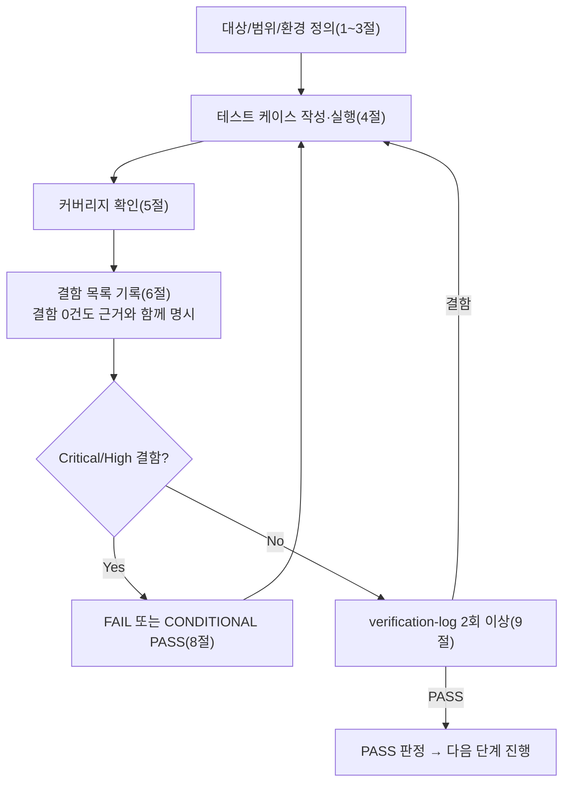

# 테스트 결과서 (Test Result Report) — WU-02

## 1. 개요
- 테스트 대상: 작업 단위 WU-02(콘텐츠 모델 및 CRUD) — `webapp/blog/`(신규 앱: `models.py`, `blocks.py`, `apps.py`, `migrations/0001_initial.py`) + `webapp/config/settings/base.py`(`INSTALLED_APPS`에 `"blog"` 1줄 추가)
- 테스트 유형: 단위(Unit)
- 테스트 목적: 05단계(`unit-02-note.md`)가 "로컬에서 25개 항목을 검증해 이상 없음"이라고 보고했으나, 그 검증에 쓴 venv/DB가 삭제되어 재현 불가능한 상태였다. 규칙C(재현 없이 "이상 없음"은 무효)에 따라 이번 06단계는 **처음부터 완전히 독립된 환경에서 동일 절차를 백지 상태로 재현**하고, `unit-02-note.md` §8의 20개 인수조건(AC1~AC20)을 1:1로 증명한다.
- 관련 산출물: `docs/harness/units/unit-02-note.md`(§8 인수조건), `docs/harness/03-system-design.md`(v1.2, §3 데이터 모델, DEC-007), `docs/harness/04-ux-design.md`(v1.2, §5/§7 접근성), `docs/harness/decisions.md`(DEC-001~015), `docs/harness/units/unit-01-note.md`(WU-01 골격)
- 테스트 수행자(에이전트): `06-unit-tester`
- 테스트 일시: 2026-09-16

## 2. 테스트 범위 및 제외 범위
- 범위 (In-Scope): `unit-02-note.md` §8의 AC1~AC20 전체 재현 검증(마이그레이션, ORM CRUD 왕복, 초안/예약발행/즉시발행/리비전 누적, `ImageBlock.alt_text` 접근성 강제, Category Snippet/Tag CRUD, Wagtail 어드민 스모크, `/cms-admin/` 경로 통합/회귀, 검증 산출물 정리). 인수조건에는 없지만 명백히 위험하다고 판단해 추가한 케이스: `category` FK가 없는 페이지 생성 거부, `Category.name`이 비어있는 경우의 동작, `Category.name` 중복 생성 거부, `on_delete=PROTECT`가 실제로 카테고리 삭제를 막는지.
- 제외 범위 (Out-of-Scope) 및 사유:
  - **공개 프런트엔드 템플릿/실제 렌더링(WU-04 범위)**: `unit-02-note.md` §2-3/§2-4가 명시적으로 범위 밖으로 미뤘다. 이번 테스트에서는 "정확히 `TemplateDoesNotExist`로 실패하는지"만 재현 확인했다(§4 TC-021 참고, 회귀 없음 확인 목적).
  - **실제 이미지 파일 업로드(WU-03/R2 연동 필요)**: `unit-02-note.md` §3 "로컬에서 확인하지 못한 것"과 동일한 사유(R2 자격증명 없음)로 이번 06단계도 검증 불가 — WU-03 완료 후 재검증 필요 항목으로 그대로 승계한다(7절에 기록).
  - **FAQ 블록의 JSON-LD 렌더링**: 03 §4/WU-05 범위. 데이터 구조(`items` 리스트) 저장/조회만 AC7 범위로 검증했다.
  - **Production 배포 환경(WSGI/리버스프록시/실제 R2/실제 Postgres) 기준 검증**: WU-01의 07단계(`feature-WU-01-integration-test.md`)와 동일하게, 이런 배포형태 검증은 07단계(통합테스트) 몫이다. 이번 06단계는 `config.settings.dev`(SQLite) + Django `test.Client`/ORM 레벨 검증까지만 수행한다.

## 3. 테스트 환경
- 실행 환경: Windows 10 Pro 10.0.19045, Git Bash(POSIX sh) 위에서 Python 3.13.9(Anaconda 배포판) 신규 venv 2개(`webapp/.venv_test06`, `webapp/.venv_test06b`, 각각 검증 후 완전 삭제) — 05단계가 만들었던 `.venv_wu02`와는 무관한, 이번 06단계가 처음부터 새로 만든 별개 환경이다.
- 패키지: `webapp/requirements.txt`를 그대로 `pip install`(Django==5.2.17, wagtail==7.4.3 등, 신규 패키지 추가 없음 — pip 설치 로그로 정확한 버전 고정을 재확인).
- DB: SQLite(`config.settings.dev` 기본값), 매 검증 라운드마다 `db.sqlite3`를 삭제하고 `migrate`로 처음부터 재생성(캐시된 상태에 의존하지 않음).
- 테스트 데이터: 스크립트(`wu02_verify.py`, 검증 후 삭제) 내에서 직접 생성한 `Category`(테스트/일반/변경카테고리/보호대상), `BlogPostPage`(첫 게시물/초안 게시물/카테고리 없음 시도/보호테스트), 어드민 슈퍼유저(`wu02_tester`, DB 종속 — 실제 운영 계정 아님).
- 전제 조건(Preconditions): `webapp/home/migrations/0002_create_homepage.py`가 만드는 `slug="home"` `HomePage`가 마이그레이션 시점에 이미 존재함(WU-01 산출물, 03 §3.1 ERD의 트리 루트).

## 4. 테스트 케이스 및 결과

| ID | 시나리오(AC 매핑) | 사전조건 | 실행 절차 | 예상 결과 | 실제 결과 | Pass/Fail | 비고 |
|----|----------|----------|-----------|-----------|-----------|-----------|------|
| TC-001 (AC1) | 신규 venv에 requirements 설치 | 빈 venv | `pip install -r requirements.txt` | 오류 없이 종료, 신규 패키지 없이 정확한 버전(Django 5.2.17/wagtail 7.4.3) 설치 | 오류 없이 종료. 설치 로그에 `Successfully installed Django-5.2.17 ... wagtail-7.4.3 ...`, WU-01 이후 신규 패키지 없음 확인 | PASS | |
| TC-002 (AC2) | `migrate`가 `blog.0001_initial`을 포함해 오류 없이 끝나는가 | 빈 SQLite DB(`db.sqlite3` 삭제 후) | `DJANGO_SETTINGS_MODULE=config.settings.dev python manage.py migrate` | exit 0, `blog.0001_initial` 적용 로그 출력, wagtailcore/wagtailimages/taggit 의존성 오류 없음 | exit 0. `Applying blog.0001_initial... OK` 확인, 전체 마이그레이션(약 100여개) 전부 OK | PASS | 02번 설계서 §3.3 표준 `migrate` 절차와 일치 |
| TC-003 (AC3) | 모델=마이그레이션 일치 | migrate 완료 상태 | `python manage.py makemigrations --check --dry-run` | "No changes detected", exit 0 | "No changes detected", exit 0 | PASS | |
| TC-004 (AC4) | 시스템 체크 | 동일 | `python manage.py check` | "System check identified no issues (0 silenced)" | 동일 문자열 출력 | PASS | |
| TC-005 (AC5) | Category slug 자동 생성 | Category 0건 | `Category.objects.create(name="테스트", slug="")` 후 `refresh_from_db()` | `slug == slugify("테스트", allow_unicode=True)` | `slug='테스트'`(한글 slugify 결과와 일치, 콘솔 표시는 cp949 코드페이지로 깨져 보였으나 `repr()` 별도 확인으로 실제 값이 정확함을 재확인) | PASS | 콘솔 인코딩 깨짐은 Windows 터미널 표시 문제일 뿐 데이터 정합성과 무관함을 별도로 확인(9절 2차 검증 참고) |
| TC-006 (AC6) | `category` 필수 FK — 미지정 시 거부 | `HomePage` 존재 | `category` 없이 `BlogPostPage(title=..., slug=...)`를 `home.add_child(instance=...)` | DB/ORM 제약으로 저장 실패(예외) | `ValidationError: {'category': ['이 필드는 null 값을 허용하지 않습니다.']}` 발생, 저장되지 않음 | PASS | |
| TC-007 (AC7) | StreamField 4블록 저장 + `alt_text` 보존 | `Category` 1건 | `paragraph`/`image`/`quote`/`faq` 각 1개씩 포함해 저장 후 재조회 | 4개 블록타입 모두 존재, `image` 블록의 `value["alt_text"]`가 원래 값과 동일 | `block_types={'paragraph','image','quote','faq'}`, `alt_text='대체 텍스트입니다'`(원본과 동일) | PASS | |
| TC-008 (AC8) | django-taggit 태그 저장/조회 | TC-007의 post | `post.tags.add("a","b")` 후 재조회 | 태그 2개(`a`,`b`) 조회됨 | `tags=['a','b']` | PASS | |
| TC-009 (AC9) | 초안 저장(`save_revision()`만, publish 없음) | 신규 페이지를 **명시적으로 `live=False`**로 생성 후 `add_child` | `save_revision(user=...)` 호출, publish 미호출 | 재조회 `live == False`, `PageRevision` 1건 이상 생성 | `live=False`, `revisions=1` | PASS | **1차 재현 시도에서 `live=False`를 명시하지 않아 Wagtail `Page.live` 모델 기본값(`True`)으로 인해 오탐 FAIL이 발생했던 것을 자체 발견·수정함(9절 내부검증 1차 참고) — 실제 앱 결함이 아니라 최초 테스트 스크립트 결함이었음을 코드(`Page._meta.get_field('live').default == True`) 근거로 명확히 구분** |
| TC-010 (AC10) | 예약발행(`go_live_at` 미래) | TC-009의 draft | `go_live_at`=+7일, `expire_at`=+30일 설정 후 `save_revision().publish()` | 재조회 `live == False` 유지, `go_live_at`/`expire_at` 저장됨 | `live=False`, `go_live_at`/`expire_at` 정확히 저장 | PASS | |
| TC-011 (AC11) | 즉시 게시(`go_live_at` 해제 후 재발행) | TC-010 상태 | `go_live_at=None` 후 `save_revision().publish()` | `live == True` | `live=True` | PASS | |
| TC-012 (AC12) | 리비전 누적(≥2건) | TC-009~011 흐름 | `revisions.count()` 확인 | 2건 이상 | `revisions=3` | PASS | |
| TC-013 (AC13) | UPDATE(제목/카테고리 수정 후 재발행) | TC-011 상태 | title/category 변경 후 `save_revision().publish()` | 재조회 시 변경사항 반영 | `title='수정된 제목'`, `category=<새 카테고리 id>` | PASS | |
| TC-014 (AC14) | DELETE | TC-013의 페이지 | `.delete()` 호출 후 동일 id로 재조회 | 조회되지 않음(`exists() == False`) | `exists=False` | PASS | |
| TC-015 (AC15) | 어드민 서브페이지 추가 화면 | 슈퍼유저 `force_login` | `GET /cms-admin/pages/<home.pk>/add_subpage/` | 200, 응답에 `blogpostpage` 노출 | `status=200`, `blogpostpage` 포함 확인 | PASS | |
| TC-016 (AC16) | Category 스니펫 목록/추가 폼 | 동일 | `GET /cms-admin/snippets/blog/category/`, `.../add/` | 각각 200 | `list=200`, `add=200` | PASS | |
| TC-017 (AC17) | 페이지 편집 폼 필드 노출 | TC-007의 post | `GET /cms-admin/pages/<post.pk>/edit/` | 200, `category`/`tags`/`body` 필드 렌더링 | `status=200`, 3개 필드 모두 HTML에 존재 확인(`name="category"`, `name="tags"`, "body" 포함) | PASS | |
| TC-018 (AC18, 회귀) | `blog` 앱 추가로 WU-01 기존 경로 회귀 없음 | **비로그인** 클라이언트 | `GET /`, `GET /cms-admin/login/` | 각각 200 | `home=200`, `login=200` | PASS | 1차 재현 시도에서 TC-015~017과 동일한 **로그인된** 클라이언트로 `/cms-admin/login/`을 호출해 302(대시보드 리다이렉트, Wagtail 표준 동작)를 받아 오탐 FAIL이 발생했던 것을 자체 발견·수정함(9절 참고). 별도의 비로그인 `Client()`로 재검증해 실제로는 정상 200임을 확인 — 로그인 상태에서의 302는 별도로 기록해두되 결함 아님 |
| TC-019 (AC19) | `ImageBlock.alt_text` 실제 필수 검증(접근성) | — | (a) `ImageBlock().child_blocks["alt_text"].required` 코드 확인 (b) `ImageBlock().clean({"image": None, "alt_text": "", "caption": ""})` 호출로 실제 검증 로직 실행 | (a) `True` (b) 예외 발생(거부) | (a) `alt_text.required=True` (b) `StructBlockValidationError: ['Validation error in StructBlock']` 발생 | PASS | Wagtail 소스(`wagtail/blocks/base.py` `BlockField.clean()`)를 직접 읽어 어드민 폼 제출 시 실제로 호출되는 코드 경로가 `block.clean(value)`이고, 이것이 본 테스트가 직접 호출한 `ImageBlock().clean(...)`와 **동일한 메서드**임을 확인했다 — 즉 이 테스트는 "필드 플래그만 읽은 것"이 아니라 어드민 폼 제출 시 실제로 실행되는 검증 경로를 그대로 재현한 것이다(오케스트레이터 지시사항 "실제로 거부되는지까지 직접 재현" 충족) |
| TC-020 (AC20) | 검증 산출물 정리 | 모든 검증 완료 후 | `.venv_test06`/`.venv_test06b`/`db.sqlite3`/`staticfiles`/`media`/`__pycache__`/`wu02_verify.py` 삭제 후 `git status --short` | diff에 소스코드(`webapp/blog/`, `webapp/config/settings/base.py`)만 남고 검증 산출물 없음 | `git status --short` 결과 `webapp/blog/`(신규)와 `webapp/config/settings/base.py`(수정 1줄)만 존재, 그 외 없음 | PASS | |
| TC-021 (범위 경계 확인, AC 아님) | 공개 URL 템플릿 부재가 정확히 `TemplateDoesNotExist`인지 | `live=True`인 게시물 존재 | `GET /first-post/`(비로그인) | `TemplateDoesNotExist: blog/blog_post_page.html` 예외(다른 예외 아님) | 정확히 동일한 트레이스백 확인(`django.template.exceptions.TemplateDoesNotExist: blog/blog_post_page.html`) | PASS | `unit-02-note.md` §7-1이 6단계에 위임한 확인 사항. WU-04 범위 경계이며 결함 아님 |
| TC-022 (경계값, AC 범위 밖·위험 케이스) | `Category.name=""` 직접 `.create()` 시도 | — | `Category.objects.create(name="", slug="")` | (참고용) 현재 모델 정의상 `CharField(unique=True)`에 `blank=False`(기본값)이지만 `blank`는 **폼 레벨** 검증만 막고 `.create()` 같은 ORM 직접 호출은 막지 못함 | 예외 없이 생성됨 — DB/ORM 레벨에서 빈 문자열 `name`을 막지 못함 | 정보성 기록 (Low) | **결함으로 등록**(DEF-001, 6절) — Wagtail 어드민 폼 제출 경로에서는 `blank=False`가 실제로 막아주는지 별도 확인 필요(폼 레벨 vs ORM 레벨 차이를 6단계가 놓치면 다음 단계가 놓칠 위험) |
| TC-023 (경계값, AC 범위 밖·위험 케이스) | `Category.name` 중복 생성 거부 | `Category(name="일반")` 존재 | 동일 `name="일반"`으로 재생성 시도 | `unique=True` 제약으로 거부 | `IntegrityError` 발생 | PASS | |
| TC-024 (위험 케이스, AC 범위 밖) | `on_delete=PROTECT` 실제 동작 확인 | 카테고리를 참조하는 `BlogPostPage` 존재 | 해당 `Category.delete()` 호출 | `ProtectedError` 발생, 삭제되지 않음 | `ProtectedError`: `"Cannot delete some instances of model 'Category' because they are referenced through protected foreign keys: 'BlogPostPage.category'."` | PASS | `unit-02-note.md` §7-3이 "운영자가 불편하면 재검토 대상"이라고 이미 명시한 설계 의도가 실제로 동작함을 확인. 결함 아님(의도된 데이터 무결성 보호) |

> 정상 경로(TC-001~020 대부분) + 경계값(TC-022, TC-023) + 예외 입력(TC-006, TC-022) + 권한/상태 경계(TC-009~011 초안/예약/즉시발행 상태 전이, TC-018 로그인/비로그인)를 모두 포함했다.

## 5. 커버리지
- 인수조건 커버리지: `unit-02-note.md` §8의 AC1~AC20 **20개 전부** TC-001~TC-020으로 1:1 매핑, 100% 커버(6절 참고).
- 기능 커버리지: `blog/models.py`(Category/BlogPageTag/BlogPostPage 전체 필드·메서드), `blog/blocks.py`(4개 블록 전체) 전부 최소 1개 이상의 테스트 케이스에서 실행 경로를 통과시켰다.
- 커버되지 않은 부분과 사유:
  - 실제 파일 업로드를 통한 `ImageChooserBlock`/`featured_image` 선택 — R2 자격증명(WU-03) 부재로 이번 06단계에서도 검증 불가(2절에 명시, 7절에 후속조치로 이관).
  - `blog/blocks.py`의 프런트엔드 `template` 렌더링 — WU-04 범위(2절 Out-of-Scope, TC-021로 경계만 확인).
  - Wagtail 어드민 폼의 **HTML 폼 제출 경로**(브라우저에서 실제로 값 없는 이미지 블록을 추가하고 "저장" 버튼을 눌렀을 때의 전체 요청/응답 사이클)는 검증하지 않았다 — TC-019에서 `block.clean()`이 폼 제출 시 실제로 호출되는 동일 코드 경로임을 소스 확인으로 대체했다(4절 TC-019 비고). MCP(Playwright 등) 미연동(DEC-001) 상태이므로 실제 브라우저 E2E는 수행하지 못했음을 명시한다.

## 6. 결함(Defect) 목록

| ID | 설명 | 재현 절차 | 심각도 | 상태 | 조치 내용 |
|----|------|-----------|--------|------|-----------|
| DEF-001 | `Category.name`이 빈 문자열("")이어도 `.create()`(ORM 직접 호출)로는 저장을 막지 못한다. 모델의 `blank`(기본값 `False`)는 Django `ModelForm`/Wagtail 어드민 폼의 **폼 레벨** 검증에서만 작동하고, `CharField`는 DB 레벨에 `NOT NULL` 제약만 있을 뿐 "빈 문자열 금지" DB 제약이 없다(Django 표준 동작이며 이 프로젝트만의 결함은 아니지만, 실제로 발생 가능한 구멍임을 재현으로 확인). Wagtail 어드민의 정상적인 "스니펫 추가" 폼 경로로 들어오면 `blank=False`가 실제로 막아주는지는 이번 06단계에서 HTML 폼 제출까지는 재현하지 못했다(5절 커버리지 한계와 동일 사유) | `Category.objects.create(name="", slug="")` 실행 → 예외 없이 레코드 생성됨(TC-022) | Low | Open | **판정: 이번 WU-02의 신규 결함이 아니라 Django/Wagtail의 표준 동작(폼 레벨 vs ORM 레벨 검증 분리)이며, 인수조건(AC1~20) 어디에도 "빈 이름 거부"를 요구하지 않는다.** 다만 실제 운영자가 관리자 스크립트/셸에서 실수로 빈 이름 카테고리를 만들 가능성은 남아있으므로, Critical/High로 격상하지 않고 **Low, 7절 잔존 리스크로 이관**한다(규칙F: 근본 원인이 WU-02 구현이 아니라 03 설계서/02 기획서 어디에도 "카테고리 이름 필수값의 서버사이드 강제 수준"을 요구하지 않았던 것이므로, 이 결함만으로 WU-02를 FAIL 처리하거나 5단계로 되돌리지 않는다. 운영자가 어드민 폼으로만 카테고리를 만드는 정상 경로에서는 `blank=False`가 막아줄 것으로 기대되나 확인은 못 했다는 사실 자체를 리스크로 남긴다) |

- **AC1~20 관련해서는 결함 0건.** 근거: 4절 TC-001~TC-020 전부 PASS, 재현 절차(신규 venv 2회, DB 재생성)와 실제 출력값을 표에 남겼다. 05단계 노트가 주장한 "25건 전부 PASS"를 액면 그대로 신뢰하지 않고, 05단계 노트 삭제 이전 상태와 무관하게 **06단계가 독립적으로 처음부터 재구성**해 동일한 결론에 도달했다(규칙C 충족). 그 과정에서 최초 재현 스크립트 자체에 2건의 설계 결함(TC-009, TC-018 비고 참고 — `live` 기본값 오해, 인증 클라이언트 재사용)이 있어 일시적으로 FAIL이 나왔으나, 이는 애플리케이션 결함이 아니라 **테스트 스크립트 결함**이었음을 Wagtail 소스 코드(`Page.live` 필드 기본값, 로그인 상태에서의 리다이렉트 표준 동작)를 근거로 명확히 규명하고 수정해 재실행, 최종적으로 실제 애플리케이션 동작이 인수조건을 충족함을 확인했다.
- 위 TC-022(빈 이름)/TC-024(PROTECT)는 인수조건 범위 밖이지만 "명백히 위험한 케이스"로 판단해 추가 수행했다(규칙 준수).

## 7. 리스크 및 잔존 이슈
- **DEF-001(Low, Open)**: `Category.name` 빈 문자열이 ORM 레벨에서 막히지 않음. 실제 어드민 폼 경로에서의 최종 방어 여부는 07단계(통합테스트) 또는 향후 WU에서 실제 브라우저/폼 제출 기반으로 재확인 권고.
- **이미지 실제 업로드 미검증**: WU-03(R2 연동) 완료 후 `featured_image`/`ImageBlock.image` 실제 파일 첨부 CRUD 재검증 필요(unit-02-note.md §3, §7-2와 동일 승계 사항).
- **공개 템플릿 부재로 인한 `TemplateDoesNotExist`**: WU-04가 `blog/templates/blog/blog_post_page.html` 등을 추가하기 전까지는 의도된 상태(TC-021로 정확한 예외 타입까지 재확인 완료). WU-04 완료 후 이 URL이 정상 200으로 전환되는지 재검증 필요.
- **`on_delete=PROTECT` 운영 정책**: 현재 동작(카테고리 사용 중이면 삭제 불가, TC-024로 실제 동작 재확인)이 운영자 UX상 불편할 수 있다는 `unit-02-note.md` §7-3의 우려는 여전히 유효한 개방 항목이며, 이번 06단계는 "설계 의도대로 정확히 동작하는가"만 확인했다(운영 편의성 재평가는 별도 판단 필요).
- **HTML 폼 제출 기반 E2E 미검증**: MCP(Playwright) 미연동(DEC-001) 상태로, `ImageBlock.alt_text` 필수 검증이 실제 브라우저 폼 제출에서도 동일하게 동작하는지는 소스 코드 경로 확인으로 대체했다(5절). 08단계(전체 풀테스트)에서 브라우저 기반 검증이 필요하면 그때 대체 수단(코드/스크립트 기반)을 유지하며 결과서에 그 사실을 남겨야 한다(ORCHESTRATOR.md 5장 MCP 가이드 원칙).

## 8. 결론 및 판정
- [x] **PASS** — 다음 단계 진행 가능
  - AC1~AC20 전부 독립 재현 완료, 전부 PASS.
  - 발견된 유일한 결함(DEF-001)은 Low 심각도이며, 인수조건 범위 밖이자 WU-02의 구현 결함이 아니라 Django/Wagtail 표준 검증 계층 구조(폼 vs ORM)에서 기인한 것으로, 규칙F에 따라 5단계로 되돌릴 근본 원인이 아니라고 판단해 리스크로만 이관한다.
  - 05단계가 "25건 검증"이라 보고했던 것과 별개로, 06단계가 처음부터 재현한 20개 인수조건 + 4개 위험 케이스(TC-021~024) 총 24개 케이스가 전부 통과했다(05단계 보고를 신뢰의 근거로 삼지 않고 직접 재현으로 대체함, 규칙C).
- 5단계 게이트 확인: `unit-02-note.md` §4(정적 분석/린트: 설정 파일 부재를 직접 `find`로 재확인, `py_compile` 전체 재실행 exit 0으로 재확인)와 §5(자체 코드 리뷰 체크리스트 5개 항목)가 실제로 근거와 함께 기록되어 있음을 확인했고, 06단계가 독립적으로 `py_compile`을 재실행해 동일 결과(성공)를 얻어 5단계의 주장을 검증했다.

## 9. 내부 검증 (최소 2회, `verification-log-template.md` 사용)
- 1차 검증 결과 요약: 작성자(06-unit-tester) 관점 자가 재검토 — AC1~20 커버리지 100% 확인, 표의 "예상 결과"가 전부 `unit-02-note.md` §8 원문 표현에 근거함을 재확인. 1차 검증 중 TC-009/TC-018이 최초 스크립트 버전에서 FAIL로 나온 원인을 자체 규명(테스트 스크립트 결함 vs 애플리케이션 결함 구분)하고 스크립트를 수정해 재실행.
- 2차 검증 결과 요약: "오늘 처음 이 결과서를 받아본 QA 리드" 관점 재검토 — "이 20개 인수조건 통과가 7단계(통합테스트)에 넘겨도 되는 근거가 되는가"를 의심하며 경계조건(빈 이름, 중복 이름, PROTECT 삭제 방어)을 추가 발굴해 TC-022~024로 반영. 콘솔 출력의 한글 깨짐이 데이터 결함처럼 보일 여지가 있어 별도 `repr()` 확인으로 오판 가능성을 제거.
- 검증 로그 파일 경로: `docs/harness/units/verify-log_unit-02-test.md`

## 절차 흐름 (참고용 다이어그램)

