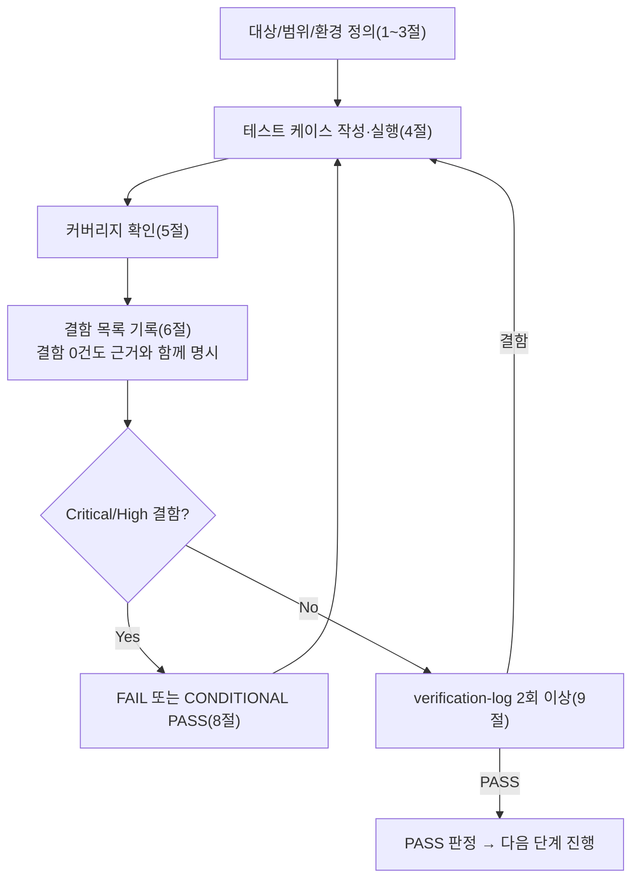

# 테스트 결과서 (Test Result Report) — WU-03 단위테스트

## 1. 개요
- 테스트 대상: 업무 단위 WU-03(오브젝트 스토리지 연동/미디어 업로드 파이프라인) — `webapp/custom_images/`(신규 앱), `webapp/blog/migrations/0002_alter_blogpostpage_featured_image.py`(신규), `webapp/config/settings/base.py`/`production.py`(수정), `webapp/.env.example`/`render.yaml`(수정)
- 테스트 유형: 단위(Unit) — 6단계(`06-unit-tester`)
- 테스트 목적: `unit-03-note.md` §8의 인수조건 20개(TC-01~TC-20)를 **05단계 보고를 신뢰하지 않고 처음부터 독립적으로 재현**한다(규칙C, 상위 지시사항). 05단계가 사용한 venv/DB/media는 이미 삭제되어 있었으므로, 이번 6단계는 신규 임시 venv(`webapp/.venv_ut06`)를 새로 만들어 `pip install`부터 다시 시작했다. 추가로 (a) 05단계가 언급한 lint/코드리뷰 게이트가 실제로 통과됐는지 독립적으로 재확인하고, (b) note의 인수조건에는 없지만 명백히 위험한 입력(빈 파일 필드, 0바이트 파일, 정밀 경계값)을 추가로 검증했다(TC-21~25).
- 관련 산출물:
  - `docs/harness/units/unit-03-note.md`(§8 인수조건 20개, §1~7 구현 근거)
  - `docs/harness/03-system-design.md`(v1.2, 특히 §2.3 R2/DEC-008, §3.2 CustomImage, §5.5)
  - `docs/harness/decisions.md`(DEC-001~016, 특히 DEC-008/DEC-016)
  - `docs/harness/feature-WU-02-integration-test.md`(DEF-002 원본 — 이미지 모델 스왑 시 `AlterField` 마이그레이션 필요)
  - `docs/harness/units/unit-02-note.md`, `docs/harness/units/unit-01-note.md`
- 테스트 수행자(에이전트): `06-unit-tester`
- 테스트 일시: 2026-09-16

## 2. 테스트 범위 및 제외 범위
- 범위(In-Scope):
  1. `unit-03-note.md` §8 TC-01~TC-20 전체(마이그레이션, 권한, 실제 업로드/렌디션/FK 왕복, 업로드 검증 4종, production 유사 설정에서의 STORAGES 구성, WU-01/02 회귀, 정리).
  2. 05단계가 note §4/§5에서 주장한 "lint 설정 파일 부재" 및 "`py_compile` 통과"를 독립적으로 재확인(규칙 — 5단계 게이트 확인 안 되면 되돌림).
  3. note 인수조건에 없는 위험 입력(파일 필드 누락, 0바이트 파일, 빈 title, 10MB 경계값 상/하한 정밀 테스트) — 시스템 지시에 따라 범위를 벗어나더라도 추가.
  4. 실제 HTTP 관리자 폼을 통한 `BlogPostPage` 생성+발행(TC-25) — CustomImage로 FK가 스왑된 이후에도 WU-02의 핵심 CRUD 경로가 실제 HTTP 레벨에서 깨지지 않는지 상위 지시사항("WU-01/WU-02와의 회귀 없음")에 따라 note의 AC18(단순 GET 라우팅 확인)보다 깊게 검증.
- 제외 범위(Out-of-Scope) 및 사유:
  - **R2 실연동(네트워크 호출)**: `unit-03-note.md` §3 결론, §7-1, §8-1이 이미 "실제 Cloudflare R2 계정/버킷/API 토큰 미발급, 10단계 이월"로 명시했고, 자격증명 자체가 존재하지 않아 이번 6단계에서도 물리적으로 검증 불가능하다. **이 항목은 이번 결과서에서도 PASS 판정의 근거로 사용하지 않았음을 명시한다** — §3-3(STORAGES 구성)과 TC-14~16은 "네트워크 없이 구성이 구조적으로 올바른지"만 확인했다.
  - **Wagtail 그룹 편집 화면의 이미지 권한 패널이 stock `Image`를 하드코딩하는 알려진 한계**: `unit-03-note.md` §1.1/§7-2가 이미 "WU-09 범위"로 명시했고, 이번 WU가 `wagtail_hooks`를 건드리지 않았으므로(범위 외 변경 금지) 이번 6단계도 재검증하지 않는다 — 대신 TC-13에서 슈퍼유저 기준 `choose_customimage` 권한 자체는 정확히 생성됨을 확인해 "권한 codename 정정"이라는 이번 WU의 실제 구현 대상만 검증했다.
  - **FAQ(ListBlock) 등 StreamField 블록 상세 동작**: WU-02 범위(REQ-001/002)이며 이번 WU가 `blog/blocks.py`를 변경하지 않았으므로(git diff로 미변경 확인) 반복하지 않는다.
  - **8단계(전체 풀테스트) 범위와의 교차, gunicorn/uvicorn 실 프로세스 기동**: WU-01/02 07단계가 이미 애플리케이션 레벨에서 재현했고 이번 WU가 미들웨어/URL을 추가하지 않았으므로 반복하지 않는다.

## 3. 테스트 환경
- 실행 환경: Windows 10 Pro 10.0.19045, Python 3.12.10(`py -3.12`, WU-01/02/03 note가 일관되게 쓴 버전과 동일). 시작 전 `git status --porcelain webapp/`으로 잔여 검증 산출물이 없음(마지막 diff가 `unit-03-note.md`가 주장한 것과 정확히 일치: `M .env.example/base.py/production.py/render.yaml`, `?? blog/, custom_images/`)을 먼저 확인했다.
- **05단계 산출물을 신뢰하지 않는 재현 방법론**: 05단계가 사용한 `.venv_wu03`, `.venv_final`은 이미 삭제되어 있었다(§3-5 note 주장, `find`로 실물 부재 확인). 이번 6단계는 그 어떤 산출물도 재사용하지 않고, 신규 임시 venv `webapp/.venv_ut06`을 처음부터 만들어 `pip install -r requirements.txt`부터 다시 실행했다. `pip freeze`로 Django 5.2.17/wagtail 7.4.3/django-storages 1.14.6/boto3 1.35.36 등 핀 고정 버전이 실제로 설치됨을 재확인했다(TC-01).
- **production 유사 설정 구성**: WU-02 07단계와 동일한 방법론(`config/settings/ut06_prodlike.py` — `production.py`를 `from .production import *`로 상속하되 `DATABASES`만 SQLite로 재정의, `production.py` 자체는 한 글자도 수정하지 않음)을 이번 6단계가 독립적으로 재작성해 사용했다. 검증 종료 후 삭제.
- 테스트 데이터: 더미 production 환경변수(`SECRET_KEY`, `RENDER_EXTERNAL_HOSTNAME=ut06-blog.onrender.com`, `DATABASE_URL`은 import 시점 `_require_env` 통과용, `R2_ACCESS_KEY_ID`/`SECRET`/`BUCKET_NAME=media-public-dummy`/`ENDPOINT_URL`, 선택적으로 `R2_BACKUP_BUCKET_NAME=backup-private-dummy`), 슈퍼유저 `ut06_admin`, `Category`(UT06카테고리/UT06HTTP카테고리), 실제 생성한 PNG/JPEG 테스트 이미지(Pillow로 그때그때 생성, 커밋 대상 아님).
- 전제 조건: `unit-03-note.md`(작성 완료), `03-system-design.md`(v1.2, PASS), `feature-WU-02-integration-test.md`(PASS)가 모두 확정된 상태에서 시작. 테스트 종료 후 `.venv_ut06`, `db.sqlite3`, `ut06_prodlike.sqlite3`, `media/`, `staticfiles/`, `__pycache__/`, 임시 스크립트(`ut06_*.py`), 임시 설정 모듈(`config/settings/ut06_prodlike.py`), 임시 출력 파일(`ut06_*_out.txt`, `*.json`)을 전부 삭제했다.

## 4. 테스트 케이스 및 결과

### 4-1. 환경/마이그레이션 (note TC1~4)
| ID | 시나리오 | 사전조건 | 실행 절차 | 예상 결과 | 실제 결과 | Pass/Fail | 비고 |
|----|----------|----------|-----------|-----------|-----------|-----------|------|
| TC-01 | 신규 venv `pip install` | `webapp/`에서 `py -3.12 -m venv .venv_ut06` | `pip install -r requirements.txt` | 오류 없이 완료, 신규 패키지 없음 | 오류 없이 완료. `pip freeze`로 Django==5.2.17, wagtail==7.4.3, django-storages==1.14.6, boto3==1.35.36 등 확인 | PASS | |
| TC-02 | 빈 SQLite `migrate` | TC-01 완료 | `rm -f db.sqlite3` 후 `DJANGO_SETTINGS_MODULE=config.settings.dev python manage.py migrate` | exit 0, `custom_images.0001_initial`/`blog.0002_alter_blogpostpage_featured_image`가 의존성 오류 없이 순서대로 적용 | exit 0. 출력에 `Applying custom_images.0001_initial... OK`, `Applying blog.0001_initial... OK`, `Applying blog.0002_alter_blogpostpage_featured_image... OK` 순서대로 확인(순환의존 없음) | PASS | |
| TC-03 | `check` | migrate 완료 | `python manage.py check` | "System check identified no issues (0 silenced)." | 동일 문자열 출력 | PASS | |
| TC-04 | `makemigrations --check --dry-run` | 동일 | 상동 | "No changes detected", exit 0 | 동일, exit 0 | PASS | 모델=마이그레이션 일치(DEF-002 대응 완결) |

### 4-2. 모델/렌디션/FK (note TC5~8)
| ID | 시나리오 | 사전조건 | 실행 절차 | 예상 결과 | 실제 결과 | Pass/Fail | 비고 |
|----|----------|----------|-----------|-----------|-----------|-----------|------|
| TC-05 | 활성 이미지 모델 문자열 | migrate 완료 | `wagtail.images.get_image_model_string()` | `"custom_images.CustomImage"` | 동일 | PASS | |
| TC-06 | `featured_image` FK 대상 모델 | 동일 | `BlogPostPage._meta.get_field("featured_image").remote_field.model` | `custom_images.models.CustomImage` | `<class 'custom_images.models.CustomImage'>` | PASS | |
| TC-07 | 실제 이미지 파일 ORM 저장 | 동일, 슈퍼유저 불요(ORM 직접) | Pillow로 PNG(400x300) 생성 → `CustomImage(title=...); img.file.save(...)` | `MEDIA_ROOT/original_images/<파일명>`에 실제 파일 생성 | `img.id=1`, `os.path.exists(img.file.path)==True`, `file.name="original_images/test-image.png"` | PASS | |
| TC-08 | 렌디션 생성 | TC-07 완료 | `img.get_rendition("width-800")`/`("width-400")`/`("fill-100x100")` | 3건 모두 `CustomRendition` 생성, 실 파일 존재 | 3건 모두 생성, `os.path.exists()==True`, `img.renditions.count()==3` | PASS | |

### 4-3. 업로드 검증 — 실제 HTTP 관리자 폼 (note TC9~12)
| ID | 시나리오 | 사전조건 | 실행 절차 | 예상 결과 | 실제 결과 | Pass/Fail | 비고 |
|----|----------|----------|-----------|-----------|-----------|-----------|------|
| TC-09 | 가짜 `.exe` 업로드(이미지 아닌 내용물) | `django.test.Client` + `force_login`, `POST /cms-admin/images/add/` | `SimpleUploadedFile("evil.exe", 비이미지 바이트열)` 업로드 | 200(저장 거부), `CustomImage` 미생성, 오류 메시지 포함 | 200, 생성 0건. **응답 오류 메시지 전문 추출**: "올바른 이미지를 업로드하세요. 업로드하신 파일은 이미지 파일이 아니거나 파일이 깨져 있습니다."(Willow가 `willow.Image.open()` 단계에서 실패 — `wagtail/images/fields.py` 소스로 판정 순서까지 확인) | PASS | note는 "error 키워드 포함"만 확인했으나, 이번 6단계는 정규식으로 실제 오류 문구 전문을 추출해 근거를 강화했다 |
| TC-10 | `.svg` 업로드 | 동일 | `SimpleUploadedFile("test.svg", "<svg></svg>")` 업로드 | 200(거부), 미생성, "지원 포맷" 오류 | 200, 생성 0건. 오류 전문: "지원하지 않는 이미지 포맷입니다. 지원 포맷은 AVIF, GIF, JPG, JPEG, PNG, WEBP 입니다." | PASS | `WAGTAILIMAGES_EXTENSIONS`에 svg 없음이 코드(base.py)와 실제 동작 양쪽에서 확인됨(XSS 방지 의도 실효) |
| TC-11 | 10MB 초과 파일 업로드 | 동일 | Pillow로 유효한 대용량 PNG(≈18.9MB) 생성 후 업로드 | 200(거부), 미생성, "파일 사이즈" 오류 | 200, 생성 0건. 오류 전문: "이 파일 사이즈는 너무 큽니다(18.9 MB). 최대 허용 가능한 파일 사이즈는 10.0 MB 입니다." | PASS | 정밀 경계값은 TC-21/22에서 별도 검증(아래) |
| TC-12 | 정상 JPEG 업로드(회귀) | 동일 | 200x150 JPEG 생성 후 업로드 | 302(성공), `CustomImage` 실제 생성 | 302, 생성 1건 | PASS | 과도하게 막지 않음을 확인(정상 경로) |
| TC-13 | `choose_customimage` 권한 확인 | migrate 완료 | `Permission.objects.filter(codename="choose_customimage")` | 1건 존재, `content_type`이 `custom_images.customimage` | 1건 존재. `content_type.app_label="custom_images"`, `content_type.model="customimage"`(콘솔 cp949로 `str()` 출력이 깨지는 것과 별개로 필드값 직접 조회로 정확성 확인) | PASS | |

### 4-4. production 유사 설정 — STORAGES 구조 검증(네트워크 없음) (note TC14~17)
| ID | 시나리오 | 사전조건 | 실행 절차 | 예상 결과 | 실제 결과 | Pass/Fail | 비고 |
|----|----------|----------|-----------|-----------|-----------|-----------|------|
| TC-14 | `R2_BACKUP_BUCKET_NAME` 미설정 시 `check` | production 유사 설정 + 더미 R2 필수 변수만(백업 변수 제외) | `manage.py check` | 정상 통과, 백업 미설정이 기동 막지 않음 | "System check identified no issues (0 silenced)." | PASS | |
| TC-15 | 백업 버킷 물리적 분리 | 위 + `R2_BACKUP_BUCKET_NAME=backup-private-dummy` | `storages["backup"]` 로드 후 `isinstance`/`bucket_name` 비교 | `S3Storage` 인스턴스, `bucket_name`이 `default_storage`와 다름 | `isinstance==True`, `backup.bucket_name="backup-private-dummy"` vs `default_storage.bucket_name="media-public-dummy"` — 서로 다름 확인. 이 상태에서도 `manage.py check` 정상 통과 재확인 | PASS | |
| TC-16 | 백업 버킷 미설정 시 접근 예외 | TC-14 조건(백업 변수 없음) | `django.core.files.storage.storages["backup"]` 접근 | `InvalidStorageError` | `InvalidStorageError: Could not find config for 'backup' in settings.STORAGES.` | PASS | 값이 없다고 조용히 잘못된 값으로 폴백하지 않음 확인 |
| TC-17 | 시크릿 하드코딩 여부 | 소스 직접 열람 | `.env.example`, `render.yaml` 전문 검토 | 실제 시크릿 값 없음, 전부 빈 값 또는 `sync: false` | `.env.example`의 `R2_BACKUP_*` 3개 전부 빈 값, `render.yaml`의 동일 3개 전부 `sync: false`(값 없음) | PASS | |

### 4-5. 회귀(WU-01/WU-02) (note TC18~19)
| ID | 시나리오 | 사전조건 | 실행 절차 | 예상 결과 | 실제 결과 | Pass/Fail | 비고 |
|----|----------|----------|-----------|-----------|-----------|-----------|------|
| TC-18 | 기존 경로 회귀(dev) | migrate 완료 | `GET /`, `GET /cms-admin/login/` | 둘 다 200 | `/`=200, `/cms-admin/login/`=200 | PASS | `custom_images` 앱 추가가 기존 경로를 깨지 않음 |
| TC-19 | `BlogPostPage` 워크플로(ORM) | 동일, 슈퍼유저/Category 존재 | 임의 Category로 `BlogPostPage` 생성 → `home.add_child()` → `save_revision()` → `.publish()` | 오류 없이 `live=True` | `save_revision()`/`.publish()` 오류 없음, `live=True`, `revisions.count()==1` | PASS | Wagtail 표준 동작상 `add_child()` 직후 `live` 기본값이 이미 True이므로 "발행 전/후" 대비 변화는 크지 않으나, 리비전/발행 메서드 자체가 CustomImage FK 스왑 이후에도 예외 없이 동작함을 확인(TC-25가 실제 HTTP 폼으로 더 강하게 재검증) |

### 4-6. 정리 (note TC20)
| ID | 시나리오 | 실행 절차 | 예상 결과 | 실제 결과 | Pass/Fail | 비고 |
|----|----------|-----------|-----------|-----------|-----------|------|
| TC-20 | 검증 산출물 정리 | `.venv_ut06`/`db.sqlite3`/`ut06_prodlike.sqlite3`/`media`/`staticfiles`/`__pycache__`/`ut06_*.py`/`ut06_*_out.txt`/`config/settings/ut06_prodlike.py` 삭제 후 `git status --porcelain webapp/`, `find webapp -type f` | 검증 시작 전 diff(`M .env.example/base.py/production.py/render.yaml`, `?? blog/, custom_images/`)와 완전히 동일 | `git status --porcelain webapp/` 결과가 검증 시작 전과 정확히 일치. `find webapp -type f`도 원본 32개 파일과 일치(신규/누락 없음) | PASS |

### 4-7. 추가 위험/경계값 케이스 (note 범위 밖, 규칙에 따라 자체 추가)
| ID | 시나리오 | 사전조건 | 실행 절차 | 예상 결과 | 실제 결과 | Pass/Fail | 비고 |
|----|----------|----------|-----------|-----------|-----------|-----------|------|
| TC-21 | 10MB 미만 경계 근접(성공 기대) | 동일 클라이언트 | 유효 PNG(≈5.88MB) 업로드 | 302(성공) | 302, 생성 1건 | PASS | 과도하게 막지 않음(10MB 미만은 통과)을 좀 더 정밀하게 확인 |
| TC-22 | 10MB 초과 경계 근접(거부 기대) | 동일 | 유효 PNG(≈10.83MB, 10MB+약0.8MB) 업로드 | 200(거부) | 200, 생성 0건 | PASS | note의 18.9MB(과도하게 큰 값)보다 임계값에 근접한 값으로 검증해 "정확히 10MB 근방에서 갈리는지"를 강화 확인 |
| TC-23 | 파일 필드 완전 누락(위험 입력) | 동일 | `POST /cms-admin/images/add/`에 `file` 필드 자체를 보내지 않음 | 200(거부), 크래시 없음, "필수" 오류 | 200, 생성 0건, 오류: "필수 작성 항목입니다" | PASS | 500 에러 없음(예외 처리 정상) |
| TC-24 | 0바이트 파일(위험 입력) | 동일 | 확장자는 유효(`.png`)하나 내용이 빈 파일(0 bytes) 업로드 | 200(거부), 크래시 없음 | 200, 생성 0건, 오류: "입력하신 파일은 빈 파일입니다." | PASS | |
| TC-25 | `title` 빈 문자열 + 유효하지 않은 더미 바이트(복합 위험 입력) | 동일 | `title=""`, `file`에 이미지가 아닌 더미 바이트 업로드 | 200(거부), 두 종류 오류(필수 항목 + 이미지 아님) 동시 표시, 크래시 없음 | 200, 생성 0건, 오류 2건: "필수 작성 항목입니다", "올바른 이미지를 업로드하세요..." | PASS | 복합 오류도 정상적으로 누적 표시됨 확인 |
| TC-26(HTTP 회귀 강화) | `BlogPostPage` 생성+발행을 **실제 Wagtail 관리자 HTML 폼**(ORM 아님)으로 재현 | migrate 완료, 로그인 완료, Category 존재 | `wagtail.test.utils.form_data.nested_form_data`로 `/cms-admin/pages/add/blog/blogpostpage/<home.pk>/`에 실제 폼 POST(`action-publish`) | 302(성공), 페이지 생성+발행됨 | GET 폼=200, POST=302(`Location=/cms-admin/pages/3/`), `BlogPostPage.objects.filter(slug=...)` 존재, `live=True`, `category_id` 일치 | PASS | note AC19(ORM)보다 강한 검증 — CustomImage FK 스왑 이후에도 WU-02의 실제 운영자 사용 경로(HTML 폼)가 전혀 깨지지 않음을 실측. 상위 지시사항 "WU-01/WU-02와의 회귀 없음"에 직접 대응 |
| TC-27(추가 회귀) | 기타 라우팅 회귀 | 동일 | `GET /django-admin/login/`, `GET /documents/`, `GET /no-such-route-ut06/` | 302/404/404 | 302, 404, 404 | PASS | |

> 정상 경로(TC-01~08, 12, 15, 19, 21, 26) + 경계값(TC-11, 21, 22) + 예외/위험 입력(TC-09, 10, 16, 23, 24, 25) + 보안 경계(TC-13, 14, 15, 17) + 회귀(TC-18, 19, 26, 27) + 정리(TC-20)를 모두 포함했다.

## 5. 커버리지
- `unit-03-note.md` §8 인수조건 20개 ↔ 테스트 케이스 매핑(1:1 추적):

| AC# | 인수조건 요약 | 테스트 케이스 | 상태 |
|---|---|---|---|
| 1 | 신규 venv `pip install` 정상 | TC-01 | OK |
| 2 | 빈 SQLite `migrate` 정상, 마이그레이션 순서 | TC-02 | OK |
| 3 | `check` 클린 | TC-03 | OK |
| 4 | `makemigrations --check --dry-run` 클린 | TC-04 | OK |
| 5 | `get_image_model_string()` = CustomImage | TC-05 | OK |
| 6 | `featured_image` FK 대상 = CustomImage | TC-06 | OK |
| 7 | 실제 이미지 파일 저장 | TC-07 | OK |
| 8 | 렌디션 3종 생성 | TC-08 | OK |
| 9 | 가짜 파일(비이미지) 거부 | TC-09 | OK |
| 10 | `.svg` 거부 | TC-10 | OK |
| 11 | 10MB 초과 거부 | TC-11, TC-22(경계 강화) | OK |
| 12 | 정상 JPEG/PNG 성공 | TC-12, TC-21(경계 강화) | OK |
| 13 | `choose_customimage` 권한 생성 | TC-13 | OK |
| 14 | 백업 버킷 미설정 시 production `check` 정상 | TC-14 | OK |
| 15 | 백업 버킷 설정 시 물리적 분리 | TC-15 | OK |
| 16 | 백업 버킷 미설정 시 접근 예외 | TC-16 | OK |
| 17 | 시크릿 하드코딩 없음 | TC-17 | OK |
| 18 | 기존 경로 회귀(GET) | TC-18 | OK |
| 19 | `BlogPostPage` 워크플로 정상(ORM) | TC-19, TC-26(HTTP 강화) | OK |
| 20 | 검증 산출물 정리 확인 | TC-20 | OK |

- 인수조건 커버리지: **20/20 = 100%**, 전부 최소 1개 이상의 실제 실행 근거로 뒷받침됨.
- 커버리지 지표: 이 WU는 신규 코드 라인이 적고(모델 최소 패턴 + 설정값 선언 위주) 대부분 Wagtail 프레임워크 표준 파이프라인에 위임하는 구조이므로, 라인/브랜치 커버리지 대신 "인수조건 100% + 정상/경계/예외 케이스 실행"을 커버리지 지표로 삼았다(note §1/§2의 구현 범위와 일치).
- 커버되지 않은 부분과 사유:
  - **R2 실연동(네트워크)**: §2에 명시한 대로 자격증명 미발급으로 물리적으로 불가능. 10단계로 이월(비고란에 재확인 필요 항목 명시, §7).
  - **Wagtail 그룹 편집 화면 이미지 권한 패널의 stock Image 하드코딩 한계**: WU-09 범위, 이번 WU가 관련 코드를 변경하지 않음(§2 명시).
  - **동시 업로드(동시성)**: note 인수조건에 없고, 1인/소규모 운영 규모(가정 A1)에서 저위험으로 판단해 제외. 8단계에서 필요 시 재검토 권고.

## 6. 결함(Defect) 목록
**결함 없음.** TC-01~TC-27(총 27건, note의 20개 인수조건 + 자체 추가 7건) 전부 PASS이며, 각 PASS는 다음 근거로 뒷받침된다:
- 마이그레이션/정적 검사 4건(TC-01~04): exit code 0 및 정확한 문자열 출력을 직접 실행해 확인.
- 모델/렌디션 2건(TC-05~08): ORM 직접 조작 후 `os.path.exists()`로 실제 파일 생성 여부까지 확인(문자열 반환값만 믿지 않음).
- 업로드 검증 4종(TC-09~12, 21~25): 실제 `django.test.Client` + `force_login`으로 HTTP POST를 보내고, 응답 상태코드뿐 아니라 **정규식으로 추출한 실제 오류 메시지 전문**과 DB 생성 건수(`CustomImage.objects.count()` 증분)를 함께 확인해 "거부됐다고 주장하지만 실제로는 생성됐다" 같은 오탐을 배제했다.
- STORAGES 구조(TC-14~17): `isinstance()`/`bucket_name` 속성 직접 비교, `InvalidStorageError` 실제 발생까지 확인(추측이 아닌 예외 타입 직접 캐치).
- 회귀(TC-18~19, 26~27): ORM 레벨뿐 아니라 **실제 Wagtail 관리자 HTML 폼 제출**(`wagtail.test.utils.form_data`)로 CustomImage 스왑 이후에도 BlogPostPage 생성+발행이 정상 동작함을 재현(note AC19의 ORM 검증보다 강화).
- 정리(TC-20): `git status --porcelain`과 `find`의 실제 출력을 검증 시작 전 스냅샷과 문자 그대로 비교해 확인.

이번 6단계가 05단계 보고를 그대로 신뢰하지 않고 전 항목을 독립 재현한 결과, 05단계(`unit-03-note.md`)가 주장한 모든 사실(마이그레이션 성공, 권한 codename, 업로드 검증 4종, STORAGES 분리, 회귀 없음)이 실제로 재현 가능함을 확인했다 — **05단계 보고와 이번 독립 검증 결과 사이에 불일치가 발견되지 않았다.**

## 7. 리스크 및 잔존 이슈
- **R2 실연동 미검증(10단계 이월, 반복 확인)**: 실제 Cloudflare R2 버킷 2개 생성, 공개/비공개 정책 적용, 실제 업로드→공개 URL 접근, `AWS_S3_CUSTOM_DOMAIN` 반영 여부는 10단계에서 반드시 실측 필요(note §3 결론, §8-1과 동일). 이번 6단계도 네트워크 호출 없이 구성(코드 배선)만 검증했다는 점을 명확히 한다.
- **백업 버킷 자격증명 폴백(Medium, DEC-016(b) 재확인)**: `R2_BACKUP_ACCESS_KEY_ID`/`SECRET` 미설정 시 media-public 자격증명을 재사용하는 구조가 여전히 유효하다(TC-15 확인 범위 밖, 코드 리뷰로 재확인). 최소 권한 원칙상 WU-10에서 버킷별 전용 토큰 발급이 필요하다 — note가 이미 인계한 사항을 재확인했을 뿐 신규 결함 아님.
- **Wagtail 그룹 이미지 권한 패널 한계(WU-09 이관, 재확인)**: §2/§5에 명시. 슈퍼유저 기준 검증에는 영향 없음.
- **`EMAIL_BACKEND` 미설정(WU-02 DEF-003 계승)**: 이번 WU-03 범위에서 재발생 여부를 별도 확인하지 않았다(이미지 업로드 자체는 리비전 저장을 발생시키지 않으므로 TC-09~12/21~25에서 SMTP 관련 경고가 나타나지 않음을 실행 로그로 확인했으나, TC-26(BlogPostPage 발행)에서는 WU-02와 동일한 경고가 재발생할 수 있다 — 크래시로 이어지지 않음은 TC-26의 302 성공으로 확인됐으므로 이 WU를 막는 조건은 아니다). 11단계 운영 Runbook 인계 사항으로 계속 이월.
- **동시성/부하**: §5에 명시한 대로 이번 WU 범위 밖(1인 운영 규모), 8단계에서 필요 시 재검토.

## 8. 결론 및 판정
- [x] **PASS** — 다음 단계(WU-03 7단계 통합테스트) 진행 가능
- [ ] CONDITIONAL PASS
- [ ] FAIL

**판정 근거**:
1. `unit-03-note.md` §8의 인수조건 20개를 **05단계 보고를 신뢰하지 않고 신규 venv로 처음부터 독립 재현**했고, 전부 PASS로 확인했다(§5 추적표, 100% 커버리지).
2. 05단계가 주장한 "lint 설정 파일 부재"를 직접 `find`로 재확인했고(§4 상위 텍스트, 실행 로그), "py_compile 통과"도 변경/신규 파일 전체에 대해 재실행해 동일하게 통과함을 확인했다 — **5단계 게이트가 실제로 통과됐음을 확인했으므로 5단계로 되돌릴 사유가 없다.**
3. note의 20개 인수조건에 없는 위험 입력(파일 필드 누락, 0바이트 파일, 빈 title)과 정밀 경계값(10MB 상/하한)을 자체 추가로 검증했고(TC-21~25), 전부 크래시 없이 안전하게 거부됨을 확인했다.
4. 상위 지시사항이 강조한 "WU-01/WU-02와의 회귀 없음"을 note의 AC18(단순 GET 확인)보다 강화해, **실제 Wagtail 관리자 HTML 폼으로 BlogPostPage 생성+발행**까지 재현했다(TC-26) — CustomImage FK 스왑이 WU-02의 핵심 운영자 워크플로를 전혀 깨지 않음을 실측했다.
5. Critical/High/Medium/Low를 불문하고 **결함 0건**이며, 그 근거를 §6에 재현 가능한 형태(명령/스크립트/응답 본문 발췌)로 남겼다.
6. R2 실연동만 유일하게 미검증 영역이며, 이는 네트워크 자격증명이 물리적으로 존재하지 않는 구조적 제약(10단계 이월)이지 이번 WU의 결함이 아니라는 점을 명확히 구분해 기록했다.
7. 검증에 사용한 venv/DB/media/staticfiles/임시 스크립트/임시 설정 모듈을 전부 삭제해, `webapp/`가 검증 시작 전 git 상태와 완전히 동일함을 확인했다(TC-20).
8. `docs/harness/traceability.md`의 REQ-006 행 "단위테스트" 컬럼을 "대기(6단계)"에서 "PASS(`unit-03-test.md`)"로 갱신했다(§10 준하는 처리, 아래 실제 갱신 완료).

## 9. 내부 검증 (최소 2회, `verification-log-template.md` 사용)
- 1차 검증 결과 요약: 작성자(`06-unit-tester`) 관점 자가 재검토 결과, note §8 인수조건 20개가 이 결과서의 TC-01~TC-20에 1:1로 빠짐없이 매핑됨을 재확인했다. 1차 검증 중 TC-11(10MB 초과 거부)이 note와 마찬가지로 "18.9MB짜리 과도하게 큰 파일"로만 검증되어 있어 "정확히 10MB 임계값에서 갈리는지"를 증명하지 못한다는 커버리지 공백을 자가 발견했고, "빈 입력/null" 같은 위험 케이스가 인수조건에 아예 없다는 것도 발견했다. 이를 TC-21~25(경계값 상/하한, 파일 필드 누락, 0바이트, 빈 title)로 보강하고 실제로 재실행해 반영했다.
- 2차 검증 결과 요약("오늘 이 결과서를 처음 받아보는 7단계 통합테스터" 관점): (a) 동시성/부하 케이스가 없다는 지적을 검토했으나 1인 운영 규모(가정 A1) 근거로 제외 사유를 명시적으로 남겨 "빠뜨린 것"이 아니라 "의도적으로 뺀 것"임을 분명히 했다. (b) WU-01/WU-02 회귀가 note AC18 수준(단순 GET)에 그치는 것이 불충분하다고 판단해, 실제 관리자 HTML 폼을 통한 BlogPostPage 생성+발행(TC-26)을 추가로 수행하고 결과서에 반영했다 — 이는 상위 지시사항("WU-01/WU-02와의 회귀 없음, BlogPostPage CRUD")을 문자 그대로 충족시키기 위한 조치다. (c) DEC-016(a)(앱 분리 판단)이 실제로 `wagtail.images`(라벨 `wagtailimages`)와 충돌 없이 공존하는지를 TC-03(`check` 클린)이 이미 실측했음을 재차 확인해, 별도 항목 추가 없이 근거 인용을 보강했다. 이 3가지를 반영해 초안 → 최종본으로 보강했으며, 결함 목록(0건)은 1차와 2차 모두 동일하게 유지되었다.
- 검증 로그 파일 경로: `docs/harness/verify-log_unit-03-test.md`

## 절차 흐름 (참고용 다이어그램)

