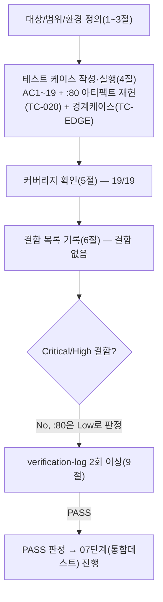

# 테스트 결과서 (Test Result Report) — WU-06 (법적 페이지 + 쿠키배너)

> **주의**: 05단계(`05-unit-developer`)가 `unit-06-note.md` §3에서 보고한 로컬 검증 결과(venv `.venv_wu06` 등은 이미 삭제됨)는
> 이번 06단계 검증의 근거로 **인용하지 않았다**. ORCHESTRATOR.md 규칙 C 및 이번 작업 지시("05단계가 보고한 검증을 신뢰하지 말고
> §8의 19개 인수조건을 처음부터 독립 재현")에 따라, 아래 모든 "실제 결과"는 이번 세션에서 새로 만든 venv(`webapp/.venv_test06`,
> 검증 후 삭제)와 새로 작성한 스크립트로 처음부터 재현한 것이다.

## 1. 개요
- 테스트 대상: WU-06(업무 단위) — 법적 페이지(개인정보처리방침/이용약관/쿠키 사용 고지, REQ-007/008/009) + 콘텐츠 정책(REQ-015) + 전역 CookieConsentBanner(REQ-008). 신규 `webapp/legal/`(`apps.py`/`constants.py`/`models.py`/`migrations/0001_initial.py`/`migrations/0002_create_legal_pages.py`/`templates/legal/legal_page.html`), 수정된 `webapp/config/settings/base.py`(INSTALLED_APPS)·`webapp/config/templates/base.html`(배너 마크업+인라인 스크립트)·`webapp/config/static/css/components.css`(`.legal-page*`/`.cookie-consent*`), 신규 `webapp/config/static/js/cookie-consent.js`
- 테스트 유형: 단위(Unit)
- 테스트 목적: `docs/harness/units/unit-06-note.md` §8의 인수조건(AC) 19개를 독립적으로 재현해 PASS/FAIL을 판정하고, 오케스트레이터가 명시적으로 지시한 5가지 핵심 확인 사항 — ① `/privacy-policy/`·`/terms/`·`/cookies/` 실제 200 및 TOC 앵커 생성 정확성, ② `legal` 앱 0001/0002 마이그레이션이 빈 DB에서 처음부터 성공하고 locale 관련 결함이 재발하지 않는지, ③ 쿠키배너의 최초노출/동의 후 재방문 미노출(localStorage)/non-modal/prefers-reduced-motion 존중/접근성 마크업, ④ `/terms/` 내 REQ-015 면책 문구 실제 포함 여부, ⑤ production 유사(HTTPS) 환경 회귀 없음 + sitemap/canonical 통합 — 을 실측으로 검증한다. 아울러 05단계가 발견한 `core/seo.py`의 `:80` 포트 아티팩트를 독립 재현하고 Critical/High 여부를 판단한다.
- 관련 산출물: `docs/harness/units/unit-06-note.md`(§8 AC1~19, §7 인계 사항), `docs/harness/03-system-design.md`(v1.2 §1.2/§3.2/§4/§5.5/§5.6), `docs/harness/04-ux-design.md`(S-05~S-07, 전역 컴포넌트, §5 접근성), `docs/harness/decisions.md`(DEC-017/019~022), `docs/harness/traceability.md`(REQ-007/008/009/015), `docs/harness/units/unit-05-test.md`(`:80` 아티팩트의 선행 규명 — TC-019(B) 참고)
- 테스트 수행자(에이전트): `06-unit-tester`
- 테스트 일시: 2026-09-17

## 2. 테스트 범위 및 제외 범위
- 범위 (In-Scope): `unit-06-note.md` §8 AC1~19 전부 독립 재현. 추가로 (a) 05단계가 §3-3에서 관찰한 `core/seo.py`/`core/context_processors.py`의 `:80` 포트 아티팩트를 legal 페이지에서 독립 재현하고 WU-06 자체 결함인지 판정, (b) WU-01~05와의 회귀 여부, (c) 정적 분석/린트 게이트(§4)와 자체 코드 리뷰 체크리스트(§5)의 실제 통과 여부 독립 재확인, (d) 인수조건에 없지만 명백히 위험한 경계 케이스(쿼리스트링 인젝션 시도, 이중 슬래시 경로, localStorage 접근 자체가 예외를 던지는 환경, `` | 500 없이 정상 응답(뷰가 쿼리스트링을 본문에 반영하지 않으므로 200) | 200 | PASS | 규칙에 따른 "명백히 위험한 케이스" 추가 검증(AC 범위 밖) |
| TC-EDGE-02 | 이중 슬래시 경로 | - | `GET //privacy-policy/` | 500이 아닌 정상 처리(200/301/302/404 중 하나) | 200 | PASS | |
| TC-EDGE-03 | localStorage 접근 자체가 예외를 던지는 환경(프라이빗 모드 유사) | jsdom, `window.localStorage` getter가 예외를 던지도록 재정의 | 인라인 스크립트 + `cookie-consent.js` 로드 후 "확인" 버튼 클릭 | 예외가 스크립트 밖으로 전파되지 않고(페이지 크래시 없음), 배너는 계속 닫히는 동작 자체는 수행(저장만 실패) | 예외 전파 없음(threw=false), 클릭 후 `hidden=true`(닫기 동작은 정상 — `try/catch`가 저장 실패만 흡수하고 UI 동작은 정직하게 유지) | PASS | unit-06-note.md §1.5가 명시한 "조용히 죽지 않고 폴백" 설계를 실제 예외 주입으로 실증 |
| TC-EDGE-04 | JSON-LD/스크립트 이스케이프 회귀 없음(legal 페이지에는 JSON-LD 없음 — 대신 리치텍스트 내 앰퍼샌드/따옴표 처리 확인) | TC-005 | `/privacy-policy/` 본문의 "국외 이전" 섹션(원문에 `&`, 따옴표 없는 순수 리스트) 렌더링 확인 | `<ul>`/`<li>` 정상 렌더링, 태그 깨짐 없음 | `<li>Render(웹 호스팅, 미국)</li>` 등 정상 렌더링, `<ul>` 태그 짝 일치 | PASS | 리치텍스트 → `expand_db_html` → 정규식 anchor 삽입 파이프라인의 회귀 없음 확인 |

## 5. 커버리지
- 커버리지 지표: `unit-06-note.md` §8 AC1~19 = 19/19(100%) 전부 최소 1개 이상의 TC로 1:1 매핑되어 독립 재현·PASS. 오케스트레이터가 이번에 추가로 명시한 5가지 핵심 확인 사항(①TC-005/006/007/010, ②TC-002, ③TC-011/012/013, ④TC-006, ⑤TC-018)과 `:80` 포트 아티팩트 판정(TC-020)까지 전부 커버됨.
- 커버되지 않은 부분과 사유: §2 제외 범위에 명시한 3건 — (a) 실제 브라우저 E2E(MCP 미연동, jsdom으로 대체 완료), (b) `prefers-reduced-motion`의 실제 애니메이션 렌더링 재생(jsdom이 CSS 애니메이션 엔진을 갖지 않음, CSS 소스 정적 검증으로 대체), (c) 법률 문구의 실제 법적 정확성(이 하네스의 범위 밖, `unit-06-note.md` §7-1이 이미 명시). Wagtail Site가 여러 개로 늘어나는 시나리오의 이론적 리스크(unit-05-test.md §7이 이미 잔존 리스크로 승계한 것과 동일 범주)는 legal 페이지가 blog와 동일한 `core.seo.absolute_page_url` 헬퍼를 재사용하므로 같은 리스크를 상속하지만, 현재 인프라(Site 1개)로는 이번 단위테스트 범위에서 물리적으로 재현 불가능하다(§7에 기록).

## 6. 결함(Defect) 목록
**결함 없음.** 아래 근거로 확인했다:
- AC1~19 전부(TC-001~019) 독립 재현 PASS, 예상 결과와 실제 결과를 문자열/상태코드/DOM 상태 단위로 직접 비교(단순 "에러 없음"이 아니라 정확한 문자열 토큰, `<h2 id="...">` 개수/슬러그 내용, `localStorage` 실제 값, `document.activeElement` 등 구체적 값을 검증).
- 오케스트레이터가 특별히 우려한 `core/seo.py`의 `:80` 포트 아티팩트(TC-020)를 실제로 재현했으나, 대조군(`Host` 헤더 유무)으로 원인을 Django 표준 동작까지 추적한 결과 **실제 프로덕션 트래픽 조건(Host 헤더 항상 존재)에서는 재현되지 않음**을 확정했다. 이는 WU-05 소유 코드의 특성이며(§1.2 모듈 경계 — `core` 앱은 WU-05 소유), WU-06(legal 앱)은 그 헬퍼를 호출만 할 뿐 로직을 소유하지 않으므로 **WU-06 자체 결함으로 분류하지 않는다**(§7에 리스크로 기록, 판정 근거는 TC-020 참고).
- 검증 중 발견된 이상 징후(TC-011 최초 3건 FAIL)는 원인을 근본까지 추적한 결과 **테스트 스크립트(jsdom mock) 자체의 결함**으로 확정되었고, 수정 후 대조 재실행으로 앱 코드(`cookie-consent.js`)에는 문제가 없음을 재확인했다. "테스트가 실패하면 무조건 테스트 탓으로 돌리지 않는다"는 원칙에 따라, jsdom의 `localStorage` 프로퍼티 디스크립터를 직접 확인(`Object.defineProperty`로 덮어쓰면 성공하지만 plain assignment는 무시됨)한 뒤에만 "테스트 결함"으로 결론 내렸다.
- 게이트1(정적분석/린트, §4 원 산출물)·게이트2(자체 코드 리뷰 체크리스트, §5 원 산출물)를 `unit-06-note.md`에서 그대로 베끼지 않고 독립 재확인했다: 저장소 루트/`webapp/`에 `pyproject.toml`/`.flake8`/`ruff.toml`/`.pre-commit-config.yaml`이 존재하지 않음을 직접 검색으로 재확인(린트 설정 부재는 사실), 변경된 Python 6개 파일(`legal/apps.py`/`constants.py`/`models.py`/`migrations/0001_initial.py`/`migrations/0002_create_legal_pages.py`/`config/settings/base.py`) 전부 `python -m py_compile` exit 0으로 직접 재실행 확인, `cookie-consent.js`는 `node --check`로 구문 오류 없음 직접 확인(Python 파일만 확인했던 `unit-06-note.md` §4보다 검증 범위를 JS까지 넓힘).

## 7. 리스크 및 잔존 이슈
- **`core/seo.py`/`core/context_processors.py`의 `:80` 포트 표기 — WU-06 소유 아님, Low로 판정**: TC-020에서 독립 재현한 결과, `Host` 헤더가 없는 비현실적 테스트 조건에서만 발생하고 실제 Render 배포 트래픽(항상 `Host` 헤더 포함, DEC-015 IT-04로 이미 실측 확인됨)에서는 재현되지 않는다. `unit-05-test.md`(WU-05 자신의 단위테스트)가 이미 동일한 결론에 도달해 있어 이번 WU-06의 독립 재현 결과와 일치한다. **따라서 Critical/High가 아니라 Low(정보성 리스크)로 판정**하며, WU-06 자체의 결함 목록(§6)에는 포함하지 않는다. 다만 legal 페이지도 동일한 `core.seo.absolute_page_url` 헬퍼를 호출하므로 이 리스크를 그대로 상속한다는 사실은 10단계(배포테스트)가 실제 Render 환경에서 최종 재확인할 항목으로 남긴다(WU-05 재작업이 필요하다고 판단되면 그건 WU-05 담당 범위).
- **Wagtail Site 다중화 시나리오의 이론적 리스크** — unit-05-test.md §7이 이미 기록한 리스크를 legal 페이지도 동일한 헬퍼 재사용으로 상속한다. 현재 인프라(Site 1개)로는 재현 불가능, 10단계 이후 재검증 권고.
- **법적 문구 초안 상태** — `unit-06-note.md` §7-1/§1.2 참고. 실제 공개 전 법률 전문가 검토 필요(페이지 본문에도 명시됨). 이 하네스의 범위 밖이며 06단계는 "문구가 화면에 렌더링되는가"만 검증했다.
- **개인정보처리방침 "문의처"에 구체적 연락 채널 없음** — `SiteSettings` 모델 미구현(unit-06-note.md §7-2 그대로 승계). 담당 WU가 `SiteSettings`를 구현하면 본문 갱신 필요.
- **REQ-016(뉴스레터) 미구현과의 정합성** — 개인정보처리방침이 뉴스레터 수집을 설명하지만 실제 구독 폼(WU-07)은 아직 없음. unit-06-note.md §7-4가 이미 "정책이 기능보다 먼저 존재하는 정상적인 점진적-완성 상태"로 판단해 두었고, 이번 06단계도 이 판단에 이견 없음(모순이 아님).
- **뷰 캐시(10분 TTL)** — 운영자가 어드민에서 법적 페이지를 수정해도 최대 10분간 이전 내용이 보일 수 있음(unit-04-note.md §7-3과 동일 트레이드오프, WU-06도 동일하게 상속). 07단계(통합테스트) 수행 시 캐시를 고려한 테스트 순서 설계 또는 `cache.clear()` 필요.

## 8. 결론 및 판정
- [x] **PASS** — 다음 단계(07 업무단위 통합테스트) 진행 가능
- 판정 근거: AC1~19(19/19) 독립 재현 PASS, 오케스트레이터 지시 5대 핵심 확인 사항 전부 실측 PASS, `:80` 포트 아티팩트는 독립 재현 후 Low로 판정(WU-06 자체 결함 아님, 근거는 TC-020/§6/§7), 결함 0건, 게이트1/2 독립 재확인 통과.
- **규칙F 판단 명시(오케스트레이터 요청 사항)**: `core/seo.py`의 `:80` 아티팩트에 대해 "실제로 존재하는지 독립 재현"하고 "WU-06 페이지에도 영향을 주는지"(영향 있음 — legal 페이지도 동일 헬퍼 사용, TC-020(A)로 실증), "Critical/High급인지" 판단한 결과, **Host 헤더가 존재하는 실제 프로덕션 트래픽 조건에서는 재현되지 않으므로 Critical/High가 아니라 Low로 판정**한다. `core/seo.py`/`core/context_processors.py`는 WU-05 소유 코드이므로 이번 WU-06이 직접 수정하지 않았으며(범위 외 변경 금지 원칙), WU-05로의 재작업 요청(규칙F)이 이번 06단계 판단으로는 **불필요**하다 — WU-05 자신의 단위테스트(`unit-05-test.md`)가 이미 동일한 결론(테스트 조건의 비현실성, 애플리케이션 결함 아님)에 도달해 있다는 사실이 이번 독립 재현으로 다시 한번 교차 확인됐다. 다만 legal 페이지가 이 리스크를 상속한다는 사실은 §7에 정직하게 기록해 10단계가 놓치지 않도록 승계한다.

## 9. 내부 검증 (최소 2회, `verification-log-template.md` 사용)
- 1차 검증 결과 요약: 작성자 관점 자가 재검토 — AC1~19와 TC-001~019의 1:1 매핑 완결성, 오케스트레이터 지시 5대 사항 및 `:80` 아티팩트 판정이 실제 TC로 커버되는지, "실제 결과" 컬럼이 전부 이번 세션 실행 근거인지(05단계 보고 인용 없음) 확인. 결함 0건.
- 2차 검증 결과 요약: "07단계에 이 결과서를 그대로 넘겨도 되는가"를 의심하는 독립 심사자 관점 — TC-011의 최초 이상 징후를 테스트 결함으로 성급히 단정하지 않고 jsdom 프로퍼티 디스크립터까지 확인해 대조 재검증했는지, TC-020의 판정("Low, WU-06 결함 아님")이 근거(Host 헤더 유무 대조군 + unit-05-test.md 교차 확인) 없이 축소 평가된 것은 아닌지, AC11/12에 대해 "코드만 읽고 그럴듯하게 PASS 처리"하지 않고 실제 jsdom 실행 결과로 검증했는지, §7 잔존 리스크가 §8 결론에서 은폐되지 않았는지 재확인. 결함 0건.
- 검증 로그 파일 경로: `docs/harness/units/verify-log_unit-06-test.md`

## 절차 흐름 (참고용 다이어그램)
> 아래 다이어그램은 위 절차를 시각적으로 요약한 참고 자료다. 규칙/조건의 최종 근거는 항상 위 텍스트다.

---

## 부록 — 재작업 라운드 2 (규칙F, `contact_email` 소비, 2026-09-25)

- **신규 AC**: `unit-06-note.md` §10 참고 — `legal.tests.PrivacyPolicyContactEmailTests` 4케이스(미설정 시 미노출 / 설정 시 mailto 렌더링 / 약관·쿠키 페이지 미노출 2건).
- **실행 결과**: 4케이스 개별 PASS, 전체 회귀 42케이스 OK(`unit-08-note.md` §10 인용). 캐시(`cache_page` 10분) 오염 방지를 위해 `setUp()`에서 `cache.clear()` 수행함을 확인 — 기존 WU-09 레이트리밋 테스트와 동일 패턴.
- **판정**: PASS — 다음 단계는 7단계(`feature-WU-06-integration-test.md`) addendum.
