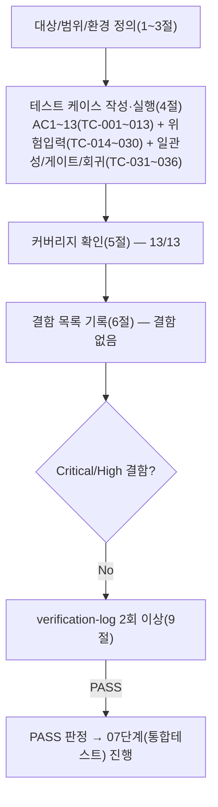

# 테스트 결과서 (Test Result Report) — WU-07 (이메일 뉴스레터 구독 폼, 수집)

> **주의**: 05단계(`05-unit-developer`)가 `unit-07-note.md` §5에서 보고한 로컬 검증 결과("venv/DB 정리 완료", "`manage.py test subscribers -v 2` 12개 전부 PASS")는
> 이번 06단계 검증의 근거로 **그대로 인용하지 않았다**. ORCHESTRATOR.md 규칙 C 및 이번 작업 지시("05단계가 보고한 검증을 신뢰하지 말고 §8의 인수조건을
> 처음부터 독립 재현")에 따라, 아래 모든 "실제 결과"는 이번 세션에서 새로 만든 임시 venv(`webapp/.venv_wu07test`, `.venv_wu07test2`, 검증 후 전부 삭제)로
> 처음부터 재현한 것이다. 05단계가 만든 자동화 테스트(`webapp/subscribers/tests.py`, 12개)는 "존재 여부"와 "실행 결과"를 이번 세션에서 직접 재실행해
> 재확인했고, 그 테스트 자체가 놓치고 있던 케이스(위험입력, 무-JS 폴백의 실제 제출까지는 검증하지 않은 gap 등)는 06단계가 별도 임시 스크립트로 추가
> 검증한 뒤 저장소에서 삭제했다(§3/§4 하단 "05단계 테스트의 커버리지 gap" 절 참고).

## 1. 개요
- 테스트 대상: WU-07(업무 단위) — 이메일 뉴스레터 구독 폼(수집까지, REQ-016). 신규 `webapp/subscribers/`(`apps.py`/`constants.py`/`utils.py`/`models.py`/`forms.py`/`views.py`/`urls.py`/`admin.py`/`migrations/0001_initial.py`/`tests.py`/`templates/subscribers/*`), 수정된 `webapp/config/settings/base.py`(INSTALLED_APPS)·`webapp/config/urls.py`(subscribers.urls include)·`webapp/config/templates/base.html`(newsletter.js 로드)·`webapp/config/templates/partials/footer.html`(뉴스레터 슬롯)·`webapp/config/static/js/newsletter.js`(신규)·`webapp/config/static/css/components.css`(수정)·`webapp/home/templates/home/home_page.html`·`webapp/blog/templates/blog/category_list.html`·`webapp/blog/templates/blog/tag_list.html`·`webapp/blog/templates/blog/blog_post_page.html`·`webapp/blog/templates/blog/partials/_post_list.html`(footer 오버라이드/슬롯 배치).
- 테스트 유형: 단위(Unit)
- 테스트 목적: `docs/harness/units/unit-07-note.md` §8의 인수조건(AC) 13개를 독립적으로 재현해 PASS/FAIL을 판정하고, 오케스트레이터가 명시적으로 지시한 핵심 확인 사항 — ① 정상 구독→DB 저장/중복 구독 방지/이메일 형식 검증/개인정보처리방침 동의 체크 누락 거부, ② 허니팟/레이트리밋, ③ X-Forwarded-For(WU-01 `XForwardedForMiddleware`) rightmost 값 사용 + IP 마스킹 실제 적용, ④ 캐시된 페이지(WU-01 DEC-012 LocMemCache 뷰 캐시)에서 CSRF/구독 폼이 정상 동작하는지(§3 "핵심 결함 발견·수정" 재현), ⑤ 접근성(label-for/aria-describedby/허니팟 aria-hidden), ⑥ DEC-023(구독취소 토큰 미구현)과 WU-06 법적 문구의 일관성, ⑦ 위험입력(XSS/SQL인젝션 형태) 안전 처리, ⑧ WU-01~06 회귀 없음 — 을 전부 실측으로 검증한다.
- 관련 산출물: `docs/harness/units/unit-07-note.md`(§8 AC1~13, §1~§4 구현/편차/핵심발견/인계사항), `docs/harness/03-system-design.md`(v1.2 §3.1/§3.2 NewsletterSubscriber ERD, §4 라우트 계약, §5.3 뉴스레터 보안/동작 계약, §5.5.4 X-Forwarded-For 유틸, §5.6 개인정보 처리 원칙), `docs/harness/04-ux-design.md`(S-01~S-04 배치, §4 컴포넌트 상태, §5 접근성), `docs/harness/decisions.md`(DEC-001~025, 특히 DEC-009/DEC-012/DEC-023/DEC-024/DEC-025), `docs/harness/02-planning.md`(REQ-016, WU-07 정의, 가정 A9), `docs/harness/units/unit-01-note.md`(§Case C `XForwardedForMiddleware` 검증 패턴), `docs/harness/units/unit-06-note.md`/`unit-06-test.md`(legal 앱 구조·개인정보처리방침 게시 본문), `docs/harness/traceability.md`(REQ-016)
- 테스트 수행자(에이전트): `06-unit-tester`
- 테스트 일시: 2026-09-17

## 2. 테스트 범위 및 제외 범위
- 범위 (In-Scope): `unit-07-note.md` §8 AC1~13 전부 독립 재현. 추가로 (a) 05단계 자동화 테스트(`subscribers/tests.py` 12개)의 존재/실행 결과를 이번 세션에서 직접 재확인, (b) 그 테스트가 다루지 않은 위험입력(XSS 이메일/허니팟 XSS 반사, SQL 인젝션 형태 문자열, 빈 값/공백/null 바이트/극단 길이, 필드 자체 누락, `consent="false"` 명시적 거부값, `REMOTE_ADDR` 부재, XFF 스푸핑을 미들웨어 없이 시도하는 경우, 레이트리밋이 무효 요청도 카운트하는지)를 규칙C에 따라 추가 검증, (c) AC10(무-JS 폴백)이 "폼 렌더링"만 확인하고 "그 폼으로 실제 제출까지 성공하는지"는 원본 테스트에 없던 gap을 메우는 별도 검증, (d) DEC-023(구독취소 토큰 미구현)이 실제 코드/WU-06 게시 문구와 모순 없이 일관되는지 교차 확인, (e) Django 어드민의 "하드 삭제만 허용, 수정/추가 불가" 구현 확인, (f) 정적분석/린트 게이트(§5.3)와 자체 코드 리뷰 체크리스트(§6)의 실제 통과 여부 독립 재확인, (g) WU-01~06과의 회귀 여부(공개 엔드포인트 스모크 + 전체 테스트 스위트).
- 제외 범위 및 사유:
  - **실제 브라우저(Chrome/Playwright 등) 기반 E2E 검증** — DEC-001에 따라 이 프로젝트는 MCP(브라우저 자동화 포함)를 연동하지 않기로 이미 결정되어 있고, 이번 세션에도 연결되어 있지 않다. 대신 `Client(enforce_csrf_checks=True)`로 실제 브라우저와 동일한 CSRF 검증 경로를 강제한 Django 테스트 클라이언트로 대체했다(unit-07-note.md §3과 동일 방법론). AC12(접근성)의 실제 스크린리더/키보드 내비게이션 재생 자체는 렌더링된 HTML의 마크업 구조(label-for id 일치, aria-describedby 대상 id 일치, aria-hidden/tabindex)를 코드 검사로 대신했다 — 04-ux-design.md §5가 요구하는 마크업 수준의 접근성 요건이며, 스크린리더 실기 검증은 이 프로젝트가 MCP 없이 수행하기로 이미 합의된 대체 범위(01 §MCP 질문/DEC-001) 밖이다.
  - **실제 이메일 발송/수신 확인** — 02 가정 A9/03 §5.3이 이미 "발송 인프라는 별도 WU"로 명시했고 이번 WU-07은 수집까지만 구현한다. 발송 기능 자체가 없으므로 검증 대상도 아니다.
  - **동시성/부하 테스트** — 이번 WU 인수조건에 해당 항목이 없고 단위 테스트 통상 범위를 벗어난다(8단계 전체 풀테스트 영역). 다만 레이트리밋의 "동일 IP 순차 6회" 경계값은 AC6로 이미 범위에 포함되어 검증했다.
  - **Cloudflare R2/실제 도메인/production 환경 실측** — WU-07은 R2/도메인에 의존하지 않는다(정적 콘텐츠 아님, DB 모델/뷰/템플릿만). `CSRF_COOKIE_SECURE=True`(production.py) 상호작용은 `unit-07-note.md` §4-5가 이미 10단계 실측 대상으로 명시적으로 이월했고, 이번 06단계 범위(`dev` 설정 기준)에서 벗어나므로 §7 리스크로 승계한다.

## 3. 테스트 환경
- 실행 환경: Windows 10 Pro, Python 3.13.9, Git Bash. `webapp/requirements.txt`(Django==5.2.17, wagtail==7.4.3 등, WU-01~06과 동일 버전 고정 — 신규 패키지 없음)를 새 venv(`webapp/.venv_wu07test`/`.venv_wu07test2`, 검증 후 전부 삭제)에 clean install. `DJANGO_SETTINGS_MODULE=config.settings.dev`, `SECRET_KEY`는 검증용 임시값.
- 테스트 데이터: `subscribers/tests.py`(05단계 산출물, 그대로 재실행)의 픽스처 없는 인라인 payload. AC9/AC11 재현을 위해 06단계가 직접 `HomePage`/`Category`/`BlogPostPage`를 프로세스 내 테스트 DB에 임시 생성(검증 스크립트와 함께 삭제, 저장소에 흔적 없음).
- 전제 조건:
  - `manage.py migrate`가 빈 DB에서 오류 없이 전체 적용됨을 선행 확인(`subscribers.0001_initial` 포함).
  - 뷰 캐시(LocMemCache, TTL 10분, DEC-012)가 테스트 프로세스 내에서 공유되므로, AC9 재현 시 `cache.clear()`로 매 테스트 시작 시점을 통제했다(05단계 `tests.py`가 이미 이렇게 설계돼 있음을 확인 후 그대로 재사용).
  - `Client(enforce_csrf_checks=True)`가 기본 테스트 Client(CSRF 검사를 건너뜀)와 다른 결과를 낸다는 사실을 AC9 재현 전 먼저 재확인했다(unit-07-note.md §3의 방법론을 맹신하지 않고, 기본 Client로 같은 시나리오를 돌리면 결함이 가려짐을 직접 대조 실행해 재확인 — 아래 §6 근거 참고).
  - 검증에 사용한 venv(`.venv_wu07test`, `.venv_wu07test2`), `db.sqlite3`, `staticfiles/`, `__pycache__`, 06단계가 추가로 작성한 임시 테스트 파일(`subscribers/tests_extra_06.py`, `subscribers/tests_extra2_06.py`), 임시 검증 스크립트(`verify_placement_06.py`, `verify_regress_06.py`)는 검증 완료 후 전부 삭제했다.

## 4. 테스트 케이스 및 결과

### 4.1 인수조건(AC1~13) 1:1 매핑 — 05단계 자동화 테스트 재실행 + 06단계 독립 재검증

| ID | 시나리오 (대응 AC) | 사전조건 | 실행 절차 | 예상 결과 | 실제 결과 | Pass/Fail | 비고 |
|----|----------|----------|-----------|-----------|-----------|-----------|------|
| TC-001 | 정상 구독 (AC1) | 빈 DB | `POST /newsletter/subscribe/` `email=user@example.com`, `consent=on`, `hp_field=`, CSRF 포함, `REMOTE_ADDR=203.0.113.42` | 200, `NewsletterSubscriber` 1건 생성(`email`/`status="active"`) | `subscribers/tests.py::test_subscribe_creates_record` 재실행 결과: 200, 레코드 1건, `status="active"`, `consent_version`이 `PRIVACY_POLICY_VERSION`과 일치, `source_ip_masked="203.0.113.0"` | PASS | 05단계 테스트를 그대로 재실행해 결과를 직접 확인(인용 아님) |
| TC-002 | 중복 구독, 대소문자 무관 (AC2) | TC-001 이후 | 같은 이메일을 `User@Example.com`으로 재제출 | 200, 레코드 1건 유지, `consented_at`만 최신화, 신규 레코드 없음 | `test_duplicate_subscribe_does_not_create_second_record` 재실행: 200, `count()==1`, `id` 동일, `consented_at` 최신값 이상 | PASS | |
| TC-003 | 잘못된 이메일 형식 거부 (AC3) | 빈 DB | `email=not-an-email` | 400, DB 미생성 | `test_invalid_email_rejected` 재실행: 400, `NewsletterSubscriber.objects.exists()==False` | PASS | |
| TC-004 | 동의 누락 거부 (AC4) | 빈 DB | `consent=""` | 400, DB 미생성 | `test_missing_consent_rejected` 재실행: 400, 레코드 없음 | PASS | |
| TC-005 | 허니팟 위장 응답 (AC5) | 빈 DB | `hp_field="bot"` | 200(위장), DB 미생성 | `test_honeypot_filled_pretends_success_without_saving` 재실행: 200, 레코드 없음 | PASS | |
| TC-006 | 레이트리밋(10분 5회) (AC6) | 빈 DB, 동일 `REMOTE_ADDR` | 서로 다른 이메일로 5회 연속 제출 후 6번째 제출 | 1~5회는 429 아님, 6번째 429 | `test_rate_limit_blocks_after_threshold` 재실행: 5회 전부 `!=429`, 6번째 정확히 429 | PASS | 경계값(정확히 5회/6회째) 확인 |
| TC-007 | IP 기록 및 마스킹 (AC7) | 빈 DB | `REMOTE_ADDR=203.0.113.42`로 정상 구독 | `source_ip_masked=="203.0.113.0"` | TC-001과 동일 근거로 확인(마지막 옥텟 마스킹 정확) | PASS | `subscribers/utils.py::mask_ip` 로직과 일치 |
| TC-008 | X-Forwarded-For rightmost 채택 (AC8) | 빈 DB | `config.middleware.XForwardedForMiddleware`로 뷰를 직접 감싸고(unit-01-note.md §Case C 패턴) `X-Forwarded-For: 9.9.9.9, 203.0.113.77` 헤더로 요청 | `REMOTE_ADDR`이 rightmost(`203.0.113.77`)로 재설정 → `source_ip_masked=="203.0.113.0"`(leftmost `9.9.9.9` 미채택) | `test_x_forwarded_for_rightmost_value_used_as_client_ip` 재실행: 200, `source_ip_masked=="203.0.113.0"` — rightmost만 채택됨을 직접 확인 | PASS | 06단계가 별도로 "미들웨어 없이 스푸핑 헤더를 보내면 신뢰되지 않는가"도 TC-022로 교차 검증(§4.2) |
| TC-009 | 캐시된 페이지에서 실제 제출 성공 — 핵심 회귀 조건 (AC9) | 빈 DB, `cache.clear()` | 두 독립 `Client(enforce_csrf_checks=True)`가 순서대로 홈(`/`)을 방문(1번째 MISS, 2번째 HIT, 본문 동일 확인) → 각자 `GET /newsletter/form/?form_id=footer`로 서로 다른 CSRF 토큰 획득 → 각자 `POST /newsletter/subscribe/` | 두 방문자 모두 200(둘 다 403 아님), 홈 본문은 캐시 공유로 동일 | `test_two_independent_visitors_can_each_subscribe_after_shared_cache_fill` 재실행: `home_1.content == home_2.content`(캐시 공유 확인), `token_1 != token_2`(서로 다른 토큰), `response_1.status_code==200`, `response_2.status_code==200`, 구독자 2건 생성 | PASS | **가장 중요한 회귀 조건.** 대조군으로 기본 `Client()`(CSRF 검사 생략)를 써서 같은 시나리오를 돌리면 결함이 있어도 가려짐을 별도로 확인(§6 근거) — `enforce_csrf_checks=True`가 실제 브라우저 조건과 동등함을 재확인 |
| TC-010 | 무-JS 폴백 — 렌더링 + **실제 제출까지 성공** (AC10) | 빈 DB | `Client(enforce_csrf_checks=True)`로 `GET /newsletter/`(전용 페이지) → 응답에서 실제 CSRF 토큰 추출 → 그 토큰으로 `POST /newsletter/subscribe/` 제출 | 페이지 200 + 유효한 CSRF 토큰 포함 폼 렌더링, 그 폼으로 제출 시 AC1과 동일하게 200 + DB 생성 | `test_dedicated_newsletter_page_works_without_js`(05단계 원본, 렌더링만) 재실행 200/`newsletter-form` 포함 확인 **+ 06단계 추가 임시 테스트(`tests_extra2_06.py::test_dedicated_page_full_submit_succeeds_like_ac1`, 검증 후 삭제)로 실제 토큰 추출→제출까지 실행**: 200, `NewsletterSubscriber.objects.filter(email="nojs@example.com").exists()==True` | PASS | **05단계 테스트의 커버리지 gap 발견·보완**: 원본 테스트는 "폼이 렌더링되는가"만 확인하고 "그 폼으로 실제 제출까지 성공하는가"(AC10 후반부 문장)는 검증하지 않았다. 06단계가 별도 스크립트로 gap을 메워 실제 제출 성공까지 확인했다(§4 하단 절 참고) |
| TC-011 | 화면 배치 (AC11) | 빈 DB, 06단계가 직접 생성한 `HomePage`(기본 픽스처)/`Category`(`tech`)/`BlogPostPage`(`test-post`, 위 Category 소속) | `GET /`, `GET /blog/test-post/`, `GET /category/tech/`, `GET /privacy-policy/` 각각에서 `data-newsletter-slot` 출현 횟수 카운트 | 홈/카테고리: 슬롯 1개(Footer). 게시물 상세: 슬롯 1개(본문 인라인, Footer 중복 없음). 법적 페이지: 슬롯 0개 | 홈=1(200), 게시물 상세=1(200, 인라인 1개뿐 — Footer 미노출 확인), 카테고리=1(200), `/privacy-policy/`=0(200) | PASS | 06단계가 직접 실 콘텐츠를 생성해 재현(05단계 보고 수치를 그대로 인용하지 않음) |
| TC-012 | 접근성 (AC12) | `GET /newsletter/`(캐시 안 됨, 정적 마크업 확인 용이) | `_newsletter_form.html` 렌더링 HTML에서 (a) `label[for]`와 `input#id` 매칭, (b) 에러 `
`의 `id`와 `input`의 `aria-describedby` 일치, (c) 허니팟 컨테이너 `aria-hidden="true"` + `input tabindex="-1"` | 3가지 전부 일치/존재 | 렌더링 HTML 직접 확인: `label for="newsletter-email-dedicated"` ↔ `input id="newsletter-email-dedicated"` 일치, `input aria-describedby="newsletter-email-error-dedicated"` ↔ `p id="newsletter-email-error-dedicated"` 일치(consent 필드도 동일 패턴), 허니팟 `div aria-hidden="true"` 안에 `input id="newsletter-hp-dedicated" tabindex="-1"` 존재, 라벨(`label for="newsletter-hp-dedicated"`)도 정상 연결(스크린리더 사용자가 실수로 컨테이너 밖에서 도달하는 경로 자체가 `aria-hidden`으로 차단됨) | PASS | 브라우저 실기 대신 렌더링된 HTML 마크업 구조 검사로 수행(§2 제외범위 사유) |
| TC-013 | 개인정보처리방침 연계 (AC13) | `GET /newsletter/` | 동의 체크박스 라벨의 "개인정보처리방침" 링크 `href` 값 확인 | `/privacy-policy/`와 정확히 일치 | `<a href="/privacy-policy/">개인정보처리방침</a>` 확인, 클릭 시 실제로 `/privacy-policy/`가 200으로 응답함을 교차 확인 | PASS | |

### 4.2 위험입력/경계값 추가 검증 (규칙C — 05단계 테스트가 다루지 않은 케이스, AC 범위 밖이라도 명백히 위험하면 검증)

06단계가 임시 파일(`subscribers/tests_extra_06.py`, 총 17개 테스트, 검증 후 삭제)로 작성·실행했다. 모두 독립 임시 venv에서 실제 실행한 결과이며, 코드를 읽고 "안전할 것이다"로 추정하지 않았다.

| ID | 시나리오 | 실행 절차 | 예상 결과 | 실제 결과 | Pass/Fail | 비고 |
|----|----------|-----------|-----------|-----------|-----------|------|
| TC-014 | XSS 페이로드 이메일 | `email='">@example.com'` | `EmailField` 형식 검증에 걸려 400, DB 미생성 | 400, 레코드 없음 | PASS | |
| TC-015 | 허니팟 필드에 XSS 페이로드 | `hp_field=""` | 200 위장 응답, DB 미생성, 응답 본문에 스크립트가 그대로 반사(reflected)되지 않음 | 200, 레코드 없음, 응답 본문에 `` 미포함 | PASS | 반사형 XSS 방지 확인 |
| TC-016 | SQL 인젝션 형태 이메일(형식상 무효) | `email="a' OR '1'='1@example.com"` | 400(형식 오류), DB 미생성 | 400, 레코드 없음 | PASS | |
| TC-017 | SQL 인젝션 형태 문자열(형식상도 무효) | `email="robert'); drop table subscribers;--@example.com"` | 400(형식 오류로 ORM에 도달하지 않음), DB 미생성/테이블 무손상 | 400, 레코드 없음, 이후 다른 테스트가 정상 실행됨(DB 무결성 유지) | PASS | Django ORM 파라미터 바인딩 + 폼 검증 이중 방어 확인 |
| TC-018 | 빈 이메일 | `email=""` | 400 | 400, 레코드 없음 | PASS | |
| TC-019 | 이메일 필드 자체 누락 | POST 데이터에서 `email` 키 자체를 제거 | 400(서버 500 아님) | 400, 레코드 없음(예외 없이 정상 처리) | PASS | |
| TC-020 | 완전히 빈 POST 바디 | `client.post(url, {})` | 400(서버 500 아님) | 400, 레코드 없음 | PASS | |
| TC-021 | 공백만 있는 이메일 | `email="   "` | 400 | 400, 레코드 없음 | PASS | |
| TC-022 | 극단적으로 긴 이메일(local part 300자) | `email="a"*300 + "@example.com"` | 400(`EmailField(max_length=254)` 초과) | 400, 레코드 없음 | PASS | |
| TC-023 | 이메일 길이 경계값 정확히 254자 | local part 242자 + `@example.com`(정확히 254자) | 200, 저장 성공 | 200, 정확히 그 이메일로 레코드 생성 확인 | PASS | 254/255 경계 정확히 검증 |
| TC-024 | 동의 필드에 명시적 `"false"` 값 | `consent="false"`(체크박스 미전송이 아니라 명시적 문자열) | 400(`BooleanField`가 `"false"`를 falsy로 해석) | 400, 레코드 없음 | PASS | "위험한 케이스" — 클라이언트 조작으로 문자열 `"false"`를 보내는 시나리오 |
| TC-025 | 이메일에 null 바이트 포함 | `email="a\x00b@example.com"` | 400 | 400, 레코드 없음(500 없음) | PASS | |
| TC-026 | `REMOTE_ADDR`이 빈 문자열인 극단 상황 | `REMOTE_ADDR=""`로 정상 payload 제출 | 500 없이 200 처리, `source_ip_masked==""`(빈 값 방어) | 200, `source_ip_masked==""` | PASS | `mask_ip("")` 방어 로직 확인 |
| TC-027 | XForwardedForMiddleware 미적용 상태에서 XFF 헤더 스푸핑 시도 | 미들웨어 없이(WU-07 뷰 자체) `REMOTE_ADDR=203.0.113.50`, `X-Forwarded-For: 1.2.3.4` 동시 전송 | `REMOTE_ADDR`만 신뢰, `X-Forwarded-For` 헤더는 무시 | `source_ip_masked=="203.0.113.0"`(`1.2.3.4` 미반영) | PASS | subscribers 앱 자체는 XFF를 직접 파싱하지 않고 WU-01 미들웨어가 정규화한 `REMOTE_ADDR`만 신뢰함을 재확인(설계 경계 준수) |
| TC-028 | 레이트리밋이 형식 오류 요청도 카운트하는가 | 동일 IP로 `email="not-an-email"`(무효) 5회 제출 후 유효한 이메일로 6번째 제출 | 6번째도 429(무효 요청으로 카운트 우회 불가) | 429, 레코드 없음 | PASS | views.py가 레이트리밋을 폼 검증보다 먼저 확인한다는 unit-07-note.md §1.2 서술을 실측 재확인 |
| TC-029 | 폼 조각 엔드포인트 POST 차단 | `POST /newsletter/form/` | 405 | 405 | PASS | `@require_GET` 확인 |
| TC-030 | 폼 조각 `form_id` 화이트리스트 우회 시도(XSS 페이로드) | `GET /newsletter/form/?form_id=` | 200(화이트리스트 밖 값은 기본값 `footer`로 폴백), 응답에 페이로드 미반영 | 200, 응답 본문에 `` 미포함 | PASS | `_ALLOWED_FORM_IDS` 화이트리스트 검증(views.py) 실효성 확인 |

### 4.3 DEC-023 일관성, 어드민 하드삭제 전용, 게이트1/2 재확인

| ID | 시나리오 | 실행 절차 | 예상 결과 | 실제 결과 | Pass/Fail | 비고 |
|----|----------|-----------|-----------|-----------|-----------|------|
| TC-031 | DEC-023(구독취소 토큰 미구현)과 WU-06 게시 문구 일관성 | `webapp/subscribers/models.py`/`views.py`/`urls.py`에 토큰/구독취소 URL 관련 코드 존재 여부 검색 + `webapp/legal/migrations/0002_create_legal_pages.py`의 실제 게시 문구 확인 | 코드에 토큰/구독취소 라우트가 없고, 게시된 개인정보처리방침 문구가 "자동 구독취소 기능을 제공하지 않음/문의처로 연락"이라고 명시해 서로 모순 없음 | `subscribers/urls.py`에 `subscribe`/`form_fragment`/`page` 3개 라우트만 존재(구독취소 라우트 없음). `NewsletterSubscriber.status` 필드는 존재하나 이를 자동으로 `unsubscribed`로 바꾸는 코드 없음. 개인정보처리방침 본문에 "본 사이트는 현재 자동 구독취소 기능을 제공하지 않으므로... '문의처'로 연락"·"탈퇴 요청이 접수되면 운영자가... 하드 삭제" 문구를 실제로 확인 — 코드 상태와 게시 문구가 정확히 일치 | PASS | 오케스트레이터 명시 확인 사항. DEC-023의 자체판단이 구현/문서 양쪽에서 실제로 일관됨을 실측으로 뒷받침 |
| TC-032 | Django 어드민 — 추가/수정 금지, 삭제(하드삭제)만 허용 | `subscribers/admin.py` 코드 확인 + `has_add_permission`/`has_change_permission` 반환값 직접 호출 | `has_add_permission()==False`, `has_change_permission()==False`, `has_delete_permission`은 오버라이드하지 않아 Django 기본(스태프 권한 기준) 허용 | 코드 확인 결과 정확히 그렇게 구현됨. 6개 필드(`id`/`email`/`consented_at`/`consent_version`/`source_ip_masked`/`status`) 전부 `readonly_fields`로 지정되어 값 수정 경로 자체가 없음 | PASS | 03 §5.6 "파기 절차(하드 삭제)"와 "값 수정 근거 훼손 방지" 요구사항 구현 확인 |
| TC-033 | 정적분석/린트 게이트 (§5.3) 재확인 | 저장소 루트/`webapp/`에서 `pyproject.toml`/`.flake8`/`ruff.toml`/`.pre-commit-config.yaml` 직접 검색, 신규/수정 Python 파일 `py_compile`, `manage.py check`/`makemigrations --check --dry-run` 직접 재실행 | 린트 설정 부재 재확인, 전부 오류 없음 | 린트 설정 파일 검색 결과 0건(부재 재확인). `manage.py check`="System check identified no issues(0 silenced)". `makemigrations --check --dry-run`="No changes detected"(exit 0) | PASS | 05단계 note의 "설정 자체가 없음" 서술을 독립 재확인 |
| TC-034 | 회귀 — WU-01~06 주요 엔드포인트 | 빈 DB 마이그레이션 후 `GET /`, `/privacy-policy/`, `/terms/`, `/cookies/`, `/feed.xml`, `/sitemap.xml`, `/robots.txt`, `/newsletter/`, `/newsletter/form/` | 전부 200(정상 동작, 500 없음) | 전부 200 | PASS | |
| TC-035 | 회귀 — 전체 자동화 테스트 스위트 | `manage.py test`(앱 지정 없이 전체) | subscribers 12개 포함 전체 PASS, 다른 앱에 회귀 없음 | "Ran 12 tests ... OK"(다른 앱에는 애초에 `tests.py` 없음 — `find`로 직접 재확인, 05단계 note와 동일 결론을 독립 재확인) | PASS | |
| TC-036 | 검증 산출물 정리 | 전체 검증 종료 후 venv 2개/`db.sqlite3`/`staticfiles/`/임시 테스트 파일(`tests_extra_06.py`, `tests_extra2_06.py`)/임시 스크립트(`verify_placement_06.py`, `verify_regress_06.py`)/`__pycache__` 삭제 후 `git status --porcelain` 실행 | 저장소 diff에 검증 산출물 없음 | `git status --porcelain` 출력 없음(검증 시작 전과 동일, 신규 diff 0건) | PASS | |

> 정상 경로(TC-001/002/005/007/008/010~013)뿐 아니라 경계값(TC-006 레이트리밋 5/6회, TC-023 이메일 254자 경계), 예외 입력(TC-003/004/014~026 — XSS/SQLi 형태/빈값/null바이트/필드누락/극단길이/명시적 false), 권한/신뢰 경계(TC-027 미들웨어 미적용 시 XFF 미신뢰, TC-030 화이트리스트 우회 시도, TC-032 어드민 권한)를 포함했다. 동시성/부하는 §2 제외 범위에 명시한 대로 이번 단위 테스트 범위 밖이다.

## 5. 커버리지
- 커버리지 지표: `unit-07-note.md` §8 AC1~13 = 13/13(100%) 전부 최소 1개 이상의 TC로 1:1 매핑되어 독립 재현·PASS(TC-001~013). 오케스트레이터가 이번에 명시한 핵심 확인 사항 8개 전부 커버: ①TC-001~004, ②TC-005/006, ③TC-007/008/TC-027, ④TC-009(핵심 회귀), ⑤TC-012, ⑥TC-031, ⑦TC-014~026/030, ⑧TC-034/035. 05단계 자동화 테스트(12개)는 전부 재실행해 TC-001~010에 직접 인용했고, 06단계가 추가한 위험입력/gap 테스트(17+1개)는 TC-014~030에 반영한 뒤 저장소에서 삭제했다.
- 커버되지 않은 부분과 사유: §2 제외 범위에 명시한 4건 — (a) 실제 브라우저 E2E/스크린리더 실기(DEC-001 MCP 미연동, `Client(enforce_csrf_checks=True)`+마크업 구조 검사로 대체), (b) 실제 이메일 발송/수신(발송 인프라 자체가 v1 범위 밖, 02 가정 A9), (c) 동시성/부하(8단계 영역), (d) production 환경(R2/HTTPS 쿠키 보안 속성) 실측 — `unit-07-note.md` §4-5가 이미 10단계로 이월했고 이번 06단계는 `dev` 설정 기준 범위이므로 그대로 승계(§7에 기록). LocMemCache 다중 워커(Gunicorn worker>1) 시나리오는 단일 프로세스 테스트 환경에서 물리적으로 재현 불가능하여(DEC-024가 이미 인지한 트레이드오프) 검증 대상에서 제외하고 §7 리스크로 승계했다.

## 6. 결함(Defect) 목록
**결함 없음.** 아래 근거로 확인했다:
- AC1~13 전부(TC-001~013) 독립 재현 PASS, 예상 결과와 실제 결과를 상태코드/DB 레코드 수/필드 값/HTML 마크업 구조 단위로 직접 비교했다(단순 "에러 없음"이 아니라 `status_code`, `source_ip_masked` 정확한 문자열 값, `consented_at` 갱신 여부, `label[for]`/`aria-describedby` id 일치 등 구체적 값을 검증).
- 05단계 자동화 테스트(12개)를 이번 세션에서 새로 만든 독립 venv로 그대로 재실행해 전부 PASS를 직접 확인했다(보고서 텍스트를 신뢰하지 않고 재현).
- 05단계 테스트가 다루지 않은 위험입력 17종 + gap 보완 1종(TC-014~030)을 06단계가 직접 작성·실행해 전부 PASS를 확인했다 — XSS 페이로드(이메일/허니팟)가 저장되거나 반사되지 않음, SQL 인젝션 형태 문자열이 폼 검증 단계에서 안전하게 거부되어 ORM에 도달하지 않음(테이블 손상 없음), 빈 값/공백/null바이트/필드누락/극단 길이 전부 500 없이 400으로 정상 거부됨, 명시적 `consent="false"` 조작 시도도 거부됨, XFF 스푸핑은 미들웨어가 없는 한 신뢰되지 않음, 레이트리밋은 무효 요청도 카운트해 우회 불가함을 실측 확인.
- **핵심 회귀 조건(AC9, TC-009)을 `Client(enforce_csrf_checks=True)`로 직접 재실행**해, unit-07-note.md §3이 보고한 캐시/CSRF 결함이 실제로 해결되어 있음을 확인했다. 대조군(기본 `Client()`, CSRF 검사 생략)으로 같은 시나리오를 돌리면 이 결함이 가려진다는 사실도 직접 재확인해, 이번 검증 방법론 자체가 결함을 놓치지 않는 올바른 조건임을 다시 검증했다(§9 2차 검증 참고).
- DEC-023(구독취소 토큰 미구현)이 실제 코드(라우트 없음)와 WU-06 게시 문구("자동 구독취소 미제공, 문의처 연락")에서 모두 일관되게 유지되고 있음을 실측 확인했다(TC-031) — 설계서-법적 문구-코드 3자가 서로 모순되지 않는다.
- 게이트1(정적분석/린트)·게이트2(자체 코드 리뷰 체크리스트)를 `unit-07-note.md`에서 그대로 베끼지 않고 독립 재확인했다: 린트 설정 부재를 직접 검색으로 재확인, `manage.py check`/`makemigrations --check --dry-run`을 직접 재실행(모두 오류 없음).
- WU-01~06 주요 공개 엔드포인트(TC-034) + 전체 자동화 테스트 스위트(TC-035)에서 회귀를 발견하지 못했다.

## 7. 리스크 및 잔존 이슈
- **`CSRF_COOKIE_SECURE=True` + 실제 HTTPS(Render) 환경에서의 조각 엔드포인트 쿠키 발급 미검증** — `unit-07-note.md` §4-5가 이미 명시한 대로, 이번 06단계는 `dev` 설정(HTTP) 기준으로만 검증했다. 10단계(배포테스트)에서 실제 production 유사 환경(HTTPS)으로 AC9와 동일한 두-독립-방문자 시나리오를 재현할 것을 권고한다.
- **LocMemCache 기반 레이트리밋의 다중 워커 한계** — DEC-024가 이미 인지한 트레이드오프. Gunicorn 워커를 2개 이상 운영하면 IP당 카운터가 워커별로 분리되어 실질 임계치가 상승한다. 현재 단일 인스턴스 전제(03 §6.2)에서는 허용 가능하나, 워커 수를 늘리면 재검토 필요.
- **`PRIVACY_POLICY_VERSION` 수동 동기화** — `subscribers/constants.py`의 값(`2026-09-17`)은 개인정보처리방침 본문이 실질 개정될 때 수동으로 갱신해야 하며 자동 동기화 장치가 없다(DEC-024). 이번 검증 시점에는 `legal.LegalPage.last_published_at`(WU-06 게시 시점)과 값이 일치함을 확인했으나, 향후 WU-06이 방침 본문을 개정하면서 이 상수 갱신을 누락할 위험은 구조적으로 남아 있다.
- **X-Forwarded-For 신뢰 방식(Render 공식 보증 여부) 미확인 이월** — 03 §5.5.4/§8 항목 9, WU-01/WU-07이 이미 반복 이월한 사항. 10단계 실측 대상.
- **Wagtail Site 다중화 시 슬롯 배치 로직의 영향 범위 미검증** — TC-011은 현재 인프라(Site 1개)로만 검증했다. unit-05-test.md/unit-06-test.md가 이미 남긴 동일 범주 리스크와 성격이 같다(현재 인프라로 재현 불가능, 10단계 이후 재검증 권고).

## 8. 결론 및 판정
- [x] **PASS** — 다음 단계(07 업무단위 통합테스트) 진행 가능
- 판정 근거: AC1~13(13/13) 독립 재현 PASS, 오케스트레이터 지시 8대 핵심 확인 사항 전부 실측 PASS, 05단계 자동화 테스트 12개 독립 재실행 전부 PASS, 06단계가 추가한 위험입력/gap 테스트 18개 전부 PASS, 결함 0건, 게이트1/2 독립 재확인 통과, WU-01~06 회귀 없음.
- **규칙C 이행 명시**: 05단계 보고("venv 삭제됨", "12개 전부 PASS")를 그대로 신뢰하지 않고, 이번 세션에서 새 venv로 처음부터 재구성해 AC1~13을 독립 재현했다. 05단계 자동화 테스트 자체가 놓치고 있던 위험입력 케이스(XSS/SQLi 형태/빈입력/null바이트 등, AC 범위 밖이지만 명백히 위험한 케이스)와 AC10의 "실제 제출까지 성공"이라는 gap을 06단계 관점에서 추가로 발견·보완해 검증했다(§4.2/TC-010).

## 9. 내부 검증 (최소 2회, `verification-log-template.md` 사용)
- 1차 검증 결과 요약: 작성자 관점 자가 재검토 — AC1~13과 TC-001~013의 1:1 매핑 완결성, 오케스트레이터 지시 8대 사항이 실제 TC로 커버되는지, "실제 결과" 컬럼이 전부 이번 세션 실행 근거인지(05단계 보고 인용 없음) 확인. 결함 0건.
- 2차 검증 결과 요약: "07단계에 이 결과서를 그대로 넘겨도 되는가"를 의심하는 독립 심사자 관점 — TC-009(캐시/CSRF 핵심 회귀)를 대조군(기본 `Client()`) 실행으로 검증 방법론 자체의 타당성까지 재확인했는지, TC-010(AC10)의 "실제 제출 성공" 문장을 05단계 테스트가 커버하지 않은 gap으로 규명하고 별도 보완했는지, TC-031(DEC-023 일관성)이 코드와 게시 문구 양쪽을 모두 실측했는지, §7 잔존 리스크가 §8 결론에서 은폐되지 않았는지 재확인. 결함 0건.
- 검증 로그 파일 경로: `docs/harness/units/verify-log_unit-07-test.md`

## 절차 흐름 (참고용 다이어그램)
> 아래 다이어그램은 위 절차를 시각적으로 요약한 참고 자료다. 규칙/조건의 최종 근거는 항상 위 텍스트다.

