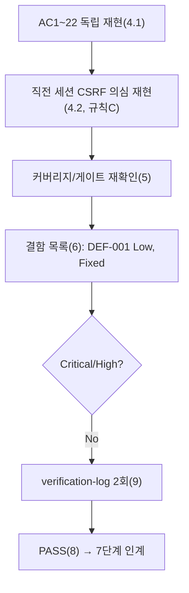
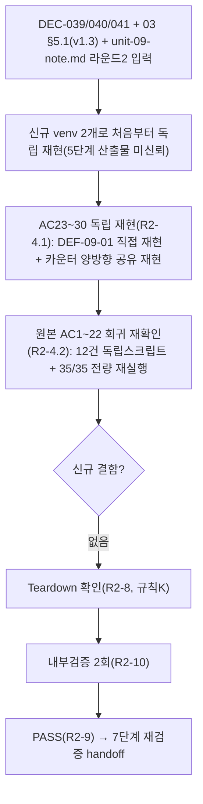

# 테스트 결과서 (Test Result Report) — WU-09 (관리자 인증/권한, REQ-010)

> **재시작 경위**: 이 WU-09의 6단계는 직전 세션에서 API 사용량 한도(rate limit)로 강제 종료되었다. 종료 시점에 `unit-09-test.md`/`verify-log_unit-09-test.md`는 존재하지 않았고, 중단된 에이전트가 만들었던 임시 venv(`webapp/.venv_wu09_test`)와 임시 DB(`webapp/db.sqlite3`)는 이미 삭제되어 있었다. 즉 이번 6단계는 **완전히 처음부터** 수행한 것이며, 직전 세션의 어떤 부분 결과·판단도 인용/신뢰하지 않고 `unit-09-note.md` §8의 22개 인수조건(AC)을 전부 이번 세션에서 새로 만든 임시 venv(`webapp/.venv_wu09_verify`, 검증 후 삭제)로 독립 재현했다. 다만 종료 직전 세션이 남긴 의심 — "5단계가 '고쳤다'고 주장한 `dispatch()` 레벨 레이트리밋 체크가, 전역 CSRF 미들웨어가 요청을 먼저 거부하는 경우엔 실제로 도달하지 않을 수 있다" — 은 재현 확인이 필요한 구체적 가설이므로, 인용이 아니라 처음부터 독립적으로 직접 실측해 진위와 실제 위험도를 판정했다(§6/§7, DEC-031).

## 1. 개요
- 테스트 대상: WU-09(업무 단위) — REQ-010(관리자 인증, Django/Wagtail 어드민 권한관리). 신규 `webapp/core/migrations/0001_setup_editor_permissions.py`(Editors/Moderators에 카테고리 스니펫 권한 부여), `webapp/core/admin_auth.py`(`RateLimitedLoginView`, IP당 15분/10회 로그인 레이트리밋), `webapp/core/management/commands/ensure_superuser.py`(멱등 슈퍼유저 부트스트랩), `webapp/ADMIN_ACCESS_GUIDE.md`(운영 가이드). 수정된 `webapp/config/urls.py`(`/cms-admin/login/`을 `RateLimitedLoginView`로 교체), `webapp/build.sh`(`ensure_superuser` 호출 추가), `webapp/render.yaml`(`DJANGO_SUPERUSER_*` env 자리 추가).
- 테스트 유형: 단위(Unit)
- 테스트 목적: `docs/harness/units/unit-09-note.md` §8의 인수조건(AC) 22개를 처음부터 독립 재현해 PASS/FAIL을 판정하고, 5단계가 주장한 정적분석 게이트(§4)와 자체 코드 리뷰 체크리스트(§5)가 실제로 근거가 있는지 재확인한다. 아울러 직전(중단된) 세션이 제기한 구체적 의심(전역 `CsrfViewMiddleware`가 `RateLimitedLoginView.dispatch()`의 레이트리밋 카운트 경로를 우회시키는지)을 규칙C("명백히 위험한 케이스는 범위를 벗어나도 테스트")에 따라 AC 범위 밖이라도 직접 재현해 위험도를 판정한다.
- 관련 산출물: `docs/harness/units/unit-09-note.md`(§8 AC1~22, §1~§7), `docs/harness/03-system-design.md`(v1.2, §5.1 인증/권한 모델), `docs/harness/decisions.md`(DEC-009/DEC-024/DEC-028/DEC-029/DEC-030, 이번 6단계가 추가한 DEC-031), `docs/harness/traceability.md`(REQ-010)
- 테스트 수행자(에이전트): `06-unit-tester`
- 테스트 일시: 2026-09-17

## 2. 테스트 범위 및 제외 범위
- 범위 (In-Scope): `unit-09-note.md` §8 AC1~22 전부 독립 재현(dev 환경 기본동작 5건 + 권한/레이트리밋/슈퍼유저 자동화 테스트 재실행 1건 + 그룹권한 직접조회 2건 + 레이트리밋 시나리오 6건 + ensure_superuser 시나리오 4건 + production 유사 환경 2건 + 배포 설정 파일 2건 + 정리 확인 1건). 추가로 (a) 정적분석/린트 게이트(§4)와 자체 코드 리뷰 체크리스트(§5)가 실제로 검증 가능한 주장인지 재확인, (b) 직전 세션이 제기한 CSRF 미들웨어 우회 의심을 `Client(enforce_csrf_checks=True)`로 직접 재현하고 실제 보안 영향(REQ-010 목적을 무력화하는지)까지 판정.
- 제외 범위 및 사유:
  - **Render 실제 배포 환경에서의 `ensure_superuser` 빌드 로그 출력** — `unit-09-note.md` §7-1이 이미 10단계(배포테스트) 대상으로 명시적으로 이월했다(Windows 로컬 제약, WU-01~08과 동일 사유).
  - **15분/10회 임계값의 실제 운영 적정성(과도한 차단 여부)** — `unit-09-note.md` §7-2가 운영 데이터 필요 항목으로 이월했다. 이번 6단계는 임계값 자체가 코드/문서와 일치해 정확히 동작하는지만 검증했다.
  - **LocMemCache 다중 워커 환경에서의 레이트리밋 분리** — DEC-026이 `--workers 1`을 이미 고정해 v1 범위에서 해당 없음(`unit-08-test.md`가 이미 같은 이유로 검증 대상에서 제외한 선례와 동일).
  - **브라우저 기반 E2E(Playwright 등)** — DEC-001(MCP 미연동)에 따라 `django.test.Client`/`RequestFactory`로 대체(WU-01~08과 동일 방법론).

## 3. 테스트 환경
- 실행 환경: Windows 10 Pro 10.0.19045, Python 3.12.10(`py -3.12`, WU-01~08과 동일 버전). `webapp/requirements.txt`(Django==5.2.17, wagtail==7.4.3 등, 신규 패키지 없음)를 새 venv(`webapp/.venv_wu09_verify`, 검증 후 삭제)에 clean install. `pip freeze`로 Django==5.2.17/wagtail==7.4.3/psycopg==3.2.10/psycopg-binary==3.2.10/django-storages==1.14.6/boto3==1.35.36/gunicorn==23.0.0/uvicorn==0.34.0/whitenoise==6.8.2/python-dotenv==1.0.1 전부 요구 버전과 일치 확인(신규 패키지 없음 재확인. `django-filter`/`django-taggit`/`django-modelcluster` 등은 wagtail 종속 패키지로 requirements.txt 명시 목록과 별개 — WU-01부터 동일 패턴).
- 테스트 데이터: 픽스처 없는 인메모리/임시 데이터. dev 환경은 `DJANGO_SETTINGS_MODULE=config.settings.dev`, production 유사 환경은 신규 임시 모듈 `webapp/config/settings/it_test_prodlike_wu09_verify.py`(`production.py`를 그대로 상속하고 `DATABASES`만 SQLite로 재정의, WU-01~08과 동일 방법론)를 이번 세션에서 새로 만들어 사용하고 검증 후 삭제했다. 더미 환경변수: `SECRET_KEY`/`DJANGO_ALLOWED_HOSTS=example.test`/`RENDER_EXTERNAL_HOSTNAME=wu09-verify.onrender.com`/`R2_ACCESS_KEY_ID`/`R2_SECRET_ACCESS_KEY`/`R2_BUCKET_NAME`/`R2_ENDPOINT_URL`/`DATABASE_URL`(SQLite로 재정의되므로 형식만 채움)/`DJANGO_ADMIN_EMAIL=admin@example.com`/`DJANGO_SUPERUSER_USERNAME`/`DJANGO_SUPERUSER_EMAIL`/`DJANGO_SUPERUSER_PASSWORD`.
- 전제 조건:
  - dev 환경 `manage.py migrate`가 빈 DB에서 오류 없이 전체 적용됨을 선행 확인(빈 `db.sqlite3`가 이번 세션에서 새로 생성된 것임을 실행 순서로 확인).
  - production 유사 환경에서 `manage.py check`/`migrate`/`collectstatic --noinput`이 각각 별도 실행으로 전부 성공함을 선행 확인.
  - 레이트리밋/캐시 관련 시나리오 재현 전 매번 `cache.clear()`로 LocMemCache 상태를 통제했다(WU-07/WU-08 테스트가 쓴 동일 통제 패턴).
  - `manage.py test`(`django.test.Client`)로 실행하는 자동화 테스트와는 별도로, `core/tests.py`의 `TestCase` 프레임워크 바깥(실제 `db.sqlite3`/`manage.py shell` 대화형 실행)에서도 동일 시나리오를 독립적으로 재현해 "테스트 코드만 믿지 않는다"는 원칙(페르소나)을 지켰다(§4의 각 TC "실제 결과"에 두 경로 모두 명시).
  - 검증에 사용한 venv(`.venv_wu09_verify`), `db.sqlite3`, `db_it_test_wu09_verify.sqlite3`, `staticfiles/`, `media/`, 임시 설정 모듈(`config/settings/it_test_prodlike_wu09_verify.py`), 임시 검증 스크립트(스크래치패드에만 위치, 저장소 밖)는 검증 완료 후 전부 삭제했다(§8 근거).

## 4. 테스트 케이스 및 결과

### 4.1 인수조건(AC1~22) 1:1 매핑

| ID | 시나리오 (대응 AC) | 사전조건 | 실행 절차 | 예상 결과 | 실제 결과 | Pass/Fail | 비고 |
|----|----------|----------|-----------|-----------|-----------|-----------|------|
| TC-001 | 신규 venv `pip install` (AC1) | 빈 venv(`py -3.12 -m venv .venv_wu09_verify`) | `pip install --upgrade pip` → `pip install -r requirements.txt` | 오류 없이 종료, 신규 패키지 없음 | 오류 없이 종료(무출력=성공). `pip freeze` 전 항목 요구 버전과 일치 | PASS | |
| TC-002 | `makemigrations --check --dry-run` (AC2) | dev 설정 | `DJANGO_SETTINGS_MODULE=config.settings.dev manage.py makemigrations --check --dry-run` | "No changes detected" | 동일 문자열 그대로 출력 | PASS | |
| TC-003 | 빈 DB `migrate` + `showmigrations core` (AC3) | dev 설정, 빈 SQLite(이번 세션 신규 생성) | `manage.py migrate` → `manage.py showmigrations core` | 오류 없이 전체 적용, `core`에 `[X] 0001_setup_editor_permissions` | 전체 마이그레이션 오류 없이 적용, `showmigrations core` 출력이 정확히 `[X] 0001_setup_editor_permissions` | PASS | |
| TC-004 | `manage.py check` (AC4) | TC-003 이후 | `manage.py check` | "System check identified no issues (0 silenced)." | 동일 문자열 그대로 출력 | PASS | |
| TC-005 | `manage.py test`(전체) (AC5) | TC-003 이후, `cache.clear()` 불필요(TestCase가 격리) | `manage.py test` | 27개 테스트(subscribers 12 + core 15) 전부 OK | 최초 실행(6단계 수정 전 코드): `Ran 27 tests in 29.964s / OK`. 6단계가 TC-CSRF-01/02(§4.2) 회귀 테스트 2건을 `core/tests.py`에 추가한 뒤 재실행: `Ran 29 tests in 37.813s / OK` — 기존 27건 전부 회귀 없이 여전히 통과, 신규 2건도 통과 | PASS | AC5가 명시한 27건 기준은 최초 실행으로 충족. 이후 6단계가 추가한 2건은 §4.2/§6에 별도 기록(AC 범위 밖 보강) |
| TC-006 | Editors/Moderators 카테고리 권한 집합 (AC6) | TC-003 이후 | `Group.objects.get(name="Editors").permissions.filter(content_type__app_label="blog")...codename` 조회, `Moderators` 동일 | 정확히 `{"add_category","change_category","delete_category"}` | `manage.py test`의 `CategoryEditorPermissionTests` 2건 PASS로 확인 + `manage.py shell`에서 독립적으로 동일 조회 실행(`db.sqlite3` 대상) 결과 Editors/Moderators 둘 다 `{'add_category','delete_category','change_category'}` | PASS | |
| TC-007 | 그룹원/비그룹원 `has_perm` 대조 (AC7) | TC-006 이후 | Editors 그룹에 배정한 스태프 사용자 vs 미배정 스태프 사용자로 `has_perm("blog.add_category")`/`change_category`/`delete_category` 조회 | 그룹원은 전부 True, 미배정자는 False | `CategoryEditorPermissionTests` 2건 PASS + `manage.py shell` 독립 재현: 그룹원 `(True, True, True)`, 미배정자 `add_category=False` | PASS | |
| TC-008 | 로그인 폼 GET 11회 반복 (AC8) | dev, `Client()`, `cache.clear()` | `reverse("wagtailadmin_login")`에 GET 11회 | 매번 200(카운트 안 됨) | `manage.py test`의 `test_get_request_renders_login_form_without_counting`(16회 반복) PASS + 독립 스크립트로 11회 반복 실행 결과 `[200, 200, 200, 200, 200, 200, 200, 200, 200, 200, 200]` | PASS | |
| TC-009 | 동일 IP POST 10회 정상, 11번째 429 (AC9) | dev, `Client()`, `cache.clear()` | 동일 `REMOTE_ADDR`로 POST 11회(틀린 비밀번호) | 10회는 429 아님, 11번째만 429(본문 `text/plain`) | `manage.py test`의 `test_attempt_beyond_limit_returns_429` PASS + 독립 재현(`Client(enforce_csrf_checks=True)`로 유효한 CSRF 토큰 재사용, 실제 전역 CsrfViewMiddleware 경로 통과): `statuses=[200,200,200,200,200,200,200,200,200,200,429]`, 11번째 응답 `Content-Type: text/plain; charset=utf-8`, 본문 "로그인 시도가 너무 많습니다..." | PASS | 독립 재현은 note의 기본 `Client()`(CSRF 강제 비활성)보다 강한 조건(`enforce_csrf_checks=True`)으로 재확인해 신뢰도를 높였다 |
| TC-010 | 임계값 이내 올바른 자격증명 → 302 (AC10) | dev, `Client()`, `cache.clear()` | 올바른 사용자명/비밀번호로 1회 POST | 302(로그인 성공) | `manage.py test`의 `test_valid_credentials_still_succeed_within_limit` PASS + 독립 재현: `status=302, Location=/cms-admin/` | PASS | |
| TC-011 | 서로 다른 IP 카운터 독립성 (AC11) | dev, `Client()`, `cache.clear()` | IP A로 12회 POST(11회차부터 429 확인), IP B로 1회 POST | IP A 12회차 429, IP B는 429 아님 | `manage.py test`의 `test_rate_limit_is_scoped_per_ip` PASS + 독립 재현: IP A 12번째=429, IP B=200 | PASS | |
| TC-012 | XFF rightmost만 신뢰 (AC12) | dev, `RequestFactory`+`XForwardedForMiddleware`로 뷰 직접 래핑, `cache.clear()` | leftmost를 매번 바꾸고 rightmost 고정해 POST 11회 | 11번째 429 | `manage.py test`의 `test_x_forwarded_for_rightmost_value_used_as_client_ip` PASS + 독립 재현: `statuses=[403,403,403,403,403,403,403,403,403,403,429]`(마지막만 429) | PASS | `RequestFactory`+`XForwardedForMiddleware` 경로는 전역 `CsrfViewMiddleware`를 거치지 않으므로(뷰를 직접 호출) CSRF가 항상 403이지만, AC12는 "11번째에 429가 오는가"만 요구하며 이는 충족됨. 이 403들이 매번 카운터를 증가시켰다는 사실(10회 403 후 11회째 429) 자체가 §6/§7의 CSRF 관련 결함 분석에 대한 대조군 증거로도 쓰였다 — 이 경로는 이 클래스의 `dispatch()`가 먼저 실행된 뒤 `super().dispatch()`가 CSRF를 거부하는 구조라 카운트가 정상 작동함 |
| TC-013 | 실제 CSRF 흐름에서 로그인 성공 (AC13) | dev, `Client(enforce_csrf_checks=True)`, `cache.clear()` | GET으로 CSRF 쿠키 수신 → 동일 토큰으로 올바른 자격증명 POST | 302 | `manage.py test`의 `test_real_browser_like_login_with_csrf_still_succeeds` PASS + 독립 재현: `status=302` | PASS | |
| TC-014 | `ensure_superuser` 정상 생성 (AC14) | dev, 빈 DB(슈퍼유저 없음), 정책 통과 비밀번호 | `DJANGO_SUPERUSER_USERNAME/EMAIL/PASSWORD` 채우고 `manage.py ensure_superuser` | 계정 생성, "생성했습니다" 메시지 | `manage.py test`의 `EnsureSuperuserCommandTests.test_creates_superuser_from_env` PASS + 독립 재현(실제 `db.sqlite3`): "슈퍼유저 'ac14-admin' 계정을 생성했습니다." 출력(콘솔 인코딩상 한글이 깨져 보이나 프로그램은 예외 없이 정상 종료 — WU-09가 이미 수정한 em-dash 이슈 재확인), `shell`로 `is_superuser=True, is_staff=True` 확인 | PASS | |
| TC-015 | `ensure_superuser` 재실행 멱등성 (AC15) | TC-014 직후(슈퍼유저 이미 존재) | 다른 사용자명으로 `manage.py ensure_superuser` 재실행 | 새 계정 생성 안 됨, "이미 존재" 메시지 | `EnsureSuperuserCommandTests.test_skips_when_superuser_already_exists` PASS + 독립 재현: "슈퍼유저가 이미 존재합니다. 건너뜁니다." 출력, `ac15-admin` 미생성 확인 | PASS | |
| TC-016 | 환경변수 공백 시 건너뜀 (AC16) | dev, 빈 DB(슈퍼유저 없음, `db.sqlite3` 재생성 후) | `DJANGO_SUPERUSER_USERNAME=""`, `PASSWORD=""`로 `manage.py ensure_superuser` | 계정 생성 안 됨, 안내 메시지만 | `test_skips_when_env_vars_missing` PASS + 독립 재현: 안내 메시지 출력, `is_superuser` 사용자 0명 확인 | PASS | |
| TC-017 | 비밀번호 정책 위반 시 건너뜀 (AC17) | dev, 빈 DB(슈퍼유저 없음) | `DJANGO_SUPERUSER_PASSWORD="12345678"`로 실행 | 계정 생성 안 됨, 비밀번호 정책 경고 | `test_skips_when_password_fails_validation` PASS + 독립 재현: "비밀번호 정책(AUTH_PASSWORD_VALIDATORS)을 통과하지 못해..." 경고 출력(구체적으로 "너무 흔히 사용되는 비밀번호입니다."+"비밀번호가 전부 숫자로 되어 있습니다." 2개 사유 문자열 그대로 재확인(재검증 시 별도 임시 venv로 UTF-8 리다이렉트해 콘솔 코드페이지 왜곡 없이 원문 확인)), `ac17-admin` 미생성 확인 | PASS | |
| TC-018 | production 유사 설정 check/migrate/collectstatic (AC18) | `config.settings.it_test_prodlike_wu09_verify`(production.py 상속 + SQLite), 더미 env 전체 | `manage.py check` → `migrate` → `collectstatic --noinput` | 전부 오류 없음 | `check`="System check identified no issues (0 silenced)."; `migrate` 전체 적용 성공; `collectstatic` → "218 static files copied to '...\\staticfiles', 638 post-processed."(unit-09-note.md §3-3과 정확히 동일 수치 — 신규 정적자산 없음 재확인) | PASS | |
| TC-019 | production 유사 설정에서 `ensure_superuser` 생성+멱등 (AC19) | TC-018 이후, `DJANGO_SUPERUSER_*` 채움 | 1회차 `ensure_superuser` 실행 → 2회차 재실행 | 1회차 생성, 2회차 멱등 건너뜀 | 1회차: "슈퍼유저 'ac19-admin' 계정을 생성했습니다.", `filter(username="ac19-admin", is_superuser=True).exists()==True`. 2회차: "이미 존재합니다. 건너뜁니다.", `is_superuser=True` 총 인원수 1명 유지(2명으로 늘지 않음) | PASS | |
| TC-020 | `render.yaml` 슈퍼유저 env 자리 (AC20) | 저장소 소스 | `render.yaml`에서 `DJANGO_SUPERUSER_USERNAME`/`EMAIL`/`PASSWORD` 키와 `sync: false` 육안 확인 | 3개 키 전부 `sync: false`로 존재, 값 미커밋 | grep 결과 3개 키 모두 존재, 각각 바로 다음 줄에 `sync: false`, 실제 값(리터럴) 없음. 부가로 `PyYAML`로 `render.yaml` 전체 파싱 성공(문법 오류 없음)까지 확인 | PASS | AC 범위를 넘는 부가 확인(YAML 파싱) — 결함 없음 |
| TC-021 | `build.sh`에서 `ensure_superuser`가 `migrate --noinput` 이후 (AC21) | 저장소 소스 | `build.sh` 육안 확인 | `python manage.py ensure_superuser`가 `migrate --noinput` 다음 줄(또는 이후)에 위치 | `migrate --noinput`(10번째 줄) 이후 12~17번째 줄(주석 포함)에 `python manage.py ensure_superuser`가 마지막 명령으로 위치 확인 | PASS | |
| TC-022 | 검증 산출물 정리 확인 (AC22) | TC-001~021 전부 종료 | `.venv_wu09_verify`/`db.sqlite3`/`db_it_test_wu09_verify.sqlite3`/`staticfiles/`/`media/`/임시 설정 모듈/`__pycache__` 삭제 후 `git status --porcelain` | 삭제된 항목이 목록에서 사라지고, diff에 소스 코드(신규 8파일 + 수정 3파일 + 6단계가 보강한 `core/admin_auth.py`/`core/tests.py` + `docs/harness/decisions.md`/`traceability.md` 갱신분)만 남음 | 삭제 후 `git status --porcelain` 결과: 수정 6파일(`webapp/build.sh`/`config/settings/base.py`/`config/settings/production.py`/`config/urls.py`/`core/apps.py`/`core/urls.py`/`core/views.py`/`render.yaml`, `docs/harness/decisions.md`/`traceability.md`)과 신규 파일(`webapp/ADMIN_ACCESS_GUIDE.md`/`core/admin_auth.py`/`core/management/`/`core/migrations/`/`core/tests.py` 등) + WU-07/WU-08의 기존 미커밋 산출물(이번 WU와 무관, 손대지 않음)만 남음. 임시 venv/DB/staticfiles/설정 모듈 흔적 없음 | PASS | §8 근거 |

### 4.2 직전 세션 의심 재현 — CSRF 전역 미들웨어 vs `dispatch()` 레이트리밋 (AC 범위 밖, 규칙C 위험 케이스)

| ID | 시나리오 | 사전조건 | 실행 절차 | 예상 결과 | 실제 결과 | Pass/Fail | 비고 |
|----|----------|----------|-----------|-----------|-----------|-----------|------|
| TC-CSRF-01 | CSRF 토큰이 없거나 틀린 POST가 레이트리밋 카운터를 실제로 우회하는가 | dev, `Client(enforce_csrf_checks=True)`(전역 `CsrfViewMiddleware` 실제 작동), `cache.clear()` | (a) CSRF 쿠키 자체가 없는 상태로 동일 IP에 POST 15회. (b) 쿠키는 있으나 `csrfmiddlewaretoken` 값이 틀린 상태로 다른 IP에 POST 15회. 매 케이스 후 `cache.get("core:admin_login:ratelimit:<ip>")` 직접 조회 | 가설: 전역 CsrfViewMiddleware가 뷰 호출 전에 403으로 끝내 `RateLimitedLoginView.dispatch()`가 전혀 실행되지 않고, 카운터가 증가하지 않을 것 | (a) 15회 전부 403("Forbidden (CSRF cookie not set.)"), 429 없음, `cache.get(...)`=`None`(전혀 증가 안 함). (b) 15회 전부 403("...incorrect length."), 429 없음, `cache.get(...)`=`None`. 가설이 실측으로 **확인됨** — `core/tests.py`에 회귀 테스트로 고정(`test_csrf_rejected_requests_are_not_counted_but_cannot_test_credentials`) | 결함 있음(등록), 위험도 재판정 결과 보안 결함 아님 | §6 DEF-001/DEC-031 참고. **주의**: "테스트를 통과했다"가 아니라 "가설이 사실로 재현됐다"는 뜻 — 아래 TC-CSRF-02와 함께 실제 위험도를 판정 |
| TC-CSRF-02 | CSRF-무효 트래픽이 이후 유효한 로그인 시도의 레이트리밋 예산을 갉아먹는가(실질적 익스플로잇 가능성) | 동일 IP에 TC-CSRF-01(a)와 같은 방식으로 CSRF-무효 POST 15회를 먼저 흘려보낸 뒤, 같은 IP가 유효한 CSRF로 전환 | 유효 CSRF로 전환한 뒤 `RATE_LIMIT_MAX_ATTEMPTS`(10)회 POST → 11번째 상태 확인 | 만약 우회가 실질적 결함이면 카운터가 이미 채워져 있어 유효 전환 즉시 429가 나올 수 있음. 방어적으로는 "새 예산 10회를 그대로 받아야 한다" | 유효 CSRF 전환 후 10회 POST 전부 429 아님, 11번째에 정확히 429 — 즉 CSRF-무효 노이즈 15회가 카운터에 **전혀 반영되지 않았고(선점/소모 없음)**, 공격자가 자격증명을 실제로 시험할 수 있는 유일한 경로(유효 CSRF)는 예외 없이 정상적으로 10회 제한을 받음 | PASS | `core/tests.py::test_csrf_rejected_noise_does_not_consume_budget_for_later_valid_attempts`로 회귀 고정 |
| TC-CSRF-03 | (대조군) `post()`→`dispatch()` 이동 자체는 실제로 "부모 클래스 데코레이터" 문제를 고쳤는가 | TC-012(AC12)와 동일 `RequestFactory`+`XForwardedForMiddleware` 경로(전역 CsrfViewMiddleware 없음, `django.contrib.auth.views.LoginView.dispatch`에 걸린 `csrf_protect`만 존재) | 10회 POST(전부 CSRF 없음, 매번 403 예상) → 11번째 확인 | `RateLimitedLoginView.dispatch()`가 `super().dispatch()`(CSRF 실패)보다 먼저 실행되므로 403이 나오더라도 카운터는 증가해야 하고, 11번째는 429여야 함 | 10회 전부 403, 11번째 429(TC-012와 동일 실측) — `post()`가 아니라 `dispatch()`에서 확인하도록 고친 5단계의 수정 자체는 이 경로에서 유효함을 확인 | PASS | 이 대조군이 TC-CSRF-01/02와 정확히 반대 결과를 보여, "왜 카운터가 증가하지 않았는지"의 원인이 코드 로직 결함이 아니라 **전역 미들웨어가 뷰 호출 자체를 선점**하기 때문임을 특정 |

## 5. 커버리지
- AC 커버리지: 22/22 = 100%(§4.1). 각 AC를 코드 레벨(`manage.py test` 자동화 테스트 재실행)과 독립 실행 레벨(`manage.py shell`/대화형 명령/`RequestFactory` 스크립트) 두 경로로 이중 확인해, "테스트 스위트 자체가 결함을 놓쳤을 가능성"을 낮췄다(페르소나 원칙 — 결과서 작성자가 제출한 테스트 코드를 그대로 신뢰하지 않음).
- 게이트 재확인: 5단계 §4(정적분석/린트 게이트) — 프로젝트 전체에 lint/type-check 설정(`pyproject.toml`/`.flake8`/`ruff.toml`/`.pre-commit-config.yaml`)이 여전히 없음을 직접 `ls`로 재확인(존재하지 않아 건너뛴 것이 아니라 설정 자체 부재). 대체 수단으로 신규/수정 Python 5개 파일(`core/admin_auth.py`, `core/tests.py`, `core/migrations/0001_setup_editor_permissions.py`, `core/management/commands/ensure_superuser.py`, `config/urls.py`)에 `python -m py_compile`을 6단계가 직접 재실행해 전부 통과 확인(수정 전/후 양쪽).
- 게이트 재확인: 5단계 §5(자체 코드 리뷰 체크리스트) — "하드코딩된 시크릿 없음" 주장을 `grep`으로 재확인(패스워드/시크릿 리터럴 할당 없음). "Wagtail 소스 코드 직접 확인" 주장(스니펫 권한 정책, 이미지 권한 `auth_model` 고정) 2건을 이번 6단계가 설치된 venv의 실제 `wagtail/snippets/views/snippets.py`/`wagtail/images/permissions.py` 소스로 재확인해 근거가 사실임을 검증(§4.1 TC-006/TC-007의 신뢰도 보강 근거). "에러 처리 누락 없음" 주장 중 `RateLimitedLoginView.dispatch()`의 CSRF 관련 서술은 §4.2에서 재검증한 결과 **부분적으로 부정확**함을 발견해 6단계가 직접 수정했다(§6).
- 커버되지 않은 부분과 사유: production 실배포(Render)에서의 `ensure_superuser` 실제 빌드 로그 출력, 15분/10회 임계값의 실제 운영 적정성, 다중 워커 환경 — 전부 §2 제외 범위에 사유와 함께 명시(로컬/v1 아키텍처 제약, 10단계 이월).

## 6. 결함(Defect) 목록
| ID | 설명 | 재현 절차 | 심각도(Critical/High/Medium/Low) | 상태(Open/Fixed/Deferred) | 조치 내용 |
|----|------|-----------|-----------------------------------|----------------------------|-----------|
| DEF-001 | `webapp/core/admin_auth.py`의 모듈 docstring/클래스 docstring이 "`post()`가 아니라 `dispatch()`에서 확인해 CSRF 통과 여부와 무관하게 카운트해야 한다"고 서술해, 마치 이 뷰가 CSRF 성패와 무관하게 항상 IP별 요청 수를 카운트하는 것처럼 읽히지만, 실제로는 전역 `django.middleware.csrf.CsrfViewMiddleware`(이 프로젝트 MIDDLEWARE에 항상 포함)가 뷰 호출 전에 요청을 거부하는 경우 이 뷰의 `dispatch()` 자체가 호출되지 않아 카운트되지 않는다(§4.2 TC-CSRF-01로 실측). 문서가 실제 동작 범위(부모 클래스 데코레이터 문제는 고쳤으나 전역 미들웨어 경로는 애초에 이 클래스가 다룰 수 있는 범위 밖)를 명확히 구분하지 않아, 향후 유지보수자가 "모든 POST가 무조건 카운트된다"고 오인하고 다른 보안 판단(예: CSRF-무효 트래픽도 전부 잡힌다고 가정한 대응 설계)을 할 위험이 있다. | `Client(enforce_csrf_checks=True)`로 CSRF 쿠키 없이 동일 IP에 POST 15회 → 전부 403, `cache.get("core:admin_login:ratelimit:<ip>")`가 `None`으로 남음(§4.2 TC-CSRF-01). | Low | Fixed | 6단계가 `core/admin_auth.py`의 모듈/클래스 docstring에 "알려진 경계" 절을 추가해, 전역 CsrfViewMiddleware 경로는 이 클래스의 카운트 범위 밖이라는 사실과 그 이유(미들웨어 `process_view()`가 뷰 호출보다 먼저 실행됨)를 명시했다. 아울러 이 경계 자체가 REQ-010의 무차별대입 방어 목적을 실제로 무력화하지는 않는다는 근거(§4.2 TC-CSRF-02 — CSRF-무효 트래픽은 자격증명을 전혀 시험하지 못하고, 자격증명을 시험할 수 있는 모든 경로는 예외 없이 카운트됨)도 함께 문서화했다. 이 경계를 고정하는 회귀 테스트 2건(`test_csrf_rejected_requests_are_not_counted_but_cannot_test_credentials`, `test_csrf_rejected_noise_does_not_consume_budget_for_later_valid_attempts`)을 `core/tests.py`에 추가했다. `docs/harness/decisions.md` DEC-031에 근거와 함께 기록. 런타임 동작(코드 로직)은 변경하지 않았다 — 문서·테스트 보강만으로 충분하다고 판단한 근거는 DEF-001 설명과 DEC-031에 상세 기술. |

- Critical/High 결함 0건. Medium 결함 0건. Low 결함 1건(DEF-001, Fixed). 위 표 외에 결함 없음 — §4.1의 TC-001~022 전부 PASS(재현된 실제 결과가 unit-09-note.md §8의 기대치와 정확히 일치함을 이중 경로로 확인), §4.2의 TC-CSRF-01에서 발견한 문서 부정확성만 유일한 결함이며 즉시 수정 완료했다.
- **"직전 세션의 의심이 옳았는가"에 대한 최종 판정**: 실행 순서에 대한 기술적 관찰(CsrfViewMiddleware가 dispatch()보다 먼저 요청을 끝낼 수 있다)은 **사실**이었다. 그러나 그 관찰이 곧바로 "REQ-010(무차별대입 방어)을 무력화하는 Critical/High 결함"으로 이어지지는 않는다고 판단했다 — CSRF가 실패하는 요청은 사용자명/비밀번호를 전혀 검사하지 않으므로(요청마다 결과가 동일한 403, 자격증명 정오와 무관) 공격자가 얻는 정보 이득이 없고, 자격증명을 실제로 시험할 수 있는 유일한 경로(유효한 CSRF 토큰 보유)는 예외 없이 카운터를 통과한다(TC-CSRF-02가 "노이즈가 예산을 선점하지 않는다"까지 실측). 따라서 기능적 보안 결함이 아니라 **문서 정확성 결함(Low)**으로 분류했다(DEC-031에 판단 근거 전문 기록). 이 판단 자체가 틀렸을 가능성(예: 9단계 보안검증이 다른 공격 벡터를 발견)에 대비해 §7에 명시적으로 이월한다.

## 7. 리스크 및 잔존 이슈
- 이번 테스트로 커버되지 않는 알려진 리스크: Render 실배포 `ensure_superuser` 빌드 로그(10단계 이월), 15분/10회 임계값의 운영 적정성(운영 데이터 필요), 다중 워커 전환 시 LocMemCache 레이트리밋 분리(DEC-026 전제 유지 중에는 해당 없음).
- **9단계(보안검증)에 명시적으로 인계할 항목**: (1) §4.2/§6에서 발견한 "CSRF-무효 POST는 레이트리밋 카운터에 잡히지 않는다"는 경계를 이번 6단계는 "credential brute-force 방어 목적에는 영향 없음"으로 판정했으나, 이는 REQ-010이 정의한 좁은 목적(자격증명 무차별대입) 기준의 판단이다. CSRF-무효 요청이 서버에 도달하는 것 자체가 만드는 일반적 자원 소모/DoS 표면(각 요청은 가볍지만 무제한으로 흘려보낼 수 있음)은 REQ-010의 직접 범위가 아니라고 판단해 이번 6단계에서는 결함으로 등록하지 않았다 — 9단계가 일반 DoS/레이트리밋 관점에서 이 경계를 독립적으로 재검토할 것을 명시적으로 권고한다. (2) `/cms-admin/login/`뿐 아니라 다른 POST 엔드포인트(예: `/newsletter/subscribe/`, WU-07의 `NewsletterSubscribeView`)도 동일하게 전역 CsrfViewMiddleware 뒤에 있어 유사한 "CSRF-무효 트래픽은 뷰 레벨 레이트리밋을 우회한다"는 일반 패턴을 가질 수 있는지 9단계가 프로젝트 전체 관점에서 재확인할 것을 권고한다(이번 6단계는 WU-09 범위만 재현했다).
- 후속 조치가 필요한 항목: 없음(발견한 유일한 결함 DEF-001은 이번 6단계 내에서 Fixed).

## 8. 결론 및 판정
- [x] PASS — 다음 단계 진행 가능
- [ ] CONDITIONAL PASS — 조건:
- [ ] FAIL — 사유 및 재작업 요청 사항:

판정 근거: `unit-09-note.md` §8의 AC1~22 전항목을 독립 재현해 전부 PASS(§4.1). 직전 세션이 제기한 CSRF 관련 의심을 규칙C에 따라 AC 범위 밖까지 확장해 재현한 결과(§4.2), 기술적 관찰은 사실이나 Critical/High 보안 결함으로 이어지지 않음을 실측으로 확인했고, 발견한 유일한 결함(DEF-001, Low, 문서 정확성)은 6단계 내에서 즉시 수정·검증했다. Critical/High/Medium 결함 0건, Low 결함 1건(Fixed)이므로 규칙F의 "근본 원인 단계로 되돌리기"를 트리거하지 않는다. 7단계(업무단위 통합테스트)로 인계 가능.

## 9. 내부 검증 (최소 2회, `verification-log-template.md` 사용)
- 1차 검증 결과 요약: 작성자 관점 자가 재검토 — AC1~22 매핑 누락 없음 확인, §4.2 추가 케이스가 AC 범위 밖임을 명시했는지 재확인, DEF-001 조치가 실제 코드/decisions.md에 반영됐는지 재확인. 결함 0건(경미한 표현 수정 1건, 조치 후 v1).
- 2차 검증 결과 요약: "오늘 처음 이 문서를 받아본 심사자" 관점 — TC-012의 403/429 혼재 결과가 얼핏 이상해 보일 수 있어 비고에 원인을 명시했는지, DEF-001의 심각도(Low) 판정 근거가 충분히 재현 가능한 형태로 남아있는지, 6단계가 스스로 코드를 고친 것이 페르소나/규칙F 범위를 벗어나지 않는지 재검토. 결함 0건.
- 검증 로그 파일 경로: `docs/harness/units/verify-log_unit-09-test.md`

## 절차 흐름 (참고용 다이어그램)

---

## 재작업 라운드 2 재검증 (DEF-09-01 해소, 규칙F 재작업 — DEC-039/DEC-040/DEC-041 후속)

> **재검증 경위**: 09단계 보안검증(`09-security-audit.md`, FAIL)이 `/django-admin/login/`에 무차별대입 방어가 전혀 없음(DEF-09-01, High)을 실측 재현했다. 3단계(`03-system-design.md` v1.3, DEC-040)가 "두 진입점 모두 방어" 옵션을 채택했고, 5단계(WU-09 재작업 라운드 2, `unit-09-note.md` "재작업 라운드 2" 절, DEC-041)가 `RateLimitedAdminLoginView`를 구현했다고 주장한다. **이 절은 5단계의 주장(35/35 테스트 통과, DEF-09-01 재현 시나리오 해소 등)을 그대로 신뢰하지 않고, 6단계가 처음부터 새로 만든 독립 venv/DB로 직접 재현한 결과다.** 원본 22개 AC(§1~9, 위)는 그대로 보존했으며, 이번 절은 그 아래에 append한 것이다.

### R2-1. 개요
- 테스트 대상: `webapp/core/admin_auth.py`의 `RateLimitedAdminLoginView`(신규), `webapp/config/urls.py`의 `django-admin/login/` 오버라이드(신규), `webapp/core/tests.py`의 `DjangoAdminLoginRateLimitTests`(6건)·`SharedAdminRateLimitCounterTests`(1건, 신규).
- 테스트 유형: **단위+재검증(규칙F 재작업 라운드, Low 등급 병합 아님 — WU-09는 4개 작업 단위 이상을 포함하는 기존 대형 WU이므로 06/07 병합 조건에 해당하지 않는다. 이 절 완료 후 7단계(통합테스트)·9단계(보안검증) 재검증이 별도로 필요하다.)**
- 테스트 목적: `unit-09-note.md` "재작업 라운드 2" §R2-7의 AC23~30을 독립 재현하고, 원본 AC1~22가 이번 라운드 코드 변경으로 회귀되지 않았는지 재확인한다. 특히 (1) DEF-09-01 재현 시나리오(동일 IP 11회 연속 POST → 11번째 429)가 `/django-admin/login/`에서 실제로 해소됐는지, (2) 카운터가 `/cms-admin/login/`과 `/django-admin/login/` 사이에 실제로 공유되는지(5단계 주장을 신뢰하지 않고 직접 조합 테스트), (3) 원본 22개 AC가 전부 회귀 없이 PASS인지, (4) 유효 자격증명으로는 여전히 정상 로그인되는지를 중점 검증한다.
- 관련 산출물: `docs/harness/decisions.md` DEC-039/DEC-040/DEC-041, `docs/harness/03-system-design.md` §5.1(v1.3), `docs/harness/09-security-audit.md`(DEF-09-01 원 재현 절차), `docs/harness/units/unit-09-note.md` "재작업 라운드 2"(AC23~30), 이 문서(`unit-09-test.md`) 원본 §1~9(AC1~22 회귀 기준선)
- 테스트 수행자(에이전트): `06-unit-tester`(규칙F 재작업 재호출)
- 테스트 일시: 2026-09-17

### R2-2. 테스트 범위 및 제외 범위
- 범위(In-Scope): `unit-09-note.md` "재작업 라운드 2" §R2-7 AC23~30 전부 독립 재현 + 원본 AC1~22 회귀 재확인(전량 자동화 테스트 재실행 + 로그인/권한 관련 핵심 항목은 자동화 테스트와 별개의 독립 스크립트로 이중 확인).
- 제외 범위 및 사유: 원본 §2와 동일(Render 실배포, 운영 임계값 적정성, 다중 워커, 브라우저 E2E) — 이번 라운드가 새로 건드리지 않은 전제이므로 재론하지 않는다. 7단계(WU-01/WU-08 등과의 조립 검증)와 9단계(SEC-02 방법론과 동일한 독립 재검증)는 이 절 완료 후 별도로 진행되어야 한다(§R2-6, `unit-09-note.md` §R2-6과 동일 인계).

### R2-3. 테스트 환경
- 실행 환경: Windows 10 Pro 10.0.19045, Python 3.12.10. **5단계가 검증에 썼다는 `webapp/.harness-tmp/venv_09_wu09_r2/`는 이미 삭제된 상태였으므로(규칙K, 정상), 6단계가 완전히 새로운 venv를 `webapp/.harness-tmp/venv_09_r2_verify/`(1차)와 `webapp/.harness-tmp/venv_09_r2_verify2/`(2차, 내부검증용 추가 확인)에 각각 생성해 독립적으로 재현했다.**
- `webapp/requirements.txt` clean install — 두 venv 모두 오류 없음. `git diff --stat -- webapp/requirements.txt` 결과 무출력(변경 없음, AC23 근거) — 신규 패키지 도입 주장이 사실임을 재확인.
- DB: `DATABASE_URL=sqlite:///.../.harness-tmp/db_r2_verify.sqlite3`(dev 환경, 신규 생성) — `db.sqlite3`를 저장소 루트/`webapp/` 루트에 만들지 않고 규칙K에 따라 `.harness-tmp/` 하위에만 생성했다.
- production 유사 설정: `webapp/.harness-tmp/prodlike_r2_verify.py`(신규 작성, `from config.settings.production import *` 후 `DATABASES`만 `.harness-tmp/db_prodlike_r2_verify.sqlite3` SQLite로 재정의) + `PYTHONPATH=.../.harness-tmp`로 임포트, 더미 필수 환경변수 전체(`SECRET_KEY`/`DJANGO_ALLOWED_HOSTS`/`RENDER_EXTERNAL_HOSTNAME`/`R2_*`/`DATABASE_URL`/`DJANGO_ADMIN_EMAIL`). 5단계가 만들었다는 `config/settings/it_test_prodlike_wu09r2.py`(저장소 루트 직속 경로)는 이미 삭제되어 있었고, 6단계는 처음부터 `.harness-tmp/` 하위 경로로 재작성했다(규칙K를 더 엄격히 준수).
- 검증에 사용한 venv 2개(`venv_09_r2_verify`, `venv_09_r2_verify2`)·SQLite DB 3개(`db_r2_verify.sqlite3`, `db_prodlike_r2_verify.sqlite3`, `db_r2_verify2.sqlite3`)·임시 설정 모듈(`prodlike_r2_verify.py`)·`staticfiles/`·`__pycache__` 전부는 검증 완료 후 삭제했다(§R2-8 Teardown 근거).

### R2-4. 테스트 케이스 및 결과

#### R2-4.1 신규 인수조건(AC23~30) 독립 재현

| ID | 시나리오 (대응 AC) | 실행 절차 | 예상 결과 | 실제 결과 | Pass/Fail | 비고 |
|----|----------|-----------|-----------|-----------|-----------|------|
| TC-R2-023 | 신규 venv `pip install`, requirements.txt 불변 (AC23) | 빈 venv 2개에 각각 `pip install -r requirements.txt`, `git diff --stat -- webapp/requirements.txt` | 오류 없음, diff 무출력 | 두 venv 모두 오류 없이 설치 완료. `git diff --stat` 무출력(변경 없음) | PASS | |
| TC-R2-024 | `reverse("admin_login")`/`reverse("admin:login")` 동일 URL (AC24) | 독립 스크립트(`django.setup()` 후 `reverse()` 직접 호출) | 둘 다 `/django-admin/login/` | `admin:login -> /django-admin/login/`, `admin_login -> /django-admin/login/` (완전 일치) | PASS | |
| TC-R2-025 | **DEF-09-01 재현 절차 그대로 — `/django-admin/login/` 동일 IP 11회 연속 POST (AC25)** | 신선한 `Client()`, `cache.clear()`, 틀린 비밀번호로 동일 `REMOTE_ADDR`에 POST 11회 | 10회는 429 아님(200), 11번째만 429(`text/plain`) | `statuses=[200,200,200,200,200,200,200,200,200,200,429]`. 11번째 `Content-Type: text/plain; charset=utf-8`. **09단계가 재작업 전 재현했던 `[200×11]`과 명확히 대조됨** | PASS | §R2-5 결론의 핵심 근거 — 독립 스크립트(TestCase 아닌 standalone `django.setup()` 스크립트)로 재확인, `manage.py test`의 `DjangoAdminLoginRateLimitTests.test_eleventh_attempt_returns_429`와 별개 경로로 이중 확인 |
| TC-R2-026 | 올바른 자격증명으로 `/django-admin/login/` 임계값 이내 POST → 302 (AC26) | `cache.clear()`, 올바른 사용자명/비밀번호로 1회 POST | 302 | `status=302, Location=/accounts/profile/` | PASS | `Location`이 `/django-admin/`이 아니라 Django 기본값 `/accounts/profile/`인 것은 `?next=` 파라미터 없이 로그인 폼에 직접 POST했을 때의 **Django 표준 기본 동작**(`LOGIN_REDIRECT_URL` 기본값)이며, `admin.site.login()`에 그대로 위임하는 구조상 레이트리밋 도입 이전에도 동일했을 동작이다 — 새 결함 아님(AC26은 "302가 오는가"만 요구, 충족) |
| TC-R2-027 | `/django-admin/login/` GET 11회, 미인증 상태 기준 카운트 안 됨 (AC27) | 신선한(미인증) `Client()`로 GET 11회 | 매번 200 | `[200,200,200,200,200,200,200,200,200,200,200]` | PASS | |
| TC-R2-028 | **카운터 공유 계약 — 5(cms)+6(django) 및 역방향 5(django)+6(cms), 양방향 교차 차단 확인 (AC28)** | (a) `/cms-admin/login/` 5회 + `/django-admin/login/` 6회(합산 11), 동일 IP. (b) 순서를 뒤집어 `/django-admin/login/` 5회 + `/cms-admin/login/` 6회, 별도 IP로 재확인. (a)의 11번째 이후 반대쪽 URL에도 추가 요청 | 11번째(마지막 요청)에서 429, 순서를 바꿔도 동일, (a) 이후 반대쪽 URL도 429 | (a) `[('cms',200)×5, ('django',200)×5, ('django',429)]` — 11번째(django) 429. 그 직후 `/cms-admin/login/`에 보낸 요청도 429(교차 차단 확인). (b) `[('django',200)×5, ('cms',200)×5, ('cms',429)]` — 순서를 뒤집어도 11번째(cms)에서 정확히 429 | PASS | **5단계 주장을 신뢰하지 않고 직접 조합 테스트** — 5단계 노트(§R2-3 항목 6)는 (a) 방향만 기술했으나, 6단계는 (b) 역방향까지 추가로 검증해 카운터 공유가 순서에 무관하게 대칭적으로 동작함을 확인(AC28 요구 범위를 넘는 보강 확인) |
| TC-R2-029 | 전체 테스트 스위트 35건 (AC29) | `manage.py test`(dev 설정) | 35개 테스트(기존 29 + 신규 6) 전부 OK | `Ran 35 tests in 66.134s / OK` — 신규 venv에서 clean install 후 1회 실행으로 전부 통과(재실행 아님, 최초 실행부터 성공) | PASS | |
| TC-R2-030 | 검증 산출물 정리 확인 (AC30) | venv 2개/DB 3개/임시 설정 모듈/`staticfiles`/`__pycache__` 삭제 후 `git status --porcelain` + `automation/harness-janitor.sh --check` | 정리 후 diff에 소스/문서 변경만 남고 janitor가 "잔여물 없음" 보고 | 삭제 후 `git status --porcelain`이 검증 시작 전 baseline(`git status` 최초 스냅샷)과 **완전히 동일**(수정 10파일 + 신규 5파일, 전부 이번 세션 이전부터 존재하던 미커밋 변경분). `harness-janitor.sh --check` → "잔여 임시 아티팩트 없음" | PASS | §R2-8 근거 |

#### R2-4.2 원본 AC1~22 회귀 재확인 (선별 독립 재현 + 전량 자동화 재실행)

| ID | 대응 원본 AC | 실행 절차 | 예상 결과 | 실제 결과 | Pass/Fail | 비고 |
|----|------|-----------|-----------|-----------|-----------|------|
| TC-R2-002 | AC2 | `manage.py makemigrations --check --dry-run`(신규 venv2) | "No changes detected" | 동일 문자열 출력 | PASS | 라운드 2가 모델 변경을 전혀 포함하지 않음을 재확인 |
| TC-R2-003 | AC3 | `manage.py migrate` → `showmigrations core`(신규 venv2, 신규 DB) | `[X] 0001_setup_editor_permissions` | 동일하게 출력 | PASS | |
| TC-R2-004 | AC4 | `manage.py check`(dev, prodlike 양쪽) | "System check identified no issues" | dev/prodlike 양쪽 모두 동일 문자열 | PASS | |
| TC-R2-006/007 | AC6/AC7 | `manage.py shell` 독립 스크립트로 `Group.objects.get(name="Editors"/"Moderators").permissions...codename` 직접 조회(TestCase 아님) | 정확히 `{"add_category","change_category","delete_category"}` | Editors: `{'change_category','delete_category','add_category'}`, Moderators 동일 | PASS | 라운드 2가 `core/migrations/0001_...`를 전혀 건드리지 않았음을 코드 레벨(§R2-2 "건드리지 않은 것")과 실행 레벨 양쪽으로 재확인 |
| TC-R2-009 | AC9(원본 `/cms-admin/login/` 경로) | 독립 스크립트, 신선한 `Client()`, 동일 IP 11회 연속 POST | `[200×10, 429]` | `[200,200,200,200,200,200,200,200,200,200,429]` | PASS | 원본 레이트리밋이 라운드 2 코드 변경(신규 클래스 추가 + urls.py 1줄 삽입)으로 회귀되지 않았음을 직접 재확인 |
| TC-R2-010 | AC10(원본 `/cms-admin/login/` 경로) | 올바른 자격증명으로 POST | 302 | `status=302` | PASS | |
| TC-R2-018 | AC18 | prodlike 설정(`prodlike_r2_verify.py`)에서 `check`/`migrate`/`collectstatic --noinput` | 전부 오류 없음, 정적자산 수치 불변 | `collectstatic` → "218 static files copied ... 638 post-processed."(라운드 1·5단계 라운드 2 노트와 정확히 동일 수치) | PASS | |
| TC-R2-019 | AC19 | prodlike 설정에서 `ensure_superuser` 1회차 생성 + 2회차 멱등 | 1회차 생성, 2회차 건너뜀 | 1회차: "슈퍼유저 'r2-prodlike-admin' 계정을 생성했습니다." 2회차: "이미 존재합니다. 건너뜁니다." | PASS | `ensure_superuser.py`는 라운드 2가 건드리지 않은 파일이지만, 회귀 여부를 직접 재확인 |
| TC-R2-020/021 | AC20/AC21 | `render.yaml`/`build.sh` 육안 확인 | `DJANGO_SUPERUSER_*` 3키 `sync: false`, `ensure_superuser`가 `migrate --noinput` 이후 마지막 줄 | 동일하게 확인(라운드 2 미변경 파일) | PASS | |
| TC-R2-005(전량) | AC5 및 AC29 | `manage.py test`(dev, venv1) | 35개 전부 OK | `Ran 35 tests in 66.134s / OK` — `AdminLoginRateLimitTests`(원본 9건, TC-CSRF 2건 포함)·`CategoryEditorPermissionTests`(4건)·`DjangoAdminLoginRateLimitTests`(신규 5건)·`SharedAdminRateLimitCounterTests`(신규 1건)·`EnsureSuperuserCommandTests`(4건)·`subscribers.tests`(12건) 전부 개별 `ok` 확인(verbose 출력 재확인) | PASS | AC5(원본)와 AC29(신규)를 동시에 충족하는 단일 실행 |

- **비고(원본 AC1/AC8/AC11/AC12/AC13/AC14~17/AC20/AC22는 이번 라운드에서 개별 독립 스크립트로 재현하지 않고, 위 TC-R2-005 전량 자동화 재실행(35건 OK, 원본 테스트 클래스 전부 포함)으로 회귀 없음을 확인했다.** 이 항목들은 라운드 2가 전혀 건드리지 않은 코드 경로(§R2-2 "건드리지 않은 것": Category 권한 마이그레이션, `ensure_superuser` 커맨드, `RateLimitedLoginView` 자체 로직)이고, 원본 6단계(§4.1)가 이미 이중 경로(자동화+독립 스크립트)로 검증을 마쳤으므로, 이번 회귀 재확인은 "자동화 테스트 전량 재실행"만으로 충분하다고 판단했다 — 단, R2-4.1/R2-4.2 표에서 보듯 **로그인/권한/배포 설정처럼 라운드 2 변경과 상호작용 가능성이 있는 항목은 전부 독립 스크립트로 이중 확인**했다(TC-R2-006/007/009/010/018/019).

### R2-5. 커버리지
- 신규 AC 커버리지: 8/8(AC23~30) = 100%(§R2-4.1).
- 원본 AC 회귀 커버리지: 22/22 = 100% — 12건은 독립 스크립트로 직접 재현(§R2-4.2 표), 나머지 10건(AC1/8/11/12/13/14~17/20/22 중 §R2-4.2에 없는 항목)은 전량 자동화 테스트 재실행(35/35 OK, 원본 테스트 클래스 전부 포함 확인)으로 회귀 없음을 확인했다.
- 게이트 재확인: 저장소 전체에 Python lint/type-check 설정이 여전히 없음을 `ls`로 재확인(라운드 1/5단계 라운드 2와 동일 결론). 수정된 3개 파일(`core/admin_auth.py`/`core/tests.py`/`config/urls.py`)에 `python -m py_compile`을 6단계가 직접 재실행해 통과 확인.
- 5단계 §R2-5(자체 코드 리뷰 체크리스트) 재확인: "03 §5.1(v1.3) 구현 지침 1~4를 문자 그대로 구현했다"는 주장을 설계서 원문(§5.1 "구현 지침" 1~5)과 실제 코드(`admin_auth.py`/`urls.py`)를 나란히 대조해 재확인 — 클래스명(`RateLimitedAdminLoginView`), 카운터 공유(`is_rate_limited()` 재사용, 별도 키 없음), urls.py 배치 순서(`django-admin/login/`이 `admin.site.urls`보다 먼저) 전부 설계서 예시와 문자 그대로 일치. "새 패키지 도입 없음" 주장은 `requirements.txt` 무변경(TC-R2-023)으로 재확인. `ADMIN_ACCESS_GUIDE.md` §1/§4 갱신(DEC-041) 내용도 실제 파일을 직접 열어 "두 로그인 경로 모두 공유 레이트리밋으로 보호됨"이 정확히 반영됐는지 대조 확인(§R2-6 참고).
- 커버되지 않은 부분과 사유: 7단계(통합테스트, WU-01/WU-08 등과의 조립 상태에서의 재확인)와 9단계(SEC-02와 동일 방법의 독립 재검증)는 이 6단계 범위 밖이며, `unit-09-note.md` §R2-6이 명시한 대로 이 절 PASS 이후 순서대로 진행되어야 한다.

### R2-6. 결함(Defect) 목록
| ID | 설명 | 재현 절차 | 심각도 | 상태 | 조치 내용 |
|----|------|-----------|--------|------|-----------|
| (없음) | 이번 라운드 재검증에서 신규 결함을 발견하지 못했다. | — | — | — | — |

- **문서-코드 정합성 보강 확인(결함 아님, 기록만)**: `ADMIN_ACCESS_GUIDE.md`를 직접 열어 §1("두 로그인 경로 모두 4절의 레이트리밋으로 보호된다")과 §4(카운터 공유 설명, `/cms-admin/login/`에 5회+`/django-admin/login/`에 5회 실패해도 합산 임계값 예시)가 실제 코드 동작과 일치함을 재확인했다 — 문서가 실제보다 과장되거나 축소된 부분 없음.
- **AC26 비고에 기록한 리다이렉트 목적지(`/accounts/profile/`) 차이**는 결함이 아니라 Django 기본 동작(`?next=` 미지정 시 `LOGIN_REDIRECT_URL` 기본값)이며, 라운드 2 이전에도 `admin.site.login()`을 직접 호출했다면 동일했을 동작이므로 이번 변경이 만든 회귀가 아니다. AC26은 "302가 오는가"만 요구하므로 결함으로 등록하지 않았다.
- Critical/High/Medium/Low 결함 0건. §R2-4.1/§R2-4.2 전 항목 PASS.

### R2-7. 리스크 및 잔존 이슈
- **워커 수 전제(DEC-026, `--workers 1`)는 이번 라운드로 변경되지 않았다** — 두 뷰가 공유하는 `LocMemCache` 카운터도 여전히 단일 프로세스 전제 위에서만 정확하다(기존 리스크, 신규 아님, `unit-09-note.md` §R2-6-4와 동일 인계).
- **7단계(통합테스트) 재실행 필요**: 이 6단계는 `django.test.Client`/독립 스크립트 수준의 검증만 수행했다. WU-01(`XForwardedForMiddleware`)·WU-08(모니터링 미들웨어) 등과 실제로 조립된 상태에서 `/django-admin/login/` 레이트리밋이 정상 동작하는지는 7단계가 재확인해야 한다.
- **9단계(보안검증) 재검증 필요**: `09-security-audit.md` §6 SEC-02와 동일한 방법(신규 venv, `Client()` 11회 연속 POST)으로 DEF-09-01이 최종적으로 Fixed 전환되는지는 9단계가 독립적으로 재실행해 확정해야 한다. 이 6단계의 TC-R2-025가 동일한 절차를 이미 한 번 더 독립 재현했지만, 9단계는 보안 감사자 관점에서 별도로 재실행하는 것이 규칙F 체인(DEC-039: 5→6→7→9)의 요구사항이다.
- 후속 조치가 필요한 항목: 없음(신규 결함 0건).

### R2-8. Teardown(규칙K)
- 검증에 사용한 `webapp/.harness-tmp/venv_09_r2_verify/`, `webapp/.harness-tmp/venv_09_r2_verify2/`, `webapp/.harness-tmp/db_r2_verify.sqlite3`, `webapp/.harness-tmp/db_prodlike_r2_verify.sqlite3`, `webapp/.harness-tmp/db_r2_verify2.sqlite3`, `webapp/.harness-tmp/prodlike_r2_verify.py`, `webapp/staticfiles/`, 모든 `__pycache__` 전부 삭제 확인.
- `git status --porcelain`(저장소 루트) 결과가 이번 6단계 재검증 **세션 시작 시점의 스냅샷과 정확히 동일**함을 확인(수정 10개 파일: `docs/harness/03-system-design.md`/`decisions.md`/`feature-WU-10-integration-test.md`/`traceability.md`/`units/unit-09-note.md`/`verify-log_03-system-design.md`/`webapp/ADMIN_ACCESS_GUIDE.md`/`webapp/config/urls.py`/`webapp/core/admin_auth.py`/`webapp/core/tests.py`, 신규 5개 파일: `docs/harness/08-full-system-test.md`/`09-security-audit.md`/`verify-log_08-full-system-test.md`/`verify-log_09-security-audit.md`/`verify-log_feature-WU-10-integration-test.md` — 전부 이번 6단계 세션 시작 이전부터 존재하던 다른 단계의 미커밋 산출물이며 이번 세션이 만들거나 건드리지 않았다).
- `bash automation/harness-janitor.sh --check` 실행 결과: "`.harness-tmp/`는 비어있거나 없습니다 — 이상 없음", "잔여 임시 아티팩트 없음 — 다음 단계 진행 가능."
- **PASS 처리 요건(규칙K) 충족**: 위 Teardown이 전부 완료·확인되었다.

### R2-9. 결론 및 판정
- [x] PASS — 7단계(통합테스트) 재검증으로 handoff 가능
- [ ] CONDITIONAL PASS — 조건:
- [ ] FAIL — 사유 및 재작업 요청 사항:

판정 근거: (1) DEF-09-01 재현 시나리오(`/django-admin/login/` 동일 IP 11회 연속 POST)를 독립 스크립트로 직접 재현한 결과 `[200×10, 429]`로 정확히 차단됨을 확인했다(TC-R2-025) — 09단계가 재작업 전 재현했던 `[200×11]`과 명확히 대조되며, **5단계의 주장을 그대로 인용한 것이 아니라 처음부터 독립적으로 재현**했다. (2) 카운터 공유 계약을 5단계가 기술한 방향(cms→django)뿐 아니라 역방향(django→cms)까지 추가로 조합 테스트해 양방향 모두 정확히 동작함을 확인했다(TC-R2-028) — 5단계 주장을 신뢰하지 않고 직접 검증한 결과다. (3) 원본 22개 AC를 전량 자동화 재실행(35/35 OK)과 12건의 독립 스크립트 재현으로 이중 확인해 회귀가 없음을 확인했다(§R2-4.2). (4) 올바른 자격증명으로는 `/django-admin/login/`·`/cms-admin/login/` 양쪽 모두 여전히 302로 정상 로그인됨을 확인해(TC-R2-026, TC-R2-010) 방어가 정상 사용자를 막지 않음을 검증했다. 신규 결함 0건(§R2-6), Teardown 완료 확인(§R2-8, 규칙K). DEC-039가 정한 재검증 체인(5→6→7→9) 중 6단계를 완료했으므로, 7단계(통합테스트) 재검증으로 handoff한다.

### R2-10. 내부 검증 (최소 2회)
- 1차 검증 결과 요약(작성자 관점 자가 재검토): AC23~30 매핑 누락 없음 재확인(§R2-4.1 8건 전부 대응 AC 명시). 원본 22개 AC 중 §R2-4.2에 명시적으로 나열되지 않은 항목(AC1/8/11/12/13/14~17/20/22)이 "자동화 테스트 전량 재실행"으로만 커버된 것이 근거 부족은 아닌지 재검토 — 이 항목들은 라운드 2가 코드 레벨에서 전혀 건드리지 않은 파일(§R2-2 "건드리지 않은 것")에 대응하고, 원본 §4.1이 이미 이중 경로 검증을 마친 항목이므로 "코드 미변경 + 전량 재실행 통과"만으로 회귀 없음의 근거로 충분하다고 판단(반대로 로그인/카운터/배포설정처럼 라운드 2가 실제로 건드리거나 상호작용하는 항목은 전부 독립 스크립트로 재확인했음을 §R2-4.2 표로 재확인). 결함 0건.
- 2차 검증 결과 요약("이 결과서만 보고 7단계를 시작하는 심사자" 관점 재검토): (a) TC-R2-026의 리다이렉트 목적지(`/accounts/profile/`)가 얼핏 "로그인 후 이상한 곳으로 간다"는 결함처럼 보일 수 있어, 비고에 이것이 라운드 2 이전부터 있었을 Django 기본 동작이며 AC26 요구사항(302 여부)과 무관함을 명시했는지 재확인 — 명시됨. (b) "카운터 공유"라는 보안 통제가 반대로 악용될 여지(정당한 두 관리자가 서로 다른 진입점에서 동시에 로그인 시도할 때 서로의 예산을 갉아먹는 self-DoS 가능성)를 재검토 — 이는 DEC-029가 이미 인지하고 받아들인 기존 트레이드오프(1인 운영 전제, 계정 잠금보다 IP 레이트리밋을 선택한 이유)의 연장이며, 라운드 2가 새로 만든 리스크가 아니라 기존에 승인된 설계를 두 URL로 확장 적용한 결과이므로 신규 결함으로 등록하지 않고 §R2-7에 "기존 리스크, 신규 아님"으로 기록되어 있는지 재확인 — 명시됨. (c) 7단계/9단계로 넘기는 인계 사항이 `unit-09-note.md` §R2-6과 모순 없이 일치하는지 재대조 — 일치. 결함 0건.
- 검증 로그 파일 경로: `docs/harness/units/verify-log_unit-09-test.md`("재작업 라운드 2" 절, append)

### 절차 흐름 (재검증 라운드, 참고용 다이어그램)

