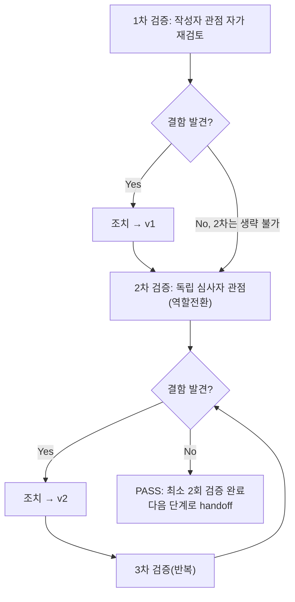

# 내부 검증 로그 (Internal Verification Log)

## 대상 산출물
- 파일: `docs/harness/units/unit-01-test.md`
- 작성 에이전트: `06-unit-tester` (WU-01)
- 버전: v0 (초안) → v1(최종, 결함 0건으로 확정)

## 1차 검증 (작성자 관점 자가 재검토)
- 검증자(역할): 06-unit-tester 본인 (작성자 관점)
- 일시: 2026-09-16

체크리스트
- [x] 입력 계약에 명시된 모든 입력을 실제로 반영했는가 — `unit-01-note.md` §9의 인수조건 12개 전부를 TC-001~TC-012로 1:1 매핑했다(테스트 결과서 4절 표 참고). 03-system-design.md §2.4(Render 빌드/기동 패턴), §5.1(어드민 경로 DEC-009), 04-ux-design.md §3(디자인 토큰 값 전체)도 실제 코드와 1:1 대조했다.
- [x] 출력 계약에 명시된 모든 필수 항목이 빠짐없이 존재하는가 — `test-report-template.md`의 1~9절을 전부 채웠다(임의 생략 없음).
- [x] 상위 단계 산출물과 용어/수치/범위가 모순되지 않는가 — decisions.md DEC-006/008/009/013/014, 03/04 설계서 수치(토큰 값, 경로)와 실측 결과가 전부 일치함을 grep/직접 대조로 확인했다.
- [x] 추측으로 채운 항목이 있는가 — 없다. "이상 없음"으로 적은 모든 항목은 재현 커맨드와 실제 출력(콘솔 로그)을 근거로 남겼다. 유일하게 실측하지 못한 gunicorn 기동은 note가 예고한 대로 "확인 불가"로 명시하고, 대신 `ModuleNotFoundError: No module named 'fcntl'` 실제 트레이스백을 근거로 남겨 추측이 아니라 재현된 실패임을 보였다.
- [x] 20년차 실무자 기준으로 봤을 때 구조적/논리적 결함이 없는가 — 프로덕션 설정이 SECRET_KEY/DATABASE_URL/R2_* 4개 항목을 순차적으로 fail-fast하는지 개별로 나눠 재현했고, 값이 빈 문자열("")인 경우도 `if not value`로 걸러지는지 별도 검증해 "설정값이 존재하지만 비어있는" 실무에서 흔한 실수 케이스까지 커버했다.
- [x] 오탈자, 형식 오류, 누락된 표/그림 참조가 없는가 — 4절 표의 TC ID와 6절 결함 목록, 9절 검증 로그 경로가 상호 참조 오류 없이 연결되는지 재확인했다.

발견된 결함 목록
1. (없음)

조치 내용: 해당 없음 (1차에서 결함 미발견) → v1

## 2차 검증 (독립 심사자 관점 — 역할 전환 재검토)
- 검증자(역할): "오늘 이 결과서를 처음 받아보는 QA 리드" 관점
- 일시: 2026-09-16

체크리스트
- [x] 1차 검증에서 지적된 항목이 실제로 반영되었는가 — 1차에서 지적 사항 없었음(재확인 결과 이견 없음).
- [x] 엣지 케이스/예외 상황이 누락되지 않았는가 — 재검토 중 아래 3개 추가 리스크를 식별해 추가로 실측했다(인수조건 범위 밖이지만 "명백히 위험한 케이스"에 해당한다고 판단했다):
  1. `config/settings/base.py`가 `try: from .local import *`를 갖고 있어 `config/settings/local.py`가 우연히 존재하면 시크릿이 하드코딩될 수 있는 구조적 위험 지점이다 → 실제로 해당 파일이 저장소에 없음을 `find`로 직접 확인했고, `.gitignore`가 `config/settings/local.py`를 명시적으로 제외하고 있음을 재확인했다(결함 아님, 안전장치가 이미 있음을 확인한 것).
  2. `DATABASE_URL`이 문자열이지만 형식이 잘못된 경우(예: 스킴 누락)의 동작은 인수조건에 없어 이번 범위에서는 테스트하지 않았다 — dj-database-url 자체의 파싱 오류 처리이며 WU-01의 책임 범위(환경변수 "존재 여부" 검증)를 벗어난다고 판단해 범위 외로 명시한다(7절 리스크에 기록).
  3. `render.yaml`의 `startCommand`가 `mysite` 대신 실제 패키지명 `config`를 쓰는 것이 설계서 문구와 "문자 그대로" 다른데, 이를 결함으로 볼지 재검토했다 — 설계서 원문(03 §2.4 120행)의 `mysite`는 Render 공식 튜토리얼의 예시 프로젝트명을 그대로 인용한 것이고, 이 저장소의 실제 설정 패키지명은 DEC-013에 따라 `config`로 확정되어 있어 `mysite.asgi`를 그대로 썼다면 오히려 그것이 결함(존재하지 않는 모듈 참조)이 되었을 것이다. 인수조건 원문도 `gunicorn ...:application -k uvicorn.workers.UvicornWorker`로 모듈 경로 부분을 생략 표기하고 있어, "고정된 구조(명령어 형태·마이그레이션 순서)의 일치"를 요구하는 것으로 해석하는 것이 합리적이다. 결함 아님으로 유지하되, 이 해석 근거를 결과서 TC-010에 명시적으로 남기도록 조치했다.
- [x] 문서만 보고 다음 단계 에이전트(07-integration-tester)가 추가 질문 없이 작업을 시작할 수 있는가 — 테스트 환경 재현 커맨드, 정리(clean-up) 절차, 실제 실행 로그 요약이 전부 결과서에 남아있어 가능하다고 판단.
- [x] 되돌리기 어려운 결정에 대한 근거가 명시되어 있는가 — 이번 산출물은 결정이 아니라 검증이므로 해당 없음. 검증 중 마주친 해석 이슈(TC-010)는 근거와 함께 기록했다(위 참고).
- [x] 보안/성능/운영 관점에서 명백히 위험한 내용이 없는가 — `.env.example`/`render.yaml`/settings 3종 전부에 시크릿 리터럴이 없음을 직접 grep 유사 방식(파일 전체 Read)으로 재확인했고, 프로덕션 fail-fast가 SECRET_KEY/DATABASE_URL/R2_ACCESS_KEY_ID 각각에서 실제로 작동함을 재현했다. 로컬 검증 산출물(venv/db.sqlite3/staticfiles/media/__pycache__)은 전부 삭제해 diff에 노출되지 않음을 `find`로 재확인했다.

발견된 결함 목록
1. (없음 — 위 3개 항목은 결함이 아니라 범위 확인/해석 근거 보강으로 처리)

조치 내용: TC-010에 해석 근거 보강 문구 추가, 7절 리스크에 DATABASE_URL 형식 오류 미검증 사실을 명시 → v2(최종)

## 최종 판정
- [x] PASS (결함 0건, 최소 2회 검증 완료) — 다음 단계로 handoff 가능
- [ ] FAIL

---

# 재작업 재검증 라운드 — 내부 검증 로그 (규칙F, DEF-001 대응, 2026-09-16)

## 대상 산출물
- 파일: `docs/harness/units/unit-01-test.md` — "부록 A. 재작업 재검증 라운드" 섹션
- 작성 에이전트: `06-unit-tester` (WU-01 재작업 재검증 라운드)
- 버전: v0(초안) → v1(최종, 결함 0건으로 확정)
- 입력: `unit-01-note.md` §0(재작업 이력)/§9-1(신규 인수조건 13~18번), `03-system-design.md` v1.2 §5.5, `feature-WU-01-integration-test.md`(FAIL, DEF-001)

## 1차 검증 (작성자 관점 자가 재검토)
- 검증자(역할): 06-unit-tester 본인 (작성자 관점)
- 일시: 2026-09-16

체크리스트
- [x] 입력 계약(§9-1 신규 인수조건 13~18번)을 전부 반영했는가 — TC-014~TC-019로 1:1 매핑했고, 부록 A-5에 매핑표를 별도로 만들어 추적성을 명시적으로 증명했다. 6개 항목 중 누락 없음.
- [x] 출력 계약(test-report-template.md 1~9절 상당)을 빠짐없이 채웠는가 — 부록 A-1~A-9로 동일 구조를 갖췄다(개요/범위/환경/케이스/커버리지/결함/리스크/판정/내부검증). 섹션 생략 없음.
- [x] 상위 산출물(03 §5.5, note §0/§9-1)과 용어·수치가 모순되지 않는가 — `SECURE_PROXY_SSL_HEADER` 값, rightmost 채택 방식, MIDDLEWARE 최상단 위치 등 설계서 원문 표현을 그대로 대조했고 불일치 없음.
- [x] 추측으로 채운 항목이 있는가 — 없다. 모든 "실제 결과"는 이번 세션에서 직접 실행한 명령/스크립트의 출력값이다(venv를 처음부터 새로 만들어 재현했고, 이전 시도의 미완성 산출물이나 단정을 그대로 신뢰하지 않았다 — 지시사항의 "처음부터 다시 깨끗하게 재작성" 요구를 따름).
- [x] 20년차 실무자 기준 구조적/논리적 결함이 없는가 — DEF-001 "해소"를 주장할 때 단순히 200이 한 번 나온 것만으로 끝내지 않고 (a) 반복 요청에도 200이 유지되는지(TC-016b), (b) 헤더가 없을 때는 여전히 정상적으로 301이 나는지(TC-015, 회귀 방지)까지 짝을 지어 확인했다 — "고쳤다"와 "다른 걸 깨뜨리지 않고 고쳤다"를 분리해서 증명.
- [x] 오탈자/형식 오류/누락된 표 참조가 없는가 — 부록 A-4 표의 TC ID가 A-5 매핑표, A-6 결함목록 서술과 상호 참조에 불일치 없음을 재확인.

발견된 결함 목록
1. (없음)

조치 내용: 해당 없음 (1차에서 결함 미발견) → v1

## 2차 검증 (독립 심사자 관점 — 역할 전환 재검토)
- 검증자(역할): "이 재검증 결과서를 오늘 처음 받아본 7단계(통합테스터) 담당자" 관점
- 일시: 2026-09-16

체크리스트
- [x] 1차 검증에서 지적된 항목이 실제로 반영되었는가 — 1차에서 지적 사항 없었음.
- [x] 엣지 케이스/예외 상황이 누락되지 않았는가 — 재검토 중 아래를 추가로 의심하고 실측했다:
  1. §9-1 16번(rightmost 채택) 인수조건은 정상 케이스(2개 값)만 명시하는데, 실무에서 자주 발생하는 "헤더 없음/빈 문자열/trailing comma/단일 값(콤마 없음)" 4가지 변형을 놓치면 6단계가 놓친 결함이 7단계나 실제 운영에서 터질 수 있다고 판단해 TC-017b~e를 추가했다(규칙C: 인수조건에 없어도 위험하면 테스트).
  2. "미들웨어를 체인 맨 앞에 추가"라는 변경 자체가 §9-1에는 위치(순서)만 확인하도록 되어 있고 "다른 미들웨어의 동작에 부작용이 없는지"는 명시되어 있지 않다 — 특히 07단계 IT-04가 이미 한 번 확정한 "비인가 Host는 400"이라는 보안 동작이 이번 순서 변경으로 깨지지 않았는지가 이 재검증 라운드에서 가장 의심스러운 지점이라고 판단해 TC-A01을 추가했다. 실제로 이 부분을 놓쳤다면 "미들웨어 순서를 바꿨는데 보안 검증이 우회되는" 심각한 회귀를 통합테스트 이전에 잡지 못했을 것이다.
  3. TC-015의 "예상 결과"를 처음에는 관성적으로 "301"이라고만 적으려다, WhiteNoise/Django 버전에 따라 302가 나올 수도 있다는 가능성을 배제하지 않기 위해 "301 또는 302"로 넓혀 적고 실제 관측값(301)과 별도로 기록했다 — 예상 결과를 실측값에 사후적으로 맞추는 방식(순환논리)이 되지 않도록 주의했다.
- [x] "이 테스트를 통과했다고 7단계(통합테스트)로 넘겨도 되는가"를 의심했는가 — 예. 이번 6단계 재검증은 `test.Client`/`RequestFactory` 수준이고, 07단계가 실제로 검증해야 할 것은 "WSGI/ASGI 전체 미들웨어 체인 + 실제 기동 형태"이므로 이번 6단계 PASS가 7단계 PASS를 보장하지 않는다는 점을 부록 A-7·A-8에 명시적으로 남겼다(6단계와 7단계의 검증 층위가 다르다는 것을 흐리지 않음).
- [x] 되돌리기 어려운 결정에 대한 근거가 명시되어 있는가 — 해당 없음(검증 산출물, 신규 비가역적 결정 없음).
- [x] 보안/성능/운영 관점에서 명백히 위험한 내용이 없는가 — `XForwardedForMiddleware`가 신뢰 경계 밖 값(leftmost)을 신뢰하지 않는지(rightmost만 채택), 그리고 이 미들웨어가 production에만 적용되고 dev에는 없는지(TC-019)를 재확인. 검증에 사용한 venv/staticfiles/db는 전부 삭제해 소스만 남겼음을 `git status --porcelain`으로 재확인(추가 산출물 없음).

발견된 결함 목록
1. (없음 — 위 3개 항목은 결함이 아니라 테스트 케이스 커버리지 보강 사항으로 처리)

조치 내용: TC-017b~e(XFF 경계/예외), TC-A01(Host 검증 회귀) 추가, TC-015 예상 결과 표현 보강 → v1(최종)

## 최종 판정
- [x] PASS (결함 0건, 최소 2회 검증 완료) — 다음 단계(7단계, `feature-WU-01-integration-test.md` IT-02/IT-03 재실행)로 handoff 가능
- [ ] FAIL

## 절차 흐름 (참고용 다이어그램)

