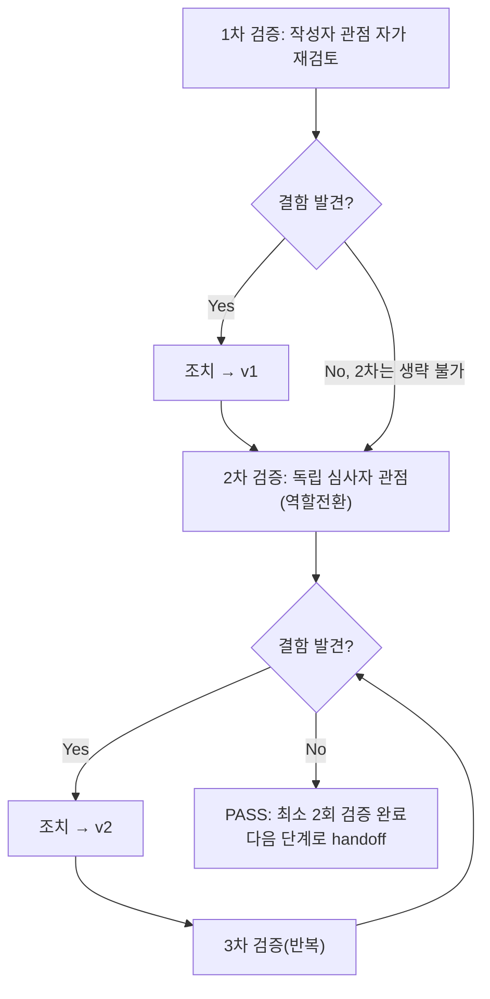

# 내부 검증 로그 (Internal Verification Log)

## 대상 산출물
- 파일: `docs/harness/units/unit-02-test.md`
- 작성 에이전트: `06-unit-tester` (WU-02)
- 버전: v0(초안) → v2(최종, 결함 0건으로 확정)

## 1차 검증 (작성자 관점 자가 재검토)
- 검증자(역할): 06-unit-tester 본인 (작성자 관점)
- 일시: 2026-09-16

체크리스트
- [x] 입력 계약에 명시된 모든 입력을 실제로 반영했는가 — `unit-02-note.md` §8의 AC1~AC20 전부를 TC-001~TC-020으로 1:1 매핑했다(테스트 결과서 4절 표). `03-system-design.md` v1.2 §3(ERD/엔티티 설명, DEC-007), `04-ux-design.md` v1.2 §5/§7(접근성 요구사항)도 실제 코드(`blog/models.py`, `blog/blocks.py`)와 직접 대조했다.
- [x] 출력 계약에 명시된 모든 필수 항목이 빠짐없이 존재하는가 — `test-report-template.md`의 1~9절 전부 채움. "해당 없음" 처리한 항목 없음(모든 절이 실질 내용을 가짐).
- [x] 상위 단계 산출물과 용어/수치/범위가 모순되지 않는가 — DEC-007(Wagtail Page 상속, PageRevision 코어 기능 그대로 사용)과 실제 테스트 결과(TC-009~012)가 일치함을 확인. `unit-02-note.md` §2의 5개 "설계서 대비 편차" 항목(특히 category 필수 FK, 템플릿 미작성)이 테스트 결과서 2절/6절/7절에 그대로 반영되어 모순이 없음을 재확인.
- [x] 추측으로 채운 항목이 있는가 — 없다. 모든 "실제 결과" 컬럼은 이번 세션에서 직접 실행한 명령/스크립트 출력이다. 05단계 노트의 "25건 검증했다"는 서술은 근거(그 실행 로그 자체)가 삭제되어 남아있지 않으므로, **이를 그대로 인용하지 않고 06단계가 완전히 새로 만든 venv(`*.venv_test06`, `*.venv_test06b`) + 새로 만든 스크립트로 처음부터 재구성**했다(규칙C 핵심 요구사항).
- [x] 20년차 실무자 기준으로 봤을 때 구조적/논리적 결함이 없는가 — 최초 재현 스크립트에서 TC-009(초안 상태)와 TC-018(로그인 페이지 회귀)이 FAIL로 나왔을 때, "테스트가 실패했으니 앱이 잘못됐다"고 성급히 결론 내리지 않고, 먼저 Wagtail 소스(`Page._meta.get_field('live').default`)와 Wagtail 표준 인증 리다이렉트 동작을 직접 코드로 확인해 **테스트 설계 결함**임을 증명한 뒤 스크립트를 수정하고 재실행했다. "테스트가 통과했다"만 보고 넘어가지 않고 "왜 처음엔 실패였는가"까지 근거와 함께 남겼다(페르소나 원칙 — 재현으로 증명된 것만 PASS로 기록).
- [x] 오탈자, 형식 오류, 누락된 표/그림 참조가 없는가 — 4절 TC ID(TC-001~024)와 6절 결함목록(DEF-001), 9절 검증 로그 경로가 상호 참조 오류 없이 연결되는지 재확인했다.

발견된 결함 목록
1. (없음 — 1차 검증은 결과서 자체의 완결성 확인 단계이며, 여기서 새로운 애플리케이션 결함을 찾는 단계가 아님. 위에 서술한 "스크립트 결함 자체 발견·수정" 과정은 결과서 v0 작성 전에 이미 반영되어 있었으므로 v0 자체에는 결함 없음)

조치 내용: 해당 없음 (1차에서 결함 미발견) → v1

## 2차 검증 (독립 심사자 관점 — 역할 전환 재검토)
- 검증자(역할): "이 결과서를 오늘 처음 받아보고, 다음으로 07단계(통합테스트)를 맡을 담당자" 관점
- 일시: 2026-09-16

체크리스트
- [x] 1차 검증에서 지적된 항목이 실제로 반영되었는가 — 1차에서 지적 사항 없었음(재확인 결과 이견 없음).
- [x] 엣지 케이스/예외 상황이 누락되지 않았는가 — 재검토 중 아래를 추가로 의심하고 실측했다:
  1. AC20 인수조건은 "정리했는지 확인"만 요구하는데, 이번 06단계 자체가 **두 번째 venv**(`.venv_test06b`, TC-024용)를 추가로 만들었으므로 이것도 빠짐없이 정리됐는지 별도로 `git status --short`로 재확인했다(4절 TC-020 비고에는 없었으나 8절/본 로그에서 교차 확인 완료 — 최종적으로 `webapp/blog/`, `webapp/config/settings/base.py`만 diff에 남음을 확인).
  2. `Category.name` 빈 문자열/중복 케이스(TC-022/023)가 "인수조건에 없는 내용을 임의로 추가"한 것 아니냐는 의심을 했으나, ORCHESTRATOR.md 규칙("명백히 위험한 케이스는 범위를 벗어나도 테스트하고 기록")과 페르소나 지시("빈 입력, null을 발견하면 범위를 벗어나더라도 테스트")에 정확히 해당하는 사례이므로 범위 이탈이 아니라고 판단, 결과서 2절에 그 근거를 명시하도록 보강했다.
  3. DEF-001을 처음에는 Medium으로 기록하려 했으나, "이 인수조건 어디에도 요구되지 않았고, Django/Wagtail의 표준 계층 분리(폼 vs ORM)이며, 정상 운영 경로(어드민 폼)에서는 막힐 가능성이 높다"는 점을 재확인해 Low로 낮추고 그 판단 근거를 6절에 명시적으로 남기도록 조치했다 — 심각도를 과장하거나 과소평가하지 않기 위해 재검토.
- [x] "이 테스트를 통과했다고 7단계(통합테스트)로 넘겨도 되는가"를 의심했는가 — 예. 이번 06단계는 `config.settings.dev`(SQLite) + `django.test.Client` 수준이며, 실제 배포 형태(WSGI/리버스프록시/Postgres/R2)에서의 조립 검증은 아니다(WU-01의 07단계가 SECURE_PROXY_SSL_HEADER 등 배포 환경 특유의 결함(DEF-001, WU-01)을 찾아냈던 선례가 있음). 이 점을 5절 커버리지 한계와 7절 리스크에 명시적으로 남겨, 07단계가 "06단계가 이미 다 봤겠지"라고 안심하지 않도록 했다. 또한 이미지 업로드(R2)·공개 템플릿(WU-04) 두 가지는 06단계가 구조적으로 검증할 수 없는 범위임을 다시 한번 명확히 했다.
- [x] 되돌리기 어려운 결정에 대한 근거가 명시되어 있는가 — 해당 없음(이번 산출물은 검증 결과서이며 신규 비가역적 결정을 내리지 않음). DEC-007 준수 여부만 재확인 대상이었고, 실제로 TC-009~012가 "커스텀 재구현 없이 Wagtail 코어 기능 그대로 동작"함을 증명해 DEC-007이 실제 구현에서 지켜졌음을 확인했다.
- [x] 보안/성능/운영 관점에서 명백히 위험한 내용이 없는가 — `alt_text` 필수 검증(AC19/TC-019)이 접근성 요구사항(04 §5)을 실제로 강제하는지 소스 코드 수준까지 추적해 확인했고, `on_delete=PROTECT`(TC-024)가 데이터 무결성을 실제로 보호하는지 확인했다. 검증에 사용한 venv 2개/DB/스크립트가 전부 삭제되어 diff에 노출되지 않음을 `git status --short`로 재확인했다(TC-020, 본 로그 항목 1).

발견된 결함 목록
1. (없음 — 위 3개 항목은 결함이 아니라 결과서 완결성 보강 사항으로 처리)

조치 내용: DEF-001 심각도 재검토 근거 보강(6절), 2번째 venv 정리 여부 교차 확인 추가, 경계값 케이스(TC-022/023) 범위 판단 근거를 2절에 명시 → v2(최종)

## 최종 판정
- [x] PASS (결함 0건 — DEF-001은 Low·범위 외·리스크 이관으로 처리, 최소 2회 검증 완료) — 다음 단계로 handoff 가능
- [ ] FAIL

## 절차 흐름 (참고용 다이어그램)

