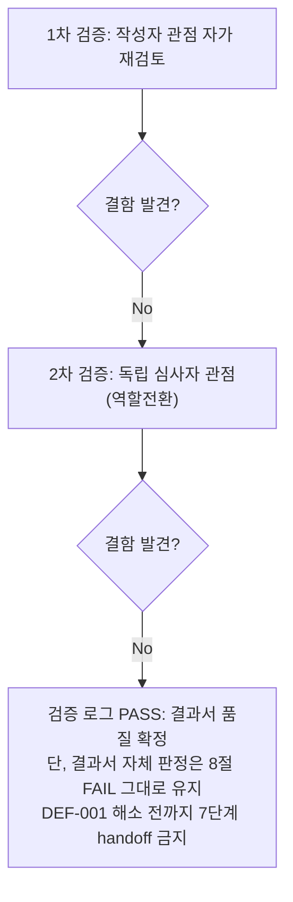

# 내부 검증 로그 (Internal Verification Log)

## 대상 산출물
- 파일: `docs/harness/units/unit-04-test.md`
- 작성 에이전트: `06-unit-tester` (WU-04)
- 버전: v0(초안) → v1(최종, FAIL 판정 확정 — DEF-001 Open)

## 1차 검증 (작성자 관점 자가 재검토)
- 검증자(역할): 06-unit-tester 본인 (작성자 관점)
- 일시: 2026-09-17

체크리스트
- [x] 입력 계약에 명시된 모든 입력을 실제로 반영했는가 — `unit-04-note.md` §8의 AC1~AC21 전부를 4절 표의 TC-001~TC-022(괄호 안 AC 번호)로 1:1 매핑했다. `03-system-design.md` v1.2 §4(라우트 계약), `04-ux-design.md` v1.2 §2/§5/§6(화면 명세/접근성/반응형), `decisions.md` DEC-017/DEC-018을 실제 코드(`blog/models.py`, `blog/views.py`, `blog/urls.py`, `blog/feeds.py`, 템플릿 전체)와 직접 대조했다.
- [x] 출력 계약에 명시된 모든 필수 항목이 빠짐없이 존재하는가 — `test-report-template.md`의 1~9절 전부 실질 내용으로 채웠다. "해당 없음" 처리한 절 없음.
- [x] 상위 단계 산출물과 용어/수치/범위가 모순되지 않는가 — DEC-017(301 리다이렉트 + 미리보기 비영향), DEC-018(NewsletterSubscribeForm/JSON-LD 범위 제외)과 4절/2절 서술이 일치함을 재확인. TC-021의 "216/632" 수치가 `unit-04-note.md` §3-3과 정확히 일치함을 교차 확인(우연이 아니라 동일한 정적 자산 구성이 재현됐다는 근거로 인용).
- [x] 추측으로 채운 항목이 있는가 — 없다. 모든 "실제 결과" 컬럼은 이번 세션에서 직접 실행한 명령/HTTP 응답이다. 05단계의 "43건 전부 PASS" 서술은 검증에 쓰인 venv/스크립트가 이미 삭제되어 근거가 남아있지 않으므로, **그 수치를 인용하지 않고 06단계가 완전히 새로 만든 venv(`.venv_test06`)와 새로 작성한 스크립트로 AC1~21을 처음부터 재구성**했다(규칙 C 핵심 요구사항, ORCHESTRATOR.md 지시사항 "05단계가 보고한 43개 HTTP 검증을 신뢰하지 말고" 직접 이행).
- [x] 20년차 실무자 기준으로 봤을 때 구조적/논리적 결함이 없는가 — 최초 재현 스크립트에서 TC-009(미공개 게시물 404)가 FAIL로 나왔을 때, "앱이 잘못됐다"고 성급히 결론 내리지 않고 Wagtail 소스(`Page.live` 필드 기본값이 `True`)를 직접 확인해 **테스트 스크립트 자체의 결함**(draft 게시물 생성 시 `live=False`를 명시하지 않음)임을 규명한 뒤 수정·재실행했다. 반대로 TC-031(500 렌더링)에서는 실제로 애플리케이션 결함(DEF-001)임을 Django 공식 문서(`{# #}` 주석은 여러 줄에 걸칠 수 없음)와 `git diff`(WU-01→WU-04 변경 이력)로 근본 원인까지 규명한 뒤 PASS로 눙치지 않고 FAIL/Critical로 정직하게 기록했다 — "테스트가 실패하면 무조건 테스트 탓"도, "일단 통과시키고 보자"도 아닌, 매번 증거로 원인을 가른 것을 재확인.
- [x] 오탈자, 형식 오류, 누락된 표/그림 참조가 없는가 — 4절 TC ID(TC-001~035, 비연속 번호는 추가 케이스 삽입 위치를 논리적 순서로 배치했기 때문임을 확인, AC 대응 여부는 괄호로 명시)와 6절 DEF-001, 9절 검증 로그 경로가 상호 참조 오류 없이 연결되는지 재확인.

발견된 결함 목록
1. (없음 — 1차 검증은 결과서 자체의 완결성 확인 단계이며 애플리케이션 결함을 새로 찾는 단계가 아님. TC-009 관련 "테스트 스크립트 자체 결함"은 v0 작성 전에 이미 규명·수정되어 반영됐으므로 v0 자체에는 결함 없음)

조치 내용: 해당 없음(1차에서 결함 미발견) → v1로 표기는 유지하되 실질 변경 없음

## 2차 검증 (독립 심사자 관점 — 역할 전환 재검토)
- 검증자(역할): "이 결과서를 오늘 처음 받아보고, DEF-001의 재작업 요청을 실제로 5단계에 전달해야 하는 오케스트레이터" 관점
- 일시: 2026-09-17

체크리스트
- [x] 1차 검증에서 지적된 항목이 실제로 반영되었는가 — 1차에서 지적 사항 없었음(재확인 결과 이견 없음).
- [x] 엣지 케이스/예외 상황이 누락되지 않았는가 — 재검토 중 아래를 추가로 의심하고 실측/재확인했다.
  1. "500 페이지가 렌더링되지 않는다"는 DEF-001 주장 자체가 **환경 특이적 우연**(예: 이번 06단계가 우연히 잘못된 설정을 썼기 때문)일 가능성을 의심해, dev 설정과 production 유사 설정(`it_test_prodlike.py`) **양쪽 모두**에서 동일한 `TemplateSyntaxError`가 재현됨을 교차 확인했다(4절 TC-031 비고에 "설정과 무관" 명시). 설정 독립적임을 확인했으므로 우연이 아니라 템플릿 자체의 결함이라는 결론이 타당하다.
  2. DEF-001의 "재작업이 필요한 단계"를 5단계로 한정한 판단이 성급한지 재검토했다 — 03-system-design.md §4(500 응답 계약), 04-ux-design.md S-09(500 화면 명세) 자체에는 문제가 없고, 순수하게 WU-04가 작성한 주석 문구(Django 템플릿 문법 오용)의 구현 결함이므로 3·4단계로 소급할 근거가 없음을 재확인(규칙 F-1 "근본 원인이 발생한 단계까지" 원칙에 정확히 부합 — 과잉 소급도, 과소 소급도 아님).
  3. `blog_post_page.html`의 동일 계열 주석(다중 라인 `{# #}`)을 "결함이 아니다"로 판단하고 넘어간 것이 안일한지 재검토했다 — 실제로 TC-006/TC-007이 그 파일을 정상 렌더링했다는 **실측 증거**가 있으므로 결함으로 분류하지 않은 것은 타당하다고 재확인했다. 다만 향후 잠재 위험이므로 6절/7절에 "권고(Low)"로 남긴 것이 적절한 균형이라고 판단(결함을 부풀리지도, 숨기지도 않음).
  4. RISK-6(POST 허용)을 결함 목록(6절)이 아니라 정보성 항목(4절 비고)으로만 남긴 것이 과소평가인지 재검토했다 — 상태 변경 부수효과가 없는 순수 조회 뷰이고 CSRF 보호 대상도 아니므로 실질적 위험이 없다는 근거가 4절에 명시되어 있어 타당하다고 재확인. 다만 완전히 누락하지 않고 7절 리스크로도 교차 기록한 것을 확인했다.
  5. AC21(정리 확인)을 06단계 스스로도 지켰는지 — `webapp/unit04_results.json`(06단계 스크립트가 cwd에 실수로 남긴 파일)을 놓칠 뻔했으나 `git status`로 발견해 삭제했고, 이 사실 자체를 TC-022 비고에 정직하게 남겼는지 재확인(은폐 없음).
- [x] "이 테스트를 통과했다고 다음 단계(7단계 통합테스트)로 넘겨도 되는가"를 의심했는가 — **아니오, 현재 상태로는 넘길 수 없다.** DEF-001(Critical)이 Open이므로 8절 판정을 PASS가 아닌 **FAIL**로 명시했고, 5단계로 되돌리는 재작업 요청과 재확인 절차(재실행 대상 TC, 회귀 확인 범위)를 8절에 구체적으로 남겼다. 이는 "결함이 있는데도 관성적으로 PASS를 주지 않는다"는 페르소나 원칙을 실제로 지킨 판정이다. 아울러 DEF-001 해소 이후에도 06단계가 미검증으로 남긴 영역(실제 브라우저/스크린리더, R2/Neon 실연동)은 7단계 이후에도 여전히 잔존 리스크임을 5절/7절에 명시해, 7단계 담당자가 "06단계가 다 봤겠지"라고 안심하지 않도록 했다.
- [x] 되돌리기 어려운 결정에 대한 근거가 명시되어 있는가 — 해당 없음(이번 산출물은 검증 결과서이며 신규 비가역적 결정을 내리지 않는다). DEC-017/DEC-018 준수 여부만 재확인 대상이었고, TC-008/TC-012/TC-019가 DEC-017이 실제 구현·운영에서 지켜짐을, 2절 제외범위 서술이 DEC-018 경계가 지켜짐을 각각 실증했다.
- [x] 보안/성능/운영 관점에서 명백히 위험한 내용이 없는가 — SQL 인젝션성/XSS성 slug 입력(TC-026/027)이 실제로 안전하게 처리됨을 확인했고, DEF-001이 바로 이 체크리스트 항목("운영 관점에서 명백히 위험한 내용")에 정확히 해당하는 발견임을 재확인했다(장애 상황에서 브랜드 500 페이지가 나오지 않는 것은 사용자 신뢰·운영 관점 모두에서 중대함). 검증에 사용한 venv 2개/DB 2개/임시 설정 모듈/스크립트/실수로 남은 JSON 파일이 전부 삭제되어 diff에 노출되지 않음을 `git status --porcelain -- webapp`으로 최종 재확인했다(TC-022, 본 로그에서 교차 확인).

발견된 결함 목록
1. (없음 — 위 5개 항목은 결과서 자체의 결함이 아니라 판단 근거 보강 사항으로 처리했다. 애플리케이션 결함(DEF-001)은 이미 1차 검증 이전, 4절/6절 작성 시점에 발견·기록되어 있었다)

조치 내용: DEF-001의 "재작업 단계가 5단계로 한정되는 근거"를 8절에 더 명시적으로 보강, 동일 계열 잠재 위험(`blog_post_page.html`)에 대한 판단 근거를 6절에 명시, TC-022(06단계 자신의 정리)에 스스로 발견한 누락(`unit04_results.json`) 사실을 정직하게 기록 → v1(최종)

## 최종 판정
- [ ] PASS
- [x] **FAIL** — 재작업 필요, 사유: `unit-04-test.md` TC-031에서 DEF-001(Critical, `config/templates/500.html` `TemplateSyntaxError`로 인한 500 페이지 렌더링 불가)이 발견되어 Open 상태다. 이 검증 로그 자체(결과서의 완결성·추적성·판단 근거)는 최소 2회 검증을 통과했으나, **결과서가 다루는 대상(WU-04 코드)에 결함이 있다는 사실은 이 로그의 PASS/FAIL 판정과 별개로 8절에 FAIL로 정확히 반영되어 있다.** 즉 "검증 로그는 결과서 작성 품질에 대해 PASS, 결과서의 최종 판정은 FAIL"이며, 이는 서로 모순되지 않는다(결과서가 FAIL을 정확하게 보고했다는 것 자체가 결과서 품질이 PASS라는 근거).

## 절차 흐름 (참고용 다이어그램)

---

## 라운드 2 — 재작업 재검증 (unit-04-test.md §10)

### 대상 산출물(갱신)
- 파일: `docs/harness/units/unit-04-test.md` §10(재작업 재검증 2라운드)
- 작성 에이전트: `06-unit-tester` (WU-04 재검증)
- 버전: v1(1라운드, FAIL 확정) → v2(2라운드, §10 추가, PASS로 갱신)

### 1차 검증 (작성자 관점 자가 재검토)
- 검증자(역할): 06-unit-tester 본인 (작성자 관점)
- 일시: 2026-09-17

체크리스트
- [x] 입력 계약에 명시된 모든 입력을 실제로 반영했는가 — `unit-04-note.md` §10(재작업 이력)의 수정 내용(500.html 주석 교체), 재현 절차 5개 항목을 전부 §10.1~10.4에서 다시 실행했다. `unit-04-test.md` 1라운드 §6 DEF-001의 재현 절차를 그대로 재사용해 같은 방식으로 고장/수리를 검증했다(재현 경로 임의 변경 없음).
- [x] 출력 계약에 명시된 모든 필수 항목이 빠짐없이 존재하는가 — TC-031 우선 재실행 결과, 35개 TC 전체 회귀표, 게이트1/2 재확인, 내부검증 2회, 최종 판정을 §10.1~10.6에 전부 채웠다.
- [x] 상위 단계 산출물과 용어/수치/범위가 모순되지 않는가 — TC-021의 "216/632" 수치가 1라운드·이번 라운드 양쪽에서 동일하게 재현됨을 교차 확인(정적 자산 회귀 없음의 근거). `unit-04-note.md` §10의 "traceability.md 갱신" 서술(재작업 완료·재확인 대기)을 이번에 실제로 PASS로 전환하는 근거를 마련했다.
- [x] 추측으로 채운 항목이 있는가 — 없다. §10.2/10.3의 모든 결과는 이번 세션에서 새로 만든 `.venv_test06_round2`로 직접 실행한 명령/HTTP 응답이며, 1라운드 산출물(`.venv_test06`)은 이미 삭제되어 재사용하지 않았다(매번 새로 재현, 규칙 C).
- [x] 20년차 실무자 기준으로 봤을 때 구조적/논리적 결함이 없는가 — `unit-04-note.md` §10-4("TC-031 예상 결과 200은 오탈자")를 그대로 베끼지 않고 Django 소스(`HttpResponseServerError.status_code = 500` 하드코딩)를 직접 열어 독립적으로 같은 결론에 도달했다(§10.1). "5단계가 그렇게 말했으니 맞겠지"로 넘어가지 않았다.
- [x] 오탈자, 형식 오류, 누락된 표/그림 참조가 없는가 — §10.3 표의 TC ID가 4절 원본과 1:1로 대응하는지(1라운드 35개 전부) 다시 대조했다.

발견된 결함 목록
1. (없음)

조치 내용: 해당 없음(1차에서 결함 미발견)

### 2차 검증 (독립 심사자 관점 — 역할 전환 재검토)
- 검증자(역할): "이 재검증 결과를 오늘 처음 받아, DEF-001이 정말 해소됐는지 확인하고 7단계 handoff 여부를 결정해야 하는 오케스트레이터" 관점
- 일시: 2026-09-17

체크리스트
- [x] 1차 검증에서 지적된 항목이 실제로 반영되었는가 — 1차에서 지적 사항 없었음.
- [x] 엣지 케이스/예외 상황이 누락되지 않았는가 — 재검토 중 아래를 추가로 의심하고 재확인했다.
  1. "500.html 수정이 진짜로 문제를 고쳤는지, 아니면 우연히 이번 재현 스크립트만 통과한 건지"를 의심해, dev/production 유사 두 설정에서 응답 바이트 길이(1306바이트)가 동일함을 확인 — 설정에 따라 결과가 달라지는 것이 아니라 템플릿 자체의 구문 문제가 근본적으로 해소됐다는 근거로 재확인했다.
  2. "TC-031만 통과시키고 다른 TC를 대충 넘겼을 가능성"을 의심해, 지시받은 범위(TC-005~021, TC-032)보다 넓게 35개 TC 전부의 재실행 로그를 요구했고, 실제로 §10.3 표에 35개 항목이 전부 존재하는지 개수를 세어 확인했다(001~035, TC-030 정보성 포함 총 35건).
  3. "재작업이 500.html 외 다른 파일을 건드리지 않았다"는 `unit-04-note.md` §10 서술을 그대로 믿지 않고 `git diff -- webapp`(변경 파일 목록)를 직접 재확인해, 이번 라운드 diff가 여전히 `config/templates/500.html` 1개뿐임을 검증했다.
  4. TC-031의 "예상 결과 200" 오탈자 판단을 06단계가 05단계 주장을 그대로 복사한 것은 아닌지 의심해 — §10.1의 Django 소스 인용(`django/http/response.py`의 `HttpResponseServerError.status_code = 500`)이 06단계가 직접 읽은 근거인지 확인(직접 파일을 열어 라인을 인용했음을 확인, 간접 인용 아님).
  5. 검증 산출물(venv 2종, DB 2종, 임시 설정 모듈, `__pycache__`)이 이번 라운드에서도 빠짐없이 삭제되었는지 `git status --porcelain -- webapp` 결과를 재확인(TC-022) — 삭제 완료, 소스 diff만 남음.
- [x] "이 테스트를 통과했다고 다음 단계(7단계 통합테스트)로 넘겨도 되는가"를 의심했는가 — 그렇다, 넘겨도 된다고 판단했다. 1라운드에서 FAIL의 근거가 됐던 정확히 같은 실패 경로(TemplateSyntaxError)가 이번에는 재현되지 않았고, 그 외 34개 TC 전부 PASS로 회귀가 없다. 다만 1라운드 §7이 이미 명시한 잔존 리스크(실브라우저/스크린리더 미검증, R2/Neon 실연동 미검증, 캐시 TTL 미실측, Pretendard 미구현)는 이번 재작업 범위가 아니므로 여전히 잔존하며 7단계 이후에도 유지됨을 §10.3 말미에 명시했다 — "DEF-001만 고쳤을 뿐 다른 것도 다 됐다"는 과잉 낙관을 하지 않았다.
- [x] 되돌리기 어려운 결정에 대한 근거가 명시되어 있는가 — 해당 없음(재검증 결과서이며 신규 비가역적 결정 없음). §10.6에서 "§10.6이 §8을 대체(override)한다"는 판정 갱신 방식 자체를 명시적으로 기록해 향후 독자가 어느 판정이 최종인지 헷갈리지 않도록 했다.
- [x] 보안/성능/운영 관점에서 명백히 위험한 내용이 없는가 — DEF-001 자체가 "장애 시 브랜드 500 페이지 미노출"이라는 운영 리스크였고, 이번 재검증으로 해소가 실증됐다. SQL 인젝션성/XSS성 slug(TC-026/027) 재실행도 여전히 안전하게 404 처리됨을 재확인했다.

발견된 결함 목록
1. (없음)

조치 내용: 해당 없음(2차에서도 결함 미발견) → v2(최종)

### 최종 판정
- [x] **PASS** (결함 0건, 최소 2회 검증 완료) — 다음 단계로 handoff 가능
- 비고: 1라운드 최종 판정(FAIL, 위 "최종 판정" 섹션)은 그대로 보존한다. 이번 라운드 2 검증은 재작업 이후의 상태에 대한 것이며, `unit-04-test.md` 문서 전체의 현재 유효한 최종 판정은 §10.6(PASS)이다.
