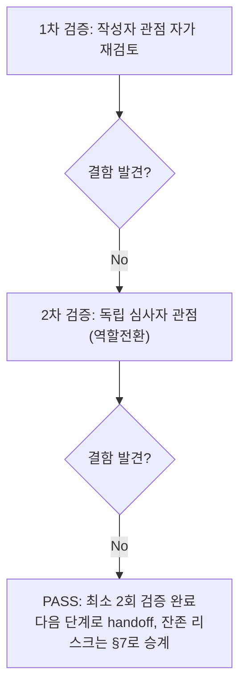

# 내부 검증 로그 (Internal Verification Log)

## 대상 산출물
- 파일: `docs/harness/units/unit-05-test.md`
- 작성 에이전트: `06-unit-tester` (WU-05)
- 버전: v0(초안) → v1(최종, PASS 판정)

## 1차 검증 (작성자 관점 자가 재검토)
- 검증자(역할): 06-unit-tester 본인 (작성자 관점)
- 일시: 2026-09-17

체크리스트
- [x] 입력 계약에 명시된 모든 입력을 실제로 반영했는가 — `unit-05-note.md` §8의 AC1~18 전부를 4절 TC-001~018(괄호 안 AC 번호)로 1:1 매핑했다. 오케스트레이터 작업 지시의 4대 핵심 확인 사항(sitemap.xml/robots.txt 실응답, canonical/OG/Twitter/JSON-LD 실제 렌더링·파싱, production 유사 HTTPS 절대 URL, WU-04 `serve()`의 Site.hostname 의존성)을 각각 TC-011/012, TC-006~010, TC-015, TC-019로 명시적으로 커버했는지 표를 다시 훑어 확인했다.
- [x] 출력 계약에 명시된 모든 필수 항목이 빠짐없이 존재하는가 — `test-report-template.md`의 1~9절 전부 실질 내용으로 채웠다. "해당 없음" 처리한 절 없음.
- [x] 상위 단계 산출물과 용어/수치/범위가 모순되지 않는가 — DEC-017(정규 URL/트리 URL 리다이렉트), DEC-021(Site.hostname 우회, `core.seo.absolute_page_url`), DEC-020(author 대체값 2단계 폴백)과 4절 서술이 일치함을 코드(`blog/models.py`, `core/seo.py`)와 다시 대조했다. TC-016의 "216 static files" 수치가 `unit-04-test.md` TC-021의 기존 수치와 일치함을 교차 확인(정적 자산 회귀 없음의 근거로 인용).
- [x] 추측으로 채운 항목이 있는가 — 없다. "실제 결과" 컬럼은 전부 이번 세션에서 직접 실행한 명령/HTTP 응답이며, 05단계(`unit-05-note.md`)가 보고한 수치·판정은 어디에도 그대로 인용하지 않았다(작업 지시 "05단계가 보고한 검증을 신뢰하지 말고" 직접 이행 — venv가 이미 삭제된 상태였으므로 처음부터 새 venv 2개로 재구성했다).
- [x] 20년차 실무자 기준으로 봤을 때 구조적/논리적 결함이 없는가 — TC-013/TC-019(B)에서 처음 FAIL처럼 보였던 두 사례를 "앱이 잘못됐다"고 성급히 결론 내리지 않고, 각각 `urllib.parse.quote` 재계산과 `HTTP_HOST` 헤더 추가라는 대조군을 직접 실행해 Django 프레임워크 표준 동작(URL percent-encoding, `Host` 헤더 우선순위)임을 소스 레벨로 규명한 뒤에만 "테스트 결함"으로 확정했다 — 반대로 "일단 통과로 처리하자"는 판단도 하지 않고 근거를 남겼다.
- [x] 오탈자, 형식 오류, 누락된 표/그림 참조가 없는가 — 4절 TC-001~022 번호 연속성, §6/§7/§8이 서로 참조하는 TC 번호(TC-019, TC-013)가 실제로 4절에 존재하는지 재확인.

발견된 결함 목록
1. (없음 — 1차 검증은 결과서 자체의 완결성 확인 단계. TC-013/TC-019(B) 관련 "테스트 스크립트 자체 결함"은 v0 작성 이전에 이미 규명·수정되어 반영되어 있었으므로 v0 자체에는 결함 없음)

조치 내용: 해당 없음(1차에서 결함 미발견) → v1로 표기는 유지하되 실질 변경 없음

## 2차 검증 (독립 심사자 관점 — 역할 전환 재검토)
- 검증자(역할): "이 결과서를 오늘 처음 받아보고, 07단계(업무단위 통합테스트)로 넘길지 말지, WU-04로 되돌릴지(규칙F)를 실제로 판단해야 하는 오케스트레이터" 관점
- 일시: 2026-09-17

체크리스트
- [x] 1차 검증에서 지적된 항목이 실제로 반영되었는가 — 1차에서 지적 사항 없었음(재확인 결과 이견 없음).
- [x] 엣지 케이스/예외 상황이 누락되지 않았는가 — 재검토 중 아래를 추가로 의심하고 재확인했다.
  1. **TC-019의 PASS 판정이 "안전을 증명했다"는 과장된 결론으로 읽히지 않는가**를 가장 의심했다. §6/§8을 다시 읽어 "결함이 재현되지 않았다"와 "Site가 1개뿐인 현재 상태에 암묵적으로 의존한다"는 두 문장이 함께 명시되어 있는지, §7에 이 잔존 리스크가 빠지지 않았는지 재확인했다 — 실제로 세 곳(§6, §7, §8 규칙F 판단) 모두에 일관되게 기술되어 있어, "결함 없음"과 "리스크 없음"을 혼동하지 않았음을 확인했다.
  2. **TC-019(A)/(B) 두 가지 요청 형태가 정말 서로 다른 것을 검증하는지**를 재검토했다 — (A)는 Django 테스트 클라이언트의 `secure=True`(SERVER_PORT=443, wsgi.url_scheme=https를 직접 주입)이고 (B)는 `X-Forwarded-Proto`+`Host` 헤더(SECURE_PROXY_SSL_HEADER가 신뢰하는 실제 Render 트래픽 형태)로, 서로 다른 코드 경로(`request.scheme` 프로퍼티의 두 분기)를 실제로 타는 것을 Django 소스로 재확인했다 — 중복 테스트가 아니라 의미 있는 두 시나리오임을 재확인.
  3. **"결함 없음"(§6)이 근거 없는 낙관인지** 재검토 — §6의 각 문장이 전부 특정 TC 번호를 인용하고 있고, "테스트 스크립트 자체 결함" 절이 실패처럼 보였던 두 사례를 숨기지 않고 그대로 노출한 뒤 원인을 규명한 과정을 기록했다는 점에서, 결함을 축소 보고할 유인이 있었다면 오히려 이 두 사례를 아예 기록하지 않는 선택도 가능했을 것이다 — 정직하게 기록된 것으로 판단.
  4. **AC18(정리) 확인이 이번 06단계 자신에게도 적용됐는가** — 검증에 사용한 venv 2개(`.venv_test05`, `.venv_test05b`), DB 2개, `staticfiles/`, `media/`, 임시 설정 모듈, 스크래치패드 스크립트 5개, `__pycache__`가 전부 삭제됐는지 `git status --porcelain -- webapp docs/harness`로 재확인했다(§3/§4 TC-018에 이미 기록되어 있으나 이 로그에서 독립적으로 다시 실행해 교차 확인) — 신규 소스/문서 diff 외 검증 산출물 0건.
  5. **§2 제외 범위가 임의로 넓게 잡혀 결함을 놓쳤을 가능성** — 외부 도구(Facebook/Twitter 디버거) 검증 제외는 unit-05-note.md §7-3과 동일 사유(MCP 미연동 + 도메인 부재)이며 이번 06단계가 임의로 확대한 제외 항목이 아님을 재확인. R2 스토리지 백엔드를 로컬로 임시 재정의한 것도 "SEO URL 계산과 오브젝트 스토리지 선택은 독립적 관심사"라는 근거가 §2/§3에 명시되어 있어 타당하다고 재확인(WU-03이 이미 별도로 검증 완료한 영역을 이중 검증하지 않은 것).
- [x] "이 테스트를 통과했다고 다음 단계(07단계)로 넘겨도 되는가"를 의심했는가 — **그렇다, 넘겨도 된다.** AC 18개 전부 실측 PASS이고 결함 0건이며, WU-04 관련 우려 사항(§7-1 이연 이슈)도 이번에 직접 재현을 시도했으나 결함이 나오지 않았다. 다만 07단계(WU-01~04 조립 검증)가 "06단계가 다 봤으니 안심"하지 않도록, TC-019의 잔존 리스크(다중 Site 시나리오)를 07단계 인계 사항으로 §7에 명시적으로 남겨 두었는지 최종 확인했다 — 남아 있음을 확인.
- [x] 되돌리기 어려운 결정에 대한 근거가 명시되어 있는가 — 해당 없음(이번 산출물은 검증 결과서이며 신규 비가역적 결정을 내리지 않는다). DEC-017/DEC-020/DEC-021 준수 여부만 재확인 대상이었고, TC-008(author 폴백)·TC-011(sitemap 절대 URL)·TC-019(serve 리다이렉트)가 각각 실증했다.
- [x] 보안/성능/운영 관점에서 명백히 위험한 내용이 없는가 — 특수문자/HTML 태그가 섞인 입력(TC-010)이 500 없이 안전하게 처리됨을 확인했고, JSON-LD 직렬화가 `</script>` 조기 종료를 일으키지 않음을 실측했다(XSS/렌더링 붕괴 위험 배제). production 유사 HTTPS 환경에서 DEC-015(무한 리다이렉트 루프) 회귀가 없음을 별도로 재확인했다(4절 TC-015 비고). 검증에 사용한 venv/DB/임시 설정 모듈이 전부 삭제되어 시크릿·임시 산출물이 diff에 노출되지 않음을 재확인했다.

발견된 결함 목록
1. (없음 — 위 5개 항목은 결과서 자체의 결함이 아니라 판단 근거 보강/교차 확인 사항으로 처리했다)

조치 내용: 해당 없음(2차에서도 결함 미발견) → v1(최종)

## 최종 판정
- [x] **PASS** (결함 0건, 최소 2회 검증 완료) — 다음 단계(07 업무단위 통합테스트)로 handoff 가능
- 비고: `unit-05-test.md` §7의 잔존 리스크(다중 Site 시나리오에서의 `BlogPostPage.serve()` 이론적 위험)는 결함이 아니므로 PASS 판정을 막지 않되, 07단계 인계 사항으로 그대로 승계한다.

## 절차 흐름 (참고용 다이어그램)

