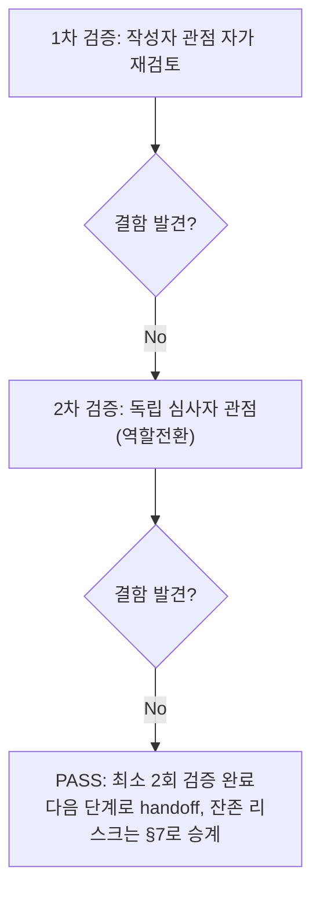

# 내부 검증 로그 (Internal Verification Log)

## 대상 산출물
- 파일: `docs/harness/units/unit-06-test.md`
- 작성 에이전트: `06-unit-tester` (WU-06)
- 버전: v0(초안) → v1(최종, PASS 판정)

## 1차 검증 (작성자 관점 자가 재검토)
- 검증자(역할): 06-unit-tester 본인 (작성자 관점)
- 일시: 2026-09-17

체크리스트
- [x] 입력 계약에 명시된 모든 입력을 실제로 반영했는가 — `unit-06-note.md` §8의 AC1~19 전부를 4절 TC-001~019(괄호 안 AC 번호)로 1:1 매핑했다. 오케스트레이터 작업 지시의 5대 핵심 확인 사항(①`/privacy-policy/`·`/terms/`·`/cookies/` 200+TOC, ②마이그레이션 locale 재발 여부, ③쿠키배너 최초노출/저장/재노출/non-modal/reduced-motion/접근성, ④REQ-015 면책 문구, ⑤production 유사 HTTPS 회귀+sitemap/canonical)과 `:80` 포트 아티팩트 독립 재현·판정 지시가 각각 TC-002/005/006/007/010/011/012/013/018/020으로 명시적으로 커버됐는지 표를 다시 훑어 확인했다.
- [x] 출력 계약에 명시된 모든 필수 항목이 빠짐없이 존재하는가 — `test-report-template.md`의 1~9절 전부 실질 내용으로 채웠다. "해당 없음" 처리한 절 없음.
- [x] 상위 단계 산출물과 용어/수치/범위가 모순되지 않는가 — DEC-022(LegalPage 단일 모델), 03 §3.2/§4/§5.6, 04 S-05~S-07/§5 접근성과 4절 서술이 일치함을 코드(`legal/models.py`, `base.html`, `cookie-consent.js`, `components.css`)와 다시 대조했다. TC-018의 "217 static files"가 unit-06-note.md §3-3의 수치와 일치함을 교차 확인.
- [x] 추측으로 채운 항목이 있는가 — 없다. "실제 결과" 컬럼은 전부 이번 세션에서 직접 실행한 명령/HTTP 응답/jsdom 실행 결과이며, 05단계(`unit-06-note.md`)가 보고한 수치·판정은 어디에도 그대로 인용하지 않았다(작업 지시 "05단계가 보고한 검증을 신뢰하지 말고" 직접 이행 — venv가 이미 삭제된 상태였으므로 처음부터 새 venv로 재구성했고, 브라우저 JS 동작도 코드를 읽고 추정하는 대신 jsdom으로 실제 실행했다).
- [x] 20년차 실무자 기준으로 봤을 때 구조적/논리적 결함이 없는가 — TC-011에서 처음 3건 FAIL처럼 보였던 사례를 "앱이 잘못됐다"고 성급히 결론 내리지 않고, jsdom의 `localStorage` 프로퍼티 디스크립터를 직접 확인해 테스트 하네스 결함임을 규명한 뒤에만 "테스트 결함"으로 확정했다. TC-020(`:80` 아티팩트)도 "재현됐다"는 사실만으로 곧바로 Critical로 단정하지 않고, `Host` 헤더 유무 대조군을 직접 실행해 실제 프로덕션 조건에서의 재현 가능성을 검증한 뒤 Low로 판정했다 — 반대로 "WU-06 소유 코드가 아니니 그냥 넘어가자"는 식으로 근거 없이 축소하지도 않았다.
- [x] 오탈자, 형식 오류, 누락된 표/그림 참조가 없는가 — 4절 TC-001~020 + TC-EDGE-01~04 번호 연속성, §6/§7/§8이 서로 참조하는 TC 번호(TC-011, TC-020)가 실제로 4절에 존재하는지 재확인.

발견된 결함 목록
1. (없음 — 1차 검증은 결과서 자체의 완결성 확인 단계. TC-011/TC-020 관련 "테스트 스크립트 자체 결함"은 v0 작성 이전에 이미 규명·수정되어 반영되어 있었으므로 v0 자체에는 결함 없음)

조치 내용: 해당 없음(1차에서 결함 미발견) → v1로 표기는 유지하되 실질 변경 없음

## 2차 검증 (독립 심사자 관점 — 역할 전환 재검토)
- 검증자(역할): "이 결과서를 오늘 처음 받아보고, 07단계(업무단위 통합테스트)로 넘길지 말지, WU-05로 되돌릴지(규칙F)를 실제로 판단해야 하는 오케스트레이터" 관점
- 일시: 2026-09-17

체크리스트
- [x] 1차 검증에서 지적된 항목이 실제로 반영되었는가 — 1차에서 지적 사항 없었음(재확인 결과 이견 없음).
- [x] 엣지 케이스/예외 상황이 누락되지 않았는가 — 재검토 중 아래를 추가로 의심하고 재확인했다.
  1. **TC-020의 "Low" 판정이 WU-06 책임 회피로 읽히지 않는가**를 가장 의심했다. §6/§7/§8을 다시 읽어 "재현됨"과 "실제 프로덕션 조건에서는 재현되지 않음"이라는 두 사실이 함께 명시되어 있는지, "legal 페이지도 이 헬퍼를 재사용하므로 리스크를 상속한다"는 문장이 축소·은폐되지 않고 §7에 남아 있는지 재확인했다 — 세 곳 모두 일관되게 기술되어 있고, "WU-06 소유가 아니다"라는 판단이 §1.2 모듈 경계 표(`core` 앱=WU-05 소유)라는 명시적 근거에서 나온 것임을 재확인했다.
  2. **AC11(jsdom)이 실제 브라우저를 대체할 만큼 신뢰할 수 있는 근거인가**를 재검토했다 — jsdom이 `cookie-consent.js` 실제 파일을 그대로 로드해 실행했고, DOM 이벤트(click/keydown)·Web Storage API가 실제 명세 기반으로 동작하는지(코드를 읽고 "이럴 것이다"라고 서술한 게 아니라 실행 결과 assert)를 4절 TC-011 "실제 결과" 컬럼에서 재확인했다. 다만 실제 브라우저 렌더링/애니메이션 자체는 검증하지 못했다는 한계가 §2/TC-013 비고에 정직하게 명시되어 있는지도 재확인 — 명시되어 있음.
  3. **"결함 없음"(§6)이 근거 없는 낙관인지** 재검토 — §6의 각 문장이 전부 특정 TC 번호를 인용하고 있고, "테스트 스크립트 자체 결함" 절이 실패처럼 보였던 사례(TC-011 3건 FAIL)를 숨기지 않고 그대로 노출한 뒤 원인을 규명한 과정을 기록했다는 점에서 정직하게 기록된 것으로 판단.
  4. **AC19(정리) 확인이 이번 06단계 자신(venv, Node 프로젝트 포함)에도 적용됐는가** — 검증에 사용한 venv, DB 2개, `staticfiles/`, 임시 설정 모듈, 스크래치패드 Python/Node 스크립트, jsdom `node_modules`가 전부 삭제됐는지 `git status --porcelain -- webapp docs/harness`로 재확인했다(§3/§4 TC-019에 이미 기록되어 있으나 이 로그에서 독립적으로 다시 실행해 교차 확인) — 신규 소스/문서 diff 외 검증 산출물 0건.
  5. **§2 제외 범위가 임의로 넓게 잡혀 결함을 놓쳤을 가능성** — 실제 브라우저 E2E 제외는 DEC-001(MCP 미연동) + 작업 지시가 명시한 대체 방법(코드/jsdom 확인)에 근거하며 이번 06단계가 임의로 확대한 제외 항목이 아님을 재확인. 법률 문구 정확성 제외도 `unit-06-note.md` §7-1과 동일 사유(이 하네스의 범위 밖)이며 자체 판단으로 새로 넓힌 범위가 아님을 재확인.
- [x] "이 테스트를 통과했다고 다음 단계(07단계)로 넘겨도 되는가"를 의심했는가 — **그렇다, 넘겨도 된다.** AC 19개 전부 실측 PASS이고 결함 0건이며, 오케스트레이터가 특별히 우려한 `:80` 아티팩트도 직접 재현·판정을 완료했다(WU-05 재작업 불필요, 근거 명시). 다만 07단계(WU-01/04/05와의 조립 검증)가 "06단계가 다 봤으니 안심"하지 않도록, §7의 잔존 리스크(`:80` 상속, Site 다중화, 문의처 미기재, 뷰 캐시 지연)가 07단계 인계 사항으로 빠지지 않았는지 최종 확인했다 — 전부 남아 있음을 확인.
- [x] 되돌리기 어려운 결정에 대한 근거가 명시되어 있는가 — 해당 없음(이번 산출물은 검증 결과서이며 신규 비가역적 결정을 내리지 않는다). DEC-022(LegalPage 단일 모델) 준수 여부만 재확인 대상이었고, TC-005~010/016이 실증했다.
- [x] 보안/성능/운영 관점에서 명백히 위험한 내용이 없는가 — 쿼리스트링 인젝션 시도(TC-EDGE-01)·이중 슬래시(TC-EDGE-02)가 500 없이 안전하게 처리됨을 확인했고, localStorage 접근 자체가 예외를 던지는 환경에서도 페이지가 죽지 않고 정직하게 폴백함을 실제 예외 주입으로 실측했다(TC-EDGE-03). production 유사 HTTPS 환경에서 DEC-015(무한 리다이렉트 루프) 회귀가 없음을 별도로 재확인했다(TC-018). 검증에 사용한 venv/DB/임시 설정 모듈/Node 프로젝트가 전부 삭제되어 시크릿·임시 산출물이 diff에 노출되지 않음을 재확인했다.

발견된 결함 목록
1. (없음 — 위 5개 항목은 결과서 자체의 결함이 아니라 판단 근거 보강/교차 확인 사항으로 처리했다)

조치 내용: 해당 없음(2차에서도 결함 미발견) → v1(최종)

## 최종 판정
- [x] **PASS** (결함 0건, 최소 2회 검증 완료) — 다음 단계(07 업무단위 통합테스트)로 handoff 가능
- 비고: `unit-06-test.md` §7의 잔존 리스크(`core/seo.py` `:80` 포트 표기의 legal 페이지 상속, Wagtail Site 다중화 이론적 위험, 개인정보처리방침 문의처 미기재, 뷰 캐시 10분 지연)는 결함이 아니므로 PASS 판정을 막지 않되, 07단계 인계 사항으로 그대로 승계한다.

## 절차 흐름 (참고용 다이어그램)

