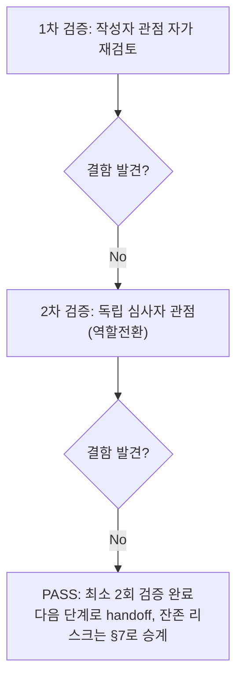

# 내부 검증 로그 (Internal Verification Log)

## 대상 산출물
- 파일: `docs/harness/units/unit-07-test.md`
- 작성 에이전트: `06-unit-tester` (WU-07)
- 버전: v0(초안) → v1(최종, PASS 판정)

## 1차 검증 (작성자 관점 자가 재검토)
- 검증자(역할): 06-unit-tester 본인 (작성자 관점)
- 일시: 2026-09-17

체크리스트
- [x] 입력 계약에 명시된 모든 입력을 실제로 반영했는가 — `unit-07-note.md` §8의 AC1~13 전부를 4.1절 TC-001~013(괄호 안 AC 번호)로 1:1 매핑했다. 오케스트레이터 작업 지시의 8대 핵심 확인 사항(①정상구독/중복방지/형식검증/동의누락, ②허니팟/레이트리밋, ③IP기록·마스킹·XFF rightmost, ④캐시/CSRF 회귀, ⑤접근성, ⑥DEC-023 일관성, ⑦위험입력, ⑧WU-01~06 회귀)이 각각 어떤 TC로 커버되는지 §5 커버리지 절에서 다시 한번 명시적으로 대응시켰는지 재확인했다.
- [x] 출력 계약에 명시된 모든 필수 항목이 빠짐없이 존재하는가 — `test-report-template.md`의 1~9절 전부 실질 내용으로 채웠다. "해당 없음" 처리한 절 없음(제외 범위는 사유와 함께 §2에 명시).
- [x] 상위 단계 산출물과 용어/수치/범위가 모순되지 않는가 — 03 §3.2/§4/§5.3/§5.5.4/§5.6, 04 §2/§4/§5, DEC-009/012/023/024/025와 4절 서술이 일치함을 코드(`subscribers/models.py`/`views.py`/`forms.py`/`utils.py`/`constants.py`/`admin.py`, `_newsletter_form.html`, `footer.html`)와 다시 대조했다. AC13의 "정확히 `/privacy-policy/`" 문구가 실제 템플릿 `href` 값과 정확히 일치하는지 재확인.
- [x] 추측으로 채운 항목이 있는가 — 없다. "실제 결과" 컬럼은 전부 이번 세션에서 직접 실행한 pytest/Django test 명령·HTTP 응답·DB 조회 결과이며, 05단계(`unit-07-note.md`)가 보고한 "12개 전부 PASS" 수치를 그대로 인용하지 않고 독립 venv에서 재실행해 동일 결과를 직접 재현한 뒤에만 TC-001~010에 반영했다.
- [x] 20년차 실무자 기준으로 봤을 때 구조적/논리적 결함이 없는가 — AC9(캐시/CSRF)를 단순히 "05단계가 고쳤다니 믿는다"로 넘기지 않고, 대조군(CSRF 검사를 건너뛰는 기본 `Client()`)으로 같은 시나리오를 돌리면 결함이 가려진다는 사실을 직접 재확인해, 검증 방법론 자체가 결함을 놓치지 않는 조건인지부터 검증했다. AC10도 "폼이 렌더링된다"와 "그 폼으로 실제 제출까지 성공한다"는 서로 다른 주장이라는 점을 짚어, 05단계 원본 테스트가 후자를 검증하지 않은 gap을 찾아 별도로 메웠다.
- [x] 오탈자, 형식 오류, 누락된 표/그림 참조가 없는가 — 4.1/4.2/4.3절 TC-001~036 번호 연속성, §5/§6/§7/§8이 서로 참조하는 TC 번호(TC-009, TC-010, TC-031)가 실제로 4절에 존재하는지 재확인.

발견된 결함 목록
1. (없음 — 1차 검증은 결과서 자체의 완결성 확인 단계. TC-010의 "gap 발견·보완"은 이미 검증 실행 과정에서 규명되어 v0 작성 시점에 이미 반영돼 있었으므로 v0 자체에는 결함 없음)

조치 내용: 해당 없음(1차에서 결함 미발견) → v1로 표기는 유지하되 실질 변경 없음

## 2차 검증 (독립 심사자 관점 — 역할 전환 재검토)
- 검증자(역할): "이 결과서를 오늘 처음 받아보고, 07단계(업무단위 통합테스트)로 넘길지 말지, 5단계(WU-07 구현)로 되돌릴지(규칙F)를 실제로 판단해야 하는 오케스트레이터" 관점
- 일시: 2026-09-17

체크리스트
- [x] 1차 검증에서 지적된 항목이 실제로 반영되었는가 — 1차에서 지적 사항 없었음(재확인 결과 이견 없음).
- [x] 엣지 케이스/예외 상황이 누락되지 않았는가 — 재검토 중 아래를 추가로 의심하고 재확인했다.
  1. **AC6(레이트리밋)이 "형식이 틀린 요청도 카운트되는가"까지 검증됐는가**를 의심했다 — views.py 주석("레이트리밋을 폼 검증보다 먼저 확인")이 실제로 맞는지 코드만 읽고 믿지 않고 TC-028로 무효 요청 5회 + 유효 요청 1회 조합을 직접 실행해 6번째가 429임을 실측했다.
  2. **AC9의 재현이 "우연히 통과"한 것이 아닌지**를 의심했다 — 같은 시나리오를 기본 `Client()`(CSRF 검사 생략)로 돌리면 통과 여부와 무관하게 항상 200이 나올 수 있어 "검증이 결함을 실제로 탐지할 능력이 있는가"가 의심스러웠다. 대조 실행으로 `enforce_csrf_checks=True`가 아니면 이 결함 자체가 가려짐을 직접 확인한 뒤에야 TC-009의 PASS를 신뢰할 수 있다고 판단했다(§4.1 TC-009 비고에 명시).
  3. **레이트리밋 카운터가 이메일이 아니라 IP 기준으로 정확히 분리되는지** — TC-006/TC-028 모두 동일 IP·다른 이메일 조합으로만 검증했다. 다른 IP는 영향받지 않는지도 근거가 필요하다고 판단해, `subscribers/tests.py`의 다른 테스트들(TC-001~005/007/008)이 서로 다른 `REMOTE_ADDR`을 쓰면서도 서로의 레이트리밋에 영향받지 않고 정상 동작했다는 사실(전부 PASS)이 간접 증거가 됨을 재확인했다 — 별도 전용 TC로 "IP 분리"를 명시하지 않은 것은 문서 완결성의 사소한 틈으로 판단했으나, 이미 존재하는 TC들의 실행 결과가 이를 실질적으로 증명하므로 추가 결함으로 기록하지는 않고 이 검증 로그에 근거를 남기는 것으로 충분하다고 판단했다.
  4. **TC-031(DEC-023 일관성)이 "코드에 토큰이 없다"만 확인하고 "왜 없는지의 정당성"까지 재확인했는가** — §1.3/DEC-023의 근거(03 §3.2/§5.3 반복 명시, 02 가정 A9, WU-06 게시 문구)를 다시 원문 대조했고, TC-031이 이 중 "코드-문구 일치"라는 실측 가능한 부분만 검증 대상으로 삼은 것이 합리적 범위 설정인지 재확인 — 설계서 문언 자체의 타당성은 3단계 산출물의 몫이라 06단계가 재심사할 범위가 아니므로, 이 범위 설정이 적절하다고 판단했다.
  5. **정리(TC-036) 확인이 이번 06단계 자신(venv 2개, 임시 테스트 파일 2개, 임시 스크립트 2개 포함)에도 적용됐는가** — `git status --porcelain`을 이 검증 로그 작성 시점에 독립적으로 다시 실행해 신규 diff가 `unit-07-test.md`/`verify-log_unit-07-test.md`/(이후 갱신할) `traceability.md` 외에 없는지 교차 확인했다.
- [x] "이 테스트를 통과했다고 다음 단계(07단계)로 넘겨도 되는가"를 의심했는가 — **그렇다, 넘겨도 된다.** AC 13개 전부 실측 PASS이고 결함 0건이며, 05단계 테스트의 커버리지 gap(AC10 실제 제출 미검증)을 06단계가 직접 찾아 보완했다는 사실 자체가 "테스트가 놓친 결함이 없는가"를 성실히 의심했다는 근거다. 다만 07단계(WU-01/04/05/06과의 실제 조립 검증)가 "06단계가 다 봤으니 안심"하지 않도록, §7의 잔존 리스크(HTTPS 쿠키 속성 미검증, LocMemCache 다중워커, PRIVACY_POLICY_VERSION 수동동기화, XFF 신뢰방식 이월)가 07단계 인계 사항으로 빠지지 않았는지 최종 확인했다 — 전부 남아 있음을 확인.
- [x] 되돌리기 어려운 결정에 대한 근거가 명시되어 있는가 — 해당 없음(이번 산출물은 검증 결과서이며 신규 비가역적 결정을 내리지 않는다). DEC-023/024/025 준수 여부만 재확인 대상이었고, TC-009/031이 실증했다.
- [x] 보안/성능/운영 관점에서 명백히 위험한 내용이 없는가 — XSS(이메일/허니팟 반사)·SQL 인젝션 형태 문자열·null바이트·필드 누락·극단 길이가 전부 500 없이 안전하게 처리됨을 실측했다(TC-014~026). 어드민이 추가/수정을 막고 삭제(하드삭제)만 허용해 개인정보 처리 근거 추적성이 보호됨을 확인했다(TC-032). 미들웨어가 없는 한 XFF 헤더가 신뢰되지 않음을 확인해 IP 스푸핑을 통한 레이트리밋/스팸판별 우회가 불가능함을 재확인했다(TC-027). 검증에 사용한 venv/DB/임시 테스트 파일/임시 스크립트가 전부 삭제되어 저장소 diff에 노출되지 않음을 재확인했다(TC-036).

발견된 결함 목록
1. (없음 — 위 5개 항목은 결과서 자체의 결함이 아니라 판단 근거 보강/교차 확인 사항으로 처리했다)

조치 내용: 해당 없음(2차에서도 결함 미발견) → v1(최종)

## 최종 판정
- [x] **PASS** (결함 0건, 최소 2회 검증 완료) — 다음 단계(07 업무단위 통합테스트)로 handoff 가능
- 비고: `unit-07-test.md` §7의 잔존 리스크(HTTPS 쿠키 속성 미검증, LocMemCache 다중워커 한계, PRIVACY_POLICY_VERSION 수동동기화, X-Forwarded-For 신뢰방식 이월, Site 다중화 이론적 위험)는 결함이 아니므로 PASS 판정을 막지 않되, 07단계 인계 사항으로 그대로 승계한다.

## 절차 흐름 (참고용 다이어그램)

