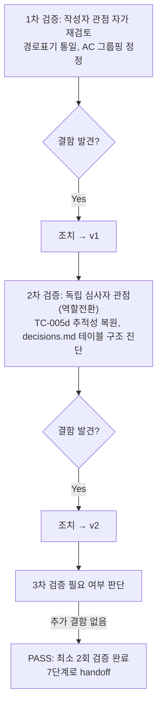

# 내부 검증 로그 (Internal Verification Log) — `unit-10-test.md`

## 대상 산출물
- 파일: `docs/harness/units/unit-10-test.md`
- 작성 에이전트: `06-unit-tester`
- 버전: v0(초안) → v1(1차 검증 반영) → v2(2차 검증 반영, 최종)

## 1차 검증 (작성자 관점 자가 재검토)
- 검증자(역할): `06-unit-tester`(작성자 본인, 자가 재검토)
- 일시: 2026-09-17
- 체크리스트
  - [x] 입력 계약(Input Contract)에 명시된 모든 입력을 실제로 반영했는가 — `unit-10-note.md` §8의 AC1~12 전부, `decisions.md` DEC-032/033, `traceability.md` REQ-013 행을 §1~§9 전반에 반영했음을 재확인.
  - [x] 출력 계약(Output Contract)에 명시된 필수 항목이 빠짐없이 존재하는가 — `test-report-template.md`의 1~9절 전부 채워짐(빈 섹션 없음). "해당 없음" 처리한 섹션 없음(전 섹션에 실질 내용 존재).
  - [x] 상위 단계 산출물과 용어/수치/범위가 모순되지 않는가 — AC 번호(1~12), 시크릿 5종/6종 구분(사전점검 대상 5종 vs GitHub Secrets 전체 6종, `R2_REGION`은 선택값이라 사전점검 대상에서 제외된 note §1.1 서술과 §4.1 TC-005 일치), 14일 Lifecycle, 타임스탬프 정규식 등이 note 원문과 일치함을 재대조.
  - [x] 추측으로 채운 항목이 있는가 — 없음. 모든 "실제 결과" 칸은 이번 세션에서 직접 실행한 명령의 출력을 그대로 기록했다(추측/요약이 아니라 실측값).
  - [x] 20년차 실무자 기준으로 봤을 때 구조적/논리적 결함이 없는가 — 발견: 경로 표기가 백슬래시(`\.github\workflows\...`, `docs\harness\traceability.md`)와 슬래시(`docs/harness/decisions.md`)가 한 문장 안에 혼재해 있었다(§3 전제 조건). 또한 §2 범위 문구가 AC12(재현 가능한 정리 확인)를 AC10/11(검증 불가 확인)과 같은 그룹으로 묶어 서술해, AC의 성격 구분이 부정확했다.
  - [x] 오탈자, 형식 오류, 누락된 표/그림 참조가 없는가 — 위 2건 외 추가 오탈자 없음(표 헤더/구분선/mermaid 블록 정상).
- 발견된 결함 목록:
  1. §3 "전제 조건"의 파일 경로 표기가 백슬래시/슬래시 혼용(Windows 경로 스타일과 저장소 상대경로 스타일이 한 항목 안에서 뒤섞임) — 가독성/일관성 결함(문서 품질, 기능적 결함 아님).
  2. §2 "범위(In-Scope)" 문구가 AC12(정리 상태 재현 — 실제로는 AC1~9와 동일하게 "재현 가능"한 성격)를 AC10/11(로컬에서 원천적으로 검증 불가능한 성격)과 한 괄호로 묶어, AC들의 성격이 실제보다 더 비관적으로 서술됨(§4.1의 실제 판정과 불일치할 위험).
- 조치 내용: (수정 후 → v1)
  1. §3 경로 표기를 전부 forward-slash(`/`)로 통일(저장소 상대경로 표기 관례를 문서 전체에서 일관 적용).
  2. §2 문구를 "AC1~9(재현 가능)와 AC12(재현 가능)" / "AC10~11(검증 불가 확인이 인수조건)"로 재분리해 §4.1의 실제 TC-010/011/012 판정과 정합되도록 수정.

## 2차 검증 (독립 심사자 관점 — 역할 전환 재검토)
> "내가 이 문서를 오늘 처음 받아본 심사자라면?"이라는 관점에서, 1차 검증자가 놓쳤을 법한 리스크·엣지케이스·암묵적 가정을 의심하며 재검토한다.
- 검증자(역할): 07단계(통합테스트) 착수 전 최종 게이트 심사자 역할로 전환(가상의 "이 결과서만 보고 7단계를 시작해야 하는 사람")
- 일시: 2026-09-17
- 체크리스트
  - [x] 1차 검증에서 지적된 항목이 실제로 반영되었는가(재확인) — `grep`으로 재확인한 결과 §3 경로 표기 전부 forward-slash로 통일됨, §2 AC 그룹핑 문구도 수정됨. 반영 확인.
  - [x] 엣지 케이스/예외 상황이 누락되지 않았는가 — **결함 발견**: §6 결함 목록에 DEF-001(공백 전용 시크릿 값)이 등록되어 있으나, §4.1 TC 매트릭스에는 이 시나리오를 실행한 근거 TC 행이 없었다 — "재현 절차"가 §6 한 곳에만 산문으로 적혀 있어, 이 결과서만 보고 재현하려는 다음 단계 담당자가 §4.1을 훑을 때 이 위험 케이스의 존재를 놓칠 수 있는 추적성 단절이었다.
  - [x] 문서만 보고 다음 단계 에이전트가 추가 질문 없이 작업을 시작할 수 있는가 — TC-009의 REQ-010 행 변경 설명이 최초 버전에서는 "WU-09 소관"이라고 서술은 했으나 그 근거(어떤 명령으로 확인했는지)가 명시적이지 않아 재검토, `git status --porcelain`의 untracked 목록과 교차 확인했다는 근거 문장을 보강.
  - [x] 되돌리기 어려운 결정(비가역적 결정)에 대한 근거가 명시되어 있는가 — 이번 6단계는 코드를 수정하지 않았고(DEF-001도 관찰·이관만) 문서만 산출했으므로 비가역적 결정 없음(해당 없음, §3 전제 조건에 "코드를 고치지 않음" 명시로 이미 충족).
  - [x] 보안/성능/운영 관점에서 명백히 위험한 내용이 없는가 — 테스트 결과서/검증 로그 어디에도 실제 시크릿 값·연결 문자열·자격증명을 기록하지 않았음을 재확인(전부 `x`, 더미 값, 플레이스홀더만 사용). `lifecycle.json` 등 재현에 사용한 값도 워크플로가 이미 공개적으로 담고 있는 값과 동일(민감정보 아님).
  - [x] (추가 스캔) `decisions.md`의 DEC-032/033 신규 행이 마크다운 테이블 구조를 깨뜨리지 않았는가 — `git diff --stat`이 "삽입만 3줄, 삭제 0"으로 보고했지만 혹시 파이프(`|`) 개수가 헤더와 달라 렌더링이 깨질 가능성을 별도로 점검. `python`으로 헤더 행과 DEC-030/032/033 행의 파이프 개수를 세어 전부 9개(=8컬럼)로 일치함을 확인 — 결함 없음(진단 완료, §9에 기록).
- 발견된 결함 목록:
  1. §4.1에 DEF-001(공백 전용 시크릿 값)에 대응하는 TC 행이 없어 §6 결함 목록과의 추적성이 끊겨 있었다.
- 조치 내용: (수정 후 → v2, 최종)
  1. §4.1 AC5 클러스터(TC-005a/b/c) 뒤에 `TC-005d`(공백 전용 시크릿 값, Pass/Fail 칸에 `FAIL(결함 발견)`으로 명시, 비고에 DEF-001 상호참조)를 신설해 §6과의 1:1 추적성을 복원.
  2. TC-009의 근거 문장에 `git status --porcelain` 교차확인을 명시적으로 보강.
  3. §9(내부 검증 요약)에 이번 2차 검증에서 실제로 발견/조치한 내용(TC-005d 신설, decisions.md 테이블 구조 진단)을 정확히 반영해 재작성.

## 최종 판정
- [x] PASS (결함 0건 — 문서 자체의 구조/추적성 결함 2건은 1·2차 검증에서 전부 조치 완료, 대상 산출물이 보고하는 WU-10의 기능적 결함은 Low 1건(DEF-001)뿐이며 Critical/High 없음, 최소 2회 검증 완료) — 7단계(통합테스트)로 handoff 가능
- 비고: 이 검증 로그가 다루는 "결함"은 `unit-10-test.md` **문서 자체**의 품질(1차: 경로 표기/AC 그룹핑, 2차: 추적성 단절)이며, WU-10 **산출물**(워크플로/가이드 문서)의 결함은 `unit-10-test.md` §6의 DEF-001(Low, Deferred) 1건으로 이미 별도 보고했다. 두 층위를 혼동하지 않도록 명시한다.

## 절차 흐름 (참고용 다이어그램)

