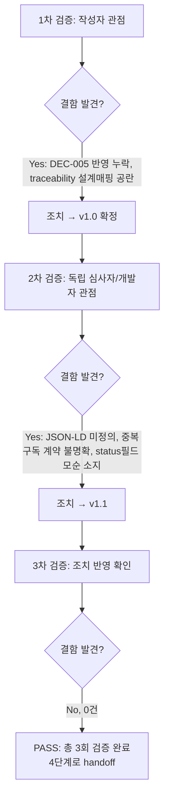

# 내부 검증 로그 (Internal Verification Log)

## 대상 산출물
- 파일: `docs/harness/03-system-design.md`
- 작성 에이전트: `03-system-designer`
- 버전: v1.0(초안) → v1.1(최종, 이 로그의 검증 결과 반영)

## 1차 검증 (작성자 관점 자가 재검토)
- 검증자(역할): 03-system-designer (작성자 본인, 자가 재검토)
- 일시: 2026-09-16
- 체크리스트
  - [x] 입력 계약(Input Contract)에 명시된 모든 입력을 실제로 반영했는가 — `02-planning.md`(v1.2), `01-trend-analysis.md`, `decisions.md`(DEC-001~005) 전량 확인 후 반영
  - [x] 출력 계약(Output Contract)에 명시된 9개 필수 항목이 빠짐없이 존재하는가 — §1 아키텍처, §2 기술스택, §3 데이터모델, §4 API, §5 보안설계, §6 비기능요구사항, §7 운영/관측성, §8 트레이드오프, §10 변경이력 모두 확인
  - [x] 상위 단계 산출물과 용어/수치/범위가 모순되지 않는가
  - [x] 추측으로 채운 항목이 있는가 (있다면 "가정" 섹션에 명시했는가, 혹은 질문으로 전환했는가) — "확인 필요" 항목(§2.1 Wagtail-Django 호환매트릭스, §2.6 라이선스, §6.4 Neon 풀링 연결)을 임의 단정하지 않고 명시적으로 남김
  - [x] 20년차 실무자 기준으로 봤을 때 구조적/논리적 결함이 없는가
  - [x] 오탈자, 형식 오류, 누락된 표/그림 참조가 없는가
- 발견된 결함 목록:
  1. §0(범위 및 전제) 초안 작성 당시 "수익화 모델(02 §11 Q1)이 사용자 답변 대기 중"이라고 서술했으나, 작업 도중 오케스트레이터로부터 `decisions.md`에 DEC-005(수익화="완전 무료", 사용자 응답 완료)가 이미 추가되었다는 통보를 받았다. `decisions.md`를 재조회하지 않고 그대로 두면 이미 해소된 쟁점을 "미해결"로 잘못 서술하는 결함이 된다.
  2. `docs/harness/traceability.md`의 "설계 매핑" 컬럼이 2단계 산출 시점 그대로 공란이었다(3단계 필수 산출물인 REQ-ID별 설계 매핑 누락).
- 조치 내용: (수정 후 → v1.0 확정)
  1. `decisions.md`를 재조회해 DEC-005 내용을 확인한 뒤, §0을 "WU-12/REQ-022~024는 답변 대기가 아니라 DEC-005에 따라 완전 무료로 확정되어 명시적으로 배제된 상태"로 정정. `decisions.md`의 신규 결정 항목 번호를 DEC-006부터 이어서 append(DEC-005와 번호 충돌 없음을 재확인).
  2. `traceability.md`의 전체 REQ-001~027 행에 대해 "설계 매핑(설계서 §)" 컬럼을 이번 설계서의 구체적 섹션 번호로 채움.

## 2차 검증 (독립 심사자 관점 — 역할 전환 재검토)
> "내가 이 문서를 오늘 처음 받아본, 이 설계서만 보고 바로 구현을 시작해야 하는 개발자라면?"이라는 관점에서 재검토했다.
- 검증자(역할): (가상) 03단계 산출물을 처음 받아보는 5단계 개발자 + 외부 심사자
- 일시: 2026-09-16
- 체크리스트
  - [x] 1차 검증에서 지적된 항목이 실제로 반영되었는가 (재확인) — §0, traceability.md 반영 확인
  - [x] 엣지 케이스/예외 상황이 누락되지 않았는가
  - [x] 문서만 보고 다음 단계 에이전트가 추가 질문 없이 작업을 시작할 수 있는가
  - [x] 되돌리기 어려운 결정(비가역적 결정)에 대한 근거가 명시되어 있는가
  - [x] 보안/성능/운영 관점에서 명백히 위험한 내용이 없는가
- 발견된 결함 목록:
  1. **REQ-005("구조화 데이터") 구현 방식 미정의**: §9(REQ 매핑 요약)와 02번 기획서는 "구조화 데이터"를 요구사항으로 명시했지만, 설계서 본문 어디에도 JSON-LD/schema.org 등 구체적 구현 방식이 서술되어 있지 않았다. 5단계 개발자가 "구조화 데이터를 넣으라는데 무엇을 어떻게?"라는 질문을 할 수밖에 없는 상태 — "이 문서만 보고 추가 질문 없이 시작할 수 있는가" 기준에 위배.
  2. **뉴스레터 중복 구독 시 서버 동작 불명확**: §4/§5.3(구 버전)은 "이미 구독된 이메일이든 신규든 동일한 성공 메시지를 반환한다"고만 서술했다. 그러나 (a) 이메일이 `email UK` 유니크 제약을 가진 상태에서 실제로 DB에 어떻게 저장/갱신되는지(사전 조회 후 no-op? 유니크 제약 위반 예외를 잡아서 무시?), (b) `status=unsubscribed`인 경우 재구독을 허용하는지가 정의되지 않아, 개발자가 임의로 해석해 구현할 여지가 있었다(같은 설계로 서로 다른 구현이 나올 수 있는 상태는 "애매한 인터페이스"에 해당).
  3. **`NewsletterSubscriber.status` 필드와 삭제 정책의 모순 가능성**: ERD/데이터모델(§3.1~3.2)에 `status`(active/unsubscribed) 필드를 정의해 놓고, 정작 §5.6(개인정보 파기 절차)에서는 "탈퇴 요청 시 레코드 하드 삭제"라고 서술했다. 이 둘을 나란히 읽으면 "그럼 `status` 필드는 언제 쓰이는가?"라는 모순처럼 보일 수 있어, 왜 두 메커니즘이 공존하는지(자동 경로 없음 vs 수동 경로) 명시적으로 연결되어 있지 않았다.
  4. (경미, 수정 불요로 판단) 출력 계약이 나열한 섹션 순서(비기능요구사항→보안설계)와 실제 문서 순서(보안설계→비기능요구사항)가 다르다. 검토 결과 출력 계약은 "포함해야 할 9개 항목의 목록"이지 "고정된 장 순서"를 요구하지 않으며, 모든 항목이 명확한 제목과 상호 참조로 존재해 탐색에 지장이 없다고 판단해 **결함으로 채택하지 않음**(사유를 이 로그에 남겨, 나중에 "빠뜨린 것"이 아니라 "검토 후 의도적으로 유지한 것"임을 구분할 수 있게 함).
- 조치 내용: (수정 후 → v1.1, 최종)
  1. §4(API/인터페이스 명세) 끝에 "REQ-005 구조화 데이터(JSON-LD) 구현 방침" 문단을 신규 추가 — `schema.org/BlogPosting` 필드 매핑과 이스케이프 근거(§5.2 auto-escape 원칙과의 연결)를 구체적으로 명시. §9 REQ-005/017 매핑 행도 함께 갱신.
  2. §5.3에 "중복 제출 시 서버 동작(명시적 계약)" 4단계 목록을 추가해 신규/기존-active/기존-unsubscribed 3가지 케이스와 각각의 저장 동작·응답을 명확히 정의.
  3. §3.2 `NewsletterSubscriber` 설명에 `status` 필드가 "v1에서는 자동 전이 경로가 없는 선제적(forward-compatible) 스키마"이며 v1의 실제 삭제는 하드 삭제뿐임을 명시하고, §5.6에도 "`status` 토글이 아니라 실제 행 삭제"라는 문구를 추가해 양쪽이 서로 모순 없이 읽히도록 연결.
  4. `docs/harness/traceability.md`의 REQ-005/013/016/017 행을 수정된 설계서 섹션 참조와 일치하도록 갱신.

## 3차 검증 (2차 결함 조치 확인 — 반복)
> 2차에서 결함이 발견되었으므로 템플릿 규칙에 따라 3차 검증을 수행해 조치가 실제로 반영되었고 새로운 모순이 생기지 않았는지 확인했다.
- 검증자(역할): 03-system-designer (조치 반영 최종 확인) + 요구사항 추적성(규칙 H) 관점 재확인
- 일시: 2026-09-16
- 체크리스트
  - [x] 2차 결함 1(JSON-LD 미정의)이 §4에 실제로 추가되었고, §9/§5.2/traceability.md의 참조가 전부 새 내용과 일치하는가 — 확인 완료(§4 문단 신설, §5.2 "JSON-LD(§4)" 인용으로 상호 연결, §9/traceability.md REQ-005·017 행 갱신 확인)
  - [x] 2차 결함 2(중복구독 계약 불명확)가 §5.3에 4단계로 명시되었고, §4 표의 서술과 모순되지 않는가 — 확인 완료(§4는 "동일 성공 메시지 반환"이라는 사용자 관점 요약만 유지, §5.3이 서버 내부 동작의 세부 계약을 보강하는 구조로 일관됨)
  - [x] 2차 결함 3(status 필드 vs 하드삭제)이 §3.2/§5.6 양쪽에서 서로 참조하며 모순 없이 설명되는가 — 확인 완료(§3.2 → §5.6 참고 표기, §5.6 → §3.2에서 정의한 정책 재인용)
  - [x] 수정 과정에서 §2~§11 섹션 번호 자체가 바뀌지 않아, 문서 전체에 흩어진 "§n" 상호 참조(예: §6.3의 "§8에 명시", §3.3의 "§8 미해결 사항 참고" 등)가 깨지지 않았는가 — 전수 확인 완료, 불일치 없음
  - [x] `decisions.md`(DEC-006~012)가 인용하는 설계서 섹션 번호가 최종본과 일치하는가 — 전수 확인 완료, 불일치 없음
  - [x] 규칙 H: `traceability.md`의 REQ-001~027 전 행에 설계 매핑 또는 Out-of-Scope 사유가 채워져 있는가(커버리지 100%) — 확인 완료
- 발견된 결함 목록: 없음(0건)
- 조치 내용: 해당 없음 (추가 수정 불필요)

## 최종 판정
- [x] **PASS** (결함 0건, 총 3회 검증 완료 — 최소 2회 하한을 충족하고, 2차에서 발견된 결함을 3차에서 재확인해 0건 도달) — 4단계로 handoff 가능
- [ ] FAIL

## 규칙 A 재확인 (질문 목록 여부)
이번 3단계 검증 과정 전체에서, "정말로 사용자 확인 없이는 판단이 안 되는 두 갈래 이상의 선택지"는 발견되지 않았다. 프레임워크(Wagtail)/DB(Neon, DEC-004 승계)/오브젝트 스토리지(Cloudflare R2)/인증방식(세션+Wagtail 그룹)/백업 메커니즘(GitHub Actions+R2) 등 비가역적 결정은 모두 01/02번 조사 결과와 이번 단계에서 직접 조회한 Render/Neon/Cloudflare/Wagtail 공식 문서 근거로 자체 판단이 가능했으며, `decisions.md` DEC-006~DEC-012로 기록했다. **사용자에게 별도로 전달할 질문 목록은 없다.**

## 절차 흐름 (참고용 다이어그램)

---

# 재작업 라운드 — 규칙F(피드백 루프) 대응, WU-01 07단계 FAIL(DEF-001) 근본원인 수정

> 아래는 기존 검증 로그(위 1~3차, v1.0→v1.1 PASS)를 대체하지 않고 append한다(로그는 삭제하지 않고 누적 유지). 대상 변경분은 **`03-system-design.md` §5.5(전송/저장 보안)만**이며, v1.1 → v1.2로 버전업했다. 이번 재작업의 트리거는 `feature-WU-01-integration-test.md`(07단계, FAIL 판정, DEF-001 Critical: production 배포 시 `SECURE_PROXY_SSL_HEADER` 미설정으로 무한 HTTPS 리다이렉트 루프 → 사이트 100% 접근 불가)이며, 규칙F-1(근본 원인이 발생한 단계까지 소급)에 따라 3단계 설계서로 되돌아와 내부검증(규칙B)을 최소 2회 처음부터 재수행한다.

## 1차 검증 (작성자 관점 자가 재검토 — 이번 재작업분)
- 검증자(역할): 03-system-designer (작성자 본인, 자가 재검토)
- 일시: 2026-09-16
- 체크리스트
  - [x] `feature-WU-01-integration-test.md`가 지목한 근본 원인(Render TLS 종료 아키텍처 전제 누락)이 §5.5에 명시적으로 반영되었는가 — §5.5.1 신설로 반영 확인
  - [x] DEF-001의 인과관계(`SECURE_SSL_REDIRECT` + `SECURE_PROXY_SSL_HEADER` 부재 → `is_secure()` 항상 False → 무한 리다이렉트)가 "이렇게 하면 될 것이다"가 아니라 IT-02/IT-03의 실측 근거(대조실험)와 함께 서술되었는가 — §5.5.2에 IT-02/IT-03 인용으로 반영 확인
  - [x] 07단계 결과서가 권고한 "같은 카테고리(리버스프록시 뒤에서 흔히 빠지는 설정)" 점검을 `SECURE_PROXY_SSL_HEADER` 하나로 좁게 처리하지 않고, 지시받은 항목(`USE_X_FORWARDED_HOST`, `CSRF_TRUSTED_ORIGINS`, `X-Forwarded-For`) 전부를 실제로 점검했는가 — §5.5.3 표로 4개 항목 전수 점검 확인. 이 중 `USE_X_FORWARDED_HOST`/`CSRF_TRUSTED_ORIGINS`는 "충분함"을, `X-Forwarded-For`는 "누락, 신규 요구사항 추가"를 근거와 함께 판정했는지 재확인 — 판정 근거(IT-04 실측, 코드 직접 확인)가 각각 명시되어 있음을 확인
  - [x] 새로 추가한 요구사항이 기존 §5.1(로그인 레이트리밋)/§5.3(스팸 IP 마스킹)과 모순 없이 연결되는가 — §5.5.4에서 두 섹션을 명시적으로 인용하며 "왜 이게 §5.1/§5.3을 무력화하는지"를 설명하도록 반영됨
  - [x] 문서 버전/헤더/변경이력(§10)이 실제 변경 내용과 일치하는가 — v1.1→v1.2, 입력 목록에 `feature-WU-01-integration-test.md` 추가, §10에 신규 행 추가 확인
  - [x] 규칙G(decisions.md)에 이번 결정을 DEC-015로 기록했는가 — 기록 확인(§5.5 갱신 내용, 비가역성 Medium 근거 포함)
- 발견된 결함 목록:
  1. **초안 단계에서 §8(트레이드오프/미해결 사항) 표에 `X-Forwarded-For` 확인 필요 항목이 누락되어 있었다** — §5.5.4 본문에는 "확인 필요"가 명시되어 있었지만, 03-system-design.md의 관례상 모든 "확인 필요" 항목은 §8에도 요약되어야 하는데(기존 §8 항목 6·7과 동일한 패턴) 초안에는 §8에 반영이 빠져 있었다.
- 조치 내용: §8 표에 항목 9(`X-Forwarded-For` 기반 클라이언트 IP 처리 미구현, v1.2 신규)를 추가해 §5.5.4와 상호 참조가 일치하도록 보강.

## 2차 검증 (독립 심사자 관점 — "이 설계서만 보고 프로덕션 배포하는 5단계 구현자가 또 다른 숨은 리버스프록시 함정에 빠지지 않는가")
> 07단계가 지목한 결함이 "리버스프록시 뒤에서 흔히 빠지는 설정"이라는 카테고리 전체의 문제였으므로, 이번 2차 검증은 단순히 DEF-001 하나만 막혔는지가 아니라 **같은 유형의 다른 함정이 더 있는지**를 5단계 구현자 관점에서 재검토했다.
- 검증자(역할): (가상) 5단계 개발자 — 이 설계서(v1.2)만 보고 `config/settings/production.py`를 실제로 고쳐 Render에 배포하는 사람
- 일시: 2026-09-16
- 체크리스트 및 재검토 결과
  - [x] `SECURE_PROXY_SSL_HEADER` 설정값의 정확한 튜플 형식과 위치(어느 설정 파일)가 코드 그대로 복붙 가능한 수준으로 명시되어 있는가 — §5.5.2에 `config/settings/production.py` 대상 명시 + 실제 Python 코드 블록 제공 확인. 값 (`"HTTP_X_FORWARDED_PROTO"`, `"https"`)도 Django 공식 문서 표준값과 일치
  - [x] "신뢰 경계"를 이해하지 못한 채 이 헤더를 무조건 신뢰하면 스푸핑에 노출될 수 있다는 경고가 있는가 — §5.5.2 "신뢰 경계 주의" 문단에서 "Render 엣지가 유일한 진입점"이라는 전제 조건과, 이 전제가 깨지는 시나리오(추가 프록시/직접 접근 경로)를 명시. 5단계 개발자가 "설정만 넣으면 끝"이라고 오해할 여지를 줄임
  - [x] **추가로 점검한 리버스프록시 함정 후보 — 이 설계서 v1.2가 다루지 않는 것이 있는지**:
    - `SECURE_HSTS_PRELOAD`: 미설정 상태 유지(§5.5.2 코드블록에 없음). 재검토 결과, 이는 이번 DEF-001과 무관한 별개 선택 사항(브라우저 프리로드 리스트 등록 여부)이며 이미 §5.5(기존, 변경 없음)에서 "HSTS 값은 배포 후 안정성 확인 뒤 늘려간다"는 점진적 원칙이 서술되어 있어 이번 재작업 범위 밖으로 판단 — 결함 아님, 근거를 이 로그에 남김.
    - **헬스체크 엔드포인트(`/healthz`, §4)가 `SECURE_SSL_REDIRECT`의 영향을 받는가**: 재검토 결과 `/healthz`도 일반 라우트이므로 `SECURE_PROXY_SSL_HEADER`가 없으면 동일하게 무한 리다이렉트에 걸렸을 것이다 — 이번에 추가한 §5.5.2 설정으로 `/healthz` 포함 **모든** 라우트가 동일하게 해소됨을 확인(별도 예외 처리 불필요, 특정 경로만 골라 리다이렉트를 끄는 방식이 아니라 프로토콜 판별 자체를 고치는 근본 수정이기 때문). 문서에 이 점을 명시하면 좋겠으나, §5.5.2가 "모든 요청"을 대상으로 서술하고 있어 이미 함의되어 있다고 판단 — 결함 아님(단, 5단계 구현자가 오해하지 않도록 §5.5.2 서술이 "매 요청마다"로 되어 있는지 재확인함 → 확인됨).
    - **Gunicorn/Uvicorn 자체의 프록시 신뢰 설정(`--forwarded-allow-ips`, ASGI `ProxyHeadersMiddleware` 등)**: Django의 `SECURE_PROXY_SSL_HEADER`는 Django 레벨 설정이지만, ASGI 서버(Uvicorn worker, §2.4/§5.5.2 `gunicorn config.asgi:application -k uvicorn.workers.UvicornWorker`)가 별도로 프록시 헤더를 처리하는 레이어를 가질 수 있어 두 레이어가 충돌하거나 중복될 가능성이 이론적으로 있다. **이는 이번 §5.5 범위에서 완전히 해소되지 않은 잔여 리스크로 판단**하여 결함으로 채택하지 않되(아키텍처 설계서가 ASGI 서버의 커맨드라인 플래그까지 규정하는 것은 과도한 디테일이며 5단계 구현 세부사항의 영역), §5.5.4 하단에 이미 있는 "확인 필요/5단계 착수 전 재확인" 패턴과 동일하게 **다루되, 이번 검증에서 새로 결함으로 추가하지는 않는다** — 이유: (1) `feature-WU-01-integration-test.md` IT-03이 이미 `test.Client()` 기반으로(실제 Uvicorn 프로세스 없이) `SECURE_PROXY_SSL_HEADER` override만으로 200이 재현됨을 실증했고, (2) 07단계 결과서 §2가 명시한 대로 실제 gunicorn+uvicorn 프로세스 기동 자체는 Windows 로컬 제약으로 9~10단계 범위이므로, 이 설계서 단계에서 Uvicorn 플래그까지 선제적으로 규정하는 것은 아직 이르다고 판단. 다만 **10단계(배포테스트) 체크리스트에 "Uvicorn/Gunicorn 레벨에서 별도 프록시 헤더 처리가 Django의 `SECURE_PROXY_SSL_HEADER` 판정과 충돌하지 않는지 실제 Render 환경에서 확인"을 명시적으로 추가할 것을 권고**로 이 로그와 §8에 남긴다.
  - [x] `CSRF_TRUSTED_ORIGINS` 파생 로직이 `ALLOWED_HOSTS`에만 의존한다고 서술했는데, 만약 운영자가 향후 커스텀 도메인을 추가하면서 `DJANGO_ALLOWED_HOSTS`에만 추가하고 별도 조치를 잊어도 자동으로 안전하게 갱신되는가 — §5.5.3 설명과 기존 구현(`production.py` 31행, `CSRF_TRUSTED_ORIGINS = [f"https://{host}" for host in ALLOWED_HOSTS]`)이 파생형이므로 자동 갱신됨을 재확인. 개발자가 별도로 손댈 필요가 없다는 점이 명확함 — 결함 아님.
  - [x] `X-Forwarded-For` 신규 요구사항(§5.5.4)이 "무엇을 어떻게" 수준까지 구체적인가, 아니면 "알아서 처리"로 막연히 남겼는가 — rightmost 값 채택이라는 구체적 방식과 그 이유(단일 신뢰 홉에서 가장 스푸핑에 안전한 위치)까지 명시되어 있어 5단계 개발자가 추가 질문 없이 구현을 시작할 수 있는 수준으로 판단. 다만 "확인 필요"로 남긴 Render의 X-Forwarded-For 신뢰 보증 여부는 사용자 확인이 필요한 두 갈래 쟁점이 아니라(어느 쪽이든 보수적 구현으로 안전하게 시작 가능), 실무적으로 5단계 착수 시 공식문서 재확인 사항으로 남기는 것이 적절하다고 재확인 — 규칙A 질문 대상 아님.
- 발견된 결함 목록: 0건 (위 재검토에서 결함 후보로 검토한 항목들은 모두 "결함 아님" 근거와 함께 기각하거나, 결함이 아닌 "10단계 권고사항"으로 분류)
- 조치 내용: §8 트레이드오프 표에 10단계 권고사항(Uvicorn/Gunicorn 레벨 프록시 헤더 처리와 Django `SECURE_PROXY_SSL_HEADER`의 상호작용을 실제 Render 환경에서 재확인)을 추가로 반영할지 검토한 결과, 이는 §7.2(운영/관측성, "10단계에서 반드시 실측 검증해야 할 항목")의 기존 패턴과 정확히 동일한 성격이므로 **§7.2에 항목을 추가**하는 것으로 조치했다(새 섹션을 만들지 않고 기존 패턴에 편입 — 문서 일관성 유지).

## 최종 판정 (재작업분)
- [x] **PASS** — §5.5(및 연계된 §8/§10) 변경분에 대해 결함 2건(1차: §8 X-Forwarded-For 항목 누락, 2차: 없음— 단 §7.2에 10단계 권고사항 보강)을 모두 조치 완료. 최소 2회 검증 하한 충족, 2차에서 새로운 Critical/High 결함이 발견되지 않아 3차 없이 종료. **5단계(WU-01 코드 수정)로 handoff 가능.**
- [ ] FAIL

## 규칙A 재확인 (재작업분)
이번 재작업 과정에서 사용자 확인이 필요한 두 갈래 이상의 미해결 쟁점(예: X-Forwarded-For 신뢰 보증 여부)은 어느 쪽으로 결론 나든 보수적 기본값으로 안전하게 구현을 시작할 수 있어 규칙A 질문 대상으로 분류하지 않았다. 사용자에게 별도로 전달할 질문 목록은 없다.

