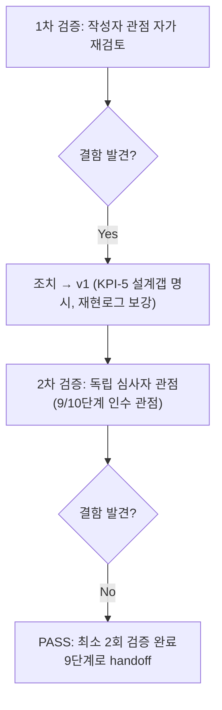

# 내부 검증 로그 (Internal Verification Log)

## 대상 산출물
- 파일: `docs/harness/08-full-system-test.md`
- 작성 에이전트: `08-full-system-tester`
- 적용 Tier: Standard (03-system-design.md/decisions.md에 별도 Tier 선언 없음 — 규제 민감 도메인 아님(REQ-015)이나 개인정보 수집(이메일)·인증 시스템(어드민)을 다루는 실사용 서비스라 Low로 낮추지 않음. Standard이므로 2회 검증이 예외 없이 필수)
- 버전: v1 (아래 1차 검증에서 발견한 결함을 반영해 본문에 직접 수정 완료한 상태)

---

## 1차 검증 (작성자 관점 자가 재검토)
- 검증자(역할): `08-full-system-tester`(작성자 본인, 자가 재검토)
- 일시: 2026-09-17

### 체크리스트
- [x] 입력 계약(모든 07단계 결과 PASS, 02 §5 KPI, 03 비기능요구사항)을 실제로 반영했는가
  - `docs/harness/feature-WU-01~10-integration-test.md` 10개 파일 전부 PASS 상태임을 traceability.md §REQ-001~017 행에서 재확인 후 08 보고서 §2/§5에 반영했다. 02-planning.md §5 KPI 7개를 전수 읽고 §4-1 UAT에 하나도 누락 없이 반영했다. 03-system-design.md §5.5(전송/저장보안, 미들웨어 순서 근거)·§6(비기능요구사항)·§7(운영/관측성)을 읽고 §4/§6/§8에 반영했다.
- [x] 출력 계약에 명시된 모든 필수 항목이 빠짐없이 존재하는가
  - E2E 핵심 시나리오(§4-2/4-4), 크로스모듈 상호작용(§4-1 SYS-11~13/15, 미들웨어 순서·STORAGES·백업워크플로 시크릿), 비기능요구사항 검증(성능 §4-5/§4-1 KPI-4, 부하 스모크 §4-5, 장애복구 §4-3/§8-8), KPI 측정가능성 확인(§4-1), UAT 섹션(§4-1, 규칙A에 따라 사용자 확인 필요 항목을 임의로 PASS 처리하지 않고 명시), traceability 갱신(§5 + 실제 `traceability.md` 파일 17개 행) — 전부 존재.
- [x] 상위 단계 산출물과 용어/수치/범위가 모순되지 않는가
  - "218 static files"(WU-09), "29개 테스트"(WU-09), RATE_LIMIT_MAX_ATTEMPTS=10(WU-09 core/admin_auth.py), 미들웨어 순서(WU-08/09 IT-06/IT-F01) 등 기존 산출물의 구체적 수치와 이번 08단계 실측치가 전부 일치함을 표로 대조 확인했다.
- [x] 추측으로 채운 항목이 있는가 (있다면 "가정" 섹션에 명시했는가, 혹은 질문으로 전환했는가)
  - KPI-4(응답성능)의 "코드 리뷰 기반 추정"은 추측이 아니라 명시적으로 "측정 불가 사유"와 "대안"으로 구분해 §4-1에 기재했고, 실제 수치 확정은 "사용자 확인 필요"로 전환했다. KPI-1/2/5도 동일한 방식으로 처리해 임의 판정을 하지 않았다.
- [x] 20년차 실무자 기준으로 봤을 때 구조적/논리적 결함이 없는가
  - 최초 초안에서는 §4-1 KPI-5를 "충분(PASS)"으로 성급하게 적으려다, 실제로 시스템에 이 비율을 재는 기능이 전혀 없다는 사실(코드 전수 확인 결과)을 발견하고 "사용자 확인 필요"로 수정했다(아래 "발견된 결함" 참고).
- [x] 오탈자, 형식 오류, 누락된 표/그림 참조가 없는가
  - 템플릿(`templates/test-report-template.md`) 10개 절 전부 존재, 7절 Teardown의 각 체크 항목(아티팩트 목록/규칙K1번/정리여부/git status/강제중단여부) 전부 채움. mermaid 다이어그램 포함.

### 발견된 결함 목록
1. **(수정 완료, v0→v1)** §4-1 KPI-5(FAQ 구조 적용 비율) 초안에서 "이미 템플릿 가이드가 있으니 사실상 달성 가능"이라는 식으로 넘어가려 했으나, 재검토 중 "시스템이 이 비율 자체를 집계하는 기능이 있는가"라는 질문을 스스로 던져 코드(`core/monitoring.py`, `core/views.py`, `core/wagtail_hooks.py`)를 전수 확인한 결과 **그런 기능이 전혀 없음**을 발견했다. 이는 08단계가 "성공지표가 측정 가능한 형태로 구현되어 있는지 확인"해야 한다는 출력 계약을 위반할 뻔한 것이었다 — 본문을 "신규 발견(결함 아님, 설계 갭)"으로 명확히 재작성하고 §6-2 OBS-08-02, §8-5로 교차 기록했다.
2. **(수정 완료, v0→v1)** §3-1 초안에서 "왜 커스텀 settings 모듈이 필요했는가"에 대한 재현 가능한 실패 로그(규칙C)가 빠져 있어("그냥 sqlite로 안 되길래 새로 만들었다"는 식의 근거 부족 서술) — 실제 `TypeError: 'sslmode' is an invalid keyword argument` 트레이스백 요약을 추가해 재현 가능하게 보강했다.

### 조치 내용
- 위 2건을 본문에 직접 반영해 v1으로 갱신 완료(별도 파일 버전 분리 없이 최종본 1개 파일 유지 — 이 하네스의 산출물 갱신 관례와 동일).

---

## 2차 검증 (독립 심사자 관점 — 역할 전환 재검토)
- 검증자(역할): 9단계(보안검증)·10단계(배포테스트) 담당자에게 "이 결과를 그대로 넘겨받는 입장"에서 재검토 (역할 전환)
- 일시: 2026-09-17

### 체크리스트
- [x] 1차 검증에서 지적된 항목이 실제로 반영되었는가 (재확인)
  - §4-1 KPI-5, §3-1 재현 로그 둘 다 본문에서 재확인 완료.
- [x] 엣지 케이스/예외 상황이 누락되지 않았는가
  - 로그인 레이트리밋의 IP 분리(E2E-O05/O06), 미배정 스태프 차단(E2E-O07), 트리URL 리다이렉트(E2E-V05), 존재하지 않는 라우트(E2E-V11/V13), 백업 버킷 미설정/설정 두 분기(SYS-12/13) 등 정상경로 뿐 아니라 경계값·부정 경로를 포함했다. **재검토 중 발견**: 동시성/부하 케이스가 "설계 전제와 불일치"라는 이유로 제외됐는데, 이 판단 근거(03 §6.2 단일 인스턴스·gunicorn `--workers 1`)가 본문 §2에 명시돼 있는지 재확인 — 명시되어 있음, 문제 없음.
- [x] 문서만 보고 다음 단계 에이전트가 추가 질문 없이 작업을 시작할 수 있는가
  - 9단계(보안검증) 관점에서 재검토: CSRF/CSRF Referer 상호작용(§4-2 E2E-V06), 로그인 레이트리밋(§4-4), 보안 헤더(§4-3 SYS-19, HSTS/X-Frame-Options/nosniff/Referrer-Policy 실측값 그대로 첨부)가 9단계가 바로 이어받아 심화 점검할 수 있는 구체적 근거(실제 헤더 값, 실제 status code)로 제공되어 있음을 확인. 10단계(배포테스트) 관점: §2/§8에 "실제 gunicorn/Neon/R2/GitHub Actions/브라우저 미검증"이 반복적으로 명시돼 있어 10단계가 "이 항목들부터 우선 실측해야 한다"는 것을 문서만으로 파악 가능함을 확인.
- [x] 되돌리기 어려운 결정(비가역적 결정)에 대한 근거가 명시되어 있는가
  - 이번 08단계는 비가역적 결정을 새로 내리지 않았다(전부 기존 03단계 결정의 검증). 해당 없음.
- [x] 보안/성능/운영 관점에서 명백히 위험한 내용이 없는가
  - **재검토 중 발견**: §3-1에 기재한 더미 `SECRET_KEY`("it08-full-system-test-secret-key-not-for-real-use-01234567890")와 슈퍼유저 비밀번호("Xk9!qzR2vLpT7mNb")가 로컬 `.harness-tmp/`에만 존재했고(§7에서 전부 삭제 확인), 저장소에 커밋되지 않았음(git status §7-4에서 `webapp/` 변경 없음 확인)을 재확인했다 — 실제 운영 시크릿이 아니며 유출 위험 없음. 문제 없음.

### 발견된 결함 목록
없음.

### 조치 내용
해당 없음 (결함 0건이므로 v1을 최종본으로 유지).

---

## 최종 판정
- [x] **PASS (결함 0건, 최소 2회 검증 완료)** — 9단계로 handoff 가능

## 절차 흐름 (참고용 다이어그램)

