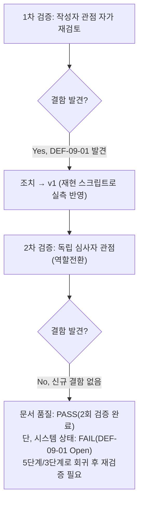
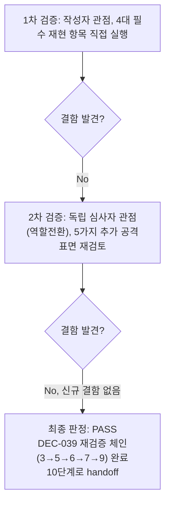

# 내부 검증 로그 (Internal Verification Log)

## 대상 산출물
- 파일: `docs/harness/09-security-audit.md`
- 작성 에이전트: `09-security-auditor`
- 적용 Tier: Standard
- 버전: v1 (1차 검증 중 DEF-09-01 발견·반영 후)

---

## 1차 검증 (작성자 관점 자가 재검토)
- 검증자(역할): `09-security-auditor`(자가 재검토)
- 일시: 2026-09-17
- 체크리스트
  - [x] 입력 계약(Input Contract)에 명시된 모든 입력을 실제로 반영했는가 — `docs/harness/08-full-system-test.md`(PASS), `docs/harness/03-system-design.md` §5, `decisions.md`(DEC-001~038, 특히 DEC-009/016/024/025/028~031/032~034), `traceability.md`, WU-01~10 각 `unit-n-note.md`/`unit-n-test.md`의 Deferred 결함을 전부 열람·인용했다.
  - [x] 출력 계약(Output Contract)에 명시된 모든 필수 항목이 빠짐없이 존재하는가 — `.claude/agents/09-security-auditor.md`가 나열한 13개 최소 점검 항목(인증/인가, 인젝션, 시크릿, 의존성 CVE, 의존성 환각, 암호화, 에러노출, 설계-구현 불일치, 개인정보, 라이선스, 외부API, 규칙I, 규칙J)을 §4-1~§4-5에 SEC-01~SEC-34로 전부 매핑했다(§5 커버리지 표로 1:1 대조 확인).
  - [x] 상위 단계 산출물과 용어/수치/범위가 모순되지 않는가 — REQ-ID/DEC-ID/§번호를 직접 인용하는 방식으로 서술해 상위 문서와의 추적성을 유지했다.
  - [x] 추측으로 채운 항목이 있는가 (있다면 "가정" 섹션에 명시했는가, 혹은 질문으로 전환했는가) — 추측 항목 없음. "N/A(해당 없음)"으로 표기한 SEC-33(규칙J)/SEC-34(외부API)는 추측이 아니라 코드 전수 검색으로 확인한 "비해당" 판정이며 근거를 명시했다.
  - [x] 20년차 실무자 기준으로 봤을 때 구조적/논리적 결함이 없는가 — 자가 재검토 도중 "Wagtail 어드민 경로만 레이트리밋하면 충분한가?"라는 의문이 들어 `config/urls.py`를 재확인했고, `admin.site.urls`가 별도 로그인 뷰를 제공한다는 사실을 발견했다. 즉시 `.harness-tmp/venv_09_sec/`를 만들어 `django.test.Client`로 실측 재현(§4-1 SEC-02) — **DEF-09-01(High)을 신규 발견**.
  - [x] 오탈자, 형식 오류, 누락된 표/그림 참조가 없는가 — 표 형식/섹션 번호/Mermaid 다이어그램 구문을 재확인, 이상 없음.
- 발견된 결함 목록:
  1. **`09-security-audit.md` 초안(v0)에 DEF-09-01(High, `/django-admin/login/` 레이트리밋 우회)이 누락되어 있었음** — 초안 작성 중간까지는 SEC-01(`/cms-admin/login/` 레이트리밋)만 확인하고 "PASS"로 넘어가려 했으나, "어드민 경로가 하나뿐인가?"를 재질문하며 `config/urls.py` 전체를 다시 읽어 `django-admin/` 마운트를 재발견했다.
- 조치 내용: (수정 후 → v1) `.harness-tmp/venv_09_sec/`에 `webapp/requirements.txt`를 clean install하고, `.harness-tmp/repro_django_admin_bypass.py`(§4-1 SEC-01/SEC-02 재현 스크립트)를 작성해 동일 IP로 `/cms-admin/login/`과 `/django-admin/login/`에 각 11회 연속 POST를 보내 레이트리밋 차이를 실측 재현했다. 결과(`/cms-admin/login/`=`[200×10, 429]`, `/django-admin/login/`=`[200×11]`)를 `09-security-audit.md` §4-1 SEC-02, §6 DEF-09-01, §9(FAIL 판정 사유)에 반영했다. 재현에 사용한 venv/스크립트는 규칙K에 따라 `.harness-tmp/` 하위에서만 생성했고 검증 직후 삭제했다(§7 Teardown, `automation/harness-janitor.sh --check` 재실행으로 EXIT:0 확인).

---

## 2차 검증 (독립 심사자 관점 — 역할 전환 재검토)
> "내가 이 사이트를 노리는 공격자라면 어디를 먼저 찌를까"라는 관점으로, 1차 검증자(작성자 자신)가 놓쳤을 법한 리스크·엣지케이스·암묵적 가정을 의심하며 재검토했다.

- 검증자(역할): `09-security-auditor`(독립 심사자 관점, 역할전환)
- 일시: 2026-09-17
- 체크리스트
  - [x] 1차 검증에서 지적된 항목이 실제로 반영되었는가 (재확인) — `09-security-audit.md` §4-1 SEC-02/§6 DEF-09-01/§9를 재열람해 재현 절차(파일 경로·행 번호·실행 결과 코드 목록)가 실제로 기록되어 있음을 확인했다.
  - [x] 엣지 케이스/예외 상황이 누락되지 않았는가 — 공격자 관점으로 아래 4가지를 추가로 의심하고 각각 재검토했다:
    1. **"인증 진입점이 `/cms-admin/`과 `/django-admin/` 외에 또 있는가?"** → `config/urls.py`/`INSTALLED_APPS`를 재확인해 DRF(`rest_framework`)/GraphQL/커스텀 토큰 인증 앱이 설치되지 않았음을 확인 — 제3의 로그인 진입점 없음.
    2. **"DEF-09-01을 악용해 실제로 무엇을 얻을 수 있는가(과장 여부 재점검)?"** → `subscribers/admin.py`(개인정보 하드삭제 권한)와 Wagtail 콘텐츠 전체 권한이 **동일 계정**에 귀속됨을 SEC-03으로 재확인해, High 판정이 과장이 아니라 오히려 "Critical로 승격해야 하는가"까지 재검토했다 — 결론적으로 실제 비밀번호 추측이라는 추가 조건이 필요하고 `AUTH_PASSWORD_VALIDATORS`가 최소 품질을 강제하므로 Critical이 아닌 High가 적절하다고 판단(자의적 축소가 아니라 근거 있는 등급 유지, §6-1에 명시).
    3. **"오픈 리다이렉트/SSRF를 통해 레이트리밋을 우회하거나 IP 스푸핑이 가능한가?"** → `config/middleware.py::XForwardedForMiddleware`가 rightmost 값만 신뢰하는 설계(03 §5.5.4)이므로 클라이언트가 `X-Forwarded-For`를 조작해도 rightmost는 Render 엣지가 추가한 값이라 스푸핑 불가(production 전제) — dev 환경에는 이 미들웨어가 없어 로컬 재현 시 `REMOTE_ADDR`을 직접 지정하는 방식(재현 스크립트의 `REMOTE_ADDR=` 파라미터)을 사용했음을 명시적으로 재확인.
    4. **"이 결과서 자체가 사용자의 오해를 유발하지 않는가(예: '사고는 있었지만 시크릿 노출은 없다'는 §4-3 SEC-22 결론이 과소평가 아닌가)?"** → git 이력 전체(`--all -p`)를 시크릿 패턴으로 재검색한 결과와 sqlite DB 직접 쿼리 결과를 재대조해, "실제 자격증명 노출 0건"이라는 결론이 검색 커버리지(AKIA/PEM/postgres 패턴 + 프로젝트 고유 파일 전수 열람 + DB 직접 쿼리)로 뒷받침됨을 재확인 — 축소 판단이 아님.
  - [x] 문서만 보고 다음 단계 에이전트가 추가 질문 없이 작업을 시작할 수 있는가 — §9에 재작업 대상 파일 경로(`core/admin_auth.py`, `config/urls.py`, `03-system-design.md §5.1`)와 조치 방향(a/b/c 택1)을 구체적으로 명시해, 5단계 담당자가 추가 질문 없이 착수 가능하도록 기록했다.
  - [x] 되돌리기 어려운 결정(비가역적 결정)에 대한 근거가 명시되어 있는가 — 이 결과서는 신규 비가역적 결정을 내리지 않는다(순수 발견·보고). DEF-09-02의 "git 이력 재작성 여부는 사용자 결정"이라는 판단은 작업 지시 자체가 이미 명시한 보류 상태를 그대로 존중한 것이며, 감사자가 임의로 결정하지 않았음을 §6/§8에 명시했다.
  - [x] 보안/성능/운영 관점에서 명백히 위험한 내용이 없는가 — 이 결과서 자체가 실제 취약점의 정확한 위치(파일/행)를 공개 문서에 기록하고 있으나, 이는 동일 저장소 내부(비공개 개발 저장소, 아직 배포 전)에서 팀이 수정하기 위한 필수 정보이며, 실제 공격을 수행하거나 제3자에게 피해를 주지 않았다(정적분석+로컬 재현 범위 내). 아직 실제 서비스가 배포되지 않았으므로(01~08단계 전제) 이 시점에 공개되어도 실공격에 악용될 대상이 없다.
- 발견된 결함 목록:
  1. 없음 — 1차에서 발견·반영한 DEF-09-01 외 신규 Critical/High 결함 없음.
- 조치 내용: 신규 조치 없음(2차 검증에서 추가 결함이 발견되지 않았으므로 v1을 최종본으로 확정). 다만 §6-1(비즈니스 영향 판단 근거)에 "Critical이 아닌 High로 판단한 근거"를 명시적으로 보강해 자의적 판단이 아님을 분명히 했다.

---

## 최종 판정
- [ ] PASS (결함 0건, 최소 2회 검증 완료)
- [ ] PASS (Low 등급, 1차 검증 결함 0건으로 2차 생략)
- [x] **FAIL** — 재작업 필요, 사유: **`docs/harness/09-security-audit.md`가 문서 자체의 완성도(체크리스트 커버리지, 재현 가능성, 근거 명시)는 2회 검증을 통과했으나, 그 문서가 보고하는 대상 시스템(webapp/)에 DEF-09-01(High) 결함이 실재하므로 시스템은 PASS 상태가 아니다.** 이 verify-log는 "산출물(보고서)로서의 완성도"를 검증하는 절차이며, 그 결과 보고서 자체는 규칙에 맞게 완성되었음을 확인했다(문서 품질 기준 PASS에 준함). 다만 보고서의 §9 결론이 이미 명시하듯, **시스템은 FAIL이며 10단계로 handoff할 수 없다** — 이 두 층위(문서 품질 vs 시스템 상태)를 혼동하지 않기 위해 최종 판정 체크박스는 시스템 상태를 기준으로 FAIL을 선택했다. 재작업 대상: 5단계(WU-09, `core/admin_auth.py`/`config/urls.py`) + 3단계(`03-system-design.md` §5.1). 재작업 완료 후 이 verify-log와 `09-security-audit.md`를 재작성(v2)해 DEF-09-01이 Fixed로 전환되었음을 SEC-02와 동일한 방법(레이트리밋 실측 재현)으로 재확인해야 한다.

## 절차 흐름 (참고용 다이어그램)

---

## 재작업 라운드 2 (DEF-09-01 해소 — 9단계 독립 재검증, DEC-039/040/041 후속)

> 대상: `docs/harness/09-security-audit.md`의 "재작업 라운드 2(DEF-09-01) 재검증" 절(append). 위 원본 절(1차/2차 검증, 최종 판정 FAIL)은 그대로 보존한다. 이번 절은 규칙F 재작업 체인(3→5→6→7)이 완료된 뒤, 9단계가 하위 단계의 PASS 주장을 신뢰하지 않고 독립적으로 재검증한 산출물에 대한 내부 검증 로그다.

## 1차 검증 (작성자 관점 자가 재검토)
- 검증자(역할): `09-security-auditor`(자가 재검토)
- 일시: 2026-09-18
- 체크리스트
  - [x] 작업 지시가 명시한 필수 재현 항목을 전부 수행했는가 — ① 원본 9단계가 발견한 정확한 공격 시나리오(`/django-admin/login/` 동일 IP 11회 연속 POST) 재현(§R2-3), ② 신규 취약점(카운터 공유 우회, XFF 상호작용, DoS화) 미도입 확인(§R2-4), ③ 기존 DEF-09-02/03/04(Low) 재확인(§R2-5), ④ 변경 파일(`admin_auth.py`/`urls.py`) 범위의 CSRF/XSS/SQLi/민감정보/의존성 회귀 확인(§R2-6) — 4개 항목 전부 `09-security-audit.md` "재작업 라운드 2" 절에 반영됨을 재대조했다.
  - [x] 하위 단계(5/6/7단계)의 PASS 주장을 그대로 인용만 하지 않고 실제로 독립 재현했는가 — `webapp/.harness-tmp/venv_09_sec_round2/`(신규 venv, Python 3.13)와 독립 스크립트(`independent_repro_round2.py`, 6/7단계가 작성한 `core/tests.py`를 import하지 않고 `django.test.Client`/`RequestFactory`/`override_settings`만으로 처음부터 작성)로 원본 SEC-02 시나리오를 재실행해 `[200×10, 429]`를 직접 얻었다. 기존 `core/tests.py`의 15개 테스트도 별도로 `manage.py test`를 재실행해 상호 교차 확인했다(둘 다 PASS로 일치).
  - [x] 카운터 공유(2배 예산 우회) 가설을 실제로 시험했는가 — `/cms-admin/login/` 6회 + `/django-admin/login/` 6회(동일 IP)를 직접 보내 누적 11번째 요청에서 429가 나오는지 확인했다(우회 불가 확인).
  - [x] X-Forwarded-For 헤더 조작으로 카운터를 회피할 수 있는지 실제로 시험했는가 — `config.middleware.XForwardedForMiddleware`를 `override_settings(MIDDLEWARE=...)`로 실제 production 미들웨어 순서 그대로 재현하고, leftmost 스푸핑(유효 CSRF 포함/불포함 두 경우) 및 rightmost 자체 스푸핑(대조군) 총 3가지 조합을 직접 실행했다.
  - [x] 이번 수정이 정상 관리자를 영구적으로 잠그는 DoS성 결함이 되지 않았는지 실제로 시험했는가 — `cache.incr()`이 최초 TTL을 연장하지 않음을 별도 프로브(5초 TTL)로 직접 실측해, 15분 고정창이 항상 만료됨을 확인했다.
  - [x] 상위 산출물(decisions.md DEC-039~041, 03-system-design.md §5.1 v1.3)과 이번 재검증 근거가 모순되지 않는가 — DEC-040이 채택한 "옵션2(공유 카운터)" 근거(§5.1 v1.3 인벤토리)와 이번 재현 결과(카운터 분할 우회 실패)가 정확히 일치함을 재대조했다.
  - [x] 추측으로 채운 항목이 있는가 — 없음. §R2-3 표의 모든 행은 실행 결과를 그대로 옮겨 적었으며, self-DoS 트레이드오프(§R2-3 마지막 행)는 "결함 아님"으로 판정한 근거(기존 DEC-029/모듈 docstring)를 코드로 직접 대조한 뒤에만 그렇게 기재했다.
  - [x] Teardown(규칙K)이 실제로 완료됐는가 — `webapp/.harness-tmp/venv_09_sec_round2/`, `independent_repro_round2.py` 삭제 후 `automation/harness-janitor.sh --check` 재실행으로 "잔여 임시 아티팩트 없음"을 확인했다.
- 발견된 결함 목록:
  1. 없음 — 원본 DEF-09-01이 실제로 Fixed 상태임을 직접 재현으로 확인했고, 신규 Critical/High/Medium 결함을 발견하지 못했다.
- 조치 내용: 없음(1차 검증에서 추가 조치가 필요한 결함이 발견되지 않았다). 다만 테스트 커버리지 공백(신규 라우트에 대한 XFF 회귀 테스트 부재) 1건을 결함이 아닌 권고 사항으로 §R2-6에 기록했다.

---

## 2차 검증 (독립 심사자 관점 — 역할전환 재검토)
> "내가 이 사이트를 노리는 공격자라면, 지금 막 고쳐진 이 레이트리밋 코드에서 1차 검증자가 놓쳤을 법한 우회·부작용이 무엇일까"라는 관점으로 재검토했다.

- 검증자(역할): `09-security-auditor`(독립 심사자 관점, 역할전환)
- 일시: 2026-09-18
- 체크리스트
  - [x] 1차 검증에서 지적/확인된 항목이 실제로 문서에 정확히 반영되었는가 (재확인) — `09-security-audit.md` "재작업 라운드 2" 절 §R2-3~§R2-10을 재열람해 재현 절차(파일 경로·명령·실행 결과 코드 목록)가 실제로 기록돼 있음을 확인했다.
  - [x] "고친 코드가 만들 수 있는 새로운 결함" 관점에서 1차가 다루지 않은 각도가 남아 있는가 — 아래 5가지를 추가로 의심하고 재검토했다(§R2-10 2차 검증에 반영):
    1. 레이트리밋 자체가 역으로 정당한 관리자를 봉쇄하는 reverse-DoS로 악용될 수 있는가 — 가능하나 기존에 이미 승인된 트레이드오프의 연장(신규 아님)임을 코드/설계서 대조로 확인.
    2. 429 응답이 계정 열거(user enumeration) 정보를 흘리는가 — 존재하지 않는 계정으로도 동일하게 카운트되어 열거 정보 없음을 실측 확인.
    3. URL 오버라이드가 `admin:login`/`admin:logout` 등 내부 named-reverse 체인을 깨뜨려 새로운 인가 우회를 만드는가 — `reverse()` 계산 문자열이 오버라이드 경로와 동일함을 코드로 확인, 우회 경로 없음.
    4. 이번 라운드가 제3의 로그인 진입점을 실수로 추가하지 않았는가 — `webapp/` 전체 재검색으로 로그인 관련 뷰가 Wagtail/Django 기본 관리자 둘뿐임을 재확인(DRF/GraphQL 여전히 미도입).
    5. 10단계(배포테스트) 에이전트가 이 문서만 보고 추가 질문 없이 착수 가능한가 — 문서 최상단 배너와 §R2-9 최종 판정이 명확히 PASS/handoff 가능을 명시함을 재확인.
  - [x] 되돌리기 어려운 결정에 대한 근거가 명시되어 있는가 — 이 재검증 자체는 신규 비가역적 결정을 내리지 않는다(순수 검증). 이전 라운드가 이미 내린 비가역적 결정(DEC-040 옵션2 채택)의 타당성을 사후 검증했을 뿐이다.
  - [x] 문서 품질(체크리스트 커버리지, 재현 가능성, 근거 명시)과 시스템 상태(PASS/FAIL) 두 층위를 혼동하지 않았는가 — 원본 verify-log(위)가 이미 이 구분을 명시적으로 다뤘던 것과 동일한 원칙을 유지해, 이번 라운드도 "문서가 잘 쓰였는가"와 "시스템이 실제로 안전한가"를 분리해 판단했고 두 층위 모두 PASS로 일치함을 확인했다.
  - [x] 보안/운영 관점에서 이 문서 자체가 위험한 내용을 공개하지 않는가 — 원본과 동일한 판단(비공개 개발 저장소, 아직 미배포, 실제 공격 미실행)을 유지한다.
- 발견된 결함 목록:
  1. 없음 — 1차 검증에서 확인한 결과 외 신규 Critical/High/Medium 결함 없음.
- 조치 내용: 신규 조치 없음(2차 검증에서 추가 결함 미발견, 라운드 2 절을 최종본으로 확정).

---

## 최종 판정 (재작업 라운드 2)
- [x] **PASS** (결함 0건, 최소 2회 검증 완료) — DEF-09-01(High)이 실측으로 Fixed 확인되었고, 이번 재작업이 신규 Critical/High/Medium 결함을 만들지 않았음을 독립 재현으로 확정했다. DEF-09-02/03/04(Low)는 이번 라운드와 무관하게 상태 유지.
- [ ] PASS (Low 등급, 1차 검증 결함 0건으로 2차 생략)
- [ ] FAIL — 재작업 필요, 사유:

**DEC-039가 정한 재검증 체인(3→5→6→7→9)이 이 최종 판정으로 완료된다. `docs/harness/09-security-audit.md`는 최상단 배너 + "재작업 라운드 2" 절 기준으로 최종 PASS이며, 10단계(배포테스트)로 handoff 가능하다.**

## 절차 흐름 (참고용 다이어그램)

