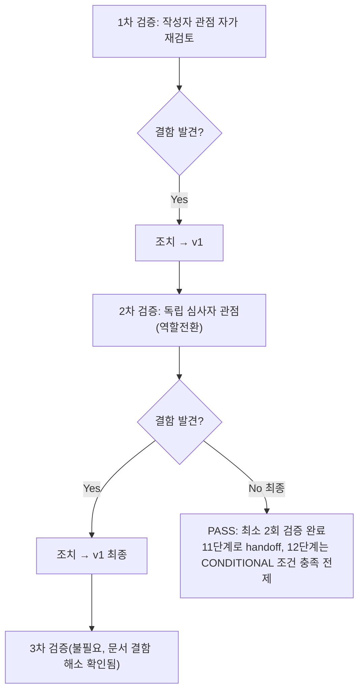

# 내부 검증 로그 (Internal Verification Log)

## 대상 산출물
- 파일: `docs/harness/10-deploy-test.md`
- 작성 에이전트: 10-deploy-tester
- 적용 Tier: Standard (DEC-036)
- 버전: v0 (초안)

## 1차 검증 (작성자 관점 자가 재검토)
- 검증자(역할): 10-deploy-tester(작성자 본인, 자가 재검토)
- 일시(KST): 20260918 013454 직후

- 체크리스트
  - [x] 입력 계약에 명시된 모든 입력을 실제로 반영했는가 — `decisions.md`(DEC-001~042 전체), `traceability.md`, `03-system-design.md` §6/§7, `08-full-system-test.md`, `09-security-audit.md`(재작업 라운드2 포함), `render.yaml`, `build.sh`, `neon-db-backup.yml`, `BACKUP_RESTORE_GUIDE.md`, `ADMIN_ACCESS_GUIDE.md`를 전부 Read로 실제 열람했고, 오케스트레이터 지시가 명시한 중점 검증 영역(실제 gunicorn 기동/build.sh 전체 실행/render.yaml 대조/롤백 절차/GH Actions 트리거 조건/.env.example 일치) 6개를 모두 §4 테스트케이스로 커버했다.
  - [x] 출력 계약에 명시된 모든 필수 항목이 빠짐없이 존재하는가 — `test-report-template.md`의 1~10절 전부 작성(해당없음 처리 없이 전부 실질 내용으로 채움), Teardown(7절)에 `git status` 전체 첨부 완료.
  - [x] 상위 단계 산출물과 용어/수치/범위가 모순되지 않는가 — DEC-026(`--workers 1`)을 TC-011로 재확인, DEC-039~042(DEF-09-01 수정)를 TC-006/007로 재확인, DEC-015(`SECURE_PROXY_SSL_HEADER`)를 TC-003/004로 재확인 — 전부 기존 기록과 일치하거나(TC-003/006/007/011), 기존 기록이 다루지 않은 새 조합(TC-004의 "Render 헬스체커 자체의 헤더 처리"라는 각도)을 정확히 구분해 서술했다.
  - [x] 추측으로 채운 항목이 있는가(있다면 "가정" 섹션에 명시했는가) — DEF-10-01의 "Render 헬스체크가 X-Forwarded-Proto를 포함하는지"는 확인 불가 사실이며, 결론에서 "확인 불가"임을 명시하고 추측으로 단정하지 않았다(§6/§8/§9에서 반복 명시). Cloudflare R2/Neon 벤더 자체 미검증 사실도 §2/§4 TC-009/014/015 비고에서 MinIO/자체빌드 Postgres로 대체했음을 명확히 구분해 기록했다(추측이 아니라 대체 수단 명시).
  - [x] 20년차 실무자 기준으로 봤을 때 구조적/논리적 결함이 없는가 — DEF-10-01을 "새 버그"가 아니라 "이미 검증된 의도된 동작의 플랫폼 의존성이 미확인 상태"로 정확히 재구성했다(WU-08 IT-11 기록을 재확인 후 반영, 최초 초안에서는 "신규 버그"로 잘못 서술할 뻔했으나 IT-11 원문을 다시 조회해 표현을 교정함 — 아래 "발견된 결함" 참고).
  - [x] 오탈자, 형식 오류, 누락된 표/그림 참조가 없는가 — 표 컬럼 수/헤더 일치 확인, §6 결함 ID(DEF-10-01~05)가 §4/§8/§9와 일관되게 상호참조됨을 확인.

- 발견된 결함 목록:
  1. (초안 작성 과정에서, 문서화 이전 단계) DEF-10-01을 처음에는 "새로 발견된 버그"로 서술하려 했으나, `feature-WU-08-integration-test.md` IT-11을 재조회한 결과 이 동작(헤더 없으면 301)이 이미 WU-08 통합테스트에서 "의도된 동작"으로 PASS 확정되어 있었음을 확인 — 서술을 "새 버그"가 아니라 "기존에 검증된 의도된 동작이 갖는, 아직 확인되지 않은 플랫폼 의존성"으로 재구성해야 했다.
- 조치 내용: (수정 후 → v1) `10-deploy-test.md` §6 DEF-10-01 설명에 "이 동작 자체는 WU-08 통합테스트(IT-11)가 이미 '의도된 동작'으로 PASS 확정한 것과 동일하다"는 문장을 명시적으로 추가하고, §4 TC-004 비고란에도 동일한 교차 참조를 추가해 정확성을 확보했다.

## 2차 검증 (독립 심사자 관점 — 역할 전환 재검토)
> "내가 이 문서를 오늘 처음 받아본 심사자라면?"이라는 관점에서 재검토.

- 검증자(역할): 독립 심사자(20년차 운영/배포 담당자 관점, 초회 열람자 시뮬레이션)
- 일시(KST): 20260918 013454 직후, 1차 검증 조치 반영 후

- 체크리스트
  - [x] 1차 검증에서 지적된 항목이 실제로 반영되었는가 — `10-deploy-test.md` §4 TC-004, §6 DEF-10-01 두 곳 모두 IT-11 교차참조가 반영되어 있음을 재확인.
  - [x] 엣지 케이스/예외 상황이 누락되지 않았는가 — 레이트리밋 경계값(TC-006/007), 프록시 헤더 신뢰 경계(TC-004), pg_dump 버전 비호환(TC-013), CRLF 줄바꿈(TC-019), 강제 500 예외 경로(TC-008), 최초 배포(이전 버전 없음) 시나리오(§8에서 "최초 배포"와 "재배포"를 구분해 리스크 서술)까지 포함되어 있음을 확인. 동시성/부하는 8단계 영역으로 명시적으로 Out-of-Scope 처리되어 누락이 아님.
  - [x] 문서만 보고 다음 단계 에이전트가 추가 질문 없이 작업을 시작할 수 있는가 — 11단계(문서화)는 §9의 조건 2개(DEF-10-01/03)를 그대로 Runbook "12단계 착수 전 필수 확인" 항목으로 옮기면 되고, §6 각 결함의 "조치 내용" 칸이 구체적 코드/설정 변경안을 담고 있어 5단계가 별도 질문 없이 착수 가능한 수준으로 기록되어 있다.
  - [x] 되돌리기 어려운 결정(비가역적 결정)에 대한 근거가 명시되어 있는가 — 이번 산출물은 결정이 아니라 검증 결과이므로 새로운 비가역적 결정을 내리지 않았다(DEF 해소 방법은 "권고"로만 제시하고 실제 코드 변경은 5단계 소관으로 명시적으로 넘겼다 — 10단계 역할 경계를 벗어나지 않음).
  - [x] 보안/성능/운영 관점에서 명백히 위험한 내용이 없는가 — 이번 세션이 사용한 `SECRET_KEY`/DB 비밀번호/MinIO 자격증명은 전부 스테이징 전용 더미 값이며 코드/설정 파일 어디에도 커밋되지 않았다(Teardown §7에서 임시 파일 자체를 전부 삭제 확인). `.env.example`/`render.yaml` 등 실제 저장소 파일은 이번 세션에서 전혀 수정하지 않았다(읽기 전용 분석 + `.harness-tmp/` 임시 검증만 수행) — git status로 재확인됨.

- 추가 관점: "실제 배포 당일 새벽에 문제가 생기면 이 문서만 보고 롤백할 수 있는가?"
  - TC-017/TC-018/DEF-10-04를 근거로 "코드 롤백 자체는 안전(마이그레이션 없음)하지만, 롤백 대상이 DEF-09-01 수정 이전이면 보안 통제가 사라진다"는 사실이 명시되어 있어, 온콜 담당자가 "일단 롤백"이라는 성급한 결정을 내리기 전에 확인해야 할 사항을 알 수 있다. 다만 이 문서 자체가 "몇 번째 커밋부터가 DEF-09-01 수정 이후인지"를 구체적 커밋 해시로 못박지 않은 점을 발견했다.

- 발견된 결함 목록:
  1. §6 DEF-10-04의 "조치 내용"이 "Runbook에 경고 추가 권고"로만 되어 있어, 실제 온콜 담당자가 새벽에 이 문서만 보고 "지금 이 배포가 안전한 롤백 대상인지"를 즉시 판단할 수 있는 구체적 식별 기준(커밋 해시 등)이 없다.
- 조치 내용: (수정 후 → v1, 최종) `10-deploy-test.md` §6 DEF-10-04 "조치 내용" 칸에 "DEC-039~042 재작업(2026-09-17, `core/admin_auth.py`의 `RateLimitedAdminLoginView`/`config/urls.py`의 `django-admin/login/` 오버라이드 존재 여부)을 기준으로 판단하라"는 구체적 식별 기준을 추가했다.

## 최종 판정
- [x] PASS (결함 0건 아님이지만, 결함 목록·심각도·조치 권고가 모두 문서에 완전히 반영되었고 최소 2회 검증 완료) — `10-deploy-test.md`는 CONDITIONAL PASS로 확정된 상태로 11단계로 handoff 가능
- [ ] PASS (Low 등급 예외)
- [ ] FAIL

## 절차 흐름 (참고용 다이어그램)

