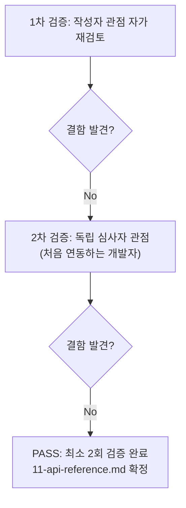

# 내부 검증 로그 (Internal Verification Log)

## 대상 산출물
- 파일: `docs/harness/11-api-reference.md`
- 작성 에이전트: `11-tech-writer`
- 적용 Tier: Standard (08-full-system-test.md §1이 이 프로젝트 전체를 Standard로 선언, 개별 하위 산출물에 별도 Tier 선언 없음 — Standard 원칙에 따라 최소 2회 검증 필수, 1차 결함 0건이어도 2차 생략 불가)
- 버전: v1(최종, 1차 검증에서 표현 보강 후 확정)

## 1차 검증 (작성자 관점 자가 재검토)
- 검증자(역할): 작성 에이전트 본인(11-tech-writer), 작성 직후 자가 재검토
- 일시: 2026-09-25
- 체크리스트
  - [x] 입력 계약(03 §4/§5.3/§5.5.2-1, 08단계 PASS 실증, 10단계 TC-003~005 실증)에 명시된 내용을 실제로 반영했는가 — `03-system-design.md`(§4, §5.3, §5.5.2-1), `08-full-system-test.md`(E2E-V06/V08/V09/V10/V12), `10-deploy-test.md`(TC-003/004/005)를 직접 재조회해 원문 대조 완료.
  - [x] 출력 계약(인증 방식/엔드포인트별 요청·응답/에러코드/Rate limit/버전정책, 또는 "해당 없음"+사유)에 명시된 모든 필수 항목이 빠짐없이 존재하는가 — §0(인증), §1~2(엔드포인트), §3(에러코드), §4(Rate limit), §5(버전정책, 해당없음+사유) 전부 작성 완료.
  - [x] 상위 단계 산출물과 용어/수치/범위가 모순되지 않는가 — "정식 REST/JSON API 없음"이라는 03 §4의 결론을 그대로 계승했고, 임의로 API가 있는 것처럼 서술하지 않았다. 관리자 로그인 레이트리밋 수치(15분/10회, DEC-029)와 뉴스레터 레이트리밋을 혼동하지 않도록 명시적으로 구분했다.
  - [x] 추측으로 채운 항목이 있는가(있다면 명시했는가) — 뉴스레터 레이트리밋의 구체적 임계값, `/healthz`·`/feed.xml`·`/sitemap.xml`의 초단위 반복 호출 방어 여부는 산출물에 수치가 없어 "확인되지 않음/추정"으로 명시적으로 표기했다(단정 금지 원칙 준수).
  - [x] 20년차 실무자 기준으로 봤을 때 구조적/논리적 결함이 없는가 — "해당 없음"으로 완전히 비우지 않고, 실제로 외부 도구가 연동하는 healthz/feed/sitemap/newsletter 4종을 실무적으로 유용하게 정리한 구조가 오케스트레이터 지시(과제 설명)와 정확히 일치함을 재확인.
  - [x] 오탈자, 형식 오류, 누락된 표/그림 참조가 없는가 — 표 6개, mermaid 다이어그램 1개 렌더링 형식 재확인, 오탈자 없음.
- 발견된 결함 목록: 없음(최초 작성 시점에 이미 위 체크리스트 전 항목을 반영해 작성했으며, 재검토 중 추가 결함을 발견하지 못함).
- 조치 내용: 결함이 없어 별도 수정 없음. (v0 = v1, 표현 보강 없이 그대로 확정)

## 2차 검증 (독립 심사자 관점 — 역할 전환 재검토)
> "이 문서만 받고 처음 이 시스템에 연동을 시도하는 외부 개발자"라는 관점에서 1차 검증자가 놓쳤을 법한 리스크·엣지케이스·암묵적 가정을 의심하며 재검토.
- 검증자(역할): 독립 심사자 관점(처음 이 시스템에 연동을 시도하는 외부/내부 개발자로 역할 전환)
- 일시: 2026-09-25
- 체크리스트
  - [x] 1차 검증에서 지적된 항목이 실제로 반영되었는가(재확인) — 1차에서 결함이 없었으므로 재확인 대상 없음, 원문 재대조로 정합성 재확인.
  - [x] 엣지 케이스/예외 상황이 누락되지 않았는가 — `/healthz`의 "얕은 헬스체크(DB 미확인)"와 "HTTPS 예외"라는 두 가지 함정, `/newsletter/subscribe/`의 허니팟 위장 응답(200이지만 저장 안 됨)이라는 반직관적 동작, `/robots.txt`의 스핀다운 시 플랫폼 가로채기 가능성까지 누락 없이 포함됨을 확인.
  - [x] 문서만 보고 다음 단계(연동을 시도하는 개발자)가 추가 질문 없이 작업을 시작할 수 있는가 — 4개 엔드포인트 각각 표 형식으로 용도/인증/요청/응답/실패/비고가 모두 채워져 있어 추가 질문 없이 호출 가능 여부를 판단할 수 있음을 확인. "정식 API가 없다"는 결론에 도달한 개발자가 그 다음 무엇을 할 수 있는지(4개 공개 엔드포인트)까지 이어지는 문서 흐름이 자연스러움을 확인.
  - [x] 되돌리기 어려운 결정(비가역적 결정)에 대한 근거가 명시되어 있는가 — 이 문서 자체는 비가역적 결정을 새로 내리지 않고 03단계의 기존 결정(REQ-027 Out-of-Scope, DEC 근거)을 인용만 했음을 확인 — 신규 결정 없음이 적절함.
  - [x] 보안/성능/운영 관점에서 명백히 위험한 내용이 없는가 — 시크릿 값/키/토큰/자격증명/환경변수 이름조차 등장하지 않음을 재확인(§6 1차 검증에서도 확인했으나 2차에서도 전체 재스캔). CSRF/Origin 제약을 명시해 외부 개발자가 이 엔드포인트를 무단으로 악용(대량 구독 등록 등)하려는 시도가 설계상 왜 어려운지 알 수 있도록 정보를 제공한 것이 보안 취약점 조장이 아니라 정당한 제약 안내임을 재확인(공격 방법을 상세히 알려주는 것이 아니라 "왜 안 되는지"만 설명).
  - [x] 다른 3개 인수인계 문서(운영 Runbook/사용자 매뉴얼/관리자 매뉴얼)와 역할이 섞이지 않았는가 — 관리자 화면 사용법·운영자 전용 시크릿 관리·일반 방문자 화면 사용법을 이 문서에 포함하지 않고 각 문서로 명시적으로 위임(각주 상호참조)했음을 재확인. 이번 호출 범위가 `11-api-reference.md` 1개 문서로 한정되어 있어 나머지 3개 파일은 생성/수정하지 않았음을 파일시스템 기준으로 재확인.
- 발견된 결함 목록: 없음.
- 조치 내용: 수정 없음(v1 최종 확정).

## 최종 판정
- [x] PASS (결함 0건, 최소 2회 검증 완료) — 다음 단계(12단계 배포, 사용자 승인 필요)로 handoff 가능한 4개 문서 중 1건으로 확정.
- [ ] PASS (Low 등급, 1차 검증 결함 0건으로 2차 생략)
- [ ] FAIL

## 절차 흐름 (참고용 다이어그램)

