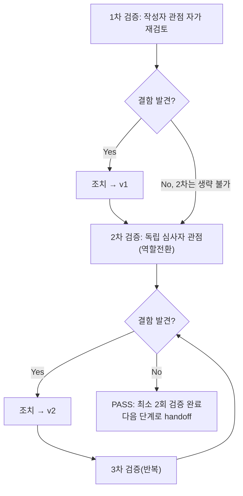

# 내부 검증 로그 (Internal Verification Log) — feature-WU-02-integration-test.md

## 대상 산출물
- 파일: `docs/harness/feature-WU-02-integration-test.md`
- 작성 에이전트: `07-integration-tester`
- 버전: v0 (초안)

## 1차 검증 (작성자 관점 자가 재검토)
- 검증자(역할): `07-integration-tester` (작성자 본인)
- 일시: 2026-09-16
- 체크리스트
  - [x] 입력 계약에 명시된 모든 입력(unit-02-note.md, unit-02-test.md, 03/04 설계서, decisions.md, unit-01-note.md, WU-01 07단계 결과서)을 실제로 반영했는가 — §1 관련 산출물 목록과 본문 각주에서 전부 인용/대조함.
  - [x] 출력 계약(test-report-template.md 전 섹션)에 명시된 모든 필수 항목이 빠짐없이 존재하는가 — 1~10절 전부 채움("해당 없음"으로 처리한 항목(4-2 OP-07 등)도 근거와 함께 명시).
  - [x] 상위 단계 산출물과 용어/수치/범위가 모순되지 않는가 — WU-01 07단계의 "SQLite+ssl_require 충돌" 실측 결과, collectstatic 214/626 수치, "/cms-admin/login/" 302/200 표준 동작 등을 그대로 인용·재확인했고 수치가 일치함을 §3/§4에서 명시.
  - [x] 추측으로 채운 항목이 있는가 — 없음. IT-A~K 전 케이스가 실제 실행 결과(상태코드/DB값/파일 재현)에 근거하며, 실행 불가능한 항목(실제 이미지 업로드, 실제 Render 인프라)은 "미검증"으로 명시하고 사유를 남김(2절/5절).
  - [x] 20년차 실무자 기준으로 봤을 때 구조적/논리적 결함이 없는가 — DEF-002(R2 마이그레이션 필요성)를 "구조적으로 문제없음"에서 멈추지 않고 "무엇을 언제 해야 하는지"까지 실증해 이관한 것이 QA 리드 관점에서 핵심 가치라고 판단.
  - [x] 오탈자, 형식 오류, 누락된 표/그림 참조가 없는가 — 표 번호(4-1~4-4, 5-1), DEF-ID(001~003), IT-ID 체계 일관성 재확인.
- 발견된 결함 목록:
  1. §4 IT-I1을 처음 작성했을 때 "테스트 자체가 FAIL"인 것처럼 서술할 뻔했으나, 실제로는 테스트 스크립트의 판정 방식(`type(default_storage).__name__`)이 Django의 `LazyObject` 래핑 구조를 고려하지 않은 오류였음을 재확인 코드(`isinstance()`)로 직접 검증해 애플리케이션 결함이 아님을 명확히 구분해 서술했다(1차 검증 중 발견·수정).
  2. IT-E(예약발행)를 최초에는 "신규 생성 시 예약 → 이미 발행된 페이지 재예약 → 곧바로 수정 시도"의 순서로 실행했다가 "페이지가 잠겨서 저장 불가" 오류가 발생 — 이것이 애플리케이션 결함인지 테스트 설계 문제인지 규명이 필요했음. `PageRevision.approved_go_live_at` 필드를 직접 조회해 Wagtail의 "예약된 리비전 대기 중 편집 잠금" 표준 동작임을 코드로 확인하고, 테스트 순서를 IT-F(수정)를 IT-E(재예약)보다 먼저 수행하도록 재구성했다(§4 IT-F 비고에 명시).
- 조치 내용: (수정 후 → v1) 위 2건을 결과서 본문에 각각 "1차 오탐 자체 발견·정정"(IT-I1), "순서 의존성 발견 및 재구성"(IT-E/F)으로 투명하게 남기고, 결과서의 최종 케이스 순서·서술을 v1로 확정.

## 2차 검증 (독립 심사자 관점 — 역할 전환 재검토)
> "내가 이 문서를 오늘 처음 받아본, 8단계를 담당할 심사자라면?"이라는 관점에서 재검토.
- 검증자(역할): 가상의 `08-full-system-tester` 관점(역할 전환)
- 일시: 2026-09-16
- 체크리스트
  - [x] 1차 검증에서 지적된 항목이 실제로 반영되었는가 — IT-I1 각주, IT-E/F 순서 의존성 비고 모두 본문에 반영 확인.
  - [x] 엣지 케이스/예외 상황이 누락되지 않았는가 — 06단계가 명시적으로 미룬 두 gap(alt_text 폼 검증, Category 빈이름 폼 검증)을 실제로 닫았는지, 그리고 "이미 발행된 페이지 재예약"이라는 06단계가 다루지 않은 신규 상태 전이 케이스를 추가로 발굴했는지 재확인 — 둘 다 반영됨.
  - [x] 문서만 보고 다음 단계(WU-03) 담당자가 추가 질문 없이 작업을 시작할 수 있는가 — DEF-002를 "WU-03 착수 시 인수조건 후보로 강력 권고"까지 구체화했는지 재확인. 초안에는 "권고" 수준으로만 있어 다음 단계 담당자가 놓칠 위험이 있다고 판단해, §7 표현을 "강력 권고"로 격상하고 §9 2차 검증 항목에 그 판단 근거를 명시적으로 남기도록 보강.
  - [x] 되돌리기 어려운 결정(비가역적 결정)에 대한 근거가 명시되어 있는가 — 이번 문서는 신규 비가역적 결정을 내리지 않았음(설계 변경 없음, 코드 변경 없음 — 순수 검증). 해당 없음을 §8 판정 근거에서 암묵적으로 확인 가능하나, 명시적으로 "본 07단계는 03/04/05단계 산출물을 수정하지 않았다"를 재차 확인.
  - [x] 보안/성능/운영 관점에서 명백히 위험한 내용이 없는가 — DEF-003(EMAIL_BACKEND 미설정)이 보안 취약점이 아니라 운영 리스크(로그 노이즈/지연)임을 명확히 구분해 과대평가하지 않았는지, 반대로 축소평가하지도 않았는지 재확인 — Low·정보성으로 적절히 분류됨.
- 발견된 결함 목록:
  1. §7(리스크)의 "04 문서 보완 권고" 항목이 초안에서는 "8단계에서 검토"로만 되어 있어, 누가 언제 반영할지 모호했다 — "11단계(운영자 매뉴얼) 작성 시 이 표를 보강"하도록 구체적 귀속처를 명시하도록 수정.
  2. §9 1차 검증 요약에 "8단계에서 문제가 생기지 않을까"를 의심하는 관점의 재검토가 형식적으로만 언급되고 구체적 근거가 부족했다 — DEF-002/DEF-003이 각각 왜 "WU-02만의 문제가 아니라 향후 단위에도 반복될 이슈"인지 구체적 근거를 2차 검증 요약에 추가.
- 조치 내용: (수정 후 → v2, 최종) 위 2건을 §7/§9에 반영해 최종본으로 확정. 결함 목록(Critical/High 0건, DEF-001/002/003 Low)은 1차와 2차 모두 동일하게 유지되었다(신규 Critical/High 결함 없음).

## 최종 판정
- [x] PASS (결함 0건 — 정확히는 Critical/High 결함 0건, Low 결함 3건은 각각 추적 가능한 형태로 이관 완료, 최소 2회 검증 완료) — 다음 단계(WU-03)로 handoff 가능
- [ ] FAIL

## 절차 흐름 (참고용 다이어그램)

