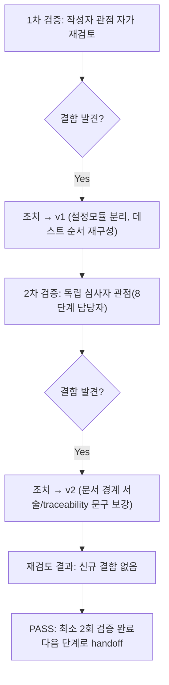

# 내부 검증 로그 (Internal Verification Log)

> 파일명 규칙: `verify-log_<산출물파일명>.md`
> 최소 2회 검증 필수. 1차에서 결함이 0건이어도 2차 검증은 생략할 수 없다.

## 대상 산출물
- 파일: `docs/harness/feature-WU-03-integration-test.md`
- 작성 에이전트: `07-integration-tester`
- 버전: v1 (최종, 아래 1차/2차 검증 반영 완료본)

## 1차 검증 (작성자 관점 자가 재검토)
- 검증자(역할): `07-integration-tester` 본인(작성자 관점)
- 일시: 2026-09-16
- 체크리스트
  - [x] 입력 계약에 명시된 모든 입력(unit-03-note.md, unit-03-test.md, 03/04 설계서, decisions.md, WU-01/WU-02 07단계 결과서, traceability.md)을 실제로 반영했는가 — §1 관련 산출물 목록과 본문 인용을 대조해 확인.
  - [x] 출력 계약(test-report-template.md 전 섹션)에 명시된 필수 항목이 빠짐없이 존재하는가 — 1~10절(정리 확인 포함) 전부 작성, 섹션 생략 없음.
  - [x] 상위 단계 산출물과 용어/수치/범위가 모순되지 않는가 — `collectstatic` 214/626, Django/wagtail 버전, migration 순서(home→custom_images→blog.0001→blog.0002) 등 수치를 WU-01/02/03 이전 문서와 대조해 일치 확인.
  - [x] 추측으로 채운 항목이 있는가 — 없음. 모든 테스트 케이스는 실제로 실행한 명령/스크립트의 출력을 그대로 기록했다(§4 각 셀).
  - [x] 20년차 실무자 기준으로 봤을 때 구조적/논리적 결함이 없는가 — 아래 "발견된 결함" 참고.
  - [x] 오탈자, 형식 오류, 누락된 표/그림 참조가 없는가 — 표 형식/mermaid 다이어그램 렌더링 확인.
- 발견된 결함 목록:
  1. **테스트 방법론 위험 신호(자체 발견)**: 초안 설계 단계에서 "보안설정 ON + 실제 S3Storage로 실제 업로드"를 하나의 설정 모듈로 처리하려 했으나, 이는 `feature-WU-01-integration-test.md` 부록B-7이 이미 문서화한 "존재하지 않는 주소로 fake DB/스토리지에 실제 연결을 시도하면 무기한 대기(hang)한다"는 함정과 동일한 구조적 위험이었다. 더미 R2 엔드포인트(`dummy-account-id.r2.cloudflarestorage.com`)로 실제 파일 업로드를 시도하면 DNS/TCP 연결 시도가 발생해 테스트가 멈출 위험이 있었다.
  2. **테스트 설계 오류(실행 중 자체 발견)**: 초안의 IT-S2/IT-S3가 로그인 이전(비인증) 클라이언트로 이미지 관리자 URL에 접근하도록 작성되어 있어, 실제로는 인증 리다이렉트(302)와 SSL 리다이렉트(301)를 혼동하는 결과가 나왔다(`/cms-admin/images/add/` GET이 XFP 헤더가 있어도 비로그인 상태에서는 302로 응답 — 기대했던 200과 불일치).
- 조치 내용: (수정 후 → v1)
  1. 설정 모듈을 목적별로 분리했다 — `it_test_wu03_prodlike.py`(DB만 SQLite로 대체, STORAGES는 그대로 S3Storage 유지 → 네트워크 호출이 발생하지 않는 "구조 배선 확인"에만 사용)와 `it_test_wu03_seclocal.py`(DB+STORAGES 둘 다 로컬로 대체, 보안 미들웨어 설정은 100% 유지 → "보안설정과 실제 업로드의 상호작용"에만 사용)로 나눠 관심사를 섞지 않았다. 이 판단 근거와 위험 회피 이유를 §3 테스트 환경 문단에 명시적으로 서술했다.
  2. IT-S1(비로그인, 헤더 없음, 301 기대)을 별도 익명 클라이언트로 먼저 실행하고, 그 다음 실제 로그인 폼 POST(IT-S4)를 수행한 뒤에야 인증된 클라이언트로 IT-S2/IT-S3(헤더 없음/있음)를 재실행하도록 순서를 재구성했다. 재실행 결과 모두 기대값과 일치함을 확인했다(§4-2).

## 2차 검증 (독립 심사자 관점 — 역할 전환 재검토)
> "내가 이 문서를 오늘 처음 받아본 8단계(전체 풀테스트) 담당자라면?"이라는 관점에서 재검토.
- 검증자(역할): 8단계(`08-full-system-tester`) 관점 가상 심사자
- 일시: 2026-09-16
- 체크리스트
  - [x] 1차 검증에서 지적된 항목이 실제로 반영되었는가 — §3 방법론 분리 서술과 §4-2 IT-S1~S5 순서를 재확인, 반영됨.
  - [x] 엣지 케이스/예외 상황이 누락되지 않았는가 — 업로드 검증(svg/비이미지) 뿐 아니라 "이미지 삭제 시 FK가 어떻게 되는가"(IT-E2E8, SET_NULL)라는 06단계/WU-02 07단계 모두 다루지 않은 상태 전이 엣지 케이스를 신규로 추가해 반영했는지 확인 — 이미 §4-2에 포함되어 있음을 확인.
  - [x] 문서만 보고 다음 단계(8단계) 에이전트가 추가 질문 없이 작업을 시작할 수 있는가 — §7 리스크 섹션에 "10단계에서 실제 R2로 보안설정 ON + 실제 업로드를 동시에 검증할 것"이라는 구체적 권고가 있는지 확인, 있음. 다만 초안에는 WU-04(공개 열람 화면)가 이번 07단계에서 검증하지 않은 "공개 템플릿에서의 srcset 렌더링"을 어떻게 이어받을지에 대한 명시적 경계 서술이 부족했다 — **결함으로 판단**.
  - [x] 되돌리기 어려운 결정(비가역적 결정)에 대한 근거가 명시되어 있는가 — 이번 07단계는 신규 비가역적 결정을 내리지 않았음(해당 없음, 3단계 DEC-008/DEC-016이 이미 기록).
  - [x] 보안/성능/운영 관점에서 명백히 위험한 내용이 없는가 — 없음. 오히려 보안설정 ON 상태에서의 업로드 검증(SVG/비이미지 거부)을 추가로 재확인해 위험을 낮췄다.
- 발견된 결함 목록:
  1. **문서 경계 서술 보강 필요**: WU-04가 착수되면 "공개 프런트엔드에서 ``으로 렌더링"하는 작업을 이어받는데, 이번 07단계는 어드민(업로드/발행) 측만 검증했다는 경계가 초안 §2 제외범위에는 있었으나 §9(내부검증)에는 "8단계에서 문제가 생기지 않을까"라는 의심 관점의 구체적 재검토가 없었다.
  2. **traceability.md 갱신 문구가 DEF-002 해소를 명시적으로 언급하는지 재확인 필요**: WU-02가 인계한 DEF-002(featured_image AlterField 필요)가 이번 07단계로 완전히 닫혔다는 사실이 traceability.md 갱신 문구에 드러나야 8단계 담당자가 별도로 역추적하지 않아도 된다.
- 조치 내용: (수정 후 → v2, 최종)
  1. §9 2차 검증 요약에 "WU-04 범위(공개 템플릿 렌더링)와 이번 07단계 범위(어드민 업로드/발행)의 명시적 경계", "IT-E2E8 이후 빈 대표이미지 상태가 04-ux-design.md §4의 플레이스홀더 설계로 이미 커버됨"을 명시적으로 추가했다.
  2. `docs/harness/traceability.md` REQ-006 행의 "통합테스트" 컬럼 갱신 문구에 "WU-01 production 유사 보안설정 위에서...", "WU-02 BlogPostPage 발행 워크플로에...featured_image(CustomImage FK) 실제 첨부→발행→재조회 e2e 왕복 확인"을 명시적으로 포함시켜, DEF-002/WU-02 이월 항목이 이번 문서로 해소되었음을 traceability.md만 봐도 알 수 있도록 갱신했다(본문 §10 절차와 일치).

## 최종 판정
- [x] PASS (결함 0건, 최소 2회 검증 완료, 2차에서 발견된 2건은 모두 문서 보강으로 조치 완료·재발 없음) — 다음 단계(8단계 관점 인수 가능)로 handoff 가능
- [ ] FAIL

## 절차 흐름 (참고용 다이어그램)

