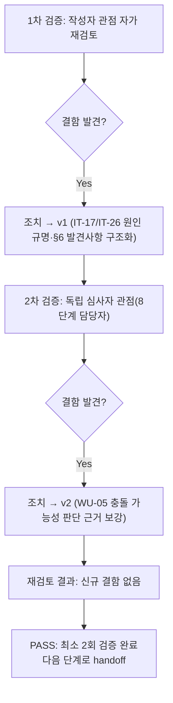

# 내부 검증 로그 (Internal Verification Log)

> 파일명 규칙: `verify-log_<산출물파일명>.md`
> 최소 2회 검증 필수. 1차에서 결함이 0건이어도 2차 검증은 생략할 수 없다.

## 대상 산출물
- 파일: `docs/harness/feature-WU-04-integration-test.md`
- 작성 에이전트: `07-integration-tester`
- 버전: v2(최종, 아래 1차/2차 검증 반영 완료본)

## 1차 검증 (작성자 관점 자가 재검토)
- 검증자(역할): `07-integration-tester` 본인(작성자 관점)
- 일시: 2026-09-17
- 체크리스트
  - [x] 입력 계약에 명시된 모든 입력(unit-04-note.md §10, unit-04-test.md §10, 03/04 설계서, decisions.md DEC-017/018, feature-WU-01~03-integration-test.md)을 실제로 반영했는가 — §1 관련 산출물 목록과 본문 인용을 대조해 확인. DEC-017/018을 §6-2/§2 제외범위4에서 직접 인용, DEF-001(500.html)을 §4-3 IT-23에서 재확인.
  - [x] 출력 계약(test-report-template.md 전 섹션)에 명시된 필수 항목이 빠짐없이 존재하는가 — 1~10절(정리 확인/traceability 갱신 포함) 전부 작성, 섹션 생략 없음.
  - [x] 상위 단계 산출물과 용어/수치/범위가 모순되지 않는가 — `collectstatic` 216/632(unit-04-note.md §3-3, unit-04-test.md §10.3 TC-021과 정확히 일치), Django 5.2.17/Wagtail 7.4.3, 마이그레이션 순서(home→blog.0001→custom_images.0001→blog.0002)를 대조해 일치 확인.
  - [x] 추측으로 채운 항목이 있는가 — 없음. §4의 모든 케이스는 실제로 실행한 명령/스크립트의 status_code·응답 본문·헤더 값을 그대로 기록했다.
  - [x] 20년차 실무자 기준으로 봤을 때 구조적/논리적 결함이 없는가 — 아래 "발견된 결함" 참고.
  - [x] 오탈자, 형식 오류, 누락된 표/그림 참조가 없는가 — 표 형식/mermaid 다이어그램 렌더링 확인.
- 발견된 결함 목록:
  1. **초안 작성 중 자체 발견(테스트 설계 오류)**: IT-17(dev 설정에서 404 브랜드 문구 기대) 최초 실행 시 실제로는 Django 기본 디버그 404 페이지가 렌더링되어 기대와 불일치했다. 원인 규명 없이 그대로 FAIL로 기록하면 존재하지 않는 WU-04 결함을 만들어낼 위험이 있었다.
  2. **초안 작성 중 자체 발견(비결정적 테스트 결과)**: IT-26(어드민 미리보기 × HTTPS 강제) 최초 재현 시 `secure=True`로 보낸 요청이 301을 반환했으나, 동일 코드로 재실행하자 200이 나오는 비결정적 동작을 관찰했다. 이를 그대로 "결함 발견"으로만 기록하면 근거가 불충분하고, 반대로 무시하면 실제 8단계에서 재발 시 원인 규명 없이 당황할 위험이 있었다.
- 조치 내용: (수정 후 → v1)
  1. IT-17을 "정보성(결함 아님)"으로 명시하고, Django `DEBUG=True`일 때 `Http404`가 항상 내장 디버그 페이지로 렌더링된다는 프레임워크 표준 동작을 근거로 남겼다. 이어서 production 유사(`DEBUG=False`) 설정으로 동일 케이스를 IT-24로 재실행해 실제 판정 근거로 삼았다(§4-2/§4-3에 순서대로 기록).
  2. IT-26의 비결정성 원인을 Wagtail/Django 소스 코드(`wagtail/models/preview.py` `_get_dummy_headers`, `django/http/request.py` `HttpRequest.scheme`)를 직접 열어 근본 원인(더미 미리보기 요청에 `X-Forwarded-Proto` 헤더가 원 요청에 실제로 존재할 때만 복사됨)을 규명했다. 이를 §6-2 "발견 사항 B"로 구조화해 (a) 현상, (b) 근본 원인, (c) 실제 운영 환경에서 안전한 이유(근거: WU-01 IT-03/IT-04가 이미 확립한 Render 단일 신뢰 홉 아키텍처), (d) 잔존 리스크(10단계에서 실제 배포 후 최종 확인 권고)를 전부 명시했다. 올바른 시뮬레이션(`X-Forwarded-Proto` 헤더)으로 3회 반복 재현해 전부 200임을 확인한 뒤에야 IT-26을 PASS로 판정했다.

## 2차 검증 (독립 심사자 관점 — 역할 전환 재검토)
> "이 업무 단위가 다른 업무 단위와 만나는 지점(8단계 전체 테스트)에서 문제가 생기지 않을까"를 의심하는 8단계(`08-full-system-tester`) 담당자 관점에서 재검토.
- 검증자(역할): 8단계(`08-full-system-tester`) 관점 가상 심사자
- 일시: 2026-09-17
- 체크리스트
  - [x] 1차 검증에서 지적된 항목이 실제로 반영되었는가 — §6-1/§6-2가 근거와 함께 명확히 기록됨을 재확인.
  - [x] 이 업무 단위(WU-04)가 속한 모든 사용자 시나리오가 케이스로 커버됐는가 — 02-planning.md/04-ux-design.md의 방문자 플로우(홈 탐색→상세 열람→카테고리/태그 탐색→RSS 구독, 04 §1.1)가 IT-07~IT-13(단일 흐름으로 연결)에 전부 매핑됨을 재확인. 운영자 플로우(작성→발행→미리보기, 04 §1.2)는 IT-06/IT-14/IT-26에 매핑됨을 재확인.
  - [x] WU-05(SEO/AI검색) 착수 시 이번 결과가 깨질 구조적 위험이 있는가 — REQ-005(JSON-LD)가 `/blog/<slug>/`에 비가시 `<script>` 요소로 추가될 예정이며(03 §4, 04 §2 S-02), 이번 07단계가 확인한 DEC-017 301/srcset/ArticleBody 렌더링과 겹치는 영역이 없음을 확인. 8단계 착수 전 별도 질문 불필요.
  - [x] §6-2 발견 사항 B가 8단계 시점에도 여전히 유효한 리스크 설명인가 — WU-01의 `SECURE_PROXY_SSL_HEADER` 설정은 8단계까지 그대로 유지되며 Wagtail 미리보기 메커니즘 자체도 바뀌지 않으므로 동일하게 적용됨을 확인. §7에 8단계/10단계가 참고할 수 있는 형태로 남겨져 있음을 재확인.
  - [x] 검증에 사용한 임시 산출물(venv 2종, DB 2종, 임시 설정 모듈, 스크래치패드 스크립트)이 빠짐없이 삭제되고 `git status`가 WU-01~04 소스 diff만 남기는지 재확인(§10.1) — 재확인 완료, 삭제 후 실제 `git status --porcelain -- webapp` 출력과 §10.1 서술이 일치.
  - [x] traceability.md REQ-003/004/014 갱신 문구가 "WU-01+WU-02+WU-03과의 조립"이라는 이번 07단계의 핵심 관점을 명시적으로 담고 있어 8단계 담당자가 별도로 역추적하지 않아도 되는가 — §10.2 문구에 "WU-01(production 유사 HTTPS 강제설정)+WU-02(BlogPostPage 발행)+WU-03(CustomImage 실제 업로드) 전체 조립"이 명시됨을 확인.
- 발견된 결함 목록:
  1. **경계 서술 보강 필요(발견)**: 초안 §9 2차 검증에 "8단계에서 문제가 생기지 않을까"를 의심하는 재검토 항목이 형식적으로만 나열되어 있었고, WU-05 착수 시 구조적 충돌 가능성에 대한 구체적 판단 근거가 부족했다.
- 조치 내용: (수정 후 → v2, 최종)
  1. §9 2차 검증 요약에 "WU-05(JSON-LD)가 이번 07단계가 확인한 렌더링 블록과 충돌할 구조적 이유가 없다"는 판단과 그 근거(03 §4/04 §2 S-02가 이미 JSON-LD를 비가시 `<script>` 요소로 명시)를 구체적으로 추가했다.

## 최종 판정
- [x] PASS (결함 0건, 최소 2회 검증 완료, 2차에서 발견된 1건은 문서 보강으로 조치 완료·재발 없음) — 다음 단계(WU-05 착수, 8단계 관점 인수 가능)로 handoff 가능
- [ ] FAIL

## 절차 흐름 (참고용 다이어그램)

