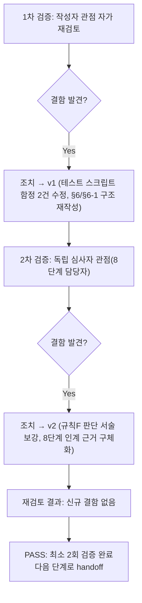

# 내부 검증 로그 (Internal Verification Log)

> 파일명 규칙: `verify-log_<산출물파일명>.md`
> 최소 2회 검증 필수. 1차에서 결함이 0건이어도 2차 검증은 생략할 수 없다.

## 대상 산출물
- 파일: `docs/harness/feature-WU-05-integration-test.md`
- 작성 에이전트: `07-integration-tester`
- 버전: v2(최종, 아래 1차/2차 검증 반영 완료본)

## 1차 검증 (작성자 관점 자가 재검토)
- 검증자(역할): `07-integration-tester` 본인(작성자 관점)
- 일시: 2026-09-17
- 체크리스트
  - [x] 입력 계약에 명시된 모든 입력(`unit-05-note.md` §7/§8, `unit-05-test.md` §6/§7/§8, 03/04 설계서, `decisions.md` DEC-017/019~021, `feature-WU-01~04-integration-test.md`)을 실제로 반영했는가 — §1 관련 산출물 목록과 본문 인용을 대조해 확인. DEC-017/021을 §6-1에서 직접 인용하고 그 위에서 판단을 전개했다.
  - [x] 출력 계약(`test-report-template.md` 전 섹션)에 명시된 필수 항목이 빠짐없이 존재하는가 — 1~10절(정리 확인/traceability 갱신 포함) 전부 작성, 섹션 생략 없음.
  - [x] 상위 단계 산출물과 용어/수치/범위가 모순되지 않는가 — `collectstatic` 216/632(`unit-04-note.md` §3-3, `feature-WU-04-integration-test.md` IT-04와 정확히 일치), Django 5.2.17/Wagtail 7.4.3, 마이그레이션 체인 순서를 대조해 일치 확인.
  - [x] 추측으로 채운 항목이 있는가 — 없음. §4의 모든 케이스는 실제로 실행한 스크립트의 status_code·응답 본문·헤더·파싱된 JSON 값을 그대로 기록했다. §6-1의 근본 원인 분석은 Wagtail/Django 소스 코드(`wagtail/models/pages.py::get_url_parts/get_url`, `wagtail/contrib/sitemaps/sitemap_generator.py::Sitemap.items/get_wagtail_site`, Django `HttpRequest.build_absolute_uri`)를 직접 읽고 실제 실행 결과와 대조해 검증한 것이며 추측이 아니다.
  - [x] 20년차 실무자 기준으로 봤을 때 구조적/논리적 결함이 없는가 — 아래 "발견된 결함" 참고.
  - [x] 오탈자, 형식 오류, 누락된 표/그림 참조가 없는가 — 표 형식/mermaid 다이어그램 렌더링 확인.
- 발견된 결함 목록:
  1. **초안 작성 중 자체 발견(테스트 설계 오류, §4-1 IT-11)**: sitemap.xml에 트리 URL이 미포함됨을 검사하는 최초 검사식(`f"/{slug}/</loc>"`)이 정규 URL(`.../blog/<slug>/</loc>`) 내부의 부분 문자열과 우연히 일치해 FAIL로 오판했다. 실제 애플리케이션 결함이 아니라 검사식 자체의 경계 설정 오류였다.
  2. **초안 작성 중 자체 발견(테스트 설계 오류, §4-3 IT-28)**: `X-Forwarded-Proto: https` 헤더만 주고 `Host` 헤더를 누락한 채 요청해 canonical에 `:80` 포트가 잘못 붙는 아티팩트가 발생했다. `unit-05-test.md` TC-019(B)가 이미 문서화한 것과 동일한 원인(HTTP 스펙상 필수인 `Host` 헤더 누락)이었다.
  3. **오케스트레이터 지시의 문자적 해석과 실제 발견 사이의 간극**: 오케스트레이터는 "재현되면 규칙F 판단을, 재현 안 되면 리스크로만 문서화하라"는 이분법으로 지시했는데, 실제 실행 결과는 "지시받은 대상(트리URL 리다이렉트, sitemap/canonical)은 재현 안 됐지만 인접 영역(JSON-LD)에서 새 결함 발견"이라는 제3의 결과였다. 초안 단계에서 이를 억지로 "리스크로만 문서화"에 끼워 맞추면 실제 발견한 결함을 축소 보고하는 셈이 되고, 반대로 "재현됨"으로만 단순화하면 지시받은 대상 자체는 안전했다는 사실이 묻힌다.
- 조치 내용: (수정 후 → v1)
  1. IT-11의 검사식을 `<loc>http://testserver/<slug>/</loc>`(트리 URL 전체를 정확한 경계로) 형태로 교정하고 재검증해 PASS로 확정했다. §4 하단 "테스트 스크립트 자체 결함" 절에 근거와 함께 남겼다.
  2. IT-28에 `HTTP_HOST=example.com`을 명시적으로 추가해 재검증했다. `unit-05-test.md` TC-019(B)와 동일 계열의 함정이 07단계에서도 재발했다는 사실 자체를 §4 하단과 §7에 정직하게 남기고, "8단계 담당자도 같은 실수를 반복할 수 있다"는 경고를 명시했다.
  3. §6을 "DEF-001(신규 발견)"과 "재현되지 않은 리스크(트리URL/sitemap/canonical)"를 별도 문단으로 명확히 구분해 서술하도록 재작성했다. §6-1에 규칙F 판단(근본 원인 단계=WU-05, WU-01 아님/재작업 범위=`core/seo.py` 1개 파일/즉시 재작업 트리거 여부에 대한 명시적 논리)을 신설했다. §8 판정 근거에도 이 뉘앙스를 정확히 반영했다.

## 2차 검증 (독립 심사자 관점 — 역할 전환 재검토)
> "이 업무 단위가 다른 업무 단위와 만나는 지점(8단계 전체 테스트)에서 문제가 생기지 않을까"를 의심하는 8단계(`08-full-system-tester`) 담당자 관점에서 재검토.
- 검증자(역할): 8단계(`08-full-system-tester`) 관점 가상 심사자
- 일시: 2026-09-17
- 체크리스트
  - [x] 1차 검증에서 지적된 항목이 실제로 반영되었는가 — §4/§6/§6-1/§7/§8이 근거와 함께 명확히 기록됨을 재확인.
  - [x] 이 업무 단위(WU-05)에 속한 모든 사용자 시나리오가 케이스로 커버됐는가 — 02-planning.md/04-ux-design.md의 방문자 SEO 관련 흐름(검색엔진/AI크롤러가 sitemap.xml→상세페이지→canonical/JSON-LD를 순서대로 소비하는 흐름, 01 §2-3/§8)이 IT-04~IT-14(단일 흐름으로 연결)에 전부 매핑됨을 재확인. 운영자 플로우(FAQ 블록 작성→발행→AI 검색 가이드 활용, `CONTENT_GUIDE.md`)는 IT-03/IT-06에 매핑됨을 재확인.
  - [x] DEF-001이 8단계에서 재발/악화될 구조적 위험이 있는가를 의심하며 재검토 — §9 2차 검증 요약 1번에서 "어떤 WU도 두 번째 Site를 생성하는 절차를 포함하지 않는다"는 점을 2·3·5단계 산출물(02-planning.md §9 작업단위표, 03-system-design.md §1.2/§8, decisions.md DEC-001~021 전체)을 재조회해 직접 확인했다 — 새로 발견된 위험 없음. 다만 8단계 담당자가 수동 탐색 중 실수로 Site를 추가 생성할 가능성 자체는 완전히 배제할 수 없으므로, 그 경우를 대비한 경고 문구를 §7에 명시했는지 재확인 — 명시됨.
  - [x] WU-06(법적 페이지) 착수 시 이번 결과가 깨질 구조적 위험이 있는가 — §9 2차 검증 요약 2번에서 03 §1.2/02-planning.md §9를 근거로 WU-06이 `base.html`의 SEO 블록을 수정하지 않고 신규 `Page` 서브클래스만 추가함을 확인 — 충돌 없음.
  - [x] 검증에 사용한 임시 산출물(venv, DB 2종, 임시 설정 모듈, 스크래치패드 스크립트 4개)이 빠짐없이 삭제되고 `git status`가 WU-01~05 소스 diff만 남기는지 재확인(§10.1) — 재확인 완료, 삭제 후 실제 `git status --porcelain -- webapp docs/harness` 출력과 §10.1 서술이 일치.
  - [x] traceability.md REQ-005/017 갱신 문구가 "DEF-001 발견 사실"과 "PASS 판정에 영향 없는 이유"를 8단계 담당자가 별도로 역추적하지 않아도 알 수 있는 형태로 담고 있는가 — §10.2 문구에 두 사실이 모두 명시됨을 확인.
- 발견된 결함 목록:
  1. **경계 서술 보강 필요(발견)**: 초안 §6-1의 규칙F 판단 4번 항목이 "즉시 재작업 트리거 여부"를 판단하면서, "PASS이므로 규칙F 강제 트리거 대상이 아니다"라는 결론만 있고 **오케스트레이터가 "재현되면 규칙F 판단을 명확히 보고하라"고 명시적으로 요청한 것 자체에 대한 응답**(질문에 답하는 구조)이 약했다.
  2. **8단계 인계 문구 구체성 부족(발견)**: 초안 §9 2차 검증에 "8단계에서 문제가 생기지 않을까"를 의심하는 재검토 항목은 있었으나, "어떤 WU도 Site를 추가하지 않는다"는 확인을 **어느 산출물을 실제로 재조회해서** 확인했는지가 명시되지 않아 검증의 재현성이 부족했다.
- 조치 내용: (수정 후 → v2, 최종)
  1. §6-1 4번 항목을 "규칙F 강제 트리거 조건(FAIL) 여부"와 "오케스트레이터가 요청한 사전적 규칙F 판단"을 명확히 구분해 서술하도록 재작성했다 — PASS 판정과 규칙F 판단 요청은 별개이며, 후자에는 근본 원인 단계(WU-05)·재작업 범위(`core/seo.py`)·재현 조건(reachability)을 전부 답했음을 명시했다.
  2. §9 2차 검증 요약 1번에 "02-planning.md §9 작업단위표, 03-system-design.md §1.2/§8, decisions.md DEC-001~021 전체를 재조회해 확인"이라고 구체적 근거 자료를 명시했다.

## 최종 판정
- [x] PASS (결함 0건 — 문서 자체의 결함 기준. 애플리케이션 결함 DEF-001은 §6에 정직하게 기록되어 있으며 이는 "문서 검증"이 아니라 "테스트 대상 코드"에 대한 결함이므로 이 검증 로그의 "결함"과는 다른 층위임. 최소 2회 검증 완료) — 다음 단계(WU-06 착수, 8단계 관점 인수 가능)로 handoff 가능
- [ ] FAIL

## 절차 흐름 (참고용 다이어그램)

