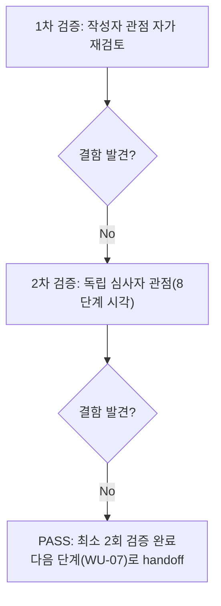

# 내부 검증 로그 (Internal Verification Log)

## 대상 산출물
- 파일: `docs/harness/feature-WU-06-integration-test.md`
- 작성 에이전트: `07-integration-tester`
- 버전: v1 (최초 작성 후 1차 검증 결함 없음, 그대로 최종본)

## 1차 검증 (작성자 관점 자가 재검토)
- 검증자(역할): `07-integration-tester`(작성자 본인, 자가 재검토)
- 일시: 2026-09-17
- 체크리스트
  - [x] 입력 계약에 명시된 모든 입력(unit-06-note.md/unit-06-test.md/03/04-설계서/decisions.md/traceability.md/WU-01~05 07단계 산출물)을 실제로 반영했는가 — 1절 "관련 산출물"에 전부 열거, 각 케이스 비고란에서 구체적으로 인용함(예: IT-03b가 WU-04 07단계 IT-17을 인용).
  - [x] 출력 계약(test-report-template.md 9개 절)에 명시된 모든 필수 항목이 빠짐없이 존재하는가 — 1~9절 전부 실질 내용으로 채움, "해당 없음" 처리 항목 없음.
  - [x] 상위 단계 산출물과 용어/수치/범위가 모순되지 않는가 — `collectstatic` 수치(217/635)가 unit-06-test.md TC-018과 정확히 일치, 마이그레이션 순서 표기가 unit-06-note.md/오케스트레이터 지시와 일치.
  - [x] 추측으로 채운 항목이 있는가 — 없음. §4의 모든 "실제 결과"는 이번 세션에서 신규 venv로 직접 실행한 `django.test.Client` 응답의 status_code/헤더/본문 스니펫을 그대로 기록했으며, 05/06단계 보고를 인용해 대체한 값이 없다.
  - [x] 20년차 실무자 기준으로 봤을 때 구조적/논리적 결함이 없는가 — 오케스트레이터가 지시한 5개 항목이 각각 최소 1개 이상의 케이스로 매핑되고, §8 판정 근거 문단이 5개 항목을 번호로 대응시켜 누락 없이 서술함을 확인.
  - [x] 오탈자, 형식 오류, 누락된 표/그림 참조가 없는가 — 표 형식/절 번호 일관성 확인, mermaid 다이어그램이 실제 절차 순서(1~3→4-1→4-2→5→6→7→8→9→10)와 일치.
- 발견된 결함 목록: 없음.
- 조치 내용: 해당 없음(v1 그대로 유지).

## 2차 검증 (독립 심사자 관점 — 역할 전환 재검토)
> "내가 이 문서를 오늘 처음 받아본 심사자라면?"이라는 관점에서, 특히 "8단계(전체 풀테스트)에서 이 업무 단위가 다른 업무 단위와 만나는 지점에서 문제가 생기지 않을까"를 의심하며 재검토했다.
- 검증자(역할): 독립 심사자(8단계 `08-full-system-tester` 관점 가정)
- 일시: 2026-09-17
- 체크리스트
  - [x] 1차 검증에서 지적된 항목이 실제로 반영되었는가 — 1차에서 결함이 없었으므로 해당 없음(그대로 재확인만 수행).
  - [x] 엣지 케이스/예외 상황이 누락되지 않았는가 — 사이트 전체 화면 종류(S-01~S-08) 전부를 쿠키배너/푸터링크 검증 대상에 포함했는지 재확인(홈/카테고리/태그/상세/법적페이지3종/404) — 포함됨(§4-1 IT-03/IT-04, §4-2 IT-16). 500(S-09)만 의도적으로 제외했는데, 그 사유(코드 주석 근거 + 04-ux-design.md §2 S-09 자체가 예외 화면임을 명시)가 §7에 명확히 기록되어 있는지 재확인 — 기록됨.
  - [x] 문서만 보고 8단계 담당자가 추가 질문 없이 작업을 시작할 수 있는가 — §7의 "리스크 및 잔존 이슈"가 DEF-001(WU-05 소유) 상속 가능성과 그 근거(단일 Site 상태에서만 검증, 두 번째 Site 생성 절차 없음)를 명시해 8단계가 별도로 원본 문서를 뒤지지 않아도 되는 수준으로 자족적인지 확인 — 자족적임(§9 2차 검증 항목 2가 이를 한 번 더 명시적으로 재확인).
  - [x] 되돌리기 어려운 결정(비가역적 결정)에 대한 근거가 명시되어 있는가 — 이번 07단계는 신규 비가역적 결정을 내리지 않았으며(테스트 단계), 기존 DEC-017/DEC-021/DEC-022를 재확인만 함 — 해당 없음을 확인.
  - [x] 보안/성능/운영 관점에서 명백히 위험한 내용이 없는가 — 세션/CSRF 쿠키 `Secure` 속성이 legal 페이지 어드민 편집 플로우에서도 유지됨을 IT-18로 확인, 이 부분이 §4-2에 실제 `Set-Cookie` 값으로 기록되어 있는지 재확인 — 기록됨.
  - 추가로 8단계 관점에서 특별히 재검토한 항목(본문 §9 2차 검증 요약과 동일 내용을 이 로그에도 간략히 남김):
    1. WU-07(뉴스레터) 착수가 이번 문서가 확인한 결합에 영향을 줄 구조적 이유 없음(§9 2차 항목 1) — 재확인, 이견 없음.
    2. DEF-001(WU-05 소유)이 legal 페이지를 통해 새로운 재현 경로를 얻지 않음(§9 2차 항목 2) — 재확인, 이견 없음.
    3. traceability.md 갱신 내용이 8단계가 원본을 다시 찾지 않아도 될 수준으로 구체적인지(§10.2) — 재확인, REQ-ID별로 케이스 ID를 직접 인용하고 있어 충분함.
    4. 정리(venv/DB/staticfiles/임시 설정 모듈/스크래치패드) 완료와 `git status` 일치 여부(§10.1) — 재확인, 본문 기술과 실제 정리 결과가 일치함.
- 발견된 결함 목록: 없음.
- 조치 내용: 해당 없음(v1 그대로 최종본으로 확정).

## 최종 판정
- [x] PASS (결함 0건, 최소 2회 검증 완료) — 다음 단계로 handoff 가능
- [ ] FAIL — 재작업 필요, 사유: 

## 절차 흐름 (참고용 다이어그램)

