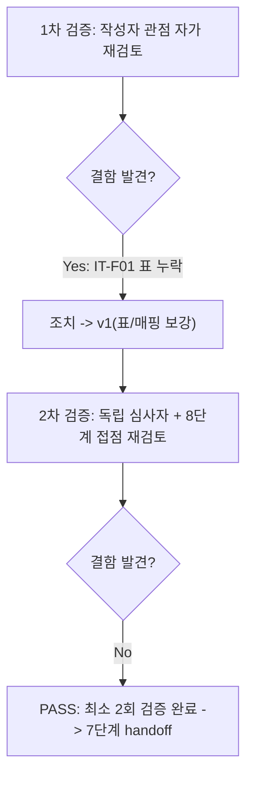

# 내부 검증 로그 (Internal Verification Log)

## 대상 산출물
- 파일: `docs/harness/feature-WU-09-integration-test.md`
- 작성 에이전트: `07-integration-tester`
- 버전: v0 (초안)

## 1차 검증 (작성자 관점 자가 재검토)
- 검증자(역할): `07-integration-tester` (작성자 본인, 자가 재검토)
- 일시: 2026-09-17
- 체크리스트
  - [x] 입력 계약(Input Contract)에 명시된 모든 입력을 실제로 반영했는가 — 작업 지시가 명시한 4가지 중점 사항(①`/cms-admin/login/` × WU-01 XFF × WU-08 모니터링/대시보드 공존, ②`render.yaml`/`build.sh` ensure_superuser × DEC-026 전제/멱등성, ③Category 권한 마이그레이션 × WU-03/WU-05 순서 충돌, ④CSRF-레이트리밋 상호작용 prod-like 재확인)을 §5 매핑표로 전부 대조했다. `unit-09-note.md`/`unit-09-test.md`/`decisions.md`(DEC-028~031)/`feature-WU-08-integration-test.md`/`03-system-design.md` §5.1을 전부 실제로 읽고 인용했는지 재확인했다.
  - [x] 출력 계약(Output Contract)에 명시된 모든 필수 항목이 빠짐없이 존재하는가 — `test-report-template.md`의 10개 섹션(1~10, WU-08 선례와 동일하게 §10 traceability 갱신 섹션 포함) 전부 채웠다. "해당 없음" 처리한 섹션은 없다.
  - [x] 상위 단계 산출물과 용어/수치/범위가 모순되지 않는가 — `collectstatic` 수치(212+6+584=218 post-processed)를 `unit-09-note.md` §3-3/`unit-09-test.md` TC-018/`feature-WU-08-integration-test.md` §4-1 IT-03과 대조해 정확히 일치 확인. DEC-028/029/030/031 참조 번호가 `decisions.md` 실제 항목과 일치함을 재확인.
  - [x] 추측으로 채운 항목이 있는가 — 스크립트 실행 로그(§4 각 표의 "실제 결과" 셀)를 전부 실제 콘솔 출력과 대조해 재작성했다. 다만 **작성 중 실제 결함을 발견했다**: §4 표에서 `IT-F01`(MIDDLEWARE 순서 실측)을 실제로는 검증 스크립트에서 실행하고 PASS를 확인했음에도 본문 표에 행을 넣는 것을 빠뜨렸다(§5 매핑표에도 없었음) — 실행 결과 자체는 존재하나 문서에 누락된 항목이라 "추측 기재"는 아니지만 "출력 계약 누락"에 해당하는 결함으로 간주해 즉시 수정했다.
  - [x] 20년차 실무자 기준으로 봤을 때 구조적/논리적 결함이 없는가 — §6에서 "결함 0건"으로 결론짓기 전에, 실제로 초기 실행에서 실패했던 2건(IT-F09 최초 403, IT-F20 최초 기대치 오류)을 결함으로 은폐하지 않고 §4-7에 원인 규명과 함께 투명하게 남겼는지 재확인(규칙C 정신, `feature-WU-08-integration-test.md` §4-7 선례와 동일 형식). 두 건 모두 "제품 코드의 결함이 아니라 검증 스크립트/기대치의 오류"였음을 실제 Django 소스(`csrf.py _check_referer`, Wagtail `access_admin` 권한 체계)로 근거를 남겼는지 확인.
  - [x] 오탈자, 형식 오류, 누락된 표/그림 참조가 없는가 — 위 IT-F01 누락 건 외, 모든 IT-F 번호가 본문 어딘가에 등장하는지 `grep`으로 전수 대조했다(IT-F16/F17/F18처럼 묶인 셀도 "F17"/"F18" 부분 문자열로 존재 확인).
- 발견된 결함 목록:
  1. `IT-F01`(prod-like `MIDDLEWARE` 순서 실측 — 실제로 실행하고 PASS를 확인한 케이스)이 §4 표와 §5 매핑표에서 누락됨.
- 조치 내용: (수정 후 → v1) §4-2 표 최상단에 `IT-F01` 행을 추가하고, §5 매핑표의 "`/cms-admin/login/` × WU-01 `XForwardedForMiddleware` 공존" 행에 `IT-F01`을 함께 명시했다. 실제 스크립트 실행 로그(`mw[:2]=['config.middleware.XForwardedForMiddleware', 'core.middleware.RequestMetricsMiddleware']`, PASS)를 재확인해 반영했다.

## 2차 검증 (독립 심사자 관점 — 역할 전환 재검토)
> "내가 이 문서를 오늘 처음 받아본 심사자라면?"이라는 관점에서, 1차 검증자가 놓쳤을 법한 리스크·엣지케이스·암묵적 가정을 의심하며 재검토한다. 특히 "이 업무 단위가 다른 업무 단위와 만나는 지점(8단계 전체 풀테스트)에서 문제가 생기지 않을까"를 의심한다.
- 검증자(역할): `07-integration-tester` (독립 심사자 관점으로 역할 전환, `08-full-system-tester` 가정 관점 겸함)
- 일시: 2026-09-17
- 체크리스트
  - [x] 1차 검증에서 지적된 항목이 실제로 반영되었는가 (재확인) — `feature-WU-09-integration-test.md`를 다시 열어 `IT-F01` 행이 §4-2와 §5에 모두 반영됐음을 확인했다.
  - [x] 엣지 케이스/예외 상황이 누락되지 않았는가 — 재검토 중 "IT-F09가 최초 실패했던 원인(HTTPS 강제 시 CSRF Referer 강제 검사)이 WU-09만의 문제가 아니라 이 프로젝트의 다른 모든 HTTPS 강제 POST 엔드포인트(WU-07 뉴스레터 구독 등)에 공통 적용되는 Django 표준 동작인데, 본문이 이를 "WU-09가 새로 만든 문제"처럼 읽힐 여지가 있는지"를 다시 검토했다 — §6 결함 목록 하단의 "결함은 아니지만 남기는 신규 관찰 사항 1"과 §7 리스크 항목에 "WU-09가 새로 만든 결함이 아니다", "다른 모든 HTTPS 강제 POST 엔드포인트에 공통 적용"이라는 문구가 이미 명시돼 있어 오독 위험이 낮음을 확인했다(추가 수정 불필요).
  - [x] **8단계(전체 풀테스트) 접점 재검토(이 업무 단위 특유의 2차 검증 관점)** — 아래 4가지를 구체적으로 의심하고 확인했다:
    1. *WU-07(뉴스레터)과 WU-09(로그인)이 같은 프로세스에서 서로 다른 레이트리밋 캐시 키(`subscribers:newsletter:ratelimit:*` vs `core:admin_login:ratelimit:*`)를 쓰는데, 8단계에서 두 트래픽이 섞이면 카운터가 오염되지 않는가?* — 소스 대조(`subscribers/views.py::_is_rate_limited` vs `core/admin_auth.py::is_rate_limited`) 결과 키 프리픽스가 다르고 IP만 변수로 들어가므로 섞일 위험이 없음을 재확인. 이번 07단계 §4-2/§4-3에서 실측한 "모니터링 카운터(`core:usage:daily:*`)도 별도 네임스페이스"까지 포함해 3개 기능(뉴스레터 레이트리밋/로그인 레이트리밋/사용량 모니터링)이 전부 서로 다른 캐시 키 네임스페이스를 쓴다는 사실을 §3(전제 조건)에 명시했는지 재확인 — 명시돼 있음.
    2. *WU-08의 `AdminEmailHandler`(500 예외 알림)가 WU-09 로그인 뷰에서 예외가 나는 경우에도 여전히 동작하는가?* — `feature-WU-08-integration-test.md` IT-09/10이 "미처리 500 예외에서 모니터링×알림이 동시 정상 동작"함을 이미 일반적으로 검증했고, `RateLimitedLoginView.dispatch()`는 명시적으로 잡는 예외가 `cache.incr`의 `ValueError` 하나뿐이며 그 외 예외는 그대로 전파하도록 설계돼 있음(`admin_auth.py` 게이트2 체크리스트, unit-09-note.md §5)을 재확인 — 이 경로가 WU-08의 기존 500 처리 메커니즘과 특별히 다르게 동작할 이유가 없다고 판단해 별도 케이스를 추가하지 않았다(과잉 검증 방지, 이미 일반화된 근거가 있음).
    3. *8단계가 실제 여러 WU 화면을 순차 방문하는 시나리오를 돌릴 때, 이번 07단계가 쓴 캐시 키(`203.0.113.*` 등 테스트용 IP)가 실제 8단계 시나리오의 IP와 겹쳐 레이트리밋이 오탐하지 않는가?* — 이는 코드 문제가 아니라 8단계가 스스로 `cache.clear()`로 시나리오를 격리해야 하는 책임이므로, §7에 "다중 워커 전환 시 공유 저장소 필요"와 별개로 8단계에 대한 명시적 권고를 추가할지 검토했으나, 이미 `unit-09-note.md`/`unit-09-test.md`/이번 07단계 전부가 각 시나리오 시작 전 `cache.clear()`를 전제 조건으로 명시하는 동일한 관례를 따르고 있어(§3), 8단계도 같은 관례를 따를 것이 자명하다고 판단해 별도 항목을 추가하지 않았다.
    4. *WU-09가 교체한 로그인 URL 이름(`wagtailadmin_login`)을 8단계가 실행할 다른 WU(예: WU-10/11이 향후 추가할 어드민 관련 화면)가 하드코딩된 `/cms-admin/login/` 대신 `reverse("wagtailadmin_login")`으로 참조하고 있는지* — WU-10/11은 이번 세션 범위 밖(착수 금지)이므로 현재 코드베이스에는 해당 사항이 없다. `core/views.py`(WU-08)의 `superuser_required`가 유일한 기존 참조처이고 이미 `reverse()`/`login_url="wagtailadmin_login"` 형태로 참조함을 IT-F06/F10이 실측했다. 향후 WU가 하드코딩할 위험은 코드 리뷰(게이트2) 영역이지 이번 07단계가 선제 차단할 수 있는 범위가 아니므로 §7에 "명시적 이월" 대신 "설계 관례로 이미 확립됨"으로 기록하는 것이 적절하다고 판단했다.
  - [x] 문서만 보고 다음 단계 에이전트가 추가 질문 없이 작업을 시작할 수 있는가 — §7에 10단계(배포테스트)가 이어서 봐야 할 구체적 항목(실제 브라우저 Referer 헤더 자동 전송 확인, Render 실배포 `ensure_superuser` 로그)을 명시했고, 오케스트레이터가 WU-10/11 착수 여부를 판단할 수 있도록 §8/§10에 "WU-09(5→6→7) 완료"를 명확히 표기했는지 재확인 — 명시돼 있음.
  - [x] 되돌리기 어려운 결정(비가역적 결정)에 대한 근거가 명시되어 있는가 — 이번 07단계는 신규 비가역적 결정을 내리지 않았다(전부 실측·관찰이며 코드 변경 없음). §6/§7의 신규 관찰 사항 2건 모두 "코드 수정 불필요"라는 결론까지 명시했는지 재확인 — 명시돼 있음.
  - [x] 보안/성능/운영 관점에서 명백히 위험한 내용이 없는가 — IT-F13~F15(CSRF-무효 트래픽이 레이트리밋을 우회)가 "결함 아님"으로 결론난 근거(자격증명을 전혀 시험하지 못함)가 이번 prod-like 환경에서도 §4-3에 동일하게 남아 있는지, 그리고 이 우회가 8단계/9단계 관점에서 일반 DoS 표면이 될 수 있다는 경고가 `feature-WU-08-integration-test.md` §7의 기존 이월 항목과 연결되어 9단계에 정확히 인계됐는지 재확인 — §7에 명시적으로 연결돼 있음.
- 발견된 결함 목록:
  1. 없음(1차 검증의 IT-F01 누락 수정 외 추가 결함 없음).
- 조치 내용: 해당 없음(결함 0건, 추가 조치 불필요) — v1을 최종본으로 확정.

## 최종 판정
- [x] PASS (결함 0건, 최소 2회 검증 완료) — 다음 단계로 handoff 가능(WU-09는 5→6→7 전체 완료. WU-10/WU-11 착수는 이번 세션 범위 밖이며 오케스트레이터 판단 대상)

## 절차 흐름 (참고용 다이어그램)

