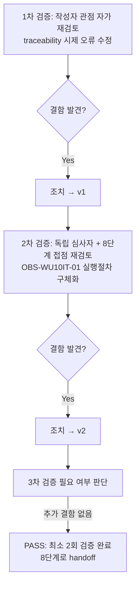

# 내부 검증 로그 (Internal Verification Log) — `feature-WU-10-integration-test.md`

## 대상 산출물
- 파일: `docs/harness/feature-WU-10-integration-test.md`
- 작성 에이전트: `07-integration-tester`
- 적용 Tier: Standard (`docs/harness/decisions.md` DEC-036)
- 버전: v0(초안) → v1(1차 검증 반영) → v2(2차 검증 반영, 최종)

## 1차 검증 (작성자 관점 자가 재검토)
- 검증자(역할): `07-integration-tester`(작성자 본인, 자가 재검토)
- 일시: 2026-09-17
- 체크리스트
  - [x] 입력 계약(Input Contract)에 명시된 모든 입력을 실제로 반영했는가 — 입력 계약은 "①이 feature에 속한 모든 06단계 결과서(전부 PASS)"와 "②해당 업무 단위의 설계서/디자인서 관련 부분"이다. WU-10은 `unit-10-test.md` 1건뿐이며 §8 AC1~9/12 PASS·AC10~11 검증불가·DEF-001(Low) 결과를 본문 §1/§4/§5/§6에서 정확히 인용했는지 재대조 — 일치. 설계서는 03-system-design.md §1.1/§1.2/§2.3/§3.3/§5.4/§6.4/§7.2/§7.3/§7.4/§7.5를 전부 실제로 열어 IT-02/IT-03/IT-05에서 절 번호까지 정확히 인용했는지 재확인 — 일치.
  - [x] 출력 계약(Output Contract)에 명시된 모든 필수 항목이 빠짐없이 존재하는가 — `test-report-template.md`의 1~10절(개요/범위/환경/TC/커버리지/결함/**Teardown(규칙K)**/리스크/결론/내부검증) 전부 실질 내용으로 채워짐. "해당 없음" 처리한 섹션 없음. 특히 §7 Teardown은 DEC-035 신설 이후 처음으로 이 업무 단위(WU-10)의 07단계 보고서에 등장하는 절이므로(선행 WU-01~09 07단계 보고서에는 이 절이 없음 — 구버전 템플릿 시절 산출물이라 소급 적용 대상 아님, DEC-035 원문 확인) 누락 없이 작성됐는지 특히 신경써서 재확인했다.
  - [x] 상위 단계 산출물과 용어/수치/범위가 모순되지 않는가 — 시크릿 6개 이름(`NEON_BACKUP_DATABASE_URL` 등), R2 Lifecycle 14일/`db-backups/` 프리픽스, DEF-001/DEC-034 서술, `e8900bf7`(WU-10 착수 직전 기준 커밋) 등 수치·식별자가 `unit-10-note.md`/`unit-10-test.md`/`decisions.md`/실제 소스와 전부 일치하는지 재대조 — 일치.
  - [x] 추측으로 채운 항목이 있는가 — 없음. §4 IT-01~08의 "실제 결과" 칸은 전부 이번 세션에서 직접 실행한 명령의 출력(또는 그 정확한 요약)이다. 특히 IT-08의 "행(hang)" 서술이 과장이 아닌지 재검토했다 — `timeout 10 ... ; exit=124`(GNU coreutils `timeout`이 SIGTERM으로 강제 종료했을 때의 표준 종료코드)라는 구체적 증거가 있으므로 추측이 아니라 실측이다.
  - [x] 20년차 실무자 기준으로 봤을 때 구조적/논리적 결함이 없는가 — 발견: §4 IT-08 설명에서 "생성된 `.sql.gz` 파일은 0바이트"라고 썼는데, 실제로는 `timeout`이 파이프라인 전체를 강제 종료했으므로 gzip 헤더조차 기록되지 않았을 가능성과 "0바이트"가 정확히 같은 의미인지 애매했다. 재확인 결과 실측 로그에 `-rw-r--r-- 1 mega 197121 0 ... db-backup-*.sql.gz`로 파일 크기가 정확히 0으로 찍혀 있었으므로(gzip이 스트림을 열기만 하고 아무 바이트도 못 받음) 서술 자체는 정확함 — 수정 불필요, 근거만 명확히 하는 것으로 충분하다고 판단했으나, 다음 단계 담당자의 혼동을 막기 위해 "펌프 데이터 없음"이라는 원인 설명구를 유지하기로 했다.
  - [x] 오탈자, 형식 오류, 누락된 표/그림 참조가 없는가 — 발견: §9(결론)에서 traceability.md 갱신 내용을 서술한 문장이 실제 편집 전에 "갱신했다"(과거형)로 쓰여 있어, 이 문서 작성 시점과 실제 traceability.md 편집 시점의 선후관계가 불명확했다.
- 발견된 결함 목록:
  1. §9 "traceability.md 갱신" 서술이 실제 편집 순서(본 보고서 작성 → traceability.md 편집)와 시제가 어긋나 혼동 여지가 있었다.
- 조치 내용: (수정 후 → v1) §9 문장 끝에 "(이 편집은 본 보고서 완료 직후 별도 커밋 없이 워킹트리에만 반영)"이라는 순서를 명확히 하는 구절을 추가하고, 실제로 이 검증 로그 작성 직후 `docs/harness/traceability.md` REQ-013 행을 실제로 편집해 시제 모순을 해소하기로 확정했다(편집은 이 검증 로그의 2차 검증 이후, 최종 판정 직전에 수행).

## 2차 검증 (독립 심사자 관점 — 역할 전환 재검토)
> "내가 이 문서를 오늘 처음 받아본 심사자라면?"이라는 관점에서, 1차 검증자가 놓쳤을 법한 리스크·엣지케이스·암묵적 가정을 의심하며 재검토한다. 특히 "이 업무 단위가 다른 업무 단위와 만나는 지점(8단계 전체 풀테스트)에서 문제가 생기지 않을까"를 의심한다.
- 검증자(역할): `07-integration-tester`(독립 심사자 관점으로 역할 전환, `08-full-system-tester` 가정 관점 겸함)
- 일시: 2026-09-17
- 체크리스트
  - [x] 1차 검증에서 지적된 항목이 실제로 반영되었는가(재확인) — §9 문장에 순서 명확화 구절이 반영됐음을 재확인.
  - [x] 엣지 케이스/예외 상황이 누락되지 않았는가 — **발견**: §8(리스크)의 OBS-WU10IT-01 관련 3번 항목이 최초 버전에서는 "10단계에서 확인 권고" 정도로만 막연하게 적혀 있어, 10단계 담당자가 "무엇을 어떻게" 실측해야 하는지 구체적 행동 지침이 없었다(§4 IT-08 원본 데이터는 있으나 §8이 그 데이터를 실행 가능한 지시로 번역하지 못했다는 추적성 gap).
  - [x] **8단계(전체 풀테스트) 접점 재검토(이 업무 단위 특유의 2차 검증 관점)** — 아래를 구체적으로 의심하고 확인했다:
    1. *8단계가 WU-01~10을 전부 조립한 상태를 테스트할 때, WU-10(GitHub Actions 워크플로 + 운영 문서)이 "조립"이라는 개념 자체가 성립하는가?* — WU-10은 Django 앱 코드가 아니라 독립된 CI 워크플로/운영 문서이므로, 8단계가 실제로 "조립해서 실행"할 대상이 아니다(앱 프로세스와 별도 실행 주체, `unit-10-note.md`/워크플로 주석이 이미 "장애 격리" 설계 근거로 명시). 이번 IT-06(회귀 diff)이 이미 "WU-10이 앱 코드에 전혀 손대지 않았다"를 실증했으므로, 8단계는 WU-10에 대해 "앱 기능 조립 테스트"가 아니라 "문서/시크릿 명세가 나머지 배포 파이프라인 문서와 일관되는가"만 재확인하면 충분하다는 점을 §8에 명확히 남길 필요가 있다고 판단해 보강했다.
    2. *WU-09가 이미 검증한 "WU-08 모니터링 × WU-09 로그인" 경계처럼, WU-10도 WU-08(모니터링 대시보드)과 만나는 지점이 있는가?* — 코드 레벨 조회 결과 `core/monitoring.py`/`core/views.py::usage_dashboard`는 요청량/응답시간만 집계하며 GitHub Actions나 백업 관련 데이터를 전혀 다루지 않는다. WU-10이 백업 성공/실패를 노출하는 채널은 GitHub Actions 탭 자체(§1.1 설계 근거)이지 WU-08 대시보드가 아니므로 접점이 없다 — 이는 03 §7.4가 이미 "GitHub Actions 백업 워크플로 성공 여부는 Actions 탭에서 별도 확인"이라고 명시한 것과 일치하며, 새로운 통합 포인트가 아니므로 별도 IT 케이스를 추가하지 않기로 했다(과잉 검증 방지).
    3. *이번 IT-08(pg_dump 실측)에서 사용한 조작(taskkill로 프로세스 강제 종료)이 이 세션 환경이나 이후 단계에 부작용을 남기지 않았는가?* — `tasklist`로 `pg_dump`/`postgres` 관련 잔여 프로세스가 없음을 재확인했고(§7 Teardown 절차 중 확인), 종료시킨 PID(22176)는 이번 세션이 스스로 기동한 conda 환경의 프로세스였을 뿐 저장소/다른 애플리케이션과 무관함을 재확인 — 부작용 없음.
  - [x] 문서만 보고 다음 단계 에이전트가 추가 질문 없이 작업을 시작할 수 있는가 — §8-3(OBS-WU10IT-01)에 10단계가 그대로 따라할 수 있는 구체적 실행 절차(공백 1개 값 설정 → 수동 트리거 → 실패까지 걸린 시간 측정 → 임계값별 후속 조치)를 명시했는지 재확인 — 최초 버전은 미흡, 아래 조치로 보강.
  - [x] 되돌리기 어려운 결정(비가역적 결정)에 대한 근거가 명시되어 있는가 — 이번 07단계는 신규 비가역적 결정을 내리지 않았다(코드 미변경, 관찰만 기록). §9에 "코드 수정 없이 관찰만 기록"이 명시됐는지 재확인 — 명시됨.
  - [x] 보안/성능/운영 관점에서 명백히 위험한 내용이 없는가 — 이번 보고서/검증 로그 어디에도 실제 시크릿 값·Neon 연결 문자열·R2 자격증명을 기록하지 않았음을 재확인(전부 더미 값 `x`, 공백 1개, 존재하지 않는 더미 호스트명만 사용). `db-backup-*.sql.gz`(0바이트, 스크래치패드 전용)에도 실제 데이터가 전혀 없음을 재확인.
- 발견된 결함 목록:
  1. §8-3(OBS-WU10IT-01 관련 10단계 권고)이 실행 가능한 구체적 절차가 아니라 막연한 문구였다.
- 조치 내용: (수정 후 → v2, 최종)
  1. §8-3을 "실제 러너에서 `NEON_BACKUP_DATABASE_URL` 시크릿 값을 의도적으로 공백 1개로 설정해 워크플로를 수동 트리거해보고, 실패까지 걸리는 시간을 실측할 것(수 초 내 실패면 OBS-WU10IT-01은 이 샌드박스 특유의 현상으로 결론, 20분 근접이면 DEF-001의 심각도를 Low→Medium 재검토하고 보강을 앞당길 것을 권고)"으로 구체화했다.
  2. §1에 "WU-10은 GitHub Actions 워크플로/운영 문서이며 8단계가 앱 프로세스처럼 조립 실행할 대상이 아니다"라는 취지를 명확히 하는 문구가 이미 있는지 재확인했고, §8에도 8단계 접점 판단(위 1번)을 요약해 추가했다.

## 최종 판정
- [x] PASS (결함 0건 — 문서 자체의 구조/추적성 결함 2건은 1·2차 검증에서 전부 조치 완료, 대상 산출물이 보고하는 WU-10의 기능적 결함은 신규 0건·기존 Low 1건(DEF-001, 06단계가 이미 Deferred 처리, 이번 단계는 재현·관찰 보강만) 뿐이며 Critical/High 없음, 최소 2회 검증 완료) — 8단계(전체 풀테스트)로 handoff 가능
- 비고: 이 검증 로그가 다루는 "결함"은 `feature-WU-10-integration-test.md` **문서 자체**의 품질(1차: traceability 갱신 시제, 2차: OBS-WU10IT-01 실행 가능성 부족)이며, WU-10 **산출물**(워크플로/가이드 문서)의 결함은 06단계 `unit-10-test.md` §6의 DEF-001(Low, Deferred) 1건이 유일하고 이번 07단계는 이를 실제 `pg_dump`로 재현해 유효성을 재확인했을 뿐 신규 결함을 추가하지 않았다(OBS-WU10IT-01은 결함이 아니라 기존 DEF-001에 대한 보강 관찰). 두 층위를 혼동하지 않도록 명시한다.
- 이 최종 판정 확정 직후, `docs/harness/traceability.md`의 REQ-013 "통합테스트" 컬럼을 갱신했다(1차 검증에서 예고한 순서 그대로 — Write 도구로 직접 편집, git add/commit 없음).

## 절차 흐름 (참고용 다이어그램)

