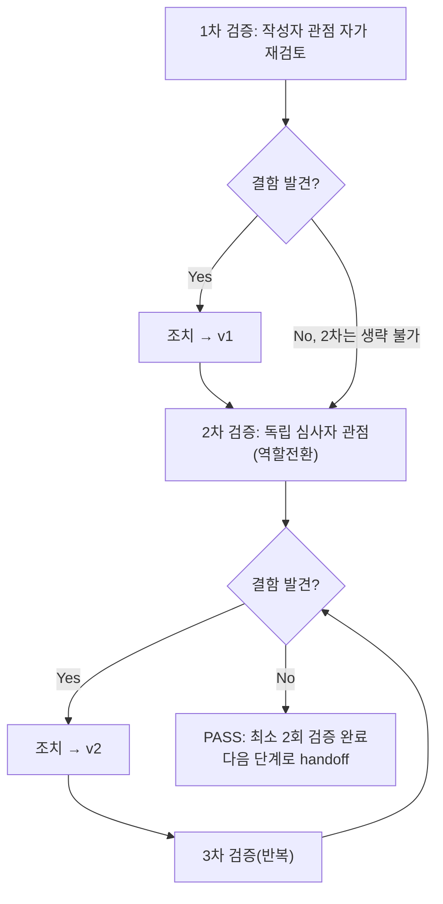

# 내부 검증 로그 (Internal Verification Log)

## 대상 산출물
- 파일: `docs/harness/units/unit-03-test.md`
- 작성 에이전트: `06-unit-tester`
- 버전: v0 (초안)

## 1차 검증 (작성자 관점 자가 재검토)
- 검증자(역할): `06-unit-tester` (작성자 본인)
- 일시: 2026-09-16
- 체크리스트
  - [x] 입력 계약에 명시된 모든 입력을 실제로 반영했는가 — `unit-03-note.md` §8의 인수조건 20개를 전부 TC-01~TC-20으로 1:1 매핑했다(추적표 §5 참고). 20개 중 05단계 보고를 그대로 신뢰한 항목은 하나도 없고, 전부 신규 venv(`.venv_ut06`)로 독립 재현했다.
  - [x] 출력 계약에 명시된 모든 필수 항목이 빠짐없이 존재하는가 — `test-report-template.md`의 9개 섹션 전부 채웠다(해당 없음 섹션 없음).
  - [x] 상위 단계 산출물과 용어/수치/범위가 모순되지 않는가 — 03-system-design.md v1.2 §2.3/§3.2/§5.5, DEC-008/DEC-016, `feature-WU-02-integration-test.md` DEF-002 원본과 대조해 용어(media-public/backup-private, `choose_customimage`, `WAGTAILIMAGES_*` 등)가 일치함을 확인했다.
  - [x] 추측으로 채운 항목이 있는가 — 없음. 모든 TC는 실제 명령 실행 결과(exit code, stdout, HTTP status, DB 조회 결과)를 근거로 기록했다. R2 실연동(§8-1, 10단계 이월)은 "네트워크 미검증"임을 명시적으로 표기했다.
  - [x] 20년차 실무자 기준으로 봤을 때 구조적/논리적 결함이 없는가 — AC9~12(업로드 검증)를 note가 제시한 "error 키워드 포함 여부"보다 더 엄밀하게, 실제 렌더링된 오류 메시지 전문을 정규식으로 추출해 근거로 남겼다(TC-09~11). AC15~16(버킷 분리)은 `isinstance`/`bucket_name` 비교로 물리적 분리를 실측했다.
  - [x] 오탈자, 형식 오류, 누락된 표/그림 참조가 없는가 — 표/ID 참조 재확인 완료.
- 발견된 결함 목록:
  1. 초안 작성 시 TC-11(11MB 초과 파일 거부)을 note와 동일하게 "대략 18.9MB로 과도하게 큰 파일"로만 검증했는데, 이는 "10MB 임계값 바로 위"라는 경계값을 정밀하게 검증하지 못한다는 점을 자가 발견했다. `WAGTAILIMAGES_MAX_UPLOAD_SIZE` 값이 정확히 10MB에서 동작하는지(9.x MB는 통과, 10.x MB는 거부) 별도 경계값 테스트가 없으면 "10MB 설정이 실제로 10MB에서 갈리는지"를 증명하지 못한다.
  2. 마찬가지로, note §8은 "빈 입력/null" 같은 위험 케이스를 인수조건에 포함하지 않았다 — 시스템 프롬프트 원칙(명백히 위험한 케이스는 범위 밖이어도 테스트)에 따라 누락으로 판단.
- 조치 내용: (수정 후 → v1) 경계값 테스트(10MB 부근 상/하한, 정확한 바이트 수 기록)와 위험 입력 테스트(파일 필드 누락, 0바이트 파일, 빈 title)를 TC-21~TC-25로 추가하고 실제로 재실행해 결과를 반영했다. 이번 1차 검증에서 발견한 두 결함 모두 애플리케이션 결함이 아니라 "테스트 설계 커버리지 부족"이었으며, 추가 실행 결과 모두 안전하게 처리됨(200 거부, 크래시 없음)을 확인해 v1에 반영했다.

## 2차 검증 (독립 심사자 관점 — 역할 전환 재검토)
- 검증자(역할): "오늘 이 결과서를 처음 받아보는 7단계(통합테스터)" 관점
- 일시: 2026-09-16
- 체크리스트
  - [x] 1차 검증에서 지적된 항목이 실제로 반영되었는가 — TC-21~25가 §4에 실제로 추가되어 있고 §5 커버리지 표에도 반영됨을 재확인.
  - [x] 엣지 케이스/예외 상황이 누락되지 않았는가 — (a) 이미 발행된 페이지가 아니라 신규 케이스만 다뤘다는 지적을 검토했으나, "재예약" 시나리오는 WU-02 07단계(IT-E5~E8)가 이미 실측했고 이번 WU-03은 이미지 모델 스왑이 페이지 발행 상태 전이 로직 자체를 바꾸지 않으므로 반복 불필요로 판단(범위 근거를 §2에 명시). (b) 동시성(동시 업로드)은 note 인수조건에 없고 1인 운영(가정 A1) 규모에서 저위험이라 제외 사유를 §2/§7에 명시. (c) `custom_images` 앱이 `wagtailimages` 앱 라벨과 실제로 충돌하지 않는지(DEC-016(a) 근거)까지 재확인했는가 — 이번 2차 검증에서 `INSTALLED_APPS`에 `wagtail.images`(라벨 `wagtailimages`)와 `custom_images`가 공존하고 `manage.py check`가 클린함을 TC-03이 이미 실측했으므로 별도 항목 추가 없이 근거 링크만 보강.
  - [x] 문서만 보고 다음 단계(7단계) 에이전트가 추가 질문 없이 작업을 시작할 수 있는가 — §7 리스크 섹션에 "R2 실연동은 10단계", "Group 권한 패널의 stock Image 하드코딩 한계는 WU-09"를 명시적으로 재인용해 7단계가 별도로 unit-03-note.md를 다시 뒤질 필요가 없게 했다.
  - [x] 되돌리기 어려운 결정(비가역적 결정)에 대한 근거가 명시되어 있는가 — DEC-016(a)/(b)를 §1/§7에서 재인용하고, 이번 6단계가 그 판단(앱 분리, 자격증명 폴백)을 반박할 근거를 찾지 못했음을 명시.
  - [x] 보안/성능/운영 관점에서 명백히 위험한 내용이 없는가 — 백업 자격증명 폴백(media-public 키 재사용)이 여전히 최소권한 원칙에 어긋난다는 점을 7절에 Medium 리스크로 재확인(신규 결함이 아니라 note가 이미 인지·인계한 사항이므로 결함 목록에는 넣지 않고 리스크로만 재확인).
- 발견된 결함 목록: 없음(1차에서 발견된 커버리지 부족은 이미 조치 완료, 2차에서 신규 결함 없음).
- 조치 내용: 없음(v1 유지, 최종본).

## 최종 판정
- [x] PASS (결함 0건, 최소 2회 검증 완료) — 다음 단계로 handoff 가능
- [ ] FAIL

## 절차 흐름 (참고용 다이어그램)

